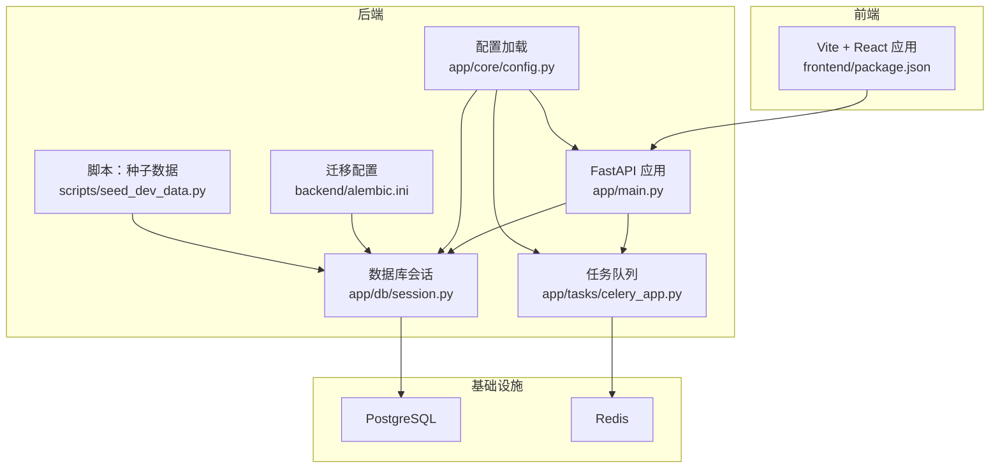
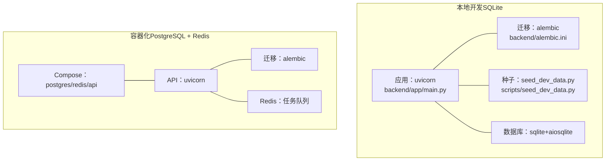
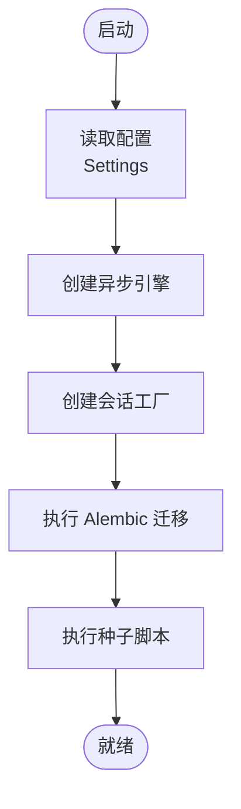
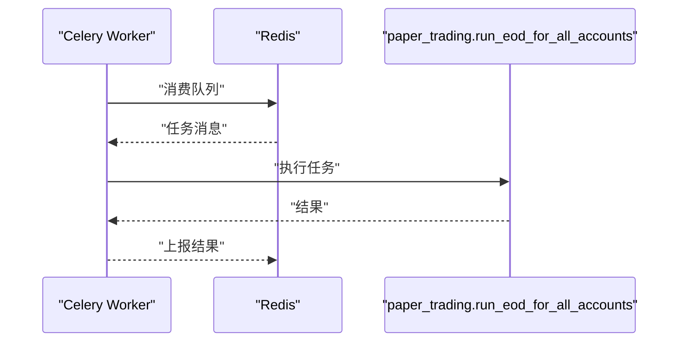
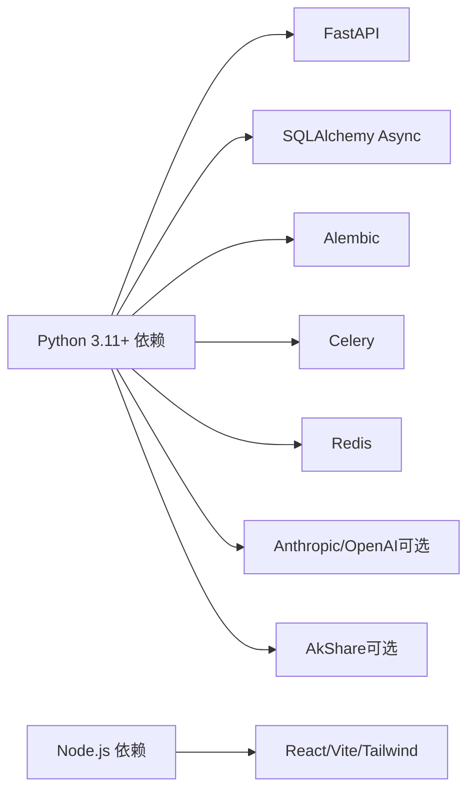

# 快速开始

<cite>
**本文引用的文件**
- [backend/README.md](file://backend/README.md)
- [backend/pyproject.toml](file://backend/pyproject.toml)
- [backend/Dockerfile](file://backend/Dockerfile)
- [deploy/docker-compose.yml](file://deploy/docker-compose.yml)
- [backend/alembic.ini](file://backend/alembic.ini)
- [backend/app/core/config.py](file://backend/app/core/config.py)
- [backend/app/db/session.py](file://backend/app/db/session.py)
- [backend/app/main.py](file://backend/app/main.py)
- [backend/app/tasks/celery_app.py](file://backend/app/tasks/celery_app.py)
- [backend/scripts/seed_dev_data.py](file://backend/scripts/seed_dev_data.py)
- [backend/scripts/import_market_data.py](file://backend/scripts/import_market_data.py)
- [frontend/package.json](file://frontend/package.json)
</cite>

## 目录
1. [简介](#简介)
2. [项目结构](#项目结构)
3. [核心组件](#核心组件)
4. [架构总览](#架构总览)
5. [详细组件分析](#详细组件分析)
6. [依赖关系分析](#依赖关系分析)
7. [性能注意事项](#性能注意事项)
8. [故障排查指南](#故障排查指南)
9. [结论](#结论)
10. [附录](#附录)

## 简介
本指南面向首次接触 llmine-quant 的开发者，帮助你在最短时间内完成本地开发环境搭建与系统运行。你将学会：
- 安装与配置 Python 3.11+、Node.js、PostgreSQL、Redis 等依赖
- 在本地运行 API 服务器与 Celery 工作进程
- 使用 Alembic 进行数据库迁移与开发数据种子填充
- 通过 Docker Compose 启动完整后端栈（PostgreSQL + Redis + API）
- 使用 SQLite 在本地进行 UI 开发与调试
- 常见问题排查与验证步骤

## 项目结构
后端采用 FastAPI + SQLAlchemy Async + Alembic 迁移；前端使用 Vite + React。部署层提供 Dockerfile 与 docker-compose.yml，便于一键拉起完整后端栈。

图表来源
- [backend/app/main.py:1-65](file://backend/app/main.py#L1-L65)
- [backend/app/core/config.py:1-196](file://backend/app/core/config.py#L1-L196)
- [backend/app/db/session.py:1-34](file://backend/app/db/session.py#L1-L34)
- [backend/app/tasks/celery_app.py:1-42](file://backend/app/tasks/celery_app.py#L1-L42)
- [backend/alembic.ini:1-111](file://backend/alembic.ini#L1-L111)
- [backend/scripts/seed_dev_data.py:1-185](file://backend/scripts/seed_dev_data.py#L1-L185)
- [frontend/package.json:1-43](file://frontend/package.json#L1-L43)

章节来源
- [backend/README.md:1-45](file://backend/README.md#L1-L45)
- [backend/pyproject.toml:1-78](file://backend/pyproject.toml#L1-L78)
- [deploy/docker-compose.yml:1-59](file://deploy/docker-compose.yml#L1-L59)

## 核心组件
- 应用入口与生命周期：FastAPI 应用在入口文件中注册路由、中间件与异常处理，并在 lifespan 中启动行情流。
- 配置系统：基于 pydantic-settings 的 Settings 类，支持从 .env 加载变量、自动检测 Claude/Codex 凭证、SQLite 路径归一化等。
- 数据库会话：异步 SQLAlchemy 引擎与会话工厂，支持 PostgreSQL 与 SQLite。
- 迁移系统：Alembic 配置位于 alembic.ini，版本目录在 app/db/migrations。
- 任务队列：Celery 应用与定时任务，使用 Redis 作为消息代理。
- 种子数据：脚本生成默认用户、角色、风控熔断与风险预算等开发数据。
- 前端：Vite + React，提供可视化界面与交互。

章节来源
- [backend/app/main.py:1-65](file://backend/app/main.py#L1-L65)
- [backend/app/core/config.py:1-196](file://backend/app/core/config.py#L1-L196)
- [backend/app/db/session.py:1-34](file://backend/app/db/session.py#L1-L34)
- [backend/alembic.ini:1-111](file://backend/alembic.ini#L1-L111)
- [backend/app/tasks/celery_app.py:1-42](file://backend/app/tasks/celery_app.py#L1-L42)
- [backend/scripts/seed_dev_data.py:1-185](file://backend/scripts/seed_dev_data.py#L1-L185)
- [frontend/package.json:1-43](file://frontend/package.json#L1-L43)

## 架构总览
下图展示了本地开发与容器化两种运行方式的关键差异：本地开发可直接使用 SQLite，容器化则通过 docker-compose 拉起 PostgreSQL 与 Redis。

图表来源
- [backend/README.md:24-31](file://backend/README.md#L24-L31)
- [deploy/docker-compose.yml:1-59](file://deploy/docker-compose.yml#L1-L59)
- [backend/Dockerfile:1-25](file://backend/Dockerfile#L1-L25)

## 详细组件分析

### 环境与依赖准备
- Python 3.11+：项目要求 Python >= 3.11，建议使用虚拟环境隔离依赖。
- Node.js：用于前端开发与构建，版本由前端工程 package.json 指定。
- PostgreSQL：默认数据库连接字符串指向 localhost:5432；如无 PostgreSQL，可使用 SQLite 模式。
- Redis：用于 Celery 任务队列与实时通信（WebSocket/订阅），可选但推荐在完整功能场景使用。

章节来源
- [backend/pyproject.toml:6](file://backend/pyproject.toml#L6)
- [backend/README.md:32-41](file://backend/README.md#L32-L41)
- [backend/app/core/config.py:57-67](file://backend/app/core/config.py#L57-L67)

### 本地开发环境设置（推荐）
- 安装依赖
  - 后端：在 backend 目录执行可编辑安装，包含 dev 与可选依赖。
  - 前端：在 frontend 目录安装依赖并启动开发服务器。
- 数据库迁移
  - 使用 Alembic 将数据库迁移到最新版本。
- 种子数据
  - 执行种子脚本，创建默认组织、用户、角色及风控配置。
- 启动 API 服务器
  - 使用 uvicorn 启动 FastAPI 应用，支持热更新。
- 启动 Celery 工作进程
  - 在另一个终端启动 Celery worker，监听任务队列。

章节来源
- [backend/README.md:5-22](file://backend/README.md#L5-L22)
- [backend/pyproject.toml:29-46](file://backend/pyproject.toml#L29-L46)
- [frontend/package.json:6-11](file://frontend/package.json#L6-L11)

### 使用 SQLite 本地开发模式
- 若未运行 PostgreSQL，可在 .env 中将 DATABASE_URL 指向 SQLite 文件路径（相对路径会被规范化为绝对路径）。
- 在 backend 目录执行迁移与种子脚本，然后启动 API 服务器即可。
- Redis 可选，HTTP API 当前不强制需要 Redis。

章节来源
- [backend/README.md:24-31](file://backend/README.md#L24-L31)
- [backend/app/core/config.py:177-195](file://backend/app/core/config.py#L177-L195)

### Docker 容器化部署
- 构建镜像
  - 使用 backend/Dockerfile 构建后端镜像。
- 启动服务
  - 使用 deploy/docker-compose.yml 启动 postgres、redis、api 三个服务。
  - API 服务会在启动时自动执行 Alembic 迁移并启动 uvicorn。
- 访问
  - API 文档地址：/docs（当服务运行时）

章节来源
- [backend/Dockerfile:1-25](file://backend/Dockerfile#L1-L25)
- [deploy/docker-compose.yml:1-59](file://deploy/docker-compose.yml#L1-L59)
- [backend/README.md:42-44](file://backend/README.md#L42-L44)

### 数据库迁移与会话
- 迁移配置
  - Alembic 配置文件定义了脚本位置、版本目录分隔符、日志级别等。
- 会话管理
  - 异步引擎与会话工厂根据 DATABASE_URL 自动选择驱动（PostgreSQL 或 SQLite）。
  - SQLite 模式下启用跨线程连接参数。

图表来源
- [backend/app/core/config.py:57-67](file://backend/app/core/config.py#L57-L67)
- [backend/app/db/session.py:10-21](file://backend/app/db/session.py#L10-L21)
- [backend/alembic.ini:58](file://backend/alembic.ini#L58)

章节来源
- [backend/alembic.ini:1-111](file://backend/alembic.ini#L1-L111)
- [backend/app/db/session.py:1-34](file://backend/app/db/session.py#L1-L34)

### 任务队列与定时任务
- Celery 应用
  - 以 Redis 为 broker 与 backend，默认包含 paper_trading 任务模块。
  - 配置序列化、时区、UTC 开关、任务追踪与每工人最大任务数等。
- 定时任务
  - 使用 Celery Beat 在工作日 15:30 触发盘后任务（Paper Trading）。

图表来源
- [backend/app/tasks/celery_app.py:15-41](file://backend/app/tasks/celery_app.py#L15-L41)

章节来源
- [backend/app/tasks/celery_app.py:1-42](file://backend/app/tasks/celery_app.py#L1-L42)

### 种子数据与市场数据导入
- 种子数据
  - 创建组织、用户、角色、用户角色分配、风控熔断与风险预算等。
- 市场数据导入
  - 支持从 CSV 或 AKShare 导入 A 股日线数据，可指定调整因子与日期范围。

章节来源
- [backend/scripts/seed_dev_data.py:12-22](file://backend/scripts/seed_dev_data.py#L12-L22)
- [backend/scripts/import_market_data.py:14-31](file://backend/scripts/import_market_data.py#L14-L31)

## 依赖关系分析
- 后端依赖
  - Web 框架：FastAPI、Uvicorn
  - ORM/数据库：SQLAlchemy[asyncio]、asyncpg、aiosqlite
  - 迁移：Alembic
  - 日志与指标：structlog、prometheus-client
  - 任务队列：Celery、Redis
  - 可选 LLM：Anthropic、OpenAI
  - 可选市场数据：AkShare
- 前端依赖
  - React 生态与构建工具链（Vite、TypeScript、TailwindCSS 等）

图表来源
- [backend/pyproject.toml:7-27](file://backend/pyproject.toml#L7-L27)
- [backend/pyproject.toml:39-46](file://backend/pyproject.toml#L39-L46)
- [frontend/package.json:12-24](file://frontend/package.json#L12-L24)

章节来源
- [backend/pyproject.toml:1-78](file://backend/pyproject.toml#L1-L78)
- [frontend/package.json:1-43](file://frontend/package.json#L1-L43)

## 性能注意事项
- 数据库连接
  - SQLite 适合本地 UI 开发；生产建议使用 PostgreSQL 并优化连接池参数。
- 任务队列
  - 合理设置 worker_max_tasks_per_child 与并发数，避免内存泄漏。
- 日志与指标
  - 结合 structlog 与 prometheus-client，按需调整日志级别与监控项。
- 前端构建
  - 生产构建时开启压缩与 Tree Shaking，减少包体积。

## 故障排查指南
- 无法连接数据库
  - 检查 DATABASE_URL 是否正确（PostgreSQL/SQLite）。SQLite 路径需在 backend 目录下解析为绝对路径。
  - 确认 Alembic 迁移是否成功执行。
- Redis 未启动或连接失败
  - 确认 Redis 服务健康；Celery 默认使用 REDIS_URL。
- API 无法访问
  - 确认 uvicorn 已启动且端口未被占用；检查 CORS 配置与防火墙。
- 前端无法联调
  - 确认后端 API 地址与跨域策略；前端开发服务器端口与后端端口一致。
- 常用验证步骤
  - 访问 /health 检查应用状态
  - 访问 /docs 查看 OpenAPI 文档
  - 执行种子脚本后查询默认用户与角色是否存在
  - 启动 Celery worker 后查看队列任务是否被消费

章节来源
- [backend/app/main.py:61-65](file://backend/app/main.py#L61-L65)
- [backend/README.md:42-44](file://backend/README.md#L42-L44)
- [backend/scripts/seed_dev_data.py:25-73](file://backend/scripts/seed_dev_data.py#L25-L73)
- [deploy/docker-compose.yml:47-51](file://deploy/docker-compose.yml#L47-L51)

## 结论
通过本指南，你可以快速完成 llmine-quant 的本地开发环境搭建：在本地使用 SQLite 快速验证功能，或通过 docker-compose 拉起完整后端栈。建议优先完成数据库迁移与种子数据填充，再启动 API 服务器与 Celery 工作进程，最后验证 /docs 与 /health 接口以确认系统可用性。

## 附录
- 环境变量参考
  - DATABASE_URL：数据库连接串（默认 PostgreSQL，可改为 SQLite）
  - REDIS_URL：Redis 连接串
  - SECRET_KEY：JWT 签名密钥
  - ENV：环境（development/staging/production）
  - LOG_LEVEL：日志级别
- 前端常用命令
  - dev/build/lint/preview：对应开发、构建、代码检查与预览

章节来源
- [backend/README.md:32-41](file://backend/README.md#L32-L41)
- [frontend/package.json:6-11](file://frontend/package.json#L6-L11)