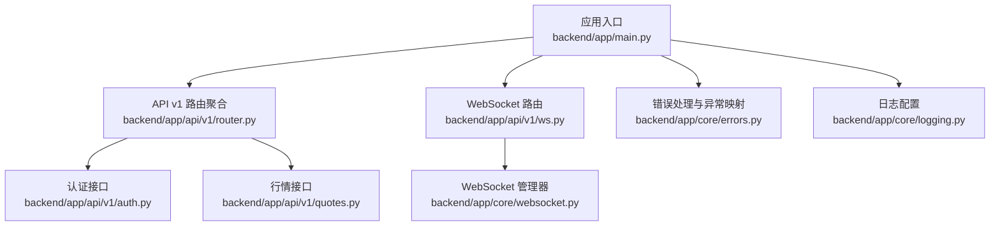
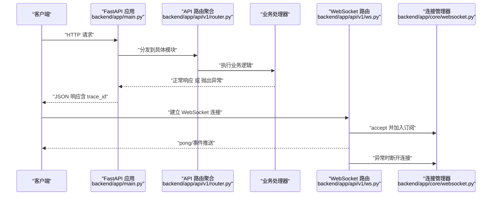
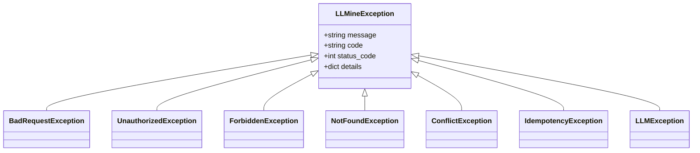
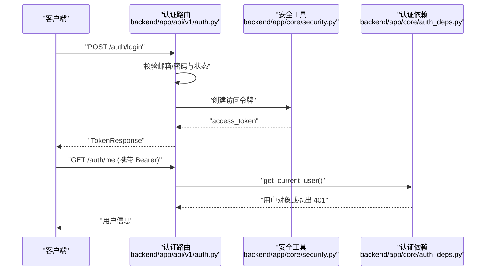
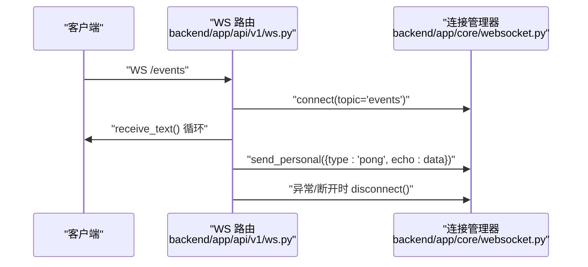
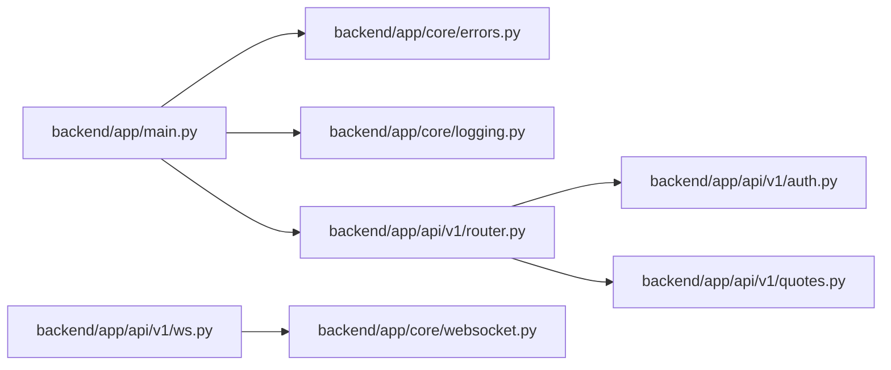

# API 错误排查

<cite>
**本文引用的文件**
- [backend/app/main.py](file://backend/app/main.py)
- [backend/app/core/errors.py](file://backend/app/core/errors.py)
- [backend/app/core/logging.py](file://backend/app/core/logging.py)
- [backend/app/core/auth_deps.py](file://backend/app/core/auth_deps.py)
- [backend/app/core/security.py](file://backend/app/core/security.py)
- [backend/app/api/v1/router.py](file://backend/app/api/v1/router.py)
- [backend/app/api/v1/auth.py](file://backend/app/api/v1/auth.py)
- [backend/app/api/v1/quotes.py](file://backend/app/api/v1/quotes.py)
- [backend/app/api/v1/ws.py](file://backend/app/api/v1/ws.py)
- [backend/app/core/websocket.py](file://backend/app/core/websocket.py)
</cite>

## 目录
1. [简介](#简介)
2. [项目结构](#项目结构)
3. [核心组件](#核心组件)
4. [架构总览](#架构总览)
5. [详细组件分析](#详细组件分析)
6. [依赖分析](#依赖分析)
7. [性能考虑](#性能考虑)
8. [故障排查指南](#故障排查指南)
9. [结论](#结论)
10. [附录](#附录)

## 简介
本指南面向 llmine-quant 后端服务的 API 错误排查，系统性梳理 HTTP 4xx/5xx 常见错误成因与定位方法，覆盖认证失败、权限不足、参数校验错误、业务逻辑异常等；同时提供 WebSocket 连接、消息格式、订阅失败等实时通道问题的诊断步骤，并给出性能监控、限流配置与错误日志分析的运维建议。

## 项目结构
后端采用 FastAPI 应用入口集中管理路由与中间件，API v1 路由聚合器统一挂载各功能模块；核心错误处理、认证依赖、安全工具与 WebSocket 管理器分别位于 core 子目录，便于跨模块复用与统一治理。

**图表来源**
- [backend/app/main.py:39-65](file://backend/app/main.py#L39-L65)
- [backend/app/api/v1/router.py:1-40](file://backend/app/api/v1/router.py#L1-L40)
- [backend/app/api/v1/ws.py:1-50](file://backend/app/api/v1/ws.py#L1-L50)
- [backend/app/core/errors.py:73-119](file://backend/app/core/errors.py#L73-L119)
- [backend/app/core/logging.py:11-41](file://backend/app/core/logging.py#L11-L41)
- [backend/app/api/v1/auth.py:47-194](file://backend/app/api/v1/auth.py#L47-L194)
- [backend/app/api/v1/quotes.py:16-129](file://backend/app/api/v1/quotes.py#L16-L129)
- [backend/app/core/websocket.py:10-45](file://backend/app/core/websocket.py#L10-L45)

**章节来源**
- [backend/app/main.py:39-65](file://backend/app/main.py#L39-L65)
- [backend/app/api/v1/router.py:1-40](file://backend/app/api/v1/router.py#L1-L40)

## 核心组件
- 应用入口与中间件：注册 CORS、链路追踪中间件、健康检查端点，统一异常处理器映射自定义异常与通用异常。
- 错误处理：定义统一的 LLMineException 及其子类（4xx/5xx），并提供 handle_llmine_exception 与 handle_generic_exception，确保所有错误以一致的 JSON 结构返回，包含 trace_id、code、message、details。
- 认证与授权：OAuth2PasswordBearer 提供 Bearer Token 流程，get_current_user/get_optional_user 依赖 JWT 解码与用户状态校验，缺失或无效令牌直接抛出 401。
- 安全工具：密码哈希、JWT 创建/解码、会话记录与撤销。
- 日志：结构化日志配置，支持生产环境 JSON 输出与开发控制台渲染。
- WebSocket：ConnectionManager 统一管理订阅主题与广播，WS 路由提供事件通道，quote_ws 支持订阅/退订与心跳。

**章节来源**
- [backend/app/main.py:39-65](file://backend/app/main.py#L39-L65)
- [backend/app/core/errors.py:13-119](file://backend/app/core/errors.py#L13-L119)
- [backend/app/core/auth_deps.py:15-53](file://backend/app/core/auth_deps.py#L15-L53)
- [backend/app/core/security.py:14-38](file://backend/app/core/security.py#L14-L38)
- [backend/app/core/logging.py:11-41](file://backend/app/core/logging.py#L11-L41)
- [backend/app/core/websocket.py:10-45](file://backend/app/core/websocket.py#L10-L45)
- [backend/app/api/v1/ws.py:12-50](file://backend/app/api/v1/ws.py#L12-L50)
- [backend/app/api/v1/quotes.py:85-129](file://backend/app/api/v1/quotes.py#L85-L129)

## 架构总览
下图展示从客户端到服务端的关键交互路径，以及错误拦截与日志输出位置。

**图表来源**
- [backend/app/main.py:39-65](file://backend/app/main.py#L39-L65)
- [backend/app/api/v1/router.py:25-40](file://backend/app/api/v1/router.py#L25-L40)
- [backend/app/api/v1/ws.py:12-50](file://backend/app/api/v1/ws.py#L12-L50)
- [backend/app/core/websocket.py:16-41](file://backend/app/core/websocket.py#L16-L41)

## 详细组件分析

### 错误处理与异常体系
- 自定义异常基类与常见子类：LLMineException、BadRequestException、UnauthorizedException、ForbiddenException、NotFoundException、ConflictException、IdempotencyException、LLMException。
- 异常处理器：
  - handle_llmine_exception：记录警告日志（包含 trace_id、路径、方法、状态码），返回统一 JSON 结构。
  - handle_generic_exception：记录异常日志，返回 500 内部错误。
- 应用入口注册：将自定义异常与通用异常映射到对应处理器。

**图表来源**
- [backend/app/core/errors.py:13-71](file://backend/app/core/errors.py#L13-L71)

**章节来源**
- [backend/app/core/errors.py:73-119](file://backend/app/core/errors.py#L73-L119)
- [backend/app/main.py:52-54](file://backend/app/main.py#L52-L54)

### 认证与授权流程
- 登录：校验邮箱/密码与账户状态，签发 JWT 并记录会话；失败返回 401/403。
- 刷新：校验旧令牌有效性与用户状态，签发新令牌并记录会话。
- 注销：按 token 哈希删除会话记录。
- 当前用户：依赖 OAuth2 Bearer，缺失或无效令牌返回 401；用户不存在或非活跃返回 401。

**图表来源**
- [backend/app/api/v1/auth.py:47-194](file://backend/app/api/v1/auth.py#L47-L194)
- [backend/app/core/security.py:24-38](file://backend/app/core/security.py#L24-L38)
- [backend/app/core/auth_deps.py:15-39](file://backend/app/core/auth_deps.py#L15-L39)

**章节来源**
- [backend/app/api/v1/auth.py:47-194](file://backend/app/api/v1/auth.py#L47-L194)
- [backend/app/core/auth_deps.py:15-53](file://backend/app/core/auth_deps.py#L15-L53)
- [backend/app/core/security.py:14-38](file://backend/app/core/security.py#L14-L38)

### WebSocket 实时通道
- 事件通道：/ws/events、/ws/strategy-events、/ws/execution-events、/ws/risk-events，统一通过 _make_ws_handler 包装，支持 ping/pong 心跳与断开清理。
- 行情通道：/quotes/ws，支持订阅/退订与缓存快照推送，异常时断开连接。
- 连接管理：ConnectionManager 维护 topic → WebSocket 列表，发送失败自动剔除失效连接。

**图表来源**
- [backend/app/api/v1/ws.py:12-50](file://backend/app/api/v1/ws.py#L12-L50)
- [backend/app/core/websocket.py:16-41](file://backend/app/core/websocket.py#L16-L41)

**章节来源**
- [backend/app/api/v1/ws.py:12-50](file://backend/app/api/v1/ws.py#L12-L50)
- [backend/app/core/websocket.py:10-45](file://backend/app/core/websocket.py#L10-L45)
- [backend/app/api/v1/quotes.py:85-129](file://backend/app/api/v1/quotes.py#L85-L129)

## 依赖分析
- 应用入口依赖错误处理与日志配置，统一异常映射与生命周期钩子。
- API 路由聚合器引入各模块路由，形成清晰的功能域划分。
- 认证模块依赖安全工具与数据库会话，确保令牌签发与用户状态校验。
- WebSocket 路由依赖连接管理器，保证事件广播与连接清理。

**图表来源**
- [backend/app/main.py:39-65](file://backend/app/main.py#L39-L65)
- [backend/app/api/v1/router.py:25-40](file://backend/app/api/v1/router.py#L25-L40)
- [backend/app/api/v1/auth.py:47-194](file://backend/app/api/v1/auth.py#L47-L194)
- [backend/app/api/v1/quotes.py:16-129](file://backend/app/api/v1/quotes.py#L16-L129)
- [backend/app/api/v1/ws.py:12-50](file://backend/app/api/v1/ws.py#L12-L50)
- [backend/app/core/websocket.py:10-45](file://backend/app/core/websocket.py#L10-L45)

**章节来源**
- [backend/app/main.py:39-65](file://backend/app/main.py#L39-L65)
- [backend/app/api/v1/router.py:25-40](file://backend/app/api/v1/router.py#L25-L40)

## 性能考虑
- 日志级别与渲染：生产环境启用 JSON 渲染，便于日志采集与检索；开发环境使用控制台渲染提升可观测性。
- 中间件与追踪：HTTP 中间件用于链路追踪，结合 trace_id 定位请求全链路。
- WebSocket 广播：发送失败自动剔除失效连接，减少无效广播；建议在高并发场景限制单 topic 的订阅上限并增加心跳检测。
- 认证与会话：登录/刷新/注销涉及数据库写入，建议对高频操作进行缓存与幂等键控制（冲突场景使用 ConflictException/IdempotencyException）。

**章节来源**
- [backend/app/core/logging.py:11-41](file://backend/app/core/logging.py#L11-L41)
- [backend/app/main.py:49-50](file://backend/app/main.py#L49-L50)
- [backend/app/core/websocket.py:27-41](file://backend/app/core/websocket.py#L27-L41)
- [backend/app/core/errors.py:52-63](file://backend/app/core/errors.py#L52-L63)

## 故障排查指南

### 一、HTTP 4xx/5xx 错误分类与定位
- 400 参数错误
  - 典型场景：缺少必要查询参数、参数格式不正确、业务输入非法。
  - 定位方法：检查路由层参数解析与业务层校验；查看 handle_llmine_exception 返回的 details 字段，确认具体字段与约束。
  - 关联文件：[backend/app/core/errors.py:31-36](file://backend/app/core/errors.py#L31-L36)，[backend/app/main.py:52-54](file://backend/app/main.py#L52-L54)

- 401 未认证
  - 典型场景：请求未携带 Authorization 头、Bearer 令牌缺失或无效、令牌过期。
  - 定位方法：确认 Authorization 头格式为 Bearer <token>；使用 get_current_user 依赖进行调试；检查 decode_access_token 是否成功。
  - 关联文件：[backend/app/core/auth_deps.py:15-39](file://backend/app/core/auth_deps.py#L15-L39)，[backend/app/core/security.py:32-38](file://backend/app/core/security.py#L32-L38)

- 403 权限不足/账户禁用
  - 典型场景：账户状态非 active、用户不存在或被禁用。
  - 定位方法：登录/刷新接口返回 403 时检查用户状态；get_current_user 对空用户直接抛 401。
  - 关联文件：[backend/app/api/v1/auth.py:63-64](file://backend/app/api/v1/auth.py#L63-L64)，[backend/app/core/auth_deps.py:34-38](file://backend/app/core/auth_deps.py#L34-L38)

- 404 资源不存在
  - 典型场景：查询的任务/策略/回测任务不存在。
  - 定位方法：检查业务层是否显式抛出 NotFoundException；核对 ID 是否正确。
  - 关联文件：[backend/app/core/errors.py:24-28](file://backend/app/core/errors.py#L24-L28)

- 409 冲突/幂等键冲突
  - 典型场景：重复提交、会话记录冲突。
  - 定位方法：使用 ConflictException/IdempotencyException 明确区分资源冲突与幂等键冲突；检查去重逻辑。
  - 关联文件：[backend/app/core/errors.py:52-63](file://backend/app/core/errors.py#L52-L63)

- 502 LLM 提供方错误
  - 典型场景：LLM 供应商网络异常、解析错误。
  - 定位方法：捕获 LLMException 并记录 trace_id；检查 LLM 提供商配置与网络连通性。
  - 关联文件：[backend/app/core/errors.py:66-71](file://backend/app/core/errors.py#L66-L71)

- 500 未处理异常
  - 典型场景：业务逻辑未捕获的异常。
  - 定位方法：查看 handle_generic_exception 日志中的 error 字段与 trace_id；补充 try/catch 并抛出自定义异常。
  - 关联文件：[backend/app/core/errors.py:98-119](file://backend/app/core/errors.py#L98-L119)，[backend/app/main.py:53-54](file://backend/app/main.py#L53-L54)

### 二、请求参数检查清单
- 必填参数：确认所有 Query/Body 字段均已传入。
- 格式校验：日期格式、枚举值、数值范围、字符串长度。
- 业务约束：策略家族/频率/调整方式等取值范围。
- 参考文件：
  - [backend/app/api/v1/quotes.py:16-81](file://backend/app/api/v1/quotes.py#L16-L81)
  - [backend/app/api/v1/auth.py:33-41](file://backend/app/api/v1/auth.py#L33-L41)

### 三、响应格式验证
- 统一结构：code、message、details、trace_id。
- 4xx/5xx 均返回相同结构，便于前端统一处理。
- 参考文件：
  - [backend/app/core/errors.py:73-95](file://backend/app/core/errors.py#L73-L95)

### 四、WebSocket 连接与消息诊断
- 连接失败
  - 检查 WS 地址与路径是否正确（/ws/*）；确认服务器已启动并暴露相应端口。
  - 查看 handle_llmine_exception 日志中的 trace_id 与路径，定位异常发生点。
  - 参考文件：[backend/app/api/v1/ws.py:28-50](file://backend/app/api/v1/ws.py#L28-L50)，[backend/app/main.py:58](file://backend/app/main.py#L58)

- 订阅失败
  - 行情 WS 消息格式：{"action":"subscribe","symbols":["..."]}；{"action":"unsubscribe","symbols":["..."]}；{"action":"ping"}。
  - 若订阅后无快照/推送，检查 quote_stream 订阅与缓存逻辑。
  - 参考文件：[backend/app/api/v1/quotes.py:85-129](file://backend/app/api/v1/quotes.py#L85-L129)

- 断线与清理
  - WebSocketDisconnect 或异常时会调用 disconnect；若频繁断线，检查客户端心跳与网络稳定性。
  - 参考文件：[backend/app/api/v1/ws.py:19-23](file://backend/app/api/v1/ws.py#L19-L23)，[backend/app/core/websocket.py:21-25](file://backend/app/core/websocket.py#L21-L25)

### 五、性能监控与限流
- 性能指标
  - 使用 trace_id 关联请求链路；结合日志时间戳与响应耗时评估瓶颈。
  - 参考文件：[backend/app/core/errors.py:77-86](file://backend/app/core/errors.py#L77-L86)，[backend/app/core/logging.py:19-35](file://backend/app/core/logging.py#L19-L35)

- 限流配置
  - 在网关或中间件层设置速率限制，避免突发流量导致 5xx；对认证/刷新等高成本接口单独限流。
  - 参考文件：[backend/app/main.py:49](file://backend/app/main.py#L49)

- 错误日志分析
  - 生产环境使用 JSON 日志，便于采集与检索；关注 request_error/unhandled_exception 计数与错误类型分布。
  - 参考文件：[backend/app/core/logging.py:11-41](file://backend/app/core/logging.py#L11-L41)，[backend/app/core/errors.py:78-86](file://backend/app/core/errors.py#L78-L86)，[backend/app/core/errors.py:103-109](file://backend/app/core/errors.py#L103-L109)

## 结论
通过统一的异常体系、结构化日志与清晰的路由组织，llmine-quant 的 API 错误排查具备良好的可追溯性与可维护性。建议在生产环境中强化 WebSocket 心跳与断线重连策略、完善参数校验与业务约束提示，并结合 trace_id 与日志进行持续监控与优化。

## 附录
- 常用端点参考
  - 认证：POST /api/v1/auth/login、POST /api/v1/auth/register、POST /api/v1/auth/refresh、POST /api/v1/auth/logout、GET /api/v1/auth/me
  - 行情：GET /api/v1/data/history、GET /api/v1/data/snapshot、GET /api/v1/data/market、GET /api/v1/quotes/ws
  - WebSocket：/ws/events、/ws/strategy-events、/ws/execution-events、/ws/risk-events
- 参考文件：
  - [backend/app/api/v1/auth.py:47-194](file://backend/app/api/v1/auth.py#L47-L194)
  - [backend/app/api/v1/quotes.py:16-129](file://backend/app/api/v1/quotes.py#L16-L129)
  - [backend/app/api/v1/ws.py:28-50](file://backend/app/api/v1/ws.py#L28-L50)