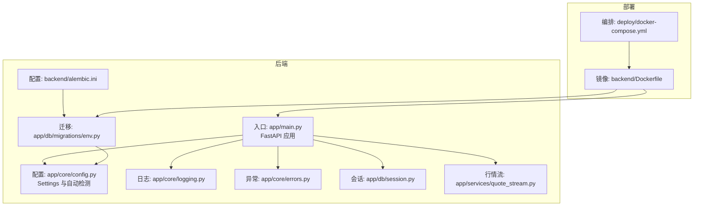
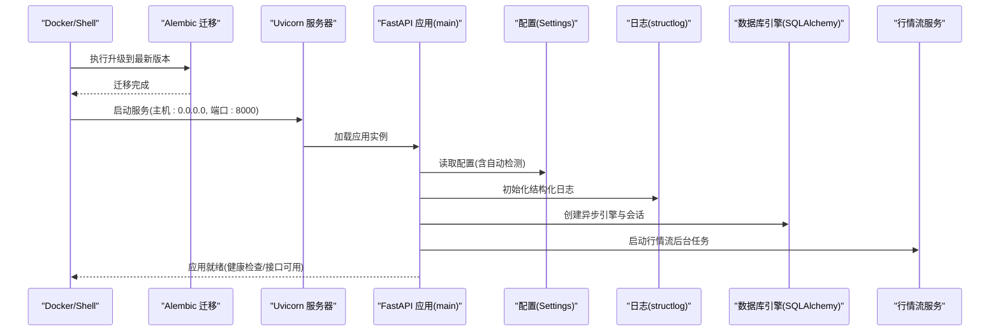
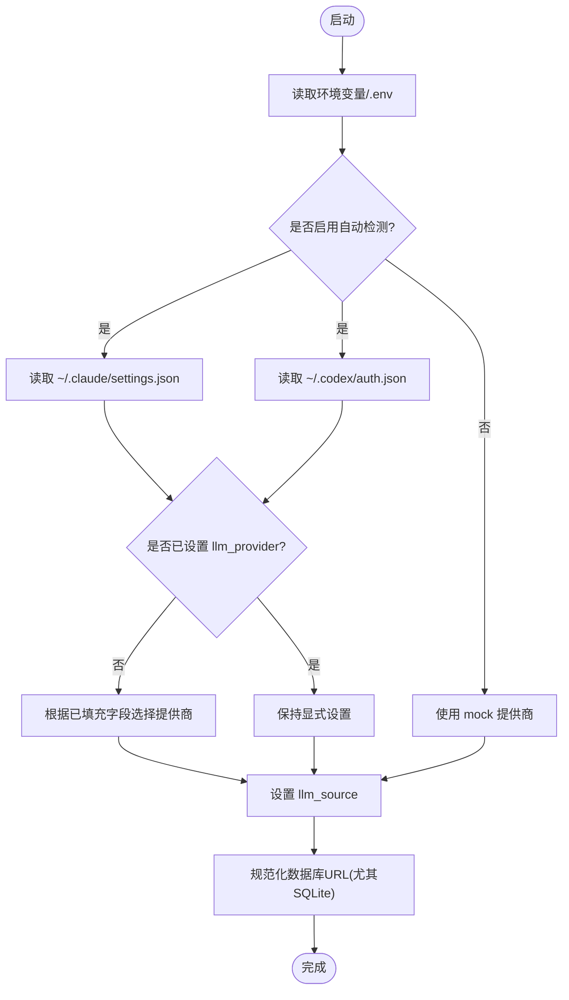
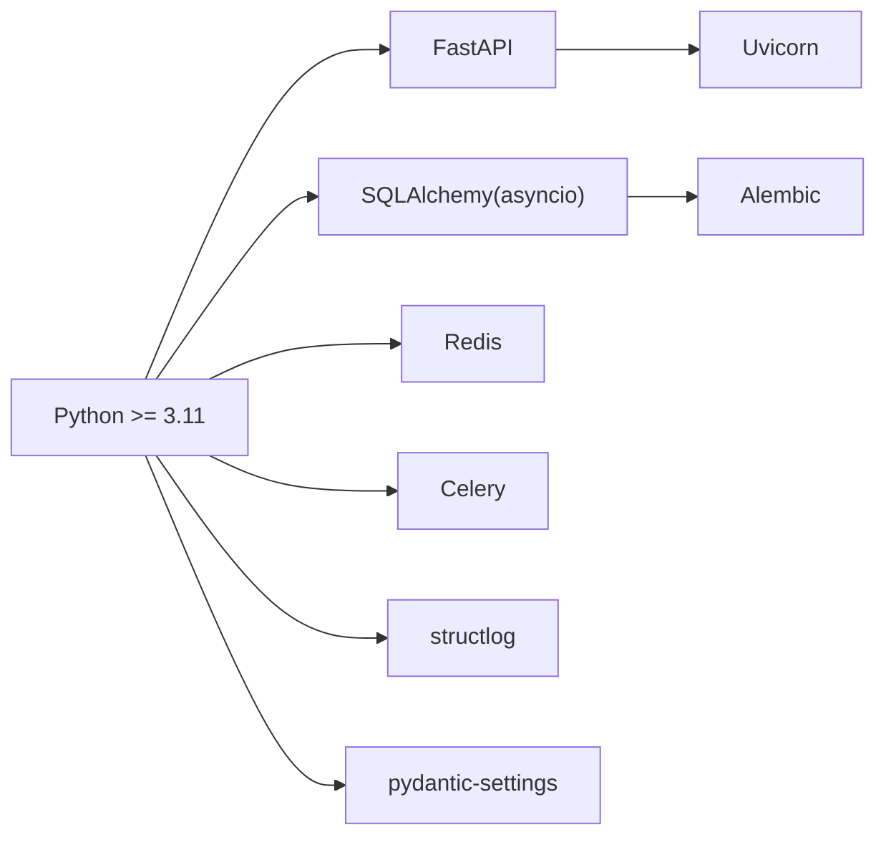

# 启动问题排查

<cite>
**本文引用的文件**
- [backend/app/main.py](file://backend/app/main.py)
- [backend/app/core/config.py](file://backend/app/core/config.py)
- [backend/app/core/logging.py](file://backend/app/core/logging.py)
- [backend/app/core/errors.py](file://backend/app/core/errors.py)
- [backend/app/db/session.py](file://backend/app/db/session.py)
- [backend/app/db/migrations/env.py](file://backend/app/db/migrations/env.py)
- [backend/alembic.ini](file://backend/alembic.ini)
- [backend/Dockerfile](file://backend/Dockerfile)
- [deploy/docker-compose.yml](file://deploy/docker-compose.yml)
- [backend/README.md](file://backend/README.md)
- [backend/scripts/seed_dev_data.py](file://backend/scripts/seed_dev_data.py)
- [backend/app/services/quote_stream.py](file://backend/app/services/quote_stream.py)
</cite>

## 目录
1. [简介](#简介)
2. [项目结构](#项目结构)
3. [核心组件](#核心组件)
4. [架构总览](#架构总览)
5. [详细组件分析](#详细组件分析)
6. [依赖分析](#依赖分析)
7. [性能考虑](#性能考虑)
8. [故障排查指南](#故障排查指南)
9. [结论](#结论)
10. [附录](#附录)

## 简介
本指南聚焦于 llmine-quant 后端在本地与 Docker 环境下的启动问题排查，覆盖配置文件错误、环境变量缺失、依赖安装问题、端口冲突、数据库迁移失败、容器健康检查失败、网络连通性等问题，并提供可操作的检查清单、日志分析方法与分步诊断流程。读者无需深厚的后端背景，也可按步骤快速定位并解决问题。

## 项目结构
后端采用 FastAPI + 异步 SQLAlchemy + Alembic 迁移 + Redis/PostgreSQL 的典型服务化架构；Docker Compose 提供数据库与 API 服务编排。关键启动路径为：Dockerfile 中的 CMD 在启动时先执行数据库迁移，再启动 Uvicorn 服务器；本地开发通过 README 给出的命令顺序运行。

图表来源
- [backend/app/main.py:1-65](file://backend/app/main.py#L1-L65)
- [backend/app/core/config.py:48-196](file://backend/app/core/config.py#L48-L196)
- [backend/app/core/logging.py:11-41](file://backend/app/core/logging.py#L11-L41)
- [backend/app/core/errors.py:13-119](file://backend/app/core/errors.py#L13-L119)
- [backend/app/db/session.py:1-34](file://backend/app/db/session.py#L1-L34)
- [backend/app/db/migrations/env.py:46-84](file://backend/app/db/migrations/env.py#L46-L84)
- [backend/alembic.ini:1-111](file://backend/alembic.ini#L1-L111)
- [backend/Dockerfile:1-25](file://backend/Dockerfile#L1-L25)
- [deploy/docker-compose.yml:1-59](file://deploy/docker-compose.yml#L1-L59)

章节来源
- [backend/README.md:1-45](file://backend/README.md#L1-L45)
- [backend/Dockerfile:1-25](file://backend/Dockerfile#L1-L25)
- [deploy/docker-compose.yml:1-59](file://deploy/docker-compose.yml#L1-L59)

## 核心组件
- 配置加载与自动检测：从环境变量与用户目录自动填充 LLM 凭证，规范化数据库 URL（尤其是 SQLite 相对路径）。
- 日志系统：基于 structlog 的结构化日志，支持生产 JSON 渲染与开发台式控制台渲染。
- 数据库引擎与会话：异步 SQLAlchemy 引擎与会话工厂，支持 SQLite/PostgreSQL。
- 迁移环境：Alembic 读取配置中的数据库 URL 并覆盖迁移上下文。
- 应用生命周期：FastAPI lifespan 在启动时记录启动日志并启动行情流，在关闭时停止。
- 错误处理：统一异常映射为标准 JSON 响应，便于前端与运维定位。

章节来源
- [backend/app/core/config.py:48-196](file://backend/app/core/config.py#L48-L196)
- [backend/app/core/logging.py:11-41](file://backend/app/core/logging.py#L11-L41)
- [backend/app/db/session.py:1-34](file://backend/app/db/session.py#L1-L34)
- [backend/app/db/migrations/env.py:46-84](file://backend/app/db/migrations/env.py#L46-L84)
- [backend/app/main.py:20-65](file://backend/app/main.py#L20-L65)
- [backend/app/core/errors.py:13-119](file://backend/app/core/errors.py#L13-L119)

## 架构总览
下图展示启动时序：容器或本地启动后，先执行数据库迁移，再启动 Uvicorn；应用启动时初始化日志、注册中间件与路由，随后启动行情流服务。

图表来源
- [backend/Dockerfile:23-25](file://backend/Dockerfile#L23-L25)
- [deploy/docker-compose.yml:54-54](file://deploy/docker-compose.yml#L54-L54)
- [backend/app/main.py:20-65](file://backend/app/main.py#L20-L65)
- [backend/app/core/config.py:193-196](file://backend/app/core/config.py#L193-L196)
- [backend/app/core/logging.py:11-41](file://backend/app/core/logging.py#L11-L41)
- [backend/app/db/session.py:10-21](file://backend/app/db/session.py#L10-L21)
- [backend/app/services/quote_stream.py:73-82](file://backend/app/services/quote_stream.py#L73-L82)

## 详细组件分析

### 配置与自动检测
- 支持从用户目录自动读取 Claude/Codex 凭证，优先级：显式环境变量 > Claude 设置 > Codex 设置 > mock。
- 自动选择 LLM 提供商（Anthropic/OpenAI/Mock），并在启动日志中输出 llm_source 以辅助诊断。
- 对 SQLite 相对路径进行归一化，避免不同工作目录导致的数据文件不一致。

图表来源
- [backend/app/core/config.py:110-172](file://backend/app/core/config.py#L110-L172)
- [backend/app/core/config.py:177-196](file://backend/app/core/config.py#L177-L196)

章节来源
- [backend/app/core/config.py:48-196](file://backend/app/core/config.py#L48-L196)

### 日志系统
- 基于 structlog 的结构化日志，生产环境输出 JSON，开发环境输出控制台格式。
- 日志级别由配置决定，默认 INFO；可通过 LOG_LEVEL 调整。

章节来源
- [backend/app/core/logging.py:11-41](file://backend/app/core/logging.py#L11-L41)
- [backend/app/core/config.py:55-55](file://backend/app/core/config.py#L55-L55)

### 数据库与迁移
- 使用异步 SQLAlchemy 引擎，SQLite 时设置线程相关参数。
- Alembic 通过 env.py 从配置中读取数据库 URL 并覆盖迁移上下文。
- alembic.ini 指定脚本位置与日志级别。

章节来源
- [backend/app/db/session.py:10-21](file://backend/app/db/session.py#L10-L21)
- [backend/app/db/migrations/env.py:55-59](file://backend/app/db/migrations/env.py#L55-L59)
- [backend/alembic.ini:58-58](file://backend/alembic.ini#L58-L58)

### 应用生命周期与健康检查
- FastAPI lifespan 在启动时打印关键配置与 LLM 来源，启动行情流；在关闭时停止行情流。
- 提供 /health 健康检查端点，返回版本号与状态。

章节来源
- [backend/app/main.py:20-65](file://backend/app/main.py#L20-L65)
- [backend/app/services/quote_stream.py:73-82](file://backend/app/services/quote_stream.py#L73-L82)

### 错误处理
- 自定义异常类映射为标准 JSON 响应，包含 trace_id、code、message、details。
- 未捕获异常统一返回 500。

章节来源
- [backend/app/core/errors.py:13-119](file://backend/app/core/errors.py#L13-L119)

## 依赖分析
- Python 版本要求：后端 pyproject.toml 明确要求 Python >= 3.11。
- 关键依赖：FastAPI、Uvicorn、SQLAlchemy(asyncio)、Alembic、Redis、Celery、structlog、pydantic-settings 等。
- 可选依赖：llm(openai/anthropic)、market-data(akshare/pandas)。

图表来源
- [backend/pyproject.toml:6-27](file://backend/pyproject.toml#L6-L27)

章节来源
- [backend/pyproject.toml:1-78](file://backend/pyproject.toml#L1-L78)

## 性能考虑
- 行情轮询间隔：交易时间内按配置轮询，非交易时间延长至 30 秒，避免无效请求。
- SQLite 与 PostgreSQL：SQLite 适合本地开发，生产建议 PostgreSQL；注意连接参数差异。
- 日志开销：生产环境 JSON 渲染与结构化字段会增加序列化成本，需结合实际吞吐评估。

章节来源
- [backend/app/services/quote_stream.py:121-123](file://backend/app/services/quote_stream.py#L121-L123)
- [backend/app/db/session.py:11-12](file://backend/app/db/session.py#L11-L12)
- [backend/app/core/logging.py:27-27](file://backend/app/core/logging.py#L27-L27)

## 故障排查指南

### 一、本地启动失败排查清单
- 确认 Python 版本满足要求（>= 3.11）
  - 参考：[backend/pyproject.toml:6-6](file://backend/pyproject.toml#L6-L6)
- 安装依赖
  - 使用可编辑安装 dev 依赖，确保 Uvicorn、Alembic、SQLAlchemy 等可用
  - 参考：[backend/README.md:8-10](file://backend/README.md#L8-L10)
- 数据库准备
  - 若使用 PostgreSQL：确认服务运行、凭据正确、数据库存在
  - 若使用 SQLite：确保 DATABASE_URL 指向相对或绝对路径且工作目录正确
  - 参考：[backend/app/core/config.py:177-196](file://backend/app/core/config.py#L177-L196)
- 执行数据库迁移
  - 参考：[backend/README.md:11-12](file://backend/README.md#L11-L12)
- 导入示例数据（可选）
  - 参考：[backend/README.md:14-15](file://backend/README.md#L14-L15)
- 启动 API 服务
  - 参考：[backend/README.md:17-18](file://backend/README.md#L17-L18)
- 启动 Celery Worker（如需任务队列）
  - 参考：[backend/README.md:20-21](file://backend/README.md#L20-L21)

### 二、Docker 启动失败排查清单
- 镜像构建失败
  - 检查系统依赖安装（gcc、libpq-dev）是否成功
  - 参考：[backend/Dockerfile:6-9](file://backend/Dockerfile#L6-L9)
  - 检查 pip 安装可编辑包是否成功
  - 参考：[backend/Dockerfile:12-13](file://backend/Dockerfile#L12-L13)
- 容器启动后立即退出
  - 查看容器日志，确认迁移是否成功
  - 参考：[backend/Dockerfile:24-24](file://backend/Dockerfile#L24-L24)
  - 确认数据库与 Redis 健康检查通过后再启动 API
  - 参考：[deploy/docker-compose.yml:47-51](file://deploy/docker-compose.yml#L47-L51)
- 端口冲突
  - 默认暴露 8000 端口，若被占用请修改映射或释放端口
  - 参考：[backend/Dockerfile:21-21](file://backend/Dockerfile#L21-L21)
  - 参考：[deploy/docker-compose.yml:45-46](file://deploy/docker-compose.yml#L45-L46)
- 网络连通性
  - 确认 API 服务能访问数据库与 Redis（容器名作为主机名）
  - 参考：[deploy/docker-compose.yml:40-41](file://deploy/docker-compose.yml#L40-L41)
- 健康检查失败
  - Postgres/Redis 健康检查失败通常表示服务未就绪或凭据错误
  - 参考：[deploy/docker-compose.yml:15-19](file://deploy/docker-compose.yml#L15-L19)
  - 参考：[deploy/docker-compose.yml:28-32](file://deploy/docker-compose.yml#L28-L32)

### 三、常见错误与解决方案
- 配置文件错误
  - .env 缺失或字段拼写错误：核对 DATABASE_URL、REDIS_URL、SECRET_KEY、ENV、LOG_LEVEL
  - 参考：[backend/app/core/config.py:105-107](file://backend/app/core/config.py#L105-L107)
  - 参考：[backend/README.md:32-41](file://backend/README.md#L32-L41)
- 环境变量缺失
  - LLM 提供商未配置：自动检测会回退到 mock，但可能影响功能
  - 参考：[backend/app/core/config.py:110-172](file://backend/app/core/config.py#L110-L172)
- 依赖包安装问题
  - Python 版本过低：升级至 3.11+
  - 参考：[backend/pyproject.toml:6-6](file://backend/pyproject.toml#L6-L6)
  - 缺少系统依赖：在容器中安装 gcc、libpq-dev
  - 参考：[backend/Dockerfile:6-9](file://backend/Dockerfile#L6-L9)
- 端口冲突
  - 修改 docker-compose 端口映射或释放宿主端口
  - 参考：[deploy/docker-compose.yml:45-46](file://deploy/docker-compose.yml#L45-L46)
- 数据库迁移失败
  - 确认 DATABASE_URL 正确，Alembic 能读取到配置
  - 参考：[backend/app/db/migrations/env.py:55-59](file://backend/app/db/migrations/env.py#L55-L59)
  - 参考：[backend/alembic.ini:58-58](file://backend/alembic.ini#L58-L58)
- 容器健康检查失败
  - Postgres/Redis 未就绪或凭据错误
  - 参考：[deploy/docker-compose.yml:15-19](file://deploy/docker-compose.yml#L15-L19)
  - 参考：[deploy/docker-compose.yml:28-32](file://deploy/docker-compose.yml#L28-L32)
- 行情流无法启动
  - 检查市场数据提供商配置与网络可达性
  - 参考：[backend/app/services/quote_stream.py:73-76](file://backend/app/services/quote_stream.py#L73-L76)

### 四、日志分析方法
- 启动阶段
  - 观察 lifespan 启动日志，确认 app_name、version、env、llm_provider、llm_source、market_data_provider 等字段
  - 参考：[backend/app/main.py:23-32](file://backend/app/main.py#L23-L32)
- 运行阶段
  - 使用 /health 端点确认服务可用
  - 参考：[backend/app/main.py:61-64](file://backend/app/main.py#L61-L64)
- 错误阶段
  - 通过错误处理器返回的 trace_id 快速定位请求链路
  - 参考：[backend/app/core/errors.py:73-95](file://backend/app/core/errors.py#L73-L95)
- 结构化日志
  - 生产环境输出 JSON，便于日志平台采集与检索
  - 参考：[backend/app/core/logging.py:27-27](file://backend/app/core/logging.py#L27-L27)

### 五、配置验证步骤
- 环境变量核对
  - DATABASE_URL、REDIS_URL、SECRET_KEY、ENV、LOG_LEVEL
  - 参考：[backend/README.md:32-41](file://backend/README.md#L32-L41)
- 配置加载验证
  - 启动后查看 lifespan 日志中的 llm_provider 与 llm_source
  - 参考：[backend/app/main.py:23-32](file://backend/app/main.py#L23-L32)
- 数据库连接验证
  - 尝试创建会话与基础查询，确认连接字符串有效
  - 参考：[backend/app/db/session.py:14-21](file://backend/app/db/session.py#L14-L21)

### 六、依赖检查流程
- Python 版本
  - 参考：[backend/pyproject.toml:6-6](file://backend/pyproject.toml#L6-L6)
- 关键依赖
  - FastAPI、Uvicorn、SQLAlchemy、Alembic、Redis、Celery、structlog、pydantic-settings
  - 参考：[backend/pyproject.toml:7-27](file://backend/pyproject.toml#L7-L27)
- 可选依赖
  - llm(openai/anthropic)、market-data(akshare/pandas)
  - 参考：[backend/pyproject.toml:39-46](file://backend/pyproject.toml#L39-L46)

### 七、Docker 专项诊断
- 构建阶段
  - 检查 apt 安装与 pip 安装日志
  - 参考：[backend/Dockerfile:6-13](file://backend/Dockerfile#L6-L13)
- 运行阶段
  - 查看容器日志，确认迁移与启动顺序
  - 参考：[backend/Dockerfile:24-24](file://backend/Dockerfile#L24-L24)
  - 确认依赖服务健康
  - 参考：[deploy/docker-compose.yml:47-51](file://deploy/docker-compose.yml#L47-L51)

## 结论
启动问题多源于配置、依赖与网络三类因素。建议按“配置—依赖—网络”的顺序逐项排查，并结合结构化日志与健康检查端点快速定位根因。Docker 场景下优先保证依赖服务健康与端口映射正确，再关注应用内部迁移与启动流程。

## 附录

### A. 启动检查清单（本地）
- [ ] Python 版本满足要求
- [ ] 安装 dev 依赖
- [ ] 配置 .env 文件
- [ ] 数据库可用（PostgreSQL 或 SQLite）
- [ ] 执行数据库迁移
- [ ] 导入示例数据（可选）
- [ ] 启动 API 服务
- [ ] 启动 Celery Worker（可选）

章节来源
- [backend/README.md:8-22](file://backend/README.md#L8-L22)

### B. 启动检查清单（Docker）
- [ ] 构建镜像成功
- [ ] 依赖服务(Postgres/Redis)健康
- [ ] 端口映射无冲突
- [ ] 容器日志显示迁移成功
- [ ] /health 返回正常响应

章节来源
- [backend/Dockerfile:23-25](file://backend/Dockerfile#L23-L25)
- [deploy/docker-compose.yml:15-32](file://deploy/docker-compose.yml#L15-L32)
- [deploy/docker-compose.yml:45-54](file://deploy/docker-compose.yml#L45-L54)