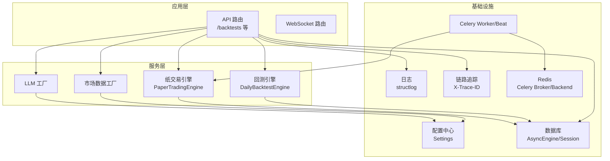
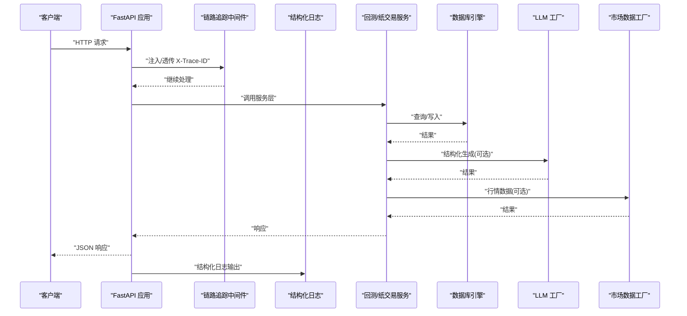
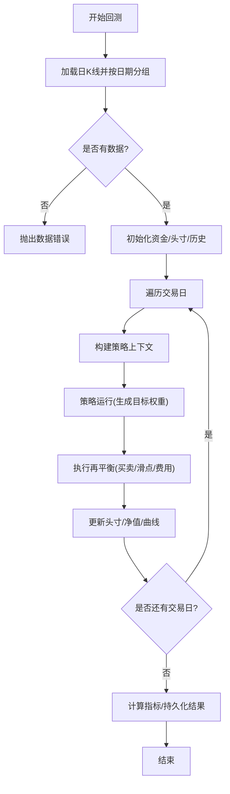
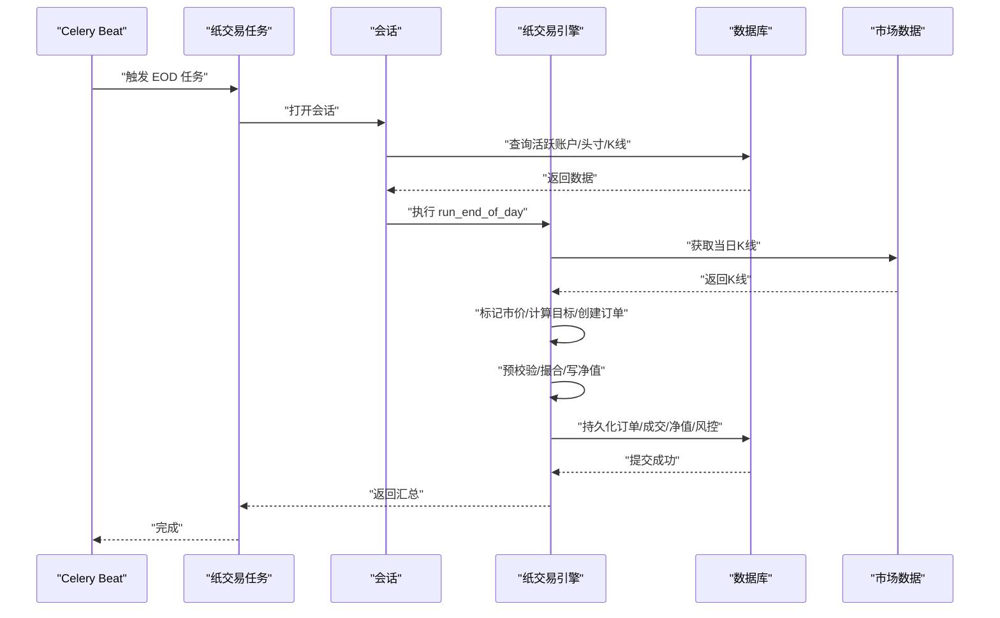
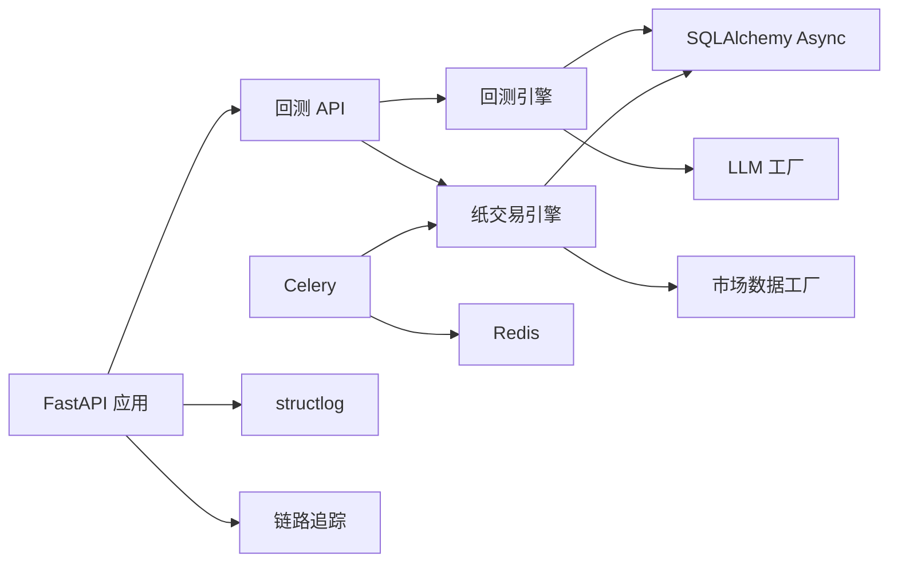

# 性能瓶颈排查

<cite>
**本文引用的文件**
- [backend/app/main.py](file://backend/app/main.py)
- [backend/app/core/config.py](file://backend/app/core/config.py)
- [backend/app/core/logging.py](file://backend/app/core/logging.py)
- [backend/app/core/tracing.py](file://backend/app/core/tracing.py)
- [backend/app/db/session.py](file://backend/app/db/session.py)
- [backend/app/tasks/celery_app.py](file://backend/app/tasks/celery_app.py)
- [backend/app/tasks/paper_trading.py](file://backend/app/tasks/paper_trading.py)
- [backend/app/services/daily_backtest.py](file://backend/app/services/daily_backtest.py)
- [backend/app/services/paper_trading.py](file://backend/app/services/paper_trading.py)
- [backend/app/api/v1/backtests.py](file://backend/app/api/v1/backtests.py)
- [backend/app/integrations/llm/factory.py](file://backend/app/integrations/llm/factory.py)
- [backend/app/integrations/market_data/factory.py](file://backend/app/integrations/market_data/factory.py)
- [backend/pyproject.toml](file://backend/pyproject.toml)
- [backend/README.md](file://backend/README.md)
</cite>

## 目录
1. [简介](#简介)
2. [项目结构](#项目结构)
3. [核心组件](#核心组件)
4. [架构总览](#架构总览)
5. [详细组件分析](#详细组件分析)
6. [依赖分析](#依赖分析)
7. [性能考虑](#性能考虑)
8. [故障排查指南](#故障排查指南)
9. [结论](#结论)
10. [附录](#附录)

## 简介
本指南面向 llmine-quant 后端系统，聚焦于性能瓶颈的识别与优化。内容涵盖 CPU 使用率过高、内存泄漏、数据库查询缓慢、API 响应时间过长等常见问题的诊断流程，并深入解析回测性能优化、任务调度优化、缓存策略优化等关键优化点。同时提供性能监控指标设置、APM 工具使用、性能分析工具配置等实用技巧，以及负载测试方法、压力测试场景设计和性能基准测试的实施建议。

## 项目结构
后端采用 FastAPI + SQLAlchemy Async + Celery 的异步架构，核心模块包括：
- 应用入口与中间件：FastAPI 应用、CORS、日志、链路追踪
- 配置中心：环境变量驱动的 Settings，支持数据库、Redis、LLM、市场数据等配置
- 数据层：异步数据库引擎与会话管理
- 业务服务：回测引擎、纸交易引擎、LLM/市场数据工厂
- 任务队列：Celery + Redis，定时执行 EOD 纸交易
- API 层：回测相关接口，支持任务创建、报告、折线图等

图表来源
- [backend/app/main.py:39-65](file://backend/app/main.py#L39-L65)
- [backend/app/api/v1/backtests.py:445-552](file://backend/app/api/v1/backtests.py#L445-L552)
- [backend/app/services/daily_backtest.py:185-284](file://backend/app/services/daily_backtest.py#L185-L284)
- [backend/app/services/paper_trading.py:76-135](file://backend/app/services/paper_trading.py#L76-L135)
- [backend/app/db/session.py:14-34](file://backend/app/db/session.py#L14-L34)
- [backend/app/tasks/celery_app.py:15-42](file://backend/app/tasks/celery_app.py#L15-L42)
- [backend/app/integrations/llm/factory.py:11-66](file://backend/app/integrations/llm/factory.py#L11-L66)
- [backend/app/integrations/market_data/factory.py:23-56](file://backend/app/integrations/market_data/factory.py#L23-L56)

章节来源
- [backend/app/main.py:1-65](file://backend/app/main.py#L1-L65)
- [backend/app/core/config.py:48-196](file://backend/app/core/config.py#L48-L196)
- [backend/app/db/session.py:1-34](file://backend/app/db/session.py#L1-L34)
- [backend/app/tasks/celery_app.py:1-42](file://backend/app/tasks/celery_app.py#L1-L42)
- [backend/app/api/v1/backtests.py:1-120](file://backend/app/api/v1/backtests.py#L1-L120)

## 核心组件
- 应用生命周期与中间件
  - FastAPI 应用在 lifespan 中启动行情流、记录启动日志，关闭时停止行情流
  - 添加 CORS、HTTP 链路追踪中间件、统一异常处理
- 配置中心
  - Settings 统一加载 DATABASE_URL、REDIS_URL、LLM 提供商、市场数据提供商等
  - 支持从用户主目录自动检测 Claude/Codex 凭据，简化本地开发体验
- 日志与链路追踪
  - structlog JSON 输出，生产环境结构化日志便于 APM 分析
  - X-Trace-ID 注入与透传，结合上下文变量实现请求级追踪
- 数据库
  - 异步 SQLAlchemy 引擎，SQLite/PG 可切换；会话工厂按需创建与回收
- 任务队列
  - Celery + Redis，beat 定时 EOD 纸交易；worker 配置了任务序列化、UTC、延迟确认、单进程最大任务数等
- 业务引擎
  - 回测引擎：按日循环、按策略计算目标权重、执行再平衡、持久化指标与成交明细
  - 纸交易引擎：每日标记市价、信号、预校验、撮合、写入净值与风控检查

章节来源
- [backend/app/main.py:20-65](file://backend/app/main.py#L20-L65)
- [backend/app/core/logging.py:11-41](file://backend/app/core/logging.py#L11-L41)
- [backend/app/core/tracing.py:49-87](file://backend/app/core/tracing.py#L49-L87)
- [backend/app/core/config.py:48-196](file://backend/app/core/config.py#L48-L196)
- [backend/app/db/session.py:14-34](file://backend/app/db/session.py#L14-L34)
- [backend/app/tasks/celery_app.py:15-42](file://backend/app/tasks/celery_app.py#L15-L42)
- [backend/app/services/daily_backtest.py:185-284](file://backend/app/services/daily_backtest.py#L185-L284)
- [backend/app/services/paper_trading.py:76-135](file://backend/app/services/paper_trading.py#L76-L135)

## 架构总览
下图展示请求从 API 到服务再到数据库与外部服务的典型路径，以及 Celery EOD 批处理的时序。

图表来源
- [backend/app/main.py:39-65](file://backend/app/main.py#L39-L65)
- [backend/app/core/tracing.py:49-87](file://backend/app/core/tracing.py#L49-L87)
- [backend/app/core/logging.py:19-35](file://backend/app/core/logging.py#L19-L35)
- [backend/app/api/v1/backtests.py:445-552](file://backend/app/api/v1/backtests.py#L445-L552)
- [backend/app/services/daily_backtest.py:185-284](file://backend/app/services/daily_backtest.py#L185-L284)
- [backend/app/services/paper_trading.py:76-135](file://backend/app/services/paper_trading.py#L76-L135)
- [backend/app/db/session.py:24-34](file://backend/app/db/session.py#L24-L34)
- [backend/app/integrations/llm/factory.py:11-66](file://backend/app/integrations/llm/factory.py#L11-L66)
- [backend/app/integrations/market_data/factory.py:23-56](file://backend/app/integrations/market_data/factory.py#L23-L56)

## 详细组件分析

### 回测引擎性能分析
回测引擎按日循环，涉及大量数据读取、策略运行、再平衡与持久化。关键性能点：
- 数据加载：按日期与符号分组，避免重复扫描
- 策略运行：StrategyRunner 在历史数据上运行，复杂度与历史长度和标的数相关
- 再平衡：买卖方向与滑点、手续费、印花税计算，需关注大额订单的现金流约束
- 指标计算：年化收益、波动率、最大回撤等统计量，注意向量化与缓存

图表来源
- [backend/app/services/daily_backtest.py:191-283](file://backend/app/services/daily_backtest.py#L191-L283)
- [backend/app/services/daily_backtest.py:569-660](file://backend/app/services/daily_backtest.py#L569-L660)
- [backend/app/services/daily_backtest.py:702-799](file://backend/app/services/daily_backtest.py#L702-L799)

章节来源
- [backend/app/services/daily_backtest.py:185-284](file://backend/app/services/daily_backtest.py#L185-L284)
- [backend/app/api/v1/backtests.py:445-552](file://backend/app/api/v1/backtests.py#L445-L552)

### 纸交易引擎性能分析
纸交易引擎每日 EOD 流程包含标记市价、信号、预校验、撮合与净值写入。关键点：
- 市场数据：按日期加载当日 K 线，构建 symbol->bar 映射
- 策略解析：从账户绑定的策略版本解析参数，映射到内置策略参数
- 订单创建：根据目标权重与现有头寸计算目标数量，过滤不可交易标的
- 预校验：单只上限、现金保留、无效价格等硬规则拒绝订单
- 撮合：按卖后买顺序处理，计算滑点与费用，更新头寸与现金
- 风控：日跌幅与最大回撤阈值检查

图表来源
- [backend/app/tasks/paper_trading.py:19-73](file://backend/app/tasks/paper_trading.py#L19-L73)
- [backend/app/services/paper_trading.py:82-135](file://backend/app/services/paper_trading.py#L82-L135)
- [backend/app/services/paper_trading.py:374-498](file://backend/app/services/paper_trading.py#L374-L498)

章节来源
- [backend/app/tasks/paper_trading.py:1-73](file://backend/app/tasks/paper_trading.py#L1-L73)
- [backend/app/services/paper_trading.py:76-135](file://backend/app/services/paper_trading.py#L76-L135)

### API 层性能分析
回测相关 API 包括任务创建、敏感性分析、滚动测试等。性能关注点：
- SQL 查询：按任务/运行/指标/净值点等维度查询，注意分页与索引
- 结果聚合：指标与等式曲线的计算与序列化
- 并发控制：任务创建与报告生成可能并发，需确保幂等与锁

章节来源
- [backend/app/api/v1/backtests.py:445-552](file://backend/app/api/v1/backtests.py#L445-L552)
- [backend/app/api/v1/backtests.py:588-645](file://backend/app/api/v1/backtests.py#L588-L645)

### 配置与外部集成
- LLM 工厂：根据配置选择 mock/Anthropic/OpenAI，超时与令牌限制影响响应时间
- 市场数据工厂：支持 akshare/tushare/wind/mock，默认 akshare，缺失依赖回退 mock
- 数据库：支持 SQLite/PG，SQLite 在 Windows 上 UI 开发友好；生产建议 PG

章节来源
- [backend/app/integrations/llm/factory.py:11-66](file://backend/app/integrations/llm/factory.py#L11-L66)
- [backend/app/integrations/market_data/factory.py:23-56](file://backend/app/integrations/market_data/factory.py#L23-L56)
- [backend/app/core/config.py:57-63](file://backend/app/core/config.py#L57-L63)
- [backend/README.md:24-31](file://backend/README.md#L24-L31)

## 依赖分析
- 应用依赖
  - FastAPI、SQLAlchemy Async、Celery、Redis、structlog、prometheus-client 等
- 运行时依赖
  - PostgreSQL 或 SQLite 文件库；Redis 用于 Celery；可选 akshare 作为市场数据源
- 关键耦合
  - API 依赖服务层；服务层依赖数据库与外部工厂；Celery 依赖 Redis；日志与链路追踪贯穿全链路

图表来源
- [backend/pyproject.toml:7-27](file://backend/pyproject.toml#L7-L27)
- [backend/app/main.py:39-65](file://backend/app/main.py#L39-L65)
- [backend/app/api/v1/backtests.py:445-552](file://backend/app/api/v1/backtests.py#L445-L552)
- [backend/app/services/daily_backtest.py:185-284](file://backend/app/services/daily_backtest.py#L185-L284)
- [backend/app/services/paper_trading.py:76-135](file://backend/app/services/paper_trading.py#L76-L135)
- [backend/app/tasks/celery_app.py:15-42](file://backend/app/tasks/celery_app.py#L15-L42)

章节来源
- [backend/pyproject.toml:1-78](file://backend/pyproject.toml#L1-L78)
- [backend/app/tasks/celery_app.py:15-42](file://backend/app/tasks/celery_app.py#L15-L42)

## 性能考虑
- CPU 使用率过高
  - 回测与纸交易中的循环与计算密集型操作（如指标计算、撮合）需评估是否可向量化或缓存
  - 对大标的池与长历史的组合，建议分批处理或并行化（注意数据库连接池）
- 内存泄漏
  - 长生命周期对象（会话、全局工厂实例）需确保正确释放；避免在循环中累积中间结果
  - Celery worker 配置了单进程最大任务数，有助于控制内存峰值
- 数据库查询缓慢
  - 确保按日期与符号的查询具备索引；批量插入/更新使用 flush/commit 合理拆分
  - SQLite 在高并发下性能有限，生产建议 PostgreSQL
- API 响应时间过长
  - 链路追踪与结构化日志可定位慢点；对耗时的 LLM/市场数据调用增加超时与重试
  - 对大结果集进行分页与懒加载

章节来源
- [backend/app/db/session.py:14-34](file://backend/app/db/session.py#L14-L34)
- [backend/app/tasks/celery_app.py:22-31](file://backend/app/tasks/celery_app.py#L22-L31)
- [backend/app/core/tracing.py:49-87](file://backend/app/core/tracing.py#L49-L87)
- [backend/app/core/logging.py:19-35](file://backend/app/core/logging.py#L19-L35)

## 故障排查指南
- 通用排查步骤
  - 启用结构化日志，查看请求开始/结束与状态码
  - 通过 X-Trace-ID 关联同一请求在各组件的日志
  - 检查数据库连接与事务回滚是否正常
- 回测相关
  - 若提示“未找到足够的市场数据”，检查数据导入与日期范围
  - 指标异常（如最大回撤为负）检查 equity_curve 是否为空或数据异常
- 纸交易相关
  - 订单被拒：检查单只上限、现金保留、无效价格等规则
  - 撮合失败：检查滑点与费用导致的可购买数量不足
- 任务队列
  - Celery 任务堆积：检查 Redis 连接、worker 数量与任务序列化
  - EOD 未执行：检查 beat 定时配置与工作日限制

章节来源
- [backend/app/core/logging.py:19-35](file://backend/app/core/logging.py#L19-L35)
- [backend/app/core/tracing.py:49-87](file://backend/app/core/tracing.py#L49-L87)
- [backend/app/services/daily_backtest.py:29-31](file://backend/app/services/daily_backtest.py#L29-L31)
- [backend/app/services/paper_trading.py:314-373](file://backend/app/services/paper_trading.py#L314-L373)
- [backend/app/tasks/celery_app.py:35-41](file://backend/app/tasks/celery_app.py#L35-L41)

## 结论
本指南提供了 llmine-quant 后端系统性能问题的系统化排查方法与优化建议。通过链路追踪与结构化日志定位瓶颈、通过数据库与任务队列配置提升吞吐、通过回测与纸交易引擎的参数与流程优化降低资源消耗，可在保证功能正确性的前提下显著提升系统性能与稳定性。

## 附录

### 性能监控指标与 APM 建议
- 指标建议
  - 应用层：请求速率、P95/P99 延迟、错误率、活动会话数、队列长度
  - 数据库层：查询延迟分布、慢查询计数、连接池利用率
  - 队列层：任务入队/出队速率、重试次数、失败率
  - 外部服务：LLM/市场数据调用延迟与错误率
- APM 工具
  - 使用结构化日志配合日志收集器（如 Loki/ELK）与链路追踪（如 Jaeger/Tempo）进行关联分析
  - 对关键路径（回测、纸交易、API）埋点，采集自定义指标

章节来源
- [backend/app/core/logging.py:19-35](file://backend/app/core/logging.py#L19-L35)
- [backend/app/core/tracing.py:49-87](file://backend/app/core/tracing.py#L49-L87)
- [backend/pyproject.toml:24-26](file://backend/pyproject.toml#L24-L26)

### 性能分析工具配置
- Python 性能分析
  - 使用 cProfile/Py-Spy 对热点函数采样，定位 CPU 密集型路径
  - 对异步函数使用 aiohttp 或 uvicorn 自带的性能分析选项
- 数据库分析
  - 开启 SQL echo（仅开发）观察慢查询；生产使用数据库自带的慢查询日志
- 队列分析
  - 监控 Redis 队列长度与任务耗时直方图，调整 worker 数量与任务粒度

章节来源
- [backend/app/db/session.py:10-11](file://backend/app/db/session.py#L10-L11)
- [backend/app/tasks/celery_app.py:22-31](file://backend/app/tasks/celery_app.py#L22-L31)

### 负载测试与压力测试
- 场景设计
  - 回测：小/中/大标的池、长/短历史窗口、不同策略参数组合
  - 纸交易：多账户并发 EOD、极端行情下的风控触发
  - API：高并发回测任务创建、报告拉取、实时行情查询
- 方法
  - 使用 Locust/JMeter 等工具模拟并发请求
  - 逐步加压，观察 P95 延迟、错误率与资源使用率拐点
- 基准测试
  - 固定数据集与参数，对比不同配置（数据库、队列、LLM 提供商）下的吞吐与延迟

章节来源
- [backend/app/api/v1/backtests.py:445-552](file://backend/app/api/v1/backtests.py#L445-L552)
- [backend/app/services/daily_backtest.py:185-284](file://backend/app/services/daily_backtest.py#L185-L284)
- [backend/app/services/paper_trading.py:76-135](file://backend/app/services/paper_trading.py#L76-L135)