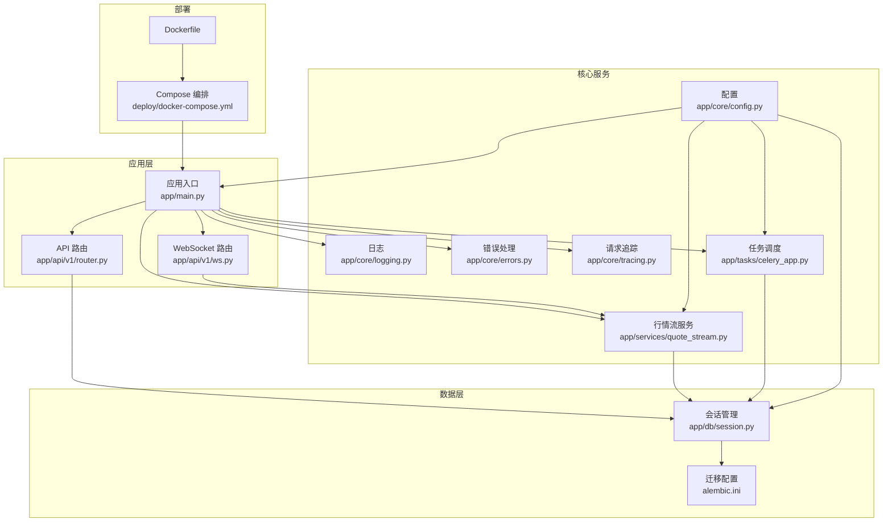
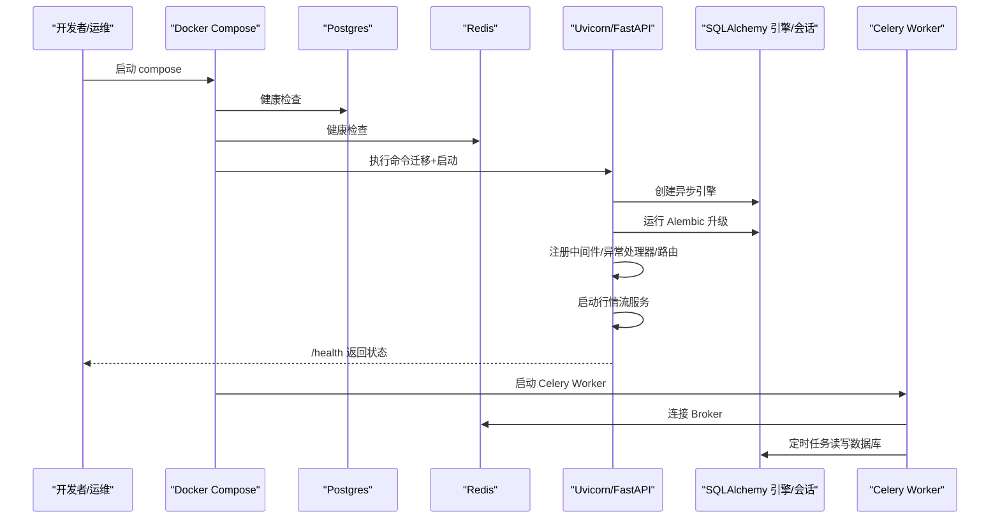
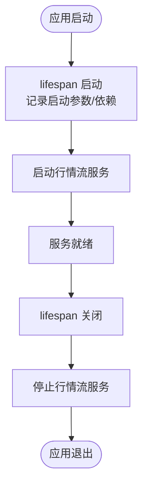
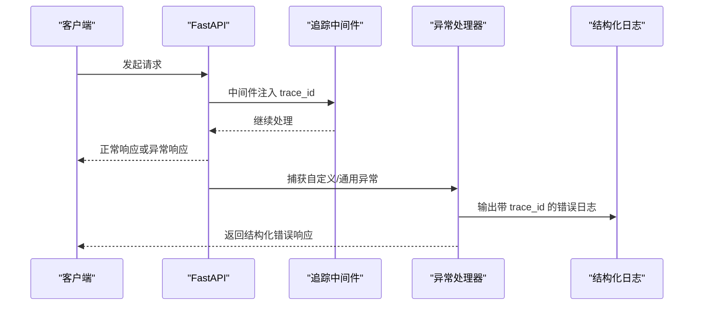
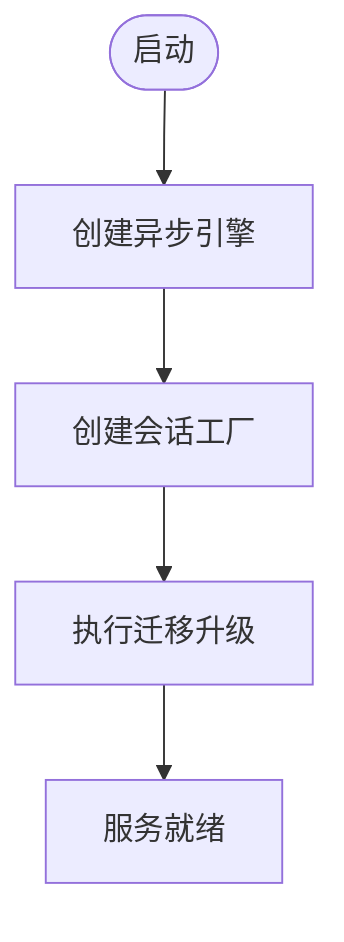
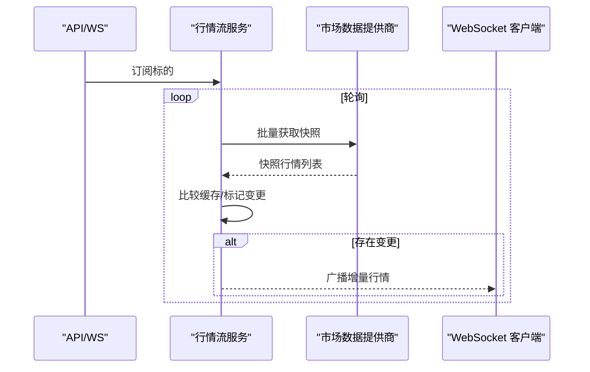
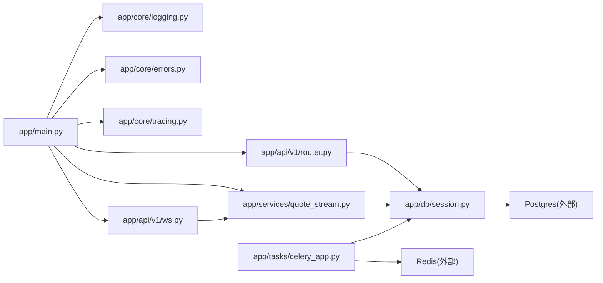

# 故障排除

<cite>
**本文引用的文件**
- [backend/README.md](file://backend/README.md)
- [backend/pyproject.toml](file://backend/pyproject.toml)
- [backend/app/main.py](file://backend/app/main.py)
- [backend/app/core/config.py](file://backend/app/core/config.py)
- [backend/app/core/logging.py](file://backend/app/core/logging.py)
- [backend/app/core/errors.py](file://backend/app/core/errors.py)
- [backend/app/core/tracing.py](file://backend/app/core/tracing.py)
- [backend/app/db/session.py](file://backend/app/db/session.py)
- [backend/alembic.ini](file://backend/alembic.ini)
- [backend/app/api/v1/router.py](file://backend/app/api/v1/router.py)
- [backend/app/api/v1/ws.py](file://backend/app/api/v1/ws.py)
- [backend/app/services/quote_stream.py](file://backend/app/services/quote_stream.py)
- [backend/app/tasks/celery_app.py](file://backend/app/tasks/celery_app.py)
- [deploy/docker-compose.yml](file://deploy/docker-compose.yml)
- [backend/Dockerfile](file://backend/Dockerfile)
</cite>

## 目录
1. [简介](#简介)
2. [项目结构](#项目结构)
3. [核心组件](#核心组件)
4. [架构总览](#架构总览)
5. [详细组件分析](#详细组件分析)
6. [依赖关系分析](#依赖关系分析)
7. [性能考虑](#性能考虑)
8. [故障排除指南](#故障排除指南)
9. [结论](#结论)
10. [附录](#附录)

## 简介
本指南面向运维与开发人员，聚焦 llmine-quant 后端在启动失败、数据库连接异常、API 错误、性能瓶颈、内存泄漏与网络问题等方面的诊断与处置。文档结合代码实现，提供可操作的日志分析技巧、调试工具使用建议、监控指标与告警配置思路，以及应急响应流程。

## 项目结构
后端采用 FastAPI + SQLAlchemy Async + Celery 的异步架构，配合 Alembic 迁移与 Docker 编排，提供实时行情推送、策略回测、组合与风控等功能模块。

图表来源
- [backend/app/main.py:1-65](file://backend/app/main.py#L1-L65)
- [backend/app/api/v1/router.py:1-40](file://backend/app/api/v1/router.py#L1-L40)
- [backend/app/api/v1/ws.py:1-50](file://backend/app/api/v1/ws.py#L1-L50)
- [backend/app/core/config.py:1-196](file://backend/app/core/config.py#L1-L196)
- [backend/app/core/logging.py:1-41](file://backend/app/core/logging.py#L1-L41)
- [backend/app/core/errors.py:1-119](file://backend/app/core/errors.py#L1-L119)
- [backend/app/core/tracing.py:1-87](file://backend/app/core/tracing.py#L1-L87)
- [backend/app/services/quote_stream.py:1-152](file://backend/app/services/quote_stream.py#L1-L152)
- [backend/app/db/session.py:1-34](file://backend/app/db/session.py#L1-L34)
- [backend/alembic.ini:1-111](file://backend/alembic.ini#L1-L111)
- [backend/app/tasks/celery_app.py:1-42](file://backend/app/tasks/celery_app.py#L1-L42)
- [deploy/docker-compose.yml:1-59](file://deploy/docker-compose.yml#L1-L59)
- [backend/Dockerfile:1-25](file://backend/Dockerfile#L1-L25)

章节来源
- [backend/README.md:1-45](file://backend/README.md#L1-L45)
- [backend/pyproject.toml:1-78](file://backend/pyproject.toml#L1-L78)
- [backend/app/main.py:1-65](file://backend/app/main.py#L1-L65)

## 核心组件
- 应用入口与生命周期：负责启动日志记录、健康检查、中间件与异常处理器注册、路由挂载与行情流生命周期管理。
- 配置系统：集中管理数据库、Redis、LLM、市场数据提供商、CORS、分页等参数，并支持从用户目录自动加载 LLM 凭证。
- 日志系统：基于 structlog 的结构化日志，生产环境输出 JSON，便于采集与检索；支持按环境调整日志级别。
- 错误处理：统一异常基类与 FastAPI 异常处理器，输出带 trace_id 的结构化错误响应。
- 请求追踪：上下文注入 trace_id、actor_id、org_id，贯穿日志与响应头，便于端到端链路追踪。
- 数据库会话：异步引擎与会话工厂，支持 SQLite/PostgreSQL，提供依赖注入与异常回滚。
- 行情流服务：后台任务拉取订阅标的行情，缓存并广播增量更新，支持交易时段与非交易时段不同轮询间隔。
- WebSocket API：通用事件通道，用于实时事件推送与心跳确认。
- 任务调度：Celery + Redis，定时执行盘后模拟交易等周期性任务。
- 迁移与部署：Alembic 迁移脚本与 Docker Compose 编排，提供 Postgres、Redis、API 容器健康检查。

章节来源
- [backend/app/main.py:19-65](file://backend/app/main.py#L19-L65)
- [backend/app/core/config.py:48-196](file://backend/app/core/config.py#L48-L196)
- [backend/app/core/logging.py:11-41](file://backend/app/core/logging.py#L11-L41)
- [backend/app/core/errors.py:13-119](file://backend/app/core/errors.py#L13-L119)
- [backend/app/core/tracing.py:49-87](file://backend/app/core/tracing.py#L49-L87)
- [backend/app/db/session.py:10-34](file://backend/app/db/session.py#L10-L34)
- [backend/app/services/quote_stream.py:62-152](file://backend/app/services/quote_stream.py#L62-L152)
- [backend/app/api/v1/ws.py:12-50](file://backend/app/api/v1/ws.py#L12-L50)
- [backend/app/tasks/celery_app.py:15-42](file://backend/app/tasks/celery_app.py#L15-L42)
- [backend/alembic.ini:58-111](file://backend/alembic.ini#L58-L111)
- [deploy/docker-compose.yml:4-59](file://deploy/docker-compose.yml#L4-L59)

## 架构总览
下图展示启动到运行的关键路径：容器编排 → 应用启动 → 数据库迁移 → 生命周期钩子 → 业务路由与后台任务。

图表来源
- [deploy/docker-compose.yml:34-54](file://deploy/docker-compose.yml#L34-L54)
- [backend/Dockerfile:23-24](file://backend/Dockerfile#L23-L24)
- [backend/app/main.py:20-36](file://backend/app/main.py#L20-L36)
- [backend/app/db/session.py:14-21](file://backend/app/db/session.py#L14-L21)
- [backend/alembic.ini:58](file://backend/alembic.ini#L58)
- [backend/app/tasks/celery_app.py:15-31](file://backend/app/tasks/celery_app.py#L15-L31)

## 详细组件分析

### 组件一：应用启动与生命周期
- 关键点
  - 生命周期钩子中记录启动参数与外部依赖信息，便于排障。
  - 行情流在启动时初始化并在关闭时停止，避免后台任务悬挂。
  - 健康检查端点返回版本号，用于快速验证服务可用性。
- 常见问题
  - 启动卡住：检查数据库迁移是否完成、Redis 是否可达、端口占用。
  - 生命周期异常：确认依赖注入与异常处理器已正确注册。
- 排查步骤
  - 查看启动日志中的环境与依赖字段。
  - 访问 /health 检查返回状态。
  - 观察生命周期钩子前后日志。

图表来源
- [backend/app/main.py:20-36](file://backend/app/main.py#L20-L36)
- [backend/app/services/quote_stream.py:73-82](file://backend/app/services/quote_stream.py#L73-L82)

章节来源
- [backend/app/main.py:19-65](file://backend/app/main.py#L19-L65)
- [backend/app/services/quote_stream.py:62-82](file://backend/app/services/quote_stream.py#L62-L82)

### 组件二：配置与环境变量
- 关键点
  - 支持从用户主目录自动加载 LLM 凭证，优先级可配置。
  - 数据库 URL 支持相对 SQLite 路径归一化，避免多工作目录导致的文件不一致。
  - 提供默认值与类型校验，减少配置遗漏。
- 常见问题
  - LLM Provider 未识别：检查凭据加载顺序与显式环境变量覆盖。
  - SQLite 文件路径不一致：确认使用归一化后的绝对路径。
- 排查步骤
  - 对照配置项核对 .env 或环境变量。
  - 在启动日志中确认 llm_source 与 provider 选择结果。

章节来源
- [backend/app/core/config.py:110-196](file://backend/app/core/config.py#L110-L196)
- [backend/README.md:32-41](file://backend/README.md#L32-L41)

### 组件三：日志与错误处理
- 关键点
  - 结构化日志：生产环境输出 JSON，开发环境控制台渲染，便于日志平台接入。
  - 异常处理：自定义异常统一输出，包含 trace_id、路径、方法等上下文。
  - 请求追踪：中间件注入 trace_id 并透传至响应头，便于跨服务关联。
- 常见问题
  - 日志缺失：检查 LOG_LEVEL 与 structlog 处理器配置。
  - 错误响应无 trace_id：确认中间件顺序与异常处理器注册。
- 排查步骤
  - 使用 trace_id 在日志平台检索全链路日志。
  - 对比异常处理器输出与通用异常处理器输出。

图表来源
- [backend/app/core/tracing.py:49-87](file://backend/app/core/tracing.py#L49-L87)
- [backend/app/core/errors.py:73-119](file://backend/app/core/errors.py#L73-L119)
- [backend/app/core/logging.py:19-35](file://backend/app/core/logging.py#L19-L35)

章节来源
- [backend/app/core/logging.py:11-41](file://backend/app/core/logging.py#L11-L41)
- [backend/app/core/errors.py:13-119](file://backend/app/core/errors.py#L13-L119)
- [backend/app/core/tracing.py:13-87](file://backend/app/core/tracing.py#L13-L87)

### 组件四：数据库连接与迁移
- 关键点
  - 异步引擎与会话工厂分离，支持 SQLite/PostgreSQL。
  - SQLite 在多线程场景下通过连接参数规避限制。
  - Alembic 配置独立于应用，支持迁移脚本生成与日志级别控制。
- 常见问题
  - 连接超时/拒绝：检查 DATABASE_URL、网络连通性、Postgres 配置。
  - 迁移失败：确认 alembic.ini 中 sqlalchemy.url 与实际数据库一致。
- 排查步骤
  - 使用相同 DATABASE_URL 手动执行迁移命令验证。
  - 检查引擎 echo 开关以捕获 SQL 与连接细节。

图表来源
- [backend/app/db/session.py:10-21](file://backend/app/db/session.py#L10-L21)
- [backend/alembic.ini:58](file://backend/alembic.ini#L58)

章节来源
- [backend/app/db/session.py:1-34](file://backend/app/db/session.py#L1-L34)
- [backend/alembic.ini:1-111](file://backend/alembic.ini#L1-L111)

### 组件五：行情流与 WebSocket
- 关键点
  - 行情流仅对已订阅标的进行批量拉取，降低网络开销。
  - 交易时段与非交易时段采用不同轮询间隔。
  - WebSocket 广播增量行情，提供订阅快照与心跳确认。
- 常见问题
  - 行情不更新：检查订阅集合、提供商可用性、轮询间隔。
  - WebSocket 断连：确认连接管理器与异常处理。
- 排查步骤
  - 查看行情流日志中的“quotes_broadcast”与“quote_poll_error”。
  - 使用 WebSocket 端点进行连通性测试。

图表来源
- [backend/app/services/quote_stream.py:112-147](file://backend/app/services/quote_stream.py#L112-L147)
- [backend/app/api/v1/ws.py:12-25](file://backend/app/api/v1/ws.py#L12-L25)

章节来源
- [backend/app/services/quote_stream.py:62-152](file://backend/app/services/quote_stream.py#L62-L152)
- [backend/app/api/v1/ws.py:1-50](file://backend/app/api/v1/ws.py#L1-L50)

### 组件六：任务调度与队列
- 关键点
  - Celery 使用 Redis 作为 Broker/Backend，启用延迟确认与任务跟踪。
  - 定时任务在工作日盘后执行，队列隔离。
- 常见问题
  - 任务堆积：检查 Redis 可用性与 Worker 数量。
  - 任务失败：查看 Worker 日志与重试策略。
- 排查步骤
  - 确认 Redis 地址与连接状态。
  - 使用 Celery inspect active/states 查看任务状态。

章节来源
- [backend/app/tasks/celery_app.py:11-42](file://backend/app/tasks/celery_app.py#L11-L42)
- [deploy/docker-compose.yml:21-32](file://deploy/docker-compose.yml#L21-L32)

## 依赖关系分析
- 组件耦合
  - 应用入口对日志、错误、追踪、路由、行情流有直接依赖。
  - 数据层通过会话工厂被各业务模块复用，降低耦合。
  - WebSocket 依赖行情流缓存与连接管理器。
  - 任务调度依赖 Redis 与数据库。
- 外部依赖
  - Postgres/Redis 通过 Docker Compose 提供，需健康检查保障。
  - LLM 提供商凭据来自本地配置或环境变量。

图表来源
- [backend/app/main.py:1-65](file://backend/app/main.py#L1-L65)
- [backend/app/api/v1/router.py:1-40](file://backend/app/api/v1/router.py#L1-L40)
- [backend/app/api/v1/ws.py:1-50](file://backend/app/api/v1/ws.py#L1-L50)
- [backend/app/services/quote_stream.py:1-152](file://backend/app/services/quote_stream.py#L1-L152)
- [backend/app/db/session.py:1-34](file://backend/app/db/session.py#L1-L34)
- [backend/app/tasks/celery_app.py:1-42](file://backend/app/tasks/celery_app.py#L1-L42)

章节来源
- [backend/app/main.py:1-65](file://backend/app/main.py#L1-L65)
- [backend/app/db/session.py:1-34](file://backend/app/db/session.py#L1-L34)

## 性能考虑
- 异步 I/O：数据库与外部提供商调用均采用异步模式，减少阻塞。
- 背压与限流：行情轮询根据交易时段动态调整频率，避免无效请求。
- 缓存与增量：行情缓存仅广播变化，降低网络与前端渲染压力。
- 任务并发：Worker 最大任务数限制与延迟确认，平衡吞吐与稳定性。
- 建议
  - 监控数据库连接池使用率与慢查询。
  - 控制 WebSocket 订阅规模，避免大规模广播。
  - 优化外部提供商接口调用频率与批大小。

[本节为通用指导，无需列出章节来源]

## 故障排除指南

### 启动失败
- 症状
  - 容器启动即退出或长时间卡住。
- 诊断步骤
  - 查看 Compose 日志与容器退出码。
  - 确认数据库迁移命令是否成功执行。
  - 检查端口占用与防火墙。
- 解决方案
  - 修复 DATABASE_URL 与网络连通性。
  - 确保 Alembic 升级成功后再启动 API。
  - 调整 LOG_LEVEL 以便更详细地定位问题。

章节来源
- [deploy/docker-compose.yml:34-54](file://deploy/docker-compose.yml#L34-L54)
- [backend/Dockerfile:23-24](file://backend/Dockerfile#L23-L24)
- [backend/README.md:17-22](file://backend/README.md#L17-L22)

### 数据库连接问题
- 症状
  - 启动时报连接错误、迁移失败、查询超时。
- 诊断步骤
  - 使用相同 DATABASE_URL 手动连接验证。
  - 检查引擎 echo 与 Alembic 日志级别。
  - 确认 Postgres 服务健康与认证配置。
- 解决方案
  - 修正 DATABASE_URL（含协议、主机、端口、库名、凭据）。
  - 如使用 SQLite，确保路径归一化且文件存在。
  - 调整连接池参数与超时设置。

章节来源
- [backend/app/db/session.py:10-21](file://backend/app/db/session.py#L10-L21)
- [backend/alembic.ini:58](file://backend/alembic.ini#L58)
- [backend/app/core/config.py:177-191](file://backend/app/core/config.py#L177-L191)

### API 错误
- 症状
  - 4xx/5xx 错误，响应体包含 code/message/details/trace_id。
- 诊断步骤
  - 从响应头或响应体提取 X-Trace-ID 或 trace_id。
  - 在日志平台按 trace_id 检索全链路日志。
  - 区分自定义异常与通用异常处理器输出。
- 解决方案
  - 根据 code 与 details 定位业务规则或输入校验问题。
  - 修复上游依赖（数据库、LLM、市场数据）。
  - 增加必要的幂等键与重试策略。

章节来源
- [backend/app/core/errors.py:73-119](file://backend/app/core/errors.py#L73-L119)
- [backend/app/core/tracing.py:49-87](file://backend/app/core/tracing.py#L49-L87)

### 性能瓶颈
- 症状
  - 响应时间增长、CPU/IO 占用高、WebSocket 延迟增大。
- 诊断步骤
  - 分析行情轮询间隔与订阅规模。
  - 检查数据库慢查询与连接池饱和。
  - 监控 Celery 任务积压与 Worker 资源。
- 解决方案
  - 优化订阅策略与批处理大小。
  - 调整轮询间隔与交易时段策略。
  - 扩容数据库与 Redis，增加 Worker 数量。

章节来源
- [backend/app/services/quote_stream.py:112-123](file://backend/app/services/quote_stream.py#L112-L123)
- [backend/app/tasks/celery_app.py:22-31](file://backend/app/tasks/celery_app.py#L22-L31)

### 内存泄漏检测
- 方法
  - 使用进程级内存采样工具（如 psutil、memory_profiler）观察长期运行进程的内存曲线。
  - 关注长生命周期对象（全局单例、缓存、连接池）是否异常增长。
  - 在生命周期钩子前后对比资源使用情况。
- 建议
  - 定期重启 Worker 以释放不可回收资源。
  - 限制单个任务最大任务数，避免长时间持有大对象。

章节来源
- [backend/app/main.py:20-36](file://backend/app/main.py#L20-L36)
- [backend/app/services/quote_stream.py:62-82](file://backend/app/services/quote_stream.py#L62-L82)

### 网络问题排查
- 方法
  - 使用连通性测试（telnet/ping/curl）验证端口可达性。
  - 检查 DNS 解析、代理与防火墙策略。
  - 对外部提供商接口进行基准测试，评估延迟与失败率。
- 建议
  - 为外部调用设置合理的超时与重试。
  - 使用健康检查端点与探针监控网络状态。

章节来源
- [deploy/docker-compose.yml:15-32](file://deploy/docker-compose.yml#L15-L32)
- [backend/app/core/config.py:80-99](file://backend/app/core/config.py#L80-L99)

### 日志分析技巧
- 结构化日志
  - 生产环境输出 JSON，字段包含时间戳、级别、消息、trace_id、路径、方法等。
  - 使用日志平台进行聚合、过滤与告警。
- 关键日志类别
  - 启动/关闭：确认依赖加载与生命周期。
  - 请求错误：结合 trace_id 定位具体请求。
  - 未处理异常：关注异常堆栈与上下文。
  - 行情轮询错误：定位提供商可用性与网络问题。
- 工具建议
  - 使用日志平台的搜索与聚合功能，按 trace_id 串联请求链路。

章节来源
- [backend/app/core/logging.py:19-35](file://backend/app/core/logging.py#L19-L35)
- [backend/app/core/errors.py:78-109](file://backend/app/core/errors.py#L78-L109)
- [backend/app/services/quote_stream.py:118-119](file://backend/app/services/quote_stream.py#L118-L119)

### 调试工具使用
- FastAPI 文档
  - 启动后访问 /docs 或 /redoc 获取 OpenAPI 文档，辅助接口调试。
- Uvicorn
  - 使用 --reload 开发模式自动热重载，便于快速迭代。
- Celery
  - 使用 inspect active/states 查看任务状态，结合日志定位失败原因。

章节来源
- [backend/README.md:42-44](file://backend/README.md#L42-L44)
- [backend/README.md:17-21](file://backend/README.md#L17-L21)
- [backend/app/tasks/celery_app.py:35-41](file://backend/app/tasks/celery_app.py#L35-L41)

### 系统监控指标与告警
- 指标建议
  - 应用层：请求速率、P95/P99 延迟、错误率、未处理异常计数、健康检查状态。
  - 数据库层：连接数、慢查询、事务回滚、锁等待。
  - 队列层：任务积压、执行时长、失败率、Worker 数。
  - 行情层：轮询成功率、广播延迟、订阅数量。
- 告警配置
  - 错误率突增、健康检查失败、数据库连接不足、队列积压超阈值。
- 参考集成
  - Prometheus 客户端已在依赖中，可扩展指标导出与 Grafana 展示。

章节来源
- [backend/pyproject.toml:24](file://backend/pyproject.toml#L24)
- [backend/app/main.py:61-65](file://backend/app/main.py#L61-L65)

### 应急响应流程
- 快速止损
  - 停止异常任务、降级非关键功能、回滚最近变更。
- 信息收集
  - 提取 trace_id，抓取日志与指标，确认影响范围。
- 修复与验证
  - 修复后进行小范围灰度验证，逐步扩大流量。
- 复盘与改进
  - 更新故障报告、完善监控与告警策略。

[本节为通用流程说明，无需列出章节来源]

## 结论
通过结构化日志、统一异常处理、请求追踪与生命周期管理，llmine-quant 后端具备良好的可观测性与可维护性。结合本文提供的诊断方法与应急流程，可快速定位并解决启动、数据库、API、性能与网络等典型问题，保障系统稳定运行。

[本节为总结性内容，无需列出章节来源]

## 附录

### 常用命令与端点
- 启动与迁移
  - 安装依赖与运行迁移：参考后端 README 的快速开始。
  - 启动 API 与 Worker：参考后端 README 的命令示例。
- 健康检查
  - 访问 /health 确认服务状态。
- 文档与调试
  - 访问 /docs 或 /redoc 获取接口文档。

章节来源
- [backend/README.md:5-22](file://backend/README.md#L5-L22)
- [backend/README.md:42-44](file://backend/README.md#L42-L44)
- [backend/app/main.py:61-65](file://backend/app/main.py#L61-L65)