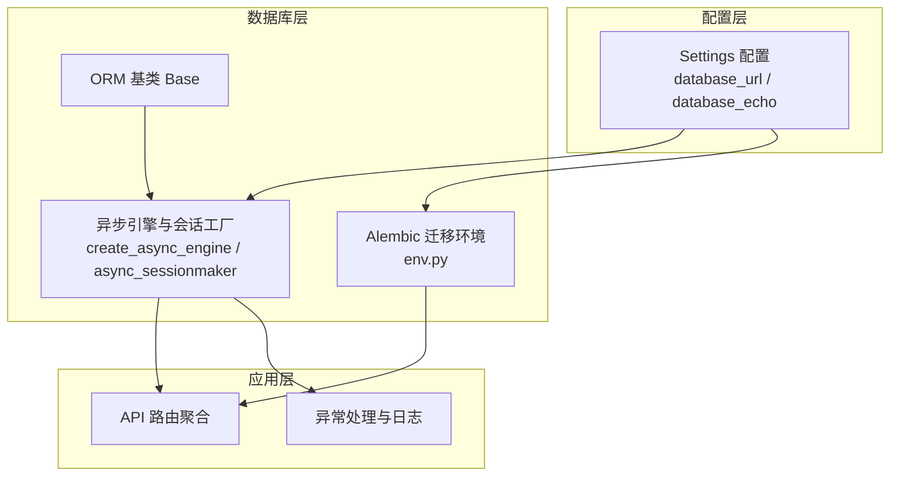
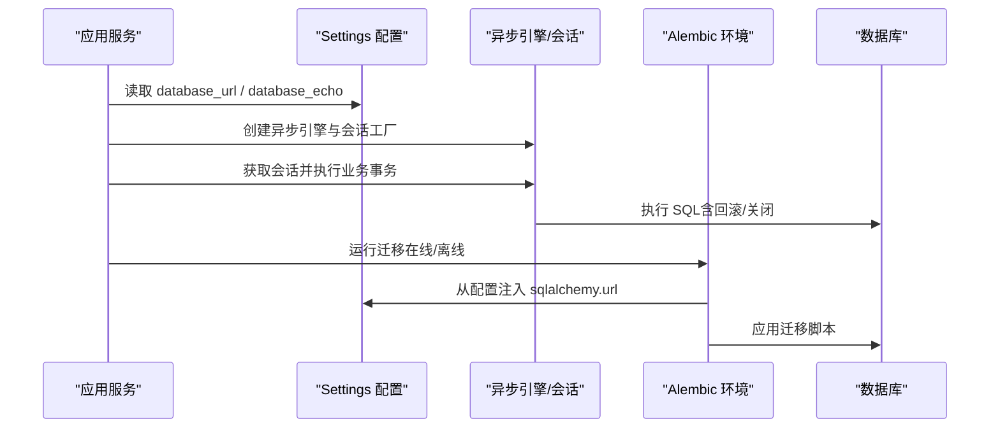
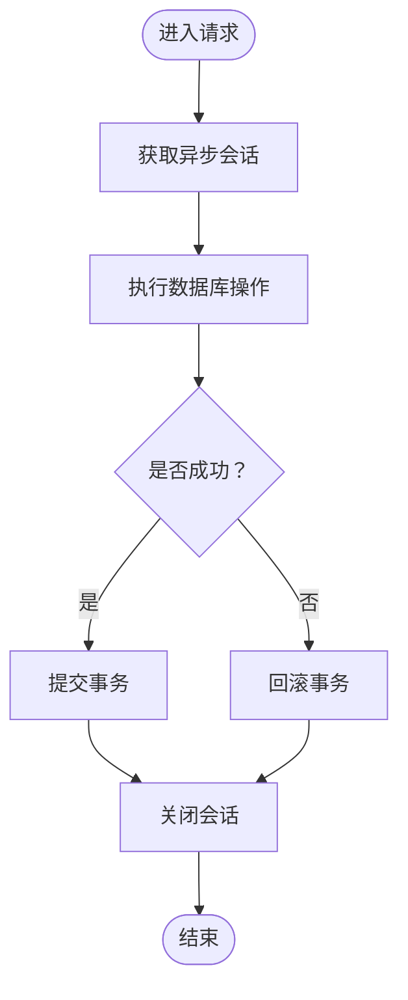
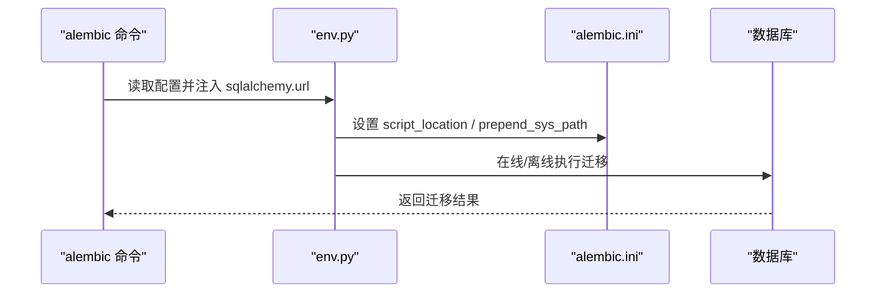
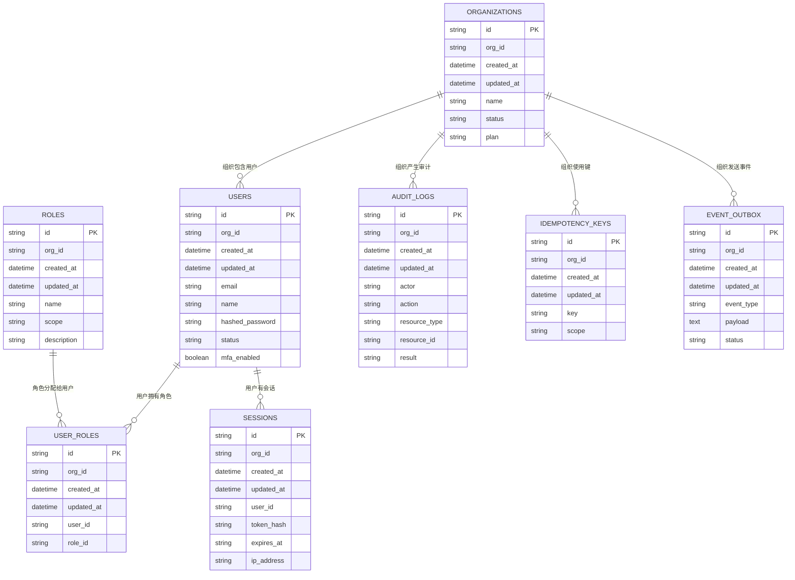
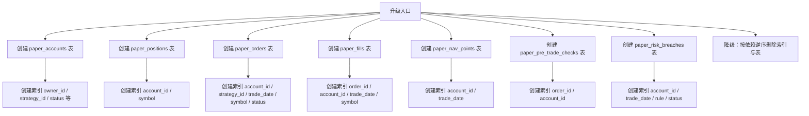
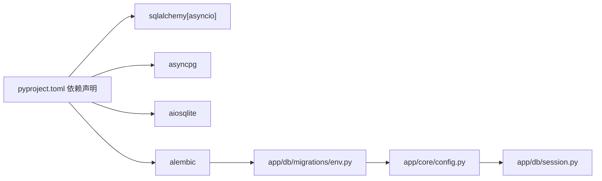

# 数据库问题排查

<cite>
**本文引用的文件**
- [backend/app/db/base.py](file://backend/app/db/base.py)
- [backend/app/db/session.py](file://backend/app/db/session.py)
- [backend/app/core/config.py](file://backend/app/core/config.py)
- [backend/alembic.ini](file://backend/alembic.ini)
- [backend/app/db/migrations/env.py](file://backend/app/db/migrations/env.py)
- [backend/app/db/migrations/versions/20260510_000001_init_identity_and_audit.py](file://backend/app/db/migrations/versions/20260510_000001_init_identity_and_audit.py)
- [backend/app/db/migrations/versions/49c0724c647e_paper_trading_tables.py](file://backend/app/db/migrations/versions/49c0724c647e_paper_trading_tables.py)
- [backend/app/core/errors.py](file://backend/app/core/errors.py)
- [backend/app/api/v1/router.py](file://backend/app/api/v1/router.py)
- [backend/pyproject.toml](file://backend/pyproject.toml)
</cite>

## 目录
1. [简介](#简介)
2. [项目结构](#项目结构)
3. [核心组件](#核心组件)
4. [架构总览](#架构总览)
5. [详细组件分析](#详细组件分析)
6. [依赖分析](#依赖分析)
7. [性能考虑](#性能考虑)
8. [故障排查指南](#故障排查指南)
9. [结论](#结论)
10. [附录](#附录)

## 简介
本指南聚焦 llmine-quant 后端数据库相关问题的系统化排查与修复，覆盖数据库连接失败、迁移错误、表结构问题、性能瓶颈、连接池优化、慢查询与索引优化、备份恢复与一致性检查、以及故障切换的应急流程。文档基于实际源码进行分析，提供可操作的诊断步骤与修复建议。

## 项目结构
后端使用 SQLAlchemy 异步引擎与 Alembic 进行数据库迁移管理，配置通过 pydantic-settings 的 Settings 类加载，数据库会话由异步会话工厂统一管理。

图表来源
- [backend/app/core/config.py:58](file://backend/app/core/config.py#L58)
- [backend/app/db/base.py:6](file://backend/app/db/base.py#L6)
- [backend/app/db/session.py:14](file://backend/app/db/session.py#L14)
- [backend/app/db/migrations/env.py:58](file://backend/app/db/migrations/env.py#L58)
- [backend/app/api/v1/router.py:23](file://backend/app/api/v1/router.py#L23)
- [backend/app/core/errors.py:10](file://backend/app/core/errors.py#L10)

章节来源
- [backend/app/core/config.py:58](file://backend/app/core/config.py#L58)
- [backend/app/db/base.py:6](file://backend/app/db/base.py#L6)
- [backend/app/db/session.py:14](file://backend/app/db/session.py#L14)
- [backend/app/db/migrations/env.py:58](file://backend/app/db/migrations/env.py#L58)
- [backend/app/api/v1/router.py:23](file://backend/app/api/v1/router.py#L23)
- [backend/app/core/errors.py:10](file://backend/app/core/errors.py#L10)

## 核心组件
- 配置与连接
  - Settings 提供 database_url 与 database_echo；SQLite URL 在启动时被规范化以避免相对路径导致的进程工作目录差异问题。
  - 异步引擎与会话工厂在 session.py 中创建，支持 echo 开关与 SQLite 特定连接参数。
- ORM 基类
  - Base 作为所有模型的基类，用于迁移目标元数据。
- Alembic 迁移环境
  - env.py 将 settings.database_url 注入到 Alembic 配置，并加载各领域模型以生成迁移元数据。
- 异常与日志
  - 统一的 LLMineException 体系与 FastAPI 异常处理器，便于定位数据库相关错误的 trace_id 与上下文。

章节来源
- [backend/app/core/config.py:58](file://backend/app/core/config.py#L58)
- [backend/app/core/config.py:195](file://backend/app/core/config.py#L195)
- [backend/app/db/base.py:6](file://backend/app/db/base.py#L6)
- [backend/app/db/session.py:14](file://backend/app/db/session.py#L14)
- [backend/app/db/migrations/env.py:58](file://backend/app/db/migrations/env.py#L58)
- [backend/app/core/errors.py:73](file://backend/app/core/errors.py#L73)

## 架构总览
下图展示数据库连接、迁移与应用层交互的关键路径。

图表来源
- [backend/app/core/config.py:58](file://backend/app/core/config.py#L58)
- [backend/app/db/session.py:14](file://backend/app/db/session.py#L14)
- [backend/app/db/migrations/env.py:58](file://backend/app/db/migrations/env.py#L58)

## 详细组件分析

### 数据库连接与会话管理
- 关键点
  - 使用异步引擎与 async_sessionmaker，开启 future 模式，禁用自动 flush，expire_on_commit=false。
  - SQLite 场景设置 connect_args 以允许多线程访问。
  - get_db 依赖提供会话生命周期管理：异常时回滚并抛出，最终关闭会话。
- 典型问题
  - 连接字符串格式错误、权限不足、主机不可达、SQLite 文件锁定。
  - 未正确回滚导致事务悬挂，或会话未关闭造成资源泄漏。

图表来源
- [backend/app/db/session.py:24](file://backend/app/db/session.py#L24)

章节来源
- [backend/app/db/session.py:14](file://backend/app/db/session.py#L14)
- [backend/app/db/session.py:24](file://backend/app/db/session.py#L24)

### Alembic 迁移环境与配置
- 关键点
  - env.py 将 settings.database_url 写入 Alembic 配置，确保迁移与运行时使用一致的数据源。
  - 在线迁移通过 async_engine_from_config 创建异步连接，使用 NullPool。
  - 迁移脚本位于 app/db/migrations/versions，按时间戳前缀命名。
- 典型问题
  - 版本冲突（多个分支）、迁移脚本语法错误、数据库权限不足、SQLite 路径编码问题。

图表来源
- [backend/app/db/migrations/env.py:58](file://backend/app/db/migrations/env.py#L58)
- [backend/alembic.ini:5](file://backend/alembic.ini#L5)
- [backend/alembic.ini:58](file://backend/alembic.ini#L58)

章节来源
- [backend/app/db/migrations/env.py:58](file://backend/app/db/migrations/env.py#L58)
- [backend/alembic.ini:5](file://backend/alembic.ini#L5)
- [backend/alembic.ini:58](file://backend/alembic.ini#L58)

### 初始迁移示例（身份与审计）
- 作用
  - 初始化组织、用户、角色、会话、审计日志、幂等键与事件出站等核心表。
- 表结构要点
  - 统一的软删除字段 deleted_at、组织级字段 org_id、带索引的外键列。
- 故障排查
  - 若升级失败，检查唯一约束、索引名冲突、列类型不匹配。
  - 降级顺序需遵循外键依赖关系。

图表来源
- [backend/app/db/migrations/versions/20260510_000001_init_identity_and_audit.py:18](file://backend/app/db/migrations/versions/20260510_000001_init_identity_and_audit.py#L18)

章节来源
- [backend/app/db/migrations/versions/20260510_000001_init_identity_and_audit.py:18](file://backend/app/db/migrations/versions/20260510_000001_init_identity_and_audit.py#L18)

### 纸模式交易迁移（索引与约束）
- 作用
  - 定义账户、持仓、订单、成交、净值点、预交易检查与风控违约等表。
- 索引与约束
  - 大量使用 op.f("ix_...") 形式的索引，以及唯一约束（如 uq_paper_positions_account_symbol）。
- 故障排查
  - 索引名冲突、重复索引、唯一约束违反、外键缺失。

图表来源
- [backend/app/db/migrations/versions/49c0724c647e_paper_trading_tables.py:33](file://backend/app/db/migrations/versions/49c0724c647e_paper_trading_tables.py#L33)

章节来源
- [backend/app/db/migrations/versions/49c0724c647e_paper_trading_tables.py:33](file://backend/app/db/migrations/versions/49c0724c647e_paper_trading_tables.py#L33)

### 异常处理与可观测性
- 关键点
  - 自定义 LLMineException 及其子类，统一返回结构包含 code、message、details、trace_id。
  - handle_llmine_exception 与 handle_generic_exception 记录日志并返回标准化响应。
- 故障排查
  - 通过 trace_id 快速定位数据库相关错误来源；结合日志级别与 handlers 配置。

章节来源
- [backend/app/core/errors.py:73](file://backend/app/core/errors.py#L73)
- [backend/app/core/errors.py:98](file://backend/app/core/errors.py#L98)

## 依赖分析
- 运行时依赖
  - SQLAlchemy 异步、asyncpg、aiosqlite、Alembic。
- 配置与迁移
  - alembic.ini 指定 script_location 与 sqlalchemy.url；env.py 注入 settings.database_url。
- 会话与引擎
  - session.py 基于 settings.database_url 创建异步引擎与会话工厂。

图表来源
- [backend/pyproject.toml:13](file://backend/pyproject.toml#L13)
- [backend/pyproject.toml:14](file://backend/pyproject.toml#L14)
- [backend/pyproject.toml:15](file://backend/pyproject.toml#L15)
- [backend/pyproject.toml:16](file://backend/pyproject.toml#L16)
- [backend/app/db/migrations/env.py:58](file://backend/app/db/migrations/env.py#L58)
- [backend/app/core/config.py:58](file://backend/app/core/config.py#L58)
- [backend/app/db/session.py:14](file://backend/app/db/session.py#L14)

章节来源
- [backend/pyproject.toml:13](file://backend/pyproject.toml#L13)
- [backend/pyproject.toml:14](file://backend/pyproject.toml#L14)
- [backend/pyproject.toml:15](file://backend/pyproject.toml#L15)
- [backend/pyproject.toml:16](file://backend/pyproject.toml#L16)
- [backend/app/db/migrations/env.py:58](file://backend/app/db/migrations/env.py#L58)
- [backend/app/core/config.py:58](file://backend/app/core/config.py#L58)
- [backend/app/db/session.py:14](file://backend/app/db/session.py#L14)

## 性能考虑
- 连接池与引擎参数
  - 当前使用 NullPool（Alembic 在线迁移场景），生产环境建议评估连接池大小与超时策略，避免连接争用。
- 日志与调试
  - database_echo 可临时开启以观察 SQL 输出，但生产应关闭以减少开销。
- 索引与查询
  - 迁移脚本中大量使用索引，建议结合 EXPLAIN/ANALYZE 分析热点查询，必要时补充复合索引或物化视图。
- SQLite 注意事项
  - 规范化 SQLite URL，避免多进程/多线程竞争；考虑 WAL 模式与并发写入限制。

章节来源
- [backend/app/db/migrations/env.py:95](file://backend/app/db/migrations/env.py#L95)
- [backend/app/core/config.py:59](file://backend/app/core/config.py#L59)
- [backend/app/db/session.py:10](file://backend/app/db/session.py#L10)

## 故障排查指南

### 一、数据库连接失败
- 排查清单
  - 检查 database_url 是否正确（协议、主机、端口、数据库名、凭据）。
  - 对比 alembic.ini 与 Settings 的 sqlalchemy.url，确保两者一致。
  - SQLite：确认路径已规范化，避免相对路径导致的跨工作目录差异。
  - 权限：确认数据库用户具备连接与 DDL/DML 权限。
  - 网络：若为远程数据库，检查防火墙与网络连通性。
- 修复步骤
  - 更新 .env 或环境变量中的 database_url。
  - 在本地复现：使用 Alembic 在线迁移命令验证连接。
  - 如为 SQLite，确保文件存在且非只读。

章节来源
- [backend/app/core/config.py:58](file://backend/app/core/config.py#L58)
- [backend/alembic.ini:58](file://backend/alembic.ini#L58)
- [backend/app/core/config.py:195](file://backend/app/core/config.py#L195)

### 二、迁移错误（版本冲突/脚本错误/权限）
- 常见原因
  - 版本冲突：多个分支或手动修改版本历史。
  - 脚本错误：语法错误、列类型不兼容、索引/约束冲突。
  - 权限不足：DDL 权限缺失。
- 诊断步骤
  - 查看 Alembic 日志级别与 handlers 配置，定位具体失败步骤。
  - 使用 alembic current/heads/show 命令核对当前版本。
  - 在 Alembic 环境中单独运行目标迁移脚本，缩小范围。
- 修复步骤
  - 版本冲突：使用合并/重写版本历史（谨慎），或创建新版本脚本。
  - 脚本错误：修正列定义、索引名、唯一约束，确保依赖顺序正确。
  - 权限：授予数据库用户 DDL 权限。
  - 回滚与重试：先 downgrade 到稳定版本，再重新 upgrade。

章节来源
- [backend/app/db/migrations/env.py:58](file://backend/app/db/migrations/env.py#L58)
- [backend/alembic.ini:78](file://backend/alembic.ini#L78)
- [backend/alembic.ini:97](file://backend/alembic.ini#L97)

### 三、表结构问题（索引/约束/外键）
- 症状
  - 唯一约束冲突、索引名重复、外键缺失、列类型不匹配。
- 诊断步骤
  - 对照迁移脚本中的索引与约束定义，确认数据库实际状态。
  - 使用数据库客户端查看表结构与索引。
- 修复步骤
  - 删除冲突索引/约束后重建，或调整迁移脚本。
  - 降级到上一个稳定版本，修正后再升级。

章节来源
- [backend/app/db/migrations/versions/49c0724c647e_paper_trading_tables.py:33](file://backend/app/db/migrations/versions/49c0724c647e_paper_trading_tables.py#L33)

### 四、性能瓶颈（慢查询/锁等待/高延迟）
- 诊断步骤
  - 开启 database_echo 临时观察高频 SQL。
  - 结合业务路由与 API 调用链，定位慢查询接口。
  - 使用数据库 EXPLAIN/EXPLAIN ANALYZE 分析执行计划。
- 优化建议
  - 补充缺失索引（基于 WHERE/JOIN/ORDER BY 列）。
  - 减少 N+1 查询，合并批量写入。
  - 调整连接池参数与超时策略（生产环境）。
  - SQLite：启用 WAL 模式，评估并发写入策略。

章节来源
- [backend/app/core/config.py:59](file://backend/app/core/config.py#L59)
- [backend/app/db/session.py:10](file://backend/app/db/session.py#L10)

### 五、备份与恢复（应急流程）
- 建议流程
  - 备份：导出结构与数据（pg_dump / sqlite 数据库文件拷贝）。
  - 验证：在隔离环境恢复并校验关键查询与迁移。
  - 回滚：若升级失败，使用 downgrade 到上一个稳定版本。
  - 切换：如主库故障，按运维预案切换至备库并更新连接配置。
- 注意事项
  - 迁移前后均需备份。
  - SQLite 场景需确保文件级一致性。

章节来源
- [backend/app/db/migrations/env.py:58](file://backend/app/db/migrations/env.py#L58)

### 六、数据一致性检查
- 方法
  - 校验关键表的记录数与关键字段完整性。
  - 对比迁移前后的表结构与索引。
  - 运行业务回归用例，确保核心功能正常。
- 工具
  - Alembic show/current/head 命令核对版本。
  - 数据库客户端执行 SELECT/COUNT/EXPLAIN 校验。

章节来源
- [backend/app/db/migrations/env.py:58](file://backend/app/db/migrations/env.py#L58)

## 结论
通过对配置、会话、迁移与异常处理的系统化梳理，可快速定位并修复数据库相关问题。建议在开发与测试环境充分验证迁移与性能，生产环境严格控制变更流程并完善备份与监控。

## 附录

### A. 常用命令与配置要点
- Alembic 命令
  - 查看版本：alembic current / heads / show
  - 升级：alembic upgrade +1 / head
  - 降级：alembic downgrade -1 / base
- 配置要点
  - alembic.ini：script_location、prepend_sys_path、sqlalchemy.url
  - env.py：注入 settings.database_url，加载领域模型
  - Settings：database_url、database_echo

章节来源
- [backend/alembic.ini:5](file://backend/alembic.ini#L5)
- [backend/alembic.ini:13](file://backend/alembic.ini#L13)
- [backend/alembic.ini:58](file://backend/alembic.ini#L58)
- [backend/app/db/migrations/env.py:58](file://backend/app/db/migrations/env.py#L58)
- [backend/app/core/config.py:58](file://backend/app/core/config.py#L58)