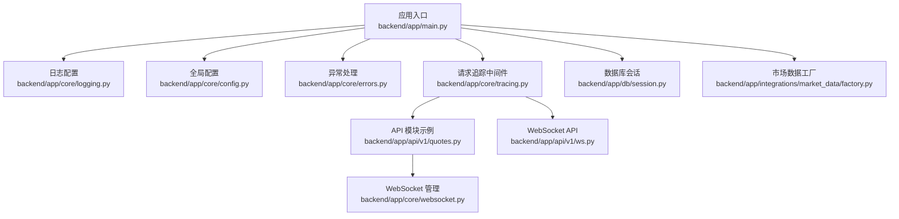
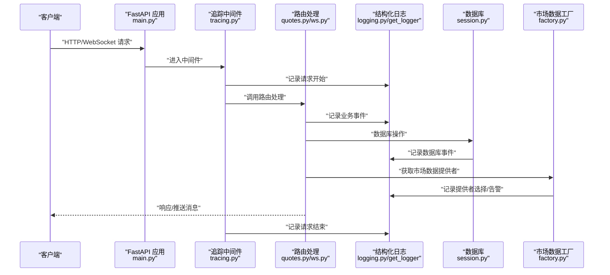
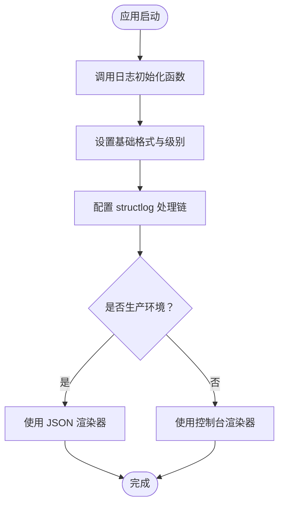
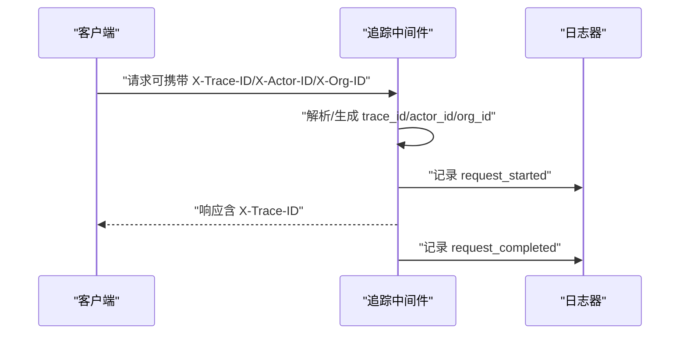
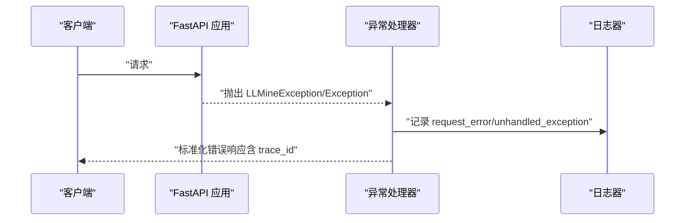
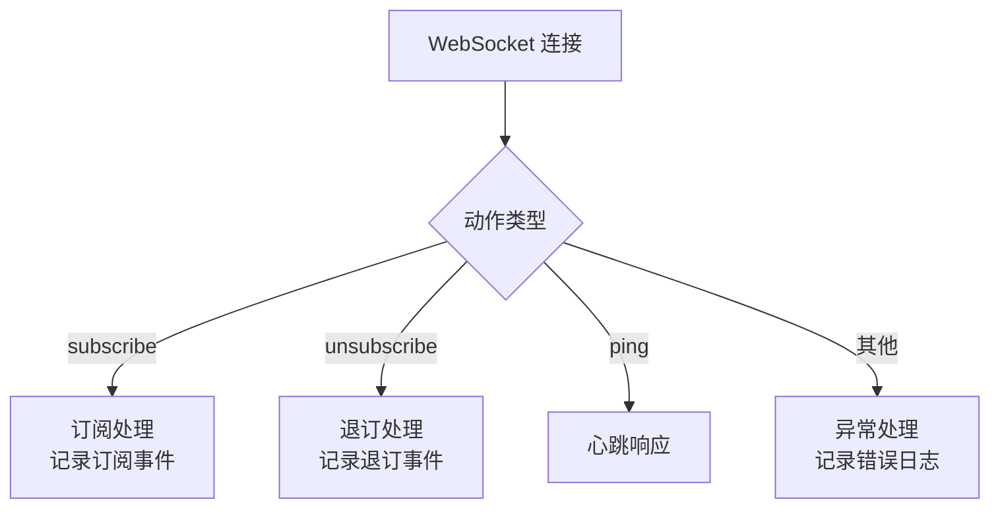
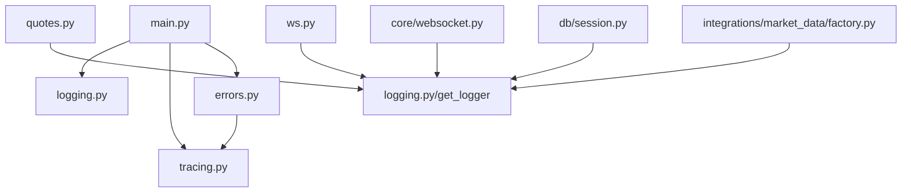

# 日志分析与调试

<cite>
**本文引用的文件**
- [backend/app/core/logging.py](file://backend/app/core/logging.py)
- [backend/app/core/config.py](file://backend/app/core/config.py)
- [backend/app/main.py](file://backend/app/main.py)
- [backend/app/core/errors.py](file://backend/app/core/errors.py)
- [backend/app/core/tracing.py](file://backend/app/core/tracing.py)
- [backend/app/api/v1/quotes.py](file://backend/app/api/v1/quotes.py)
- [backend/app/api/v1/ws.py](file://backend/app/api/v1/ws.py)
- [backend/app/core/websocket.py](file://backend/app/core/websocket.py)
- [backend/app/db/session.py](file://backend/app/db/session.py)
- [backend/app/integrations/market_data/factory.py](file://backend/app/integrations/market_data/factory.py)
</cite>

## 目录
1. [简介](#简介)
2. [项目结构](#项目结构)
3. [核心组件](#核心组件)
4. [架构总览](#架构总览)
5. [详细组件分析](#详细组件分析)
6. [依赖分析](#依赖分析)
7. [性能考虑](#性能考虑)
8. [故障排查指南](#故障排查指南)
9. [结论](#结论)
10. [附录](#附录)

## 简介
本指南面向 llmine-quant 后端的日志体系与调试实践，覆盖结构化日志配置、日志级别与格式、上下文信息注入、错误与性能日志分析、业务链路追踪以及常见调试工具使用建议。文档以实际代码为依据，帮助开发者在开发、测试与生产环境中高效定位问题、优化性能并保障可观测性。

## 项目结构
后端采用 FastAPI 应用入口集中初始化日志与中间件，核心日志能力由 structlog 提供；各模块通过统一的 get_logger 获取结构化日志记录器，结合请求级 trace 上下文实现跨模块的可追踪日志。

图表来源
- [backend/app/main.py:16-36](file://backend/app/main.py#L16-L36)
- [backend/app/core/logging.py:11-35](file://backend/app/core/logging.py#L11-L35)
- [backend/app/core/config.py:48-108](file://backend/app/core/config.py#L48-L108)
- [backend/app/core/errors.py:73-118](file://backend/app/core/errors.py#L73-L118)
- [backend/app/core/tracing.py:49-86](file://backend/app/core/tracing.py#L49-L86)
- [backend/app/api/v1/quotes.py:10-129](file://backend/app/api/v1/quotes.py#L10-L129)
- [backend/app/api/v1/ws.py:8-50](file://backend/app/api/v1/ws.py#L8-L50)
- [backend/app/core/websocket.py:7-45](file://backend/app/core/websocket.py#L7-L45)
- [backend/app/db/session.py:8-34](file://backend/app/db/session.py#L8-L34)
- [backend/app/integrations/market_data/factory.py:19-57](file://backend/app/integrations/market_data/factory.py#L19-L57)

章节来源
- [backend/app/main.py:16-36](file://backend/app/main.py#L16-L36)
- [backend/app/core/logging.py:11-35](file://backend/app/core/logging.py#L11-L35)
- [backend/app/core/config.py:48-108](file://backend/app/core/config.py#L48-L108)

## 核心组件
- 结构化日志配置：集中于日志初始化函数，设置基础格式、级别与 structlog 处理链，按环境选择 JSON 或控制台渲染器。
- 请求追踪中间件：在请求进入与返回时注入 trace_id、actor_id、org_id 等上下文，并记录请求开始/完成事件。
- 统一日志记录器：通过 get_logger(name) 获取命名日志器，便于按模块区分日志来源。
- 异常处理：自定义异常类型与处理器，统一输出带 trace_id 的错误日志并返回标准化响应。
- 典型模块日志点：API 层、WebSocket 层、数据库层、市场数据工厂等均有明确的日志记录点，便于串联业务链路。

章节来源
- [backend/app/core/logging.py:11-41](file://backend/app/core/logging.py#L11-L41)
- [backend/app/core/tracing.py:49-86](file://backend/app/core/tracing.py#L49-L86)
- [backend/app/core/errors.py:73-118](file://backend/app/core/errors.py#L73-L118)
- [backend/app/api/v1/quotes.py:10-129](file://backend/app/api/v1/quotes.py#L10-L129)
- [backend/app/api/v1/ws.py:8-50](file://backend/app/api/v1/ws.py#L8-L50)
- [backend/app/core/websocket.py:7-45](file://backend/app/core/websocket.py#L7-L45)
- [backend/app/db/session.py:8-34](file://backend/app/db/session.py#L8-L34)
- [backend/app/integrations/market_data/factory.py:19-57](file://backend/app/integrations/market_data/factory.py#L19-L57)

## 架构总览
下图展示从请求进入、追踪上下文注入、到各模块日志记录的整体流程。

图表来源
- [backend/app/main.py:16-36](file://backend/app/main.py#L16-L36)
- [backend/app/core/tracing.py:49-86](file://backend/app/core/tracing.py#L49-L86)
- [backend/app/api/v1/quotes.py:10-129](file://backend/app/api/v1/quotes.py#L10-L129)
- [backend/app/api/v1/ws.py:8-50](file://backend/app/api/v1/ws.py#L8-L50)
- [backend/app/core/websocket.py:7-45](file://backend/app/core/websocket.py#L7-L45)
- [backend/app/db/session.py:8-34](file://backend/app/db/session.py#L8-L34)
- [backend/app/integrations/market_data/factory.py:19-57](file://backend/app/integrations/market_data/factory.py#L19-L57)

## 详细组件分析

### 结构化日志配置与使用
- 初始化流程：应用启动时调用日志配置函数，设置基础格式与级别；随后配置 structlog 的处理链，包含上下文合并、级别、时间戳、堆栈信息、异常格式化、JSON/控制台渲染器等。
- 日志级别：由配置项决定，默认 INFO；可通过环境变量调整。
- 日志格式：生产环境输出 JSON，便于采集与检索；开发环境输出控制台格式，便于阅读。
- 获取日志器：各模块通过 get_logger(name) 获取命名日志器，形成清晰的模块维度。

图表来源
- [backend/app/core/logging.py:11-35](file://backend/app/core/logging.py#L11-L35)
- [backend/app/core/config.py:52-56](file://backend/app/core/config.py#L52-L56)

章节来源
- [backend/app/core/logging.py:11-41](file://backend/app/core/logging.py#L11-L41)
- [backend/app/core/config.py:52-56](file://backend/app/core/config.py#L52-L56)

### 请求追踪与上下文注入
- 中间件职责：从请求头提取或生成 trace_id，注入 actor_id、org_id；在请求开始与结束时记录调试事件，并将 trace_id 写回响应头。
- 上下文传播：通过 contextvars 在请求生命周期内传递 trace/actor/org 信息，供日志与异常处理使用。
- 日志关联：所有模块日志均可包含 trace_id，实现端到端链路追踪。

图表来源
- [backend/app/core/tracing.py:49-86](file://backend/app/core/tracing.py#L49-L86)

章节来源
- [backend/app/core/tracing.py:13-47](file://backend/app/core/tracing.py#L13-L47)
- [backend/app/core/tracing.py:49-86](file://backend/app/core/tracing.py#L49-L86)

### 错误处理与异常日志
- 自定义异常：定义了多种业务异常类型，统一包含 code、status_code、details 等字段。
- 异常处理器：捕获自定义异常与通用异常，记录带 trace_id 的警告/异常日志，并返回标准化 JSON 响应。
- 日志键位：错误日志包含 trace_id、路径、方法、状态码、错误详情等，便于快速定位。

图表来源
- [backend/app/core/errors.py:73-118](file://backend/app/core/errors.py#L73-L118)
- [backend/app/core/tracing.py:13-16](file://backend/app/core/tracing.py#L13-L16)

章节来源
- [backend/app/core/errors.py:13-71](file://backend/app/core/errors.py#L13-L71)
- [backend/app/core/errors.py:73-118](file://backend/app/core/errors.py#L73-L118)

### API 层日志点（示例）
- quotes API：历史行情、快照、全市场快照接口；WebSocket 连接建立/断开、订阅/退订、错误告警等均有结构化日志记录。
- ws API：通用事件流与策略/执行/风控事件流，均对连接与异常进行记录。

图表来源
- [backend/app/api/v1/quotes.py:85-129](file://backend/app/api/v1/quotes.py#L85-L129)
- [backend/app/api/v1/ws.py:12-23](file://backend/app/api/v1/ws.py#L12-L23)

章节来源
- [backend/app/api/v1/quotes.py:10-129](file://backend/app/api/v1/quotes.py#L10-L129)
- [backend/app/api/v1/ws.py:8-50](file://backend/app/api/v1/ws.py#L8-L50)

### 数据库层日志点
- 会话管理：在获取/关闭数据库会话过程中记录日志，便于观察连接生命周期与异常回滚场景。

章节来源
- [backend/app/db/session.py:8-34](file://backend/app/db/session.py#L8-L34)

### 市场数据工厂日志点
- 提供者选择：根据配置选择 akshare/tushare/wind/mock 等提供者；当 akshare 未安装时记录告警并回退到 mock；未知提供者时记录告警并回退。

章节来源
- [backend/app/integrations/market_data/factory.py:19-57](file://backend/app/integrations/market_data/factory.py#L19-L57)

### WebSocket 管理日志点
- 连接管理：连接建立/断开时记录主题与当前连接数，便于监控实时事件通道的健康度。

章节来源
- [backend/app/core/websocket.py:7-45](file://backend/app/core/websocket.py#L7-L45)

## 依赖分析
- 应用入口依赖日志配置与追踪中间件，确保每次请求都具备结构化日志与 trace 上下文。
- API 层与 WebSocket 层依赖统一日志器，保证日志键位一致。
- 错误处理依赖追踪中间件提供的 trace_id，实现错误日志与请求链路的绑定。
- 数据库与市场数据工厂各自维护独立日志器，便于按域划分问题域。

图表来源
- [backend/app/main.py:16-36](file://backend/app/main.py#L16-L36)
- [backend/app/core/logging.py:38-41](file://backend/app/core/logging.py#L38-L41)
- [backend/app/core/errors.py:73-118](file://backend/app/core/errors.py#L73-L118)
- [backend/app/core/tracing.py:49-86](file://backend/app/core/tracing.py#L49-L86)
- [backend/app/api/v1/quotes.py:10-129](file://backend/app/api/v1/quotes.py#L10-L129)
- [backend/app/api/v1/ws.py:8-50](file://backend/app/api/v1/ws.py#L8-L50)
- [backend/app/core/websocket.py:7-45](file://backend/app/core/websocket.py#L7-L45)
- [backend/app/db/session.py:8-34](file://backend/app/db/session.py#L8-L34)
- [backend/app/integrations/market_data/factory.py:19-57](file://backend/app/integrations/market_data/factory.py#L19-L57)

章节来源
- [backend/app/main.py:16-36](file://backend/app/main.py#L16-L36)
- [backend/app/core/logging.py:38-41](file://backend/app/core/logging.py#L38-L41)
- [backend/app/core/errors.py:73-118](file://backend/app/core/errors.py#L73-L118)
- [backend/app/core/tracing.py:49-86](file://backend/app/core/tracing.py#L49-L86)

## 性能考虑
- 日志级别：在高吞吐场景下建议使用 INFO 或更高级别，避免 DEBUG 的高开销输出。
- JSON 输出：生产环境使用 JSON 渲染器利于日志收集系统解析与过滤，但需注意字段数量与大小。
- 追踪成本：trace_id 生成与上下文注入开销极低，但在极端高频场景下仍应关注日志写入频率。
- 数据库与外部服务：对慢查询与外部调用增加采样日志，避免过多重复信息淹没关键指标。

## 故障排查指南
- 快速定位错误
  - 使用错误处理器返回的 trace_id 在日志中检索完整链路，确认请求开始/结束与异常发生的时间线。
  - 关注错误日志中的路径、方法、状态码与错误详情，结合业务上下文判断问题范围。
- WebSocket 排障
  - 观察连接/断开日志与订阅/退订事件，确认客户端行为与服务端状态一致性。
  - 对异常断开与异常消息进行告警日志核对，定位具体环节。
- 数据库问题
  - 关注会话获取/关闭与异常回滚日志，结合 SQL 执行情况判断事务边界与锁竞争。
- 市场数据提供者
  - 若 akshare 未安装或不可用，工厂会记录告警并回退到 mock；检查依赖安装与配置项。
- 追踪与关联
  - 确保客户端在请求头携带 X-Trace-ID，以便服务端复用；若缺失则由中间件生成并回传响应头。

章节来源
- [backend/app/core/errors.py:73-118](file://backend/app/core/errors.py#L73-L118)
- [backend/app/api/v1/quotes.py:85-129](file://backend/app/api/v1/quotes.py#L85-L129)
- [backend/app/api/v1/ws.py:12-23](file://backend/app/api/v1/ws.py#L12-L23)
- [backend/app/core/websocket.py:16-25](file://backend/app/core/websocket.py#L16-L25)
- [backend/app/db/session.py:24-33](file://backend/app/db/session.py#L24-L33)
- [backend/app/integrations/market_data/factory.py:36-55](file://backend/app/integrations/market_data/factory.py#L36-L55)
- [backend/app/core/tracing.py:55-76](file://backend/app/core/tracing.py#L55-L76)

## 结论
llmine-quant 的日志体系以 structlog 为核心，结合请求追踪中间件实现了结构化、可追踪、可扩展的日志能力。通过统一的日志器与标准化的键位，开发者可以在不同模块间快速串联业务链路，定位错误与性能瓶颈。建议在生产环境坚持使用 JSON 日志与合适的日志级别，并配合 trace_id 实现端到端问题排查。

## 附录
- 日志级别与配置
  - 配置项：环境变量 env 控制渲染器类型，log_level 控制日志级别。
  - 默认级别：INFO；可在 .env 中调整。
- 日志键位建议
  - 通用：level、timestamp、event、trace_id、module、logger
  - 请求：method、path、status_code
  - 错误：code、message、details、error
  - WebSocket：topic、connections
  - 数据库：engine、session
  - 市场数据：provider、fallback
- 调试工具建议
  - Python 调试器：pdb/remote-pdb（开发/测试环境），注意不要在生产开启高开销调试。
  - 浏览器开发者工具：Network 面板查看请求/响应头（含 X-Trace-ID）、WebSocket 消息与错误。
  - 网络抓包：tcpdump/Charles/Proxyman 抓取 HTTP/WebSocket 流量，结合 trace_id 定位问题。
  - 日志聚合：生产环境建议接入日志收集系统（如 Fluent Bit/Fluentd/Vector）与可视化平台（如 Grafana Loki/ELK）。
  - 日志轮转：使用系统自带轮转工具（如 logrotate/rsyslog）或应用侧轮转策略，避免单文件过大。
  - 日志安全：避免在日志中输出敏感信息（如密钥、令牌），必要时进行脱敏处理。