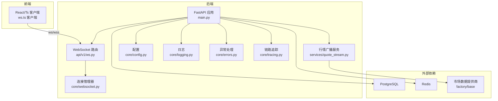
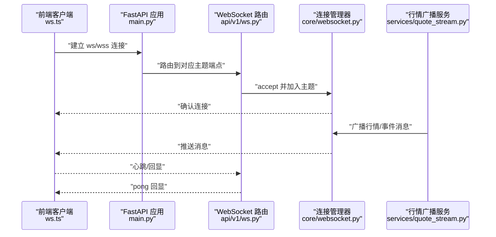
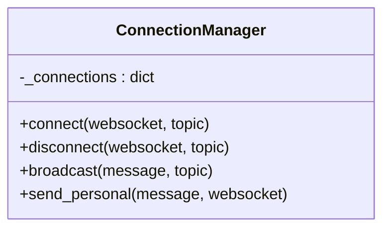
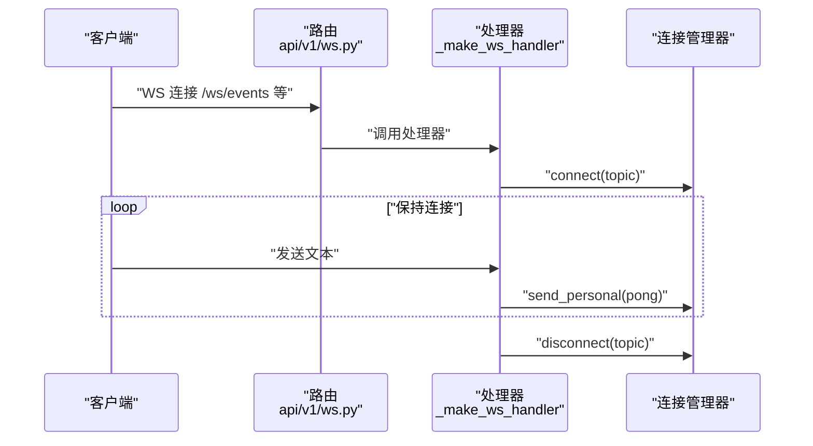
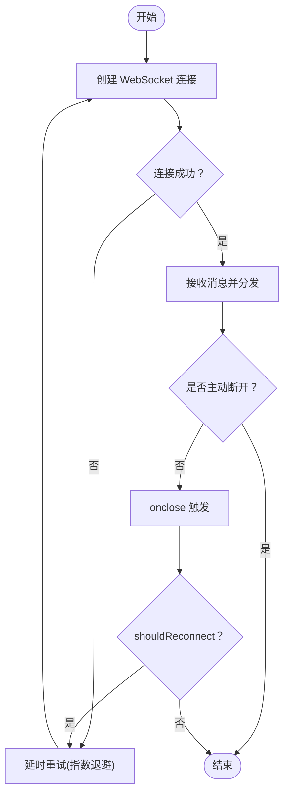
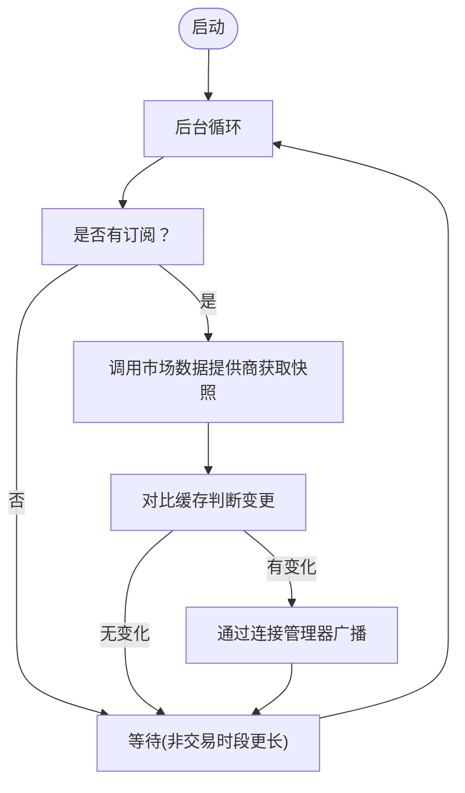
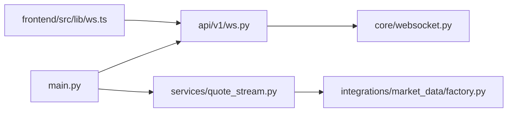
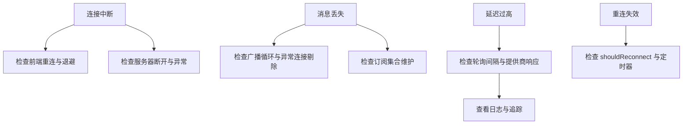

# 网络问题排查

<cite>
**本文引用的文件**
- [backend/app/core/websocket.py](file://backend/app/core/websocket.py)
- [backend/app/api/v1/ws.py](file://backend/app/api/v1/ws.py)
- [frontend/src/lib/ws.ts](file://frontend/src/lib/ws.ts)
- [backend/app/main.py](file://backend/app/main.py)
- [deploy/docker-compose.yml](file://deploy/docker-compose.yml)
- [backend/app/core/config.py](file://backend/app/core/config.py)
- [backend/app/services/quote_stream.py](file://backend/app/services/quote_stream.py)
- [backend/Dockerfile](file://backend/Dockerfile)
- [backend/app/integrations/market_data/base.py](file://backend/app/integrations/market_data/base.py)
- [backend/app/integrations/market_data/factory.py](file://backend/app/integrations/market_data/factory.py)
- [backend/app/core/logging.py](file://backend/app/core/logging.py)
- [backend/app/core/errors.py](file://backend/app/core/errors.py)
- [backend/app/core/tracing.py](file://backend/app/core/tracing.py)
</cite>

## 目录
1. [简介](#简介)
2. [项目结构](#项目结构)
3. [核心组件](#核心组件)
4. [架构总览](#架构总览)
5. [详细组件分析](#详细组件分析)
6. [依赖关系分析](#依赖关系分析)
7. [性能考量](#性能考量)
8. [故障排查指南](#故障排查指南)
9. [结论](#结论)
10. [附录](#附录)

## 简介
本指南聚焦 llmine-quant 的网络相关问题，覆盖 WebSocket 连接、API 网关、DNS、防火墙、实时数据流（连接中断/消息丢失/高延迟/重连失效）、容器网络与服务发现、负载均衡等场景。文档基于仓库中的实际代码进行分析，提供可操作的诊断步骤、可视化流程图与最佳实践。

## 项目结构
后端采用 FastAPI，前端为 React/Ts 客户端；二者通过 WebSocket 实现实时事件推送，同时通过 REST API 提供查询与控制能力。部署使用 Docker Compose 将 API、数据库与缓存容器化运行。

图表来源
- [backend/app/main.py:39-58](file://backend/app/main.py#L39-L58)
- [backend/app/api/v1/ws.py:28-49](file://backend/app/api/v1/ws.py#L28-L49)
- [backend/app/core/websocket.py:10-41](file://backend/app/core/websocket.py#L10-L41)
- [backend/app/services/quote_stream.py:73-82](file://backend/app/services/quote_stream.py#L73-L82)
- [backend/app/integrations/market_data/factory.py:23-56](file://backend/app/integrations/market_data/factory.py#L23-L56)

章节来源
- [backend/app/main.py:39-58](file://backend/app/main.py#L39-L58)
- [deploy/docker-compose.yml:34-54](file://deploy/docker-compose.yml#L34-L54)

## 核心组件
- WebSocket 连接管理：集中维护主题订阅与广播，支持单播与广播。
- WebSocket API：按主题暴露多条实时事件通道。
- 前端 WebSocket 客户端：自动重连、消息分发、主题订阅。
- 行情广播服务：后台任务拉取市场快照并广播到 WebSocket 主题“quotes”。
- 配置与中间件：CORS、日志、追踪、异常处理。
- 容器编排：Docker Compose 暴露端口与健康检查。

章节来源
- [backend/app/core/websocket.py:10-41](file://backend/app/core/websocket.py#L10-L41)
- [backend/app/api/v1/ws.py:12-25](file://backend/app/api/v1/ws.py#L12-L25)
- [frontend/src/lib/ws.ts:27-88](file://frontend/src/lib/ws.ts#L27-L88)
- [backend/app/services/quote_stream.py:62-151](file://backend/app/services/quote_stream.py#L62-L151)
- [backend/app/core/config.py:69-70](file://backend/app/core/config.py#L69-L70)
- [backend/app/core/logging.py:11-35](file://backend/app/core/logging.py#L11-L35)
- [backend/app/core/errors.py:73-95](file://backend/app/core/errors.py#L73-L95)
- [backend/app/core/tracing.py:49-86](file://backend/app/core/tracing.py#L49-L86)

## 架构总览
WebSocket 实时流从后端到前端的端到端路径如下：

图表来源
- [frontend/src/lib/ws.ts:40-67](file://frontend/src/lib/ws.ts#L40-L67)
- [backend/app/api/v1/ws.py:12-25](file://backend/app/api/v1/ws.py#L12-L25)
- [backend/app/core/websocket.py:16-25](file://backend/app/core/websocket.py#L16-L25)
- [backend/app/services/quote_stream.py:142-146](file://backend/app/services/quote_stream.py#L142-L146)

## 详细组件分析

### WebSocket 连接管理器
- 主题订阅：以字符串为主题键，维护 WebSocket 列表。
- 连接生命周期：接入、断开、清理异常连接。
- 广播策略：遍历主题连接列表发送 JSON；异常连接从列表中移除，避免阻塞。

图表来源
- [backend/app/core/websocket.py:10-41](file://backend/app/core/websocket.py#L10-L41)

章节来源
- [backend/app/core/websocket.py:10-41](file://backend/app/core/websocket.py#L10-L41)

### WebSocket API 路由
- 多主题端点：事件、策略事件、执行事件、风控事件。
- 通用处理器：统一接入、心跳回显、异常捕获与断开。
- 日志记录：错误与断开事件记录，便于排查。

图表来源
- [backend/app/api/v1/ws.py:12-25](file://backend/app/api/v1/ws.py#L12-L25)
- [backend/app/api/v1/ws.py:28-49](file://backend/app/api/v1/ws.py#L28-L49)
- [backend/app/core/websocket.py:16-25](file://backend/app/core/websocket.py#L16-L25)

章节来源
- [backend/app/api/v1/ws.py:12-25](file://backend/app/api/v1/ws.py#L12-L25)
- [backend/app/api/v1/ws.py:28-49](file://backend/app/api/v1/ws.py#L28-L49)

### 前端 WebSocket 客户端
- 自动重连：指数退避上限控制，断线自动尝试恢复。
- 主题订阅：按主题创建独立连接，消息按 type 分发。
- 错误处理：onerror 触发关闭，避免悬挂连接。

图表来源
- [frontend/src/lib/ws.ts:40-67](file://frontend/src/lib/ws.ts#L40-L67)
- [frontend/src/lib/ws.ts:65-67](file://frontend/src/lib/ws.ts#L65-L67)

章节来源
- [frontend/src/lib/ws.ts:27-88](file://frontend/src/lib/ws.ts#L27-L88)

### 行情广播服务
- 后台任务：启动/停止生命周期管理。
- 订阅管理：按 WebSocket 对象跟踪订阅的股票集合。
- 拉取与广播：根据交易时段调整轮询间隔，仅在有订阅时发起网络请求，减少无效调用。

图表来源
- [backend/app/services/quote_stream.py:112-123](file://backend/app/services/quote_stream.py#L112-L123)
- [backend/app/services/quote_stream.py:125-147](file://backend/app/services/quote_stream.py#L125-L147)
- [backend/app/integrations/market_data/factory.py:23-56](file://backend/app/integrations/market_data/factory.py#L23-L56)

章节来源
- [backend/app/services/quote_stream.py:62-151](file://backend/app/services/quote_stream.py#L62-L151)
- [backend/app/integrations/market_data/base.py:94-100](file://backend/app/integrations/market_data/base.py#L94-L100)
- [backend/app/integrations/market_data/factory.py:23-56](file://backend/app/integrations/market_data/factory.py#L23-L56)

### 配置与中间件
- CORS：允许前端开发环境跨域访问。
- 日志：结构化输出，生产环境 JSON 渲染。
- 异常：统一错误响应与追踪 ID 注入。
- 追踪：请求头注入 trace ID，贯穿日志与响应头。

章节来源
- [backend/app/core/config.py:69-70](file://backend/app/core/config.py#L69-L70)
- [backend/app/core/logging.py:11-35](file://backend/app/core/logging.py#L11-L35)
- [backend/app/core/errors.py:73-95](file://backend/app/core/errors.py#L73-L95)
- [backend/app/core/tracing.py:49-86](file://backend/app/core/tracing.py#L49-L86)

## 依赖关系分析
- 应用入口注册路由、中间件与异常处理器，挂载 WebSocket 路由。
- WebSocket 路由依赖连接管理器；行情服务依赖市场数据提供商工厂。
- 前端通过相对路径拼接 ws/wss 与主机，自动选择协议与端口。

图表来源
- [backend/app/main.py:57-58](file://backend/app/main.py#L57-L58)
- [backend/app/api/v1/ws.py:6-6](file://backend/app/api/v1/ws.py#L6-L6)
- [backend/app/core/websocket.py:7-7](file://backend/app/core/websocket.py#L7-L7)
- [backend/app/services/quote_stream.py:34-35](file://backend/app/services/quote_stream.py#L34-L35)
- [backend/app/integrations/market_data/factory.py:14-15](file://backend/app/integrations/market_data/factory.py#L14-L15)
- [frontend/src/lib/ws.ts:21-25](file://frontend/src/lib/ws.ts#L21-L25)

章节来源
- [backend/app/main.py:57-58](file://backend/app/main.py#L57-L58)
- [frontend/src/lib/ws.ts:21-25](file://frontend/src/lib/ws.ts#L21-L25)

## 性能考量
- 轮询节流：非交易时段延长轮询间隔，降低外部依赖压力。
- 条件拉取：仅对至少有一个订阅的标的发起请求，避免全市场扫描。
- 广播去阻塞：异常连接从列表移除，防止广播阻塞。
- 日志与追踪：结构化日志与 trace ID，便于定位慢请求与异常路径。

章节来源
- [backend/app/services/quote_stream.py:121-123](file://backend/app/services/quote_stream.py#L121-L123)
- [backend/app/services/quote_stream.py:129-131](file://backend/app/services/quote_stream.py#L129-L131)
- [backend/app/core/websocket.py:30-34](file://backend/app/core/websocket.py#L30-L34)
- [backend/app/core/logging.py:19-35](file://backend/app/core/logging.py#L19-L35)
- [backend/app/core/tracing.py:49-86](file://backend/app/core/tracing.py#L49-L86)

## 故障排查指南

### 一、WebSocket 连接问题
- 症状
  - 前端无法连接或频繁断开
  - 服务器端日志出现断开或错误
- 排查步骤
  - 确认前端协议与主机：ws 与 wss 的自动选择是否正确，主机与端口映射是否一致。
  - 检查 CORS 设置与反向代理配置，确保跨域放行。
  - 查看应用日志与追踪 ID，定位异常断开原因。
  - 验证路由是否正确挂载到 /ws 前缀。
- 参考路径
  - 协议与主机拼接：[frontend/src/lib/ws.ts:21-25](file://frontend/src/lib/ws.ts#L21-L25)
  - CORS 配置：[backend/app/core/config.py:69-70](file://backend/app/core/config.py#L69-L70)
  - 应用路由挂载：[backend/app/main.py:57-58](file://backend/app/main.py#L57-L58)
  - 断开与错误日志：[backend/app/api/v1/ws.py:19-23](file://backend/app/api/v1/ws.py#L19-L23)

章节来源
- [frontend/src/lib/ws.ts:21-25](file://frontend/src/lib/ws.ts#L21-L25)
- [backend/app/core/config.py:69-70](file://backend/app/core/config.py#L69-L70)
- [backend/app/main.py:57-58](file://backend/app/main.py#L57-L58)
- [backend/app/api/v1/ws.py:19-23](file://backend/app/api/v1/ws.py#L19-L23)

### 二、API 网关与反向代理
- 症状
  - 请求超时、404、CORS 失败
- 排查步骤
  - 确认 API 路由前缀与端口映射一致。
  - 检查反向代理是否转发 Upgrade 头与保持长连接。
  - 校验健康检查与容器间网络可达性。
- 参考路径
  - 应用启动与端口：[backend/app/main.py:39-46](file://backend/app/main.py#L39-L46)
  - Docker 端口映射：[deploy/docker-compose.yml:45-46](file://deploy/docker-compose.yml#L45-L46)
  - 健康检查：[deploy/docker-compose.yml:15-19](file://deploy/docker-compose.yml#L15-L19)

章节来源
- [backend/app/main.py:39-46](file://backend/app/main.py#L39-L46)
- [deploy/docker-compose.yml:45-46](file://deploy/docker-compose.yml#L45-L46)
- [deploy/docker-compose.yml:15-19](file://deploy/docker-compose.yml#L15-L19)

### 三、DNS 解析错误
- 症状
  - 客户端无法解析主机名，连接失败
- 排查步骤
  - 在容器内使用 nslookup 或 dig 验证 DNS 解析。
  - 若使用自定义域名，检查 /etc/hosts 或上游 DNS。
  - 对于外部市场数据提供商，确认其域名可用且未被防火墙阻断。
- 参考路径
  - 外部依赖：市场数据提供商工厂与基础抽象
    - [backend/app/integrations/market_data/factory.py:23-56](file://backend/app/integrations/market_data/factory.py#L23-L56)
    - [backend/app/integrations/market_data/base.py:94-100](file://backend/app/integrations/market_data/base.py#L94-L100)

章节来源
- [backend/app/integrations/market_data/factory.py:23-56](file://backend/app/integrations/market_data/factory.py#L23-L56)
- [backend/app/integrations/market_data/base.py:94-100](file://backend/app/integrations/market_data/base.py#L94-L100)

### 四、防火墙与端口阻断
- 症状
  - 本地可访问但远程不可达；容器间通信失败
- 排查步骤
  - 使用 telnet/nc 验证端口连通性。
  - 检查宿主机防火墙与安全组规则。
  - 确认 Docker 端口映射与容器内部监听地址。
- 参考路径
  - API 端口暴露与监听：[backend/Dockerfile:20-24](file://backend/Dockerfile#L20-L24)
  - 端口映射：[deploy/docker-compose.yml:45-46](file://deploy/docker-compose.yml#L45-L46)

章节来源
- [backend/Dockerfile:20-24](file://backend/Dockerfile#L20-L24)
- [deploy/docker-compose.yml:45-46](file://deploy/docker-compose.yml#L45-L46)

### 五、实时数据流问题
- 连接中断
  - 检查前端重连策略与退避参数。
  - 核对服务器端断开逻辑与异常捕获。
- 消息丢失
  - 确认广播循环与异常连接剔除逻辑。
  - 核对订阅集合是否正确维护。
- 延迟过高
  - 交易时段轮询间隔与提供商响应时间。
  - 日志与追踪定位慢点。
- 重连机制失效
  - 前端 shouldReconnect 标志与定时器清理。
  - 服务器端异常断开触发清理。

图表来源
- [frontend/src/lib/ws.ts:57-67](file://frontend/src/lib/ws.ts#L57-L67)
- [backend/app/api/v1/ws.py:19-23](file://backend/app/api/v1/ws.py#L19-L23)
- [backend/app/core/websocket.py:30-34](file://backend/app/core/websocket.py#L30-L34)
- [backend/app/services/quote_stream.py:112-123](file://backend/app/services/quote_stream.py#L112-L123)

章节来源
- [frontend/src/lib/ws.ts:57-67](file://frontend/src/lib/ws.ts#L57-L67)
- [backend/app/api/v1/ws.py:19-23](file://backend/app/api/v1/ws.py#L19-L23)
- [backend/app/core/websocket.py:30-34](file://backend/app/core/websocket.py#L30-L34)
- [backend/app/services/quote_stream.py:112-123](file://backend/app/services/quote_stream.py#L112-L123)

### 六、容器网络与服务发现
- 症状
  - 容器间无法通信；服务发现失败
- 排查步骤
  - 使用 docker inspect 检查网络与端口映射。
  - 确认服务依赖健康检查通过后再启动应用。
  - 使用 curl/nc 测试容器内可达性。
- 参考路径
  - 服务依赖与健康检查：[deploy/docker-compose.yml:47-51](file://deploy/docker-compose.yml#L47-L51)

章节来源
- [deploy/docker-compose.yml:47-51](file://deploy/docker-compose.yml#L47-L51)

### 七、负载均衡与高可用
- 症状
  - 单点瓶颈；会话粘性导致扩展困难
- 排查步骤
  - 使用反向代理（如 Nginx）做会话亲和或无状态分发。
  - 确保共享状态（如 Redis）可用且低延迟。
  - 验证健康检查与自动重启策略。
- 参考路径
  - Redis 依赖与环境变量：[deploy/docker-compose.yml:40-41](file://deploy/docker-compose.yml#L40-L41)

章节来源
- [deploy/docker-compose.yml:40-41](file://deploy/docker-compose.yml#L40-L41)

## 结论
本指南基于仓库中的实际代码，梳理了 llmine-quant 的网络架构与实时数据流路径，提供了针对 WebSocket、API、DNS、防火墙、容器网络与负载均衡的系统化排查流程。建议在生产环境中结合结构化日志、追踪 ID 与健康检查，持续监控连接质量与数据流延迟，确保系统稳定与可观测性。

## 附录
- 关键配置项
  - CORS 允许来源：[backend/app/core/config.py:69-70](file://backend/app/core/config.py#L69-L70)
  - API 前缀：[backend/app/core/config.py:73-74](file://backend/app/core/config.py#L73-L74)
  - 市场数据提供商选择：[backend/app/integrations/market_data/factory.py:29-29](file://backend/app/integrations/market_data/factory.py#L29-L29)
- 关键端口
  - API 端口：8000（容器内），映射至宿主 8000
    - [backend/Dockerfile:20-24](file://backend/Dockerfile#L20-L24)
    - [deploy/docker-compose.yml:45-46](file://deploy/docker-compose.yml#L45-L46)
- 健康检查
  - PostgreSQL：pg_isready
  - Redis：redis-cli ping
    - [deploy/docker-compose.yml:15-19](file://deploy/docker-compose.yml#L15-L19)
    - [deploy/docker-compose.yml:28-32](file://deploy/docker-compose.yml#L28-L32)