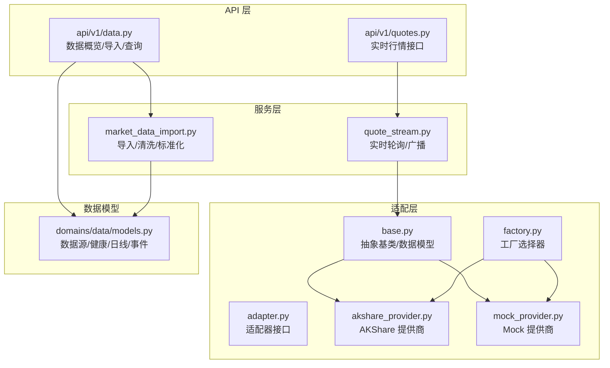
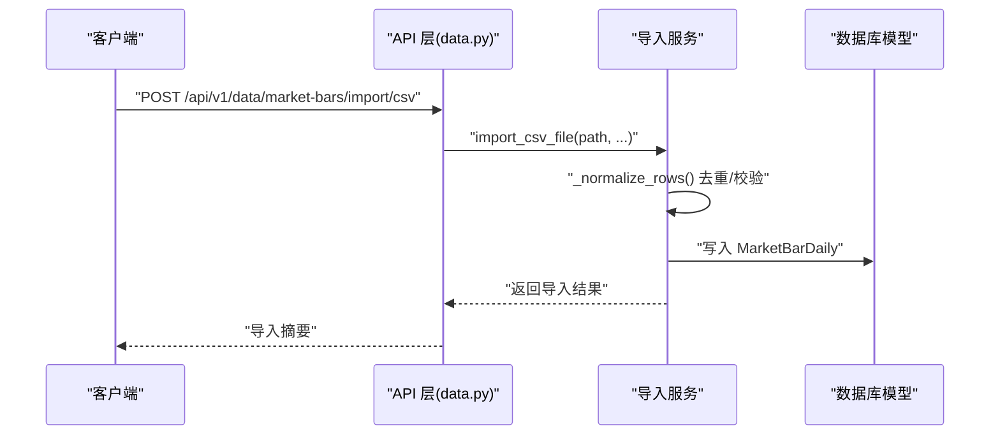
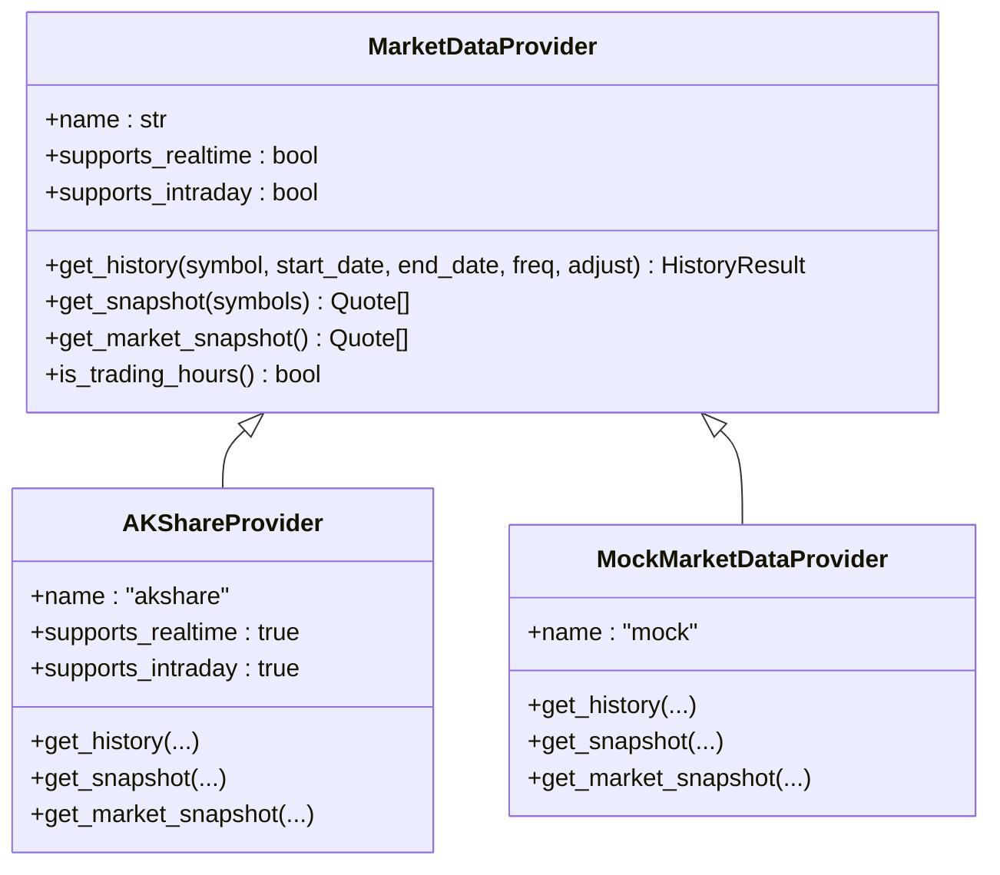
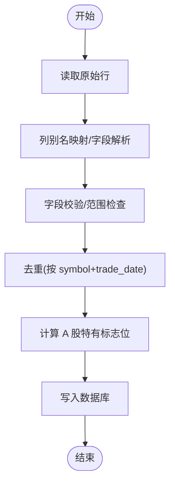
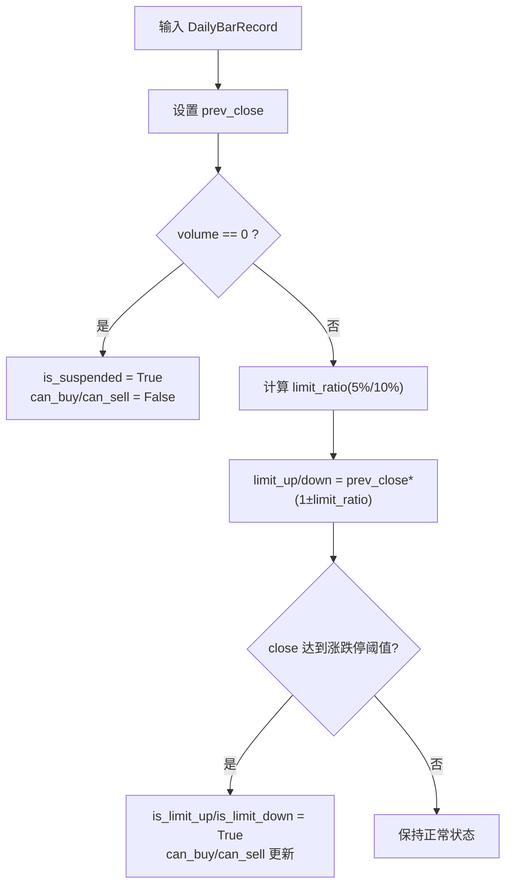
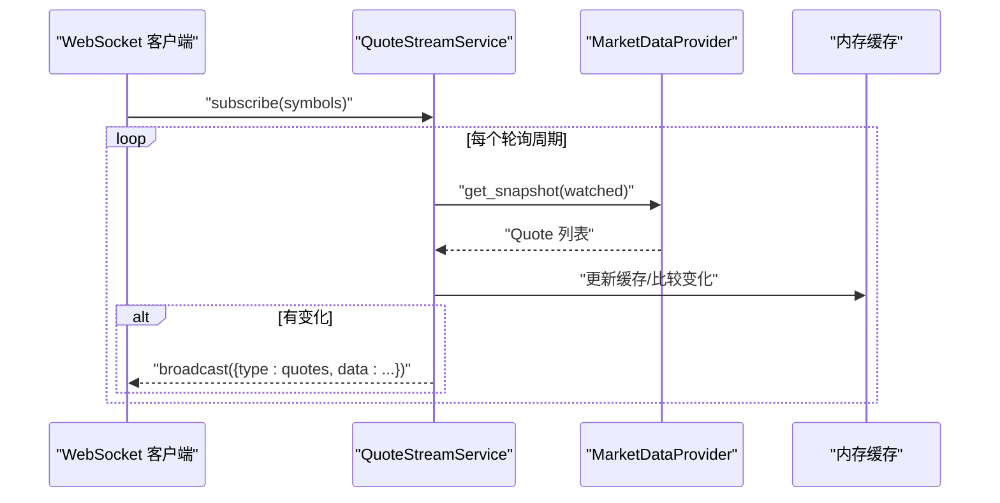
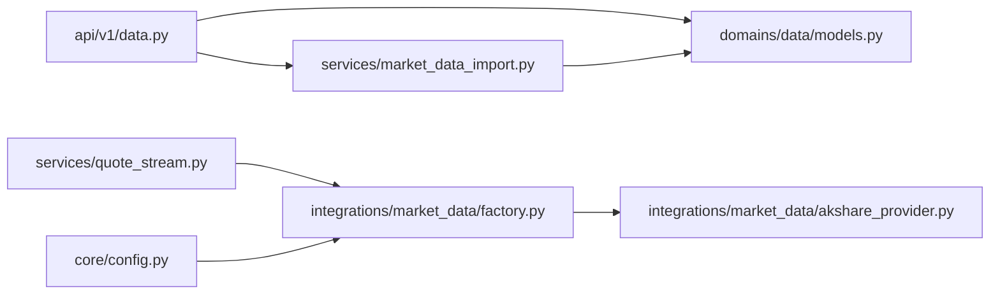

# 市场数据采集

<cite>
**本文档引用的文件**
- [backend/app/integrations/market_data/__init__.py](file://backend/app/integrations/market_data/__init__.py)
- [backend/app/integrations/market_data/base.py](file://backend/app/integrations/market_data/base.py)
- [backend/app/integrations/market_data/adapter.py](file://backend/app/integrations/market_data/adapter.py)
- [backend/app/integrations/market_data/factory.py](file://backend/app/integrations/market_data/factory.py)
- [backend/app/integrations/market_data/akshare_provider.py](file://backend/app/integrations/market_data/akshare_provider.py)
- [backend/app/integrations/market_data/mock_provider.py](file://backend/app/integrations/market_data/mock_provider.py)
- [backend/app/services/market_data_import.py](file://backend/app/services/market_data_import.py)
- [backend/app/services/quote_stream.py](file://backend/app/services/quote_stream.py)
- [backend/app/api/v1/data.py](file://backend/app/api/v1/data.py)
- [backend/app/api/v1/quotes.py](file://backend/app/api/v1/quotes.py)
- [backend/app/domains/data/models.py](file://backend/app/domains/data/models.py)
- [backend/app/core/config.py](file://backend/app/core/config.py)
- [backend/scripts/import_market_data.py](file://backend/scripts/import_market_data.py)
- [backend/tests/services/test_market_data_import.py](file://backend/tests/services/test_market_data_import.py)
- [backend/tests/api/test_market_data_import.py](file://backend/tests/api/test_market_data_import.py)
</cite>

## 目录
1. [简介](#简介)
2. [项目结构](#项目结构)
3. [核心组件](#核心组件)
4. [架构总览](#架构总览)
5. [详细组件分析](#详细组件分析)
6. [依赖关系分析](#依赖关系分析)
7. [性能考量](#性能考量)
8. [故障排查指南](#故障排查指南)
9. [结论](#结论)
10. [附录](#附录)

## 简介
本文件面向 llmine-quant 的市场数据采集系统，提供从架构到实现细节的全面技术文档。重点覆盖多数据源适配器架构（AkShare、TuShare、BaoStock、Wind 等），数据采集流程、数据格式标准化、异常处理与质量监控，以及 A 股市场的特殊规则（复权、停牌、ST 标识等）的落地方式。同时给出健康检查、延迟监控、缺失率统计与漂移检测的质量保障机制。

## 项目结构
市场数据相关代码主要集中在 backend/app/integrations/market_data 及其配套服务、API 层：
- 适配层：定义统一抽象与工厂选择器，具体提供商实现（AkShare、Mock 等）
- 导入服务：本地 CSV/AKShare 批量导入，清洗、去重、标准化与持久化
- 实时流：后台轮询 + WebSocket 广播，按订阅推送行情快照
- API 层：数据概览、导入接口、查询接口、质量看板
- 数据模型：数据源、健康快照、日线行情、事件等

图表来源
- [backend/app/integrations/market_data/factory.py:23-56](file://backend/app/integrations/market_data/factory.py#L23-L56)
- [backend/app/integrations/market_data/base.py:64-113](file://backend/app/integrations/market_data/base.py#L64-L113)
- [backend/app/integrations/market_data/akshare_provider.py:145-262](file://backend/app/integrations/market_data/akshare_provider.py#L145-L262)
- [backend/app/integrations/market_data/mock_provider.py:29-109](file://backend/app/integrations/market_data/mock_provider.py#L29-L109)
- [backend/app/services/market_data_import.py:177-426](file://backend/app/services/market_data_import.py#L177-L426)
- [backend/app/services/quote_stream.py:62-152](file://backend/app/services/quote_stream.py#L62-L152)
- [backend/app/api/v1/data.py:134-392](file://backend/app/api/v1/data.py#L134-L392)
- [backend/app/domains/data/models.py:9-144](file://backend/app/domains/data/models.py#L9-L144)

章节来源
- [backend/app/integrations/market_data/__init__.py:1-18](file://backend/app/integrations/market_data/__init__.py#L1-18)
- [backend/app/integrations/market_data/factory.py:1-57](file://backend/app/integrations/market_data/factory.py#L1-L57)

## 核心组件
- 统一抽象与数据模型
  - MarketDataProvider：历史与准实时 A 股数据抽象，支持异步 get_history/get_snapshot/get_market_snapshot，并内置交易时间判断
  - Quote/OHLCV/HistoryResult：标准报价与K线条目模型
- 工厂模式选择器
  - get_market_data_provider：根据配置选择 AkShare/Tushare/Wind/Mock，自动降级与日志记录
- 适配器接口
  - DataSourceAdapter：面向第三方数据源的适配器抽象，定义健康检查、符号列表、日K、财务等接口
- 提供商实现
  - AKShareProvider：基于 AKShare + 新浪接口的免费方案，支持批量实时快照与全市场扫描
  - MockMarketDataProvider：确定性合成数据，用于开发/测试
- 导入服务
  - MarketDataImportService：CSV/AKShare 导入，列别名映射、字段校验、去重、A 股特有标志位计算
- 实时流服务
  - QuoteStreamService：后台轮询订阅集合，增量广播，按交易时间调整轮询间隔

章节来源
- [backend/app/integrations/market_data/base.py:17-113](file://backend/app/integrations/market_data/base.py#L17-L113)
- [backend/app/integrations/market_data/factory.py:23-56](file://backend/app/integrations/market_data/factory.py#L23-L56)
- [backend/app/integrations/market_data/adapter.py:34-115](file://backend/app/integrations/market_data/adapter.py#L34-L115)
- [backend/app/integrations/market_data/akshare_provider.py:145-262](file://backend/app/integrations/market_data/akshare_provider.py#L145-L262)
- [backend/app/integrations/market_data/mock_provider.py:29-109](file://backend/app/integrations/market_data/mock_provider.py#L29-L109)
- [backend/app/services/market_data_import.py:177-426](file://backend/app/services/market_data_import.py#L177-L426)
- [backend/app/services/quote_stream.py:62-152](file://backend/app/services/quote_stream.py#L62-L152)

## 架构总览
系统采用“抽象 + 工厂 + 适配器”的分层设计，确保可插拔扩展与统一对外接口。实时行情通过后台任务按需拉取并广播；离线数据通过导入服务进行清洗与入库。

图表来源
- [backend/app/api/v1/data.py:155-191](file://backend/app/api/v1/data.py#L155-L191)
- [backend/app/services/market_data_import.py:185-241](file://backend/app/services/market_data_import.py#L185-L241)

## 详细组件分析

### 多数据源适配器架构
- 抽象与接口
  - MarketDataProvider：统一历史/快照接口，支持异步
  - DataSourceAdapter：第三方适配器抽象，定义健康检查、符号列表、日K/财务接口
- 具体实现
  - AKShareProvider：使用 AKShare 获取日线，新浪接口获取实时快照；支持频率映射与 intraday 支持声明
  - MockMarketDataProvider：固定蓝筹池，生成确定性价格序列，便于测试
- 工厂选择
  - 根据配置选择提供商，未安装依赖时自动回退至 Mock

图表来源
- [backend/app/integrations/market_data/base.py:64-113](file://backend/app/integrations/market_data/base.py#L64-L113)
- [backend/app/integrations/market_data/akshare_provider.py:145-262](file://backend/app/integrations/market_data/akshare_provider.py#L145-L262)
- [backend/app/integrations/market_data/mock_provider.py:29-109](file://backend/app/integrations/market_data/mock_provider.py#L29-L109)

章节来源
- [backend/app/integrations/market_data/base.py:64-113](file://backend/app/integrations/market_data/base.py#L64-L113)
- [backend/app/integrations/market_data/adapter.py:34-115](file://backend/app/integrations/market_data/adapter.py#L34-L115)
- [backend/app/integrations/market_data/akshare_provider.py:145-262](file://backend/app/integrations/market_data/akshare_provider.py#L145-L262)
- [backend/app/integrations/market_data/mock_provider.py:29-109](file://backend/app/integrations/market_data/mock_provider.py#L29-L109)
- [backend/app/integrations/market_data/factory.py:23-56](file://backend/app/integrations/market_data/factory.py#L23-L56)

### 数据采集流程与数据格式标准化
- 导入 CSV
  - 读取 CSV → 列别名映射 → 字段解析与校验 → 去重（按 symbol+trade_date）→ 计算 A 股特有标志位 → 写入数据库
- 导入 AKShare
  - 逐股票调用 AKShare 接口 → 合并为统一结构 → 标准化字段 → 写入数据库
- 标准化规则
  - 必填字段：symbol/trade_date/open/high/low/close/volume
  - 金额/成交量等数值字段严格校验范围与类型
  - A 股特有：停牌标记、涨跌停、ST 标识、买卖限制等

图表来源
- [backend/app/services/market_data_import.py:243-268](file://backend/app/services/market_data_import.py#L243-L268)
- [backend/app/services/market_data_import.py:292-403](file://backend/app/services/market_data_import.py#L292-L403)
- [backend/app/services/market_data_import.py:405-422](file://backend/app/services/market_data_import.py#L405-L422)

章节来源
- [backend/app/services/market_data_import.py:177-426](file://backend/app/services/market_data_import.py#L177-L426)
- [backend/app/domains/data/models.py:40-66](file://backend/app/domains/data/models.py#L40-L66)

### 异常处理机制
- 导入阶段
  - 缺失必填字段、非法数值、负数、越界等触发 MarketDataImportError，API 层转换为 400 错误
  - CSV 文件不存在或路径非文件触发 FileNotFoundError，API 层返回 404
- 实时轮询
  - 轮询循环捕获异常并记录警告日志，避免中断
- 工厂选择
  - 未安装依赖自动回退 Mock，并记录警告日志

章节来源
- [backend/app/api/v1/data.py:155-191](file://backend/app/api/v1/data.py#L155-L191)
- [backend/app/services/market_data_import.py:21-23](file://backend/app/services/market_data_import.py#L21-L23)
- [backend/app/services/quote_stream.py:112-123](file://backend/app/services/quote_stream.py#L112-L123)
- [backend/app/integrations/market_data/factory.py:32-40](file://backend/app/integrations/market_data/factory.py#L32-L40)

### 数据质量监控与保障
- 健康检查
  - DataSourceHealth 结构包含状态、延迟、缺失率、漂移分、最后检查时间等
  - 适配器示例中提供健康检查方法（占位实现）
- 延迟监控
  - QuoteStreamService 按交易时间调整轮询间隔，减少非交易时段开销
- 缺失率统计
  - DataSourceHealth 中的 missing_pct 字段用于记录缺失比例
- 漂移检测
  - drift_score 字段用于记录数据漂移评分
- 数据看板
  - API 提供数据概览、延迟趋势、偏差门禁、事件等可视化指标

章节来源
- [backend/app/integrations/market_data/adapter.py:22-32](file://backend/app/integrations/market_data/adapter.py#L22-L32)
- [backend/app/integrations/market_data/akshare_provider.py:82-87](file://backend/app/integrations/market_data/akshare_provider.py#L82-L87)
- [backend/app/services/quote_stream.py:112-123](file://backend/app/services/quote_stream.py#L112-L123)
- [backend/app/api/v1/data.py:134-146](file://backend/app/api/v1/data.py#L134-L146)

### A 股特殊规则实现
- 复权处理
  - 历史接口支持 qfq/hfq/none 三种复权方式；导入时可保留复权因子与复权收盘价
- 停牌标记
  - 当日成交量为 0 标记 is_suspended，同时禁止买卖
- ST 标识与涨跌停
  - is_st 标记决定涨跌停阈值（ST 为 5%，非 ST 为 10%）
  - 计算 limit_up_price/limit_down_price 并标记 is_limit_up/is_limit_down
  - can_buy/can_sell 基于停牌与涨跌停状态
- 买卖限制
  - 停牌或涨跌停当日不可买入/卖出

图表来源
- [backend/app/services/market_data_import.py:405-422](file://backend/app/services/market_data_import.py#L405-L422)

章节来源
- [backend/app/services/market_data_import.py:405-422](file://backend/app/services/market_data_import.py#L405-L422)
- [backend/app/domains/data/models.py:40-66](file://backend/app/domains/data/models.py#L40-L66)

### 实时行情轮询与广播
- 设计要点
  - 仅对已订阅符号进行轮询，避免全市场扫描
  - 使用新浪接口批量获取实时快照，单次请求低延迟
  - 交易时间内短轮询，非交易时间长轮询
- 生命周期
  - 启动时创建后台任务，停止时取消任务
- 广播
  - 价格变化时增量广播，订阅者收到更新消息

图表来源
- [backend/app/services/quote_stream.py:112-147](file://backend/app/services/quote_stream.py#L112-L147)
- [backend/app/integrations/market_data/base.py:94-113](file://backend/app/integrations/market_data/base.py#L94-L113)

章节来源
- [backend/app/services/quote_stream.py:62-152](file://backend/app/services/quote_stream.py#L62-L152)
- [backend/app/api/v1/quotes.py:48-64](file://backend/app/api/v1/quotes.py#L48-L64)

### 数据导入脚本与 API
- 脚本入口
  - 支持 CSV 与 AKShare 两种导入方式，输出 JSON 导入摘要
- API 接口
  - CSV 导入：/api/v1/data/market-bars/import/csv
  - AKShare 导入：/api/v1/data/market-bars/import/akshare
  - 查询日线：/api/v1/data/market-bars
  - 数据概览：/api/v1/data/overview

章节来源
- [backend/scripts/import_market_data.py:14-52](file://backend/scripts/import_market_data.py#L14-L52)
- [backend/app/api/v1/data.py:155-250](file://backend/app/api/v1/data.py#L155-L250)

## 依赖关系分析
- 组件耦合
  - API 层仅依赖服务层接口，不直接感知具体提供商
  - 服务层依赖数据模型与配置，导入服务同时依赖数据库会话
  - 实时流服务依赖工厂选择的提供商实例
- 外部依赖
  - AKShare：用于免费日线与实时快照
  - SQLAlchemy：ORM 持久化
  - FastAPI/WebSocket：实时广播与 REST 接口

图表来源
- [backend/app/api/v1/data.py:155-191](file://backend/app/api/v1/data.py#L155-L191)
- [backend/app/services/market_data_import.py:177-241](file://backend/app/services/market_data_import.py#L177-L241)
- [backend/app/services/quote_stream.py:73-76](file://backend/app/services/quote_stream.py#L73-L76)
- [backend/app/integrations/market_data/factory.py:23-56](file://backend/app/integrations/market_data/factory.py#L23-L56)
- [backend/app/integrations/market_data/akshare_provider.py:145-262](file://backend/app/integrations/market_data/akshare_provider.py#L145-L262)
- [backend/app/core/config.py:80-86](file://backend/app/core/config.py#L80-L86)

章节来源
- [backend/app/api/v1/data.py:1-392](file://backend/app/api/v1/data.py#L1-L392)
- [backend/app/services/market_data_import.py:1-426](file://backend/app/services/market_data_import.py#L1-L426)
- [backend/app/services/quote_stream.py:1-152](file://backend/app/services/quote_stream.py#L1-L152)
- [backend/app/integrations/market_data/factory.py:1-57](file://backend/app/integrations/market_data/factory.py#L1-L57)
- [backend/app/core/config.py:1-196](file://backend/app/core/config.py#L1-L196)

## 性能考量
- 实时轮询优化
  - 仅轮询订阅集合，避免全市场扫描
  - 交易时间短轮询，非交易时间长轮询，降低无效请求
- 导入批处理
  - 使用 to_thread 将阻塞式 AKShare 调用异步化，避免阻塞事件循环
  - 批量写入数据库，减少事务次数
- 数据库索引
  - 日线表按 symbol/trade_date 建唯一索引，加速去重与查询
- 解析与校验
  - 字符串到数值的懒解析与严格校验，避免后续错误传播

## 故障排查指南
- 导入失败
  - 检查 CSV 是否存在、字段是否齐全、数值是否合法
  - 若使用 AKShare，确认已安装依赖且网络可达
- 实时行情不更新
  - 确认订阅集合非空，交易时间轮询间隔生效
  - 查看日志中的 quote_poll_error 警告
- 健康状态异常
  - 检查 DataSourceHealth 的状态、延迟、缺失率与漂移分
  - 对应调整轮询策略或切换数据源

章节来源
- [backend/app/api/v1/data.py:155-191](file://backend/app/api/v1/data.py#L155-L191)
- [backend/app/services/quote_stream.py:112-123](file://backend/app/services/quote_stream.py#L112-L123)
- [backend/app/integrations/market_data/adapter.py:22-32](file://backend/app/integrations/market_data/adapter.py#L22-L32)

## 结论
该系统通过抽象与工厂模式实现了多数据源的统一接入，结合导入服务的数据标准化与质量监控，满足 A 股市场的复杂业务需求。实时流与 REST 接口协同，既保证了低延迟的交互体验，也提供了完善的离线数据管理能力。建议在生产环境中持续完善第三方适配器（如 TuShare、Wind）的具体实现，并加强健康检查与漂移检测的自动化与可视化。

## 附录
- 配置项
  - market_data_provider：选择提供商（akshare/tushare/wind/mock）
  - market_data_poll_interval：交易时间轮询间隔（秒）
  - tushare_token：当使用 TuShare 时必需
- 测试覆盖
  - 单元测试验证导入去重、替换、A 股标志位计算
  - API 测试验证导入与查询链路

章节来源
- [backend/app/core/config.py:80-86](file://backend/app/core/config.py#L80-L86)
- [backend/tests/services/test_market_data_import.py:25-134](file://backend/tests/services/test_market_data_import.py#L25-L134)
- [backend/tests/api/test_market_data_import.py:32-61](file://backend/tests/api/test_market_data_import.py#L32-L61)