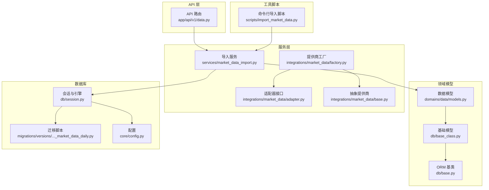
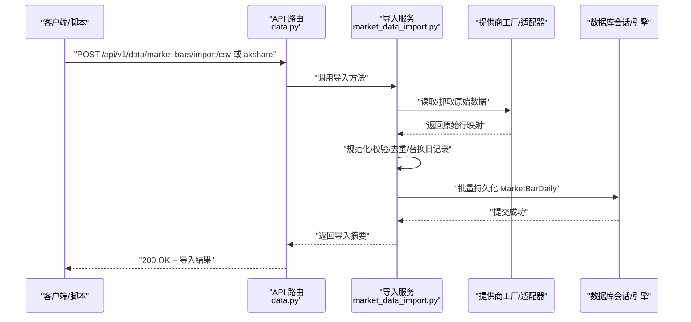
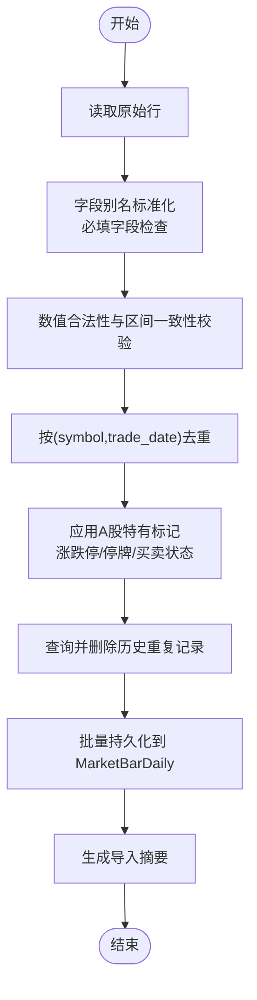
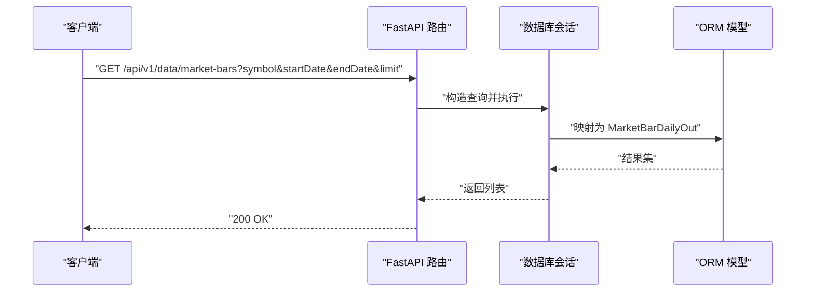
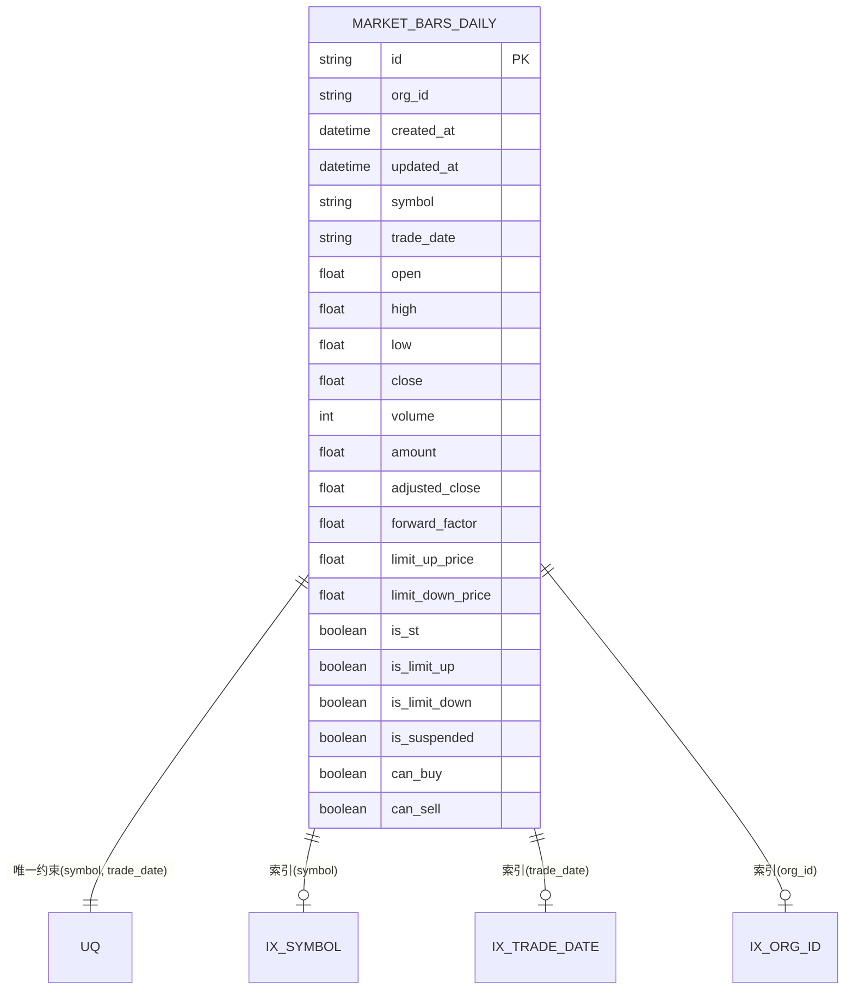
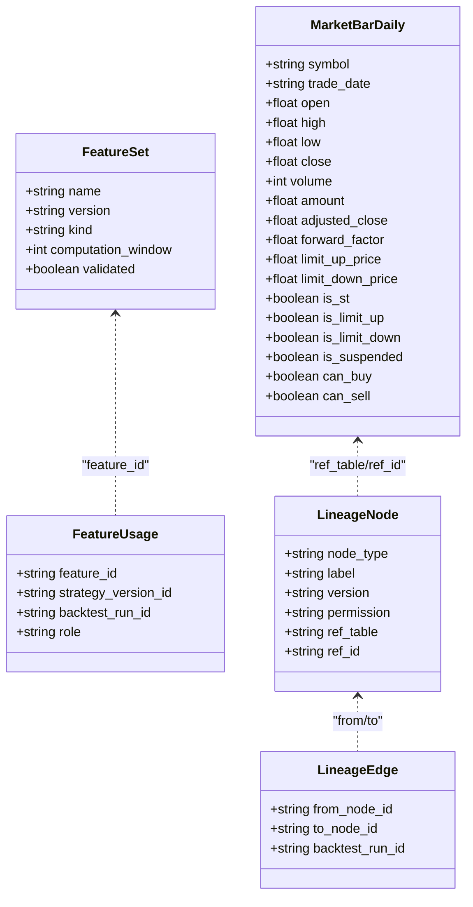
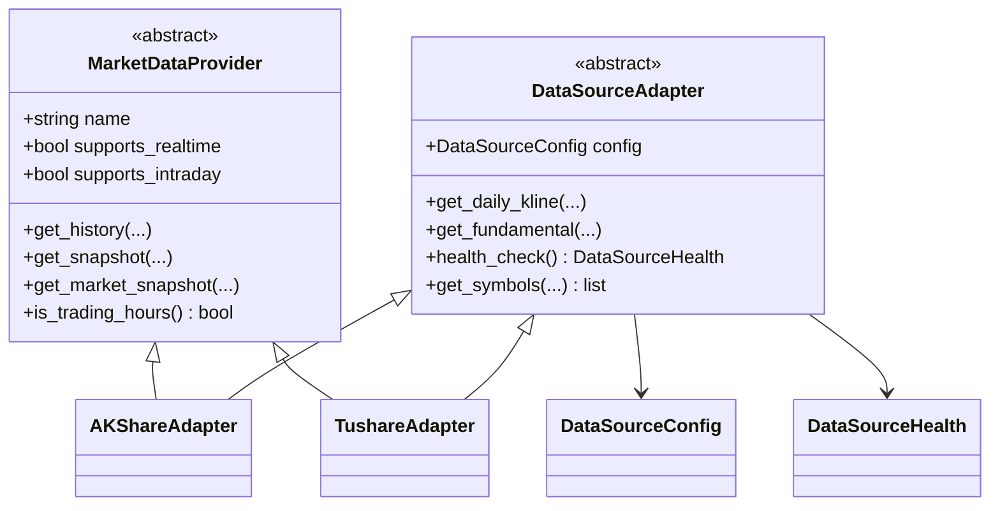
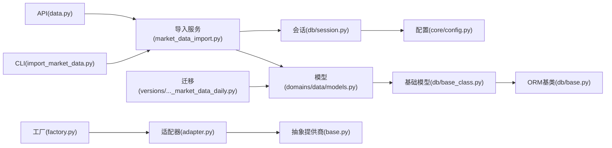

# 数据处理流水线

<cite>
**本文引用的文件**
- [backend/app/api/v1/data.py](file://backend/app/api/v1/data.py)
- [backend/app/services/market_data_import.py](file://backend/app/services/market_data_import.py)
- [backend/app/integrations/market_data/adapter.py](file://backend/app/integrations/market_data/adapter.py)
- [backend/app/integrations/market_data/factory.py](file://backend/app/integrations/market_data/factory.py)
- [backend/app/integrations/market_data/base.py](file://backend/app/integrations/market_data/base.py)
- [backend/app/domains/data/models.py](file://backend/app/domains/data/models.py)
- [backend/app/db/session.py](file://backend/app/db/session.py)
- [backend/app/db/base.py](file://backend/app/db/base.py)
- [backend/app/db/base_class.py](file://backend/app/db/base_class.py)
- [backend/app/db/migrations/versions/20260512_000003_market_data_daily.py](file://backend/app/db/migrations/versions/20260512_000003_market_data_daily.py)
- [backend/app/core/config.py](file://backend/app/core/config.py)
- [backend/scripts/import_market_data.py](file://backend/scripts/import_market_data.py)
- [backend/app/services/feature_lineage.py](file://backend/app/services/feature_lineage.py)
</cite>

## 目录
1. [简介](#简介)
2. [项目结构](#项目结构)
3. [核心组件](#核心组件)
4. [架构总览](#架构总览)
5. [详细组件分析](#详细组件分析)
6. [依赖分析](#依赖分析)
7. [性能考虑](#性能考虑)
8. [故障排查指南](#故障排查指南)
9. [结论](#结论)
10. [附录](#附录)

## 简介
本文件面向 llmine-quant 的数据处理流水线，系统化阐述从原始数据到清洗数据的转换流程，覆盖数据验证、异常值检测、缺失值处理与数据标准化；深入解析 TimescaleDB 在时间序列数据存储中的使用策略（索引设计、唯一约束与查询优化）；解释数据质量控制机制（完整性检查、一致性验证、异常检测算法）；并提供配置选项、性能优化策略与故障恢复机制，帮助研发与运维人员高效落地与维护数据管线。

## 项目结构
后端采用 FastAPI + SQLAlchemy Async 架构，数据域模型集中在 domains/data 下，导入服务位于 services/market_data_import.py，API 入口在 app/api/v1/data.py，数据库会话与引擎在 app/db 下管理，迁移脚本在 app/db/migrations/versions 中定义。

**图表来源**
- [backend/app/api/v1/data.py:134-146](file://backend/app/api/v1/data.py#L134-L146)
- [backend/app/services/market_data_import.py:177-241](file://backend/app/services/market_data_import.py#L177-L241)
- [backend/app/integrations/market_data/factory.py:23-56](file://backend/app/integrations/market_data/factory.py#L23-L56)
- [backend/app/integrations/market_data/adapter.py:34-68](file://backend/app/integrations/market_data/adapter.py#L34-L68)
- [backend/app/integrations/market_data/base.py:64-113](file://backend/app/integrations/market_data/base.py#L64-L113)
- [backend/app/domains/data/models.py:40-67](file://backend/app/domains/data/models.py#L40-L67)
- [backend/app/db/base_class.py:17-31](file://backend/app/db/base_class.py#L17-L31)
- [backend/app/db/base.py:6-10](file://backend/app/db/base.py#L6-L10)
- [backend/app/db/session.py:14-21](file://backend/app/db/session.py#L14-L21)
- [backend/app/db/migrations/versions/20260512_000003_market_data_daily.py:34-62](file://backend/app/db/migrations/versions/20260512_000003_market_data_daily.py#L34-L62)
- [backend/app/core/config.py:57-60](file://backend/app/core/config.py#L57-L60)
- [backend/scripts/import_market_data.py:14-32](file://backend/scripts/import_market_data.py#L14-L32)

**章节来源**
- [backend/app/api/v1/data.py:134-146](file://backend/app/api/v1/data.py#L134-L146)
- [backend/app/services/market_data_import.py:177-241](file://backend/app/services/market_data_import.py#L177-L241)
- [backend/app/integrations/market_data/factory.py:23-56](file://backend/app/integrations/market_data/factory.py#L23-L56)
- [backend/app/integrations/market_data/adapter.py:34-68](file://backend/app/integrations/market_data/adapter.py#L34-L68)
- [backend/app/integrations/market_data/base.py:64-113](file://backend/app/integrations/market_data/base.py#L64-L113)
- [backend/app/domains/data/models.py:40-67](file://backend/app/domains/data/models.py#L40-L67)
- [backend/app/db/base_class.py:17-31](file://backend/app/db/base_class.py#L17-L31)
- [backend/app/db/base.py:6-10](file://backend/app/db/base.py#L6-L10)
- [backend/app/db/session.py:14-21](file://backend/app/db/session.py#L14-L21)
- [backend/app/db/migrations/versions/20260512_000003_market_data_daily.py:34-62](file://backend/app/db/migrations/versions/20260512_000003_market_data_daily.py#L34-L62)
- [backend/app/core/config.py:57-60](file://backend/app/core/config.py#L57-L60)
- [backend/scripts/import_market_data.py:14-32](file://backend/scripts/import_market_data.py#L14-L32)

## 核心组件
- 数据导入服务：负责 CSV/AKShare 等来源的数据读取、规范化、清洗、去重、替换旧记录、持久化与统计汇总。
- API 接口：提供数据概览、导入、查询、特征与血缘查询等能力。
- 数据模型：定义市场日线、特征集、血缘节点/边、数据质量事件等表结构与索引。
- 数据库会话与引擎：基于 SQLAlchemy Async，支持 PostgreSQL/SQLite，并提供统一依赖注入。
- 提供商工厂与适配器：抽象不同数据源（AKShare/Tushare/Wind/Mock），按配置选择实现。
- 迁移脚本：定义 market_bars_daily 表的列、唯一约束与索引。

**章节来源**
- [backend/app/services/market_data_import.py:177-241](file://backend/app/services/market_data_import.py#L177-L241)
- [backend/app/api/v1/data.py:134-146](file://backend/app/api/v1/data.py#L134-L146)
- [backend/app/domains/data/models.py:40-67](file://backend/app/domains/data/models.py#L40-L67)
- [backend/app/db/session.py:14-21](file://backend/app/db/session.py#L14-L21)
- [backend/app/integrations/market_data/factory.py:23-56](file://backend/app/integrations/market_data/factory.py#L23-L56)
- [backend/app/db/migrations/versions/20260512_000003_market_data_daily.py:34-62](file://backend/app/db/migrations/versions/20260512_000003_market_data_daily.py#L34-L62)

## 架构总览
数据从外部提供商或本地 CSV 进入，经导入服务进行规范化与清洗，写入数据库；API 层对外提供查询与监控视图；迁移脚本确保表结构与索引符合时间序列访问模式。

**图表来源**
- [backend/app/api/v1/data.py:155-191](file://backend/app/api/v1/data.py#L155-L191)
- [backend/app/services/market_data_import.py:185-241](file://backend/app/services/market_data_import.py#L185-L241)
- [backend/app/integrations/market_data/factory.py:23-56](file://backend/app/integrations/market_data/factory.py#L23-L56)
- [backend/app/db/session.py:24-34](file://backend/app/db/session.py#L24-L34)

## 详细组件分析

### 组件一：数据导入与清洗流水线
- 输入来源：本地 CSV、AKShare 实时抓取。
- 规范化与校验：
  - 字段别名映射与必填字段检查。
  - 数值类型解析与合法性校验（非有限数、负值等）。
  - 价格区间一致性校验（低<=开<=收<=高等）。
- 去重与替换：按 symbol+trade_date 去重；对重复键先删除旧记录再插入新记录。
- A 股特有标记：前收盘、涨跌停价格与状态、停牌、买卖可否等。
- 结果汇总：统计总数、导入数、新增数、更新数、跳过数与错误列表。

**图表来源**
- [backend/app/services/market_data_import.py:243-268](file://backend/app/services/market_data_import.py#L243-L268)
- [backend/app/services/market_data_import.py:270-289](file://backend/app/services/market_data_import.py#L270-L289)
- [backend/app/services/market_data_import.py:405-422](file://backend/app/services/market_data_import.py#L405-L422)

**章节来源**
- [backend/app/services/market_data_import.py:185-241](file://backend/app/services/market_data_import.py#L185-L241)
- [backend/app/services/market_data_import.py:243-268](file://backend/app/services/market_data_import.py#L243-L268)
- [backend/app/services/market_data_import.py:270-289](file://backend/app/services/market_data_import.py#L270-L289)
- [backend/app/services/market_data_import.py:292-422](file://backend/app/services/market_data_import.py#L292-L422)

### 组件二：API 与数据查询
- 数据概览：聚合健康度指标、延迟趋势、偏见闸门、血缘链路与事件。
- 导入接口：支持 CSV 文件与 AKShare 两种方式，返回导入摘要。
- 查询接口：支持按 symbol/date/limit 过滤查询日线数据；支持列出特征与使用情况；支持按回测运行 ID 查询血缘图。

**图表来源**
- [backend/app/api/v1/data.py:194-211](file://backend/app/api/v1/data.py#L194-L211)
- [backend/app/domains/data/models.py:40-67](file://backend/app/domains/data/models.py#L40-L67)

**章节来源**
- [backend/app/api/v1/data.py:134-146](file://backend/app/api/v1/data.py#L134-L146)
- [backend/app/api/v1/data.py:155-191](file://backend/app/api/v1/data.py#L155-L191)
- [backend/app/api/v1/data.py:194-211](file://backend/app/api/v1/data.py#L194-L211)
- [backend/app/api/v1/data.py:226-249](file://backend/app/api/v1/data.py#L226-L249)
- [backend/app/api/v1/data.py:252-296](file://backend/app/api/v1/data.py#L252-L296)
- [backend/app/api/v1/data.py:299-327](file://backend/app/api/v1/data.py#L299-L327)

### 组件三：TimescaleDB 使用策略与索引设计
- 存储对象：MarketBarDaily 用于日线 OHLCV 时间序列。
- 唯一约束：symbol + trade_date，避免重复写入。
- 索引设计：对 symbol、trade_date、org_id 建立索引，满足高频过滤与范围扫描需求。
- 查询优化建议：
  - 使用 symbol 粒度分页与 limit 控制输出规模。
  - 对日期范围查询使用连续索引扫描。
  - 批量写入减少事务开销。
  - 生产环境建议使用 TimescaleDB（通过连接字符串与扩展启用时序特性）。

**图表来源**
- [backend/app/domains/data/models.py:40-67](file://backend/app/domains/data/models.py#L40-L67)
- [backend/app/db/migrations/versions/20260512_000003_market_data_daily.py:34-62](file://backend/app/db/migrations/versions/20260512_000003_market_data_daily.py#L34-L62)

**章节来源**
- [backend/app/domains/data/models.py:40-67](file://backend/app/domains/data/models.py#L40-L67)
- [backend/app/db/migrations/versions/20260512_000003_market_data_daily.py:34-62](file://backend/app/db/migrations/versions/20260512_000003_market_data_daily.py#L34-L62)

### 组件四：数据质量控制机制
- 完整性检查：必填字段缺失即报错；空符号默认值仅在存在时生效。
- 一致性验证：价格区间与数值合法性（非有限数、负值）严格校验。
- 异常检测算法：基于前收盘推导涨跌停阈值，识别涨停/跌停/停牌状态；对异常波动与缺失率进行监控（API 层以指标形式呈现）。
- 血缘与版本：通过 FeatureSet/FeatureUsage/LineageNode/LineageEdge 记录特征与回测运行的血缘链路，便于审计与溯源。

**图表来源**
- [backend/app/domains/data/models.py:40-67](file://backend/app/domains/data/models.py#L40-L67)
- [backend/app/domains/data/models.py:81-107](file://backend/app/domains/data/models.py#L81-L107)
- [backend/app/domains/data/models.py:109-130](file://backend/app/domains/data/models.py#L109-L130)

**章节来源**
- [backend/app/services/market_data_import.py:292-422](file://backend/app/services/market_data_import.py#L292-L422)
- [backend/app/services/feature_lineage.py:100-194](file://backend/app/services/feature_lineage.py#L100-L194)

### 组件五：提供商工厂与适配器
- 工厂：根据配置选择 AKShare/Tushare/Wind/Mock 提供商，自动降级与日志提示。
- 适配器：统一抽象 get_daily_kline/get_fundamental/health_check/get_symbols 等接口。
- 基类：定义历史与快照数据结构与交易时段判断。

**图表来源**
- [backend/app/integrations/market_data/base.py:64-113](file://backend/app/integrations/market_data/base.py#L64-L113)
- [backend/app/integrations/market_data/adapter.py:34-68](file://backend/app/integrations/market_data/adapter.py#L34-L68)
- [backend/app/integrations/market_data/adapter.py:71-92](file://backend/app/integrations/market_data/adapter.py#L71-L92)
- [backend/app/integrations/market_data/adapter.py:94-114](file://backend/app/integrations/market_data/adapter.py#L94-L114)
- [backend/app/integrations/market_data/adapter.py:10-20](file://backend/app/integrations/market_data/adapter.py#L10-L20)
- [backend/app/integrations/market_data/adapter.py:22-31](file://backend/app/integrations/market_data/adapter.py#L22-L31)

**章节来源**
- [backend/app/integrations/market_data/factory.py:23-56](file://backend/app/integrations/market_data/factory.py#L23-L56)
- [backend/app/integrations/market_data/adapter.py:34-68](file://backend/app/integrations/market_data/adapter.py#L34-L68)
- [backend/app/integrations/market_data/base.py:64-113](file://backend/app/integrations/market_data/base.py#L64-L113)

### 组件六：命令行导入脚本
- 支持 CSV 与 AKShare 两种导入方式，参数化 symbol、日期范围与复权方式。
- 输出 JSON 格式的导入摘要，便于自动化集成与监控。

**章节来源**
- [backend/scripts/import_market_data.py:14-32](file://backend/scripts/import_market_data.py#L14-L32)
- [backend/scripts/import_market_data.py:34-48](file://backend/scripts/import_market_data.py#L34-L48)

## 依赖分析
- API 依赖导入服务与数据库会话；导入服务依赖提供商工厂与模型；模型依赖基础 ORM 与审计字段基类；会话依赖配置与引擎；迁移脚本依赖 Alembic 与 SQLAlchemy。
- 耦合与内聚：API 与服务解耦，服务与提供商解耦，模型与 ORM 解耦；依赖方向清晰，便于测试与扩展。

**图表来源**
- [backend/app/api/v1/data.py:134-146](file://backend/app/api/v1/data.py#L134-L146)
- [backend/app/services/market_data_import.py:177-241](file://backend/app/services/market_data_import.py#L177-L241)
- [backend/app/domains/data/models.py:40-67](file://backend/app/domains/data/models.py#L40-L67)
- [backend/app/db/session.py:14-21](file://backend/app/db/session.py#L14-L21)
- [backend/app/core/config.py:57-60](file://backend/app/core/config.py#L57-L60)
- [backend/app/db/base_class.py:17-31](file://backend/app/db/base_class.py#L17-L31)
- [backend/app/db/base.py:6-10](file://backend/app/db/base.py#L6-L10)
- [backend/app/integrations/market_data/factory.py:23-56](file://backend/app/integrations/market_data/factory.py#L23-L56)
- [backend/app/integrations/market_data/adapter.py:34-68](file://backend/app/integrations/market_data/adapter.py#L34-L68)
- [backend/app/integrations/market_data/base.py:64-113](file://backend/app/integrations/market_data/base.py#L64-L113)
- [backend/app/db/migrations/versions/20260512_000003_market_data_daily.py:34-62](file://backend/app/db/migrations/versions/20260512_000003_market_data_daily.py#L34-L62)
- [backend/scripts/import_market_data.py:14-32](file://backend/scripts/import_market_data.py#L14-L32)

**章节来源**
- 同“图表来源”所列文件

## 性能考虑
- 数据导入
  - 批量插入：服务端一次性 flush，减少事务次数。
  - 去重与替换：先删除旧记录再插入，避免唯一冲突导致的失败重试。
  - 字段解析：统一解析与校验，减少后续查询阶段的异常处理成本。
- 数据库访问
  - 索引命中：按 symbol/trade_date 查询与排序，充分利用索引。
  - 分页与限制：API 默认 limit 与最大限制，防止大结果集拖垮内存。
  - 引擎参数：异步引擎与连接池参数可根据负载调整。
- TimescaleDB 建议
  - 使用时序扩展（hypertables）以获得更好的时间序列压缩与查询性能。
  - 对高频查询字段建立复合索引（如 symbol+trade_date）。
  - 合理分区与压缩策略降低存储与 IO 开销。

[本节为通用指导，不直接分析具体文件]

## 故障排查指南
- 常见错误
  - 缺失必填字段：导入服务会抛出导入错误，需补齐 symbol/date/open/high/low/close/volume。
  - 非法数值：空值、负值、非有限数、日期格式错误均会被拒绝。
  - 重复键：重复的 symbol+trade_date 将被替换，若出现异常可检查历史数据。
- API 层错误
  - 导入接口返回 400/404，需检查路径、权限与参数。
  - 查询接口返回空列表，确认 symbol 与日期范围是否正确。
- 数据质量
  - 健康度指标与偏见闸门：关注延迟、缺失率、漂移分与事件状态。
  - 血缘链路：通过运行 ID 查询血缘，定位问题来源。

**章节来源**
- [backend/app/services/market_data_import.py:21-23](file://backend/app/services/market_data_import.py#L21-L23)
- [backend/app/services/market_data_import.py:302-307](file://backend/app/services/market_data_import.py#L302-L307)
- [backend/app/services/market_data_import.py:355-371](file://backend/app/services/market_data_import.py#L355-L371)
- [backend/app/api/v1/data.py:168-172](file://backend/app/api/v1/data.py#L168-L172)
- [backend/app/api/v1/data.py:194-211](file://backend/app/api/v1/data.py#L194-L211)

## 结论
llmine-quant 的数据处理流水线以“规范化—清洗—去重—替换—持久化”为核心，结合严格的字段校验与 A 股特有标记，形成高质量的时间序列数据资产。API 层提供完整的查询与监控能力，配合迁移脚本与索引设计，满足生产环境对性能与可维护性的要求。通过提供商工厂与适配器，系统具备良好的扩展性，便于接入更多数据源。建议在生产中启用 TimescaleDB 时序扩展与合理的索引/分区策略，持续监控健康度指标与血缘链路，保障数据质量与可追溯性。

[本节为总结性内容，不直接分析具体文件]

## 附录

### 配置选项
- 数据库
  - database_url：数据库连接串（支持 PostgreSQL/SQLite）
  - database_echo：SQL 输出开关
- 市场数据提供商
  - market_data_provider：akshare/tushare/wind/mock
  - tushare_token：当提供商为 tushare 时必需
- 其他
  - redis_url：缓存/队列
  - log_level：日志级别
  - api_v1_prefix：API 前缀
  - cors_origins：跨域白名单

**章节来源**
- [backend/app/core/config.py:57-60](file://backend/app/core/config.py#L57-L60)
- [backend/app/core/config.py:80-86](file://backend/app/core/config.py#L80-L86)
- [backend/app/core/config.py:61-62](file://backend/app/core/config.py#L61-L62)
- [backend/app/core/config.py:70-71](file://backend/app/core/config.py#L70-L71)
- [backend/app/core/config.py:72-74](file://backend/app/core/config.py#L72-L74)