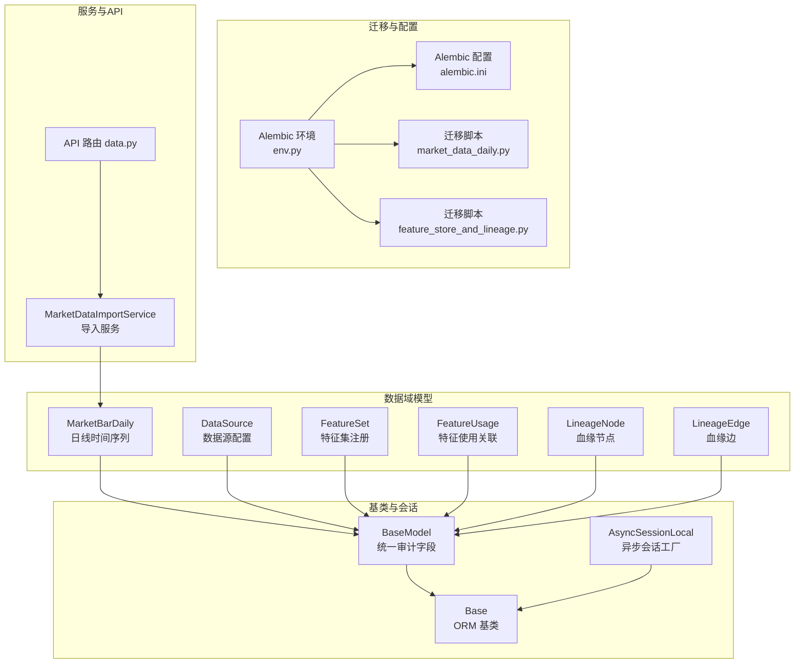
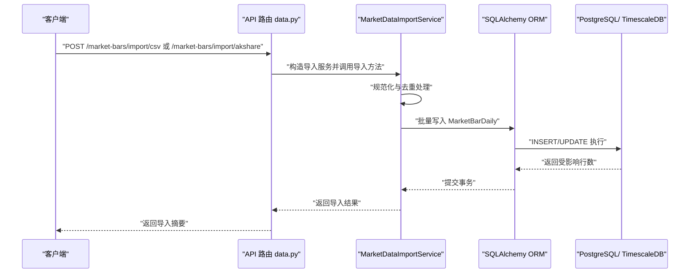
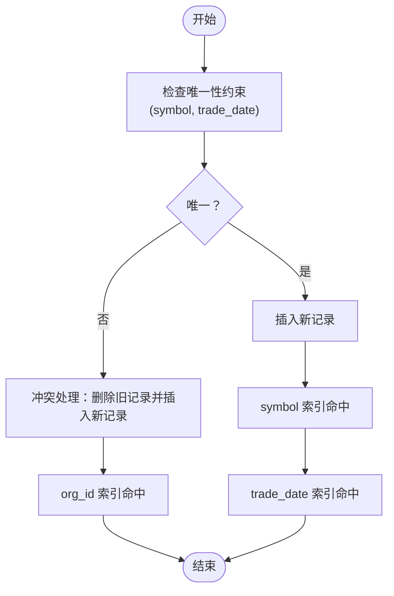
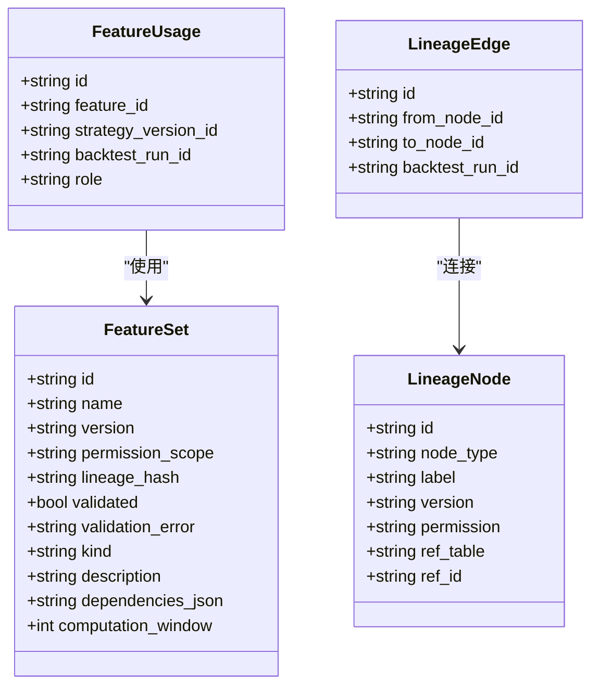
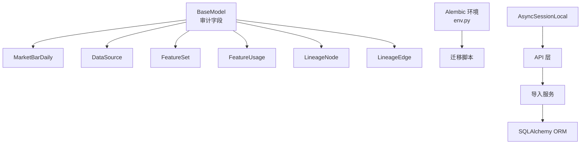

# 数据库模式设计

<cite>
**本文档引用的文件**
- [backend/app/domains/data/models.py](file://backend/app/domains/data/models.py)
- [backend/app/db/base_class.py](file://backend/app/db/base_class.py)
- [backend/app/db/base.py](file://backend/app/db/base.py)
- [backend/app/db/migrations/versions/20260512_000003_market_data_daily.py](file://backend/app/db/migrations/versions/20260512_000003_market_data_daily.py)
- [backend/app/db/migrations/versions/61868637158e_feature_store_and_lineage.py](file://backend/app/db/migrations/versions/61868637158e_feature_store_and_lineage.py)
- [backend/app/db/migrations/env.py](file://backend/app/db/migrations/env.py)
- [backend/alembic.ini](file://backend/alembic.ini)
- [backend/app/services/market_data_import.py](file://backend/app/services/market_data_import.py)
- [backend/app/api/v1/data.py](file://backend/app/api/v1/data.py)
- [backend/app/db/session.py](file://backend/app/db/session.py)
</cite>

## 目录
1. [简介](#简介)
2. [项目结构](#项目结构)
3. [核心组件](#核心组件)
4. [架构总览](#架构总览)
5. [详细组件分析](#详细组件分析)
6. [依赖分析](#依赖分析)
7. [性能考虑](#性能考虑)
8. [故障排查指南](#故障排查指南)
9. [结论](#结论)
10. [附录](#附录)

## 简介
本文件面向 llmine-quant 后端的数据管理子系统，聚焦于三大核心数据表：MarketBarDaily（日线时间序列）、DataSource（数据源配置）与 FeatureSet（特征注册）。文档从数据库模式设计、表间关系、索引策略、Alembic 迁移管理、版本控制与数据迁移策略、查询优化、分区与备份恢复等方面进行系统化阐述，并提供可操作的实践建议。

## 项目结构
围绕数据域的关键文件组织如下：
- 模型定义：位于数据域模型文件中，定义了 MarketBarDaily、DataSource、FeatureSet 及其关联表（FeatureUsage、LineageNode、LineageEdge）等。
- 基类与会话：BaseModel 提供统一审计字段；session.py 提供异步会话工厂；base.py 定义 ORM 基类。
- 迁移管理：通过 Alembic 在 versions 目录下维护版本化迁移脚本；env.py 配置异步迁移环境；alembic.ini 统一配置 SQLAlchemy URL 与日志。
- 服务与 API：market_data_import.py 实现 CSV/AKShare 导入与规范化；data.py 提供导入接口与查询端点。

**图表来源**
- [backend/app/domains/data/models.py:9-144](file://backend/app/domains/data/models.py#L9-L144)
- [backend/app/db/base_class.py:17-31](file://backend/app/db/base_class.py#L17-L31)
- [backend/app/db/base.py:6-9](file://backend/app/db/base.py#L6-L9)
- [backend/app/db/migrations/env.py:11-62](file://backend/app/db/migrations/env.py#L11-L62)
- [backend/alembic.ini:58-58](file://backend/alembic.ini#L58-L58)
- [backend/app/services/market_data_import.py:177-242](file://backend/app/services/market_data_import.py#L177-L242)
- [backend/app/api/v1/data.py:155-191](file://backend/app/api/v1/data.py#L155-L191)

**章节来源**
- [backend/app/domains/data/models.py:9-144](file://backend/app/domains/data/models.py#L9-L144)
- [backend/app/db/base_class.py:17-31](file://backend/app/db/base_class.py#L17-L31)
- [backend/app/db/migrations/env.py:11-62](file://backend/app/db/migrations/env.py#L11-L62)
- [backend/alembic.ini:58-58](file://backend/alembic.ini#L58-L58)

## 核心组件
本节对三个核心表进行深入解析，涵盖字段语义、约束与索引策略。

- MarketBarDaily（日线时间序列）
  - 设计理念：用于存储每日 OHLCV（开盘、最高、最低、收盘、成交量）等价格与状态字段，强调时间序列的唯一性与高效查询。
  - 关键字段：symbol、trade_date、open、high、low、close、volume、amount、adjusted_close、forward_factor、is_st、is_limit_up、is_limit_down、is_suspended、can_buy、can_sell 等。
  - 约束与索引：主键为 UUID；唯一性约束覆盖 (symbol, trade_date)；为 org_id、symbol、trade_date 建立索引以支持按组织、按股票、按日期查询。
  - 复杂度：唯一性约束确保每只股票每日仅一条记录，避免重复写入；索引支持高频查询路径。

- DataSource（数据源配置）
  - 设计理念：集中管理外部数据源的元数据与健康指标，便于监控与切换。
  - 关键字段：name、provider、tier、license_scope、type、coverage、status、latency_ms、latency_p95、missing_pct、drift_score、license、last_update 等。
  - 索引策略：对 provider、status 建立索引，便于按提供商与状态筛选；对 org_id 建立索引以支持组织维度查询。

- FeatureSet（特征注册）
  - 设计理念：登记特征集的名称、版本、权限范围、血缘哈希、校验状态与依赖关系，支撑特征工程与回测管线。
  - 关键字段：name、version、permission_scope、lineage_hash、validated、validation_error、kind、description、dependencies_json、computation_window 等。
  - 索引策略：对 name 建立索引，便于按特征名检索；version 作为组合键的一部分，配合 FeatureUsage 表建立关联查询。

**章节来源**
- [backend/app/domains/data/models.py:40-67](file://backend/app/domains/data/models.py#L40-L67)
- [backend/app/domains/data/models.py:9-27](file://backend/app/domains/data/models.py#L9-L27)
- [backend/app/domains/data/models.py:81-96](file://backend/app/domains/data/models.py#L81-L96)
- [backend/app/db/migrations/versions/20260512_000003_market_data_daily.py:34-61](file://backend/app/db/migrations/versions/20260512_000003_market_data_daily.py#L34-L61)
- [backend/app/db/migrations/versions/61868637158e_feature_store_and_lineage.py:33-47](file://backend/app/db/migrations/versions/61868637158e_feature_store_and_lineage.py#L33-L47)

## 架构总览
下图展示数据模型、迁移与服务层之间的交互关系，以及查询与导入流程的关键节点。

**图表来源**
- [backend/app/api/v1/data.py:155-191](file://backend/app/api/v1/data.py#L155-L191)
- [backend/app/services/market_data_import.py:177-242](file://backend/app/services/market_data_import.py#L177-L242)
- [backend/app/domains/data/models.py:40-67](file://backend/app/domains/data/models.py#L40-L67)

## 详细组件分析

### MarketBarDaily 表设计与索引策略
- 唯一性约束：(symbol, trade_date) 保证单股票日级别唯一，避免重复写入。
- 索引策略：
  - ix_market_bars_daily_org_id：支持按组织过滤。
  - ix_market_bars_daily_symbol：支持按股票快速定位。
  - ix_market_bars_daily_trade_date：支持按日期范围扫描。
- 查询优化建议：
  - 对高频查询路径（如按 symbol + trade_date 范围）优先使用复合索引覆盖。
  - 若数据量极大，结合 TimescaleDB 时间序列表特性，可启用连续聚合与降采样策略（需在应用层或数据库层配置）。

**图表来源**
- [backend/app/db/migrations/versions/20260512_000003_market_data_daily.py:57-61](file://backend/app/db/migrations/versions/20260512_000003_market_data_daily.py#L57-L61)
- [backend/app/services/market_data_import.py:270-289](file://backend/app/services/market_data_import.py#L270-L289)

**章节来源**
- [backend/app/domains/data/models.py:40-67](file://backend/app/domains/data/models.py#L40-L67)
- [backend/app/db/migrations/versions/20260512_000003_market_data_daily.py:34-61](file://backend/app/db/migrations/versions/20260512_000003_market_data_daily.py#L34-L61)
- [backend/app/services/market_data_import.py:270-289](file://backend/app/services/market_data_import.py#L270-L289)

### DataSource 表设计与索引策略
- 字段覆盖：提供数据源名称、提供商、层级（research/paper/live）、类型（kline/fundamental/macroeconomic）、覆盖率、健康状态与质量指标（延迟、缺失率、漂移分）。
- 索引策略：
  - provider：支持按提供商筛选。
  - status：支持按健康状态筛选。
  - org_id：支持组织维度查询。
- 查询优化建议：
  - 当需要按 provider + status 组合筛选时，可考虑复合索引提升性能。
  - 对于大规模数据源清单的分页查询，建议结合 org_id 与 provider 建立复合索引。

**章节来源**
- [backend/app/domains/data/models.py:9-27](file://backend/app/domains/data/models.py#L9-L27)
- [backend/app/db/migrations/versions/20260512_000003_market_data_daily.py:59-61](file://backend/app/db/migrations/versions/20260512_000003_market_data_daily.py#L59-L61)

### FeatureSet 与特征使用关联设计
- FeatureSet：登记特征集的元信息与血缘哈希，支持按 name/version 查询与版本演进追踪。
- FeatureUsage：记录策略版本对特征的使用关系，支持 role（factor/filter/signal）标注。
- LineageNode/LineageEdge：构建特征到模型的血缘图谱，ref_table/ref_id 支持指向具体数据对象。
- 索引策略：
  - feature_sets.name：按特征名检索。
  - feature_usages.feature_id、strategy_version_id、backtest_run_id：支持按特征、策略版本、回测运行号关联查询。
  - lineage_nodes.node_type、ref_id：支持按节点类型与引用标识检索。
  - lineage_edges.from_node_id、to_node_id、backtest_run_id：支持血缘图遍历与回测维度筛选。

**图表来源**
- [backend/app/domains/data/models.py:81-130](file://backend/app/domains/data/models.py#L81-L130)
- [backend/app/db/migrations/versions/61868637158e_feature_store_and_lineage.py:33-92](file://backend/app/db/migrations/versions/61868637158e_feature_store_and_lineage.py#L33-L92)

**章节来源**
- [backend/app/domains/data/models.py:81-130](file://backend/app/domains/data/models.py#L81-L130)
- [backend/app/db/migrations/versions/61868637158e_feature_store_and_lineage.py:33-92](file://backend/app/db/migrations/versions/61868637158e_feature_store_and_lineage.py#L33-L92)

### 血缘图谱与回测维度
- LineageNode/LineageEdge 构建从原始数据到特征、模型、信号与订单的血缘链路，支持按回测运行号 backtest_run_id 进行回溯分析。
- FeatureUsage 将策略版本与特征集绑定，便于回测结果归因与版本对比。

**章节来源**
- [backend/app/domains/data/models.py:109-130](file://backend/app/domains/data/models.py#L109-L130)
- [backend/app/db/migrations/versions/61868637158e_feature_store_and_lineage.py:68-92](file://backend/app/db/migrations/versions/61868637158e_feature_store_and_lineage.py#L68-L92)

## 依赖分析
- 模型基类：BaseModel 统一提供审计字段（id、org_id、created_at、updated_at、created_by、updated_by、trace_id、metadata_json、deleted_at），所有业务表继承该基类，确保一致的审计与组织隔离能力。
- 迁移环境：env.py 动态注入各域模型元数据，确保 Alembic 能识别目标元数据并生成/执行迁移。
- 异步会话：session.py 使用 async_engine 与 async_sessionmaker，配合 FastAPI 依赖注入，保障高并发下的数据库访问稳定性。

**图表来源**
- [backend/app/db/base_class.py:17-31](file://backend/app/db/base_class.py#L17-L31)
- [backend/app/domains/data/models.py:9-144](file://backend/app/domains/data/models.py#L9-L144)
- [backend/app/db/migrations/env.py:11-62](file://backend/app/db/migrations/env.py#L11-L62)
- [backend/app/db/session.py:16-21](file://backend/app/db/session.py#L16-L21)

**章节来源**
- [backend/app/db/base_class.py:17-31](file://backend/app/db/base_class.py#L17-L31)
- [backend/app/db/migrations/env.py:11-62](file://backend/app/db/migrations/env.py#L11-L62)
- [backend/app/db/session.py:16-21](file://backend/app/db/session.py#L16-L21)

## 性能考虑
- 索引选择依据
  - 复合索引：(symbol, trade_date) 已覆盖 MarketBarDaily 的唯一性与常见查询路径；若存在按 org_id + symbol 的过滤需求，可评估增加复合索引。
  - 部分索引：对于状态字段（如 DataSource.status），可考虑基于状态的条件索引以减少索引体积与维护成本。
  - GIN 索引：当前模式未见 JSON 文本字段（metadata_json 为字符串），若后续引入 JSON 结构且需要高维查询，可考虑 GIN 索引。
- 查询优化建议
  - 导入流程：先删除同键冲突记录再批量插入，避免唯一约束冲突导致的回滚开销。
  - 分页与排序：按 (symbol, trade_date) 排序的分页查询可利用现有索引；避免 SELECT *，仅取必要列。
  - 回测分析：按 backtest_run_id 过滤时，优先使用索引字段；对血缘图遍历采用 JOIN + WHERE 条件限制深度。
- 分区策略
  - TimescaleDB：MarketBarDaily 适合时间序列分区，按时间维度（如月/季度）进行分区，结合压缩与连续聚合降低存储与查询成本。
  - 物化视图：对常用聚合（如日频统计）可建立物化视图并定期刷新，加速报表与仪表板查询。
- 备份与恢复
  - 逻辑备份：使用逻辑导出工具（如 pg_dump）定期备份；结合增量备份策略。
  - 恢复演练：在测试环境定期恢复备份，验证迁移脚本与数据一致性。

[本节为通用性能指导，不直接分析具体文件]

## 故障排查指南
- 导入错误
  - CSV/网络数据格式问题：检查列别名映射与必填字段校验，确保 symbol、trade_date、OHLC、volume 等字段有效。
  - 重复键冲突：确认唯一性约束与替换逻辑是否正确执行。
- 健康监控
  - DataSource 的 status、latency_ms、missing_pct、drift_score 等指标异常时，优先检查数据源可用性与网络延迟。
- 血缘与版本
  - 特征版本变更导致回测差异：核对 FeatureSet 的 lineage_hash 与 FeatureUsage 的策略版本绑定，确保回放路径一致。

**章节来源**
- [backend/app/services/market_data_import.py:243-268](file://backend/app/services/market_data_import.py#L243-L268)
- [backend/app/services/market_data_import.py:389-403](file://backend/app/services/market_data_import.py#L389-L403)
- [backend/app/domains/data/models.py:9-27](file://backend/app/domains/data/models.py#L9-L27)

## 结论
本数据库模式围绕“时间序列（MarketBarDaily）、数据源（DataSource）、特征与血缘（FeatureSet/Lineage）”三轴展开，通过统一的 BaseModel 审计字段与 Alembic 迁移体系，实现了清晰的版本演进与跨模块协作。索引策略与查询优化建议有助于在海量数据场景下保持高性能与可维护性。结合 TimescaleDB 分区与物化视图，可进一步提升时间序列分析与回测查询效率。

## 附录
- Alembic 迁移管理要点
  - 配置：script_location 指向 app/db/migrations；sqlalchemy.url 由 settings 注入。
  - 环境：env.py 注册所有域模型元数据，确保迁移目标一致。
  - 执行：支持 offline/online 两种模式，推荐在线模式以利用异步引擎。
- 数据导入流程
  - CSV：本地文件读取 → 规范化 → 去重 → 替换冲突 → 批量写入。
  - AKShare：异步抓取 → 规范化 → 去重 → 替换冲突 → 批量写入。

**章节来源**
- [backend/alembic.ini:5-58](file://backend/alembic.ini#L5-L58)
- [backend/app/db/migrations/env.py:11-62](file://backend/app/db/migrations/env.py#L11-L62)
- [backend/app/services/market_data_import.py:177-242](file://backend/app/services/market_data_import.py#L177-L242)