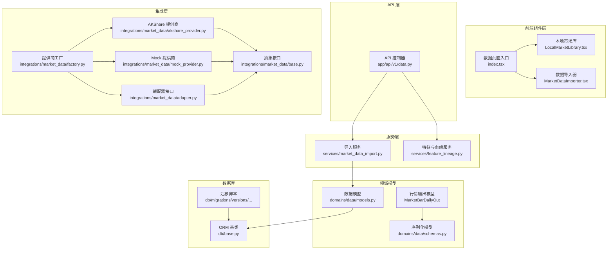
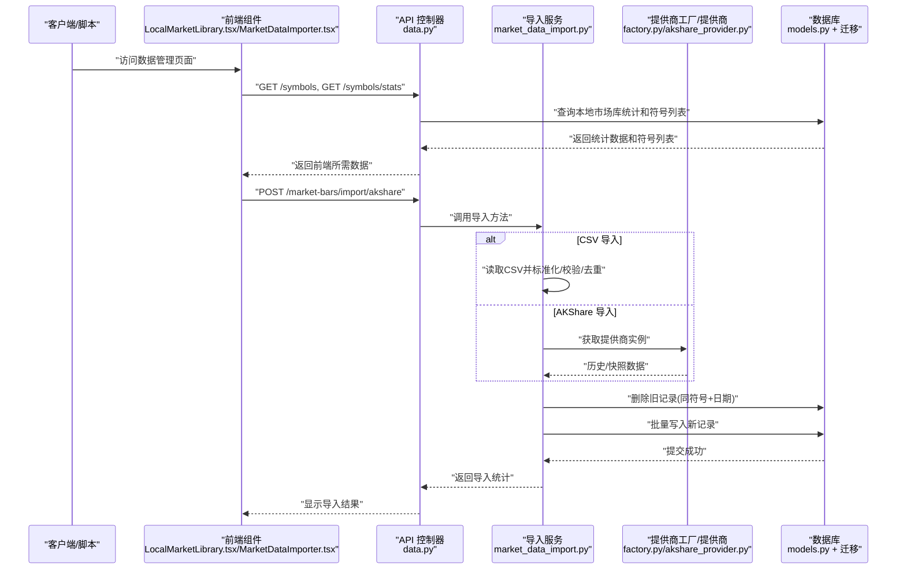
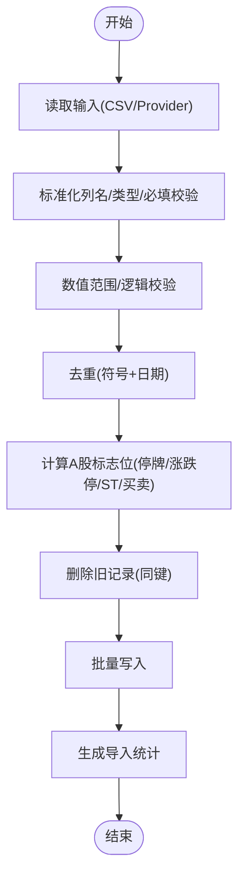
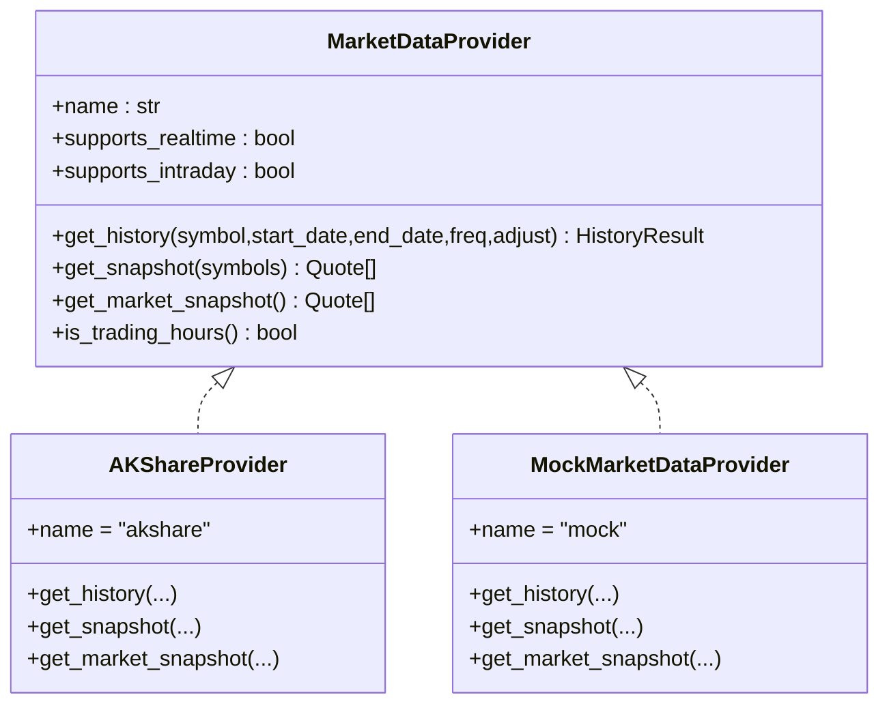
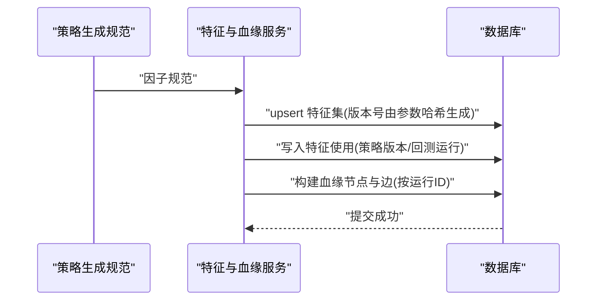
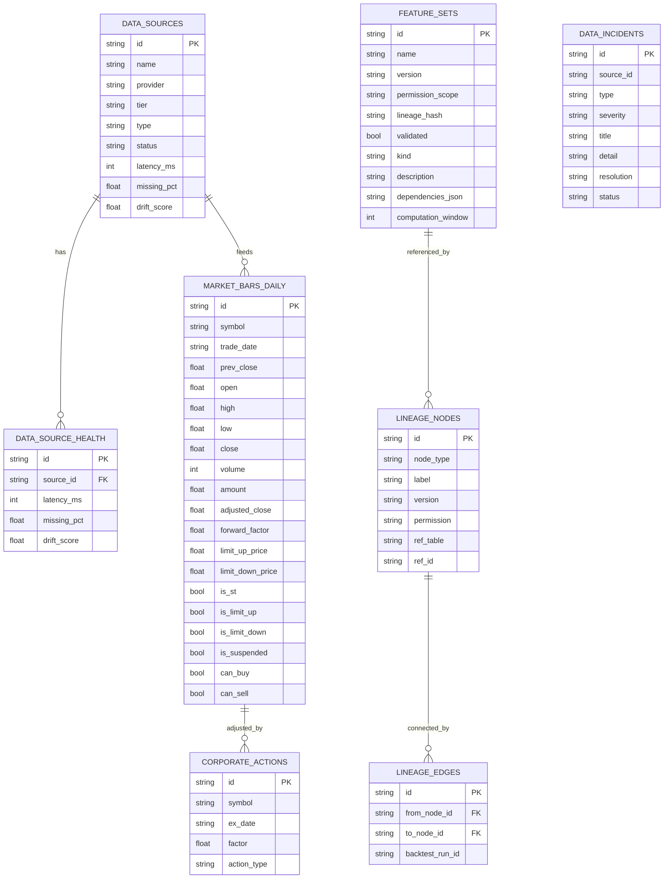
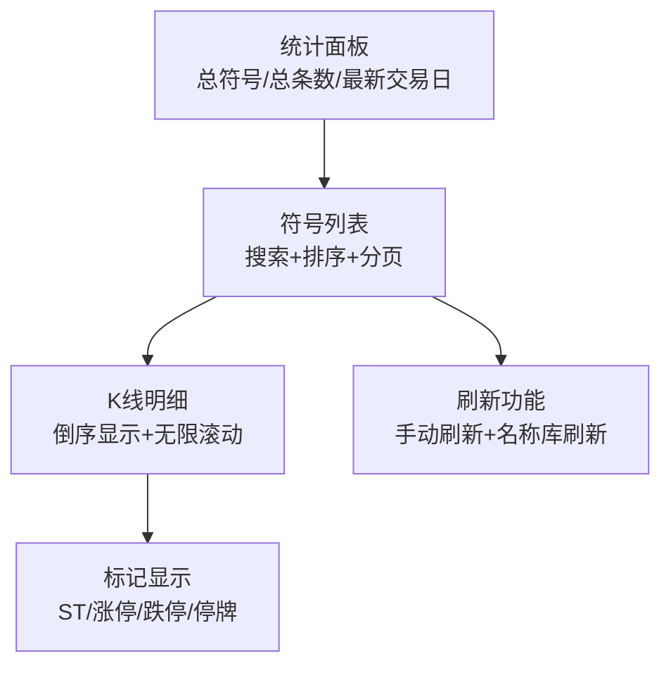
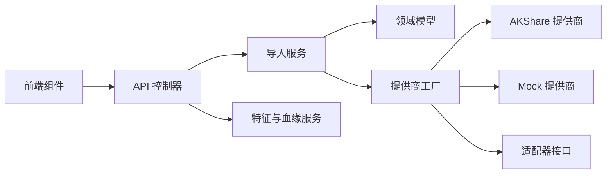

# 数据管理

<cite>
**本文引用的文件**
- [backend/app/services/market_data_import.py](file://backend/app/services/market_data_import.py)
- [backend/app/integrations/market_data/base.py](file://backend/app/integrations/market_data/base.py)
- [backend/app/integrations/market_data/akshare_provider.py](file://backend/app/integrations/market_data/akshare_provider.py)
- [backend/app/integrations/market_data/mock_provider.py](file://backend/app/integrations/market_data/mock_provider.py)
- [backend/app/integrations/market_data/factory.py](file://backend/app/integrations/market_data/factory.py)
- [backend/app/integrations/market_data/adapter.py](file://backend/app/integrations/market_data/adapter.py)
- [backend/app/domains/data/models.py](file://backend/app/domains/data/models.py)
- [backend/app/domains/data/schemas.py](file://backend/app/domains/data/schemas.py)
- [backend/app/api/v1/data.py](file://backend/app/api/v1/data.py)
- [backend/app/db/migrations/versions/20260512_000003_market_data_daily.py](file://backend/app/db/migrations/versions/20260512_000003_market_data_daily.py)
- [backend/app/services/feature_lineage.py](file://backend/app/services/feature_lineage.py)
- [backend/scripts/import_market_data.py](file://backend/scripts/import_market_data.py)
- [backend/tests/services/test_market_data_import.py](file://backend/tests/services/test_market_data_import.py)
- [backend/app/db/base.py](file://backend/app/db/base.py)
- [frontend/src/screens/Data/MarketDataImporter.tsx](file://frontend/src/screens/Data/MarketDataImporter.tsx)
- [frontend/src/screens/Data/LocalMarketLibrary.tsx](file://frontend/src/screens/Data/LocalMarketLibrary.tsx)
- [frontend/src/screens/Data/index.tsx](file://frontend/src/screens/Data/index.tsx)
</cite>

## 更新摘要
**变更内容**
- 新增 LocalMarketLibrary 和 MarketDataImporter 前端组件，提供本地市场库管理和数据导入功能
- 新增完整的 API 端点支持本地市场库的查询、统计和刷新功能
- 新增 MarketDataImportService 服务类，提供统一的数据导入接口
- 新增 LocalCsvDailyBarProvider 和 AKShareDailyBarProvider 提供商类
- 新增 MarketBarDailyOut 序列化模型，支持前端展示

## 目录
1. [简介](#简介)
2. [项目结构](#项目结构)
3. [核心组件](#核心组件)
4. [架构总览](#架构总览)
5. [详细组件分析](#详细组件分析)
6. [新增功能：本地市场库管理](#新增功能本地市场库管理)
7. [依赖分析](#依赖分析)
8. [性能考虑](#性能考虑)
9. [故障排查指南](#故障排查指南)
10. [结论](#结论)
11. [附录](#附录)

## 简介
本文件面向 llmine-quant 的数据管理系统，系统化梳理金融数据采集、清洗、存储与管理的全流程，重点覆盖：
- 市场数据导入机制（本地 CSV 与第三方数据源）
- 数据质量控制与异常处理
- 特征血缘追踪与数据版本管理
- 数据库设计模式、索引策略与查询优化
- 数据迁移方案
- 数据标准化流程与安全保护措施
- A 股市场的特殊处理：复权调整、停牌处理、ST 标记与涨跌停约束
- **新增**：本地市场库管理与可视化展示功能

## 项目结构
数据管理相关模块分布于后端应用的多个子包中，采用"领域模型 + 服务层 + 接口适配 + API 控制器"的分层组织方式：
- 领域模型与数据库：backend/app/domains/data/models.py 定义数据源、行情、特征集、血缘、事件等核心实体
- 导入服务：backend/app/services/market_data_import.py 提供 CSV/AKShare 导入、标准化、去重、校验与写库
- 市场数据抽象与适配：backend/app/integrations/market_data/* 提供统一接口、工厂选择、适配器与真实/模拟提供商
- API 层：backend/app/api/v1/data.py 对外暴露数据概览、导入、查询、特征与血缘等接口
- 前端组件：frontend/src/screens/Data/* 提供本地市场库管理和数据导入的用户界面
- 迁移脚本：backend/app/db/migrations/versions/* 定义表结构与索引
- 血缘与特征管理：backend/app/services/feature_lineage.py 维护特征注册、使用与回测运行的血缘链路
- 命令行工具：backend/scripts/import_market_data.py 支持离线批量导入

**图表来源**
- [frontend/src/screens/Data/LocalMarketLibrary.tsx:1-440](file://frontend/src/screens/Data/LocalMarketLibrary.tsx#L1-L440)
- [frontend/src/screens/Data/MarketDataImporter.tsx:1-192](file://frontend/src/screens/Data/MarketDataImporter.tsx#L1-L192)
- [frontend/src/screens/Data/index.tsx:40-60](file://frontend/src/screens/Data/index.tsx#L40-L60)
- [backend/app/api/v1/data.py:1-515](file://backend/app/api/v1/data.py#L1-L515)
- [backend/app/services/market_data_import.py:1-426](file://backend/app/services/market_data_import.py#L1-L426)
- [backend/app/services/feature_lineage.py:1-217](file://backend/app/services/feature_lineage.py#L1-L217)
- [backend/app/domains/data/schemas.py:213-236](file://backend/app/domains/data/schemas.py#L213-L236)

**章节来源**
- [frontend/src/screens/Data/LocalMarketLibrary.tsx:1-440](file://frontend/src/screens/Data/LocalMarketLibrary.tsx#L1-L440)
- [frontend/src/screens/Data/MarketDataImporter.tsx:1-192](file://frontend/src/screens/Data/MarketDataImporter.tsx#L1-L192)
- [frontend/src/screens/Data/index.tsx:40-60](file://frontend/src/screens/Data/index.tsx#L40-L60)
- [backend/app/api/v1/data.py:1-515](file://backend/app/api/v1/data.py#L1-L515)
- [backend/app/services/market_data_import.py:1-426](file://backend/app/services/market_data_import.py#L1-L426)
- [backend/app/services/feature_lineage.py:1-217](file://backend/app/services/feature_lineage.py#L1-L217)
- [backend/app/domains/data/schemas.py:213-236](file://backend/app/domains/data/schemas.py#L213-L236)

## 核心组件
- 导入服务与标准化
  - 支持从本地 CSV 或 AKShare 导入日线行情，自动标准化列名、类型转换、必填字段校验、数值范围校验、重复键去重
  - 自动生成 A 股特有的标志位：停牌、涨跌停、ST 标记、买卖限制等
  - 批量写入数据库，并返回导入统计结果
- 市场数据抽象与提供商
  - 定义统一的历史/快照接口，支持多种提供商（AKShare、Tushare、Wind、Mock），通过工厂按配置选择
  - AKShare 提供商封装同步库调用到异步执行，保证事件循环不阻塞
- 血缘与特征管理
  - 将策略生成的因子规范写入特征集，记录特征使用关系，并在回测运行时构建从原始行情到特征再到策略与运行的血缘链
- API 与序列化
  - 对外提供数据概览、导入 CSV/AKShare、列表查询、特征与血缘查询等接口；配套 Pydantic 序列化模型
- 数据库与迁移
  - 定义数据源、健康度、日线行情、公司行动、特征集、血缘节点/边、数据事件等表结构与索引
  - 迁移脚本确保唯一约束与常用查询索引（符号、日期、组织 ID）
- **新增**：本地市场库管理
  - 提供完整的本地市场库查询、统计和可视化展示功能
  - 支持符号搜索、排序、分页加载和实时刷新
  - 集成 AKShare 数据刷新功能，保持股票名称等元数据同步

**章节来源**
- [backend/app/services/market_data_import.py:177-242](file://backend/app/services/market_data_import.py#L177-L242)
- [backend/app/integrations/market_data/base.py:64-113](file://backend/app/integrations/market_data/base.py#L64-L113)
- [backend/app/integrations/market_data/factory.py:23-56](file://backend/app/integrations/market_data/factory.py#L23-L56)
- [backend/app/integrations/market_data/akshare_provider.py:145-262](file://backend/app/integrations/market_data/akshare_provider.py#L145-L262)
- [backend/app/services/feature_lineage.py:41-194](file://backend/app/services/feature_lineage.py#L41-L194)
- [backend/app/api/v1/data.py:155-296](file://backend/app/api/v1/data.py#L155-L296)
- [backend/app/domains/data/models.py:9-144](file://backend/app/domains/data/models.py#L9-L144)
- [backend/app/db/migrations/versions/20260512_000003_market_data_daily.py:34-62](file://backend/app/db/migrations/versions/20260512_000003_market_data_daily.py#L34-L62)
- [frontend/src/screens/Data/LocalMarketLibrary.tsx:38-440](file://frontend/src/screens/Data/LocalMarketLibrary.tsx#L38-L440)
- [frontend/src/screens/Data/MarketDataImporter.tsx:25-192](file://frontend/src/screens/Data/MarketDataImporter.tsx#L25-L192)

## 架构总览
下图展示从外部数据源到持久化与查询的整体流程，以及 A 股特殊规则在导入阶段的应用，包括新增的本地市场库管理功能。

**图表来源**
- [frontend/src/screens/Data/LocalMarketLibrary.tsx:80-235](file://frontend/src/screens/Data/LocalMarketLibrary.tsx#L80-L235)
- [frontend/src/screens/Data/MarketDataImporter.tsx:46-67](file://frontend/src/screens/Data/MarketDataImporter.tsx#L46-L67)
- [backend/app/api/v1/data.py:160-196](file://backend/app/api/v1/data.py#L160-L196)
- [backend/app/services/market_data_import.py:185-242](file://backend/app/services/market_data_import.py#L185-L242)
- [backend/app/integrations/market_data/factory.py:23-56](file://backend/app/integrations/market_data/factory.py#L23-L56)
- [backend/app/integrations/market_data/akshare_provider.py:152-204](file://backend/app/integrations/market_data/akshare_provider.py#L152-L204)

## 详细组件分析

### 导入服务与标准化（CSV/AKShare）
- CSV 导入
  - 读取 UTF-8 CSV 文件，自动识别列别名（如 symbol/date/open/high/...），默认符号回退，必填字段缺失即报错
  - 类型转换与数值范围校验，非法值抛出导入错误
  - 去重策略：(symbol, trade_date) 唯一键，重复条目计数并保留后者
- AKShare 导入
  - 异步包装同步库调用，按符号批量抓取日线，支持前复权/后复权/不复权
- A 股特殊处理
  - 计算前收价、涨跌停阈值与是否涨停/跌停、停牌判断、买卖限制
- 写库与替换
  - 先删除同键旧记录，再批量插入，保证幂等与一致性

**图表来源**
- [backend/app/services/market_data_import.py:243-290](file://backend/app/services/market_data_import.py#L243-L290)
- [backend/app/services/market_data_import.py:405-422](file://backend/app/services/market_data_import.py#L405-L422)

**章节来源**
- [backend/app/services/market_data_import.py:107-242](file://backend/app/services/market_data_import.py#L107-L242)
- [backend/tests/services/test_market_data_import.py:25-134](file://backend/tests/services/test_market_data_import.py#L25-L134)

### 市场数据抽象与提供商工厂
- 抽象接口
  - 统一历史/快照接口，支持实时与日线级别，定义 A 股交易时间判断
- 工厂选择
  - 根据配置选择 AKShare/Tushare/Wind/Mock，若 AKShare 未安装则回退到 Mock
- AKShare 实现
  - 同步库调用异步化，Sina Finance 批量快照，全市场扫描用于初始化缓存
- Mock 实现
  - 无网络依赖的确定性合成数据，便于前端与测试

**图表来源**
- [backend/app/integrations/market_data/base.py:64-113](file://backend/app/integrations/market_data/base.py#L64-L113)
- [backend/app/integrations/market_data/akshare_provider.py:145-262](file://backend/app/integrations/market_data/akshare_provider.py#L145-L262)
- [backend/app/integrations/market_data/mock_provider.py:29-109](file://backend/app/integrations/market_data/mock_provider.py#L29-L109)
- [backend/app/integrations/market_data/factory.py:23-56](file://backend/app/integrations/market_data/factory.py#L23-L56)

**章节来源**
- [backend/app/integrations/market_data/base.py:64-113](file://backend/app/integrations/market_data/base.py#L64-L113)
- [backend/app/integrations/market_data/factory.py:23-56](file://backend/app/integrations/market_data/factory.py#L23-L56)
- [backend/app/integrations/market_data/akshare_provider.py:145-262](file://backend/app/integrations/market_data/akshare_provider.py#L145-L262)
- [backend/app/integrations/market_data/mock_provider.py:29-109](file://backend/app/integrations/market_data/mock_provider.py#L29-L109)

### 特征血缘与版本管理
- 特征注册
  - 从策略生成规范中提取因子，按参数哈希生成版本号，写入特征集表
- 使用关联
  - 将特征与策略版本、回测运行建立使用关系
- 血缘链路
  - 构建"原始行情→清洗→特征→策略→运行"的有向无环图，记录节点与边，并可按运行 ID过滤

**图表来源**
- [backend/app/services/feature_lineage.py:41-194](file://backend/app/services/feature_lineage.py#L41-L194)

**章节来源**
- [backend/app/services/feature_lineage.py:1-217](file://backend/app/services/feature_lineage.py#L1-L217)

### 数据库设计与索引策略
- 核心表
  - 数据源与健康度：记录数据源元信息与健康指标
  - 日线行情：TimescaleDB 表，唯一约束 (symbol, trade_date)，并建立 symbol/trade_date/org_id 索引
  - 公司行动：拆分/派息等复权因子
  - 特征集/使用：特征注册、权限、依赖与版本
  - 血缘节点/边：特征血缘 DAG
  - 数据事件：数据质量事件与故障
- 索引与查询
  - 常用查询条件（symbol、trade_date）建立索引，提升筛选与排序效率
  - 迁移脚本显式创建索引，确保生产环境一致性

**图表来源**
- [backend/app/domains/data/models.py:9-144](file://backend/app/domains/data/models.py#L9-L144)
- [backend/app/db/migrations/versions/20260512_000003_market_data_daily.py:34-62](file://backend/app/db/migrations/versions/20260512_000003_market_data_daily.py#L34-L62)

**章节来源**
- [backend/app/domains/data/models.py:9-144](file://backend/app/domains/data/models.py#L9-L144)
- [backend/app/db/migrations/versions/20260512_000003_market_data_daily.py:1-69](file://backend/app/db/migrations/versions/20260512_000003_market_data_daily.py#L1-L69)

### 查询优化与数据迁移
- 查询优化建议
  - 按 symbol/trade_date 过滤与排序的场景，利用现有索引；对大结果集设置 limit 并分页
  - 复杂聚合（如按符号统计）使用 group by 并配合索引
- 数据迁移
  - 使用 Alembic 迁移脚本创建/删除表与索引，确保新增字段与约束一致
  - 迁移脚本中显式声明唯一约束与索引，避免遗漏

**章节来源**
- [backend/app/api/v1/data.py:194-249](file://backend/app/api/v1/data.py#L194-L249)
- [backend/app/db/migrations/versions/20260512_000003_market_data_daily.py:34-62](file://backend/app/db/migrations/versions/20260512_000003_market_data_daily.py#L34-L62)

### 数据标准化流程与安全保护
- 标准化流程
  - 列名归一化、空值与异常值处理、数值范围校验、重复键去重
- 安全保护
  - 提供商工厂根据配置选择，未安装 AKShare 自动降级为 Mock，避免启动失败
  - API 层对导入错误进行 HTTP 错误码返回，便于前端提示与日志定位

**章节来源**
- [backend/app/services/market_data_import.py:243-426](file://backend/app/services/market_data_import.py#L243-L426)
- [backend/app/integrations/market_data/factory.py:23-56](file://backend/app/integrations/market_data/factory.py#L23-L56)
- [backend/app/api/v1/data.py:155-191](file://backend/app/api/v1/data.py#L155-L191)

### A 股特殊数据处理需求
- 复权调整
  - 支持前复权(qfq)/后复权(hfq)/不复权，导入时可指定 adjust 参数
- 停牌处理
  - 成交量为 0 视为停牌，买卖限制相应关闭
- ST 标记与涨跌停
  - 根据前收价计算涨跌停阈值，ST 股涨幅限制 5%，非 ST 10%
  - 当收盘接近涨跌停阈值时标记 is_limit_up/down，影响 can_buy/sell

**章节来源**
- [backend/app/services/market_data_import.py:405-422](file://backend/app/services/market_data_import.py#L405-L422)
- [backend/app/integrations/market_data/akshare_provider.py:152-204](file://backend/app/integrations/market_data/akshare_provider.py#L152-L204)

## 新增功能：本地市场库管理

### LocalMarketLibrary 组件
LocalMarketLibrary 是前端的核心组件，提供完整的本地市场库管理功能：

- **统计面板**：显示总符号数、总条数、最新交易日等关键指标
- **符号列表**：支持搜索、排序（按条数、最近、代码）、分页加载
- **K线明细**：按交易日倒序显示，支持无限滚动加载
- **实时刷新**：支持手动刷新和 AKShare 名称库刷新
- **交互功能**：点击符号查看详细行情，支持预设标的组合

**图表来源**
- [frontend/src/screens/Data/LocalMarketLibrary.tsx:38-440](file://frontend/src/screens/Data/LocalMarketLibrary.tsx#L38-L440)

### MarketDataImporter 组件
MarketDataImporter 提供直观的数据导入界面：

- **标的管理**：支持批量输入、预设组合、清空功能
- **日期选择**：灵活的起止日期选择，支持预设时间段
- **复权选项**：前复权、后复权、不复权三种模式
- **导入反馈**：详细的导入统计和错误信息展示
- **预设组合**：包含大盘蓝筹、新能源/半导体、消费/医药、互联网/科技等预设标签

### API 端点支持
后端提供了完整的 API 支持本地市场库功能：

- `/symbols/stats`：获取本地市场库统计信息
- `/symbols`：获取符号列表，支持搜索、排序、分页
- `/stock-info/refresh`：刷新股票信息（名称、板块等）
- `/market-bars/import/akshare`：从 AKShare 导入数据
- `/market-bars`：查询本地行情数据

**章节来源**
- [frontend/src/screens/Data/LocalMarketLibrary.tsx:38-440](file://frontend/src/screens/Data/LocalMarketLibrary.tsx#L38-L440)
- [frontend/src/screens/Data/MarketDataImporter.tsx:25-192](file://frontend/src/screens/Data/MarketDataImporter.tsx#L25-L192)
- [frontend/src/screens/Data/index.tsx:40-60](file://frontend/src/screens/Data/index.tsx#L40-L60)
- [backend/app/api/v1/data.py:242-331](file://backend/app/api/v1/data.py#L242-L331)

## 依赖分析
- 组件耦合
  - API 控制器依赖导入服务与特征血缘服务；导入服务依赖领域模型与提供商工厂
  - 前端组件通过 API 层与后端交互，LocalMarketLibrary 和 MarketDataImporter 彼此独立但共享数据源
  - 提供商工厂与具体提供商解耦，便于扩展新提供商
- 外部依赖
  - AKShare 为可选依赖，未安装时自动回退 Mock
  - Pandas 用于数据帧转换与适配器接口
  - 前端使用 IntersectionObserver 实现无限滚动加载

**图表来源**
- [frontend/src/screens/Data/LocalMarketLibrary.tsx:1-440](file://frontend/src/screens/Data/LocalMarketLibrary.tsx#L1-L440)
- [frontend/src/screens/Data/MarketDataImporter.tsx:1-192](file://frontend/src/screens/Data/MarketDataImporter.tsx#L1-L192)
- [backend/app/api/v1/data.py:1-515](file://backend/app/api/v1/data.py#L1-L515)
- [backend/app/services/market_data_import.py:1-426](file://backend/app/services/market_data_import.py#L1-L426)
- [backend/app/services/feature_lineage.py:1-217](file://backend/app/services/feature_lineage.py#L1-L217)
- [backend/app/integrations/market_data/factory.py:1-57](file://backend/app/integrations/market_data/factory.py#L1-L57)

**章节来源**
- [frontend/src/screens/Data/LocalMarketLibrary.tsx:1-440](file://frontend/src/screens/Data/LocalMarketLibrary.tsx#L1-L440)
- [frontend/src/screens/Data/MarketDataImporter.tsx:1-192](file://frontend/src/screens/Data/MarketDataImporter.tsx#L1-L192)
- [backend/app/api/v1/data.py:1-515](file://backend/app/api/v1/data.py#L1-L515)
- [backend/app/services/market_data_import.py:1-426](file://backend/app/services/market_data_import.py#L1-L426)
- [backend/app/services/feature_lineage.py:1-217](file://backend/app/services/feature_lineage.py#L1-L217)
- [backend/app/integrations/market_data/factory.py:1-57](file://backend/app/integrations/market_data/factory.py#L1-L57)

## 性能考虑
- 导入性能
  - 批量写入与先删后插减少重复写入成本；去重与校验在内存完成，降低数据库往返
  - AKShare 导入使用异步线程池，避免阻塞事件循环
- 查询性能
  - 在 symbol/trade_date 上建立索引，满足高频筛选与排序
  - 对大结果集设置合理 limit，避免一次性加载过多数据
  - 前端使用 IntersectionObserver 实现虚拟滚动，提升大数据集渲染性能
- 实时行情
  - 批量快照接口单次请求获取多只股票，降低网络开销
  - 本地市场库支持增量刷新，减少全量数据传输

## 故障排查指南
- 常见错误
  - CSV 缺失必填字段、数值格式非法、数值越界、重复键冲突
  - AKShare 未安装或网络异常导致导入失败
  - 前端无限滚动加载失败，检查 IntersectionObserver 支持
- API 错误码
  - 文件不存在/不可读：404
  - 导入参数错误/数据异常：400
  - 全量同步已在运行：409
- 定位步骤
  - 查看导入统计中的错误列表与跳过行数
  - 检查提供商健康状态与延迟趋势
  - 关联血缘链路定位问题来源
  - 前端组件检查网络请求和错误提示

**章节来源**
- [backend/app/api/v1/data.py:168-172](file://backend/app/api/v1/data.py#L168-L172)
- [backend/app/services/market_data_import.py:21-23](file://backend/app/services/market_data_import.py#L21-L23)
- [backend/tests/services/test_market_data_import.py:25-134](file://backend/tests/services/test_market_data_import.py#L25-L134)

## 结论
llmine-quant 的数据管理以"可插拔提供商 + 统一抽象 + 标准化导入 + 血缘追踪"为核心，既满足 A 股市场的特殊规则，又具备良好的扩展性与可维护性。新增的 LocalMarketLibrary 和 MarketDataImporter 组件进一步完善了数据管理生态，提供了直观的本地市场库管理和数据导入体验。通过完善的索引策略与迁移机制，保障了生产环境的稳定性与一致性。

## 附录
- 命令行导入
  - 支持 CSV 与 AKShare 两种模式，便于离线批量导入与快速验证
- 测试覆盖
  - 单元测试覆盖导入清洗、去重、替换与 A 股标志位计算
  - 前端组件测试覆盖导入器和本地库的主要功能

**章节来源**
- [backend/scripts/import_market_data.py:14-52](file://backend/scripts/import_market_data.py#L14-L52)
- [backend/tests/services/test_market_data_import.py:25-134](file://backend/tests/services/test_market_data_import.py#L25-L134)
- [backend/tests/api/test_market_data_import.py:32-61](file://backend/tests/api/test_market_data_import.py#L32-L61)