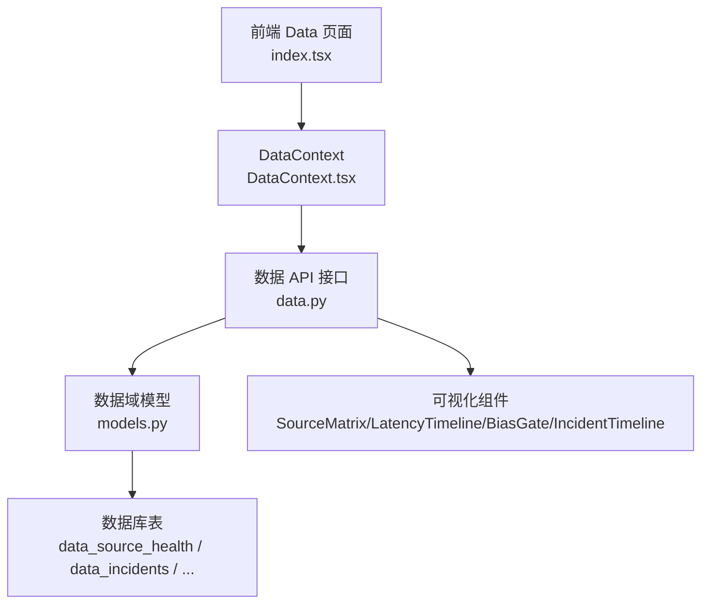
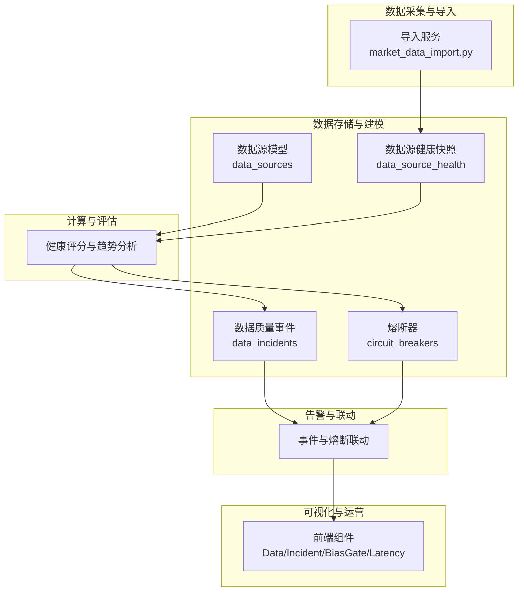
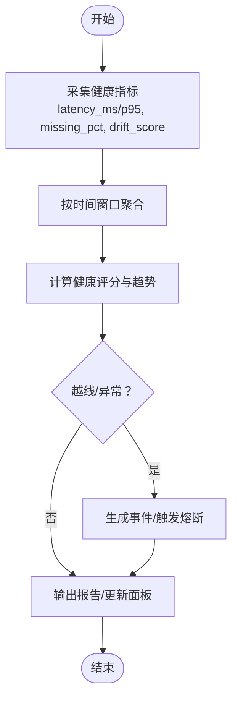
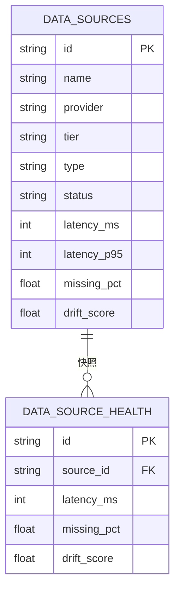
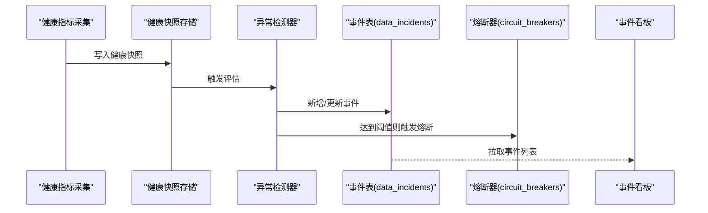
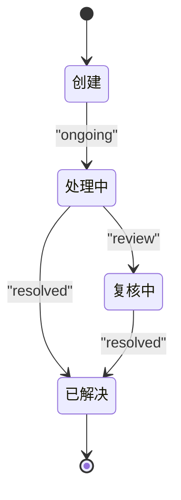
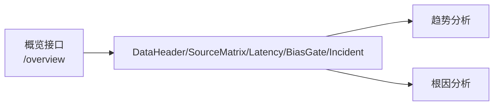
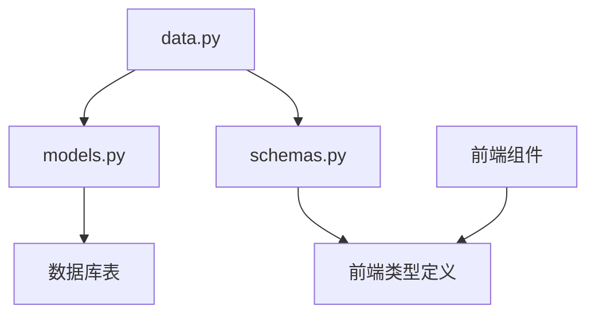

# 数据质量监控

<cite>
**本文档引用的文件**
- [backend/app/domains/data/models.py](file://backend/app/domains/data/models.py)
- [backend/app/domains/data/schemas.py](file://backend/app/domains/data/schemas.py)
- [backend/app/api/v1/data.py](file://backend/app/api/v1/data.py)
- [frontend/src/data/types.ts](file://frontend/src/data/types.ts)
- [frontend/src/screens/Data/SourceMatrix.tsx](file://frontend/src/screens/Data/SourceMatrix.tsx)
- [frontend/src/screens/Data/LatencyTimeline.tsx](file://frontend/src/screens/Data/LatencyTimeline.tsx)
- [frontend/src/screens/Data/IncidentTimeline.tsx](file://frontend/src/screens/Data/IncidentTimeline.tsx)
- [frontend/src/screens/Data/BiasGate.tsx](file://frontend/src/screens/Data/BiasGate.tsx)
- [frontend/src/screens/Data/index.tsx](file://frontend/src/screens/Data/index.tsx)
- [frontend/src/contexts/DataContext.tsx](file://frontend/src/contexts/DataContext.tsx)
- [backend/app/db/migrations/versions/20260513_000001_execution_risk_portfolio.py](file://backend/app/db/migrations/versions/20260513_000001_execution_risk_portfolio.py)
- [backend/app/domains/risk/models.py](file://backend/app/domains/risk/models.py)
- [backend/app/api/v1/risk.py](file://backend/app/api/v1/risk.py)
- [frontend/src/screens/Risk/CircuitBreakerPanel.tsx](file://frontend/src/screens/Risk/CircuitBreakerPanel.tsx)
- [backend/app/services/market_data_import.py](file://backend/app/services/market_data_import.py)
</cite>

## 目录
1. [简介](#简介)
2. [项目结构](#项目结构)
3. [核心组件](#核心组件)
4. [架构总览](#架构总览)
5. [详细组件分析](#详细组件分析)
6. [依赖分析](#依赖分析)
7. [性能考虑](#性能考虑)
8. [故障排查指南](#故障排查指南)
9. [结论](#结论)
10. [附录](#附录)

## 简介
本文件面向 llmine-quant 的数据质量监控体系，系统化阐述数据质量指标定义与计算方法（延迟监控、缺失率统计、数据漂移检测），并深入解析数据源健康快照机制、异常事件检测与自动告警联动、DataIncident 事件的分类与处理流程。同时提供数据质量报告生成、趋势分析与根因分析工具的使用说明，并给出数据质量改进策略与预防性维护建议。

## 项目结构
数据质量监控相关能力由后端 API、数据库模型、前端展示三部分协同实现：
- 后端 API 提供数据概览、来源矩阵、延迟趋势、偏差闸门、事件列表等接口；
- 数据库模型定义数据源健康快照、数据质量事件、血缘关系等实体；
- 前端通过上下文与组件消费后端数据，渲染可视化面板与交互界面。

图表来源
- [frontend/src/screens/Data/index.tsx:17-44](file://frontend/src/screens/Data/index.tsx#L17-L44)
- [frontend/src/contexts/DataContext.tsx:1-13](file://frontend/src/contexts/DataContext.tsx#L1-L13)
- [backend/app/api/v1/data.py:134-146](file://backend/app/api/v1/data.py#L134-L146)
- [backend/app/domains/data/models.py:9-38](file://backend/app/domains/data/models.py#L9-L38)

章节来源
- [frontend/src/screens/Data/index.tsx:17-44](file://frontend/src/screens/Data/index.tsx#L17-L44)
- [frontend/src/contexts/DataContext.tsx:1-13](file://frontend/src/contexts/DataContext.tsx#L1-L13)
- [backend/app/api/v1/data.py:134-146](file://backend/app/api/v1/data.py#L134-L146)
- [backend/app/domains/data/models.py:9-38](file://backend/app/domains/data/models.py#L9-L38)

## 核心组件
- 数据源健康快照：记录每个数据源的延迟、缺失率、漂移分等指标，用于实时健康度评估与趋势分析。
- 数据质量事件（DataIncident）：统一记录延迟、缺失、漂移、许可、中断、Schema 等事件，支持严重程度分级与状态流转。
- 偏差闸门（Bias Gate）：对特征计算中的未来函数、幸存者偏差、数据完整性、及时性、一致性等进行自动化检查。
- 风控熔断（Circuit Breaker）：与风险控制联动，在严重数据质量事件触发时执行熔断动作，阻断潜在风险扩散。
- 可视化组件：来源矩阵、延迟时序图、事件时间线、偏差闸门面板等，支撑运营与研发的日常巡检与应急处置。

章节来源
- [backend/app/domains/data/models.py:132-143](file://backend/app/domains/data/models.py#L132-L143)
- [backend/app/domains/data/schemas.py:101-113](file://backend/app/domains/data/schemas.py#L101-L113)
- [backend/app/domains/data/schemas.py:43-50](file://backend/app/domains/data/schemas.py#L43-L50)
- [backend/app/db/migrations/versions/20260513_000001_execution_risk_portfolio.py:177-203](file://backend/app/db/migrations/versions/20260513_000001_execution_risk_portfolio.py#L177-L203)
- [backend/app/domains/risk/models.py:60-86](file://backend/app/domains/risk/models.py#L60-L86)

## 架构总览
数据质量监控从“采集—存储—计算—告警—可视化”闭环展开：
- 采集与导入：通过导入服务规范化与清洗市场数据，保证基础数据质量。
- 存储与建模：以数据源健康快照与事件表为核心，沉淀可观测性数据。
- 计算与评估：基于健康快照指标进行健康评分与趋势分析。
- 告警与联动：当指标越线或事件发生，触发风控熔断与消息广播。
- 可视化与运营：通过仪表板与事件看板，支撑日常运维与根因分析。

图表来源
- [backend/app/services/market_data_import.py:177-241](file://backend/app/services/market_data_import.py#L177-L241)
- [backend/app/domains/data/models.py:29-38](file://backend/app/domains/data/models.py#L29-L38)
- [backend/app/domains/data/models.py:9-26](file://backend/app/domains/data/models.py#L9-L26)
- [backend/app/domains/data/models.py:132-143](file://backend/app/domains/data/models.py#L132-L143)
- [backend/app/db/migrations/versions/20260513_000001_execution_risk_portfolio.py:177-203](file://backend/app/db/migrations/versions/20260513_000001_execution_risk_portfolio.py#L177-L203)
- [frontend/src/screens/Data/index.tsx:17-44](file://frontend/src/screens/Data/index.tsx#L17-L44)

## 详细组件分析

### 数据质量指标定义与计算方法
- 延迟监控（latency_ms、latency_p95）
  - 定义：分别表示数据源的平均延迟与 P95 延迟，用于衡量数据可用性与时效性。
  - 计算：来源于数据源健康快照表，按时间窗口聚合得到。
  - 前端展示：来源矩阵列示 P50/P95；延迟时序图展示三层（研究/模拟/实盘）趋势与 SLA 对比。
- 缺失率统计（missing_pct）
  - 定义：关键字段缺失的比例，反映数据完整性。
  - 计算：对目标字段统计缺失数量占总记录比例。
  - 前端展示：来源矩阵按阈值高亮警示。
- 数据漂移检测（drift_score）
  - 定义：衡量当前分布与基线分布的偏离程度，用于识别数据质量退化。
  - 计算：通常采用统计检验或分布距离度量（如 KS、JS 散度等），具体算法在后端实现中抽象为单一分数。
  - 前端展示：来源矩阵列示漂移分并按阈值分级。

图表来源
- [backend/app/domains/data/models.py:29-38](file://backend/app/domains/data/models.py#L29-L38)
- [frontend/src/screens/Data/SourceMatrix.tsx:70-86](file://frontend/src/screens/Data/SourceMatrix.tsx#L70-L86)
- [frontend/src/screens/Data/LatencyTimeline.tsx:10-47](file://frontend/src/screens/Data/LatencyTimeline.tsx#L10-L47)

章节来源
- [backend/app/domains/data/models.py:29-38](file://backend/app/domains/data/models.py#L29-L38)
- [frontend/src/screens/Data/SourceMatrix.tsx:70-86](file://frontend/src/screens/Data/SourceMatrix.tsx#L70-L86)
- [frontend/src/screens/Data/LatencyTimeline.tsx:10-47](file://frontend/src/screens/Data/LatencyTimeline.tsx#L10-L47)

### 数据源健康快照机制
- 快照表（data_source_health）记录每次采集周期内各数据源的健康指标，支持历史对比与趋势分析。
- 数据源表（data_sources）承载元数据与当前状态，结合健康快照实现“状态 + 指标”的双维度观测。

图表来源
- [backend/app/domains/data/models.py:9-38](file://backend/app/domains/data/models.py#L9-L38)

章节来源
- [backend/app/domains/data/models.py:9-38](file://backend/app/domains/data/models.py#L9-L38)

### 异常事件检测与自动告警
- 事件类型：延迟（latency）、缺失（missing）、漂移（drift）、许可（license）、中断（outage）、Schema（schema）。
- 严重程度：严重（critical）、高（high）、中（medium）、低（low）。
- 状态流转：处理中（ongoing）、已解决（resolved）、复核中（review）。
- 告警联动：事件触发后，可通过风控熔断器联动执行熔断动作，阻断风险扩散。

图表来源
- [backend/app/domains/data/models.py:132-143](file://backend/app/domains/data/models.py#L132-L143)
- [backend/app/db/migrations/versions/20260513_000001_execution_risk_portfolio.py:177-203](file://backend/app/db/migrations/versions/20260513_000001_execution_risk_portfolio.py#L177-L203)
- [frontend/src/screens/Data/IncidentTimeline.tsx:25-44](file://frontend/src/screens/Data/IncidentTimeline.tsx#L25-L44)

章节来源
- [backend/app/domains/data/models.py:132-143](file://backend/app/domains/data/models.py#L132-L143)
- [backend/app/db/migrations/versions/20260513_000001_execution_risk_portfolio.py:177-203](file://backend/app/db/migrations/versions/20260513_000001_execution_risk_portfolio.py#L177-L203)
- [frontend/src/screens/Data/IncidentTimeline.tsx:25-44](file://frontend/src/screens/Data/IncidentTimeline.tsx#L25-L44)

### DataIncident 事件的分类、严重程度与处理流程
- 分类：延迟、缺失、漂移、许可、中断、Schema。
- 严重程度：严重、高、中、低。
- 处理流程：事件创建 → 自动评估 → 状态流转（处理中/已解决/复核中） → 通知与可视化呈现 → 根因分析与改进闭环。

图表来源
- [backend/app/domains/data/models.py:137-143](file://backend/app/domains/data/models.py#L137-L143)
- [frontend/src/screens/Data/IncidentTimeline.tsx:25-44](file://frontend/src/screens/Data/IncidentTimeline.tsx#L25-L44)

章节来源
- [backend/app/domains/data/models.py:137-143](file://backend/app/domains/data/models.py#L137-L143)
- [frontend/src/screens/Data/IncidentTimeline.tsx:25-44](file://frontend/src/screens/Data/IncidentTimeline.tsx#L25-L44)

### 数据质量报告生成、趋势分析与根因分析工具
- 报告生成：后端提供概览接口，返回头部指标、分层统计、来源矩阵、延迟趋势、偏差闸门、事件列表等。
- 趋势分析：延迟时序图展示三层趋势与 SLA 对比，辅助定位时段性波动与持续性退化。
- 根因分析：偏差闸门检查清单与事件时间线配合使用，快速定位未来函数、幸存者偏差、数据完整性等问题类别。

图表来源
- [backend/app/api/v1/data.py:134-146](file://backend/app/api/v1/data.py#L134-L146)
- [frontend/src/screens/Data/DataHeader.tsx:13-111](file://frontend/src/screens/Data/DataHeader.tsx#L13-L111)
- [frontend/src/screens/Data/SourceMatrix.tsx:53-86](file://frontend/src/screens/Data/SourceMatrix.tsx#L53-L86)
- [frontend/src/screens/Data/LatencyTimeline.tsx:10-47](file://frontend/src/screens/Data/LatencyTimeline.tsx#L10-L47)
- [frontend/src/screens/Data/BiasGate.tsx:17-58](file://frontend/src/screens/Data/BiasGate.tsx#L17-L58)
- [frontend/src/screens/Data/IncidentTimeline.tsx:25-44](file://frontend/src/screens/Data/IncidentTimeline.tsx#L25-L44)

章节来源
- [backend/app/api/v1/data.py:134-146](file://backend/app/api/v1/data.py#L134-L146)
- [frontend/src/screens/Data/DataHeader.tsx:13-111](file://frontend/src/screens/Data/DataHeader.tsx#L13-L111)
- [frontend/src/screens/Data/SourceMatrix.tsx:53-86](file://frontend/src/screens/Data/SourceMatrix.tsx#L53-L86)
- [frontend/src/screens/Data/LatencyTimeline.tsx:10-47](file://frontend/src/screens/Data/LatencyTimeline.tsx#L10-L47)
- [frontend/src/screens/Data/BiasGate.tsx:17-58](file://frontend/src/screens/Data/BiasGate.tsx#L17-L58)
- [frontend/src/screens/Data/IncidentTimeline.tsx:25-44](file://frontend/src/screens/Data/IncidentTimeline.tsx#L25-L44)

### 数据质量改进策略与预防性维护建议
- 改进策略
  - 延迟优化：针对 P95 超标的来源，优先核查上游接口限流、网络抖动与缓存策略；必要时引入多源热备与降级策略。
  - 缺失治理：建立字段级质量门禁，对缺失率超阈的数据源进行自动阻断与告警；完善数据回填与补采机制。
  - 漂移监控：定期更新漂移基线，设置动态阈值；对异常漂移进行自动隔离与人工复核。
- 预防性维护
  - 建立健康快照周期性任务，确保指标连续性与稳定性；
  - 将偏差闸门检查纳入回归测试与特征发布流程；
  - 结合熔断器实现风险隔离，避免局部问题扩大化。

## 依赖分析
- 后端 API 依赖数据域模型与服务层，负责聚合与对外输出；
- 前端通过上下文消费后端数据，组件间解耦，便于扩展与维护；
- 数据库迁移脚本定义了事件与熔断器等关键表结构，保障可观测性与风控能力。

图表来源
- [backend/app/api/v1/data.py:10-35](file://backend/app/api/v1/data.py#L10-L35)
- [backend/app/domains/data/models.py:1-144](file://backend/app/domains/data/models.py#L1-L144)
- [backend/app/domains/data/schemas.py:1-194](file://backend/app/domains/data/schemas.py#L1-L194)
- [frontend/src/data/types.ts:375-472](file://frontend/src/data/types.ts#L375-L472)

章节来源
- [backend/app/api/v1/data.py:10-35](file://backend/app/api/v1/data.py#L10-L35)
- [backend/app/domains/data/models.py:1-144](file://backend/app/domains/data/models.py#L1-L144)
- [backend/app/domains/data/schemas.py:1-194](file://backend/app/domains/data/schemas.py#L1-L194)
- [frontend/src/data/types.ts:375-472](file://frontend/src/data/types.ts#L375-L472)

## 性能考虑
- 指标聚合：建议在数据库侧进行时间窗口聚合，减少前端重复计算。
- 可视化渲染：延迟时序图与来源矩阵应采用虚拟滚动与增量更新，降低大屏刷新开销。
- API 响应：对概览接口启用缓存与条件请求，避免频繁拉取相同数据。
- 导入性能：批量写入与去重策略需结合索引设计，减少重复扫描与锁竞争。

## 故障排查指南
- 事件未显示
  - 检查事件接口是否正常返回，确认前端上下文是否正确注入。
  - 关注事件状态是否停留在“处理中”，必要时手动推进至“已解决”。
- 延迟持续升高
  - 查看来源矩阵中对应来源的 P95 是否超过 SLA，结合延迟时序图定位时段性波动。
  - 检查上游数据源可用性与网络状况。
- 缺失率异常
  - 核对偏差闸门中“数据完整性”检查结果，确认缺失字段与范围。
  - 检查导入服务日志与错误汇总，修复数据源配置或字段映射。
- 熔断联动
  - 当事件达到严重级别时，熔断器状态应变为“触发”，前端应显示相应提示。
  - 如未触发，检查熔断规则与阈值配置，并通过后端接口手动触发以验证链路。

章节来源
- [frontend/src/screens/Data/IncidentTimeline.tsx:25-44](file://frontend/src/screens/Data/IncidentTimeline.tsx#L25-L44)
- [frontend/src/screens/Data/SourceMatrix.tsx:70-86](file://frontend/src/screens/Data/SourceMatrix.tsx#L70-L86)
- [frontend/src/screens/Data/LatencyTimeline.tsx:10-47](file://frontend/src/screens/Data/LatencyTimeline.tsx#L10-L47)
- [backend/app/api/v1/risk.py:210-272](file://backend/app/api/v1/risk.py#L210-L272)
- [frontend/src/screens/Risk/CircuitBreakerPanel.tsx:21-39](file://frontend/src/screens/Risk/CircuitBreakerPanel.tsx#L21-L39)

## 结论
本监控体系以健康快照与事件为核心，结合偏差闸门与风控熔断，形成“可观测—可预警—可处置”的闭环。通过来源矩阵、延迟时序图、事件看板与偏差闸门等可视化工具，能够高效支撑日常巡检与应急响应。建议持续完善指标阈值与自动化处置策略，提升系统的自愈能力与稳定性。

## 附录
- 数据质量指标字段定义与前端类型映射
  - 指标字段：latencyMs、latencyP95、missingPct、driftScore、license、status、statusTone、lastUpdate
  - 类型参考：前端类型定义文件中的数据结构与枚举
- 偏差闸门检查项
  - 未来函数检测、幸存者偏差、数据完整性、数据及时性、数据一致性等
- 熔断器层级
  - L1-L4 四级熔断，支持手动触发与恢复

章节来源
- [frontend/src/data/types.ts:424-472](file://frontend/src/data/types.ts#L424-L472)
- [frontend/src/screens/Data/BiasGate.tsx:17-58](file://frontend/src/screens/Data/BiasGate.tsx#L17-L58)
- [backend/app/domains/risk/models.py:60-86](file://backend/app/domains/risk/models.py#L60-L86)
- [frontend/src/screens/Risk/CircuitBreakerPanel.tsx:21-39](file://frontend/src/screens/Risk/CircuitBreakerPanel.tsx#L21-L39)