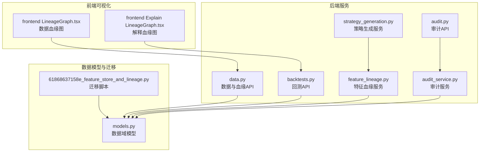
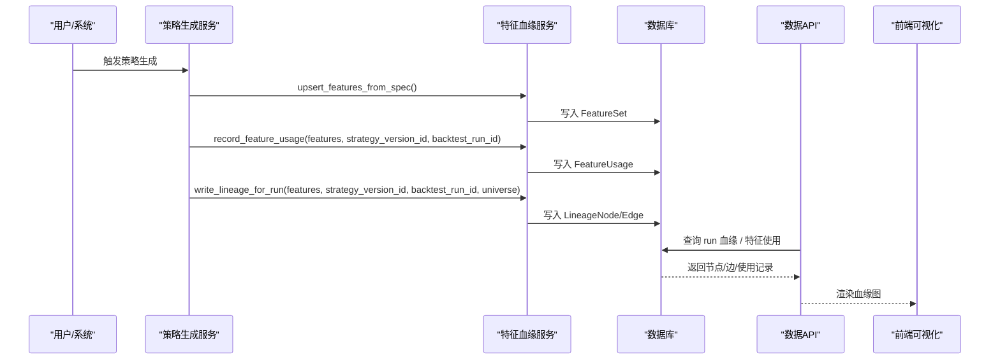
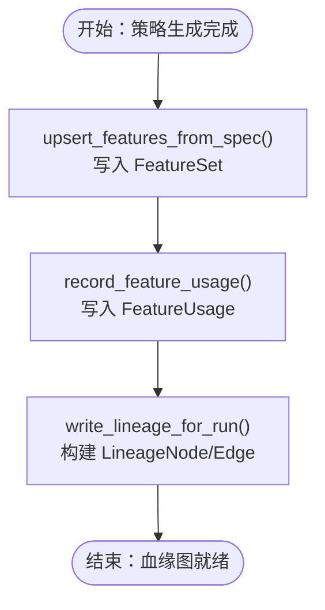
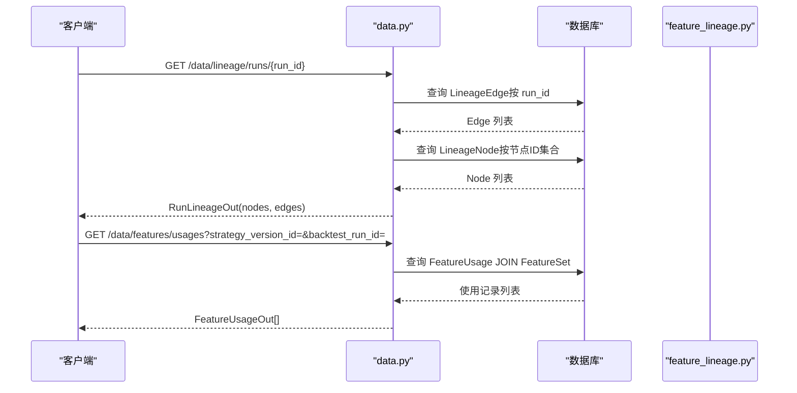
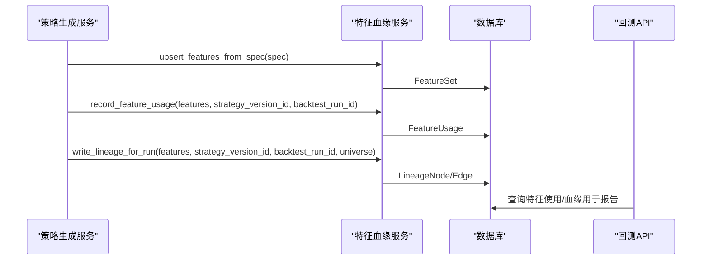
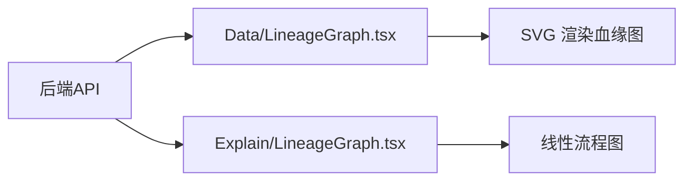
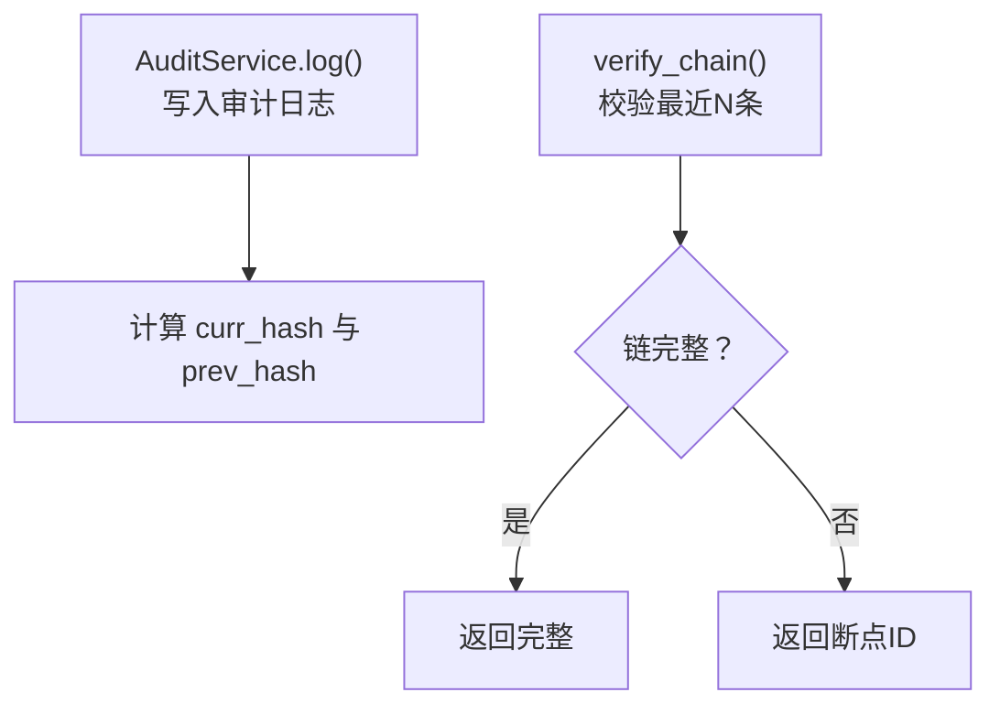
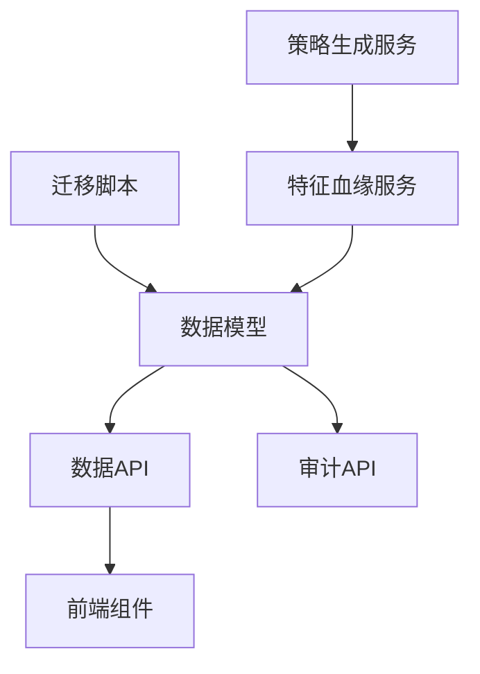

# 特征血缘追踪

<cite>
**本文档引用的文件**
- [backend/app/services/feature_lineage.py](file://backend/app/services/feature_lineage.py)
- [backend/app/api/v1/data.py](file://backend/app/api/v1/data.py)
- [backend/app/domains/data/models.py](file://backend/app/domains/data/models.py)
- [backend/app/db/migrations/versions/61868637158e_feature_store_and_lineage.py](file://backend/app/db/migrations/versions/61868637158e_feature_store_and_lineage.py)
- [backend/app/services/strategy_generation.py](file://backend/app/services/strategy_generation.py)
- [backend/app/api/v1/backtests.py](file://backend/app/api/v1/backtests.py)
- [frontend/src/screens/Data/LineageGraph.tsx](file://frontend/src/screens/Data/LineageGraph.tsx)
- [frontend/src/screens/Explain/LineageGraph.tsx](file://frontend/src/screens/Explain/LineageGraph.tsx)
- [backend/app/services/audit_service.py](file://backend/app/services/audit_service.py)
- [backend/app/api/v1/audit.py](file://backend/app/api/v1/audit.py)
</cite>

## 目录
1. [简介](#简介)
2. [项目结构](#项目结构)
3. [核心组件](#核心组件)
4. [架构概览](#架构概览)
5. [详细组件分析](#详细组件分析)
6. [依赖关系分析](#依赖关系分析)
7. [性能考虑](#性能考虑)
8. [故障排查指南](#故障排查指南)
9. [结论](#结论)
10. [附录](#附录)

## 简介
本文件面向 llmine-quant 的特征血缘追踪系统，系统性阐述从原始数据到最终使用的完整追踪链路，包括 LineageNode 与 LineageEdge 的有向无环图（DAG）构建、特征依赖关系管理、版本控制与变更追踪机制，以及 FeatureUsage 关联表的设计与查询优化策略。同时涵盖特征血缘查询接口、可视化展示与审计追踪功能，并提供特征血缘在策略回测中的应用及性能影响分析。

## 项目结构
特征血缘追踪涉及后端服务、数据库迁移、API 接口、前端可视化组件与审计服务等模块。下图展示了关键文件之间的关系：

**图表来源**
- [backend/app/services/feature_lineage.py:1-217](file://backend/app/services/feature_lineage.py#L1-L217)
- [backend/app/services/strategy_generation.py:1-584](file://backend/app/services/strategy_generation.py#L1-L584)
- [backend/app/api/v1/data.py:1-392](file://backend/app/api/v1/data.py#L1-L392)
- [backend/app/api/v1/backtests.py:1-1121](file://backend/app/api/v1/backtests.py#L1-L1121)
- [backend/app/domains/data/models.py:1-144](file://backend/app/domains/data/models.py#L1-L144)
- [backend/app/db/migrations/versions/61868637158e_feature_store_and_lineage.py:1-112](file://backend/app/db/migrations/versions/61868637158e_feature_store_and_lineage.py#L1-L112)
- [frontend/src/screens/Data/LineageGraph.tsx:1-138](file://frontend/src/screens/Data/LineageGraph.tsx#L1-L138)
- [frontend/src/screens/Explain/LineageGraph.tsx:1-42](file://frontend/src/screens/Explain/LineageGraph.tsx#L1-L42)
- [backend/app/services/audit_service.py:1-109](file://backend/app/services/audit_service.py#L1-L109)
- [backend/app/api/v1/audit.py:73-225](file://backend/app/api/v1/audit.py#L73-L225)

**章节来源**
- [backend/app/services/feature_lineage.py:1-217](file://backend/app/services/feature_lineage.py#L1-L217)
- [backend/app/api/v1/data.py:1-392](file://backend/app/api/v1/data.py#L1-L392)
- [backend/app/domains/data/models.py:1-144](file://backend/app/domains/data/models.py#L1-L144)
- [backend/app/db/migrations/versions/61868637158e_feature_store_and_lineage.py:1-112](file://backend/app/db/migrations/versions/61868637158e_feature_store_and_lineage.py#L1-L112)
- [frontend/src/screens/Data/LineageGraph.tsx:1-138](file://frontend/src/screens/Data/LineageGraph.tsx#L1-L138)
- [frontend/src/screens/Explain/LineageGraph.tsx:1-42](file://frontend/src/screens/Explain/LineageGraph.tsx#L1-L42)
- [backend/app/services/audit_service.py:1-109](file://backend/app/services/audit_service.py#L1-L109)
- [backend/app/api/v1/audit.py:73-225](file://backend/app/api/v1/audit.py#L73-L225)

## 核心组件
- LineageNode：数据血缘图节点，记录节点类型（原始/清洗/特征/策略/运行/信号/订单）、标签、版本、权限与引用信息。
- LineageEdge：数据血缘图边，记录起止节点与回测运行 ID，形成有向无环图。
- FeatureUsage：特征使用关联表，建立特征集与策略版本之间的使用关系，并可选绑定回测运行 ID。
- FeatureSet：特征注册表，包含名称、版本、权限范围、验证状态、依赖与计算窗口等元数据。
- 迁移脚本：定义 lineage_nodes、lineage_edges、feature_usages、feature_sets 等表及其索引。

这些组件共同构成特征血缘的存储与查询基础，支撑从策略生成到回测运行的完整追踪链路。

**章节来源**
- [backend/app/domains/data/models.py:81-143](file://backend/app/domains/data/models.py#L81-L143)
- [backend/app/db/migrations/versions/61868637158e_feature_store_and_lineage.py:33-111](file://backend/app/db/migrations/versions/61868637158e_feature_store_and_lineage.py#L33-L111)

## 架构概览
特征血缘追踪贯穿“策略生成 → 特征入库与使用登记 → 回测运行 → 血缘图构建 → 可视化展示”的全流程。下图展示了关键交互：

**图表来源**
- [backend/app/services/strategy_generation.py:231-252](file://backend/app/services/strategy_generation.py#L231-L252)
- [backend/app/services/feature_lineage.py:41-97](file://backend/app/services/feature_lineage.py#L41-L97)
- [backend/app/api/v1/data.py:273-327](file://backend/app/api/v1/data.py#L273-L327)

## 详细组件分析

### 组件A：特征血缘服务（feature_lineage）
- upsert_features_from_spec：根据策略 DSL 中的因子规范，确保 FeatureSet 存在并写入依赖参数与计算窗口，版本号由参数哈希稳定生成。
- record_feature_usage：为策略版本记录所使用的特征，支持 role 标记（如 factor/filter/signal）与可选回测运行 ID。
- write_lineage_for_run：构建回测运行的血缘 DAG，节点类型包括 raw（合并符号）、cleaned、feature、strategy、run；边连接形成单一路劲，支持无特征时的简化链路。

**图表来源**
- [backend/app/services/feature_lineage.py:41-97](file://backend/app/services/feature_lineage.py#L41-L97)
- [backend/app/services/feature_lineage.py:100-194](file://backend/app/services/feature_lineage.py#L100-L194)

**章节来源**
- [backend/app/services/feature_lineage.py:41-217](file://backend/app/services/feature_lineage.py#L41-L217)

### 组件B：数据 API（血缘查询与特征使用）
- GET /data/lineage/runs/{run_id}：按回测运行 ID 查询血缘 DAG，返回节点与边集合，并映射节点色调。
- GET /data/features/usages：列出特征使用记录，支持按策略版本或回测运行过滤，返回特征名、版本与角色。

**图表来源**
- [backend/app/api/v1/data.py:273-327](file://backend/app/api/v1/data.py#L273-L327)

**章节来源**
- [backend/app/api/v1/data.py:273-340](file://backend/app/api/v1/data.py#L273-L340)

### 组件C：策略生成与回测集成
- 策略生成服务在研究回测完成后，调用特征血缘服务进行特征入库、使用登记与血缘图构建，并将回测运行 ID 关联到 FeatureUsage 与 LineageEdge。
- 回测报告接口在生成报告时，会查询该运行下的特征使用与血缘统计，用于报告内容与可视化。

**图表来源**
- [backend/app/services/strategy_generation.py:231-252](file://backend/app/services/strategy_generation.py#L231-L252)
- [backend/app/api/v1/backtests.py:789-800](file://backend/app/api/v1/backtests.py#L789-L800)

**章节来源**
- [backend/app/services/strategy_generation.py:231-252](file://backend/app/services/strategy_generation.py#L231-L252)
- [backend/app/api/v1/backtests.py:692-800](file://backend/app/api/v1/backtests.py#L692-L800)

### 组件D：前端可视化
- Data/LineageGraph.tsx：按节点层级（原始/特征/模型/信号/订单）布局，渲染带箭头的曲线边与节点卡片，显示权限与版本信息。
- Explain/LineageGraph.tsx：展示解释流程中的节点序列，标注权限色调与版本细节。

**图表来源**
- [frontend/src/screens/Data/LineageGraph.tsx:1-138](file://frontend/src/screens/Data/LineageGraph.tsx#L1-L138)
- [frontend/src/screens/Explain/LineageGraph.tsx:1-42](file://frontend/src/screens/Explain/LineageGraph.tsx#L1-L42)

**章节来源**
- [frontend/src/screens/Data/LineageGraph.tsx:1-138](file://frontend/src/screens/Data/LineageGraph.tsx#L1-L138)
- [frontend/src/screens/Explain/LineageGraph.tsx:1-42](file://frontend/src/screens/Explain/LineageGraph.tsx#L1-L42)

### 组件E：审计追踪（可选扩展）
- 审计服务提供哈希链完整性校验，可用于对特征血缘与回测结果的不可篡改性审计。
- 审计 API 提供完整性探测与导出能力，便于合规与取证。

**图表来源**
- [backend/app/services/audit_service.py:18-108](file://backend/app/services/audit_service.py#L18-L108)
- [backend/app/api/v1/audit.py:198-212](file://backend/app/api/v1/audit.py#L198-L212)

**章节来源**
- [backend/app/services/audit_service.py:1-109](file://backend/app/services/audit_service.py#L1-L109)
- [backend/app/api/v1/audit.py:73-225](file://backend/app/api/v1/audit.py#L73-L225)

## 依赖关系分析
- 数据模型依赖：LineageNode/Edge/FeatureUsage/FeatureSet 由迁移脚本创建并建立索引，API 层通过 SQLAlchemy ORM 访问。
- 服务依赖：策略生成服务依赖特征血缘服务完成特征入库、使用登记与血缘图构建。
- 前端依赖：前端组件依赖后端 API 提供的数据结构（LineageOut、RunLineageOut、FeatureUsageOut）。

**图表来源**
- [backend/app/db/migrations/versions/61868637158e_feature_store_and_lineage.py:33-111](file://backend/app/db/migrations/versions/61868637158e_feature_store_and_lineage.py#L33-L111)
- [backend/app/domains/data/models.py:81-143](file://backend/app/domains/data/models.py#L81-L143)
- [backend/app/api/v1/data.py:273-327](file://backend/app/api/v1/data.py#L273-L327)
- [backend/app/services/strategy_generation.py:231-252](file://backend/app/services/strategy_generation.py#L231-L252)
- [backend/app/services/feature_lineage.py:41-97](file://backend/app/services/feature_lineage.py#L41-L97)

**章节来源**
- [backend/app/db/migrations/versions/61868637158e_feature_store_and_lineage.py:33-111](file://backend/app/db/migrations/versions/61868637158e_feature_store_and_lineage.py#L33-L111)
- [backend/app/domains/data/models.py:81-143](file://backend/app/domains/data/models.py#L81-L143)
- [backend/app/api/v1/data.py:273-327](file://backend/app/api/v1/data.py#L273-L327)
- [backend/app/services/strategy_generation.py:231-252](file://backend/app/services/strategy_generation.py#L231-L252)
- [backend/app/services/feature_lineage.py:41-97](file://backend/app/services/feature_lineage.py#L41-L97)

## 性能考虑
- 索引优化：lineage_edges、lineage_nodes、feature_usages 等表均建立关键列索引，查询按 run_id、node_id、ref_id、feature_id 等过滤时具备良好性能。
- 查询限制：特征使用列表默认限制返回条数，避免大规模扫描造成响应延迟。
- 血缘构建：回测运行的原始数据节点对符号集合进行压缩（仅记录数量与示例），减少节点规模，保持血缘链紧凑。
- 前端渲染：前端采用 SVG 渲染与层级布局，节点与边数量有限时渲染开销可控。

[本节为通用性能建议，无需特定文件引用]

## 故障排查指南
- 血缘查询为空：确认回测运行 ID 是否正确，以及 LineageEdge 是否存在；若不存在，API 将返回未找到。
- 特征使用查询无结果：检查策略版本 ID 或回测运行 ID 是否传入，必要时移除过滤条件定位问题。
- 血缘图显示异常：核对节点与边的 ID 映射，确保前后端数据结构一致。
- 审计链校验失败：使用审计 API 的完整性校验接口，定位断点并检查对应记录的哈希链。

**章节来源**
- [backend/app/api/v1/data.py:299-327](file://backend/app/api/v1/data.py#L299-L327)
- [backend/app/api/v1/data.py:273-296](file://backend/app/api/v1/data.py#L273-L296)
- [backend/app/api/v1/audit.py:198-212](file://backend/app/api/v1/audit.py#L198-L212)

## 结论
特征血缘追踪系统通过 FeatureSet、FeatureUsage、LineageNode/Edge 等核心组件，实现了从策略生成到回测运行的完整数据追踪。配合 API 查询与前端可视化，用户可以清晰了解特征的来源、版本与使用情况；结合审计服务，可进一步保障数据的可追溯性与不可篡改性。在策略回测中，血缘信息有助于风险评估、过拟合诊断与报告生成，同时通过索引与查询限制保证了系统的性能与稳定性。

## 附录
- 数据库表与索引：迁移脚本定义了特征存储与血缘追踪所需的表结构与索引，确保高效查询与扩展性。
- 前端组件：Data/LineageGraph.tsx 与 Explain/LineageGraph.tsx 分别针对数据与解释场景提供可视化方案。
- 审计接口：提供哈希链完整性校验与导出能力，满足合规与取证需求。

**章节来源**
- [backend/app/db/migrations/versions/61868637158e_feature_store_and_lineage.py:33-111](file://backend/app/db/migrations/versions/61868637158e_feature_store_and_lineage.py#L33-L111)
- [frontend/src/screens/Data/LineageGraph.tsx:1-138](file://frontend/src/screens/Data/LineageGraph.tsx#L1-L138)
- [frontend/src/screens/Explain/LineageGraph.tsx:1-42](file://frontend/src/screens/Explain/LineageGraph.tsx#L1-L42)
- [backend/app/api/v1/audit.py:198-212](file://backend/app/api/v1/audit.py#L198-L212)