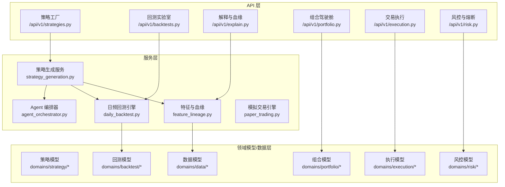
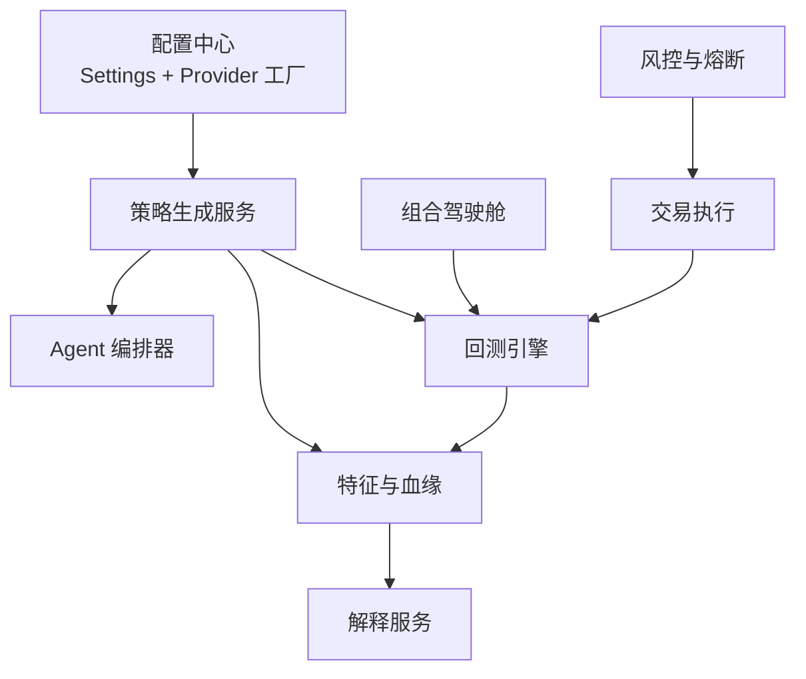
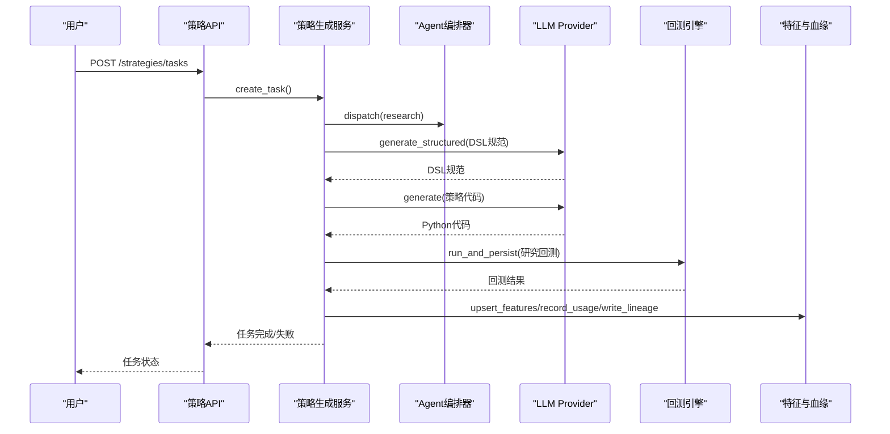
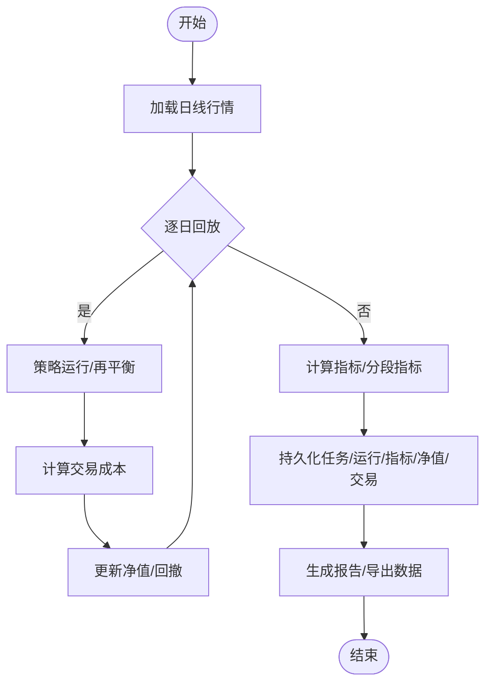
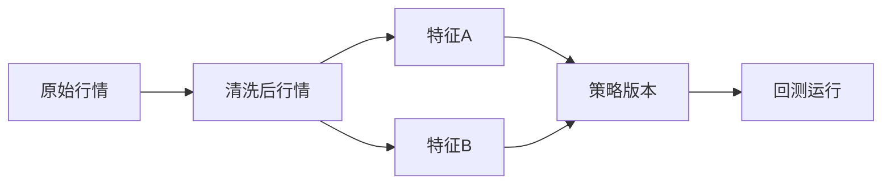
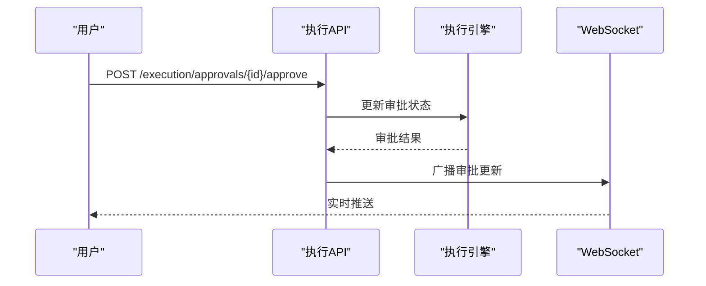
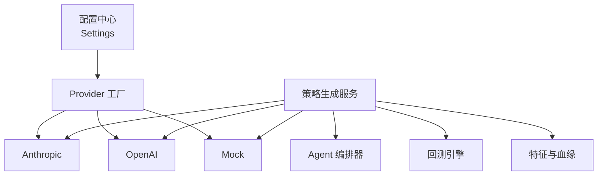

# 核心功能模块

<cite>
**本文档引用的文件**
- [backend/app/core/config.py](file://backend/app/core/config.py)
- [backend/ROADMAP.md](file://backend/ROADMAP.md)
- [doc/系统核心介绍/03-模型配置与Agent构建逻辑.md](file://doc/系统核心介绍/03-模型配置与Agent构建逻辑.md)
- [backend/app/api/v1/strategies.py](file://backend/app/api/v1/strategies.py)
- [backend/app/api/v1/backtests.py](file://backend/app/api/v1/backtests.py)
- [backend/app/api/v1/explain.py](file://backend/app/api/v1/explain.py)
- [backend/app/api/v1/portfolio.py](file://backend/app/api/v1/portfolio.py)
- [backend/app/api/v1/execution.py](file://backend/app/api/v1/execution.py)
- [backend/app/api/v1/risk.py](file://backend/app/api/v1/risk.py)
- [backend/app/services/strategy_generation.py](file://backend/app/services/strategy_generation.py)
- [backend/app/services/agent_orchestrator.py](file://backend/app/services/agent_orchestrator.py)
- [backend/app/services/daily_backtest.py](file://backend/app/services/daily_backtest.py)
- [backend/app/services/feature_lineage.py](file://backend/app/services/feature_lineage.py)
- [backend/app/services/paper_trading.py](file://backend/app/services/paper_trading.py)
</cite>

## 目录
1. [引言](#引言)
2. [项目结构](#项目结构)
3. [核心组件](#核心组件)
4. [架构总览](#架构总览)
5. [详细组件分析](#详细组件分析)
6. [依赖关系分析](#依赖关系分析)
7. [性能考虑](#性能考虑)
8. [故障排查指南](#故障排查指南)
9. [结论](#结论)

## 引言
本文件面向 llmine-quant 后端核心功能模块，系统性梳理策略工厂系统、回测实验室、解释与血缘追踪、组合驾驶舱、交易执行系统、风控与熔断等六大模块。内容涵盖业务逻辑、核心算法、数据流程、用户交互方式、模块间依赖与协作机制，并提供使用场景、配置选项与最佳实践，帮助开发者深入理解实现细节与扩展可能性。

## 项目结构
后端采用 FastAPI + SQLAlchemy 异步架构，按“API 层 → 服务层 → 领域模型/数据层”的分层组织。核心模块通过统一的路由前缀 `/api/v1` 对外提供 REST 接口；服务层协调数据库事务、Agent 编排、WebSocket 广播与审计日志；领域模型定义策略、回测、风控、组合、执行等业务实体。

**图表来源**
- [backend/app/api/v1/strategies.py:1-605](file://backend/app/api/v1/strategies.py#L1-L605)
- [backend/app/api/v1/backtests.py:1-800](file://backend/app/api/v1/backtests.py#L1-L800)
- [backend/app/api/v1/explain.py:1-110](file://backend/app/api/v1/explain.py#L1-L110)
- [backend/app/api/v1/portfolio.py:1-186](file://backend/app/api/v1/portfolio.py#L1-L186)
- [backend/app/api/v1/execution.py:1-281](file://backend/app/api/v1/execution.py#L1-L281)
- [backend/app/api/v1/risk.py:1-273](file://backend/app/api/v1/risk.py#L1-L273)
- [backend/app/services/strategy_generation.py:1-584](file://backend/app/services/strategy_generation.py#L1-L584)
- [backend/app/services/agent_orchestrator.py:1-105](file://backend/app/services/agent_orchestrator.py#L1-L105)
- [backend/app/services/daily_backtest.py:1-899](file://backend/app/services/daily_backtest.py#L1-L899)
- [backend/app/services/feature_lineage.py:1-217](file://backend/app/services/feature_lineage.py#L1-L217)
- [backend/app/services/paper_trading.py:1-634](file://backend/app/services/paper_trading.py#L1-L634)

**章节来源**
- [backend/ROADMAP.md:1-40](file://backend/ROADMAP.md#L1-L40)

## 核心组件
- 策略工厂系统：提供从自然语言到可执行策略的端到端流水线，包含研究扫描、DSL 规范生成、代码生成、静态校验、回测评估、风险检查与版本发布。
- 回测实验室：提供研究回测、参数敏感性分析、滚动窗口（Walk-Forward）分析、过拟合评估、交易明细与报告聚合。
- 解释与血缘追踪：提供信号归因、决策链、因子血缘、偏见门禁、相似历史对比等可解释性能力。
- 组合驾驶舱：提供净值、资产配置、相关性矩阵、集中度因子与持有头寸、再平衡提案与审批。
- 交易执行系统：提供审批请求、订单簿、预交易检查、执行指标、Agent 轨迹与 WebSocket 实时推送。
- 风控与熔断：提供风险预算、VaR 面板、熔断器面板、策略决策流、风险事件与健康度评分。

**章节来源**
- [backend/app/api/v1/strategies.py:1-605](file://backend/app/api/v1/strategies.py#L1-L605)
- [backend/app/api/v1/backtests.py:1-800](file://backend/app/api/v1/backtests.py#L1-L800)
- [backend/app/api/v1/explain.py:1-110](file://backend/app/api/v1/explain.py#L1-L110)
- [backend/app/api/v1/portfolio.py:1-186](file://backend/app/api/v1/portfolio.py#L1-L186)
- [backend/app/api/v1/execution.py:1-281](file://backend/app/api/v1/execution.py#L1-L281)
- [backend/app/api/v1/risk.py:1-273](file://backend/app/api/v1/risk.py#L1-L273)

## 架构总览
系统采用“配置驱动 + Provider 抽象 + Agent 编排 + 服务编排”的架构风格。配置中心统一管理 LLM 与市场数据提供商；策略生成服务串联 Agent 编排器与回测引擎；解释与血缘服务通过特征存储与血缘边建立数据溯源；组合、执行、风控模块通过统一审计与 WebSocket 实时联动。

**图表来源**
- [backend/app/core/config.py:48-196](file://backend/app/core/config.py#L48-L196)
- [doc/系统核心介绍/03-模型配置与Agent构建逻辑.md:1-492](file://doc/系统核心介绍/03-模型配置与Agent构建逻辑.md#L1-L492)
- [backend/app/services/strategy_generation.py:86-373](file://backend/app/services/strategy_generation.py#L86-L373)
- [backend/app/services/agent_orchestrator.py:15-105](file://backend/app/services/agent_orchestrator.py#L15-L105)
- [backend/app/services/daily_backtest.py:185-452](file://backend/app/services/daily_backtest.py#L185-L452)
- [backend/app/services/feature_lineage.py:100-194](file://backend/app/services/feature_lineage.py#L100-L194)
- [backend/app/api/v1/explain.py:98-110](file://backend/app/api/v1/explain.py#L98-L110)
- [backend/app/api/v1/portfolio.py:140-152](file://backend/app/api/v1/portfolio.py#L140-L152)
- [backend/app/api/v1/execution.py:188-202](file://backend/app/api/v1/execution.py#L188-L202)
- [backend/app/api/v1/risk.py:188-207](file://backend/app/api/v1/risk.py#L188-L207)

## 详细组件分析

### 策略工厂系统
- 业务逻辑
  - 用户输入自然语言描述、市场与风险画像，系统创建生成任务并进入流水线。
  - 流水线阶段：研究扫描 → DSL 规范生成与校验 → 代码生成与 AST 校验 → 版本快照 → 研究回测 → 特征与血缘记录 → 风险检查 → 发布与审计。
- 核心算法
  - DSL 规范解析与语义校验，确保策略参数合法与风险边界满足。
  - 回测指标计算：年化收益、最大回撤、夏普比率、胜率、换手率等。
  - 风控阈值：按风险画像设定最大回撤上限与最低夏普阈值。
- 数据流程
  - 任务状态与事件持久化，Agent 任务派发与消息广播，WebSocket 实时推送。
- 用户交互
  - 创建任务、查询任务进度、查看策略矩阵、事件流、模板选择与筛选。
- 依赖关系
  - 依赖 LLM Provider 工厂、AgentOrchestrator、DailyBacktestEngine、FeatureLineage、AuditService、WebSocket Manager。

**图表来源**
- [backend/app/api/v1/strategies.py:301-314](file://backend/app/api/v1/strategies.py#L301-L314)
- [backend/app/services/strategy_generation.py:132-373](file://backend/app/services/strategy_generation.py#L132-L373)
- [backend/app/services/agent_orchestrator.py:31-60](file://backend/app/services/agent_orchestrator.py#L31-L60)
- [backend/app/services/daily_backtest.py:285-371](file://backend/app/services/daily_backtest.py#L285-L371)
- [backend/app/services/feature_lineage.py:41-97](file://backend/app/services/feature_lineage.py#L41-L97)

**章节来源**
- [backend/app/api/v1/strategies.py:162-554](file://backend/app/api/v1/strategies.py#L162-L554)
- [backend/app/services/strategy_generation.py:86-584](file://backend/app/services/strategy_generation.py#L86-L584)
- [doc/系统核心介绍/03-模型配置与Agent构建逻辑.md:368-474](file://doc/系统核心介绍/03-模型配置与Agent构建逻辑.md#L368-L474)

### 回测实验室
- 业务逻辑
  - 支持研究回测、敏感性分析、滚动窗口分析、过拟合评估、交易明细导出与统一报告。
- 核心算法
  - 日频回测循环：每日加载行情、构建策略上下文、执行再平衡、计算交易成本、更新净值曲线与指标。
  - 指标计算：年化回报、最大回撤、夏普比率、Calmar、Sortino、波动率、盈利因子等。
  - Walk-Forward：按折叠数与训练比例切分样本内外，分别计算训练与测试指标。
- 数据流程
  - 任务 → 运行 → 指标（全样本/样本内外）→ 净值曲线 → 交易明细 → 报告聚合。
- 用户交互
  - 创建回测任务、查看历史、获取报告、导出交易明细、参数热力图、压力情景。

**图表来源**
- [backend/app/services/daily_backtest.py:191-283](file://backend/app/services/daily_backtest.py#L191-L283)
- [backend/app/api/v1/backtests.py:377-577](file://backend/app/api/v1/backtests.py#L377-L577)

**章节来源**
- [backend/app/api/v1/backtests.py:363-761](file://backend/app/api/v1/backtests.py#L363-L761)
- [backend/app/services/daily_backtest.py:185-899](file://backend/app/services/daily_backtest.py#L185-L899)

### 解释与血缘追踪
- 业务逻辑
  - 提供信号归因瀑布、信心雷达、决策链、因子血缘、偏见门禁、相似历史对比等。
- 核心算法
  - 归因项累加与最终决策；血缘节点与边的构建，支持原始行情、清洗、特征、策略版本、回测运行的链路。
- 数据流程
  - 回测运行 → 特征使用记录 → 血缘节点与边写入 → 前端可视化展示。
- 用户交互
  - 查看解释面板、查看血缘图谱、查看相似案例。

**图表来源**
- [backend/app/services/feature_lineage.py:100-194](file://backend/app/services/feature_lineage.py#L100-L194)
- [backend/app/api/v1/explain.py:98-110](file://backend/app/api/v1/explain.py#L98-L110)

**章节来源**
- [backend/app/api/v1/explain.py:1-110](file://backend/app/api/v1/explain.py#L1-L110)
- [backend/app/services/feature_lineage.py:1-217](file://backend/app/services/feature_lineage.py#L1-L217)

### 组合驾驶舱
- 业务逻辑
  - 展示净值、风险预算、资产配置、相关性矩阵、集中度因子与持有头寸、再平衡提案与审批。
- 核心算法
  - 配置权重与头寸映射、集中度因子暴露计算、相关性矩阵估计。
- 数据流程
  - 从回测/模拟交易产出的净值与头寸数据，经聚合后展示。
- 用户交互
  - 查看概览、列出待审批再平衡提案、批准再平衡。

**章节来源**
- [backend/app/api/v1/portfolio.py:140-186](file://backend/app/api/v1/portfolio.py#L140-L186)

### 交易执行系统
- 业务逻辑
  - 审批请求、订单簿、预交易检查、执行指标、Agent 轨迹与 WebSocket 实时推送。
- 核心算法
  - 预交易检查：单票上限、行业上限、日亏损限额、净敞口限额、VaR 限额。
  - 执行撮合：按滑点、佣金、印花税模型计算成交价格与费用，更新账户状态。
- 数据流程
  - 审批请求创建 → 预交易检查 → 执行撮合 → 写入成交与净值 → WebSocket 广播。
- 用户交互
  - 列出审批、批准/拒绝审批、查看订单簿与执行指标。

**图表来源**
- [backend/app/api/v1/execution.py:223-250](file://backend/app/api/v1/execution.py#L223-L250)

**章节来源**
- [backend/app/api/v1/execution.py:188-281](file://backend/app/api/v1/execution.py#L188-L281)

### 风控与熔断
- 业务逻辑
  - 风险预算、VaR 面板、熔断器面板、策略决策流、风险事件与健康度评分。
- 核心算法
  - 健康度评分：基于活跃风险事件与自动阻断次数综合计算。
  - 熔断器触发/恢复：人工触发与恢复，写入审计日志并通过 WebSocket 广播。
- 数据流程
  - 风控指标采集 → 面板聚合 → 事件记录 → 健康度计算 → 人工干预。
- 用户交互
  - 查看风险概览、手动触发/恢复熔断器。

**章节来源**
- [backend/app/api/v1/risk.py:188-273](file://backend/app/api/v1/risk.py#L188-L273)

## 依赖关系分析
- 配置与 Provider
  - 配置中心统一注入 LLM 与市场数据提供商，支持 Anthropic、OpenAI、Mock 三类 Provider，工厂函数按设置选择具体实现。
- Agent 编排
  - AgentOrchestrator 负责任务派发、结果归档与消息广播，贯穿策略生成流水线。
- 服务编排
  - 策略生成服务协调 LLM、回测引擎、特征与血缘、审计与 WebSocket，形成闭环。
- 数据与模型
  - 各模块通过 SQLAlchemy 模型进行数据持久化，回测与解释模块共享特征与血缘模型。

**图表来源**
- [backend/app/core/config.py:48-196](file://backend/app/core/config.py#L48-L196)
- [doc/系统核心介绍/03-模型配置与Agent构建逻辑.md:278-300](file://doc/系统核心介绍/03-模型配置与Agent构建逻辑.md#L278-L300)
- [backend/app/services/strategy_generation.py:86-131](file://backend/app/services/strategy_generation.py#L86-L131)
- [backend/app/services/agent_orchestrator.py:15-60](file://backend/app/services/agent_orchestrator.py#L15-L60)
- [backend/app/services/daily_backtest.py:185-283](file://backend/app/services/daily_backtest.py#L185-L283)
- [backend/app/services/feature_lineage.py:100-194](file://backend/app/services/feature_lineage.py#L100-L194)

**章节来源**
- [backend/app/core/config.py:110-196](file://backend/app/core/config.py#L110-L196)
- [doc/系统核心介绍/03-模型配置与Agent构建逻辑.md:33-131](file://doc/系统核心介绍/03-模型配置与Agent构建逻辑.md#L33-L131)

## 性能考虑
- 异步 I/O 与连接池
  - 使用 SQLAlchemy 异步会话与连接池，减少 IO 阻塞；WebSocket 广播采用异步推送，降低延迟。
- 回测性能
  - 日频回测按日期分组加载行情，避免重复扫描；指标计算采用向量化思路（如日收益序列）提升效率。
- 特征与血缘
  - 特征去重与版本化，避免重复计算；血缘链路仅记录必要节点与边，保持链路紧凑。
- 缓存与索引
  - 建议对常用查询（如策略版本、回测运行、特征使用）建立索引；对热点数据可引入 Redis 缓存（如配置与近期事件）。

## 故障排查指南
- 策略生成失败
  - 检查 LLM Provider 配置与凭据注入；查看流水线阶段事件与错误详情；确认回测数据可用性。
- 回测异常
  - 检查行情数据是否为空或时间范围非法；确认参数合法性与成本配置；查看回测错误码与堆栈。
- 风控拦截
  - 检查预交易检查项阈值与当前头寸；关注 VaR 限额与净敞口限额；核对熔断器状态。
- 执行异常
  - 检查订单状态与拒绝原因；确认滑点、佣金、印花税配置；核对账户资金与可用头寸。

**章节来源**
- [backend/app/services/strategy_generation.py:308-373](file://backend/app/services/strategy_generation.py#L308-L373)
- [backend/app/services/daily_backtest.py:29-47](file://backend/app/services/daily_backtest.py#L29-L47)
- [backend/app/api/v1/execution.py:253-280](file://backend/app/api/v1/execution.py#L253-L280)
- [backend/app/api/v1/risk.py:210-273](file://backend/app/api/v1/risk.py#L210-L273)

## 结论
llmine-quant 的核心模块围绕“策略工厂 + 回测 + 解释与血缘 + 组合 + 执行 + 风控”构建，形成从自然语言到可执行策略、从回测到可解释性的完整闭环。通过配置驱动的 Provider 抽象、Agent 编排与服务编排，系统具备良好的扩展性与可维护性。建议在生产环境中完善缓存与索引、强化异常监控与审计日志，并持续优化回测与特征管线的性能与稳定性。