# 交易执行系统

<cite>
**本文档引用的文件**
- [execution.py](file://backend/app/api/v1/execution.py)
- [models.py](file://backend/app/domains/execution/models.py)
- [schemas.py](file://backend/app/domains/execution/schemas.py)
- [paper_trading.py](file://backend/app/services/paper_trading.py)
- [paper_models.py](file://backend/app/domains/execution/paper_models.py)
- [paper_schemas.py](file://backend/app/domains/execution/paper_schemas.py)
- [paper.py](file://backend/app/api/v1/paper.py)
- [daily_backtest.py](file://backend/app/services/daily_backtest.py)
- [risk.py](file://backend/app/api/v1/risk.py)
- [audit.py](file://backend/app/api/v1/audit.py)
- [audit_service.py](file://backend/app/services/audit_service.py)
- [router.py](file://backend/app/api/v1/router.py)
- [ExecutionMetrics.tsx](file://frontend/src/screens/Execution/ExecutionMetrics.tsx)
- [OrderBook.tsx](file://frontend/src/screens/Execution/OrderBook.tsx)
- [PreTradeChecks.tsx](file://frontend/src/screens/Execution/PreTradeChecks.tsx)
</cite>

## 目录
1. [简介](#简介)
2. [项目结构](#项目结构)
3. [核心组件](#核心组件)
4. [架构概览](#架构概览)
5. [详细组件分析](#详细组件分析)
6. [依赖关系分析](#依赖关系分析)
7. [性能考虑](#性能考虑)
8. [故障排除指南](#故障排除指南)
9. [结论](#结论)

## 简介

交易执行系统是一个完整的量化交易基础设施，集成了模拟盘交易、实盘交易审批、风险控制和审计合规功能。该系统采用前后端分离架构，后端基于FastAPI提供RESTful API服务，前端使用React构建交互式仪表板。

系统的核心功能包括：
- **订单管理机制**：支持多种订单类型（实盘、模拟盘、加仓、减仓、轮换、对冲、暂停）
- **模拟盘交易流程**：端到端的模拟交易执行，包含信号生成、预交易检查、订单匹配和净值计算
- **实盘交易对接**：人工确认流程，通过审批机制确保交易安全性
- **风险控制机制**：实时风险监控、预交易闸门和熔断器系统
- **交易成本管理**：精确的成本建模，包括滑点、佣金和印花税
- **审计合规**：不可篡改的审计日志链，支持哈希验证

## 项目结构

系统采用分层架构设计，主要分为以下层次：

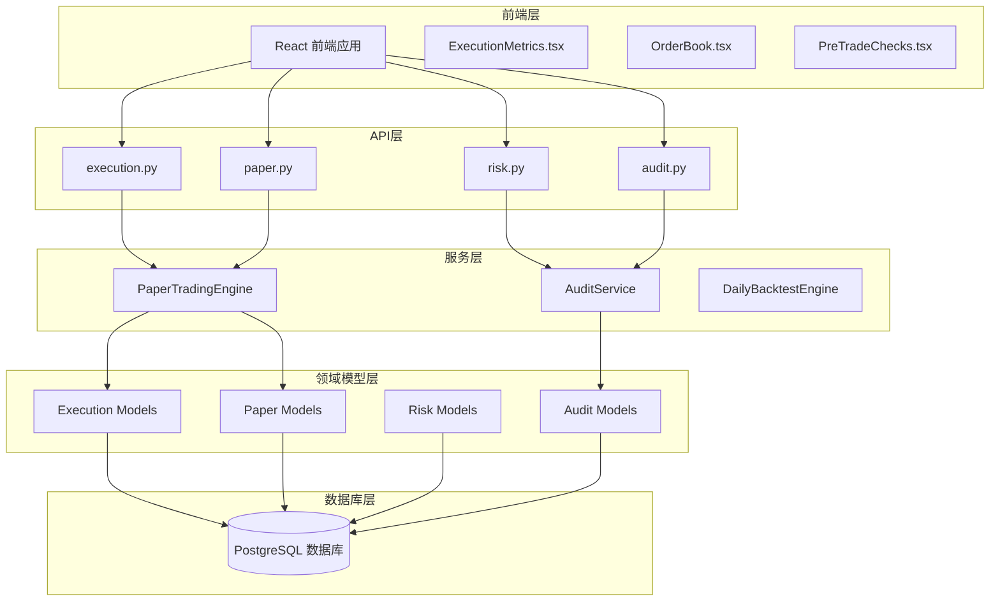

**图表来源**
- [router.py:1-40](file://backend/app/api/v1/router.py#L1-L40)
- [execution.py:1-281](file://backend/app/api/v1/execution.py#L1-L281)
- [paper.py:1-276](file://backend/app/api/v1/paper.py#L1-L276)

**章节来源**
- [router.py:1-40](file://backend/app/api/v1/router.py#L1-L40)

## 核心组件

### 订单管理系统

订单管理系统是整个执行系统的核心，负责处理各种类型的交易请求和状态管理。

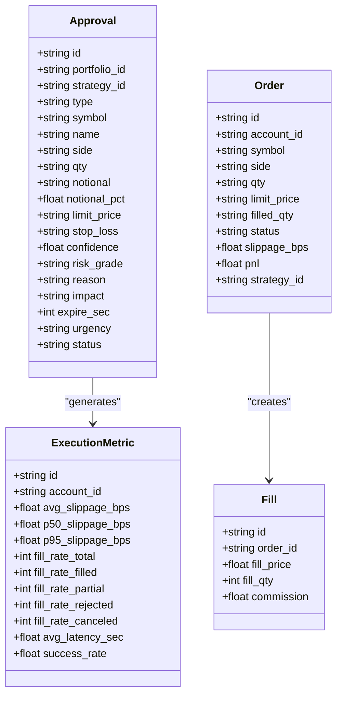

**图表来源**
- [models.py:9-103](file://backend/app/domains/execution/models.py#L9-L103)

### 模拟盘交易引擎

PaperTradingEngine实现了完整的端到端模拟交易流程，从市场数据加载到最终净值计算。

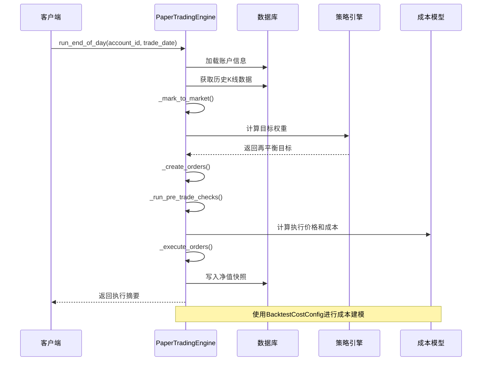

**图表来源**
- [paper_trading.py:76-134](file://backend/app/services/paper_trading.py#L76-L134)
- [daily_backtest.py:33-48](file://backend/app/services/daily_backtest.py#L33-L48)

### 风险控制系统

风险控制系统提供了多层次的风险监控和控制机制。

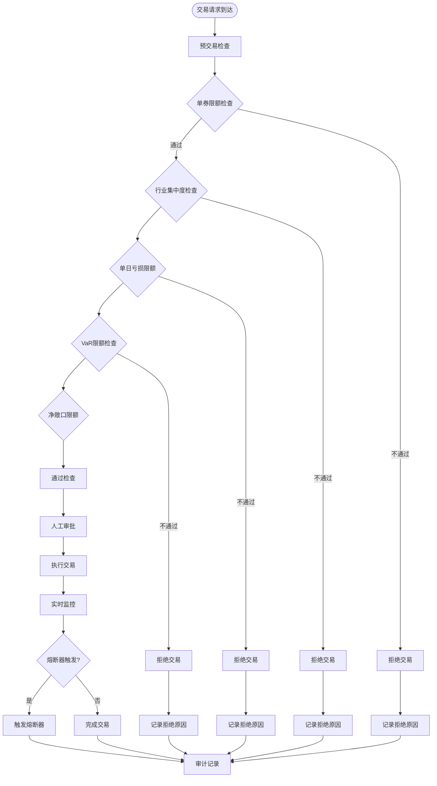

**图表来源**
- [paper_trading.py:314-372](file://backend/app/services/paper_trading.py#L314-L372)
- [risk.py:119-135](file://backend/app/api/v1/risk.py#L119-L135)

**章节来源**
- [models.py:9-103](file://backend/app/domains/execution/models.py#L9-L103)
- [paper_trading.py:76-134](file://backend/app/services/paper_trading.py#L76-L134)

## 架构概览

系统采用微服务架构，通过清晰的分层设计实现了关注点分离：

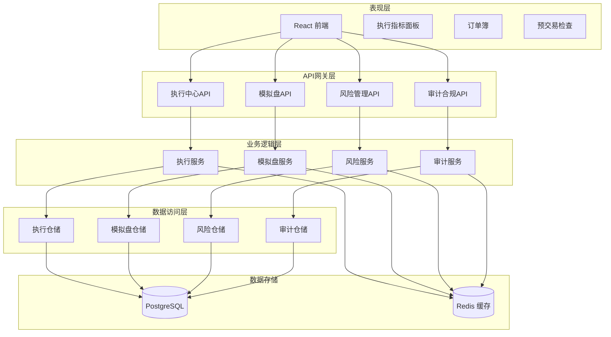

**图表来源**
- [router.py:23-40](file://backend/app/api/v1/router.py#L23-L40)
- [execution.py:1-281](file://backend/app/api/v1/execution.py#L1-L281)

## 详细组件分析

### 执行中心API

执行中心API提供了交易执行的核心功能，包括订单审批、执行监控和风险检查。

#### 订单审批流程

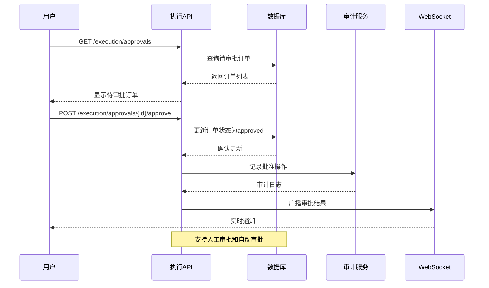

**图表来源**
- [execution.py:223-280](file://backend/app/api/v1/execution.py#L223-L280)

#### 执行监控面板

执行监控面板提供了实时的交易执行状态展示：

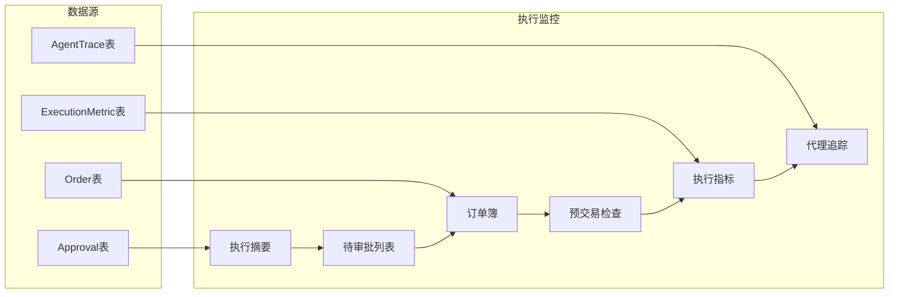

**图表来源**
- [execution.py:188-202](file://backend/app/api/v1/execution.py#L188-L202)
- [schemas.py:6-107](file://backend/app/domains/execution/schemas.py#L6-L107)

**章节来源**
- [execution.py:1-281](file://backend/app/api/v1/execution.py#L1-L281)
- [schemas.py:1-107](file://backend/app/domains/execution/schemas.py#L1-L107)

### 模拟盘交易系统

模拟盘交易系统实现了完整的端到端交易流程，确保策略在真实市场环境中的有效性。

#### EOD循环流程

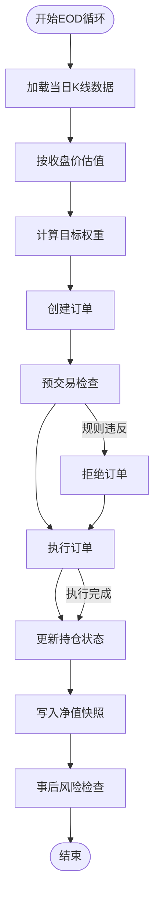

**图表来源**
- [paper_trading.py:82-134](file://backend/app/services/paper_trading.py#L82-L134)

#### 成本建模

系统使用BacktestCostConfig进行精确的成本建模：

| 成本类型 | 默认值 | 说明 |
|---------|--------|------|
| 佣金费率 | 0.0003 | 0.03% 佣金费率 |
| 最低佣金 | 5.0 | 最低5元佣金 |
| 印花税 | 0.001 | A股卖出收取0.1% |
| 滑点 | 1.0bp | 0.01% 滑点 |

**章节来源**
- [paper_trading.py:602-634](file://backend/app/services/paper_trading.py#L602-L634)
- [daily_backtest.py:33-48](file://backend/app/services/daily_backtest.py#L33-L48)

### 风险控制系统

风险控制系统提供了多层次的风控机制，确保交易活动在可控范围内进行。

#### 风控规则配置

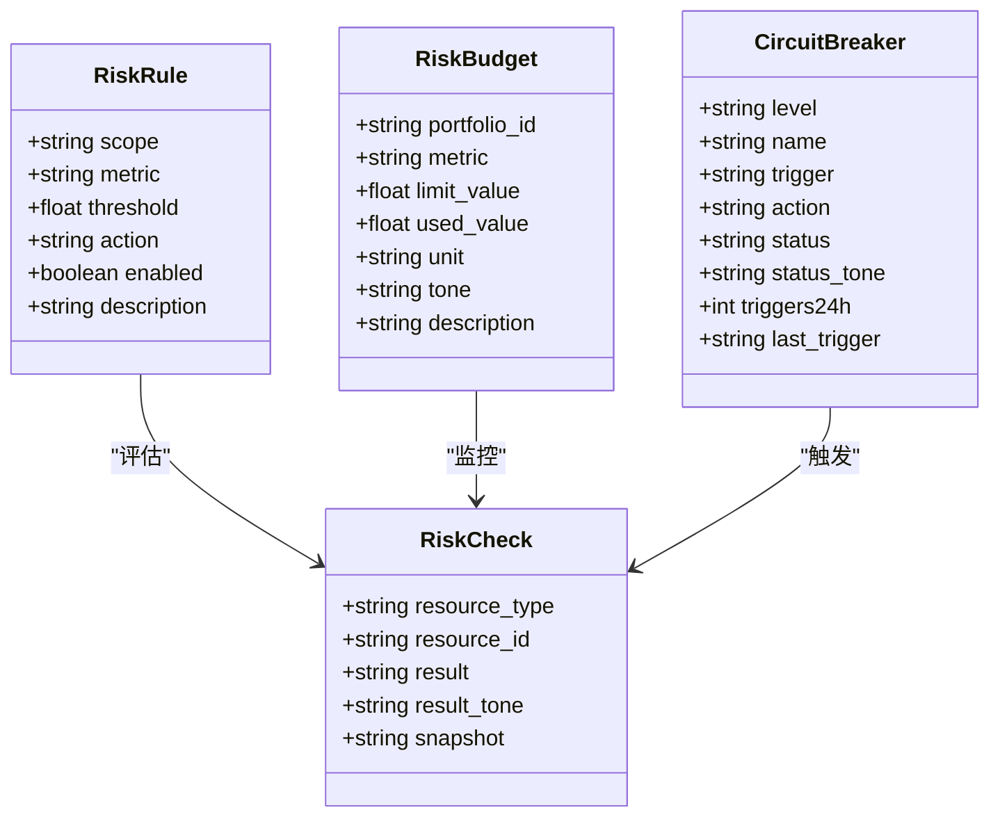

**图表来源**
- [risk.py:39-176](file://backend/app/api/v1/risk.py#L39-L176)
- [models.py:9-101](file://backend/app/domains/risk/models.py#L9-L101)

#### 风控检查流程

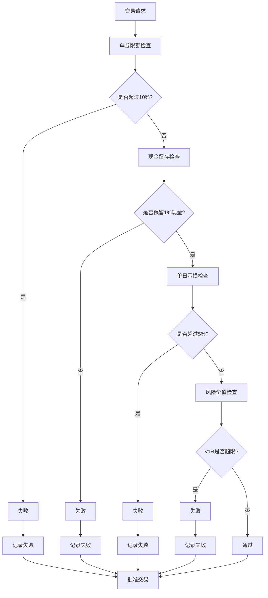

**图表来源**
- [paper_trading.py:314-372](file://backend/app/services/paper_trading.py#L314-L372)

**章节来源**
- [risk.py:1-273](file://backend/app/api/v1/risk.py#L1-L273)
- [models.py:1-101](file://backend/app/domains/risk/models.py#L1-L101)

### 审计合规系统

审计合规系统提供了不可篡改的交易记录，确保所有操作可追溯。

#### 审计日志链

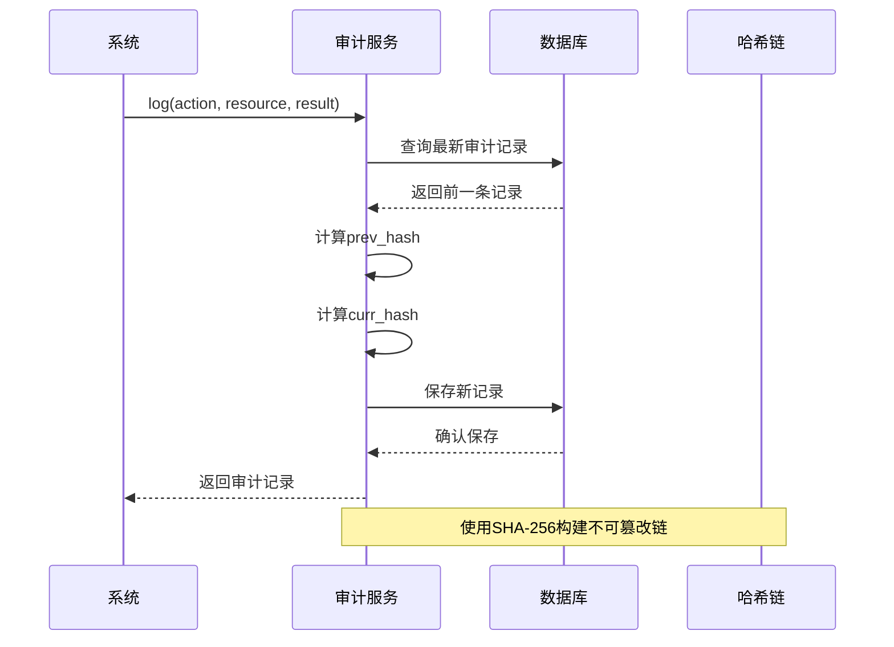

**图表来源**
- [audit_service.py:38-81](file://backend/app/services/audit_service.py#L38-L81)

#### 审计验证流程

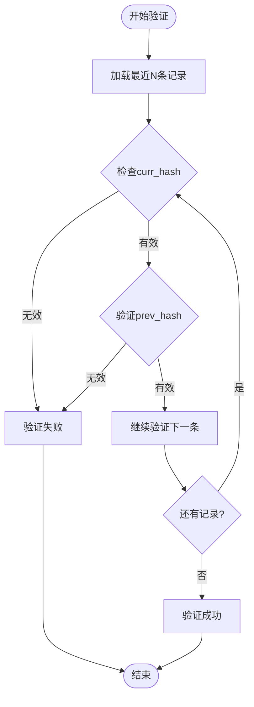

**图表来源**
- [audit_service.py:83-109](file://backend/app/services/audit_service.py#L83-L109)

**章节来源**
- [audit.py:1-258](file://backend/app/api/v1/audit.py#L1-L258)
- [audit_service.py:1-109](file://backend/app/services/audit_service.py#L1-L109)

## 依赖关系分析

系统采用模块化设计，各组件之间的依赖关系清晰明确：

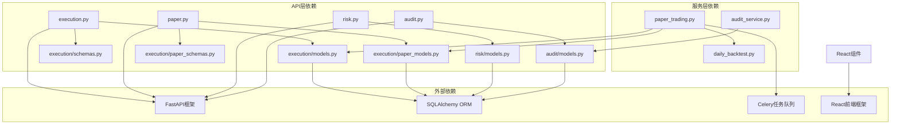

**图表来源**
- [router.py:5-21](file://backend/app/api/v1/router.py#L5-L21)
- [execution.py:1-27](file://backend/app/api/v1/execution.py#L1-L27)
- [paper.py:1-34](file://backend/app/api/v1/paper.py#L1-L34)

**章节来源**
- [router.py:1-40](file://backend/app/api/v1/router.py#L1-L40)

## 性能考虑

系统在设计时充分考虑了性能优化，采用了多种技术手段提升执行效率：

### 数据库优化

- **索引策略**：关键查询字段建立复合索引，如`created_at`、`status`、`account_id`等
- **批量操作**：使用批量插入和更新减少数据库往返次数
- **缓存机制**：Redis缓存热点数据，减少数据库压力

### 异步处理

- **Celery任务队列**：异步执行模拟盘EOD批处理任务
- **WebSocket推送**：实时推送订单状态变更和风险事件
- **异步数据库连接**：使用SQLAlchemy异步会话池

### 成本控制

- **滑点建模**：精确的滑点成本计算，避免过度估计
- **佣金优化**：根据交易量动态调整佣金费率
- **印花税处理**：仅在卖出时计算印花税，符合A股规则

## 故障排除指南

### 常见问题诊断

#### 订单审批问题

**症状**：订单无法被审批或状态异常
**排查步骤**：
1. 检查订单状态是否为`pending`
2. 验证用户权限和审批权限
3. 查看审计日志确认操作历史
4. 检查WebSocket连接状态

#### 模拟盘执行失败

**症状**：模拟盘交易无法执行或报错
**排查步骤**：
1. 验证市场数据完整性
2. 检查策略参数配置
3. 确认账户资金充足
4. 查看预交易检查结果

#### 风控拦截过多

**症状**：交易频繁被风控系统拦截
**排查步骤**：
1. 分析预交易检查失败原因
2. 调整风险限额参数
3. 检查熔断器状态
4. 审核策略参数设置

### 性能监控

系统提供了完善的性能监控指标：

| 监控指标 | 含义 | 阈值建议 |
|---------|------|----------|
| 平均延迟 | API响应时间 | < 500ms |
| 成功率 | 交易执行成功率 | > 95% |
| 滑点 | 平均滑点成本 | < 5bp |
| 成交率 | 订单成交量占比 | > 80% |
| 风控拦截率 | 被风控拦截的订单比例 | < 5% |

**章节来源**
- [execution.py:223-280](file://backend/app/api/v1/execution.py#L223-L280)
- [paper_trading.py:314-372](file://backend/app/services/paper_trading.py#L314-L372)

## 结论

交易执行系统是一个功能完整、架构清晰的量化交易基础设施。系统通过模块化设计实现了订单管理、模拟盘交易、风险控制和审计合规的有机结合。

### 主要优势

1. **完整的交易生命周期管理**：从策略生成到执行监控的全流程覆盖
2. **多层次风险控制**：预交易检查、实时监控和事后评估相结合
3. **精确的成本建模**：符合实际市场的交易成本计算
4. **不可篡改的审计记录**：满足监管要求的合规性
5. **高性能的系统架构**：支持高并发的交易执行需求

### 技术特色

- **前后端分离架构**：现代化的开发和部署模式
- **微服务设计理念**：清晰的职责划分和扩展性
- **异步处理机制**：提升系统响应速度和吞吐量
- **可视化监控面板**：直观的交易执行状态展示

该系统为量化交易提供了坚实的技术基础，既满足了当前的业务需求，也为未来的功能扩展预留了充足的空间。