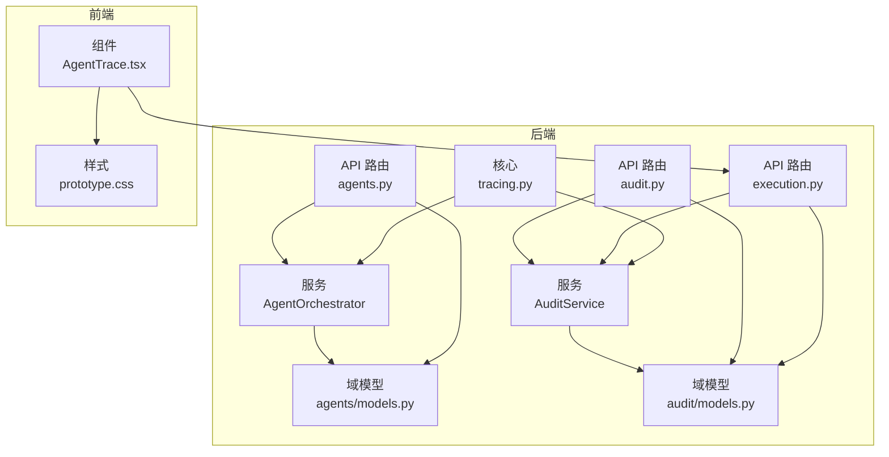
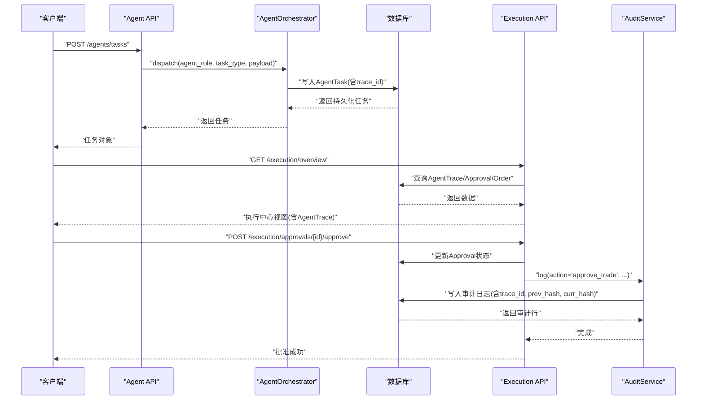
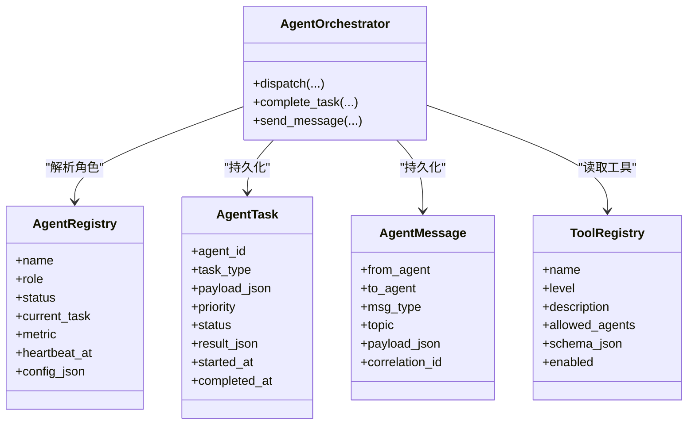
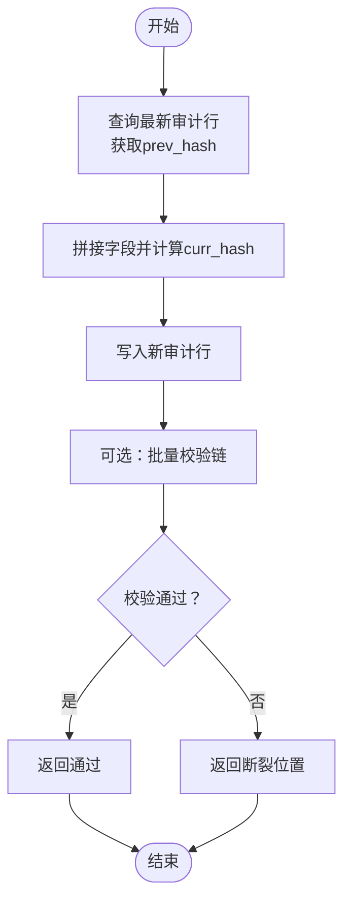
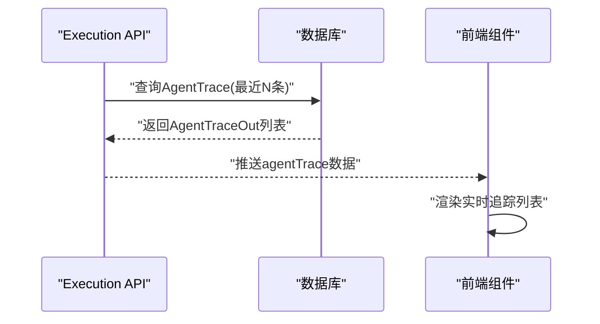
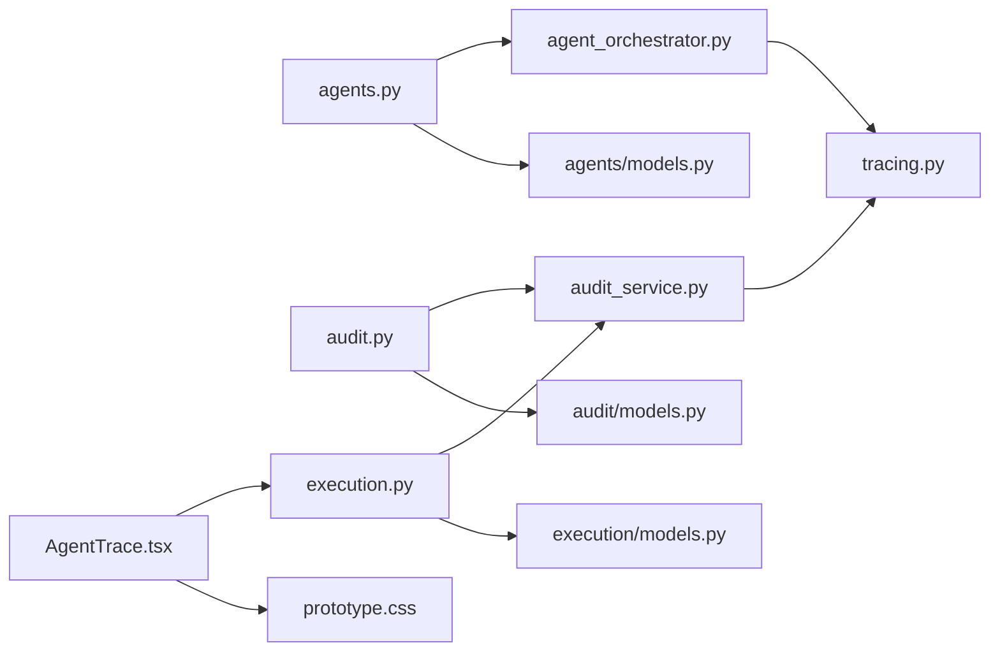

# 代理追踪

<cite>
**本文引用的文件**
- [backend/app/domains/agents/models.py](file://backend/app/domains/agents/models.py)
- [backend/app/domains/agents/schemas.py](file://backend/app/domains/agents/schemas.py)
- [backend/app/api/v1/agents.py](file://backend/app/api/v1/agents.py)
- [backend/app/services/agent_orchestrator.py](file://backend/app/services/agent_orchestrator.py)
- [backend/app/domains/audit/models.py](file://backend/app/domains/audit/models.py)
- [backend/app/domains/audit/schemas.py](file://backend/app/domains/audit/schemas.py)
- [backend/app/api/v1/audit.py](file://backend/app/api/v1/audit.py)
- [backend/app/services/audit_service.py](file://backend/app/services/audit_service.py)
- [backend/app/api/v1/execution.py](file://backend/app/api/v1/execution.py)
- [backend/app/core/tracing.py](file://backend/app/core/tracing.py)
- [frontend/src/screens/Execution/AgentTrace.tsx](file://frontend/src/screens/Execution/AgentTrace.tsx)
- [frontend/src/styles/prototype.css](file://frontend/src/styles/prototype.css)
</cite>

## 目录
1. [简介](#简介)
2. [项目结构](#项目结构)
3. [核心组件](#核心组件)
4. [架构总览](#架构总览)
5. [详细组件分析](#详细组件分析)
6. [依赖分析](#依赖分析)
7. [性能考虑](#性能考虑)
8. [故障排查指南](#故障排查指南)
9. [结论](#结论)
10. [附录](#附录)

## 简介
本文件面向“代理追踪系统”的功能文档，聚焦于AI Agent在交易执行过程中的行为追踪、操作记录与决策链路可视化。系统通过任务队列、跨Agent消息、审计日志与可验证哈希链，形成从策略生成、风控校验、执行审批到订单簿与实时追踪的闭环。前端提供“Agent 操作流 · Live Trace”面板，实时呈现Agent动作、状态与时间线。

## 项目结构
后端采用分层设计：API路由负责对外接口；服务层封装业务编排（如Agent编排器、审计服务）；领域模型定义数据库表结构；前端通过上下文与WebSocket订阅实时数据。

图表来源
- [backend/app/api/v1/agents.py:1-172](file://backend/app/api/v1/agents.py#L1-L172)
- [backend/app/services/agent_orchestrator.py:1-105](file://backend/app/services/agent_orchestrator.py#L1-L105)
- [backend/app/domains/agents/models.py:1-62](file://backend/app/domains/agents/models.py#L1-L62)
- [backend/app/api/v1/audit.py:1-258](file://backend/app/api/v1/audit.py#L1-L258)
- [backend/app/services/audit_service.py:1-109](file://backend/app/services/audit_service.py#L1-L109)
- [backend/app/domains/audit/models.py:1-51](file://backend/app/domains/audit/models.py#L1-L51)
- [backend/app/api/v1/execution.py:1-281](file://backend/app/api/v1/execution.py#L1-L281)
- [backend/app/core/tracing.py:1-87](file://backend/app/core/tracing.py#L1-L87)
- [frontend/src/screens/Execution/AgentTrace.tsx:1-37](file://frontend/src/screens/Execution/AgentTrace.tsx#L1-L37)
- [frontend/src/styles/prototype.css:6746-6845](file://frontend/src/styles/prototype.css#L6746-L6845)

章节来源
- [backend/app/api/v1/agents.py:1-172](file://backend/app/api/v1/agents.py#L1-L172)
- [backend/app/api/v1/audit.py:1-258](file://backend/app/api/v1/audit.py#L1-L258)
- [backend/app/api/v1/execution.py:1-281](file://backend/app/api/v1/execution.py#L1-L281)
- [backend/app/services/agent_orchestrator.py:1-105](file://backend/app/services/agent_orchestrator.py#L1-L105)
- [backend/app/services/audit_service.py:1-109](file://backend/app/services/audit_service.py#L1-L109)
- [backend/app/domains/agents/models.py:1-62](file://backend/app/domains/agents/models.py#L1-L62)
- [backend/app/domains/audit/models.py:1-51](file://backend/app/domains/audit/models.py#L1-L51)
- [backend/app/core/tracing.py:1-87](file://backend/app/core/tracing.py#L1-L87)
- [frontend/src/screens/Execution/AgentTrace.tsx:1-37](file://frontend/src/screens/Execution/AgentTrace.tsx#L1-L37)
- [frontend/src/styles/prototype.css:6746-6845](file://frontend/src/styles/prototype.css#L6746-L6845)

## 核心组件
- 代理编排与追踪
  - 代理注册表：记录Agent名称、角色、状态、当前任务、心跳与配置。
  - 代理任务：任务类型、优先级、状态、结果、时间戳与关联元数据。
  - 代理消息：跨Agent通信的消息类型、主题、负载与关联ID。
  - 工具注册：工具级别、描述、允许的Agent角色集合与启用状态。
- 审计与合规
  - 审计日志：不可变追加日志，包含操作者、动作、资源、结果、置信度、摘要与哈希链字段。
  - 事件盒：可靠事件发布队列，支持重试与错误记录。
- 执行中心
  - Agent操作流：用于前端实时展示的Agent动作、代理名、时间与详情。
  - 预交易检查、订单簿、执行指标与审批队列。
- 追踪与上下文
  - 请求追踪ID注入与传播，贯穿API、服务与日志。

章节来源
- [backend/app/domains/agents/models.py:9-62](file://backend/app/domains/agents/models.py#L9-L62)
- [backend/app/domains/agents/schemas.py:6-78](file://backend/app/domains/agents/schemas.py#L6-L78)
- [backend/app/domains/audit/models.py:9-51](file://backend/app/domains/audit/models.py#L9-L51)
- [backend/app/api/v1/execution.py:139-155](file://backend/app/api/v1/execution.py#L139-L155)
- [backend/app/core/tracing.py:13-87](file://backend/app/core/tracing.py#L13-L87)

## 架构总览
系统围绕“请求追踪ID”贯穿全链路，Agent编排器负责持久化任务与消息，审计服务负责不可篡改的日志与哈希链校验，执行API聚合审批、订单与Agent追踪，前端通过组件实时渲染。

图表来源
- [backend/app/api/v1/agents.py:115-129](file://backend/app/api/v1/agents.py#L115-L129)
- [backend/app/services/agent_orchestrator.py:31-60](file://backend/app/services/agent_orchestrator.py#L31-L60)
- [backend/app/api/v1/execution.py:223-250](file://backend/app/api/v1/execution.py#L223-L250)
- [backend/app/services/audit_service.py:38-81](file://backend/app/services/audit_service.py#L38-L81)
- [backend/app/core/tracing.py:13-26](file://backend/app/core/tracing.py#L13-L26)

## 详细组件分析

### 代理编排与追踪（Agent Orchestrator）
- 功能职责
  - 将任务按角色解析为具体Agent ID并持久化。
  - 记录任务开始时间、追踪ID与可选关联ID。
  - 支持完成任务并写回结果与结束时间。
  - 发送跨Agent消息（请求/响应/事件/广播），携带追踪ID与关联ID。
- 数据模型
  - AgentRegistry：角色驱动的Agent注册。
  - AgentTask：任务生命周期与结果存储。
  - AgentMessage：跨Agent通信载体。
  - ToolRegistry：工具能力与权限控制。
- API接口
  - 获取概览：返回最近代理、任务、消息与工具列表。
  - 创建任务：按角色派发任务。
  - 查询任务：按ID获取任务详情。
  - 发送消息：跨Agent通信。
  - 列出消息：分页查询最近消息。

图表来源
- [backend/app/services/agent_orchestrator.py:15-105](file://backend/app/services/agent_orchestrator.py#L15-L105)
- [backend/app/domains/agents/models.py:9-62](file://backend/app/domains/agents/models.py#L9-L62)

章节来源
- [backend/app/services/agent_orchestrator.py:1-105](file://backend/app/services/agent_orchestrator.py#L1-L105)
- [backend/app/domains/agents/models.py:1-62](file://backend/app/domains/agents/models.py#L1-L62)
- [backend/app/domains/agents/schemas.py:1-78](file://backend/app/domains/agents/schemas.py#L1-L78)
- [backend/app/api/v1/agents.py:93-172](file://backend/app/api/v1/agents.py#L93-L172)

### 审计与合规（Audit Service）
- 不可篡改审计日志
  - 每条日志计算SHA-256哈希并与前一条链接，形成可验证链。
  - 提供链完整性校验，支持批量验证与定位断裂点。
- API能力
  - 获取审计概览（KPI、行、Actor统计、工具注册、HITL规则）。
  - 分页列出审计日志，支持过滤。
  - 导出CSV。
  - 校验哈希链。
  - 获取工具注册表与HITL规则。

图表来源
- [backend/app/services/audit_service.py:18-109](file://backend/app/services/audit_service.py#L18-L109)
- [backend/app/domains/audit/models.py:9-51](file://backend/app/domains/audit/models.py#L9-L51)

章节来源
- [backend/app/services/audit_service.py:1-109](file://backend/app/services/audit_service.py#L1-L109)
- [backend/app/domains/audit/models.py:1-51](file://backend/app/domains/audit/models.py#L1-L51)
- [backend/app/domains/audit/schemas.py:1-53](file://backend/app/domains/audit/schemas.py#L1-L53)
- [backend/app/api/v1/audit.py:153-258](file://backend/app/api/v1/audit.py#L153-L258)

### 执行中心与实时追踪（Execution API + 前端）
- 后端
  - 汇总审批、订单簿、预交易检查、执行指标与Agent操作流。
  - 审批通过/拒绝时写入审计日志，并通过WebSocket广播。
- 前端
  - “Agent 操作流 · Live Trace”组件展示最近Agent动作，包含动作、代理、时间与详情。
  - 样式通过CSS类控制图标、颜色与布局。

图表来源
- [backend/app/api/v1/execution.py:139-155](file://backend/app/api/v1/execution.py#L139-L155)
- [frontend/src/screens/Execution/AgentTrace.tsx:1-37](file://frontend/src/screens/Execution/AgentTrace.tsx#L1-L37)
- [frontend/src/styles/prototype.css:6746-6845](file://frontend/src/styles/prototype.css#L6746-L6845)

章节来源
- [backend/app/api/v1/execution.py:1-281](file://backend/app/api/v1/execution.py#L1-L281)
- [frontend/src/screens/Execution/AgentTrace.tsx:1-37](file://frontend/src/screens/Execution/AgentTrace.tsx#L1-L37)
- [frontend/src/styles/prototype.css:6746-6845](file://frontend/src/styles/prototype.css#L6746-L6845)

### 追踪ID与上下文（Tracing）
- 请求级追踪ID生成与注入，支持从HTTP头提取或自动生成。
- 在Agent任务与审计日志中统一写入trace_id，便于端到端关联。
- 提供中间件记录请求开始/结束，设置响应头返回trace_id。

章节来源
- [backend/app/core/tracing.py:1-87](file://backend/app/core/tracing.py#L1-L87)
- [backend/app/services/agent_orchestrator.py:50-50](file://backend/app/services/agent_orchestrator.py#L50-L50)
- [backend/app/services/audit_service.py:71-71](file://backend/app/services/audit_service.py#L71-L71)

## 依赖分析
- 组件耦合
  - Agent API依赖AgentOrchestrator进行任务/消息持久化。
  - Execution API依赖AuditService写入审计日志，并依赖WebSocket广播。
  - AuditService依赖Tracing获取actor与trace上下文。
- 外部集成
  - WebSocket管理器用于实时事件广播。
  - 前端通过上下文与组件消费后端数据。

图表来源
- [backend/app/api/v1/agents.py:1-172](file://backend/app/api/v1/agents.py#L1-L172)
- [backend/app/services/agent_orchestrator.py:1-105](file://backend/app/services/agent_orchestrator.py#L1-L105)
- [backend/app/domains/agents/models.py:1-62](file://backend/app/domains/agents/models.py#L1-L62)
- [backend/app/api/v1/audit.py:1-258](file://backend/app/api/v1/audit.py#L1-L258)
- [backend/app/services/audit_service.py:1-109](file://backend/app/services/audit_service.py#L1-L109)
- [backend/app/domains/audit/models.py:1-51](file://backend/app/domains/audit/models.py#L1-L51)
- [backend/app/api/v1/execution.py:1-281](file://backend/app/api/v1/execution.py#L1-L281)
- [backend/app/core/tracing.py:1-87](file://backend/app/core/tracing.py#L1-L87)
- [frontend/src/screens/Execution/AgentTrace.tsx:1-37](file://frontend/src/screens/Execution/AgentTrace.tsx#L1-L37)
- [frontend/src/styles/prototype.css:6746-6845](file://frontend/src/styles/prototype.css#L6746-L6845)

## 性能考虑
- 数据库索引
  - 任务与消息表的关键字段（如agent_id、created_at、correlation_id）应建立索引，以提升查询与排序性能。
- 分页与限制
  - 概览与列表接口默认限制返回数量，避免一次性拉取过多数据。
- 写入优化
  - 审计日志批量写入时注意事务边界，避免长事务阻塞。
- 前端渲染
  - 使用虚拟滚动或分页加载大量追踪项，减少DOM压力。

## 故障排查指南
- 审计链断裂
  - 使用“校验哈希链”接口定位断裂条目，核对对应ID与哈希值。
  - 若存在未计算curr_hash的旧数据，系统会跳过该条目进行后续校验。
- 任务状态异常
  - 检查AgentTask的状态流转是否正确，确认started_at/completed_at是否缺失。
  - 关联correlation_id进行端到端追踪。
- 审批状态冲突
  - 审批仅允许从“pending”变为“approved/rejected”，若返回冲突，检查业务幂等性与并发控制。
- 实时追踪不刷新
  - 确认WebSocket广播通道正常，检查前端订阅topic与上下文数据更新。

章节来源
- [backend/app/api/v1/audit.py:198-213](file://backend/app/api/v1/audit.py#L198-L213)
- [backend/app/services/audit_service.py:83-109](file://backend/app/services/audit_service.py#L83-L109)
- [backend/app/api/v1/execution.py:223-281](file://backend/app/api/v1/execution.py#L223-L281)
- [backend/app/services/agent_orchestrator.py:62-79](file://backend/app/services/agent_orchestrator.py#L62-L79)

## 结论
本系统通过“任务-消息-审计-追踪”的闭环设计，实现了AI Agent在交易执行过程中的可追踪、可审计与可视化。Agent编排器负责任务与消息的持久化与调度，审计服务提供不可篡改的合规证据，执行API与前端组件共同呈现实时操作流。建议在生产环境中强化索引、分页与链校验策略，确保高并发下的稳定性与可追溯性。

## 附录

### Agent类型分类与职责
- 策略Agent：负责策略生成与评估。
- 研究Agent：负责市场研究与信号生成。
- 回测Agent：负责回测执行与结果汇总。
- 风控Agent：负责预交易检查与限额校验。
- 执行Agent：负责订单执行与回报采集。
- 组合Agent：负责资产配置与再平衡。
- 解释Agent：负责模型解释与特征归因。
- 数据Agent：负责数据质量与特征工程。

（本节为概念性说明，不直接分析具体文件）

### 追踪事件记录与格式化
- 事件类型
  - 任务创建/运行/完成/失败
  - 跨Agent消息（请求/响应/事件/广播）
  - 审批通过/拒绝
  - 订单簿变更
- 事件格式
  - 统一包含trace_id、时间戳、Actor、动作、资源、结果、详情与可选置信度。
  - 审计日志采用不可变结构，支持哈希链校验。

章节来源
- [backend/app/domains/agents/schemas.py:59-78](file://backend/app/domains/agents/schemas.py#L59-L78)
- [backend/app/domains/audit/models.py:9-26](file://backend/app/domains/audit/models.py#L9-L26)
- [backend/app/api/v1/execution.py:235-249](file://backend/app/api/v1/execution.py#L235-L249)

### 实时追踪更新机制
- 后端通过WebSocket广播审批状态变化与AgentTrace更新。
- 前端组件订阅并渲染最新数据，保持“实时”状态指示。

章节来源
- [backend/app/api/v1/execution.py:245-249](file://backend/app/api/v1/execution.py#L245-L249)
- [frontend/src/screens/Execution/AgentTrace.tsx:1-37](file://frontend/src/screens/Execution/AgentTrace.tsx#L1-L37)