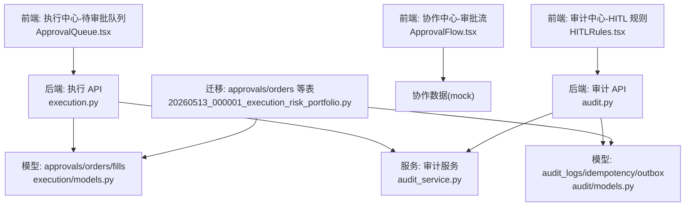
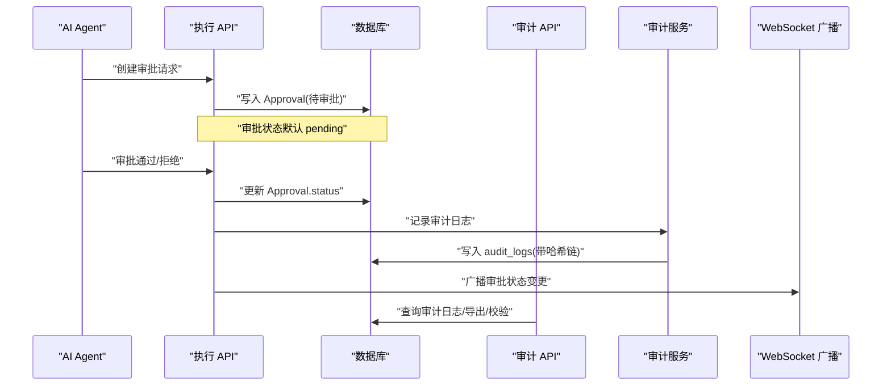
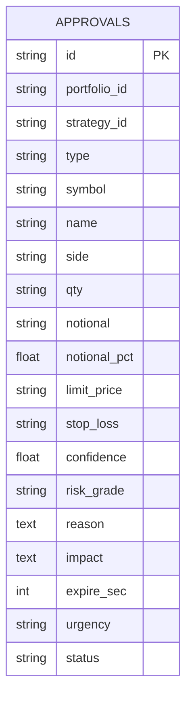
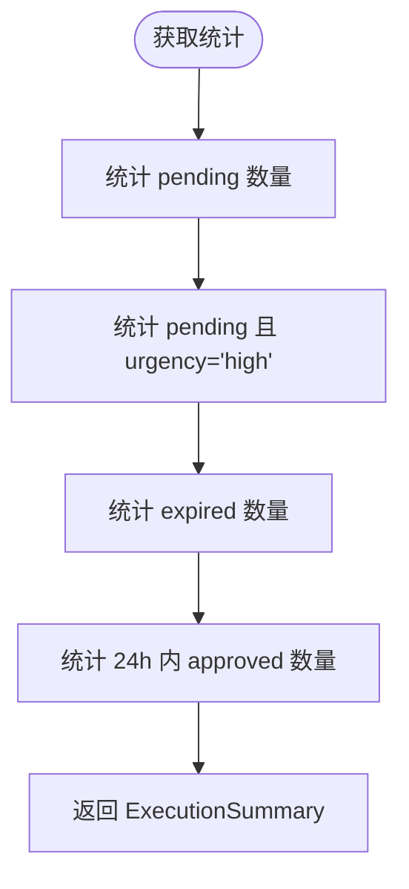
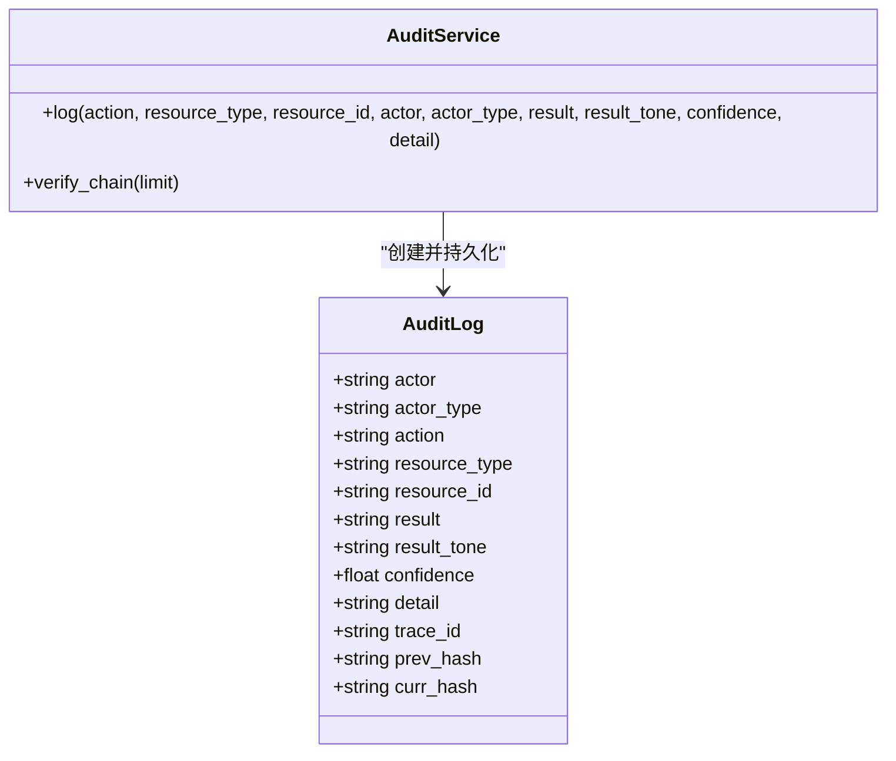
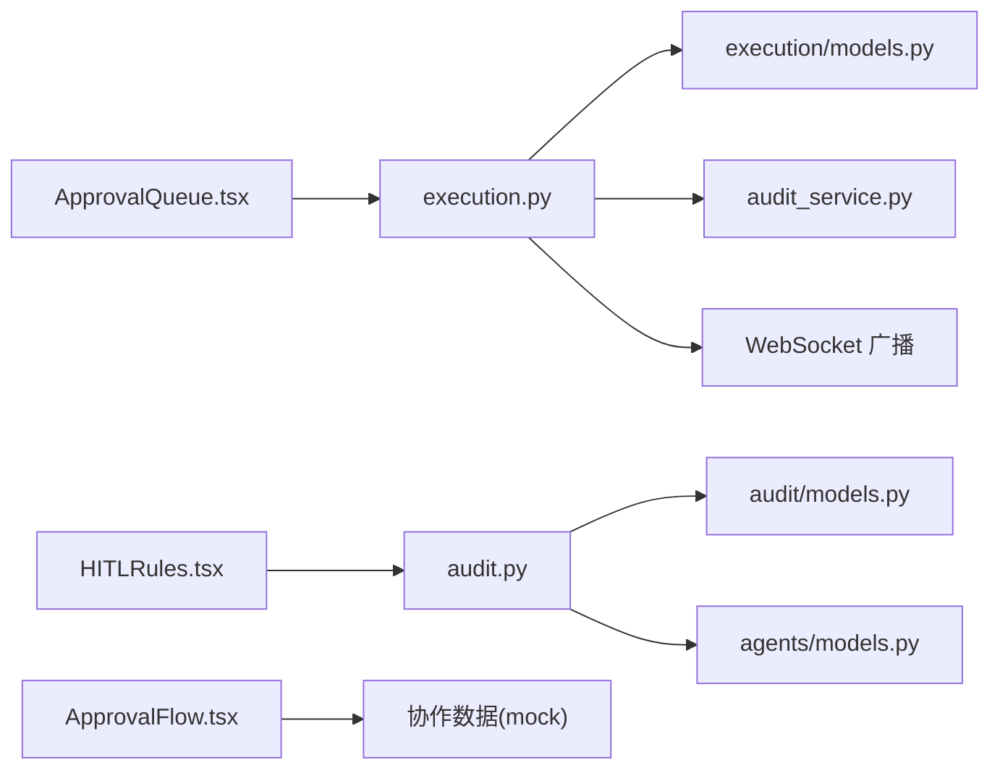

# 审批流程

<cite>
**本文引用的文件**
- [backend/app/domains/execution/models.py](file://backend/app/domains/execution/models.py)
- [backend/app/domains/execution/schemas.py](file://backend/app/domains/execution/schemas.py)
- [backend/app/api/v1/execution.py](file://backend/app/api/v1/execution.py)
- [backend/app/services/audit_service.py](file://backend/app/services/audit_service.py)
- [backend/app/domains/audit/models.py](file://backend/app/domains/audit/models.py)
- [backend/app/domains/audit/schemas.py](file://backend/app/domains/audit/schemas.py)
- [backend/app/api/v1/audit.py](file://backend/app/api/v1/audit.py)
- [backend/app/domains/agents/models.py](file://backend/app/domains/agents/models.py)
- [backend/app/db/migrations/versions/20260513_000001_execution_risk_portfolio.py](file://backend/app/db/migrations/versions/20260513_000001_execution_risk_portfolio.py)
- [doc/03-核心模块设计.md](file://doc/03-核心模块设计.md)
- [frontend/src/screens/Execution/ApprovalQueue.tsx](file://frontend/src/screens/Execution/ApprovalQueue.tsx)
- [frontend/src/screens/Audit/HITLRules.tsx](file://frontend/src/screens/Audit/HITLRules.tsx)
- [frontend/src/screens/Audit/AuditHeader.tsx](file://frontend/src/screens/Audit/AuditHeader.tsx)
- [frontend/src/screens/Collaboration/ApprovalFlow.tsx](file://frontend/src/screens/Collaboration/ApprovalFlow.tsx)
- [backend/tests/api/test_screens.py](file://backend/tests/api/test_screens.py)
</cite>

## 目录
1. [简介](#简介)
2. [项目结构](#项目结构)
3. [核心组件](#核心组件)
4. [架构总览](#架构总览)
5. [详细组件分析](#详细组件分析)
6. [依赖关系分析](#依赖关系分析)
7. [性能考量](#性能考量)
8. [故障排查指南](#故障排查指南)
9. [结论](#结论)
10. [附录](#附录)

## 简介
本文件面向交易审批流程，系统性阐述审批请求的生成机制、审批人分配策略、审批状态管理（待审批、已批准、已拒绝、已过期）、紧急程度分级，以及审批规则配置、多级审批流程、审批时效控制、审批历史追踪、审批数据模型设计、审批动作记录、审批通知机制与审批统计分析。同时提供配置方法与常见问题解决方案，帮助研发与运营人员快速理解与落地。

## 项目结构
审批流程由“前端展示层 + 后端 API 层 + 数据模型层 + 审计服务层”构成：
- 前端：执行中心的“待审批队列”、审计中心的“HITL 规则”与“审计概览”、协作中心的“审批流”等界面组件。
- 后端：执行 API 提供审批列表、审批操作；审计 API 提供审计概览、导出、校验等能力；审计服务负责不可篡改日志链。
- 数据模型：审批、订单、成交、执行指标、预交易检查、Agent 追踪等。
- 审计：审计日志表、幂等键、事件出站，支持哈希链完整性校验。

图表来源
- [frontend/src/screens/Execution/ApprovalQueue.tsx:1-138](file://frontend/src/screens/Execution/ApprovalQueue.tsx#L1-L138)
- [frontend/src/screens/Audit/HITLRules.tsx:1-37](file://frontend/src/screens/Audit/HITLRules.tsx#L1-L37)
- [frontend/src/screens/Collaboration/ApprovalFlow.tsx:1-41](file://frontend/src/screens/Collaboration/ApprovalFlow.tsx#L1-L41)
- [backend/app/api/v1/execution.py:1-281](file://backend/app/api/v1/execution.py#L1-L281)
- [backend/app/api/v1/audit.py:1-258](file://backend/app/api/v1/audit.py#L1-L258)
- [backend/app/domains/execution/models.py:1-103](file://backend/app/domains/execution/models.py#L1-L103)
- [backend/app/domains/audit/models.py:1-51](file://backend/app/domains/audit/models.py#L1-L51)
- [backend/app/services/audit_service.py:1-109](file://backend/app/services/audit_service.py#L1-L109)
- [backend/app/db/migrations/versions/20260513_000001_execution_risk_portfolio.py:34-126](file://backend/app/db/migrations/versions/20260513_000001_execution_risk_portfolio.py#L34-L126)

章节来源
- [backend/app/api/v1/execution.py:188-202](file://backend/app/api/v1/execution.py#L188-L202)
- [backend/app/api/v1/audit.py:153-168](file://backend/app/api/v1/audit.py#L153-L168)
- [backend/app/domains/execution/models.py:9-32](file://backend/app/domains/execution/models.py#L9-L32)
- [backend/app/domains/audit/models.py:9-27](file://backend/app/domains/audit/models.py#L9-L27)

## 核心组件
- 审批数据模型（Approval）：承载交易审批请求的关键字段，包括类型、方向、数量、名义金额、限价、止损、置信度、风控等级、原因、影响、过期秒数、紧急程度、状态等。
- 执行 API：提供审批概览、审批列表、审批通过/拒绝接口，并在审批动作时写入审计日志与广播事件。
- 审计服务（AuditService）：提供不可篡改的审计日志链，支持哈希链校验。
- 审计 API：提供审计概览、Actor 统计、工具注册表、HITL 规则、日志导出、链完整性校验等。
- 工具注册表（ToolRegistry）：用于标注工具风险级别，支撑审批规则配置。
- 前端组件：审批队列卡片、HITL 规则展示、审计概览 KPI、协作审批流。

章节来源
- [backend/app/domains/execution/models.py:9-32](file://backend/app/domains/execution/models.py#L9-L32)
- [backend/app/api/v1/execution.py:223-281](file://backend/app/api/v1/execution.py#L223-L281)
- [backend/app/services/audit_service.py:32-109](file://backend/app/services/audit_service.py#L32-L109)
- [backend/app/api/v1/audit.py:153-258](file://backend/app/api/v1/audit.py#L153-L258)
- [backend/app/domains/agents/models.py:51-62](file://backend/app/domains/agents/models.py#L51-L62)
- [frontend/src/screens/Execution/ApprovalQueue.tsx:1-138](file://frontend/src/screens/Execution/ApprovalQueue.tsx#L1-L138)
- [frontend/src/screens/Audit/HITLRules.tsx:1-37](file://frontend/src/screens/Audit/HITLRules.tsx#L1-L37)
- [frontend/src/screens/Audit/AuditHeader.tsx:1-34](file://frontend/src/screens/Audit/AuditHeader.tsx#L1-L34)
- [frontend/src/screens/Collaboration/ApprovalFlow.tsx:1-41](file://frontend/src/screens/Collaboration/ApprovalFlow.tsx#L1-L41)

## 架构总览
审批流程围绕“AI 生成订单草案 → 自动风控检查 → 是否需要人工 → 推送审批中心 → 人工确认 → 执行/拒绝”的闭环展开。执行 API 负责审批状态流转与审计记录，审计 API 负责合规与可追溯性。

图表来源
- [doc/03-核心模块设计.md:533-552](file://doc/03-核心模块设计.md#L533-L552)
- [backend/app/api/v1/execution.py:223-281](file://backend/app/api/v1/execution.py#L223-L281)
- [backend/app/services/audit_service.py:38-82](file://backend/app/services/audit_service.py#L38-L82)
- [backend/app/api/v1/audit.py:198-213](file://backend/app/api/v1/audit.py#L198-L213)

## 详细组件分析

### 审批数据模型与状态管理
- 关键字段
  - 类型（type）：live/paper/reduce/add/rotate/hedge/pause
  - 方向（side）：BUY/SELL/PAUSE
  - 数量与名义金额（qty/notional）、限价/止损（limit_price/stop_loss）
  - 置信度（confidence）、风控等级（risk_grade）
  - 过期秒数（expire_sec，默认 300）、紧急程度（urgency：high/medium/low）
  - 状态（status）：pending/approved/rejected/expired
- 状态流转
  - 待审批 → 审批通过（approved）或审批拒绝（rejected）
  - 待审批 → 超时（expired）
- 索引与约束
  - portfolio_id、strategy_id、status 等建立索引，便于查询与统计

图表来源
- [backend/app/domains/execution/models.py:9-32](file://backend/app/domains/execution/models.py#L9-L32)
- [backend/app/db/migrations/versions/20260513_000001_execution_risk_portfolio.py:34-58](file://backend/app/db/migrations/versions/20260513_000001_execution_risk_portfolio.py#L34-L58)

章节来源
- [backend/app/domains/execution/models.py:9-32](file://backend/app/domains/execution/models.py#L9-L32)
- [backend/app/domains/execution/schemas.py:15-35](file://backend/app/domains/execution/schemas.py#L15-L35)
- [backend/app/db/migrations/versions/20260513_000001_execution_risk_portfolio.py:34-58](file://backend/app/db/migrations/versions/20260513_000001_execution_risk_portfolio.py#L34-L58)

### 审批请求生成机制
- 触发条件
  - 实盘交易、模拟盘切换到实盘、超额大额等场景触发审批请求。
- 字段来源
  - 由 AI Agent 生成订单草案后，经风控检查，若命中需要人工的规则，则创建审批请求。
- 过期与时效
  - expire_sec 控制审批时限，默认 300 秒；前端倒计时展示，临近过期标红提示。

章节来源
- [doc/03-核心模块设计.md:533-552](file://doc/03-核心模块设计.md#L533-L552)
- [backend/app/domains/execution/models.py:29-31](file://backend/app/domains/execution/models.py#L29-L31)
- [frontend/src/screens/Execution/ApprovalQueue.tsx:29-34](file://frontend/src/screens/Execution/ApprovalQueue.tsx#L29-L34)

### 审批人分配策略
- 当前实现
  - 执行 API 的审批通过/拒绝接口由人类操作者调用，未见自动分配审批人的逻辑。
- 建议
  - 可基于工具风险级别（ToolRegistry.level）与账户限额、策略阈值进行自动路由。
  - 可引入“审批池”与“优先级队列”，按 urgency 与 risk_grade 分配。

章节来源
- [backend/app/api/v1/execution.py:223-281](file://backend/app/api/v1/execution.py#L223-L281)
- [backend/app/domains/agents/models.py:51-62](file://backend/app/domains/agents/models.py#L51-L62)

### 审批状态管理与统计
- 状态枚举
  - pending（待审批）、approved（已批准）、rejected（已拒绝）、expired（已过期）
- 统计指标
  - 待审批总数、紧急待审批数、阻塞（过期）数、24 小时已批准数等。

图表来源
- [backend/app/api/v1/execution.py:158-185](file://backend/app/api/v1/execution.py#L158-L185)

章节来源
- [backend/app/api/v1/execution.py:158-185](file://backend/app/api/v1/execution.py#L158-L185)
- [backend/app/domains/execution/schemas.py:6-12](file://backend/app/domains/execution/schemas.py#L6-L12)

### 紧急程度分级与前端展示
- 紧急程度
  - high/medium/low，分别映射为视觉色带（红/黄/绿），影响卡片边框动画与倒计时样式。
- 前端展示
  - 审批队列卡片包含类型标签、方向、数量、名义金额、限价、止损、置信度、风控等级、影响估算、倒计时等。

章节来源
- [backend/app/domains/execution/models.py:29-31](file://backend/app/domains/execution/models.py#L29-L31)
- [frontend/src/screens/Execution/ApprovalQueue.tsx:68-75](file://frontend/src/screens/Execution/ApprovalQueue.tsx#L68-L75)

### 审批规则配置与多级审批
- 规则来源
  - 审计 API 提供 HITL 规则集合，包含“实盘订单审批”“策略上线审批”“大额交易提醒”等。
- 多级审批
  - 可扩展为“阶段化审批流”，协作中心的审批流组件可用于展示阶段性任务与负责人。
- 风险工具联动
  - ToolRegistry.level 与 allowed_agents 可作为审批门槛与授权依据。

章节来源
- [backend/app/api/v1/audit.py:29-36](file://backend/app/api/v1/audit.py#L29-L36)
- [frontend/src/screens/Audit/HITLRules.tsx:1-37](file://frontend/src/screens/Audit/HITLRules.tsx#L1-L37)
- [frontend/src/screens/Collaboration/ApprovalFlow.tsx:1-41](file://frontend/src/screens/Collaboration/ApprovalFlow.tsx#L1-L41)
- [backend/app/domains/agents/models.py:51-62](file://backend/app/domains/agents/models.py#L51-L62)

### 审批时效控制与过期处理
- 时效控制
  - expire_sec 字段控制审批时限；前端倒计时小于 120 秒标红提示。
- 过期处理
  - 系统可通过定时任务将超时的 pending 转为 expired；前端显示“已过期”。

章节来源
- [backend/app/domains/execution/models.py:29-31](file://backend/app/domains/execution/models.py#L29-L31)
- [frontend/src/screens/Execution/ApprovalQueue.tsx:29-34](file://frontend/src/screens/Execution/ApprovalQueue.tsx#L29-L34)
- [backend/app/api/v1/execution.py:158-185](file://backend/app/api/v1/execution.py#L158-L185)

### 审批历史追踪与审计日志
- 审计日志
  - 审计服务在审批通过/拒绝时写入 audit_logs，包含 actor、action、resource_type/resource_id、result、trace_id、prev_hash/curr_hash 等。
- 不可篡改链
  - 通过 prev_hash/curr_hash 构建 SHA-256 哈希链，支持 verify_chain 校验。
- 导出与完整性
  - 支持 CSV 导出与链完整性校验接口。

图表来源
- [backend/app/services/audit_service.py:32-109](file://backend/app/services/audit_service.py#L32-L109)
- [backend/app/domains/audit/models.py:9-27](file://backend/app/domains/audit/models.py#L9-L27)

章节来源
- [backend/app/api/v1/execution.py:235-250](file://backend/app/api/v1/execution.py#L235-L250)
- [backend/app/api/v1/execution.py:265-280](file://backend/app/api/v1/execution.py#L265-L280)
- [backend/app/services/audit_service.py:38-109](file://backend/app/services/audit_service.py#L38-L109)
- [backend/app/api/v1/audit.py:198-213](file://backend/app/api/v1/audit.py#L198-L213)

### 审批动作记录与通知机制
- 审批动作记录
  - 审批通过/拒绝均写入审计日志，包含资源类型与资源 ID、结果与置信度等。
- 通知机制
  - 执行 API 在审批后通过 WebSocket 广播“approval_update”事件，前端订阅后刷新状态。

章节来源
- [backend/app/api/v1/execution.py:245-249](file://backend/app/api/v1/execution.py#L245-L249)
- [backend/app/api/v1/execution.py:275-279](file://backend/app/api/v1/execution.py#L275-L279)

### 审计概览与统计分析
- 概览内容
  - KPI（总事件、Agent 操作、人工审批、异常事件、哈希链完整率）
  - 最近审计日志、Actor 统计、工具注册表、HITL 规则
- 统计分析
  - 支持按 actor_type/action 过滤分页查询、导出 CSV、链完整性校验。

章节来源
- [backend/app/api/v1/audit.py:153-168](file://backend/app/api/v1/audit.py#L153-L168)
- [backend/app/api/v1/audit.py:171-186](file://backend/app/api/v1/audit.py#L171-L186)
- [backend/app/api/v1/audit.py:215-245](file://backend/app/api/v1/audit.py#L215-L245)
- [backend/app/api/v1/audit.py:198-213](file://backend/app/api/v1/audit.py#L198-L213)

## 依赖关系分析
- 执行 API 依赖
  - 数据模型：Approval、Order、Fill、ExecutionMetric、PreTradeCheck、AgentTrace
  - 审计服务：写入不可篡改审计日志
  - WebSocket：广播审批状态变更
- 审计 API 依赖
  - 审计模型：AuditLog、IdempotencyKey、EventOutbox
  - 工具注册表：ToolRegistry.level 与 allowed_agents
- 前端依赖
  - 执行中心：ApprovalQueue 展示审批卡片与倒计时
  - 审计中心：HITLRules 展示规则与状态
  - 协作中心：ApprovalFlow 展示多阶段审批流

图表来源
- [backend/app/api/v1/execution.py:1-281](file://backend/app/api/v1/execution.py#L1-L281)
- [backend/app/domains/execution/models.py:1-103](file://backend/app/domains/execution/models.py#L1-L103)
- [backend/app/services/audit_service.py:1-109](file://backend/app/services/audit_service.py#L1-L109)
- [backend/app/api/v1/audit.py:1-258](file://backend/app/api/v1/audit.py#L1-L258)
- [backend/app/domains/audit/models.py:1-51](file://backend/app/domains/audit/models.py#L1-L51)
- [backend/app/domains/agents/models.py:51-62](file://backend/app/domains/agents/models.py#L51-L62)
- [frontend/src/screens/Execution/ApprovalQueue.tsx:1-138](file://frontend/src/screens/Execution/ApprovalQueue.tsx#L1-L138)
- [frontend/src/screens/Audit/HITLRules.tsx:1-37](file://frontend/src/screens/Audit/HITLRules.tsx#L1-L37)
- [frontend/src/screens/Collaboration/ApprovalFlow.tsx:1-41](file://frontend/src/screens/Collaboration/ApprovalFlow.tsx#L1-L41)

章节来源
- [backend/app/api/v1/execution.py:1-281](file://backend/app/api/v1/execution.py#L1-L281)
- [backend/app/api/v1/audit.py:1-258](file://backend/app/api/v1/audit.py#L1-L258)
- [backend/app/domains/execution/models.py:1-103](file://backend/app/domains/execution/models.py#L1-L103)
- [backend/app/domains/audit/models.py:1-51](file://backend/app/domains/audit/models.py#L1-L51)
- [backend/app/domains/agents/models.py:51-62](file://backend/app/domains/agents/models.py#L51-L62)

## 性能考量
- 查询优化
  - 对 approvals/status、approvals/portfolio_id、approvals/strategy_id 等建立索引，提升筛选与排序效率。
- 审计链校验
  - verify_chain 仅对最近 N 条记录校验，避免全量扫描。
- 广播与导出
  - 审批状态广播采用轻量 JSON，导出 CSV 使用流式写入，避免内存峰值。

章节来源
- [backend/app/db/migrations/versions/20260513_000001_execution_risk_portfolio.py:56-58](file://backend/app/db/migrations/versions/20260513_000001_execution_risk_portfolio.py#L56-L58)
- [backend/app/services/audit_service.py:83-109](file://backend/app/services/audit_service.py#L83-L109)
- [backend/app/api/v1/audit.py:215-245](file://backend/app/api/v1/audit.py#L215-L245)

## 故障排查指南
- 审批无法通过/拒绝
  - 确认审批状态为 pending；若非 pending，会返回冲突错误。
- 审批过期
  - 检查 expire_sec 设置与前端倒计时；过期后状态应为 expired。
- 审计链异常
  - 使用 verify_chain 接口校验最近 N 条记录的哈希链完整性；如 broken，返回 brokenEntryId。
- 审批通知未到达
  - 检查 WebSocket 广播 topic“execution-events”是否被前端订阅；确认网络与连接状态。
- 测试验证
  - 可使用测试用例 Approve Trade 验证审批通过接口行为。

章节来源
- [backend/app/api/v1/execution.py:226-231](file://backend/app/api/v1/execution.py#L226-L231)
- [backend/app/api/v1/execution.py:256-261](file://backend/app/api/v1/execution.py#L256-L261)
- [backend/app/api/v1/audit.py:198-213](file://backend/app/api/v1/audit.py#L198-L213)
- [backend/tests/api/test_screens.py:201-204](file://backend/tests/api/test_screens.py#L201-L204)

## 结论
该审批流程以“AI 生成 + 自动风控 + 人工审批 + 不可篡改审计”为核心，结合前端可视化与 WebSocket 实时通知，形成闭环可控的交易审批体系。建议后续增强审批人自动分配、多级审批流与风险工具联动，进一步提升自动化与合规水平。

## 附录

### 审批流程配置方法
- 规则配置
  - 通过审计 API 的 HITL 规则接口获取与展示规则；业务侧可在规则层面定义“是否需要审批/复核/自动”。
- 工具风险
  - 在 ToolRegistry 中设置 level 与 allowed_agents，作为审批门槛与授权依据。
- 审批时效
  - 在创建审批请求时设置 expire_sec；前端倒计时与过期处理逻辑配合使用。

章节来源
- [backend/app/api/v1/audit.py:254-258](file://backend/app/api/v1/audit.py#L254-L258)
- [backend/app/domains/agents/models.py:51-62](file://backend/app/domains/agents/models.py#L51-L62)
- [backend/app/domains/execution/models.py:29-31](file://backend/app/domains/execution/models.py#L29-L31)