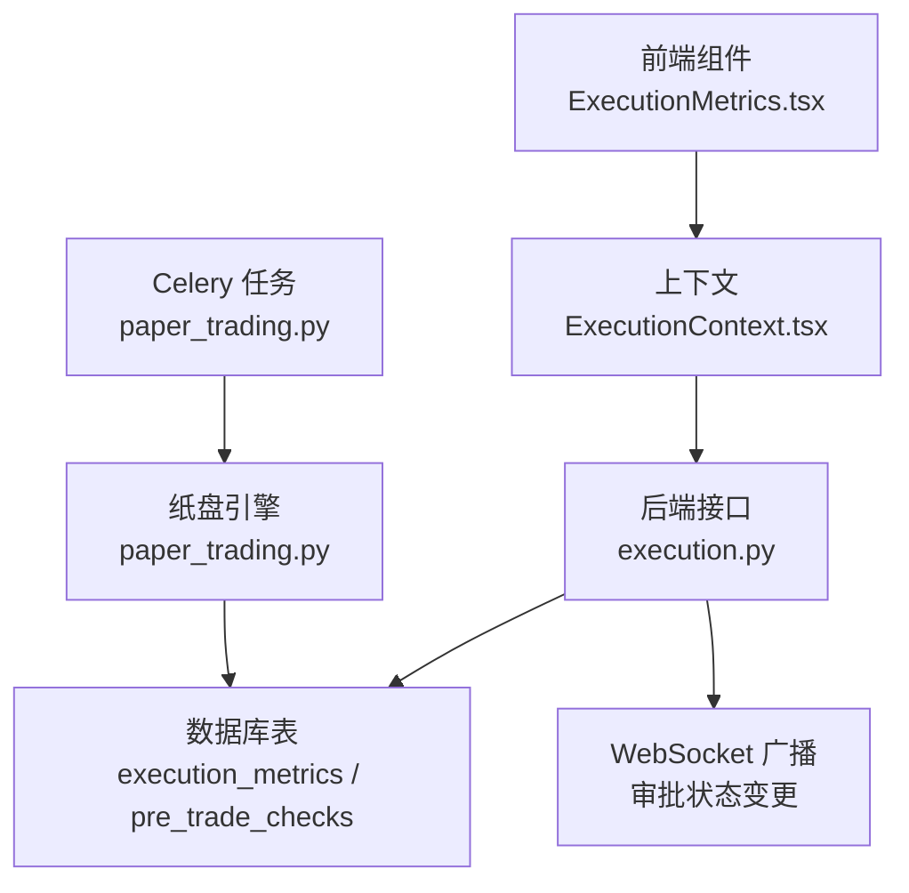
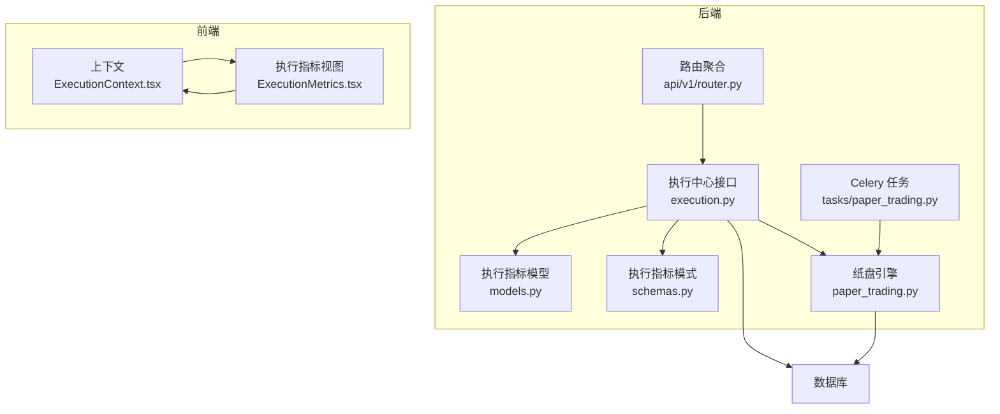
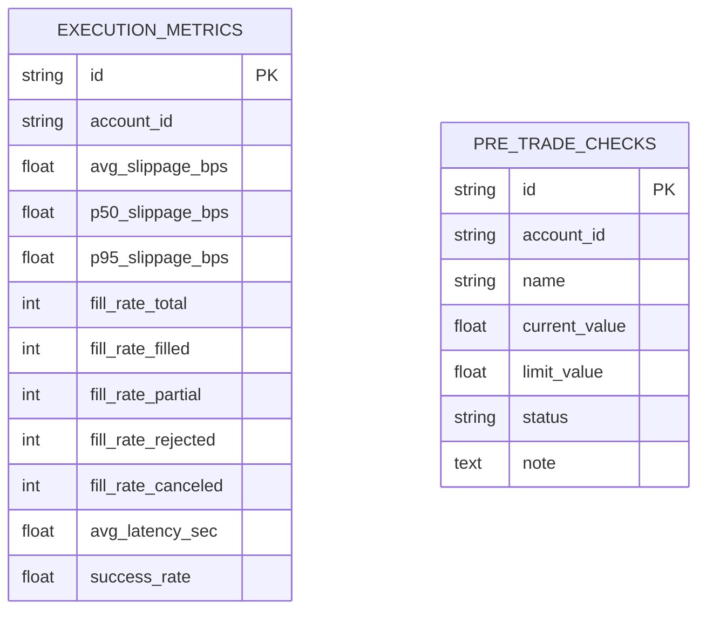
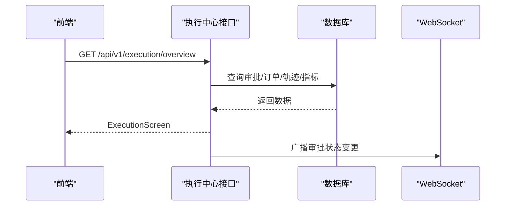
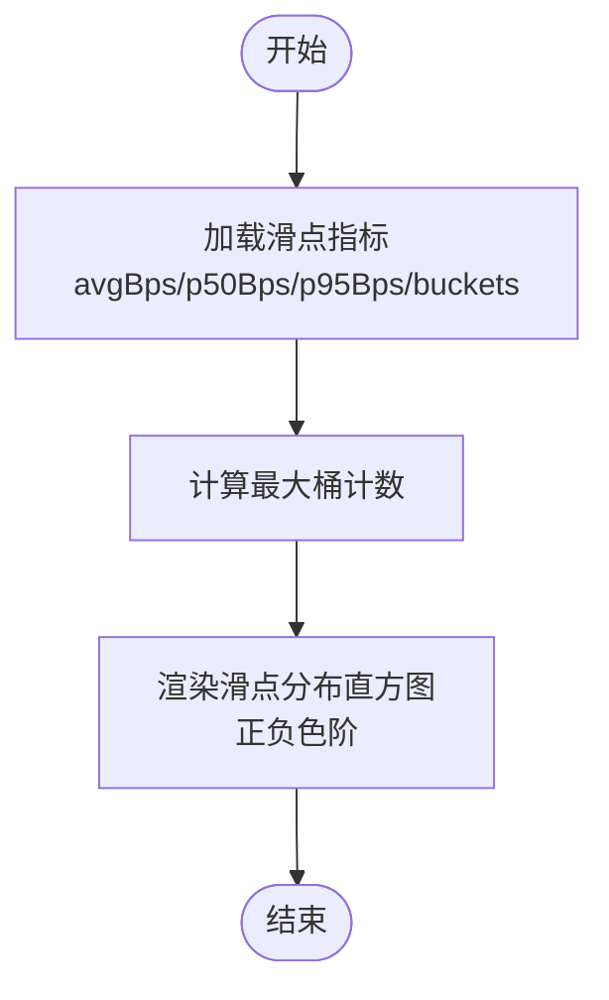
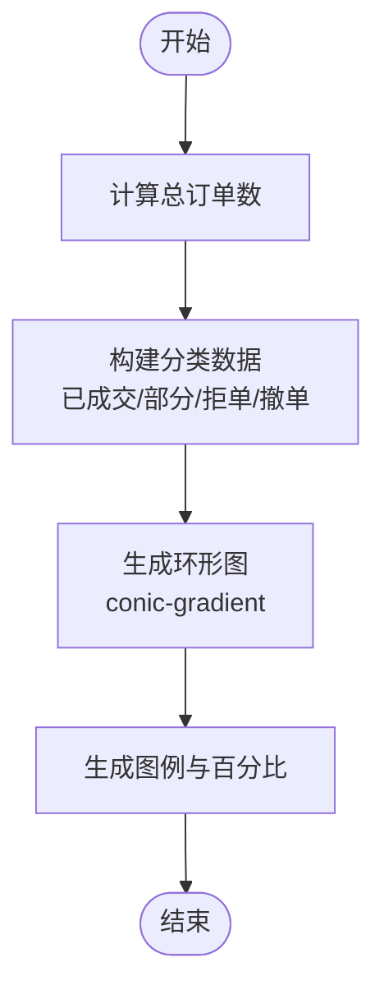
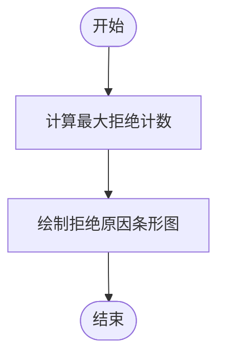
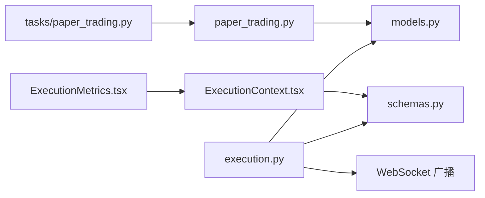

# 执行指标

<cite>
**本文引用的文件**
- [backend/app/api/v1/execution.py](file://backend/app/api/v1/execution.py)
- [backend/app/domains/execution/models.py](file://backend/app/domains/execution/models.py)
- [backend/app/domains/execution/schemas.py](file://backend/app/domains/execution/schemas.py)
- [frontend/src/screens/Execution/ExecutionMetrics.tsx](file://frontend/src/screens/Execution/ExecutionMetrics.tsx)
- [frontend/src/contexts/ExecutionContext.tsx](file://frontend/src/contexts/ExecutionContext.tsx)
- [backend/app/db/migrations/versions/20260513_000001_execution_risk_portfolio.py](file://backend/app/db/migrations/versions/20260513_000001_execution_risk_portfolio.py)
- [backend/app/services/paper_trading.py](file://backend/app/services/paper_trading.py)
- [backend/app/tasks/paper_trading.py](file://backend/app/tasks/paper_trading.py)
- [frontend/src/data/mock_crypto.ts](file://frontend/src/data/mock_crypto.ts)
- [backend/app/api/v1/router.py](file://backend/app/api/v1/router.py)
</cite>

## 目录
1. [简介](#简介)
2. [项目结构](#项目结构)
3. [核心组件](#核心组件)
4. [架构总览](#架构总览)
5. [详细组件分析](#详细组件分析)
6. [依赖分析](#依赖分析)
7. [性能考虑](#性能考虑)
8. [故障排查指南](#故障排查指南)
9. [结论](#结论)
10. [附录](#附录)

## 简介
本文件面向交易执行指标系统，围绕滑点指标（平均滑点、中位数滑点、百分位滑点）、成交率统计、拒绝原因分析与执行效率评估进行系统化说明。内容覆盖指标数据模型设计、实时指标计算、历史指标存储与可视化展示，并提供指标监控方法与执行质量改进建议。

## 项目结构
执行指标系统由后端 API、领域模型与前端组件构成，核心交互路径如下：
- 后端提供执行中心接口，聚合审批、订单簿、代理轨迹与执行指标。
- 前端通过上下文消费执行数据，渲染滑点分布、成交率与拒单分类等可视化图表。
- 数据库存储执行指标快照与预交易检查结果，支持历史回溯与趋势分析。

**图表来源**
- [frontend/src/screens/Execution/ExecutionMetrics.tsx:1-134](file://frontend/src/screens/Execution/ExecutionMetrics.tsx#L1-L134)
- [frontend/src/contexts/ExecutionContext.tsx:1-13](file://frontend/src/contexts/ExecutionContext.tsx#L1-L13)
- [backend/app/api/v1/execution.py:188-202](file://backend/app/api/v1/execution.py#L188-L202)
- [backend/app/domains/execution/models.py:62-91](file://backend/app/domains/execution/models.py#L62-L91)
- [backend/app/services/paper_trading.py:76-134](file://backend/app/services/paper_trading.py#L76-L134)
- [backend/app/tasks/paper_trading.py:19-73](file://backend/app/tasks/paper_trading.py#L19-L73)

**章节来源**
- [backend/app/api/v1/execution.py:188-202](file://backend/app/api/v1/execution.py#L188-L202)
- [frontend/src/screens/Execution/ExecutionMetrics.tsx:1-134](file://frontend/src/screens/Execution/ExecutionMetrics.tsx#L1-L134)
- [frontend/src/contexts/ExecutionContext.tsx:1-13](file://frontend/src/contexts/ExecutionContext.tsx#L1-L13)
- [backend/app/domains/execution/models.py:62-91](file://backend/app/domains/execution/models.py#L62-L91)
- [backend/app/services/paper_trading.py:76-134](file://backend/app/services/paper_trading.py#L76-L134)
- [backend/app/tasks/paper_trading.py:19-73](file://backend/app/tasks/paper_trading.py#L19-L73)

## 核心组件
- 后端接口层：提供执行中心概览接口，返回汇总信息、审批列表、订单簿、预交易检查与执行指标。
- 领域模型与存储：定义执行指标快照表与预交易检查表，支持按账户维度归集与查询。
- 前端展示层：基于上下文数据渲染滑点分布直方图、成交率环形图与拒单分类条形图。
- 纸盘引擎与任务：驱动每日执行流程，生成填充记录与风险检查结果，供指标计算与审计使用。

**章节来源**
- [backend/app/api/v1/execution.py:188-202](file://backend/app/api/v1/execution.py#L188-L202)
- [backend/app/domains/execution/models.py:62-91](file://backend/app/domains/execution/models.py#L62-L91)
- [frontend/src/screens/Execution/ExecutionMetrics.tsx:1-134](file://frontend/src/screens/Execution/ExecutionMetrics.tsx#L1-L134)
- [backend/app/services/paper_trading.py:76-134](file://backend/app/services/paper_trading.py#L76-L134)
- [backend/app/tasks/paper_trading.py:19-73](file://backend/app/tasks/paper_trading.py#L19-L73)

## 架构总览
执行指标系统采用“接口聚合 + 领域模型 + 前端可视化”的分层架构：
- 接口聚合：统一挂载在执行中心路由下，提供概览与审批管理能力。
- 领域模型：以 SQLAlchemy 定义指标快照与预交易检查实体，支持索引与查询优化。
- 前端组件：消费上下文数据，动态生成可视化图表，支持交互式探索。

**图表来源**
- [backend/app/api/v1/router.py:23-39](file://backend/app/api/v1/router.py#L23-L39)
- [backend/app/api/v1/execution.py:188-202](file://backend/app/api/v1/execution.py#L188-L202)
- [backend/app/domains/execution/models.py:62-91](file://backend/app/domains/execution/models.py#L62-L91)
- [backend/app/domains/execution/schemas.py:85-107](file://backend/app/domains/execution/schemas.py#L85-L107)
- [backend/app/services/paper_trading.py:76-134](file://backend/app/services/paper_trading.py#L76-L134)
- [backend/app/tasks/paper_trading.py:19-73](file://backend/app/tasks/paper_trading.py#L19-L73)
- [frontend/src/contexts/ExecutionContext.tsx:1-13](file://frontend/src/contexts/ExecutionContext.tsx#L1-L13)
- [frontend/src/screens/Execution/ExecutionMetrics.tsx:1-134](file://frontend/src/screens/Execution/ExecutionMetrics.tsx#L1-L134)

## 详细组件分析

### 指标数据模型设计
- 执行指标快照表包含账户维度、滑点统计（平均、中位、95 分位）、成交率统计（总数、已成交、部分、拒单、撤单）、平均延迟与成功率等字段。
- 预交易检查表记录规则名称、当前值、限额、状态与备注，用于风控拦截分析。

**图表来源**
- [backend/app/db/migrations/versions/20260513_000001_execution_risk_portfolio.py:88-102](file://backend/app/db/migrations/versions/20260513_000001_execution_risk_portfolio.py#L88-L102)
- [backend/app/domains/execution/models.py:62-91](file://backend/app/domains/execution/models.py#L62-L91)

**章节来源**
- [backend/app/db/migrations/versions/20260513_000001_execution_risk_portfolio.py:88-102](file://backend/app/db/migrations/versions/20260513_000001_execution_risk_portfolio.py#L88-L102)
- [backend/app/domains/execution/models.py:62-91](file://backend/app/domains/execution/models.py#L62-L91)

### 实时指标计算与接口聚合
- 后端接口提供执行中心概览，聚合汇总统计、审批列表、订单簿、预交易检查与执行指标。
- 指标数据目前以静态常量形式返回，便于演示；实际生产中应从数据库或运行时计算结果中读取。

**图表来源**
- [backend/app/api/v1/execution.py:188-202](file://backend/app/api/v1/execution.py#L188-L202)
- [backend/app/api/v1/execution.py:245-249](file://backend/app/api/v1/execution.py#L245-L249)

**章节来源**
- [backend/app/api/v1/execution.py:188-202](file://backend/app/api/v1/execution.py#L188-L202)
- [backend/app/api/v1/execution.py:223-250](file://backend/app/api/v1/execution.py#L223-L250)

### 滑点指标计算与可视化
- 滑点指标包括平均滑点（bp）、中位数滑点（bp）与 95 分位滑点（bp），并提供滑点桶分布统计。
- 前端根据最大桶计数动态缩放柱状高度，正负滑点分别用不同样式标识；百分位数值按颜色强调。

**图表来源**
- [frontend/src/screens/Execution/ExecutionMetrics.tsx:6-78](file://frontend/src/screens/Execution/ExecutionMetrics.tsx#L6-L78)
- [backend/app/domains/execution/schemas.py:64-68](file://backend/app/domains/execution/schemas.py#L64-L68)

**章节来源**
- [frontend/src/screens/Execution/ExecutionMetrics.tsx:6-78](file://frontend/src/screens/Execution/ExecutionMetrics.tsx#L6-L78)
- [backend/app/domains/execution/schemas.py:64-68](file://backend/app/domains/execution/schemas.py#L64-L68)

### 成交率统计与可视化
- 成交率指标包含总数、已成交、部分成交、拒单与撤单数量；前端以环形图展示占比，支持堆叠色带与中心百分比标注。
- 计算总单数与各分类占比，生成 conic-gradient 色带。

**图表来源**
- [frontend/src/screens/Execution/ExecutionMetrics.tsx:10-27](file://frontend/src/screens/Execution/ExecutionMetrics.tsx#L10-L27)
- [frontend/src/screens/Execution/ExecutionMetrics.tsx:87-104](file://frontend/src/screens/Execution/ExecutionMetrics.tsx#L87-L104)
- [backend/app/domains/execution/schemas.py:71-77](file://backend/app/domains/execution/schemas.py#L71-L77)

**章节来源**
- [frontend/src/screens/Execution/ExecutionMetrics.tsx:10-27](file://frontend/src/screens/Execution/ExecutionMetrics.tsx#L10-L27)
- [frontend/src/screens/Execution/ExecutionMetrics.tsx:87-104](file://frontend/src/screens/Execution/ExecutionMetrics.tsx#L87-L104)
- [backend/app/domains/execution/schemas.py:71-77](file://backend/app/domains/execution/schemas.py#L71-L77)

### 拒绝原因分析与可视化
- 拒绝原因列表包含原因、计数与语义化色调；前端按最大计数缩放条形长度，形成对比直观的分类统计。
- 支持按原因类型快速定位高频拒单场景。

**图表来源**
- [frontend/src/screens/Execution/ExecutionMetrics.tsx:29-129](file://frontend/src/screens/Execution/ExecutionMetrics.tsx#L29-L129)
- [backend/app/domains/execution/schemas.py:79-83](file://backend/app/domains/execution/schemas.py#L79-L83)

**章节来源**
- [frontend/src/screens/Execution/ExecutionMetrics.tsx:29-129](file://frontend/src/screens/Execution/ExecutionMetrics.tsx#L29-L129)
- [backend/app/domains/execution/schemas.py:79-83](file://backend/app/domains/execution/schemas.py#L79-L83)

### 执行效率评估
- 汇总统计包含待处理、紧急、阻塞与 24 小时内批准数，以及平均延迟与成功率，用于衡量执行效率与质量。
- 平均延迟与成功率可作为关键指标纳入看板与告警体系。

**章节来源**
- [backend/app/api/v1/execution.py:158-185](file://backend/app/api/v1/execution.py#L158-L185)
- [backend/app/domains/execution/schemas.py:6-12](file://backend/app/domains/execution/schemas.py#L6-L12)

### 历史指标存储与回溯
- 执行指标快照表支持按账户维度检索与聚合，迁移脚本定义了字段与索引，便于历史回溯与趋势分析。
- 可扩展为定时任务或事件驱动写入，记录每日/每小时的指标快照。

**章节来源**
- [backend/app/db/migrations/versions/20260513_000001_execution_risk_portfolio.py:88-102](file://backend/app/db/migrations/versions/20260513_000001_execution_risk_portfolio.py#L88-L102)
- [backend/app/domains/execution/models.py:62-78](file://backend/app/domains/execution/models.py#L62-L78)

### 指标可视化展示
- 前端组件通过上下文消费执行数据，渲染滑点分布、成交率与拒单分类三类核心指标卡片。
- 使用 CSS 色彩与布局实现清晰的视觉层次与交互反馈。

**章节来源**
- [frontend/src/screens/Execution/ExecutionMetrics.tsx:31-132](file://frontend/src/screens/Execution/ExecutionMetrics.tsx#L31-L132)
- [frontend/src/contexts/ExecutionContext.tsx:1-13](file://frontend/src/contexts/ExecutionContext.tsx#L1-L13)

## 依赖分析
- 组件耦合关系
  - 接口层依赖领域模型与模式定义，负责数据组装与对外输出。
  - 前端组件依赖上下文与模式定义，负责可视化渲染。
  - 纸盘引擎与任务为指标生成提供数据来源，间接影响指标准确性与时效性。

**图表来源**
- [backend/app/api/v1/execution.py:1-28](file://backend/app/api/v1/execution.py#L1-L28)
- [backend/app/domains/execution/models.py:1-103](file://backend/app/domains/execution/models.py#L1-L103)
- [backend/app/domains/execution/schemas.py:1-107](file://backend/app/domains/execution/schemas.py#L1-L107)
- [frontend/src/screens/Execution/ExecutionMetrics.tsx:1-134](file://frontend/src/screens/Execution/ExecutionMetrics.tsx#L1-L134)
- [frontend/src/contexts/ExecutionContext.tsx:1-13](file://frontend/src/contexts/ExecutionContext.tsx#L1-L13)
- [backend/app/services/paper_trading.py:76-134](file://backend/app/services/paper_trading.py#L76-L134)
- [backend/app/tasks/paper_trading.py:19-73](file://backend/app/tasks/paper_trading.py#L19-L73)

**章节来源**
- [backend/app/api/v1/execution.py:1-28](file://backend/app/api/v1/execution.py#L1-L28)
- [backend/app/domains/execution/models.py:1-103](file://backend/app/domains/execution/models.py#L1-L103)
- [backend/app/domains/execution/schemas.py:1-107](file://backend/app/domains/execution/schemas.py#L1-L107)
- [frontend/src/screens/Execution/ExecutionMetrics.tsx:1-134](file://frontend/src/screens/Execution/ExecutionMetrics.tsx#L1-L134)
- [frontend/src/contexts/ExecutionContext.tsx:1-13](file://frontend/src/contexts/ExecutionContext.tsx#L1-L13)
- [backend/app/services/paper_trading.py:76-134](file://backend/app/services/paper_trading.py#L76-L134)
- [backend/app/tasks/paper_trading.py:19-73](file://backend/app/tasks/paper_trading.py#L19-L73)

## 性能考虑
- 查询优化
  - 对执行指标与预交易检查表建立账户维度索引，降低高并发查询成本。
  - 控制接口返回字段范围，避免不必要的序列化开销。
- 渲染优化
  - 前端对最大计数进行缓存，减少重复计算；使用 CSS 动画与布局提升交互流畅度。
- 存储与批处理
  - 指标快照可按固定周期批量写入，避免频繁更新带来的锁竞争。
- 异步与广播
  - 审批状态变更通过 WebSocket 广播，减少轮询压力，提升实时性。

## 故障排查指南
- 指标为空或异常
  - 检查接口是否正确连接数据库，确认执行指标表是否存在且有数据。
  - 核对前端上下文是否正确注入执行数据。
- 滑点分布异常
  - 确认滑点单位与符号含义（正负代表买卖方向），检查桶区间划分是否合理。
- 成交率不一致
  - 对比总数与分类之和，排查是否存在未计入的状态（如取消）。
- 拒单原因缺失
  - 检查预交易检查表是否正常写入，核对规则名称与状态映射。
- 审批状态未更新
  - 检查 WebSocket 广播是否启用，确认审批接口调用成功。

**章节来源**
- [backend/app/api/v1/execution.py:223-250](file://backend/app/api/v1/execution.py#L223-L250)
- [backend/app/api/v1/execution.py:253-280](file://backend/app/api/v1/execution.py#L253-L280)
- [backend/app/domains/execution/models.py:80-91](file://backend/app/domains/execution/models.py#L80-L91)

## 结论
执行指标系统通过清晰的数据模型、稳定的接口聚合与直观的前端可视化，实现了对滑点、成交率、拒单原因与执行效率的全链路观测。建议在生产环境中完善实时计算与历史存储机制，结合告警策略持续优化执行质量。

## 附录
- 示例数据参考
  - 前端示例数据包含滑点分布、成交率与拒单分类，可用于界面联调与验收测试。

**章节来源**
- [frontend/src/data/mock_crypto.ts:866-893](file://frontend/src/data/mock_crypto.ts#L866-L893)