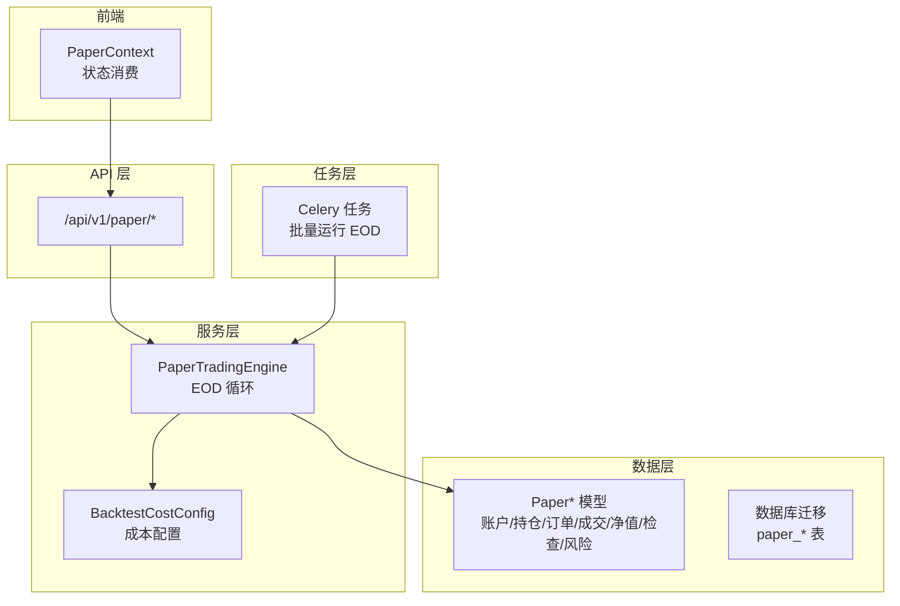
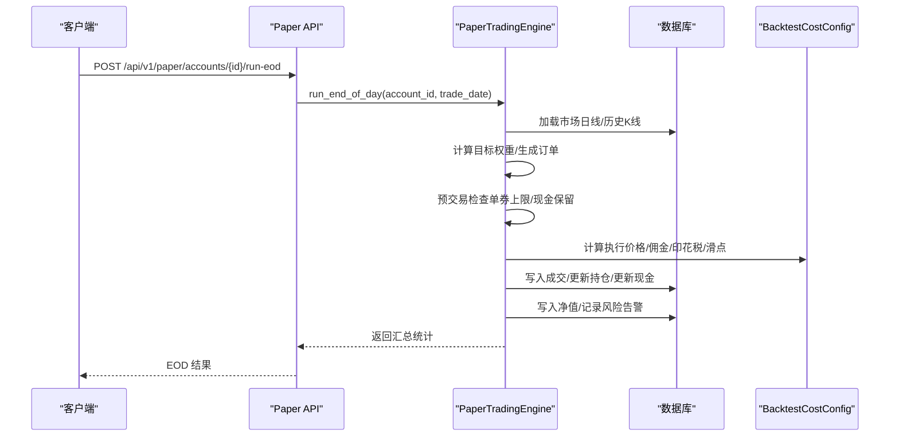
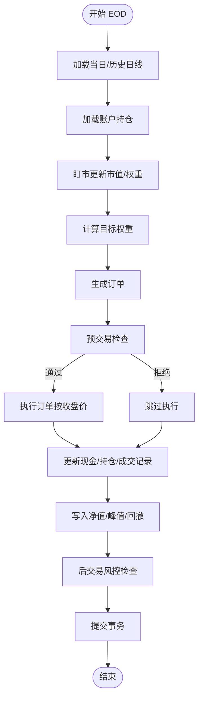
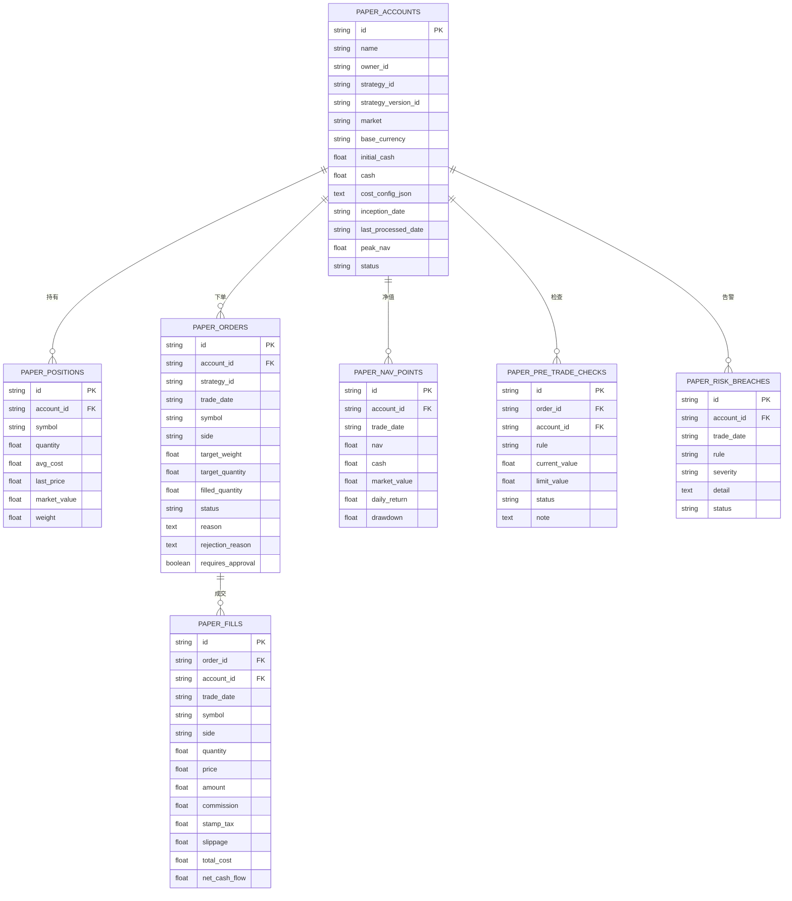
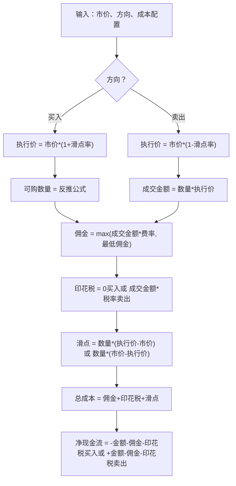
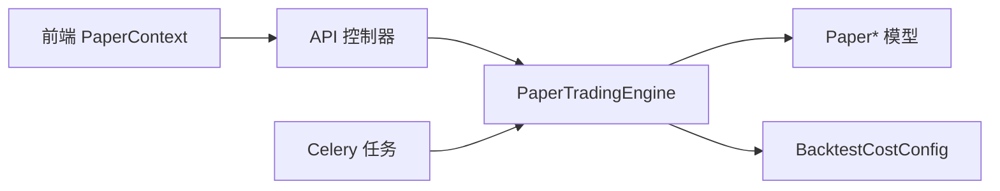

# 模拟交易集成

<cite>
**本文档引用的文件**
- [paper_trading.py](file://backend/app/services/paper_trading.py)
- [paper_models.py](file://backend/app/domains/execution/paper_models.py)
- [paper_schemas.py](file://backend/app/domains/execution/paper_schemas.py)
- [paper.py](file://backend/app/api/v1/paper.py)
- [paper_trading.py](file://backend/app/tasks/paper_trading.py)
- [49c0724c647e_paper_trading_tables.py](file://backend/app/db/migrations/versions/49c0724c647e_paper_trading_tables.py)
- [daily_backtest.py](file://backend/app/services/daily_backtest.py)
- [examples.py](file://backend/app/domains/strategy/examples.py)
- [strategy_generation_research.py](file://backend/app/services/strategy_generation_research.py)
- [test_paper.py](file://backend/tests/api/test_paper.py)
- [test_paper_trading.py](file://backend/tests/services/test_paper_trading.py)
- [PaperContext.tsx](file://frontend/src/contexts/PaperContext.tsx)
</cite>

## 目录
1. [简介](#简介)
2. [项目结构](#项目结构)
3. [核心组件](#核心组件)
4. [架构总览](#架构总览)
5. [详细组件分析](#详细组件分析)
6. [依赖关系分析](#依赖关系分析)
7. [性能考虑](#性能考虑)
8. [故障排除指南](#故障排除指南)
9. [结论](#结论)
10. [附录](#附录)

## 简介
本技术文档面向模拟交易集成功能，系统性阐述模拟交易与实盘交易的集成机制、模拟账户管理、虚拟资金控制、模拟订单处理与执行算法，以及与实盘交易的数据同步、状态管理与结果分析。文档覆盖模拟交易数据模型设计、滑点与手续费模拟、服务架构、配置方法与差异处理策略，帮助开发者与运维人员快速理解并高效使用该功能。

## 项目结构
模拟交易功能主要由以下层次构成：
- API 层：提供账户、订单、成交、净值、风险告警等 REST 接口
- 服务层：实现端到端的模拟交易引擎（EOD 循环）
- 数据层：定义模拟交易专用的领域模型与数据库迁移
- 任务层：通过 Celery 批量调度每日 EOD 运行
- 前端上下文：提供模拟交易状态的前端消费接口

图表来源
- [paper.py:1-276](file://backend/app/api/v1/paper.py#L1-L276)
- [paper_trading.py:76-134](file://backend/app/services/paper_trading.py#L76-L134)
- [paper_models.py:14-133](file://backend/app/domains/execution/paper_models.py#L14-L133)
- [49c0724c647e_paper_trading_tables.py:33-173](file://backend/app/db/migrations/versions/49c0724c647e_paper_trading_tables.py#L33-L173)
- [paper_trading.py:19-73](file://backend/app/tasks/paper_trading.py#L19-L73)

章节来源
- [paper.py:1-276](file://backend/app/api/v1/paper.py#L1-L276)
- [paper_trading.py:76-134](file://backend/app/services/paper_trading.py#L76-L134)
- [paper_models.py:14-133](file://backend/app/domains/execution/paper_models.py#L14-L133)
- [49c0724c647e_paper_trading_tables.py:33-173](file://backend/app/db/migrations/versions/49c0724c647e_paper_trading_tables.py#L33-L173)
- [paper_trading.py:19-73](file://backend/app/tasks/paper_trading.py#L19-L73)

## 核心组件
- 模拟交易引擎（PaperTradingEngine）：负责端到端的 EOD 流程，包括“盯市”、“信号计算”、“预交易检查”、“撮合执行”、“净值写入”和“后交易风控检查”
- 模拟交易模型（Paper*）：独立于实盘的 ORM 模型，支持浮点数量与与研究回测一致的成本模型
- 成本配置（BacktestCostConfig）：统一的滑点、佣金、印花税参数，用于模拟交易与回测的一致性
- API 控制器：提供账户创建、查询、EOD 触发、列表查询等接口
- Celery 任务：批量运行所有活跃账户的 EOD，支持手动触发与定时调度

章节来源
- [paper_trading.py:76-134](file://backend/app/services/paper_trading.py#L76-L134)
- [paper_models.py:14-133](file://backend/app/domains/execution/paper_models.py#L14-L133)
- [daily_backtest.py:33-53](file://backend/app/services/daily_backtest.py#L33-L53)
- [paper.py:43-247](file://backend/app/api/v1/paper.py#L43-L247)
- [paper_trading.py:19-73](file://backend/app/tasks/paper_trading.py#L19-L73)

## 架构总览
模拟交易采用“服务驱动 + 数据隔离 + 成本一致性”的架构设计，确保与实盘交易在数据与流程上保持高度一致，同时通过独立的表空间避免对实盘数据造成影响。

图表来源
- [paper.py:229-247](file://backend/app/api/v1/paper.py#L229-L247)
- [paper_trading.py:82-134](file://backend/app/services/paper_trading.py#L82-L134)
- [daily_backtest.py:33-53](file://backend/app/services/daily_backtest.py#L33-L53)

## 详细组件分析

### 模拟交易引擎（PaperTradingEngine）
- 职责：按账户与交易日执行完整的 EOD 流程，保证幂等性与一致性
- 关键步骤：
  - 读取市场日线与历史 K 线，加载账户与持仓
  - “盯市”更新持仓市值与权重
  - 使用内置策略（双均线）计算目标权重并生成订单
  - 预交易检查：单券上限、现金保留、可买/可卖限制
  - 执行订单：按收盘价模拟成交，计算佣金、印花税、滑点
  - 更新净值与峰值，进行后交易风控检查（日跌幅、最大回撤）
  - 提交事务并返回汇总统计

图表来源
- [paper_trading.py:82-134](file://backend/app/services/paper_trading.py#L82-L134)
- [paper_trading.py:179-196](file://backend/app/services/paper_trading.py#L179-L196)
- [paper_trading.py:268-312](file://backend/app/services/paper_trading.py#L268-L312)
- [paper_trading.py:374-498](file://backend/app/services/paper_trading.py#L374-L498)
- [paper_trading.py:500-534](file://backend/app/services/paper_trading.py#L500-L534)
- [paper_trading.py:536-577](file://backend/app/services/paper_trading.py#L536-L577)

章节来源
- [paper_trading.py:76-134](file://backend/app/services/paper_trading.py#L76-L134)

### 模拟交易数据模型设计
- PaperAccount：模拟账户，包含初始资金、当前现金、成本配置 JSON、成立日期、最后处理日期、峰值净值、状态等
- PaperPosition：账户下每只股票的持仓，支持浮点数量与加权
- PaperOrder：待执行订单，支持挂起、已批准、已成交、部分成交、已拒绝、已取消
- PaperFill：订单成交明细，记录成交数量、价格、金额、佣金、印花税、滑点、总成本、净现金流
- PaperNavPoint：每日净值快照，包含净值、现金、市值、日收益、回撤
- PaperPreTradeCheck：预交易检查记录，记录规则、阈值、当前值与状态
- PaperRiskBreach：风险告警记录，包含规则、严重级别、详情与状态

图表来源
- [paper_models.py:14-133](file://backend/app/domains/execution/paper_models.py#L14-L133)
- [49c0724c647e_paper_trading_tables.py:33-173](file://backend/app/db/migrations/versions/49c0724c647e_paper_trading_tables.py#L33-L173)

章节来源
- [paper_models.py:14-133](file://backend/app/domains/execution/paper_models.py#L14-L133)
- [49c0724c647e_paper_trading_tables.py:33-173](file://backend/app/db/migrations/versions/49c0724c647e_paper_trading_tables.py#L33-L173)

### 模拟执行算法与成本模型
- 执行价格：买入价 = 市价 × (1 + 滑点率)，卖出价 = 市价 × (1 - 滑点率)
- 佣金：max(成交金额 × 佣金费率, 最低佣金)
- 印花税：仅卖出收取，按成交金额 × 印花税率
- 滑点：买入滑点 = 成交量 × (执行价 - 市价)，卖出滑点 = 成交量 × (市价 - 执行价)
- 可购数量：根据可用现金与成本约束反推可购数量，确保资金充足且满足最低佣金

图表来源
- [paper_trading.py:617-629](file://backend/app/services/paper_trading.py#L617-L629)
- [daily_backtest.py:33-53](file://backend/app/services/daily_backtest.py#L33-L53)

章节来源
- [paper_trading.py:374-498](file://backend/app/services/paper_trading.py#L374-L498)
- [daily_backtest.py:33-53](file://backend/app/services/daily_backtest.py#L33-L53)

### 风险控制与告警
- 单券上限：单只股票目标市值不得超过总净值的 10%
- 现金保留：买入需预留至少 1% 的净值作为现金保留，并额外留出约 50 个基点以覆盖成本
- 日跌幅与最大回撤：当日净值跌幅超过 -5% 或回撤超过 -15% 触发风险告警
- 告警状态：ongoing / acknowledged / resolved

章节来源
- [paper_trading.py:314-372](file://backend/app/services/paper_trading.py#L314-L372)
- [paper_trading.py:536-577](file://backend/app/services/paper_trading.py#L536-L577)

### 与实盘交易的数据同步与差异处理
- 数据来源：均来自 MarketBarDaily 日线表，确保模拟与实盘使用同一数据源
- 成本模型：模拟交易与研究回测共享 BacktestCostConfig，保证一致性
- 差异处理：
  - 模拟交易不涉及真实委托簿，直接按收盘价成交
  - 实盘可能受流动性、滑点、委托簿深度等因素影响，模拟交易通过固定滑点与成本参数进行近似
  - 模拟交易支持手动触发与批量调度，实盘通常由实时行情驱动

章节来源
- [paper_trading.py:138-144](file://backend/app/services/paper_trading.py#L138-L144)
- [daily_backtest.py:33-53](file://backend/app/services/daily_backtest.py#L33-L53)

### API 与前端集成
- API 提供账户生命周期管理、订单/成交/净值/告警查询、EOD 手动触发
- 前端通过 PaperContext 获取账户、净值、持仓、订单等状态，用于可视化展示

章节来源
- [paper.py:43-247](file://backend/app/api/v1/paper.py#L43-L247)
- [PaperContext.tsx:1-20](file://frontend/src/contexts/PaperContext.tsx#L1-L20)

## 依赖关系分析
- 模块耦合：
  - API 层依赖服务层；服务层依赖数据层与成本配置；任务层依赖服务层
  - 引擎内部通过会话（AsyncSession）访问数据库，避免跨层依赖
- 外部依赖：
  - SQLAlchemy 异步会话与 ORM 映射
  - Celery 任务调度
  - FastAPI 路由与 Pydantic 序列化

图表来源
- [paper.py:1-276](file://backend/app/api/v1/paper.py#L1-L276)
- [paper_trading.py:76-134](file://backend/app/services/paper_trading.py#L76-L134)
- [daily_backtest.py:33-53](file://backend/app/services/daily_backtest.py#L33-L53)
- [paper_trading.py:19-73](file://backend/app/tasks/paper_trading.py#L19-L73)

章节来源
- [paper.py:1-276](file://backend/app/api/v1/paper.py#L1-L276)
- [paper_trading.py:76-134](file://backend/app/services/paper_trading.py#L76-L134)
- [daily_backtest.py:33-53](file://backend/app/services/daily_backtest.py#L33-L53)
- [paper_trading.py:19-73](file://backend/app/tasks/paper_trading.py#L19-L73)

## 性能考虑
- 幂等性：若某交易日已处理，再次调用将直接返回空结果，避免重复计算
- 历史数据截断：按符号分组并限制每符号历史长度，防止大规模组合导致内存膨胀
- 成本计算：在内存中完成，避免多次数据库往返
- 批量任务：Celery 任务遍历所有活跃账户，异常单独记录不影响整体进度

章节来源
- [paper_trading.py:91-98](file://backend/app/services/paper_trading.py#L91-L98)
- [paper_trading.py:146-169](file://backend/app/services/paper_trading.py#L146-L169)
- [paper_trading.py:39-57](file://backend/app/tasks/paper_trading.py#L39-L57)

## 故障排除指南
- 404 错误：账户不存在或已被删除
- 无市场数据：当日无日线数据时 EOD 为空操作，不会写入净值
- 预交易检查失败：单券超限或现金不足导致订单被拒绝
- 后交易风控告警：当日跌幅或回撤超过阈值，需人工确认与处理
- 执行阶段错误：市价无效、无可用持仓卖出、资金不足等导致部分订单被拒绝

章节来源
- [paper.py:82-86](file://backend/app/api/v1/paper.py#L82-L86)
- [paper_trading.py:96-98](file://backend/app/services/paper_trading.py#L96-L98)
- [paper_trading.py:314-372](file://backend/app/services/paper_trading.py#L314-L372)
- [paper_trading.py:536-577](file://backend/app/services/paper_trading.py#L536-L577)
- [test_paper.py:104-111](file://backend/tests/api/test_paper.py#L104-L111)
- [test_paper_trading.py:181-189](file://backend/tests/services/test_paper_trading.py#L181-L189)

## 结论
模拟交易集成功能通过独立的数据模型与服务引擎，实现了与实盘交易高度一致的端到端流程。其关键优势在于：
- 成本模型与数据源与回测一致，便于策略验证与对比
- 完整的风险控制与告警机制，保障模拟过程的稳健性
- 支持手动触发与批量调度，满足不同场景需求
- 前后端协同，便于用户直观监控模拟交易状态

建议在生产环境中结合实盘监控与回测结果，持续优化成本参数与风控阈值，以提升模拟与实盘的一致性。

## 附录

### 模拟交易配置方法
- 创建账户时可指定成本配置（佣金率、最低佣金、印花税率、滑点基点），未设置时使用默认值
- 支持绑定策略版本，自动解析策略参数映射到双均线策略
- 可设置市场与币种、初始资金、成立日期等

章节来源
- [paper.py:43-67](file://backend/app/api/v1/paper.py#L43-L67)
- [paper_trading.py:602-614](file://backend/app/services/paper_trading.py#L602-L614)
- [strategy_generation_research.py:15-46](file://backend/app/services/strategy_generation_research.py#L15-L46)

### 模拟与实盘差异的处理策略
- 模拟交易按收盘价成交，忽略委托簿与流动性影响
- 实盘可能因滑点、手续费、流动性等因素产生偏差，建议通过回测与模拟结果对比，动态调整成本参数
- 对于 A 股市场，买入不收印花税，卖出收取印花税，模拟交易严格遵循此规则

章节来源
- [paper_trading.py:403-414](file://backend/app/services/paper_trading.py#L403-L414)
- [paper_trading.py:465-467](file://backend/app/services/paper_trading.py#L465-L467)