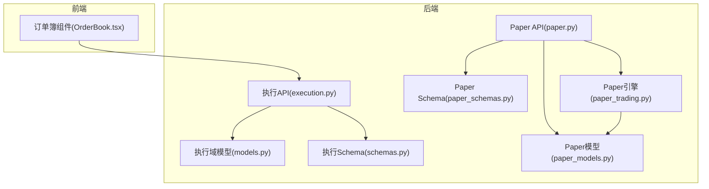
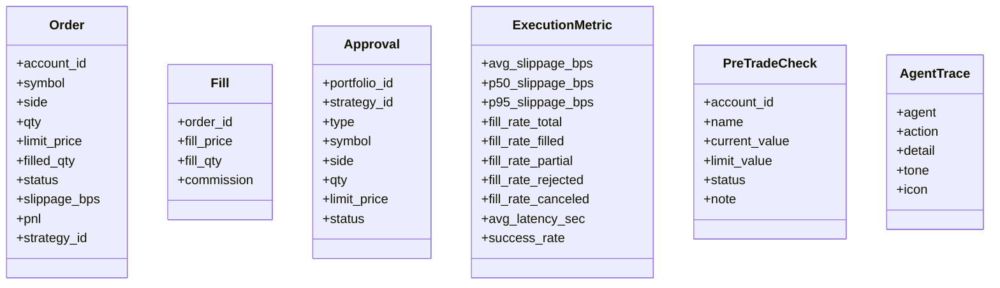
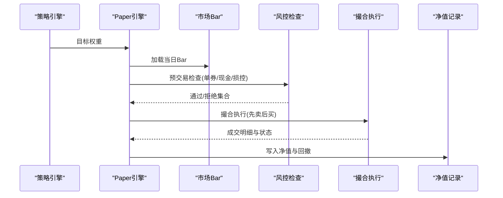
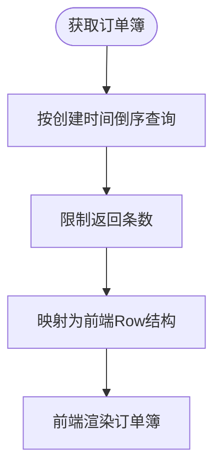
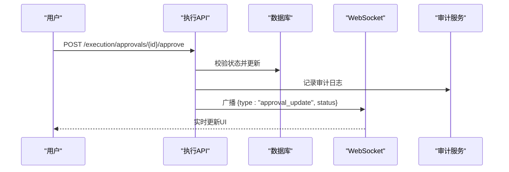
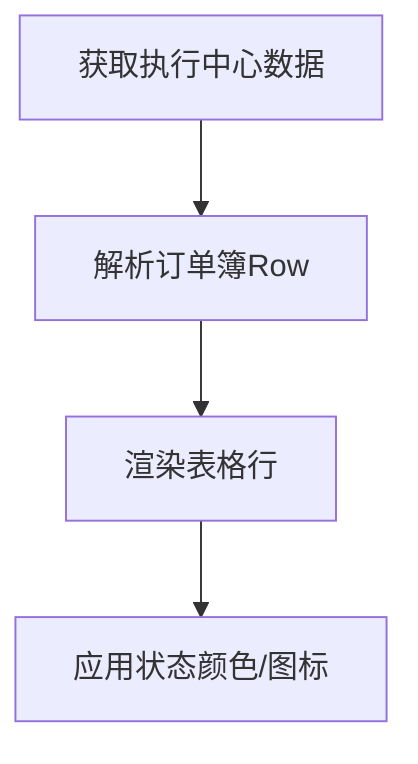

# 订单管理

<cite>
**本文引用的文件**
- [backend/app/domains/execution/models.py](file://backend/app/domains/execution/models.py)
- [backend/app/domains/execution/schemas.py](file://backend/app/domains/execution/schemas.py)
- [backend/app/api/v1/execution.py](file://backend/app/api/v1/execution.py)
- [backend/app/services/paper_trading.py](file://backend/app/services/paper_trading.py)
- [backend/app/domains/execution/paper_models.py](file://backend/app/domains/execution/paper_models.py)
- [backend/app/domains/execution/paper_schemas.py](file://backend/app/domains/execution/paper_schemas.py)
- [backend/app/api/v1/paper.py](file://backend/app/api/v1/paper.py)
- [frontend/src/screens/Execution/OrderBook.tsx](file://frontend/src/screens/Execution/OrderBook.tsx)
- [backend/app/db/migrations/versions/20260513_000001_execution_risk_portfolio.py](file://backend/app/db/migrations/versions/20260513_000001_execution_risk_portfolio.py)
- [backend/app/db/migrations/versions/49c0724c647e_paper_trading_tables.py](file://backend/app/db/migrations/versions/49c0724c647e_paper_trading_tables.py)
- [doc/07-后端项目设计说明书.md](file://doc/07-后端项目设计说明书.md)
- [backend/tests/api/test_paper.py](file://backend/tests/api/test_paper.py)
</cite>

## 目录
1. [简介](#简介)
2. [项目结构](#项目结构)
3. [核心组件](#核心组件)
4. [架构总览](#架构总览)
5. [详细组件分析](#详细组件分析)
6. [依赖关系分析](#依赖关系分析)
7. [性能考量](#性能考量)
8. [故障排查指南](#故障排查指南)
9. [结论](#结论)
10. [附录](#附录)

## 简介
本文件面向订单管理系统，系统性梳理订单生命周期管理、订单类型与状态机、订单簿维护、订单创建/修改/取消/填充的实现逻辑、订单匹配与成交计算、数据模型与状态枚举、排序规则以及实时更新机制，并提供API接口说明与最佳实践建议。系统包含实盘与模拟两套路径：实盘侧通过审批队列与执行中心对接；模拟盘侧通过“日终引擎”驱动信号生成、预交易风控、撮合与净值记录。

## 项目结构
围绕订单管理的关键目录与文件如下：
- 执行域模型与Schema：定义实盘与模拟订单、成交、风控等实体与对外输出结构
- 执行API：提供执行中心概览、审批队列、订单簿查询与审批操作
- 模拟盘引擎：实现日终信号→订单→风控→撮合→净值的完整流水线
- 前端订单簿展示：消费执行API并渲染订单簿与状态



**图表来源**
- [backend/app/api/v1/execution.py:188-202](file://backend/app/api/v1/execution.py#L188-L202)
- [backend/app/domains/execution/models.py:34-60](file://backend/app/domains/execution/models.py#L34-L60)
- [backend/app/domains/execution/schemas.py:46-106](file://backend/app/domains/execution/schemas.py#L46-L106)
- [backend/app/api/v1/paper.py:116-147](file://backend/app/api/v1/paper.py#L116-L147)
- [backend/app/domains/execution/paper_models.py:51-89](file://backend/app/domains/execution/paper_models.py#L51-L89)
- [backend/app/domains/execution/paper_schemas.py:47-75](file://backend/app/domains/execution/paper_schemas.py#L47-L75)
- [backend/app/services/paper_trading.py:76-134](file://backend/app/services/paper_trading.py#L76-L134)
- [frontend/src/screens/Execution/OrderBook.tsx:19-80](file://frontend/src/screens/Execution/OrderBook.tsx#L19-L80)

**章节来源**
- [backend/app/api/v1/execution.py:188-202](file://backend/app/api/v1/execution.py#L188-L202)
- [backend/app/domains/execution/models.py:34-60](file://backend/app/domains/execution/models.py#L34-L60)
- [backend/app/domains/execution/schemas.py:46-106](file://backend/app/domains/execution/schemas.py#L46-L106)
- [backend/app/api/v1/paper.py:116-147](file://backend/app/api/v1/paper.py#L116-L147)
- [backend/app/domains/execution/paper_models.py:51-89](file://backend/app/domains/execution/paper_models.py#L51-L89)
- [backend/app/domains/execution/paper_schemas.py:47-75](file://backend/app/domains/execution/paper_schemas.py#L47-L75)
- [backend/app/services/paper_trading.py:76-134](file://backend/app/services/paper_trading.py#L76-L134)
- [frontend/src/screens/Execution/OrderBook.tsx:19-80](file://frontend/src/screens/Execution/OrderBook.tsx#L19-L80)

## 核心组件
- 订单簿与成交记录（实盘）
  - 订单实体：包含账户、标的、方向、委托量、限价、已成交、状态、滑点、盈亏、策略ID等字段
  - 成交实体：记录每次成交的价格、数量、佣金
- 执行指标与预交易检查
  - 执行质量指标：滑点分布、成交率、拒绝原因统计
  - 预交易检查：集中度、现金、单日损失、最大回撤等规则快照
- 模型与Schema
  - 实盘：Order、Fill、ExecutionMetric、PreTradeCheck、AgentTrace
  - 模拟盘：PaperAccount、PaperPosition、PaperOrder、PaperFill、PaperNavPoint、PaperPreTradeCheck、PaperRiskBreach
- API与前端
  - 执行中心概览：汇总审批、订单簿、指标、轨迹
  - 订单簿列表：按创建时间倒序返回最近订单
  - 审批队列：支持批准/拒绝，广播事件
  - 模拟盘：账户、持仓、订单、成交、净值、风控告警查询与日终触发

**章节来源**
- [backend/app/domains/execution/models.py:34-103](file://backend/app/domains/execution/models.py#L34-L103)
- [backend/app/domains/execution/schemas.py:6-106](file://backend/app/domains/execution/schemas.py#L6-L106)
- [backend/app/api/v1/execution.py:116-155](file://backend/app/api/v1/execution.py#L116-L155)
- [backend/app/api/v1/execution.py:223-280](file://backend/app/api/v1/execution.py#L223-L280)
- [backend/app/domains/execution/paper_models.py:14-133](file://backend/app/domains/execution/paper_models.py#L14-L133)
- [backend/app/domains/execution/paper_schemas.py:8-111](file://backend/app/domains/execution/paper_schemas.py#L8-L111)
- [backend/app/api/v1/paper.py:116-147](file://backend/app/api/v1/paper.py#L116-L147)

## 架构总览
系统采用“信号→风控→订单/审批→执行/模拟”的分层设计。实盘侧通过审批队列进行人工/自动化控制，模拟盘侧通过日终引擎自动执行信号、风控、撮合与净值记录。

```mermaid
graph TB
SIG["策略信号"] --> PR["预交易检查"]
PR --> DEC{"决策"}
DEC --> |允许(模拟)| PO["生成Paper订单"]
DEC --> |需审批(实盘)| AR["提交审批请求"]
DEC --> |拒绝| BR["风控拒绝/告警"]
PO --> PE["Paper引擎执行"]
AR --> EA["执行中心审批"]
EA --> EO["创建实盘订单"]
EO --> EX["外部Broker执行"]
PE --> PF["生成Paper成交"]
PF --> PN["写入Paper净值"]
EO --> FI["产生Fill/更新状态"]
FI --> AU["审计日志"]
```

**图表来源**
- [doc/07-后端项目设计说明书.md:316-330](file://doc/07-后端项目设计说明书.md#L316-L330)
- [doc/07-后端项目设计说明书.md:332-353](file://doc/07-后端项目设计说明书.md#L332-L353)

## 详细组件分析

### 实盘订单与状态机
- 订单实体字段
  - 关键字段：账户ID、标的、方向(BUY/SELL)、委托量、限价、已成交、状态、滑点bps、盈亏、策略ID
  - 状态枚举：working、partial、filled、rejected、canceled
- 订单簿查询
  - 按创建时间倒序返回最近N条，映射为前端Row结构，含时间、符号、方向、总量、限价、已成交、状态、滑点、盈亏
- 审批队列
  - 支持按状态过滤、批准/拒绝操作，写入审计日志并广播事件



**图表来源**
- [backend/app/domains/execution/models.py:34-103](file://backend/app/domains/execution/models.py#L34-L103)

**章节来源**
- [backend/app/domains/execution/models.py:34-60](file://backend/app/domains/execution/models.py#L34-L60)
- [backend/app/domains/execution/models.py:51-60](file://backend/app/domains/execution/models.py#L51-L60)
- [backend/app/domains/execution/models.py:62-78](file://backend/app/domains/execution/models.py#L62-L78)
- [backend/app/domains/execution/models.py:80-103](file://backend/app/domains/execution/models.py#L80-L103)
- [backend/app/api/v1/execution.py:116-155](file://backend/app/api/v1/execution.py#L116-L155)
- [backend/app/api/v1/execution.py:223-280](file://backend/app/api/v1/execution.py#L223-L280)

### 模拟盘日终引擎与撮合
- 生命周期阶段
  - 市场价标记：刷新持仓最新价与市值
  - 信号生成：基于内置策略/DSL目标权重
  - 预交易检查：单券上限、现金留存、单日损失、最大回撤等
  - 撮合执行：按收盘价与滑点/佣金/印花税模型成交，更新现金与持仓
  - 净值记录：计算日收益、创新高、回撤
- 匹配与成交
  - 优先处理卖出释放现金，再处理买入
  - 执行价=市价±滑点；买入考虑佣金与印花税；按可用资金重算可成交数量
  - 生成PaperFill并更新PaperOrder状态为filled/partial
- 风控告警
  - 日内损失超阈值、最大回撤超阈值触发PaperRiskBreach



**图表来源**
- [backend/app/services/paper_trading.py:82-134](file://backend/app/services/paper_trading.py#L82-L134)
- [backend/app/services/paper_trading.py:314-372](file://backend/app/services/paper_trading.py#L314-L372)
- [backend/app/services/paper_trading.py:374-498](file://backend/app/services/paper_trading.py#L374-L498)
- [backend/app/services/paper_trading.py:500-577](file://backend/app/services/paper_trading.py#L500-L577)

**章节来源**
- [backend/app/services/paper_trading.py:76-134](file://backend/app/services/paper_trading.py#L76-L134)
- [backend/app/services/paper_trading.py:314-372](file://backend/app/services/paper_trading.py#L314-L372)
- [backend/app/services/paper_trading.py:374-498](file://backend/app/services/paper_trading.py#L374-L498)
- [backend/app/services/paper_trading.py:500-577](file://backend/app/services/paper_trading.py#L500-L577)

### 订单簿维护与排序
- 实盘订单簿
  - 查询按创建时间倒序，限制返回条数
  - 映射状态到颜色与标签，便于前端渲染
- 模拟盘订单簿
  - 按创建时间倒序列出PaperOrder，包含目标权重/数量、已成交、状态、拒绝原因等



**图表来源**
- [backend/app/api/v1/execution.py:116-136](file://backend/app/api/v1/execution.py#L116-L136)
- [backend/app/api/v1/paper.py:116-147](file://backend/app/api/v1/paper.py#L116-L147)

**章节来源**
- [backend/app/api/v1/execution.py:116-136](file://backend/app/api/v1/execution.py#L116-L136)
- [backend/app/api/v1/paper.py:116-147](file://backend/app/api/v1/paper.py#L116-L147)

### 审批与实时更新
- 审批接口
  - 列表：按状态过滤，支持limit
  - 批准/拒绝：幂等校验，写入审计日志，广播事件
- 实时推送
  - 审批状态变更通过WebSocket广播topic“execution-events”



**图表来源**
- [backend/app/api/v1/execution.py:223-250](file://backend/app/api/v1/execution.py#L223-L250)
- [backend/app/api/v1/execution.py:253-280](file://backend/app/api/v1/execution.py#L253-L280)

**章节来源**
- [backend/app/api/v1/execution.py:205-221](file://backend/app/api/v1/execution.py#L205-L221)
- [backend/app/api/v1/execution.py:223-280](file://backend/app/api/v1/execution.py#L223-L280)

### 前端订单簿展示
- 订单簿组件从上下文获取数据，渲染时间、标的、方向、数量、限价、已成交、状态、滑点、盈亏
- 状态图标与颜色对应后端状态映射



**图表来源**
- [frontend/src/screens/Execution/OrderBook.tsx:19-80](file://frontend/src/screens/Execution/OrderBook.tsx#L19-L80)

**章节来源**
- [frontend/src/screens/Execution/OrderBook.tsx:19-80](file://frontend/src/screens/Execution/OrderBook.tsx#L19-L80)

## 依赖关系分析
- 数据模型与迁移
  - 实盘订单与成交表：orders、fills
  - 模拟盘订单、成交、净值、风控表：paper_orders、paper_fills、paper_nav_points、paper_risk_breaches
- API与服务
  - 执行API依赖数据库会话与审计服务
  - Paper API依赖Paper引擎与Paper模型
- 前后端交互
  - 前端通过执行API获取订单簿与审批队列，实时订阅执行事件

```mermaid
graph LR
ORD["orders/fills"] <- --> MIG1["迁移: execution_risk_portfolio.py"]
PORD["paper_orders/paper_fills/paper_nav_points/paper_risk_breaches"] <- --> MIG2["迁移: paper_trading_tables.py"]
EXAPI["execution.py"] --> ORD
PAPI["paper.py"] --> PORD
PAPI --> PENG["paper_trading.py"]
OB["OrderBook.tsx"] --> EXAPI
```

**图表来源**
- [backend/app/db/migrations/versions/20260513_000001_execution_risk_portfolio.py:60-86](file://backend/app/db/migrations/versions/20260513_000001_execution_risk_portfolio.py#L60-L86)
- [backend/app/db/migrations/versions/49c0724c647e_paper_trading_tables.py:78-120](file://backend/app/db/migrations/versions/49c0724c647e_paper_trading_tables.py#L78-L120)
- [backend/app/api/v1/execution.py:116-136](file://backend/app/api/v1/execution.py#L116-L136)
- [backend/app/api/v1/paper.py:116-147](file://backend/app/api/v1/paper.py#L116-L147)
- [backend/app/services/paper_trading.py:76-134](file://backend/app/services/paper_trading.py#L76-L134)
- [frontend/src/screens/Execution/OrderBook.tsx:19-80](file://frontend/src/screens/Execution/OrderBook.tsx#L19-L80)

**章节来源**
- [backend/app/db/migrations/versions/20260513_000001_execution_risk_portfolio.py:60-86](file://backend/app/db/migrations/versions/20260513_000001_execution_risk_portfolio.py#L60-L86)
- [backend/app/db/migrations/versions/49c0724c647e_paper_trading_tables.py:78-120](file://backend/app/db/migrations/versions/49c0724c647e_paper_trading_tables.py#L78-L120)
- [backend/app/api/v1/execution.py:116-136](file://backend/app/api/v1/execution.py#L116-L136)
- [backend/app/api/v1/paper.py:116-147](file://backend/app/api/v1/paper.py#L116-L147)
- [backend/app/services/paper_trading.py:76-134](file://backend/app/services/paper_trading.py#L76-L134)
- [frontend/src/screens/Execution/OrderBook.tsx:19-80](file://frontend/src/screens/Execution/OrderBook.tsx#L19-L80)

## 性能考量
- 查询优化
  - 订单簿与Paper订单均按创建时间倒序并限制返回条数，避免全表扫描
  - 订单与Paper订单建立索引，加速按账户/标的/状态查询
- 成交计算
  - 模拟盘使用固定滑点与成本模型，避免复杂匹配算法带来的时延
- 实时推送
  - 审批状态变更通过WebSocket广播，减少轮询开销

[本节为通用指导，无需具体文件分析]

## 故障排查指南
- 审批接口
  - 未找到审批：返回404
  - 非pending状态：返回409冲突
  - 审批成功/失败均写入审计日志并广播
- 模拟盘EOD
  - 未知账户：返回404
  - 成功后检查ordersCreated、ordersFilled、nav是否符合预期
- 订单簿为空
  - 确认查询条件与limit设置，检查数据库中是否存在相关记录

**章节来源**
- [backend/app/api/v1/execution.py:223-280](file://backend/app/api/v1/execution.py#L223-L280)
- [backend/tests/api/test_paper.py:104-111](file://backend/tests/api/test_paper.py#L104-L111)
- [backend/app/api/v1/paper.py:229-247](file://backend/app/api/v1/paper.py#L229-L247)

## 结论
本系统在实盘侧提供审批驱动的订单管控，在模拟盘侧提供完整的日终流水线，覆盖信号→风控→撮合→净值的闭环。通过清晰的数据模型、状态机与API设计，实现了订单生命周期的可追踪与可观测。建议在生产环境中强化订单幂等性、风控规则扩展与实时监控告警。

[本节为总结性内容，无需具体文件分析]

## 附录

### API接口清单与说明
- 执行中心概览
  - GET /api/v1/execution/overview：返回汇总、审批队列、订单簿、指标、轨迹
- 审批队列
  - GET /api/v1/execution/approvals?status=&limit=：按状态过滤，支持limit
  - POST /api/v1/execution/approvals/{approval_id}/approve：批准
  - POST /api/v1/execution/approvals/{approval_id}/reject：拒绝
- 模拟盘
  - POST /api/v1/paper/accounts：创建账户
  - GET /api/v1/paper/accounts/{account_id}/orders：查询Paper订单
  - GET /api/v1/paper/accounts/{account_id}/fills：查询Paper成交
  - GET /api/v1/paper/accounts/{account_id}/nav：查询净值序列
  - GET /api/v1/paper/accounts/{account_id}/breaches：查询风控告警
  - POST /api/v1/paper/accounts/{account_id}/run-eod：手动触发日终

**章节来源**
- [backend/app/api/v1/execution.py:188-202](file://backend/app/api/v1/execution.py#L188-L202)
- [backend/app/api/v1/execution.py:205-221](file://backend/app/api/v1/execution.py#L205-L221)
- [backend/app/api/v1/execution.py:223-280](file://backend/app/api/v1/execution.py#L223-L280)
- [backend/app/api/v1/paper.py:43-86](file://backend/app/api/v1/paper.py#L43-L86)
- [backend/app/api/v1/paper.py:116-147](file://backend/app/api/v1/paper.py#L116-L147)
- [backend/app/api/v1/paper.py:150-177](file://backend/app/api/v1/paper.py#L150-L177)
- [backend/app/api/v1/paper.py:180-200](file://backend/app/api/v1/paper.py#L180-L200)
- [backend/app/api/v1/paper.py:203-223](file://backend/app/api/v1/paper.py#L203-L223)
- [backend/app/api/v1/paper.py:229-247](file://backend/app/api/v1/paper.py#L229-L247)

### 订单类型与状态说明
- 订单类型
  - 实盘：限价单（由limit_price与qty构成）
  - 模拟盘：目标权重驱动的PaperOrder（target_weight/target_quantity）
- 状态枚举
  - 实盘：working、partial、filled、rejected、canceled
  - 模拟盘：pending、approved、filled、partial、rejected、canceled

**章节来源**
- [backend/app/domains/execution/models.py:34-60](file://backend/app/domains/execution/models.py#L34-L60)
- [backend/app/domains/execution/paper_models.py:51-69](file://backend/app/domains/execution/paper_models.py#L51-L69)

### 订单簿排序与展示
- 排序规则
  - 实盘：按创建时间倒序
  - 模拟盘：按创建时间倒序
- 展示字段
  - 时间、标的、方向、总量、限价、已成交、状态、滑点、盈亏

**章节来源**
- [backend/app/api/v1/execution.py:116-136](file://backend/app/api/v1/execution.py#L116-L136)
- [backend/app/api/v1/paper.py:116-147](file://backend/app/api/v1/paper.py#L116-L147)
- [frontend/src/screens/Execution/OrderBook.tsx:42-76](file://frontend/src/screens/Execution/OrderBook.tsx#L42-L76)

### 订单匹配与成交计算要点
- 实盘
  - 通过外部Broker执行，系统记录Fill并更新订单状态与已成交数量
- 模拟盘
  - 按收盘价±滑点成交，买入考虑佣金与印花税，按可用资金重算可成交数量
  - 生成PaperFill并更新PaperOrder状态

**章节来源**
- [backend/app/services/paper_trading.py:374-498](file://backend/app/services/paper_trading.py#L374-L498)

### 最佳实践
- 审批与幂等
  - 审批接口需幂等，避免重复下单
- 风控前置
  - 预交易检查应覆盖集中度、现金、单日损失、最大回撤等关键指标
- 实时可观测
  - 通过WebSocket广播审批状态变化，前端及时刷新
- 数据一致性
  - 成交与净值更新需在事务内完成，确保一致性

[本节为通用指导，无需具体文件分析]