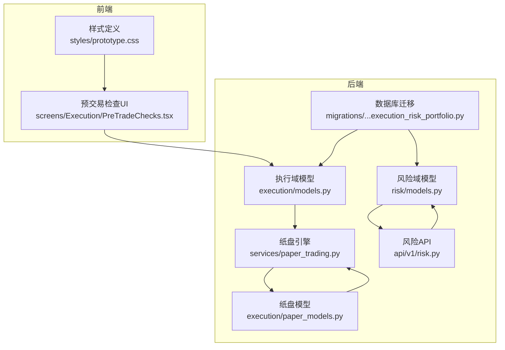
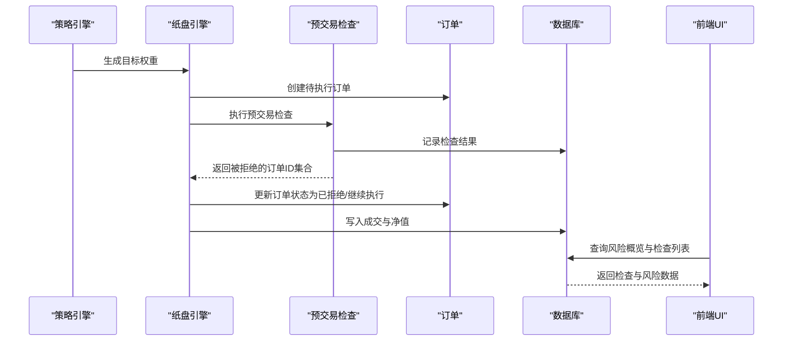
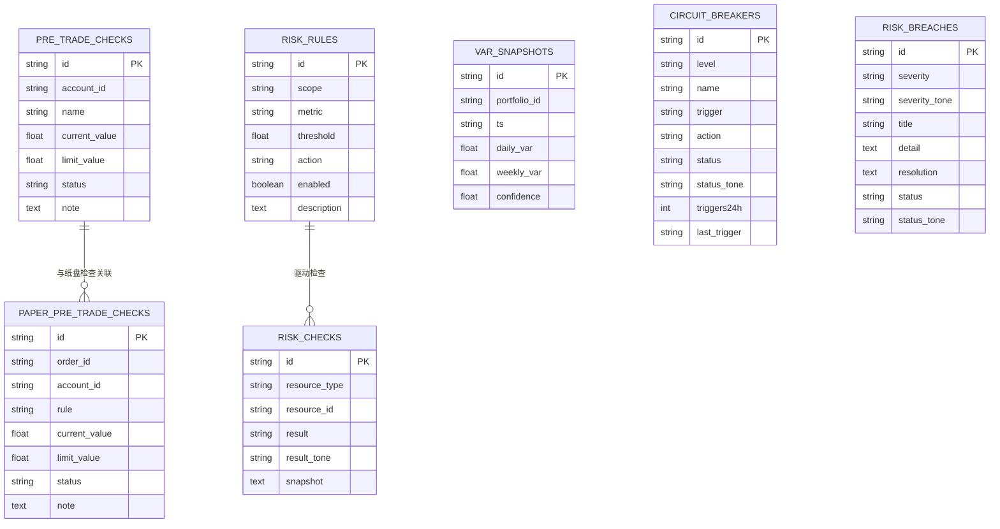
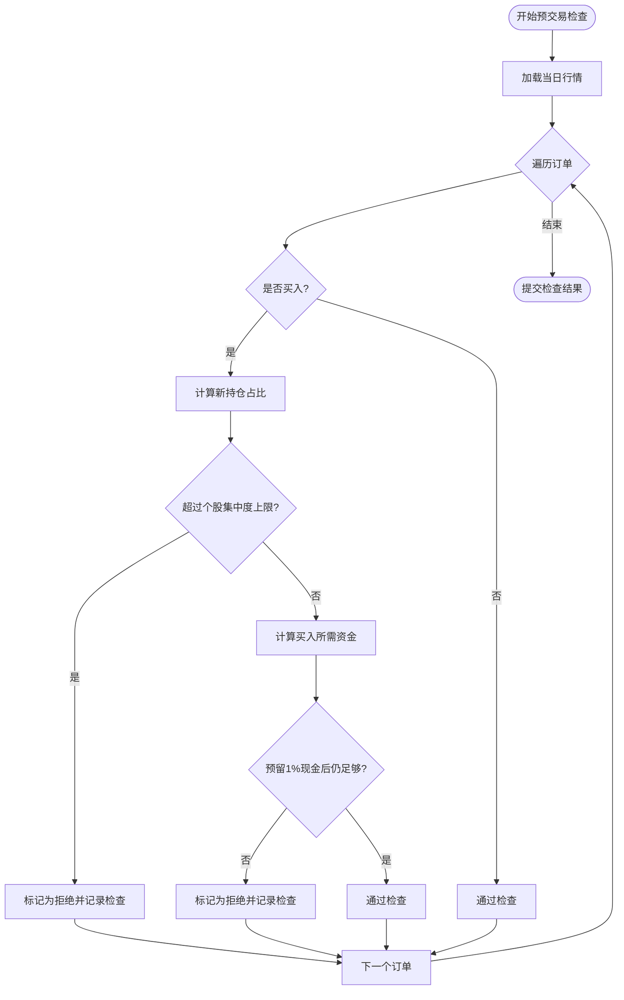
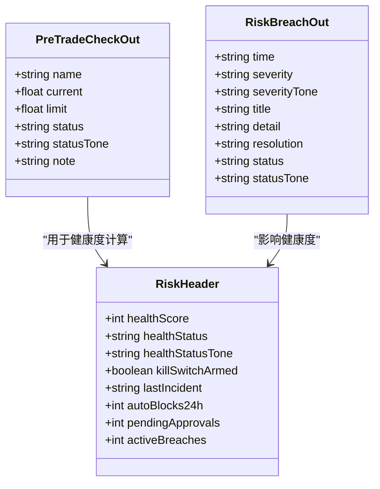
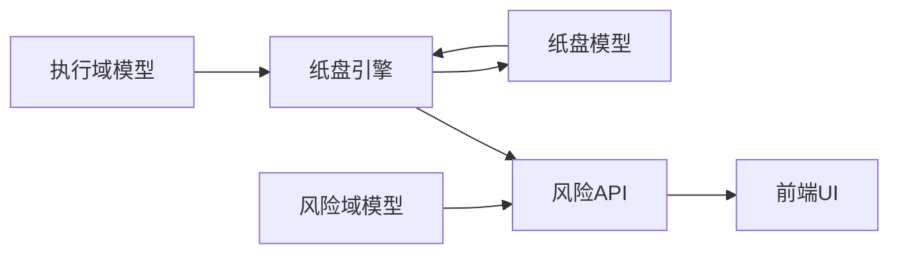

# 预交易检查

<cite>
**本文档引用的文件**
- [backend/app/domains/execution/models.py](file://backend/app/domains/execution/models.py)
- [backend/app/domains/execution/paper_models.py](file://backend/app/domains/execution/paper_models.py)
- [backend/app/domains/execution/schemas.py](file://backend/app/domains/execution/schemas.py)
- [backend/app/domains/risk/models.py](file://backend/app/domains/risk/models.py)
- [backend/app/domains/risk/schemas.py](file://backend/app/domains/risk/schemas.py)
- [backend/app/api/v1/risk.py](file://backend/app/api/v1/risk.py)
- [backend/app/services/paper_trading.py](file://backend/app/services/paper_trading.py)
- [backend/app/db/migrations/versions/20260513_000001_execution_risk_portfolio.py](file://backend/app/db/migrations/versions/20260513_000001_execution_risk_portfolio.py)
- [frontend/src/screens/Execution/PreTradeChecks.tsx](file://frontend/src/screens/Execution/PreTradeChecks.tsx)
- [frontend/src/styles/prototype.css](file://frontend/src/styles/prototype.css)
- [doc/07-后端项目设计说明书.md](file://doc/07-后端项目设计说明书.md)
</cite>

## 目录
1. [简介](#简介)
2. [项目结构](#项目结构)
3. [核心组件](#核心组件)
4. [架构总览](#架构总览)
5. [详细组件分析](#详细组件分析)
6. [依赖分析](#依赖分析)
7. [性能考虑](#性能考虑)
8. [故障排查指南](#故障排查指南)
9. [结论](#结论)
10. [附录](#附录)

## 简介
本文件面向预交易检查系统，围绕风控检查规则的定义与执行、检查项配置（个股集中度、行业集中度、单日亏损限额、净敞口限额、VaR限额等）、检查结果判定与风险等级评估进行系统化说明。文档覆盖规则的动态配置、阈值管理、检查优先级与失败处理机制，并阐述检查数据模型设计、检查逻辑实现、检查结果缓存与统计报表，最后给出风控规则配置最佳实践与异常处理方案。

## 项目结构
预交易检查涉及后端领域模型与服务、前端展示组件以及数据库迁移脚本。整体结构按“领域模型-服务-接口-前端”的层次组织，确保规则可配置、检查可追踪、结果可可视化。

图表来源
- [backend/app/domains/execution/models.py:80-91](file://backend/app/domains/execution/models.py#L80-L91)
- [backend/app/domains/execution/paper_models.py:108-133](file://backend/app/domains/execution/paper_models.py#L108-L133)
- [backend/app/domains/risk/models.py:9-101](file://backend/app/domains/risk/models.py#L9-L101)
- [backend/app/api/v1/risk.py:1-273](file://backend/app/api/v1/risk.py#L1-L273)
- [backend/app/services/paper_trading.py:314-373](file://backend/app/services/paper_trading.py#L314-L373)
- [backend/app/db/migrations/versions/20260513_000001_execution_risk_portfolio.py:105-203](file://backend/app/db/migrations/versions/20260513_000001_execution_risk_portfolio.py#L105-L203)
- [frontend/src/screens/Execution/PreTradeChecks.tsx:1-48](file://frontend/src/screens/Execution/PreTradeChecks.tsx#L1-L48)
- [frontend/src/styles/prototype.css:6136-6179](file://frontend/src/styles/prototype.css#L6136-L6179)

章节来源
- [backend/app/domains/execution/models.py:1-103](file://backend/app/domains/execution/models.py#L1-L103)
- [backend/app/domains/execution/paper_models.py:1-133](file://backend/app/domains/execution/paper_models.py#L1-L133)
- [backend/app/domains/risk/models.py:1-101](file://backend/app/domains/risk/models.py#L1-L101)
- [backend/app/api/v1/risk.py:1-273](file://backend/app/api/v1/risk.py#L1-L273)
- [backend/app/services/paper_trading.py:1-634](file://backend/app/services/paper_trading.py#L1-L634)
- [backend/app/db/migrations/versions/20260513_000001_execution_risk_portfolio.py:105-203](file://backend/app/db/migrations/versions/20260513_000001_execution_risk_portfolio.py#L105-L203)
- [frontend/src/screens/Execution/PreTradeChecks.tsx:1-48](file://frontend/src/screens/Execution/PreTradeChecks.tsx#L1-L48)
- [frontend/src/styles/prototype.css:6136-6179](file://frontend/src/styles/prototype.css#L6136-L6179)

## 核心组件
- 预交易检查模型：用于记录订单在执行前的风控检查结果，包含当前值、限额、状态与备注。
- 纸盘预交易检查模型：与纸盘订单关联，记录每次检查的规则名、数值与状态。
- 风控规则与检查记录：支持按作用域与指标配置规则，记录检查结果与快照。
- 风控API：提供风险概览、熔断器触发/恢复、VaR与违规事件查询等接口。
- 纸盘引擎：在每日回测流程中执行预交易检查，拒绝违规订单并生成检查记录。
- 前端UI：展示检查列表、状态与进度条，支持按颜色与图标识别风险级别。

章节来源
- [backend/app/domains/execution/models.py:80-91](file://backend/app/domains/execution/models.py#L80-L91)
- [backend/app/domains/execution/paper_models.py:108-119](file://backend/app/domains/execution/paper_models.py#L108-L119)
- [backend/app/domains/risk/models.py:9-101](file://backend/app/domains/risk/models.py#L9-L101)
- [backend/app/api/v1/risk.py:188-273](file://backend/app/api/v1/risk.py#L188-L273)
- [backend/app/services/paper_trading.py:314-373](file://backend/app/services/paper_trading.py#L314-L373)
- [frontend/src/screens/Execution/PreTradeChecks.tsx:15-48](file://frontend/src/screens/Execution/PreTradeChecks.tsx#L15-L48)

## 架构总览
预交易检查贯穿“策略信号→订单生成→预交易检查→执行成交→后置风控”的完整链路。检查逻辑在纸盘引擎中实现，检查结果持久化到数据库并通过API与前端展示。

图表来源
- [backend/app/services/paper_trading.py:82-134](file://backend/app/services/paper_trading.py#L82-L134)
- [backend/app/services/paper_trading.py:314-373](file://backend/app/services/paper_trading.py#L314-L373)
- [backend/app/domains/execution/paper_models.py:108-119](file://backend/app/domains/execution/paper_models.py#L108-L119)
- [backend/app/api/v1/risk.py:188-207](file://backend/app/api/v1/risk.py#L188-L207)
- [frontend/src/screens/Execution/PreTradeChecks.tsx:15-48](file://frontend/src/screens/Execution/PreTradeChecks.tsx#L15-L48)

## 详细组件分析

### 数据模型设计
- 预交易检查结果模型（执行域）：记录账户、检查名称、当前值、限额、状态与备注，支持按账户索引。
- 纸盘预交易检查模型：与纸盘订单关联，记录规则名、数值与状态，便于回溯与审计。
- 风控规则与检查记录：支持按作用域（账户/组合/策略/订单）与指标（如最大回撤、日损失、头寸限额、VaR）配置规则，记录检查快照。
- VaR快照与熔断器：记录VaR数值与置信度，熔断器按层级与触发条件管理状态。
- 风控违规事件：记录严重性、标题、详情、处置建议与状态，支持跟踪与闭环。

图表来源
- [backend/app/domains/execution/models.py:80-91](file://backend/app/domains/execution/models.py#L80-L91)
- [backend/app/domains/execution/paper_models.py:108-119](file://backend/app/domains/execution/paper_models.py#L108-L119)
- [backend/app/domains/risk/models.py:9-101](file://backend/app/domains/risk/models.py#L9-L101)
- [backend/app/db/migrations/versions/20260513_000001_execution_risk_portfolio.py:105-203](file://backend/app/db/migrations/versions/20260513_000001_execution_risk_portfolio.py#L105-L203)

章节来源
- [backend/app/domains/execution/models.py:80-91](file://backend/app/domains/execution/models.py#L80-L91)
- [backend/app/domains/execution/paper_models.py:108-119](file://backend/app/domains/execution/paper_models.py#L108-L119)
- [backend/app/domains/risk/models.py:9-101](file://backend/app/domains/risk/models.py#L9-L101)
- [backend/app/db/migrations/versions/20260513_000001_execution_risk_portfolio.py:105-203](file://backend/app/db/migrations/versions/20260513_000001_execution_risk_portfolio.py#L105-L203)

### 检查逻辑实现
- 个股集中度检查：计算新持仓占期初净资产的比例，超过阈值（示例10%）则拒绝该订单。
- 现金底仓保护：买入时预留至少1%的现金作为安全垫，不足则拒绝。
- 成交执行：按买卖方向分别计算成本、税费与滑点，动态扣减可用资金或增加头寸，支持部分成交与拒绝。

图表来源
- [backend/app/services/paper_trading.py:314-373](file://backend/app/services/paper_trading.py#L314-L373)

章节来源
- [backend/app/services/paper_trading.py:314-373](file://backend/app/services/paper_trading.py#L314-L373)

### 检查结果判定与风险等级评估
- 结果状态：pass（通过）、watch（观察）、fail（失败）。前端以颜色与图标直观呈现。
- 风险等级：结合违规事件的严重性（critical/high/medium/low）与状态（resolved/ongoing/review）进行分级管理。
- 头部健康度：综合活跃违规数与自动阻断次数计算健康评分，映射为健康状态（HEALTHY/WARNING/CRITICAL）。

图表来源
- [backend/app/domains/execution/schemas.py:37-44](file://backend/app/domains/execution/schemas.py#L37-L44)
- [backend/app/domains/risk/schemas.py:6-15](file://backend/app/domains/risk/schemas.py#L6-L15)
- [backend/app/domains/risk/schemas.py:77-86](file://backend/app/domains/risk/schemas.py#L77-L86)
- [backend/app/api/v1/risk.py:39-71](file://backend/app/api/v1/risk.py#L39-L71)

章节来源
- [backend/app/domains/execution/schemas.py:37-44](file://backend/app/domains/execution/schemas.py#L37-L44)
- [backend/app/domains/risk/schemas.py:6-15](file://backend/app/domains/risk/schemas.py#L6-L15)
- [backend/app/domains/risk/schemas.py:77-86](file://backend/app/domains/risk/schemas.py#L77-L86)
- [backend/app/api/v1/risk.py:39-71](file://backend/app/api/v1/risk.py#L39-L71)

### 动态配置与阈值管理
- 规则定义：通过风险规则表配置作用域、指标、阈值与动作（告警/阻断/紧急开关），支持启用/禁用。
- 指标扩展：除个股集中度外，可新增行业集中度、单日亏损限额、净敞口限额、VaR限额等指标，统一纳入规则体系。
- 阈值更新：通过管理界面或API调整阈值，规则生效后立即影响后续检查。

章节来源
- [backend/app/domains/risk/models.py:9-20](file://backend/app/domains/risk/models.py#L9-L20)
- [backend/app/db/migrations/versions/20260513_000001_execution_risk_portfolio.py:127-139](file://backend/app/db/migrations/versions/20260513_000001_execution_risk_portfolio.py#L127-L139)
- [doc/07-后端项目设计说明书.md:489-499](file://doc/07-后端项目设计说明书.md#L489-L499)

### 检查优先级与失败处理机制
- 优先级：先执行硬性规则（如个股集中度、现金底仓），再执行软性规则（如行业集中度、VaR），未通过硬性规则直接拒绝。
- 失败处理：失败时记录检查明细与拒绝原因，订单状态置为rejected；通过后进入执行阶段，支持部分成交与拒绝。
- 熔断器联动：当触发熔断器时，系统可提升阻断级别或临时收紧阈值，前端以视觉状态提示。

章节来源
- [backend/app/services/paper_trading.py:314-373](file://backend/app/services/paper_trading.py#L314-L373)
- [backend/app/api/v1/risk.py:210-273](file://backend/app/api/v1/risk.py#L210-L273)

### 检查结果缓存与统计报表
- 缓存策略：检查结果与VaR快照按时间序列存储，前端通过API分页获取最近N条记录，避免重复计算。
- 统计维度：支持按账户、日期、规则类型聚合统计，生成检查通过率、拒绝原因分布与违规趋势图。
- 报表输出：基于风险API返回的风险仪表板数据，前端渲染KPI面板、违规历史与政策决策流。

章节来源
- [backend/app/api/v1/risk.py:91-177](file://backend/app/api/v1/risk.py#L91-L177)
- [backend/app/domains/risk/schemas.py:17-96](file://backend/app/domains/risk/schemas.py#L17-L96)

### 前端展示与交互
- 列表渲染：展示每项检查的名称、当前值/限额、状态与进度条，支持按颜色区分风险等级。
- 状态标识：通过徽章与图标显示整体清关状态（CLEAR/WATCH），便于快速判断是否允许执行。
- 样式规范：使用CSS类控制颜色与边框，确保不同风险状态的一致性视觉反馈。

章节来源
- [frontend/src/screens/Execution/PreTradeChecks.tsx:15-48](file://frontend/src/screens/Execution/PreTradeChecks.tsx#L15-L48)
- [frontend/src/styles/prototype.css:6136-6179](file://frontend/src/styles/prototype.css#L6136-L6179)

## 依赖分析
- 模型耦合：执行域模型与纸盘模型分离，便于在真实交易与纸盘回测场景复用检查逻辑。
- 服务内聚：纸盘引擎集中实现检查与执行，降低跨模块调用复杂度。
- 接口契约：风险API提供稳定的响应模型，前端通过统一Schema消费数据。
- 外部依赖：依赖数据库索引（账户ID、资源ID、规则指标）提升查询性能。

图表来源
- [backend/app/domains/execution/models.py:80-91](file://backend/app/domains/execution/models.py#L80-L91)
- [backend/app/domains/execution/paper_models.py:108-119](file://backend/app/domains/execution/paper_models.py#L108-L119)
- [backend/app/domains/risk/models.py:9-101](file://backend/app/domains/risk/models.py#L9-L101)
- [backend/app/api/v1/risk.py:188-207](file://backend/app/api/v1/risk.py#L188-L207)

章节来源
- [backend/app/domains/execution/models.py:80-91](file://backend/app/domains/execution/models.py#L80-L91)
- [backend/app/domains/execution/paper_models.py:108-119](file://backend/app/domains/execution/paper_models.py#L108-L119)
- [backend/app/domains/risk/models.py:9-101](file://backend/app/domains/risk/models.py#L9-L101)
- [backend/app/api/v1/risk.py:188-207](file://backend/app/api/v1/risk.py#L188-L207)

## 性能考虑
- 查询优化：为账户ID、资源ID、规则指标建立索引，减少高频检查的查询开销。
- 批量写入：检查结果与成交记录采用flush批量提交，降低事务压力。
- 数据裁剪：VaR与检查记录按时间窗口限制数量，避免历史无限增长导致查询缓慢。
- 前端渲染：列表采用虚拟滚动与懒加载，减少DOM节点数量。

## 故障排查指南
- 检查未生效：确认规则已启用且作用域匹配；核对指标与阈值是否正确。
- 检查频繁失败：检查是否存在市场异常（停牌、涨跌停、价格为零）导致拒绝；核查现金预留比例与手续费设置。
- 前端不显示：确认API返回的数据结构与Schema一致；检查网络请求与鉴权。
- 熔断器误触发：检查触发条件与动作配置，必要时手动恢复并调整阈值。

章节来源
- [backend/app/api/v1/risk.py:210-273](file://backend/app/api/v1/risk.py#L210-L273)
- [backend/app/services/paper_trading.py:374-498](file://backend/app/services/paper_trading.py#L374-L498)

## 结论
预交易检查系统通过可配置的风控规则、清晰的检查优先级与失败处理机制，实现了对订单执行的前置拦截与可视化监控。配合VaR与熔断器等工具，能够有效控制组合风险，保障交易安全与合规。

## 附录
- 最佳实践
  - 将硬性规则（集中度、现金底仓）置于软性规则之前，确保基础风控优先。
  - 为关键指标设置多级阈值（绿黄红），并配套熔断器与人工审批流程。
  - 定期回顾检查失败原因，优化阈值与规则配置，持续改进风控效果。
- 异常处理
  - 对于无效行情或极端波动，采用保守估算与拒绝策略，避免放大风险。
  - 对于系统异常，记录详细快照并触发告警，保证可追溯与可恢复。