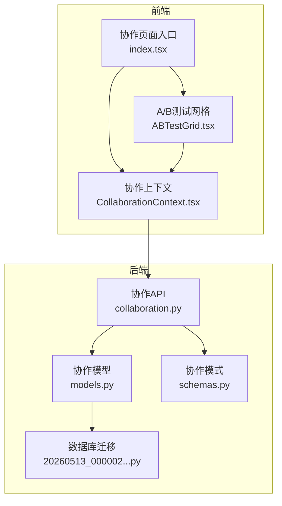
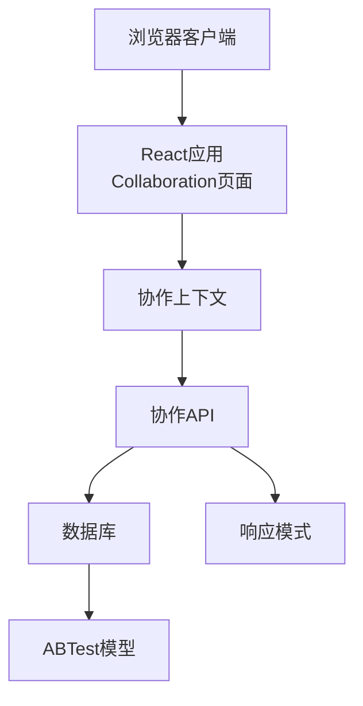
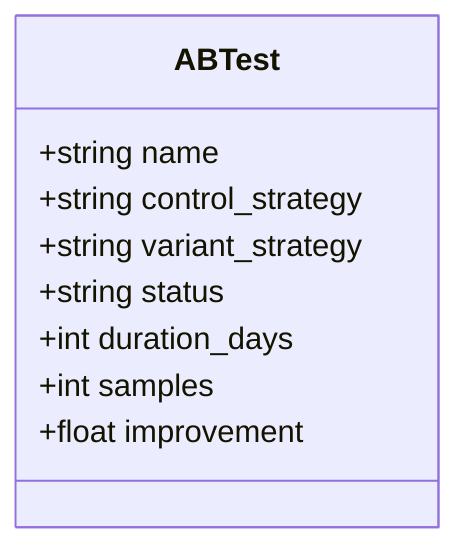
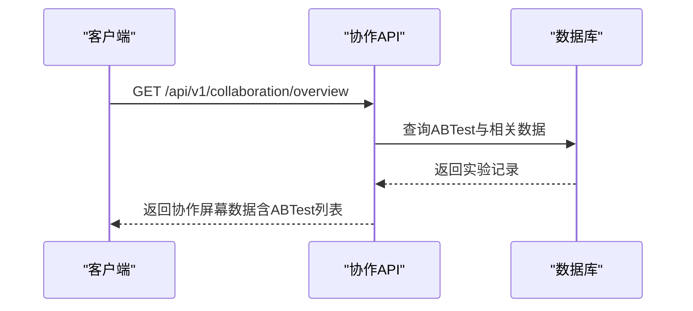
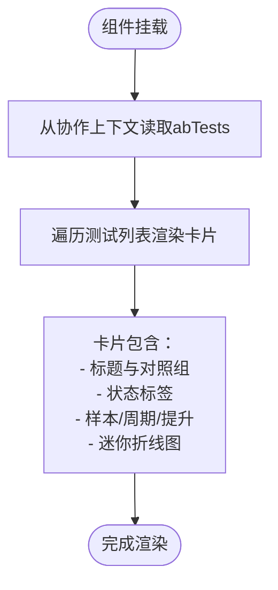
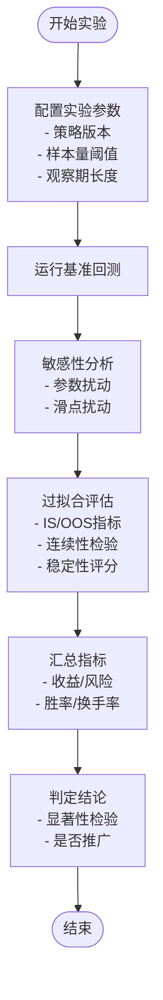
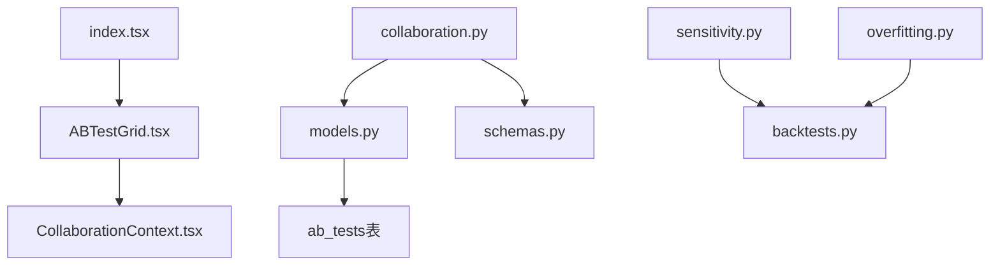

# A/B测试管理

<cite>
**本文档引用的文件**
- [backend/app/api/v1/collaboration.py](file://backend/app/api/v1/collaboration.py)
- [backend/app/domains/collaboration/models.py](file://backend/app/domains/collaboration/models.py)
- [backend/app/domains/collaboration/schemas.py](file://backend/app/domains/collaboration/schemas.py)
- [backend/app/db/migrations/versions/20260513_000002_security_collaboration_explain.py](file://backend/app/db/migrations/versions/20260513_000002_security_collaboration_explain.py)
- [frontend/src/screens/Collaboration/ABTestGrid.tsx](file://frontend/src/screens/Collaboration/ABTestGrid.tsx)
- [frontend/src/contexts/CollaborationContext.tsx](file://frontend/src/contexts/CollaborationContext.tsx)
- [frontend/src/screens/Collaboration/index.tsx](file://frontend/src/screens/Collaboration/index.tsx)
- [backend/app/services/overfitting.py](file://backend/app/services/overfitting.py)
- [backend/app/services/sensitivity.py](file://backend/app/services/sensitivity.py)
- [backend/app/api/v1/backtests.py](file://backend/app/api/v1/backtests.py)
</cite>

## 目录
1. [简介](#简介)
2. [项目结构](#项目结构)
3. [核心组件](#核心组件)
4. [架构概览](#架构概览)
5. [详细组件分析](#详细组件分析)
6. [依赖分析](#依赖分析)
7. [性能考虑](#性能考虑)
8. [故障排除指南](#故障排除指南)
9. [结论](#结论)

## 简介
本文件为A/B测试管理系统提供全面的功能文档，涵盖A/B测试设计、实验配置管理、测试结果分析与统计显著性检验。系统支持测试组分配策略、实验周期控制、效果评估指标与测试结论判定，并提供直观的界面展示与统计分析工具。该系统采用前后端分离架构，后端使用FastAPI与SQLAlchemy，前端使用React与TypeScript，通过协作实验室界面统一呈现A/B测试状态与结果。

## 项目结构
A/B测试功能位于协作域（Collaboration Domain）中，后端提供REST API接口与数据库模型，前端通过React组件进行可视化展示。核心文件组织如下：
- 后端API：/backend/app/api/v1/collaboration.py 提供协作实验室概览接口，包含A/B测试数据
- 后端模型：/backend/app/domains/collaboration/models.py 定义ABTest实体及其字段
- 后端模式：/backend/app/domains/collaboration/schemas.py 定义API响应结构
- 数据库迁移：/backend/app/db/migrations/versions/... 创建ab_tests表
- 前端界面：/frontend/src/screens/Collaboration/ABTestGrid.tsx 展示A/B测试网格
- 前端上下文：/frontend/src/contexts/CollaborationContext.tsx 提供协作数据上下文
- 前端入口：/frontend/src/screens/Collaboration/index.tsx 加载协作页面并渲染子组件

**图表来源**
- [frontend/src/screens/Collaboration/index.tsx:18-46](file://frontend/src/screens/Collaboration/index.tsx#L18-L46)
- [frontend/src/contexts/CollaborationContext.tsx:1-13](file://frontend/src/contexts/CollaborationContext.tsx#L1-L13)
- [frontend/src/screens/Collaboration/ABTestGrid.tsx:32-76](file://frontend/src/screens/Collaboration/ABTestGrid.tsx#L32-L76)
- [backend/app/api/v1/collaboration.py:94-105](file://backend/app/api/v1/collaboration.py#L94-L105)
- [backend/app/domains/collaboration/models.py:32-43](file://backend/app/domains/collaboration/models.py#L32-L43)
- [backend/app/domains/collaboration/schemas.py:51-62](file://backend/app/domains/collaboration/schemas.py#L51-L62)
- [backend/app/db/migrations/versions/20260513_000002_security_collaboration_explain.py:99-109](file://backend/app/db/migrations/versions/20260513_000002_security_collaboration_explain.py#L99-L109)

**章节来源**
- [frontend/src/screens/Collaboration/index.tsx:18-46](file://frontend/src/screens/Collaboration/index.tsx#L18-L46)
- [frontend/src/contexts/CollaborationContext.tsx:1-13](file://frontend/src/contexts/CollaborationContext.tsx#L1-L13)
- [frontend/src/screens/Collaboration/ABTestGrid.tsx:32-76](file://frontend/src/screens/Collaboration/ABTestGrid.tsx#L32-L76)
- [backend/app/api/v1/collaboration.py:94-105](file://backend/app/api/v1/collaboration.py#L94-L105)
- [backend/app/domains/collaboration/models.py:32-43](file://backend/app/domains/collaboration/models.py#L32-L43)
- [backend/app/domains/collaboration/schemas.py:51-62](file://backend/app/domains/collaboration/schemas.py#L51-L62)
- [backend/app/db/migrations/versions/20260513_000002_security_collaboration_explain.py:99-109](file://backend/app/db/migrations/versions/20260513_000002_security_collaboration_explain.py#L99-L109)

## 核心组件
- A/B测试模型（ABTest）：定义实验名称、控制组策略、实验组策略、状态、持续天数、样本数与改进幅度等字段，用于持久化实验信息
- 协作API（collaboration.py）：提供协作实验室概览接口，返回KPI、活动评审、差异面板、评审线程、A/B测试列表、审批流程与页脚卡片
- 协作模式（schemas.py）：定义ABTestOut等响应模型，确保前后端数据结构一致
- 前端网格组件（ABTestGrid.tsx）：渲染A/B测试卡片，显示状态、样本数、周期、提升百分比与迷你折线图
- 前端上下文（CollaborationContext.tsx）：提供协作数据的全局状态访问
- 统计分析服务：过拟合评估（overfitting.py）与敏感性分析（sensitivity.py）为实验结果提供稳健性检验

**章节来源**
- [backend/app/domains/collaboration/models.py:32-43](file://backend/app/domains/collaboration/models.py#L32-L43)
- [backend/app/domains/collaboration/schemas.py:51-62](file://backend/app/domains/collaboration/schemas.py#L51-L62)
- [backend/app/api/v1/collaboration.py:94-105](file://backend/app/api/v1/collaboration.py#L94-L105)
- [frontend/src/screens/Collaboration/ABTestGrid.tsx:32-76](file://frontend/src/screens/Collaboration/ABTestGrid.tsx#L32-L76)
- [frontend/src/contexts/CollaborationContext.tsx:1-13](file://frontend/src/contexts/CollaborationContext.tsx#L1-L13)
- [backend/app/services/overfitting.py:129-168](file://backend/app/services/overfitting.py#L129-L168)
- [backend/app/services/sensitivity.py:60-139](file://backend/app/services/sensitivity.py#L60-L139)

## 架构概览
系统采用分层架构：前端负责用户交互与可视化，后端提供数据与业务逻辑，数据库存储实验与回测相关数据。协作API统一输出协作实验室所需的数据，包括A/B测试状态与指标。

**图表来源**
- [frontend/src/screens/Collaboration/index.tsx:18-46](file://frontend/src/screens/Collaboration/index.tsx#L18-L46)
- [frontend/src/contexts/CollaborationContext.tsx:1-13](file://frontend/src/contexts/CollaborationContext.tsx#L1-L13)
- [backend/app/api/v1/collaboration.py:94-105](file://backend/app/api/v1/collaboration.py#L94-L105)
- [backend/app/domains/collaboration/models.py:32-43](file://backend/app/domains/collaboration/models.py#L32-L43)
- [backend/app/domains/collaboration/schemas.py:51-62](file://backend/app/domains/collaboration/schemas.py#L51-L62)

## 详细组件分析

### A/B测试模型与数据库
ABTest模型定义了实验的核心属性，包括名称、控制组与实验组策略标识、状态、持续天数、样本数与改进幅度。数据库迁移脚本创建ab_tests表，确保字段与模型一致。

**图表来源**
- [backend/app/domains/collaboration/models.py:32-43](file://backend/app/domains/collaboration/models.py#L32-L43)

**章节来源**
- [backend/app/domains/collaboration/models.py:32-43](file://backend/app/domains/collaboration/models.py#L32-L43)
- [backend/app/db/migrations/versions/20260513_000002_security_collaboration_explain.py:99-109](file://backend/app/db/migrations/versions/20260513_000002_security_collaboration_explain.py#L99-L109)

### 协作API与响应模式
协作API提供协作实验室概览接口，返回KPI、活动评审、差异面板、评审线程、A/B测试列表、审批流程与页脚卡片。ABTestOut模式定义了前端需要的A/B测试字段，包括id、name、control、variant、status、statusTone、duration、samples、improvement与sparkline。

**图表来源**
- [backend/app/api/v1/collaboration.py:94-105](file://backend/app/api/v1/collaboration.py#L94-L105)
- [backend/app/domains/collaboration/schemas.py:51-62](file://backend/app/domains/collaboration/schemas.py#L51-L62)

**章节来源**
- [backend/app/api/v1/collaboration.py:94-105](file://backend/app/api/v1/collaboration.py#L94-L105)
- [backend/app/domains/collaboration/schemas.py:51-62](file://backend/app/domains/collaboration/schemas.py#L51-L62)

### 前端A/B测试网格组件
ABTestGrid组件从协作上下文中获取abTests数据，渲染每条实验的卡片，包括名称、控制组vs实验组、状态标签、样本数、周期、提升百分比与迷你折线图。状态标签根据statusTone区分运行中、已完成、待启动等状态。

**图表来源**
- [frontend/src/screens/Collaboration/ABTestGrid.tsx:32-76](file://frontend/src/screens/Collaboration/ABTestGrid.tsx#L32-L76)

**章节来源**
- [frontend/src/screens/Collaboration/ABTestGrid.tsx:32-76](file://frontend/src/screens/Collaboration/ABTestGrid.tsx#L32-L76)
- [frontend/src/contexts/CollaborationContext.tsx:1-13](file://frontend/src/contexts/CollaborationContext.tsx#L1-L13)

### 实验配置管理与统计分析
系统通过回测服务提供实验配置与结果分析能力，包括敏感性分析与过拟合评估，为A/B测试结论提供稳健性支撑。

- 敏感性分析（sensitivity.py）：在基准回测基础上进行参数与滑点扰动，生成多个变体并记录指标，辅助判断策略对参数变化的稳定性
- 过拟合评估（overfitting.py）：基于IS/OOS夏普比率衰减、最大回撤一致性、滚动训练/测试连续性与参数敏感性等信号，计算过拟合评分并分级

**图表来源**
- [backend/app/services/sensitivity.py:60-139](file://backend/app/services/sensitivity.py#L60-L139)
- [backend/app/services/overfitting.py:129-168](file://backend/app/services/overfitting.py#L129-L168)
- [backend/app/api/v1/backtests.py:497-537](file://backend/app/api/v1/backtests.py#L497-L537)
- [backend/app/api/v1/backtests.py:540-590](file://backend/app/api/v1/backtests.py#L540-L590)

**章节来源**
- [backend/app/services/sensitivity.py:60-139](file://backend/app/services/sensitivity.py#L60-L139)
- [backend/app/services/overfitting.py:129-168](file://backend/app/services/overfitting.py#L129-L168)
- [backend/app/api/v1/backtests.py:497-537](file://backend/app/api/v1/backtests.py#L497-L537)
- [backend/app/api/v1/backtests.py:540-590](file://backend/app/api/v1/backtests.py#L540-L590)

## 依赖分析
- 前端依赖：ABTestGrid依赖协作上下文以获取abTests数据；协作页面入口负责初始化数据加载
- 后端依赖：协作API依赖数据库查询ABTest与相关数据；模型与模式定义保证数据一致性
- 统计服务：敏感性分析与过拟合评估依赖回测引擎与数据库中的指标数据

**图表来源**
- [frontend/src/screens/Collaboration/ABTestGrid.tsx:32-76](file://frontend/src/screens/Collaboration/ABTestGrid.tsx#L32-L76)
- [frontend/src/contexts/CollaborationContext.tsx:1-13](file://frontend/src/contexts/CollaborationContext.tsx#L1-L13)
- [frontend/src/screens/Collaboration/index.tsx:18-46](file://frontend/src/screens/Collaboration/index.tsx#L18-L46)
- [backend/app/api/v1/collaboration.py:94-105](file://backend/app/api/v1/collaboration.py#L94-L105)
- [backend/app/domains/collaboration/models.py:32-43](file://backend/app/domains/collaboration/models.py#L32-L43)
- [backend/app/domains/collaboration/schemas.py:51-62](file://backend/app/domains/collaboration/schemas.py#L51-L62)
- [backend/app/api/v1/backtests.py:497-537](file://backend/app/api/v1/backtests.py#L497-L537)
- [backend/app/api/v1/backtests.py:540-590](file://backend/app/api/v1/backtests.py#L540-L590)
- [backend/app/services/sensitivity.py:60-139](file://backend/app/services/sensitivity.py#L60-L139)
- [backend/app/services/overfitting.py:129-168](file://backend/app/services/overfitting.py#L129-L168)

**章节来源**
- [frontend/src/screens/Collaboration/ABTestGrid.tsx:32-76](file://frontend/src/screens/Collaboration/ABTestGrid.tsx#L32-L76)
- [frontend/src/contexts/CollaborationContext.tsx:1-13](file://frontend/src/contexts/CollaborationContext.tsx#L1-L13)
- [frontend/src/screens/Collaboration/index.tsx:18-46](file://frontend/src/screens/Collaboration/index.tsx#L18-L46)
- [backend/app/api/v1/collaboration.py:94-105](file://backend/app/api/v1/collaboration.py#L94-L105)
- [backend/app/domains/collaboration/models.py:32-43](file://backend/app/domains/collaboration/models.py#L32-L43)
- [backend/app/domains/collaboration/schemas.py:51-62](file://backend/app/domains/collaboration/schemas.py#L51-L62)
- [backend/app/api/v1/backtests.py:497-537](file://backend/app/api/v1/backtests.py#L497-L537)
- [backend/app/api/v1/backtests.py:540-590](file://backend/app/api/v1/backtests.py#L540-L590)
- [backend/app/services/sensitivity.py:60-139](file://backend/app/services/sensitivity.py#L60-L139)
- [backend/app/services/overfitting.py:129-168](file://backend/app/services/overfitting.py#L129-L168)

## 性能考虑
- 前端渲染：迷你折线图通过SVG绘制，点数较多时建议限制数据长度或采用虚拟化渲染
- API调用：协作概览接口一次性返回多类数据，建议在后端进行必要的数据聚合与缓存
- 数据库查询：ABTest查询应建立索引（如策略ID、状态），避免全表扫描
- 回测分析：敏感性分析与过拟合评估涉及多次回测运行，建议异步执行并限制扰动规模

## 故障排除指南
- 数据为空：检查协作API是否正确查询到ab_tests表，确认数据库迁移是否执行
- 状态异常：核对ABTest.status与前端状态映射（running/completed/pending）是否一致
- 图表渲染问题：确认sparkline数据格式与范围，避免空序列或极值导致SVG渲染异常
- 统计评估缺失：若过拟合评分或敏感性分析结果为空，检查回测运行是否成功以及相关指标是否已写入数据库

**章节来源**
- [backend/app/api/v1/collaboration.py:94-105](file://backend/app/api/v1/collaboration.py#L94-L105)
- [backend/app/domains/collaboration/models.py:32-43](file://backend/app/domains/collaboration/models.py#L32-L43)
- [frontend/src/screens/Collaboration/ABTestGrid.tsx:9-30](file://frontend/src/screens/Collaboration/ABTestGrid.tsx#L9-L30)
- [backend/app/services/overfitting.py:129-168](file://backend/app/services/overfitting.py#L129-L168)
- [backend/app/services/sensitivity.py:60-139](file://backend/app/services/sensitivity.py#L60-L139)

## 结论
A/B测试管理系统通过清晰的模型定义、统一的API接口与直观的前端展示，实现了从实验设计到结果分析的全流程闭环。结合敏感性分析与过拟合评估，系统能够为策略变更提供稳健的统计依据，辅助团队做出科学的推广决策。后续可在数据量增长时引入异步处理与缓存机制，进一步提升系统性能与用户体验。