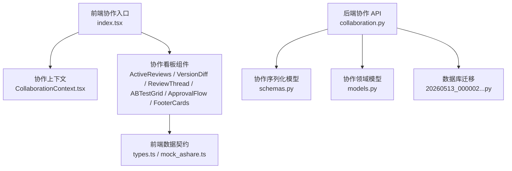
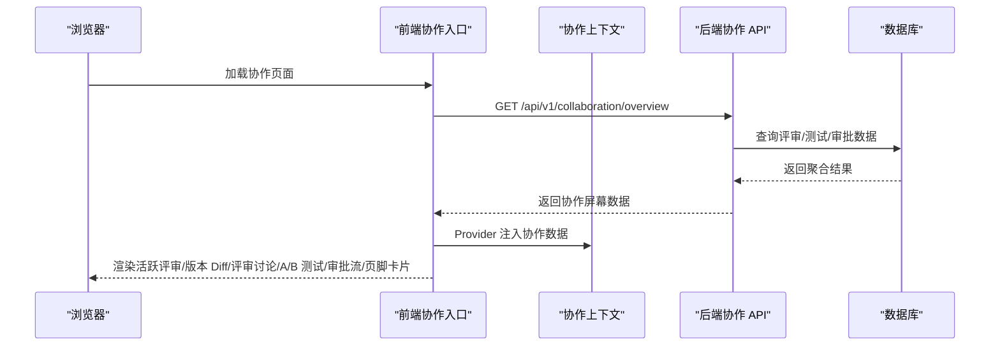
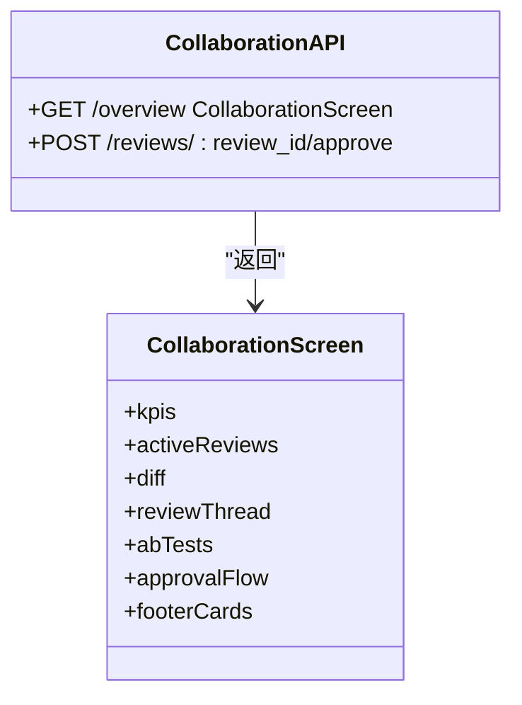
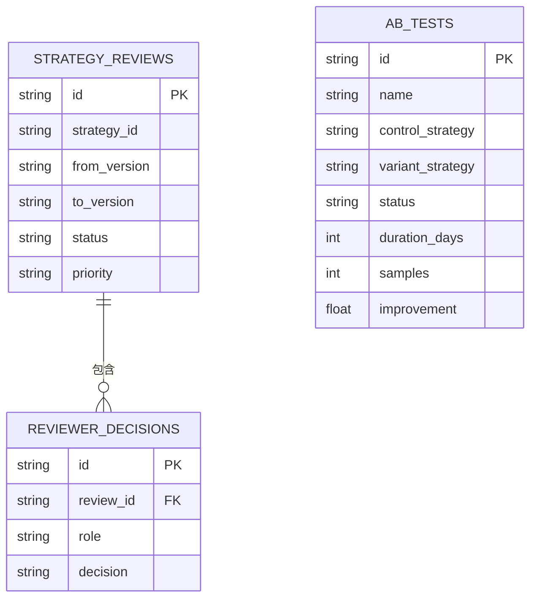
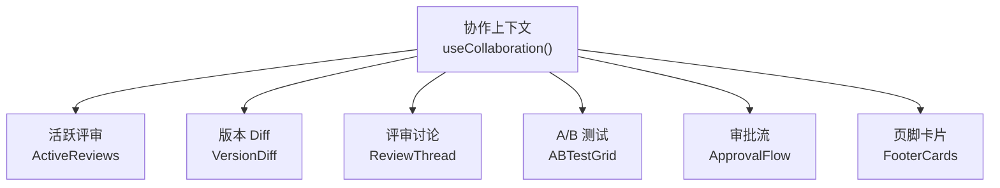
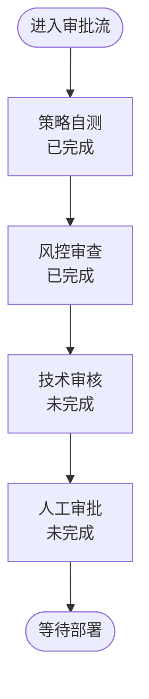
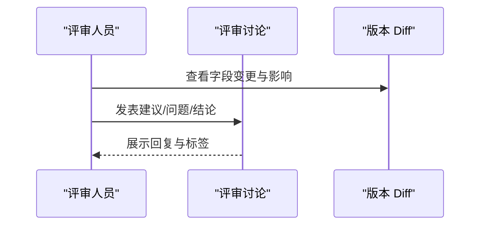
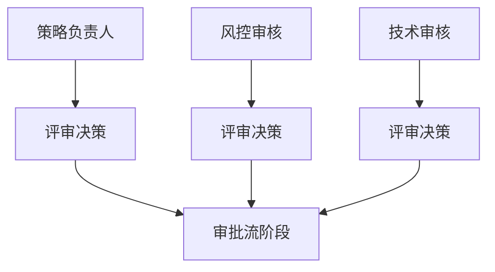
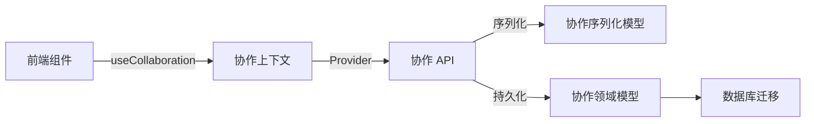

# 协作与审批

<cite>
**本文引用的文件**
- [backend/app/api/v1/collaboration.py](file://backend/app/api/v1/collaboration.py)
- [backend/app/domains/collaboration/models.py](file://backend/app/domains/collaboration/models.py)
- [backend/app/domains/collaboration/schemas.py](file://backend/app/domains/collaboration/schemas.py)
- [frontend/src/screens/Collaboration/index.tsx](file://frontend/src/screens/Collaboration/index.tsx)
- [frontend/src/contexts/CollaborationContext.tsx](file://frontend/src/contexts/CollaborationContext.tsx)
- [frontend/src/screens/Collaboration/ActiveReviews.tsx](file://frontend/src/screens/Collaboration/ActiveReviews.tsx)
- [frontend/src/screens/Collaboration/VersionDiff.tsx](file://frontend/src/screens/Collaboration/VersionDiff.tsx)
- [frontend/src/screens/Collaboration/ReviewThread.tsx](file://frontend/src/screens/Collaboration/ReviewThread.tsx)
- [frontend/src/screens/Collaboration/ABTestGrid.tsx](file://frontend/src/screens/Collaboration/ABTestGrid.tsx)
- [frontend/src/screens/Collaboration/ApprovalFlow.tsx](file://frontend/src/screens/Collaboration/ApprovalFlow.tsx)
- [frontend/src/screens/Collaboration/FooterCards.tsx](file://frontend/src/screens/Collaboration/FooterCards.tsx)
- [frontend/src/data/types.ts](file://frontend/src/data/types.ts)
- [frontend/src/data/mock_ashare.ts](file://frontend/src/data/mock_ashare.ts)
- [backend/app/db/migrations/versions/20260513_000002_security_collaboration_explain.py](file://backend/app/db/migrations/versions/20260513_000002_security_collaboration_explain.py)
- [doc/03-核心模块设计.md](file://doc/03-核心模块设计.md)
- [doc/07-后端项目设计说明书.md](file://doc/07-后端项目设计说明书.md)
</cite>

## 目录
1. [简介](#简介)
2. [项目结构](#项目结构)
3. [核心组件](#核心组件)
4. [架构总览](#架构总览)
5. [详细组件分析](#详细组件分析)
6. [依赖分析](#依赖分析)
7. [性能考虑](#性能考虑)
8. [故障排查指南](#故障排查指南)
9. [结论](#结论)
10. [附录](#附录)

## 简介
本文件面向“协作与审批”系统，围绕多人协作机制、审批流程设计、版本比较工具与评论系统展开，系统性阐述策略版本管理、变更审批流程、团队协作规范与权限控制机制，并结合前端协作界面实现、审批状态跟踪与版本历史管理，帮助开发者快速理解量化项目中的团队协作技术与工作流程管理。

## 项目结构
协作与审批功能由前后端协同实现：
- 后端提供协作中心的 API，定义领域模型与序列化结构，负责返回协作看板所需的数据集合。
- 前端通过上下文与页面组件渲染协作看板，包括活跃评审、版本 Diff、评审讨论、A/B 测试、审批流与页脚卡片等模块。
- 数据契约在前端类型定义中统一，确保前后端数据结构一致。

图表来源
- [frontend/src/screens/Collaboration/index.tsx:18-46](file://frontend/src/screens/Collaboration/index.tsx#L18-L46)
- [frontend/src/contexts/CollaborationContext.tsx:1-13](file://frontend/src/contexts/CollaborationContext.tsx#L1-L13)
- [backend/app/api/v1/collaboration.py:1-112](file://backend/app/api/v1/collaboration.py#L1-L112)
- [backend/app/domains/collaboration/schemas.py:1-88](file://backend/app/domains/collaboration/schemas.py#L1-L88)
- [backend/app/domains/collaboration/models.py:1-44](file://backend/app/domains/collaboration/models.py#L1-L44)
- [frontend/src/data/types.ts:560-600](file://frontend/src/data/types.ts#L560-L600)
- [frontend/src/data/mock_ashare.ts:3-1486](file://frontend/src/data/mock_ashare.ts#L3-L1486)
- [backend/app/db/migrations/versions/20260513_000002_security_collaboration_explain.py:78-109](file://backend/app/db/migrations/versions/20260513_000002_security_collaboration_explain.py#L78-L109)

章节来源
- [frontend/src/screens/Collaboration/index.tsx:18-46](file://frontend/src/screens/Collaboration/index.tsx#L18-L46)
- [backend/app/api/v1/collaboration.py:94-112](file://backend/app/api/v1/collaboration.py#L94-L112)

## 核心组件
- 后端协作 API：提供协作看板聚合接口与评审审批接口，返回 KPI、活跃评审、版本 Diff、评审讨论、A/B 测试、审批流与页脚卡片等数据。
- 协作领域模型：定义策略评审、评审决策与 A/B 测试三类核心实体，支撑评审状态与实验运行。
- 前端协作上下文与看板组件：通过上下文注入协作数据，组件分别渲染评审列表、版本对比、讨论线程、A/B 测试面板、审批流与辅助卡片。
- 数据契约：前端 types.ts 定义协作域数据结构，mock_ashare.ts 提供协作域示例数据，保证前后端一致。

章节来源
- [backend/app/api/v1/collaboration.py:22-105](file://backend/app/api/v1/collaboration.py#L22-L105)
- [backend/app/domains/collaboration/models.py:9-44](file://backend/app/domains/collaboration/models.py#L9-L44)
- [frontend/src/contexts/CollaborationContext.tsx:1-13](file://frontend/src/contexts/CollaborationContext.tsx#L1-L13)
- [frontend/src/data/types.ts:560-600](file://frontend/src/data/types.ts#L560-L600)
- [frontend/src/data/mock_ashare.ts:3-1486](file://frontend/src/data/mock_ashare.ts#L3-L1486)

## 架构总览
协作与审批系统采用“后端聚合 + 前端渲染”的架构模式：
- 后端通过 FastAPI 路由聚合协作数据，序列化为统一的协作屏幕模型，前端一次性拉取并分块渲染。
- 审批流与评审状态在后端以阶段化结构组织，前端以进度条与节点形式呈现。
- 版本比较与评审讨论作为独立模块，便于扩展与维护。

图表来源
- [frontend/src/screens/Collaboration/index.tsx:21-25](file://frontend/src/screens/Collaboration/index.tsx#L21-L25)
- [backend/app/api/v1/collaboration.py:94-105](file://backend/app/api/v1/collaboration.py#L94-L105)

章节来源
- [backend/app/api/v1/collaboration.py:94-112](file://backend/app/api/v1/collaboration.py#L94-L112)
- [frontend/src/screens/Collaboration/index.tsx:18-46](file://frontend/src/screens/Collaboration/index.tsx#L18-L46)

## 详细组件分析

### 后端协作 API
- 聚合接口：返回协作看板全量数据，包含 KPI、活跃评审、版本 Diff、评审讨论、A/B 测试、审批流与页脚卡片。
- 审批接口：提供评审审批动作的示例接口，便于后续接入真实审批状态持久化与工作流引擎。

图表来源
- [backend/app/api/v1/collaboration.py:94-112](file://backend/app/api/v1/collaboration.py#L94-L112)
- [backend/app/domains/collaboration/schemas.py:80-88](file://backend/app/domains/collaboration/schemas.py#L80-L88)

章节来源
- [backend/app/api/v1/collaboration.py:94-112](file://backend/app/api/v1/collaboration.py#L94-L112)

### 协作领域模型与数据库
- 策略评审：记录策略版本评审请求、优先级与状态。
- 评审决策：记录每个角色的决策状态。
- A/B 测试：记录对照实验名称、控制组与实验组、状态、时长、样本量与改进幅度。

图表来源
- [backend/app/domains/collaboration/models.py:9-44](file://backend/app/domains/collaboration/models.py#L9-L44)
- [backend/app/db/migrations/versions/20260513_000002_security_collaboration_explain.py:78-109](file://backend/app/db/migrations/versions/20260513_000002_security_collaboration_explain.py#L78-L109)

章节来源
- [backend/app/domains/collaboration/models.py:9-44](file://backend/app/domains/collaboration/models.py#L9-L44)
- [backend/app/db/migrations/versions/20260513_000002_security_collaboration_explain.py:78-109](file://backend/app/db/migrations/versions/20260513_000002_security_collaboration_explain.py#L78-L109)

### 前端协作上下文与看板组件
- 协作上下文：提供协作数据的 Provider 与 Hook，组件通过上下文读取数据。
- 活跃评审：展示评审任务、优先级、状态与评审人决策。
- 版本 Diff：展示字段级变更与影响说明。
- 评审讨论：展示评审线程与标签分类。
- A/B 测试：展示对照实验状态、样本量、周期与改进幅度及迷你折线图。
- 审批流：展示审批阶段、完成情况与进度条。
- 页脚卡片：展示协作规范与指南。

图表来源
- [frontend/src/contexts/CollaborationContext.tsx:1-13](file://frontend/src/contexts/CollaborationContext.tsx#L1-L13)
- [frontend/src/screens/Collaboration/ActiveReviews.tsx:1-62](file://frontend/src/screens/Collaboration/ActiveReviews.tsx#L1-L62)
- [frontend/src/screens/Collaboration/VersionDiff.tsx:1-34](file://frontend/src/screens/Collaboration/VersionDiff.tsx#L1-L34)
- [frontend/src/screens/Collaboration/ReviewThread.tsx:1-34](file://frontend/src/screens/Collaboration/ReviewThread.tsx#L1-L34)
- [frontend/src/screens/Collaboration/ABTestGrid.tsx:1-77](file://frontend/src/screens/Collaboration/ABTestGrid.tsx#L1-L77)
- [frontend/src/screens/Collaboration/ApprovalFlow.tsx:1-41](file://frontend/src/screens/Collaboration/ApprovalFlow.tsx#L1-L41)
- [frontend/src/screens/Collaboration/FooterCards.tsx:1-19](file://frontend/src/screens/Collaboration/FooterCards.tsx#L1-L19)

章节来源
- [frontend/src/contexts/CollaborationContext.tsx:1-13](file://frontend/src/contexts/CollaborationContext.tsx#L1-L13)
- [frontend/src/screens/Collaboration/ActiveReviews.tsx:16-61](file://frontend/src/screens/Collaboration/ActiveReviews.tsx#L16-L61)
- [frontend/src/screens/Collaboration/VersionDiff.tsx:3-33](file://frontend/src/screens/Collaboration/VersionDiff.tsx#L3-L33)
- [frontend/src/screens/Collaboration/ReviewThread.tsx:3-33](file://frontend/src/screens/Collaboration/ReviewThread.tsx#L3-L33)
- [frontend/src/screens/Collaboration/ABTestGrid.tsx:32-76](file://frontend/src/screens/Collaboration/ABTestGrid.tsx#L32-L76)
- [frontend/src/screens/Collaboration/ApprovalFlow.tsx:3-40](file://frontend/src/screens/Collaboration/ApprovalFlow.tsx#L3-L40)
- [frontend/src/screens/Collaboration/FooterCards.tsx:3-18](file://frontend/src/screens/Collaboration/FooterCards.tsx#L3-L18)

### 审批流程设计与状态跟踪
- 审批流阶段：包含策略自测、风控审查、技术审核、人工审批等阶段，支持完成状态与负责人标注。
- 状态跟踪：前端以进度条与节点样式展示完成比例与当前阶段；后端以阶段数组结构组织数据。

图表来源
- [backend/app/api/v1/collaboration.py:81-86](file://backend/app/api/v1/collaboration.py#L81-L86)
- [frontend/src/screens/Collaboration/ApprovalFlow.tsx:6-21](file://frontend/src/screens/Collaboration/ApprovalFlow.tsx#L6-L21)

章节来源
- [backend/app/api/v1/collaboration.py:81-86](file://backend/app/api/v1/collaboration.py#L81-L86)
- [frontend/src/screens/Collaboration/ApprovalFlow.tsx:3-40](file://frontend/src/screens/Collaboration/ApprovalFlow.tsx#L3-L40)

### 版本比较工具与评论系统
- 版本 Diff：以表格形式展示字段级变更与影响说明，便于评审聚焦关键改动。
- 评审讨论：以时间线形式展示评审人员、角色、标签与内容，支持多人协作与异步沟通。

图表来源
- [frontend/src/screens/Collaboration/VersionDiff.tsx:3-33](file://frontend/src/screens/Collaboration/VersionDiff.tsx#L3-L33)
- [frontend/src/screens/Collaboration/ReviewThread.tsx:3-33](file://frontend/src/screens/Collaboration/ReviewThread.tsx#L3-L33)

章节来源
- [frontend/src/screens/Collaboration/VersionDiff.tsx:3-33](file://frontend/src/screens/Collaboration/VersionDiff.tsx#L3-L33)
- [frontend/src/screens/Collaboration/ReviewThread.tsx:3-33](file://frontend/src/screens/Collaboration/ReviewThread.tsx#L3-L33)

### 团队协作规范与权限控制
- 协作规范：评审需至少两人参与，A/B 测试需满足最小样本量与观察期。
- 权限控制：前端通过角色标签与负责人分配体现职责边界；后端可通过评审决策与审批流阶段实现权限约束。

图表来源
- [backend/app/api/v1/collaboration.py:29-49](file://backend/app/api/v1/collaboration.py#L29-L49)
- [doc/03-核心模块设计.md:570-577](file://doc/03-核心模块设计.md#L570-L577)

章节来源
- [backend/app/api/v1/collaboration.py:29-49](file://backend/app/api/v1/collaboration.py#L29-L49)
- [doc/03-核心模块设计.md:570-577](file://doc/03-核心模块设计.md#L570-L577)

## 依赖分析
- 前端依赖后端协作 API 提供的统一数据模型，组件通过上下文读取数据，降低耦合。
- 后端依赖数据库迁移脚本创建协作相关表，支撑评审、决策与 A/B 测试数据持久化。
- 文档层面明确了协作与审批的设计原则与工作流规范，指导前后端实现。

图表来源
- [frontend/src/contexts/CollaborationContext.tsx:1-13](file://frontend/src/contexts/CollaborationContext.tsx#L1-L13)
- [backend/app/api/v1/collaboration.py:7-18](file://backend/app/api/v1/collaboration.py#L7-L18)
- [backend/app/domains/collaboration/schemas.py:1-88](file://backend/app/domains/collaboration/schemas.py#L1-L88)
- [backend/app/domains/collaboration/models.py:1-44](file://backend/app/domains/collaboration/models.py#L1-L44)
- [backend/app/db/migrations/versions/20260513_000002_security_collaboration_explain.py:78-109](file://backend/app/db/migrations/versions/20260513_000002_security_collaboration_explain.py#L78-L109)

章节来源
- [frontend/src/contexts/CollaborationContext.tsx:1-13](file://frontend/src/contexts/CollaborationContext.tsx#L1-L13)
- [backend/app/api/v1/collaboration.py:7-18](file://backend/app/api/v1/collaboration.py#L7-L18)
- [backend/app/domains/collaboration/schemas.py:1-88](file://backend/app/domains/collaboration/schemas.py#L1-L88)
- [backend/app/domains/collaboration/models.py:1-44](file://backend/app/domains/collaboration/models.py#L1-L44)
- [backend/app/db/migrations/versions/20260513_000002_security_collaboration_explain.py:78-109](file://backend/app/db/migrations/versions/20260513_000002_security_collaboration_explain.py#L78-L109)

## 性能考虑
- 前端一次性拉取协作看板数据，减少多次请求开销；建议后端对评审、测试与审批数据进行缓存与索引优化。
- 版本 Diff 与评审讨论为纯展示型数据，建议在前端进行轻量级排序与筛选，避免后端复杂计算。
- 审批流进度条为前端计算，建议后端返回完成阶段数量与总数，前端动态计算百分比。

## 故障排查指南
- 协作看板空白：检查协作 API 是否正常返回数据，确认前端上下文 Provider 是否正确注入。
- 审批流未更新：确认后端审批接口是否被调用，前端是否重新拉取协作看板数据。
- A/B 测试数据异常：检查后端测试状态与样本量字段，确认数据库迁移是否生效。
- 权限与角色显示错误：核对评审人角色与决策状态，确保前后端数据契约一致。

章节来源
- [frontend/src/screens/Collaboration/index.tsx:21-25](file://frontend/src/screens/Collaboration/index.tsx#L21-L25)
- [backend/app/api/v1/collaboration.py:108-112](file://backend/app/api/v1/collaboration.py#L108-L112)
- [frontend/src/data/types.ts:560-600](file://frontend/src/data/types.ts#L560-L600)

## 结论
协作与审批系统通过后端聚合与前端渲染的协作模式，实现了评审、版本比较、讨论与审批的闭环管理。配合清晰的协作规范与权限控制，能够有效保障策略版本变更的质量与合规性。后续可在评审决策持久化、审批流引擎集成与版本历史追踪等方面进一步增强。

## 附录
- 数据契约与示例数据：前端 types.ts 定义协作域结构，mock_ashare.ts 提供示例数据，便于开发与联调。
- 设计文档参考：核心模块设计与后端项目设计说明书明确了协作与审批的工作流与表结构。

章节来源
- [frontend/src/data/types.ts:560-600](file://frontend/src/data/types.ts#L560-L600)
- [frontend/src/data/mock_ashare.ts:3-1486](file://frontend/src/data/mock_ashare.ts#L3-L1486)
- [doc/03-核心模块设计.md:570-577](file://doc/03-核心模块设计.md#L570-L577)
- [doc/07-后端项目设计说明书.md:520-553](file://doc/07-后端项目设计说明书.md#L520-L553)