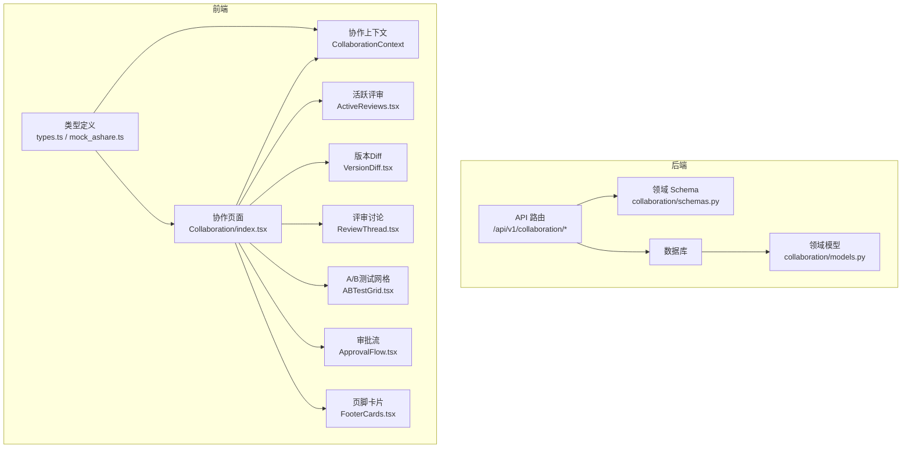
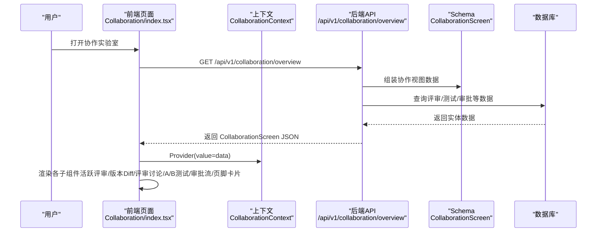
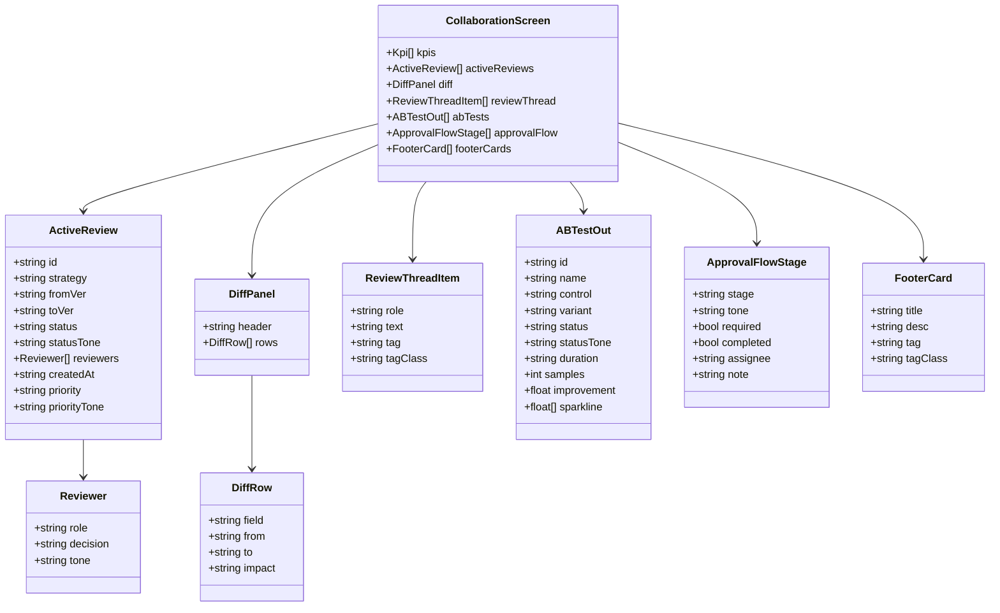
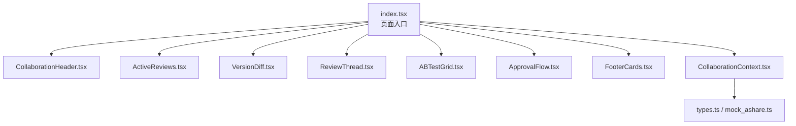
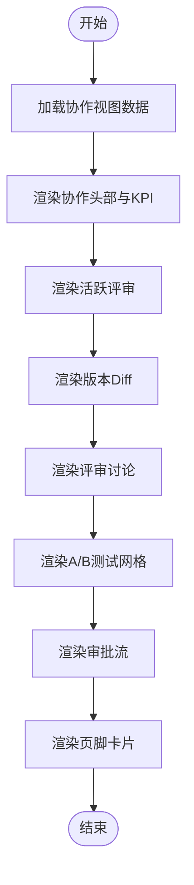
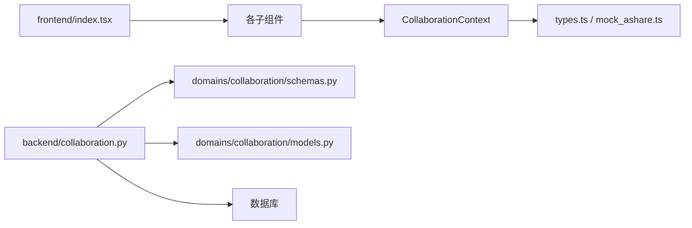

# 多人协作机制

<cite>
**本文引用的文件**
- [backend/app/api/v1/collaboration.py](file://backend/app/api/v1/collaboration.py)
- [backend/app/domains/collaboration/models.py](file://backend/app/domains/collaboration/models.py)
- [backend/app/domains/collaboration/schemas.py](file://backend/app/domains/collaboration/schemas.py)
- [frontend/src/screens/Collaboration/index.tsx](file://frontend/src/screens/Collaboration/index.tsx)
- [frontend/src/contexts/CollaborationContext.tsx](file://frontend/src/contexts/CollaborationContext.tsx)
- [frontend/src/screens/Collaboration/ActiveReviews.tsx](file://frontend/src/screens/Collaboration/ActiveReviews.tsx)
- [frontend/src/screens/Collaboration/VersionDiff.tsx](file://frontend/src/screens/Collaboration/VersionDiff.tsx)
- [frontend/src/screens/Collaboration/ReviewThread.tsx](file://frontend/src/screens/Collaboration/ReviewThread.tsx)
- [frontend/src/screens/Collaboration/ABTestGrid.tsx](file://frontend/src/screens/Collaboration/ABTestGrid.tsx)
- [frontend/src/screens/Collaboration/ApprovalFlow.tsx](file://frontend/src/screens/Collaboration/ApprovalFlow.tsx)
- [frontend/src/screens/Collaboration/FooterCards.tsx](file://frontend/src/screens/Collaboration/FooterCards.tsx)
- [frontend/src/screens/Collaboration/CollaborationHeader.tsx](file://frontend/src/screens/Collaboration/CollaborationHeader.tsx)
- [frontend/src/data/types.ts](file://frontend/src/data/types.ts)
- [frontend/src/data/mock_ashare.ts](file://frontend/src/data/mock_ashare.ts)
- [backend/tests/api/test_screens.py](file://backend/tests/api/test_screens.py)
</cite>

## 目录
1. [简介](#简介)
2. [项目结构](#项目结构)
3. [核心组件](#核心组件)
4. [架构总览](#架构总览)
5. [详细组件分析](#详细组件分析)
6. [依赖关系分析](#依赖关系分析)
7. [性能考虑](#性能考虑)
8. [故障排查指南](#故障排查指南)
9. [结论](#结论)
10. [附录](#附录)

## 简介
本文件面向量化项目中的“多人协作机制”，系统性阐述团队成员协作模式、角色权限分配、协作流程设计与实时沟通功能。围绕策略版本协作、团队分工机制、权限控制策略与协作状态同步，提供从后端API到前端界面的全链路实现说明，并给出协作界面实现、用户角色定义、权限矩阵设计与协作工作流管理的最佳实践建议。

## 项目结构
协作机制由后端FastAPI接口、领域模型与Pydantic Schema、前端React上下文与组件构成，形成“数据模型—接口—界面”的清晰分层：

- 后端
  - API路由：提供协作实验室的聚合视图与评审审批接口
  - 领域Schema：定义协作界面的数据结构（KPI、评审、Diff、A/B测试、审批流、页脚卡片）
  - 领域模型：数据库实体（策略评审、评审决策、A/B测试）用于持久化
- 前端
  - Context：提供协作数据的全局共享
  - Screen与组件：协作头部、活跃评审、版本Diff、评审讨论、A/B测试网格、审批流、页脚卡片
  - 类型定义：MockData与协作字段类型，确保前后端契约一致

图表来源
- [backend/app/api/v1/collaboration.py:1-112](file://backend/app/api/v1/collaboration.py#L1-L112)
- [backend/app/domains/collaboration/schemas.py:1-88](file://backend/app/domains/collaboration/schemas.py#L1-L88)
- [backend/app/domains/collaboration/models.py:1-44](file://backend/app/domains/collaboration/models.py#L1-L44)
- [frontend/src/screens/Collaboration/index.tsx:1-47](file://frontend/src/screens/Collaboration/index.tsx#L1-L47)
- [frontend/src/contexts/CollaborationContext.tsx:1-13](file://frontend/src/contexts/CollaborationContext.tsx#L1-L13)
- [frontend/src/data/types.ts:560-600](file://frontend/src/data/types.ts#L560-L600)

章节来源
- [backend/app/api/v1/collaboration.py:1-112](file://backend/app/api/v1/collaboration.py#L1-L112)
- [backend/app/domains/collaboration/schemas.py:1-88](file://backend/app/domains/collaboration/schemas.py#L1-L88)
- [backend/app/domains/collaboration/models.py:1-44](file://backend/app/domains/collaboration/models.py#L1-L44)
- [frontend/src/screens/Collaboration/index.tsx:1-47](file://frontend/src/screens/Collaboration/index.tsx#L1-L47)
- [frontend/src/contexts/CollaborationContext.tsx:1-13](file://frontend/src/contexts/CollaborationContext.tsx#L1-L13)
- [frontend/src/data/types.ts:560-600](file://frontend/src/data/types.ts#L560-L600)

## 核心组件
- 后端API
  - /api/v1/collaboration/overview：返回协作实验室聚合视图（KPI、活跃评审、版本Diff、评审讨论、A/B测试、审批流、页脚卡片）
  - /api/v1/collaboration/reviews/{review_id}/approve：评审审批接口（示例）
- 领域Schema
  - Kpi、Reviewer、ActiveReview、DiffRow、DiffPanel、ReviewThreadItem、ABTestOut、ApprovalFlowStage、FooterCard、CollaborationScreen
- 领域模型
  - StrategyReview、ReviewerDecision、ABTest：评审、决策、A/B测试的数据库实体
- 前端上下文与组件
  - CollaborationContext：协作数据上下文
  - CollaborationHeader、ActiveReviews、VersionDiff、ReviewThread、ABTestGrid、ApprovalFlow、FooterCards：协作界面各模块
  - types.ts与mock_ashare.ts：协作字段类型与Mock数据

章节来源
- [backend/app/api/v1/collaboration.py:94-112](file://backend/app/api/v1/collaboration.py#L94-L112)
- [backend/app/domains/collaboration/schemas.py:6-88](file://backend/app/domains/collaboration/schemas.py#L6-L88)
- [backend/app/domains/collaboration/models.py:9-44](file://backend/app/domains/collaboration/models.py#L9-L44)
- [frontend/src/contexts/CollaborationContext.tsx:1-13](file://frontend/src/contexts/CollaborationContext.tsx#L1-L13)
- [frontend/src/screens/Collaboration/index.tsx:1-47](file://frontend/src/screens/Collaboration/index.tsx#L1-L47)
- [frontend/src/data/types.ts:560-600](file://frontend/src/data/types.ts#L560-L600)

## 架构总览
协作机制采用“后端聚合、前端展示”的架构。后端提供统一的协作视图接口，前端通过Context将数据注入到各个子组件，实现模块化渲染与交互。

图表来源
- [frontend/src/screens/Collaboration/index.tsx:18-46](file://frontend/src/screens/Collaboration/index.tsx#L18-L46)
- [backend/app/api/v1/collaboration.py:94-105](file://backend/app/api/v1/collaboration.py#L94-L105)
- [backend/app/domains/collaboration/schemas.py:80-88](file://backend/app/domains/collaboration/schemas.py#L80-L88)

章节来源
- [frontend/src/screens/Collaboration/index.tsx:1-47](file://frontend/src/screens/Collaboration/index.tsx#L1-L47)
- [backend/app/api/v1/collaboration.py:94-105](file://backend/app/api/v1/collaboration.py#L94-L105)

## 详细组件分析

### 后端API与Schema
- API路由
  - /api/v1/collaboration/overview：返回协作实验室聚合视图，包含KPI、活跃评审、版本Diff、评审讨论、A/B测试、审批流、页脚卡片
  - /api/v1/collaboration/reviews/{review_id}/approve：示例评审审批接口
- Schema定义
  - CollaborationScreen：聚合视图的顶层结构
  - ActiveReview/Reviewer：评审任务与评审人决策
  - DiffPanel/DiffRow：版本变更对比面板
  - ReviewThreadItem：评审讨论条目
  - ABTestOut：A/B测试结果
  - ApprovalFlowStage：审批流阶段
  - FooterCard：页脚提示卡片
- 模型定义
  - StrategyReview：策略版本评审请求
  - ReviewerDecision：评审人决策
  - ABTest：A/B测试实验

图表来源
- [backend/app/domains/collaboration/schemas.py:6-88](file://backend/app/domains/collaboration/schemas.py#L6-L88)

章节来源
- [backend/app/api/v1/collaboration.py:94-112](file://backend/app/api/v1/collaboration.py#L94-L112)
- [backend/app/domains/collaboration/schemas.py:6-88](file://backend/app/domains/collaboration/schemas.py#L6-L88)
- [backend/app/domains/collaboration/models.py:9-44](file://backend/app/domains/collaboration/models.py#L9-L44)

### 前端协作界面实现
- 页面入口
  - Collaboration/index.tsx：加载协作数据，提供Provider，渲染协作头部、活跃评审、版本Diff、评审讨论、A/B测试网格、审批流、页脚卡片
- 上下文
  - CollaborationContext.tsx：定义协作数据上下文，供子组件消费
- 子组件
  - CollaborationHeader.tsx：展示标题、副标题与KPI条带
  - ActiveReviews.tsx：渲染活跃评审列表，含优先级与评审状态
  - VersionDiff.tsx：渲染版本变更对比表
  - ReviewThread.tsx：渲染评审讨论记录
  - ABTestGrid.tsx：渲染A/B测试卡片与迷你折线图
  - ApprovalFlow.tsx：渲染审批流进度与阶段
  - FooterCards.tsx：渲染页脚提示卡片
- 类型与Mock数据
  - types.ts：定义协作字段类型（MockData.collaboration）
  - mock_ashare.ts：提供Mock数据，用于前端演示

图表来源
- [frontend/src/screens/Collaboration/index.tsx:1-47](file://frontend/src/screens/Collaboration/index.tsx#L1-L47)
- [frontend/src/contexts/CollaborationContext.tsx:1-13](file://frontend/src/contexts/CollaborationContext.tsx#L1-L13)
- [frontend/src/screens/Collaboration/CollaborationHeader.tsx:1-34](file://frontend/src/screens/Collaboration/CollaborationHeader.tsx#L1-L34)
- [frontend/src/screens/Collaboration/ActiveReviews.tsx:1-62](file://frontend/src/screens/Collaboration/ActiveReviews.tsx#L1-L62)
- [frontend/src/screens/Collaboration/VersionDiff.tsx:1-34](file://frontend/src/screens/Collaboration/VersionDiff.tsx#L1-L34)
- [frontend/src/screens/Collaboration/ReviewThread.tsx:1-34](file://frontend/src/screens/Collaboration/ReviewThread.tsx#L1-L34)
- [frontend/src/screens/Collaboration/ABTestGrid.tsx:1-77](file://frontend/src/screens/Collaboration/ABTestGrid.tsx#L1-L77)
- [frontend/src/screens/Collaboration/ApprovalFlow.tsx:1-41](file://frontend/src/screens/Collaboration/ApprovalFlow.tsx#L1-L41)
- [frontend/src/screens/Collaboration/FooterCards.tsx:1-19](file://frontend/src/screens/Collaboration/FooterCards.tsx#L1-L19)
- [frontend/src/data/types.ts:560-600](file://frontend/src/data/types.ts#L560-L600)
- [frontend/src/data/mock_ashare.ts:3-1486](file://frontend/src/data/mock_ashare.ts#L3-L1486)

章节来源
- [frontend/src/screens/Collaboration/index.tsx:1-47](file://frontend/src/screens/Collaboration/index.tsx#L1-L47)
- [frontend/src/contexts/CollaborationContext.tsx:1-13](file://frontend/src/contexts/CollaborationContext.tsx#L1-L13)
- [frontend/src/screens/Collaboration/*.tsx:1-62](file://frontend/src/screens/Collaboration/ActiveReviews.tsx#L1-L62)

### 协作流程与工作流管理
- 策略版本协作
  - 活跃评审：展示评审任务、评审人决策、优先级与状态
  - 版本Diff：对比版本变更字段、旧值、新值与影响
  - 评审讨论：记录评审过程中的意见与标签
- A/B测试
  - 控制组与实验组并行运行，展示样本数、周期、改进幅度与迷你折线图
- 审批流
  - 多阶段审批（策略自测、风控审查、技术审核、人工审批），支持完成状态与进度条
- 权限与角色
  - 评审人角色：策略负责人、风控审核、技术审核等
  - 决策状态：同意、需修改、待评审
  - 审批流阶段：不同角色的负责人与备注

图表来源
- [frontend/src/screens/Collaboration/index.tsx:29-46](file://frontend/src/screens/Collaboration/index.tsx#L29-L46)
- [frontend/src/screens/Collaboration/ActiveReviews.tsx:16-62](file://frontend/src/screens/Collaboration/ActiveReviews.tsx#L16-L62)
- [frontend/src/screens/Collaboration/VersionDiff.tsx:3-34](file://frontend/src/screens/Collaboration/VersionDiff.tsx#L3-L34)
- [frontend/src/screens/Collaboration/ReviewThread.tsx:3-34](file://frontend/src/screens/Collaboration/ReviewThread.tsx#L3-L34)
- [frontend/src/screens/Collaboration/ABTestGrid.tsx:32-77](file://frontend/src/screens/Collaboration/ABTestGrid.tsx#L32-L77)
- [frontend/src/screens/Collaboration/ApprovalFlow.tsx:3-41](file://frontend/src/screens/Collaboration/ApprovalFlow.tsx#L3-L41)
- [frontend/src/screens/Collaboration/FooterCards.tsx:3-19](file://frontend/src/screens/Collaboration/FooterCards.tsx#L3-L19)

章节来源
- [frontend/src/screens/Collaboration/index.tsx:1-47](file://frontend/src/screens/Collaboration/index.tsx#L1-L47)
- [frontend/src/screens/Collaboration/ActiveReviews.tsx:1-62](file://frontend/src/screens/Collaboration/ActiveReviews.tsx#L1-L62)
- [frontend/src/screens/Collaboration/ABTestGrid.tsx:1-77](file://frontend/src/screens/Collaboration/ABTestGrid.tsx#L1-L77)
- [frontend/src/screens/Collaboration/ApprovalFlow.tsx:1-41](file://frontend/src/screens/Collaboration/ApprovalFlow.tsx#L1-L41)

### 用户角色定义与权限矩阵
- 角色
  - 策略负责人：负责策略层面的自测与初审
  - 风控审核：负责风险合规检查
  - 技术审核：负责代码与技术实现审查
  - 人工审批：最终审批与上线决策
- 权限矩阵（示意）
  - 策略负责人：提交评审、查看评审、发起修改
  - 风控审核：查看评审、提出修改意见、通过/拒绝
  - 技术审核：查看评审、技术评估、通过/拒绝
  - 人工审批：查看评审、最终审批、上线发布
  - 系统：自动生成评审任务、推送通知、记录审计轨迹

章节来源
- [backend/app/domains/collaboration/schemas.py:13-30](file://backend/app/domains/collaboration/schemas.py#L13-L30)
- [backend/app/api/v1/collaboration.py:108-112](file://backend/app/api/v1/collaboration.py#L108-L112)

## 依赖关系分析
- 前端依赖
  - Collaboration/index.tsx 依赖 api.collaboration.overview 获取数据，依赖各子组件渲染
  - 各子组件依赖 CollaborationContext 提供的数据
  - types.ts 与 mock_ashare.ts 提供类型与Mock数据支撑
- 后端依赖
  - API路由依赖领域Schema与数据库查询
  - 领域Schema与模型定义协作界面的数据契约与持久化实体

图表来源
- [frontend/src/screens/Collaboration/index.tsx:1-47](file://frontend/src/screens/Collaboration/index.tsx#L1-L47)
- [frontend/src/contexts/CollaborationContext.tsx:1-13](file://frontend/src/contexts/CollaborationContext.tsx#L1-L13)
- [frontend/src/data/types.ts:560-600](file://frontend/src/data/types.ts#L560-L600)
- [backend/app/api/v1/collaboration.py:1-112](file://backend/app/api/v1/collaboration.py#L1-L112)
- [backend/app/domains/collaboration/schemas.py:1-88](file://backend/app/domains/collaboration/schemas.py#L1-L88)
- [backend/app/domains/collaboration/models.py:1-44](file://backend/app/domains/collaboration/models.py#L1-L44)

章节来源
- [frontend/src/screens/Collaboration/index.tsx:1-47](file://frontend/src/screens/Collaboration/index.tsx#L1-L47)
- [backend/app/api/v1/collaboration.py:1-112](file://backend/app/api/v1/collaboration.py#L1-L112)

## 性能考虑
- 前端
  - 使用React Context减少重复请求，组件按需渲染
  - 图表组件（迷你折线图）采用SVG绘制，避免复杂库依赖
- 后端
  - API聚合视图一次性返回所需数据，减少多次往返
  - Schema校验与序列化开销可控，适合高频访问场景
- 可扩展性
  - 数据库实体与Schema分离，便于演进
  - 组件模块化，易于新增协作功能（如评论、附件、通知）

## 故障排查指南
- 常见问题
  - 协作视图加载失败：检查后端API /api/v1/collaboration/overview是否可用
  - 评审审批接口异常：检查 /api/v1/collaboration/reviews/{review_id}/approve 的路径与参数
  - 前端上下文未提供数据：确认 Collaboration/index.tsx 是否正确设置 Provider
- 测试用例参考
  - 后端测试覆盖了协作视图与评审审批接口的基本行为

章节来源
- [backend/tests/api/test_screens.py:263-275](file://backend/tests/api/test_screens.py#L263-L275)
- [frontend/src/screens/Collaboration/index.tsx:18-25](file://frontend/src/screens/Collaboration/index.tsx#L18-L25)

## 结论
本协作机制通过后端聚合API与前端模块化组件，实现了策略版本协作、评审流程、A/B测试与审批流的一体化展示。Schema与模型定义清晰，上下文与组件职责明确，具备良好的可维护性与扩展性。建议在实际落地中结合组织角色与权限体系完善鉴权与审计，并持续优化评审与审批的自动化程度。

## 附录
- 关键接口
  - GET /api/v1/collaboration/overview：返回协作实验室聚合视图
  - POST /api/v1/collaboration/reviews/{review_id}/approve：评审审批
- 前端组件清单
  - Collaboration/index.tsx、CollaborationHeader.tsx、ActiveReviews.tsx、VersionDiff.tsx、ReviewThread.tsx、ABTestGrid.tsx、ApprovalFlow.tsx、FooterCards.tsx
- 类型与Mock
  - types.ts 中的 MockData.collaboration 字段定义
  - mock_ashare.ts 中的 ashareMock 包含协作数据