# 审批流程管理

<cite>
**本文档引用的文件**
- [backend/app/api/v1/execution.py](file://backend/app/api/v1/execution.py)
- [backend/app/api/v1/collaboration.py](file://backend/app/api/v1/collaboration.py)
- [backend/app/api/v1/audit.py](file://backend/app/api/v1/audit.py)
- [backend/app/services/audit_service.py](file://backend/app/services/audit_service.py)
- [backend/app/domains/audit/models.py](file://backend/app/domains/audit/models.py)
- [backend/app/domains/audit/schemas.py](file://backend/app/domains/audit/schemas.py)
- [backend/app/domains/collaboration/models.py](file://backend/app/domains/collaboration/models.py)
- [backend/app/domains/collaboration/schemas.py](file://backend/app/domains/collaboration/schemas.py)
- [backend/app/domains/execution/models.py](file://backend/app/domains/execution/models.py)
- [backend/app/domains/execution/schemas.py](file://backend/app/domains/execution/schemas.py)
- [backend/app/api/v1/router.py](file://backend/app/api/v1/router.py)
- [frontend/src/screens/Execution/ApprovalQueue.tsx](file://frontend/src/screens/Execution/ApprovalQueue.tsx)
- [frontend/src/screens/Collaboration/ApprovalFlow.tsx](file://frontend/src/screens/Collaboration/ApprovalFlow.tsx)
- [frontend/src/screens/Audit/AuditLog.tsx](file://frontend/src/screens/Audit/AuditLog.tsx)
- [frontend/src/screens/Audit/AuditHeader.tsx](file://frontend/src/screens/Audit/AuditHeader.tsx)
- [frontend/src/contexts/CollaborationContext.tsx](file://frontend/src/contexts/CollaborationContext.tsx)
- [frontend/src/data/types.ts](file://frontend/src/data/types.ts)
- [frontend/src/styles/prototype.css](file://frontend/src/styles/prototype.css)
- [doc/03-核心模块设计.md](file://doc/03-核心模块设计.md)
</cite>

## 目录
1. [简介](#简介)
2. [项目结构](#项目结构)
3. [核心组件](#核心组件)
4. [架构概览](#架构概览)
5. [详细组件分析](#详细组件分析)
6. [依赖关系分析](#依赖关系分析)
7. [性能考虑](#性能考虑)
8. [故障排除指南](#故障排除指南)
9. [结论](#结论)

## 简介

审批流程管理系统是量化交易系统中的关键合规组件，负责管理多阶段审批机制、审批节点设计、审批状态跟踪和审批权限控制。该系统实现了完整的审批生命周期管理，包括策略评审、交易审批、策略上线审批等多个审批场景。

系统采用前后端分离架构，后端基于FastAPI提供RESTful API，前端使用React构建用户界面。审批流程涵盖了从策略开发到实盘交易的全生命周期管理，确保每次操作都受到适当的监督和审计。

## 项目结构

审批流程管理系统在项目中位于以下关键位置：

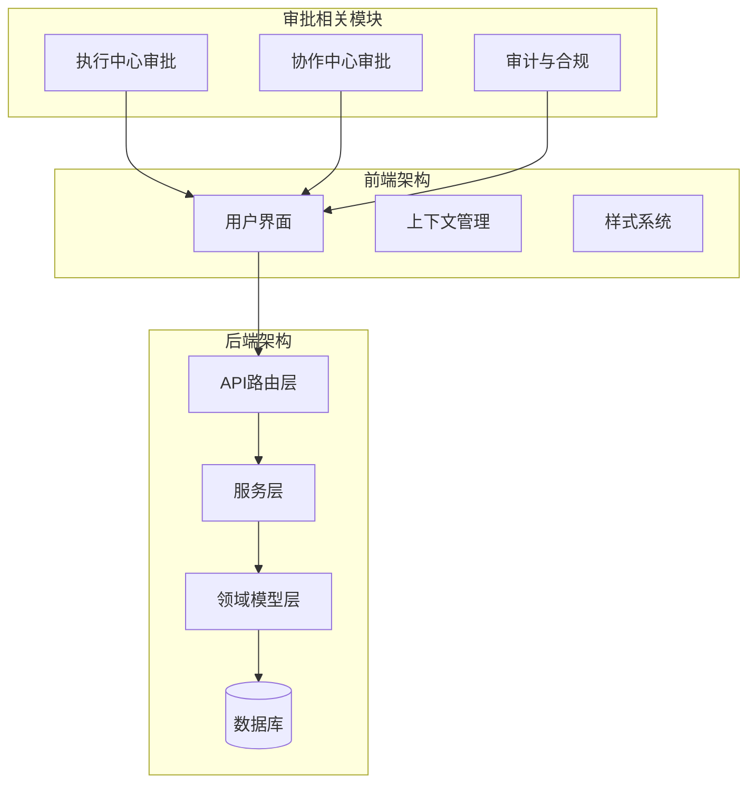

**图表来源**
- [backend/app/api/v1/router.py:1-40](file://backend/app/api/v1/router.py#L1-L40)
- [frontend/src/screens/Execution/ApprovalQueue.tsx:1-138](file://frontend/src/screens/Execution/ApprovalQueue.tsx#L1-L138)

**章节来源**
- [backend/app/api/v1/router.py:1-40](file://backend/app/api/v1/router.py#L1-L40)
- [doc/03-核心模块设计.md:529-577](file://doc/03-核心模块设计.md#L529-L577)

## 核心组件

### 审批流程引擎

系统的核心是基于状态机的审批流程引擎，支持多种审批类型和状态转换：

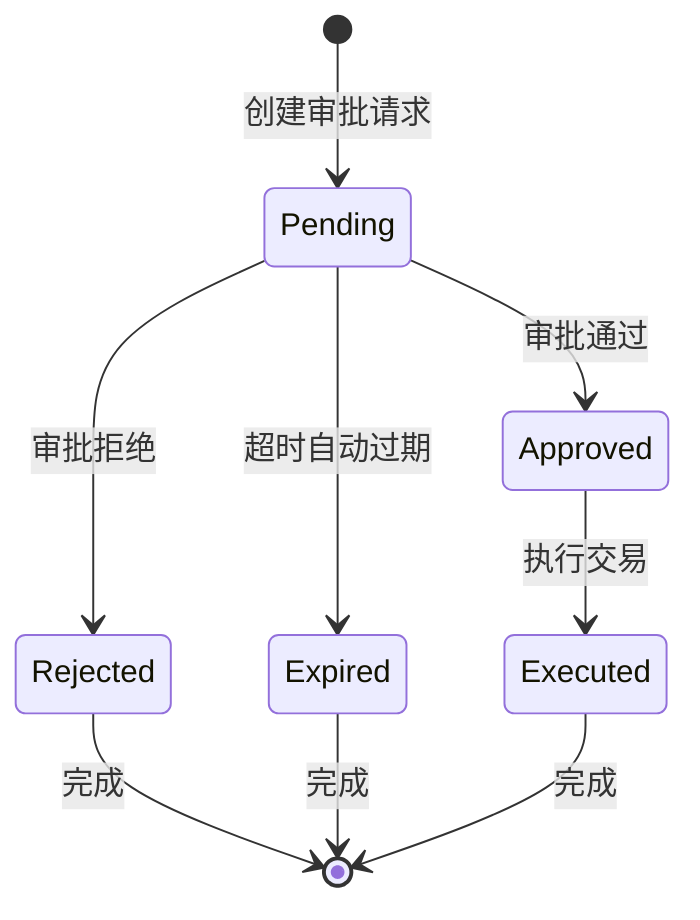

**图表来源**
- [backend/app/api/v1/execution.py:223-281](file://backend/app/api/v1/execution.py#L223-L281)

### 审计追踪系统

系统实现了不可变的审计日志系统，确保所有审批操作都可追溯：

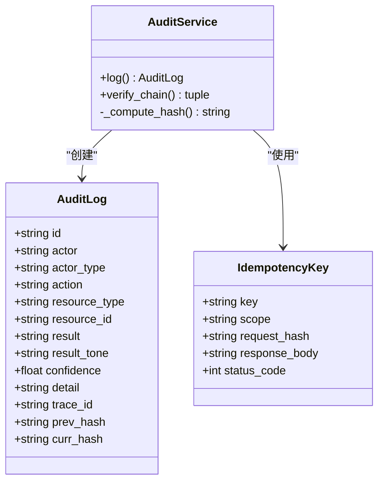

**图表来源**
- [backend/app/domains/audit/models.py:9-27](file://backend/app/domains/audit/models.py#L9-L27)
- [backend/app/services/audit_service.py:32-109](file://backend/app/services/audit_service.py#L32-L109)

**章节来源**
- [backend/app/services/audit_service.py:1-109](file://backend/app/services/audit_service.py#L1-L109)
- [backend/app/domains/audit/models.py:1-51](file://backend/app/domains/audit/models.py#L1-L51)

## 架构概览

### 整体架构设计

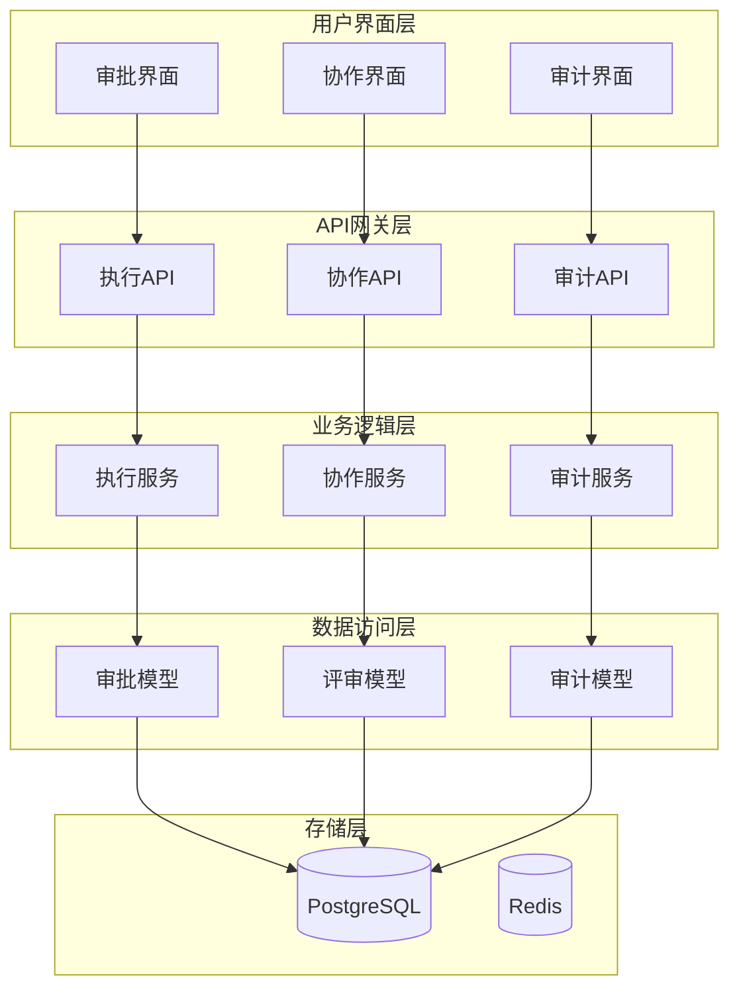

**图表来源**
- [backend/app/api/v1/execution.py:1-281](file://backend/app/api/v1/execution.py#L1-L281)
- [backend/app/api/v1/collaboration.py:1-112](file://backend/app/api/v1/collaboration.py#L1-L112)
- [backend/app/api/v1/audit.py:1-258](file://backend/app/api/v1/audit.py#L1-L258)

### 审批流程状态机

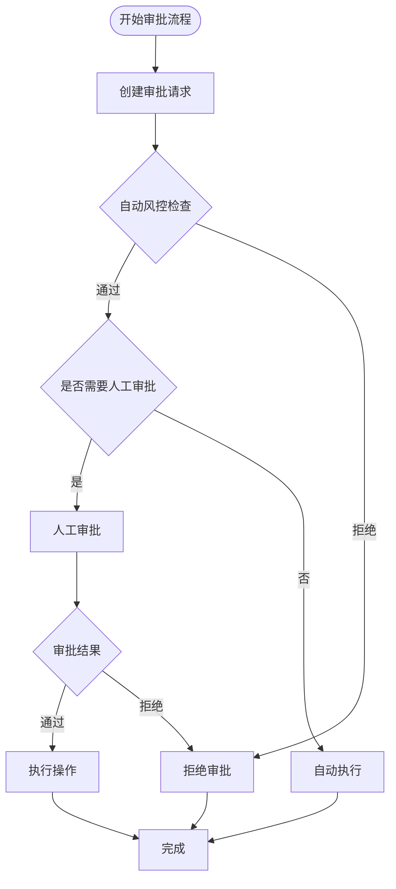

**图表来源**
- [doc/03-核心模块设计.md:533-552](file://doc/03-核心模块设计.md#L533-L552)

## 详细组件分析

### 执行中心审批组件

执行中心负责管理交易相关的审批流程，包括实时交易、模拟交易、加减仓等操作。

#### 审批请求数据模型

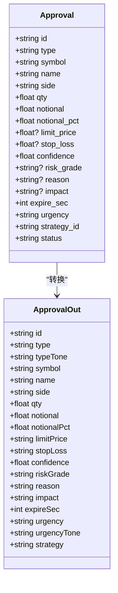

**图表来源**
- [backend/app/domains/execution/schemas.py:1-200](file://backend/app/domains/execution/schemas.py#L1-L200)

#### 审批界面实现

前端审批界面提供了直观的操作界面：

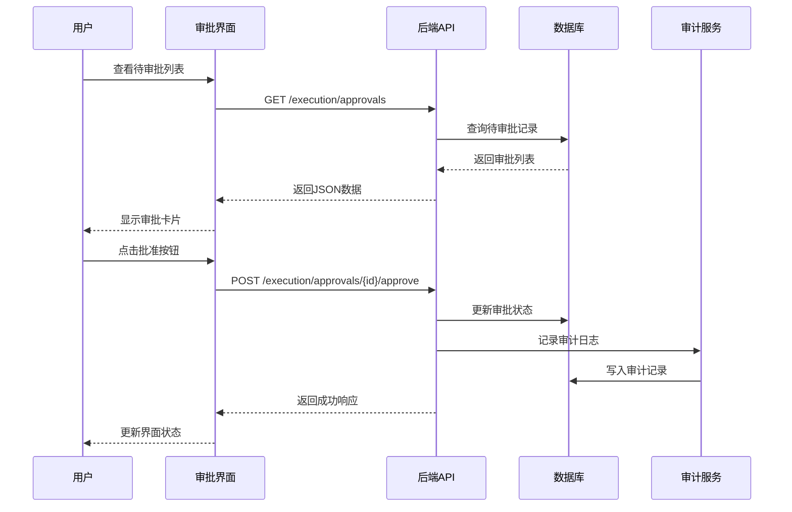

**图表来源**
- [frontend/src/screens/Execution/ApprovalQueue.tsx:40-138](file://frontend/src/screens/Execution/ApprovalQueue.tsx#L40-L138)
- [backend/app/api/v1/execution.py:223-281](file://backend/app/api/v1/execution.py#L223-L281)

**章节来源**
- [frontend/src/screens/Execution/ApprovalQueue.tsx:1-138](file://frontend/src/screens/Execution/ApprovalQueue.tsx#L1-L138)
- [backend/app/api/v1/execution.py:1-281](file://backend/app/api/v1/execution.py#L1-L281)

### 协作中心审批组件

协作中心专注于策略开发和上线过程中的审批管理。

#### 审批流程阶段定义

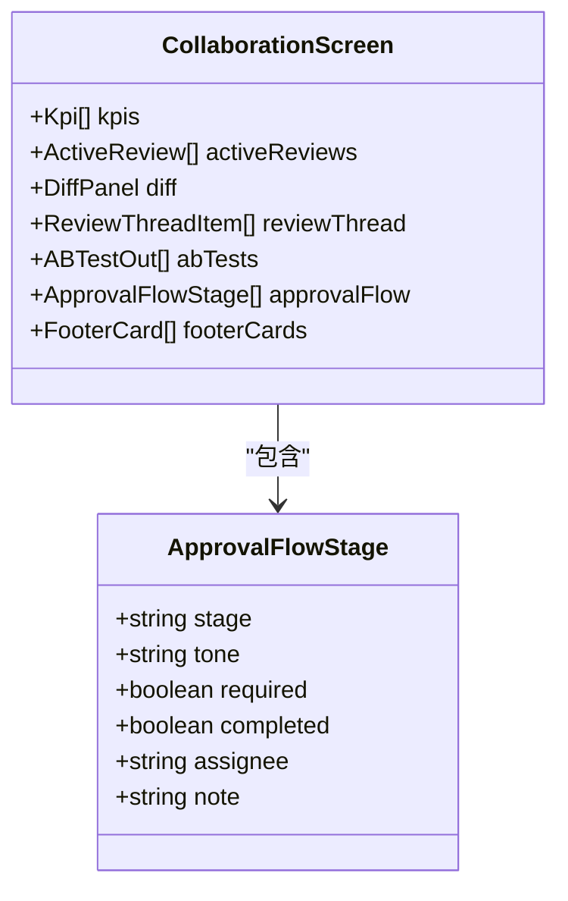

**图表来源**
- [backend/app/domains/collaboration/schemas.py:64-88](file://backend/app/domains/collaboration/schemas.py#L64-L88)

#### 审批流程界面

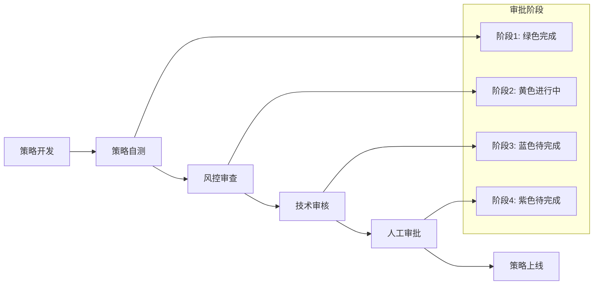

**图表来源**
- [frontend/src/screens/Collaboration/ApprovalFlow.tsx:1-40](file://frontend/src/screens/Collaboration/ApprovalFlow.tsx#L1-L40)

**章节来源**
- [frontend/src/screens/Collaboration/ApprovalFlow.tsx:1-40](file://frontend/src/screens/Collaboration/ApprovalFlow.tsx#L1-L40)
- [backend/app/domains/collaboration/schemas.py:64-88](file://backend/app/domains/collaboration/schemas.py#L64-L88)

### 审计与合规组件

审计系统提供了完整的合规追踪能力，确保所有操作都可追溯。

#### 审计日志数据模型

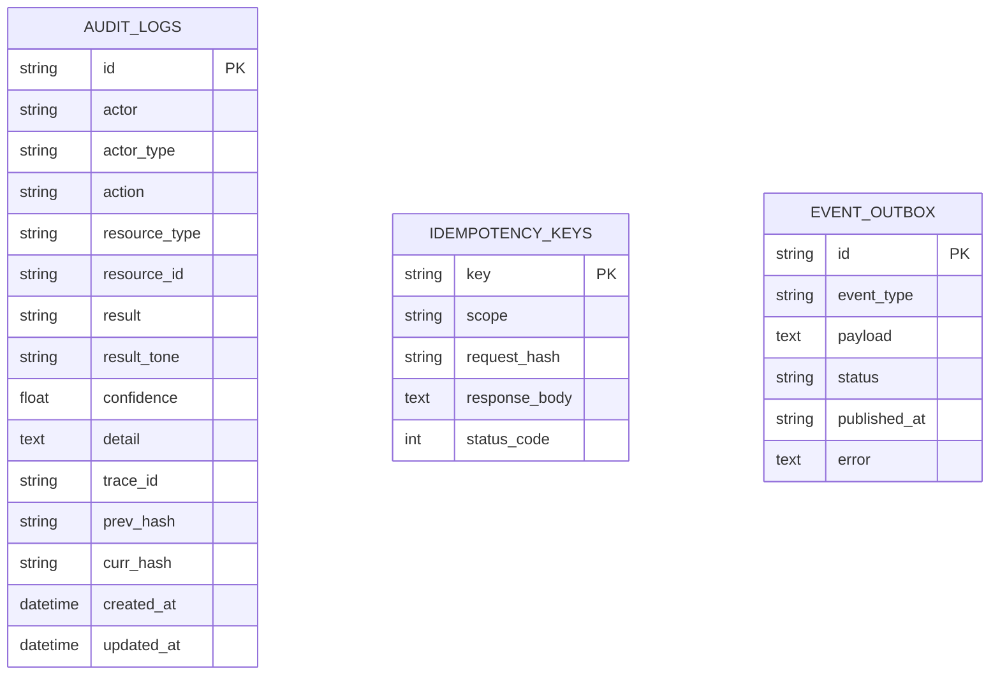

**图表来源**
- [backend/app/domains/audit/models.py:9-51](file://backend/app/domains/audit/models.py#L9-L51)

#### 审计界面实现

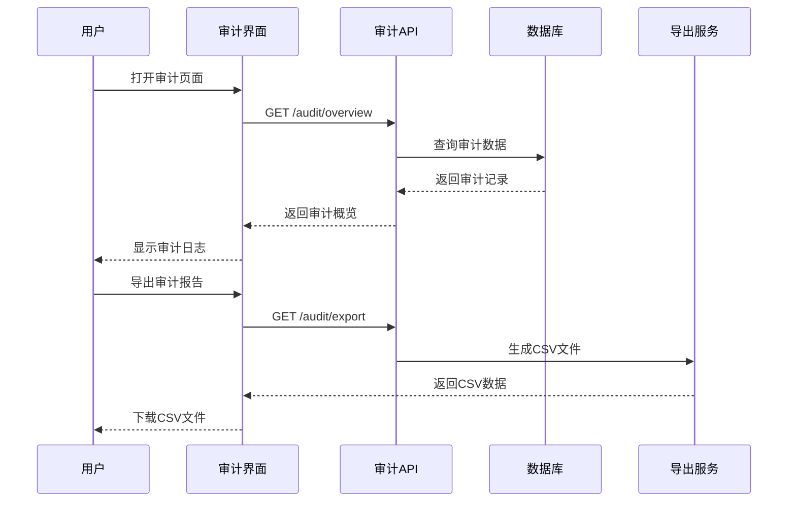

**图表来源**
- [frontend/src/screens/Audit/AuditLog.tsx:1-28](file://frontend/src/screens/Audit/AuditLog.tsx#L1-L28)
- [backend/app/api/v1/audit.py:215-245](file://backend/app/api/v1/audit.py#L215-L245)

**章节来源**
- [frontend/src/screens/Audit/AuditLog.tsx:1-28](file://frontend/src/screens/Audit/AuditLog.tsx#L1-L28)
- [frontend/src/screens/Audit/AuditHeader.tsx:1-34](file://frontend/src/screens/Audit/AuditHeader.tsx#L1-L34)
- [backend/app/api/v1/audit.py:1-258](file://backend/app/api/v1/audit.py#L1-L258)

## 依赖关系分析

### 组件间依赖关系

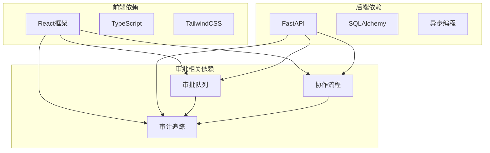

**图表来源**
- [backend/app/api/v1/execution.py:1-281](file://backend/app/api/v1/execution.py#L1-L281)
- [backend/app/api/v1/collaboration.py:1-112](file://backend/app/api/v1/collaboration.py#L1-L112)
- [backend/app/api/v1/audit.py:1-258](file://backend/app/api/v1/audit.py#L1-L258)

### 数据流依赖

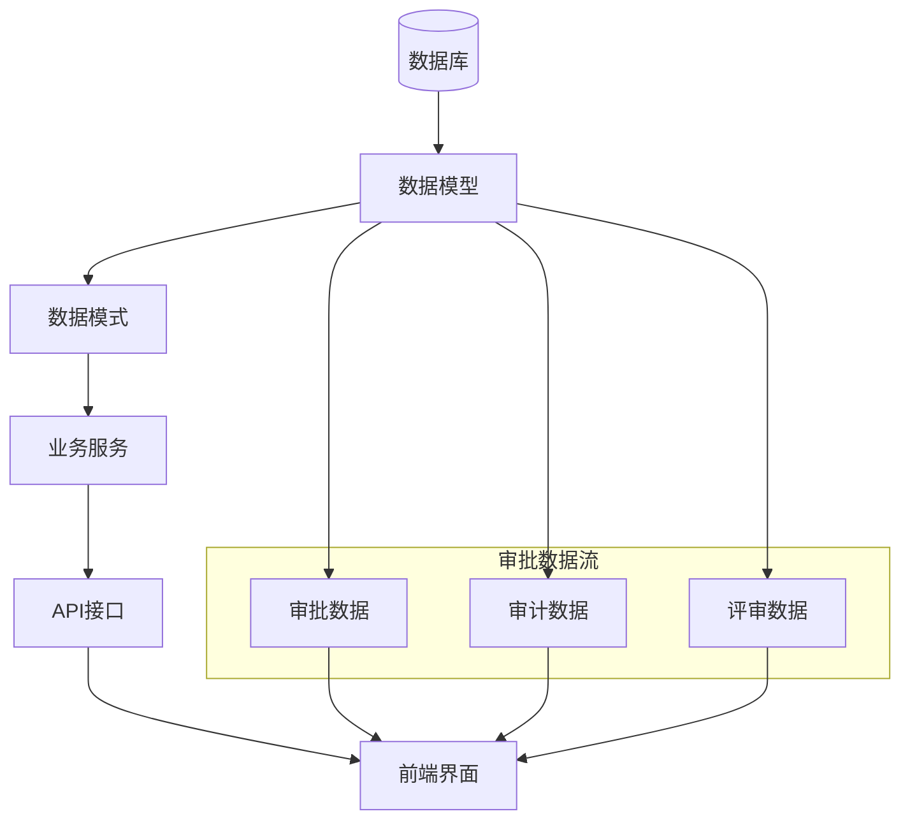

**图表来源**
- [backend/app/domains/audit/models.py:1-51](file://backend/app/domains/audit/models.py#L1-L51)
- [backend/app/domains/collaboration/models.py:1-44](file://backend/app/domains/collaboration/models.py#L1-L44)

**章节来源**
- [backend/app/domains/audit/models.py:1-51](file://backend/app/domains/audit/models.py#L1-L51)
- [backend/app/domains/collaboration/models.py:1-44](file://backend/app/domains/collaboration/models.py#L1-L44)

## 性能考虑

### 审批流程性能优化

系统在设计时充分考虑了性能优化：

1. **数据库查询优化**
   - 使用分页查询避免大量数据传输
   - 合理的索引设计支持高频查询
   - 异步数据库操作提升并发性能

2. **缓存策略**
   - 审计数据缓存减少数据库压力
   - 审批状态缓存提升响应速度
   - 配置数据缓存降低查询开销

3. **前端性能优化**
   - 虚拟滚动支持大量审批项显示
   - 懒加载减少初始渲染时间
   - 组件状态优化避免不必要的重渲染

### 审计系统的性能特性

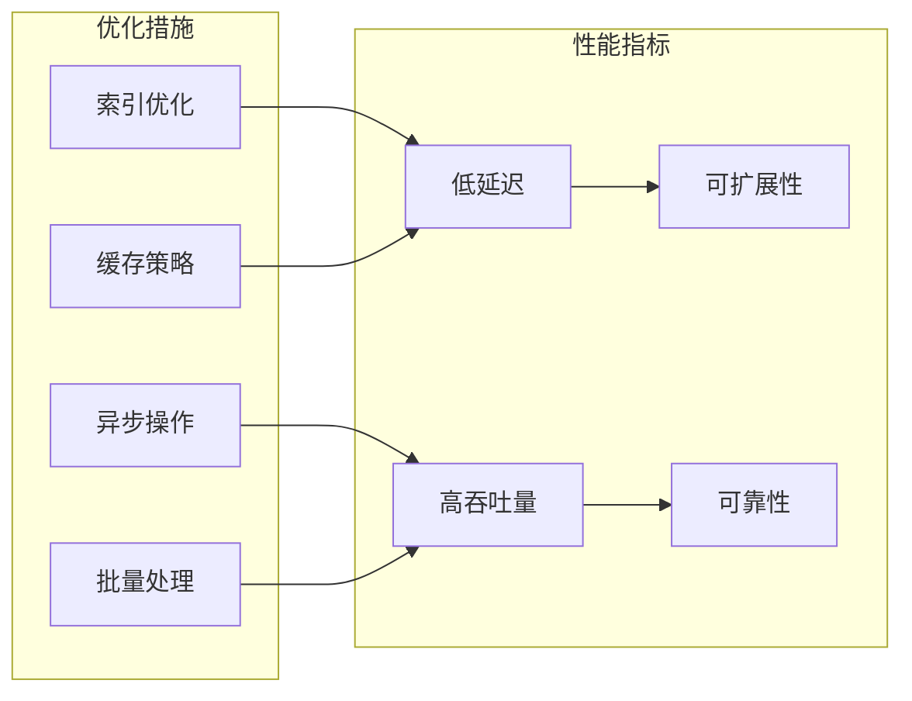

## 故障排除指南

### 常见问题诊断

#### 审批状态异常

当遇到审批状态异常时，可以按照以下步骤排查：

1. **检查数据库连接**
   - 验证数据库服务状态
   - 检查连接池配置
   - 确认网络连通性

2. **验证审批流程**
   - 检查审批状态转换逻辑
   - 验证超时机制
   - 确认权限控制

3. **审计日志检查**
   - 查看最近的审计记录
   - 验证哈希链完整性
   - 检查重复请求防护

#### 前端界面问题

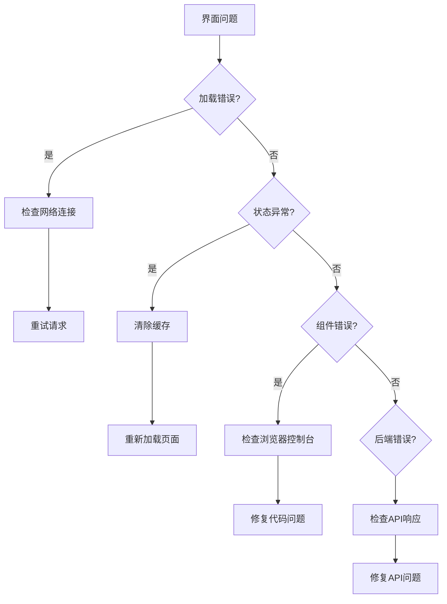

**图表来源**
- [frontend/src/screens/Execution/ApprovalQueue.tsx:1-138](file://frontend/src/screens/Execution/ApprovalQueue.tsx#L1-L138)

### 审计系统故障处理

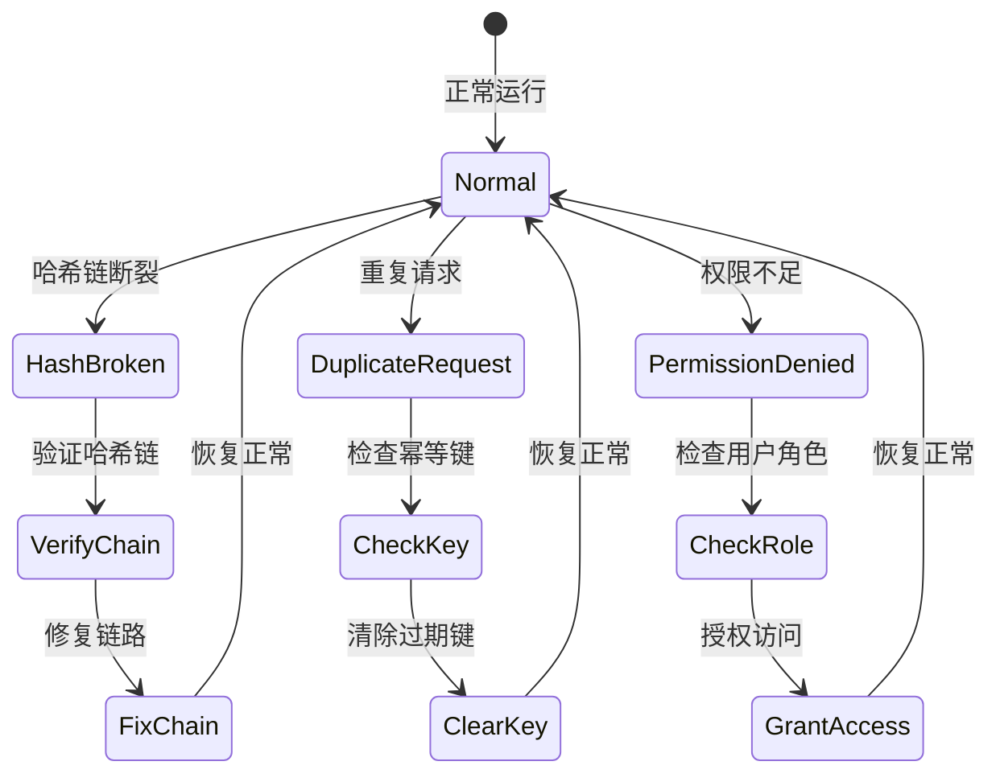

**图表来源**
- [backend/app/services/audit_service.py:83-109](file://backend/app/services/audit_service.py#L83-L109)

**章节来源**
- [backend/app/services/audit_service.py:1-109](file://backend/app/services/audit_service.py#L1-L109)

## 结论

审批流程管理系统通过模块化的设计和完善的架构，为量化交易系统提供了可靠的审批和审计能力。系统的主要特点包括：

1. **多场景支持**：涵盖交易审批、策略评审、系统配置等多个审批场景
2. **完整审计**：基于SHA-256的不可变审计日志，确保操作可追溯
3. **实时监控**：WebSocket推送机制实现实时状态更新
4. **权限控制**：基于角色的细粒度权限管理
5. **性能优化**：异步处理和缓存策略确保高并发性能

系统的设计充分考虑了金融行业的合规要求，为用户提供了一个安全、可靠、高效的审批管理平台。通过持续的优化和改进，该系统能够满足不断增长的业务需求和技术挑战。