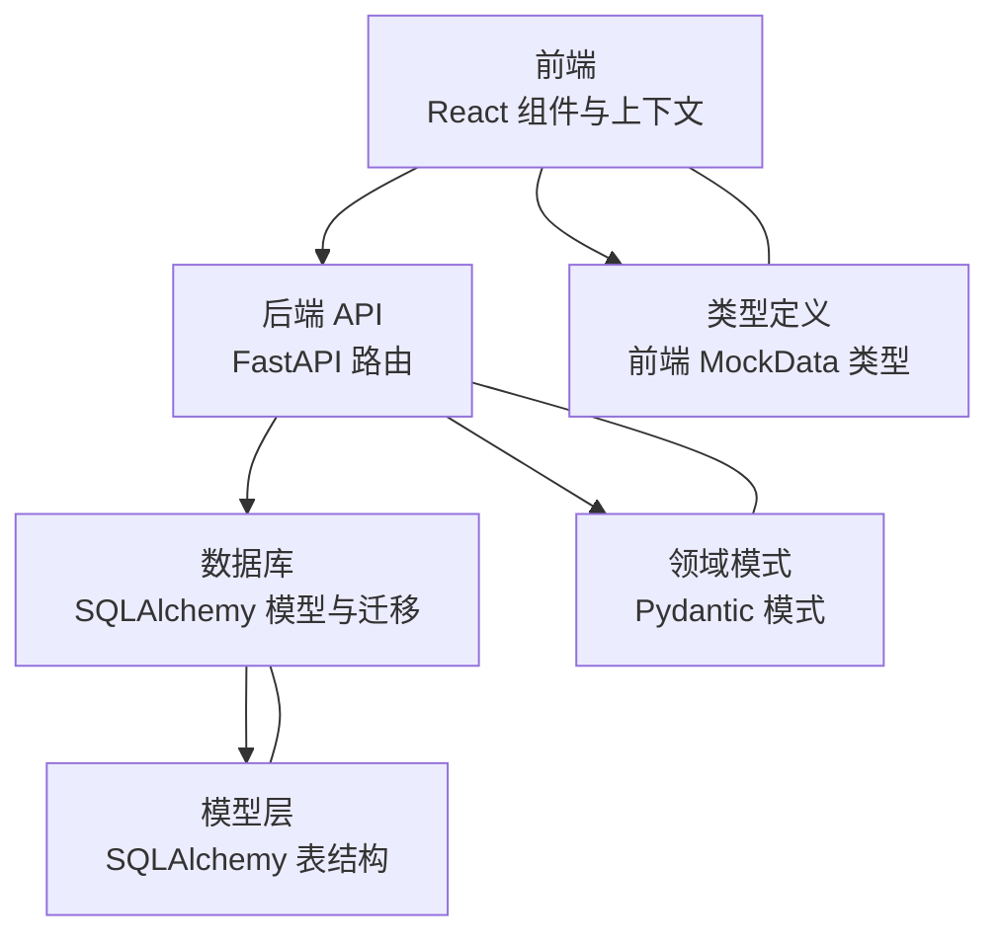
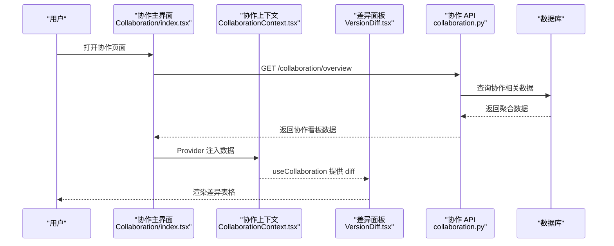
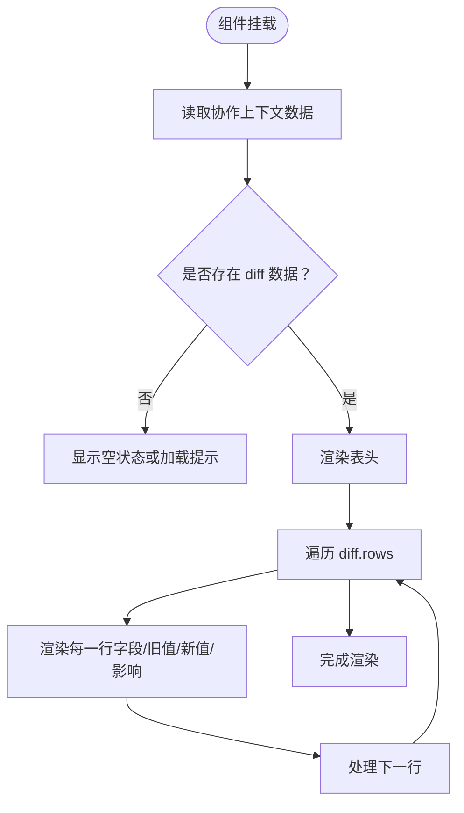
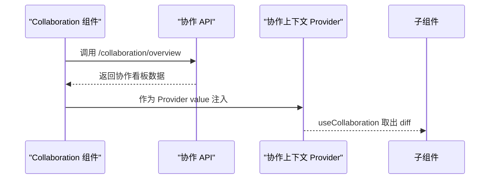
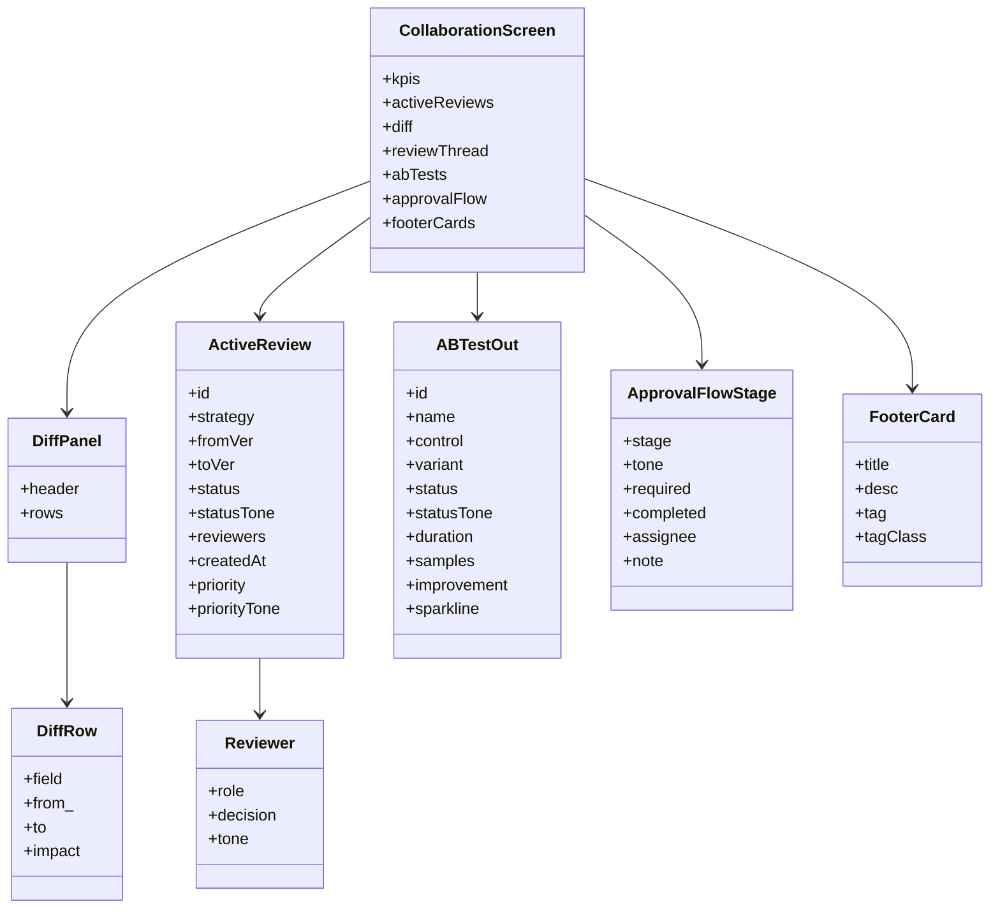
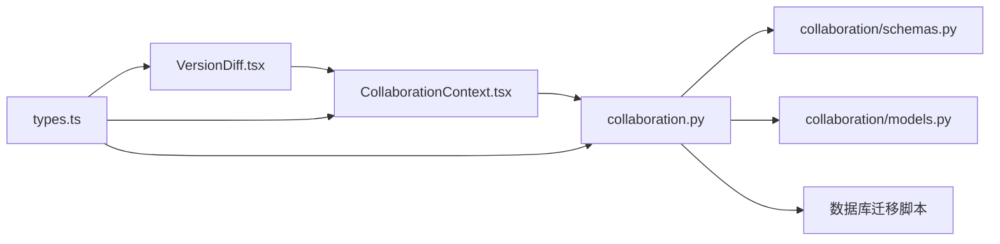

# 版本比较工具

<cite>
**本文档引用的文件**
- [VersionDiff.tsx](file://frontend/src/screens/Collaboration/VersionDiff.tsx)
- [Collaboration/index.tsx](file://frontend/src/screens/Collaboration/index.tsx)
- [CollaborationContext.tsx](file://frontend/src/contexts/CollaborationContext.tsx)
- [collaboration.py](file://backend/app/api/v1/collaboration.py)
- [schemas.py](file://backend/app/domains/collaboration/schemas.py)
- [models.py](file://backend/app/domains/collaboration/models.py)
- [types.ts](file://frontend/src/data/types.ts)
- [20260510_000002_strategy_and_agent_tables.py](file://backend/app/db/migrations/versions/20260510_000002_strategy_and_agent_tables.py)
- [20260513_000002_security_collaboration_explain.py](file://backend/app/db/migrations/versions/20260513_000002_security_collaboration_explain.py)
- [strategies.py](file://backend/app/api/v1/strategies.py)
- [StrategyDetailModal.tsx](file://frontend/src/screens/Strategy/StrategyDetailModal.tsx)
</cite>

## 目录
1. [简介](#简介)
2. [项目结构](#项目结构)
3. [核心组件](#核心组件)
4. [架构总览](#架构总览)
5. [详细组件分析](#详细组件分析)
6. [依赖关系分析](#依赖关系分析)
7. [性能考虑](#性能考虑)
8. [故障排除指南](#故障排除指南)
9. [结论](#结论)
10. [附录](#附录)

## 简介
本文件面向量化项目中的版本比较工具，系统性阐述策略版本差异分析、代码变更对比、影响评估与版本历史追踪的实现方案。文档覆盖差异检测算法思路、变更可视化展示、影响范围分析与版本合并策略建议，并结合前端界面实现、差异高亮显示、影响评估指标与版本历史管理，帮助开发者理解量化场景下的版本控制技术实现与变更管理流程。

## 项目结构
版本比较工具由前后端协同实现：
- 前端负责版本差异面板渲染、交互与状态管理（React + TypeScript）
- 后端提供协作与版本相关接口、数据模型与迁移脚本
- 数据类型在前端以强类型定义呈现，确保前后端契约一致

图表来源
- [Collaboration/index.tsx:18-46](file://frontend/src/screens/Collaboration/index.tsx#L18-L46)
- [collaboration.py:1-112](file://backend/app/api/v1/collaboration.py#L1-L112)
- [schemas.py:1-88](file://backend/app/domains/collaboration/schemas.py#L1-L88)
- [models.py:1-35](file://backend/app/domains/collaboration/models.py#L1-L35)
- [types.ts:560-619](file://frontend/src/data/types.ts#L560-L619)

章节来源
- [Collaboration/index.tsx:1-47](file://frontend/src/screens/Collaboration/index.tsx#L1-L47)
- [collaboration.py:1-112](file://backend/app/api/v1/collaboration.py#L1-L112)
- [schemas.py:1-88](file://backend/app/domains/collaboration/schemas.py#L1-L88)
- [models.py:1-35](file://backend/app/domains/collaboration/models.py#L1-L35)
- [types.ts:560-619](file://frontend/src/data/types.ts#L560-L619)

## 核心组件
- 版本差异面板（VersionDiff）：负责渲染差异表头、字段、旧值/新值与影响说明
- 协作主界面（Collaboration）：拉取协作总览数据并注入上下文
- 协作上下文（CollaborationContext）：提供 diff 数据给子组件使用
- 后端协作 API：提供协作看板数据（含差异面板、评审线程、A/B 测试、审批流等）
- 领域模式与模型：定义差异行、面板、评审、决策、A/B 测试等数据结构与持久化表
- 前端类型定义：统一 MockData 中 collaboration 字段的数据契约
- 策略版本模型：支持策略代码文本、参数模式、风控规则与版本状态存储

章节来源
- [VersionDiff.tsx:1-34](file://frontend/src/screens/Collaboration/VersionDiff.tsx#L1-L34)
- [Collaboration/index.tsx:1-47](file://frontend/src/screens/Collaboration/index.tsx#L1-L47)
- [CollaborationContext.tsx:1-13](file://frontend/src/contexts/CollaborationContext.tsx#L1-L13)
- [collaboration.py:1-112](file://backend/app/api/v1/collaboration.py#L1-L112)
- [schemas.py:1-88](file://backend/app/domains/collaboration/schemas.py#L1-L88)
- [models.py:1-35](file://backend/app/domains/collaboration/models.py#L1-L35)
- [types.ts:560-619](file://frontend/src/data/types.ts#L560-L619)
- [20260510_000002_strategy_and_agent_tables.py:58-83](file://backend/app/db/migrations/versions/20260510_000002_strategy_and_agent_tables.py#L58-L83)
- [20260513_000002_security_collaboration_explain.py:78-109](file://backend/app/db/migrations/versions/20260513_000002_security_collaboration_explain.py#L78-L109)

## 架构总览
版本比较工具采用“前端展示 + 后端聚合”的架构：
- 前端通过协作主界面发起 API 请求，获取协作看板数据
- 后端返回包含差异面板在内的聚合数据，前端使用上下文将数据传递给差异面板组件
- 差异面板组件仅负责渲染，不参与业务逻辑计算，便于扩展其他差异源（如代码对比）

图表来源
- [Collaboration/index.tsx:21-25](file://frontend/src/screens/Collaboration/index.tsx#L21-L25)
- [CollaborationContext.tsx:8-12](file://frontend/src/contexts/CollaborationContext.tsx#L8-L12)
- [VersionDiff.tsx:3-5](file://frontend/src/screens/Collaboration/VersionDiff.tsx#L3-L5)
- [collaboration.py:94-105](file://backend/app/api/v1/collaboration.py#L94-L105)

章节来源
- [Collaboration/index.tsx:18-46](file://frontend/src/screens/Collaboration/index.tsx#L18-L46)
- [CollaborationContext.tsx:1-13](file://frontend/src/contexts/CollaborationContext.tsx#L1-L13)
- [VersionDiff.tsx:1-34](file://frontend/src/screens/Collaboration/VersionDiff.tsx#L1-L34)
- [collaboration.py:94-105](file://backend/app/api/v1/collaboration.py#L94-L105)

## 详细组件分析

### 版本差异面板（VersionDiff）
- 职责：接收协作上下文中的 diff 数据，渲染差异表头与行
- 关键点：
  - 表头包含“变更项”“旧值”“新值”“影响”
  - 行内容来自 diff.rows，每行包含字段名、旧值、新值与影响说明
  - 使用 React hooks 从上下文中读取数据，保证组件解耦

图表来源
- [VersionDiff.tsx:3-32](file://frontend/src/screens/Collaboration/VersionDiff.tsx#L3-L32)

章节来源
- [VersionDiff.tsx:1-34](file://frontend/src/screens/Collaboration/VersionDiff.tsx#L1-L34)

### 协作主界面（Collaboration）
- 职责：拉取协作看板数据并注入上下文，组织布局与子组件
- 关键点：
  - 使用 useEffect 在挂载时调用协作 API 获取数据
  - 将数据通过 Provider 注入到子组件可使用

图表来源
- [Collaboration/index.tsx:21-25](file://frontend/src/screens/Collaboration/index.tsx#L21-L25)
- [Collaboration/index.tsx:30-31](file://frontend/src/screens/Collaboration/index.tsx#L30-L31)

章节来源
- [Collaboration/index.tsx:1-47](file://frontend/src/screens/Collaboration/index.tsx#L1-L47)

### 协作上下文（CollaborationContext）
- 职责：提供协作数据的全局访问能力
- 关键点：
  - 使用 React createContext 创建上下文
  - 提供 useCollaboration hook，避免重复写 Provider 包裹

章节来源
- [CollaborationContext.tsx:1-13](file://frontend/src/contexts/CollaborationContext.tsx#L1-L13)

### 后端协作 API（collaboration.py）
- 职责：提供协作看板数据接口，包括 KPI、活动评审、差异面板、评审线程、A/B 测试、审批流与页脚卡片
- 关键点：
  - 定义了 DiffPanel、DiffRow、ActiveReview、Reviewer、ABTestOut、ApprovalFlowStage、FooterCard 等模式
  - 提供 /collaboration/overview 接口返回完整的协作看板数据
  - 提供 /reviews/{review_id}/approve 审批接口示例

图表来源
- [collaboration.py:22-105](file://backend/app/api/v1/collaboration.py#L22-L105)
- [schemas.py:6-88](file://backend/app/domains/collaboration/schemas.py#L6-L88)

章节来源
- [collaboration.py:1-112](file://backend/app/api/v1/collaboration.py#L1-L112)
- [schemas.py:1-88](file://backend/app/domains/collaboration/schemas.py#L1-L88)

### 领域模式与模型（collaboration/schemas.py 与 collaboration/models.py）
- 职责：定义协作领域的数据结构与持久化表
- 关键点：
  - Pydantic 模式用于 API 响应与校验
  - SQLAlchemy 模型用于数据库表结构（如 strategy_reviews、reviewer_decisions、ab_tests）

章节来源
- [schemas.py:1-88](file://backend/app/domains/collaboration/schemas.py#L1-L88)
- [models.py:1-35](file://backend/app/domains/collaboration/models.py#L1-L35)
- [20260513_000002_security_collaboration_explain.py:78-109](file://backend/app/db/migrations/versions/20260513_000002_security_collaboration_explain.py#L78-L109)

### 前端类型定义（types.ts）
- 职责：定义 MockData 中 collaboration 字段的结构，确保前端组件消费数据的一致性
- 关键点：
  - collaboration.kpis、activeReviews、diff、reviewThread、abTests、approvalFlow、footerCards 的字段与类型

章节来源
- [types.ts:560-619](file://frontend/src/data/types.ts#L560-L619)

### 策略版本模型与差异检测（策略代码文本与版本）
- 职责：支持策略版本的代码文本、参数模式、风控规则与状态存储，为差异检测提供数据基础
- 关键点：
  - strategy_versions 表包含 code_text、params_schema、risk_rules 等字段
  - 通过策略详情接口可获取版本代码文本，为后续代码级差异检测提供输入

章节来源
- [20260510_000002_strategy_and_agent_tables.py:58-83](file://backend/app/db/migrations/versions/20260510_000002_strategy_and_agent_tables.py#L58-L83)
- [strategies.py:101-110](file://backend/app/api/v1/strategies.py#L101-L110)
- [StrategyDetailModal.tsx](file://frontend/src/screens/Strategy/StrategyDetailModal.tsx#L88)

## 依赖关系分析
- 前端组件依赖协作上下文提供数据；协作主界面依赖 API 获取数据；API 依赖数据库模型与模式
- 前端类型定义约束了协作数据结构，确保前后端契约一致
- 策略版本模型为差异检测提供代码文本与参数等原始数据

图表来源
- [VersionDiff.tsx:1-34](file://frontend/src/screens/Collaboration/VersionDiff.tsx#L1-L34)
- [CollaborationContext.tsx:1-13](file://frontend/src/contexts/CollaborationContext.tsx#L1-L13)
- [Collaboration/index.tsx:1-47](file://frontend/src/screens/Collaboration/index.tsx#L1-L47)
- [collaboration.py:1-112](file://backend/app/api/v1/collaboration.py#L1-L112)
- [schemas.py:1-88](file://backend/app/domains/collaboration/schemas.py#L1-L88)
- [models.py:1-35](file://backend/app/domains/collaboration/models.py#L1-L35)
- [types.ts:560-619](file://frontend/src/data/types.ts#L560-L619)

章节来源
- [VersionDiff.tsx:1-34](file://frontend/src/screens/Collaboration/VersionDiff.tsx#L1-L34)
- [CollaborationContext.tsx:1-13](file://frontend/src/contexts/CollaborationContext.tsx#L1-L13)
- [Collaboration/index.tsx:1-47](file://frontend/src/screens/Collaboration/index.tsx#L1-L47)
- [collaboration.py:1-112](file://backend/app/api/v1/collaboration.py#L1-L112)
- [schemas.py:1-88](file://backend/app/domains/collaboration/schemas.py#L1-L88)
- [models.py:1-35](file://backend/app/domains/collaboration/models.py#L1-L35)
- [types.ts:560-619](file://frontend/src/data/types.ts#L560-L619)

## 性能考虑
- 前端渲染：差异面板按需渲染，避免不必要的重绘；建议对大列表使用虚拟滚动
- API 调用：协作主界面仅在挂载时请求一次数据；若数据频繁变化，可在路由层加入缓存或轮询策略
- 数据结构：使用扁平化数据结构（如 diff.rows）便于快速渲染与增量更新
- 数据库查询：协作 API 应尽量合并查询，减少往返次数；对高频字段建立索引（如 strategy_reviews.strategy_id）

## 故障排除指南
- 差异面板为空：检查协作 API 是否正确返回 diff；确认上下文 Provider 是否包裹子组件
- 类型不匹配：核对 types.ts 中 collaboration 结构与后端 schemas.py 是否一致
- 审批接口异常：确认 review_id 是否存在且状态允许审批；检查后端路由与权限

章节来源
- [Collaboration/index.tsx:21-25](file://frontend/src/screens/Collaboration/index.tsx#L21-L25)
- [CollaborationContext.tsx:8-12](file://frontend/src/contexts/CollaborationContext.tsx#L8-L12)
- [collaboration.py:108-112](file://backend/app/api/v1/collaboration.py#L108-L112)
- [types.ts:560-619](file://frontend/src/data/types.ts#L560-L619)

## 结论
版本比较工具通过清晰的前后端职责划分与强类型契约，实现了策略版本差异的可视化展示与协作评审流程的集成。当前实现聚焦于“字段级差异”与“影响说明”的展示；未来可扩展至“代码级差异检测”，利用策略版本表中的代码文本进行逐行比对与高亮显示，进一步完善量化项目的版本控制与变更管理能力。

## 附录

### 差异检测算法思路（代码级）
- 输入：两个策略版本的代码文本（来自策略版本表）
- 步骤：
  1) 文本预处理：标准化缩进、空白字符与注释
  2) 分词/分句：按行或按语法单元切分
  3) 对比策略：采用编辑距离或 LCS 算法识别增删改
  4) 结果输出：生成“新增/删除/修改”的变更块，标注影响范围与风险级别
- 复杂度：时间复杂度 O(mn)，空间复杂度 O(mn)，适合中小规模策略代码
- 优化：对超大文件采用分块对比与缓存热点变更

### 影响评估指标
- 量化指标：回测收益变化、最大回撤、夏普比率、换手率
- 质化指标：过滤条件变更、止盈止损策略调整、参数敏感性
- 风险等级：低/中/高，依据影响指标阈值与历史波动率确定

### 版本合并策略
- 自动合并：无冲突的参数/注释/格式变更可自动合并
- 冲突处理：冲突时保留“新版本”，并记录冲突原因与人工复核
- 回滚机制：每次合并生成快照，支持一键回滚至上一版本