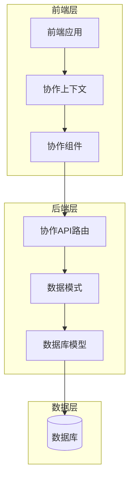
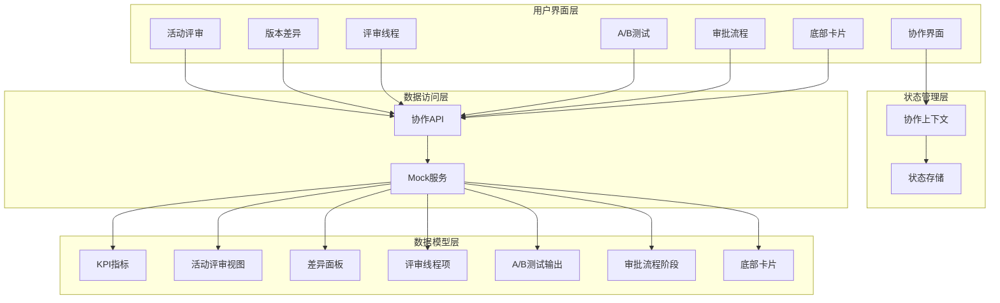
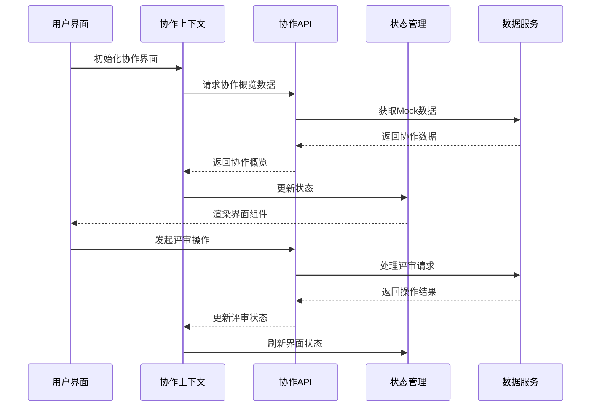
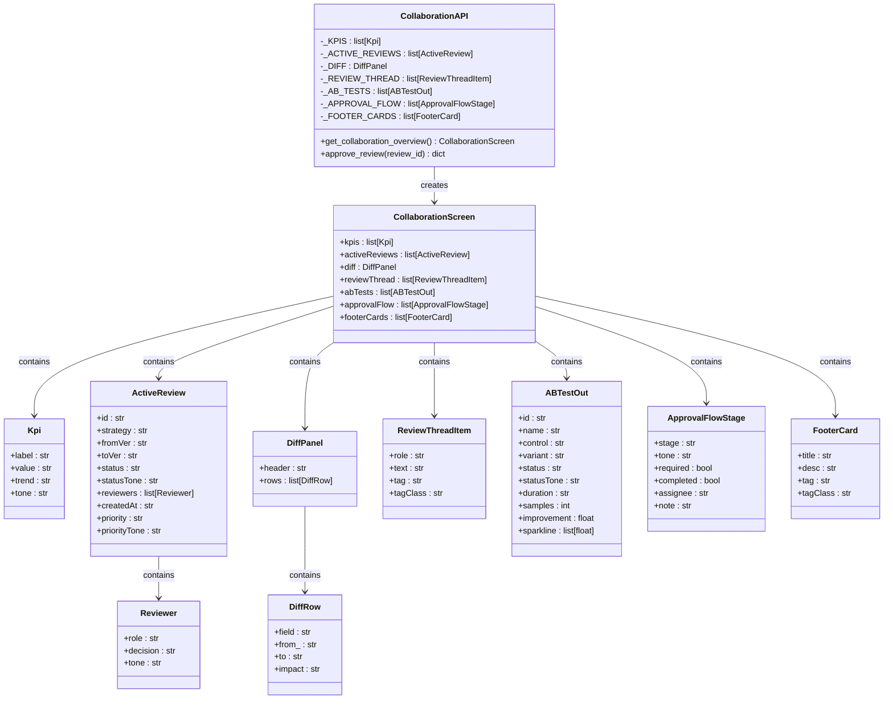
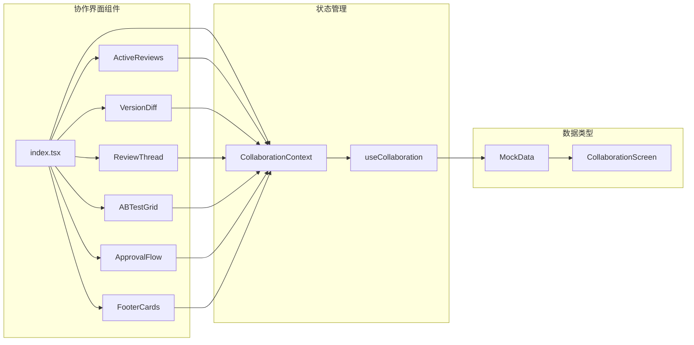
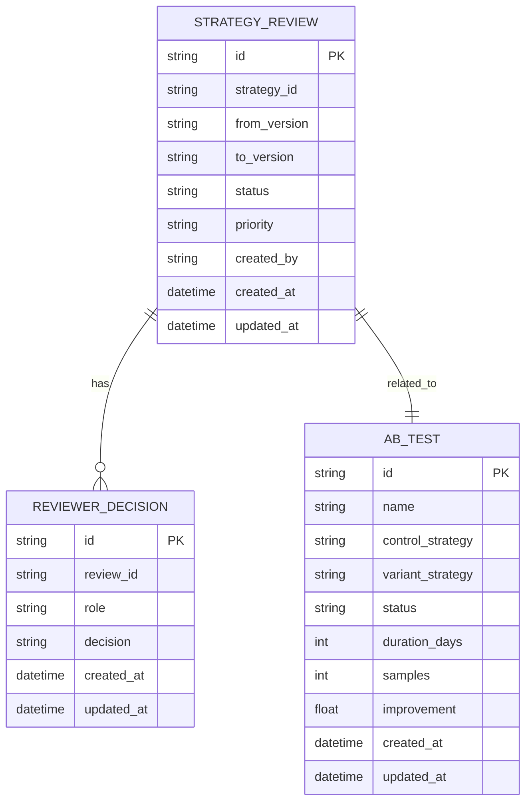
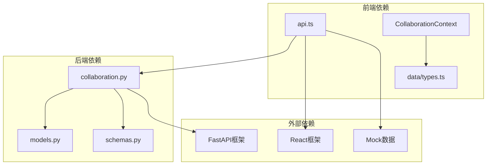
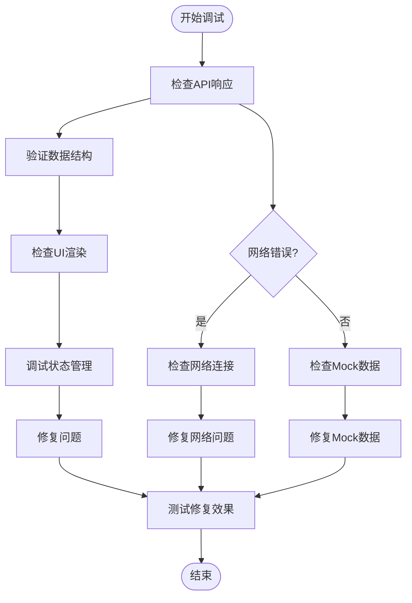

# 评审讨论系统

<cite>
**本文档引用的文件**
- [backend/app/domains/collaboration/models.py](file://backend/app/domains/collaboration/models.py)
- [backend/app/domains/collaboration/schemas.py](file://backend/app/domains/collaboration/schemas.py)
- [backend/app/api/v1/collaboration.py](file://backend/app/api/v1/collaboration.py)
- [frontend/src/screens/Collaboration/index.tsx](file://frontend/src/screens/Collaboration/index.tsx)
- [frontend/src/contexts/CollaborationContext.tsx](file://frontend/src/contexts/CollaborationContext.tsx)
- [frontend/src/screens/Collaboration/ActiveReviews.tsx](file://frontend/src/screens/Collaboration/ActiveReviews.tsx)
- [frontend/src/screens/Collaboration/ReviewThread.tsx](file://frontend/src/screens/Collaboration/ReviewThread.tsx)
- [frontend/src/screens/Collaboration/VersionDiff.tsx](file://frontend/src/screens/Collaboration/VersionDiff.tsx)
- [frontend/src/screens/Collaboration/ABTestGrid.tsx](file://frontend/src/screens/Collaboration/ABTestGrid.tsx)
- [frontend/src/screens/Collaboration/ApprovalFlow.tsx](file://frontend/src/screens/Collaboration/ApprovalFlow.tsx)
- [frontend/src/screens/Collaboration/FooterCards.tsx](file://frontend/src/screens/Collaboration/FooterCards.tsx)
- [frontend/src/lib/api.ts](file://frontend/src/lib/api.ts)
- [frontend/src/data/types.ts](file://frontend/src/data/types.ts)
</cite>

## 目录
1. [简介](#简介)
2. [项目结构](#项目结构)
3. [核心组件](#核心组件)
4. [架构概览](#架构概览)
5. [详细组件分析](#详细组件分析)
6. [依赖分析](#依赖分析)
7. [性能考虑](#性能考虑)
8. [故障排除指南](#故障排除指南)
9. [结论](#结论)

## 简介

评审讨论系统是量化项目中的协作管理平台，负责策略版本评审、评论讨论、A/B测试和审批流程的统一管理。该系统实现了完整的评审生命周期管理，包括评审请求创建、多方评审决策、讨论追踪、状态同步和结果汇总。

系统采用前后端分离架构，后端使用FastAPI提供RESTful API，前端使用React构建用户界面，通过Mock数据模拟真实业务场景。评审系统支持多种评审状态（待评审、评审中、已通过、已驳回），并提供可视化的评审进度追踪和讨论历史记录。

## 项目结构

评审讨论系统的项目结构遵循清晰的分层架构设计：

**图表来源**
- [frontend/src/screens/Collaboration/index.tsx:18-46](file://frontend/src/screens/Collaboration/index.tsx#L18-L46)
- [backend/app/api/v1/collaboration.py:20-20](file://backend/app/api/v1/collaboration.py#L20-L20)

**章节来源**
- [frontend/src/screens/Collaboration/index.tsx:1-47](file://frontend/src/screens/Collaboration/index.tsx#L1-L47)
- [backend/app/api/v1/collaboration.py:1-112](file://backend/app/api/v1/collaboration.py#L1-L112)

## 核心组件

评审讨论系统由以下核心组件构成：

### 数据模型层
- **StrategyReview**: 策略版本评审请求模型
- **ReviewerDecision**: 评审员决策模型  
- **ABTest**: A/B测试实验模型

### API接口层
- **协作API路由**: 提供评审概览、评审审批等接口
- **Mock数据服务**: 模拟后端数据响应

### 前端界面层
- **协作面板**: 主界面容器组件
- **活动评审列表**: 显示当前活跃的评审任务
- **版本差异对比**: 展示策略版本变更详情
- **评审讨论线程**: 记录评审过程中的讨论内容
- **A/B测试网格**: 展示A/B测试实验状态
- **审批流程**: 追踪策略上线审批进度

**章节来源**
- [backend/app/domains/collaboration/models.py:9-44](file://backend/app/domains/collaboration/models.py#L9-L44)
- [backend/app/domains/collaboration/schemas.py:6-88](file://backend/app/domains/collaboration/schemas.py#L6-L88)
- [backend/app/api/v1/collaboration.py:94-112](file://backend/app/api/v1/collaboration.py#L94-L112)

## 架构概览

评审讨论系统采用分层架构设计，实现了清晰的关注点分离：

**图表来源**
- [frontend/src/screens/Collaboration/index.tsx:29-44](file://frontend/src/screens/Collaboration/index.tsx#L29-L44)
- [frontend/src/contexts/CollaborationContext.tsx:4-12](file://frontend/src/contexts/CollaborationContext.tsx#L4-L12)
- [backend/app/api/v1/collaboration.py:94-105](file://backend/app/api/v1/collaboration.py#L94-L105)

系统的核心交互流程如下：

**图表来源**
- [frontend/src/screens/Collaboration/index.tsx:21-25](file://frontend/src/screens/Collaboration/index.tsx#L21-L25)
- [frontend/src/lib/api.ts:723-726](file://frontend/src/lib/api.ts#L723-L726)

## 详细组件分析

### 协作API服务

协作API服务提供了完整的评审讨论功能接口：

**图表来源**
- [backend/app/api/v1/collaboration.py:94-105](file://backend/app/api/v1/collaboration.py#L94-L105)
- [backend/app/domains/collaboration/schemas.py:19-88](file://backend/app/domains/collaboration/schemas.py#L19-L88)

协作API的主要功能包括：

1. **协作概览数据获取**: 返回完整的协作面板数据，包括KPI指标、活动评审、版本差异、评审线程、A/B测试和审批流程
2. **评审审批操作**: 处理评审员对策略版本的审批请求
3. **Mock数据管理**: 提供预定义的演示数据，支持评审流程的可视化展示

**章节来源**
- [backend/app/api/v1/collaboration.py:22-105](file://backend/app/api/v1/collaboration.py#L22-L105)

### 前端协作界面

协作界面采用模块化设计，每个组件负责特定的功能领域：

**图表来源**
- [frontend/src/screens/Collaboration/index.tsx:1-16](file://frontend/src/screens/Collaboration/index.tsx#L1-L16)
- [frontend/src/contexts/CollaborationContext.tsx:1-13](file://frontend/src/contexts/CollaborationContext.tsx#L1-L13)

各组件的具体职责：

1. **ActiveReviews组件**: 展示当前活跃的评审任务，包括评审状态、优先级和评审员决策
2. **VersionDiff组件**: 显示策略版本间的变更对比，突出重要的功能改进
3. **ReviewThread组件**: 记录评审过程中的讨论历史，支持多方协作沟通
4. **ABTestGrid组件**: 展示A/B测试实验的状态和结果，提供可视化的时间序列数据
5. **ApprovalFlow组件**: 追踪策略上线的审批流程，显示各阶段的完成情况
6. **FooterCards组件**: 提供评审规范和指导信息

**章节来源**
- [frontend/src/screens/Collaboration/ActiveReviews.tsx:16-61](file://frontend/src/screens/Collaboration/ActiveReviews.tsx#L16-L61)
- [frontend/src/screens/Collaboration/VersionDiff.tsx:3-33](file://frontend/src/screens/Collaboration/VersionDiff.tsx#L3-L33)
- [frontend/src/screens/Collaboration/ReviewThread.tsx:3-33](file://frontend/src/screens/Collaboration/ReviewThread.tsx#L3-L33)
- [frontend/src/screens/Collaboration/ABTestGrid.tsx:32-76](file://frontend/src/screens/Collaboration/ABTestGrid.tsx#L32-L76)
- [frontend/src/screens/Collaboration/ApprovalFlow.tsx:3-40](file://frontend/src/screens/Collaboration/ApprovalFlow.tsx#L3-L40)
- [frontend/src/screens/Collaboration/FooterCards.tsx:3-18](file://frontend/src/screens/Collaboration/FooterCards.tsx#L3-L18)

### 数据模型设计

评审讨论系统的数据模型设计体现了清晰的领域分离：

**图表来源**
- [backend/app/domains/collaboration/models.py:9-44](file://backend/app/domains/collaboration/models.py#L9-L44)

数据模型的关键特性：

1. **评审状态管理**: 支持四种评审状态（pending、in_review、approved、rejected）
2. **优先级控制**: 提供高、中、低三种优先级级别
3. **多方评审**: 支持不同角色的评审员参与决策过程
4. **A/B测试集成**: 将实验设计与评审流程相结合

**章节来源**
- [backend/app/domains/collaboration/models.py:9-44](file://backend/app/domains/collaboration/models.py#L9-L44)

## 依赖分析

评审讨论系统的依赖关系相对简单，主要体现在前后端的数据交互：

**图表来源**
- [frontend/src/lib/api.ts:723-726](file://frontend/src/lib/api.ts#L723-L726)
- [backend/app/api/v1/collaboration.py:3-18](file://backend/app/api/v1/collaboration.py#L3-L18)

系统的主要依赖特点：

1. **前后端解耦**: 通过RESTful API实现松耦合的数据交换
2. **Mock数据支持**: 前端提供完整的Mock数据，便于开发和测试
3. **类型安全**: 使用TypeScript确保数据类型的正确性
4. **状态管理**: 通过Context API实现组件间的状态共享

**章节来源**
- [frontend/src/lib/api.ts:1-779](file://frontend/src/lib/api.ts#L1-L779)
- [backend/app/api/v1/collaboration.py:1-112](file://backend/app/api/v1/collaboration.py#L1-L112)

## 性能考虑

评审讨论系统在设计时充分考虑了性能优化：

### 前端性能优化
- **组件懒加载**: 评审界面组件按需加载，减少初始渲染时间
- **状态缓存**: 使用React Context缓存协作数据，避免重复请求
- **虚拟滚动**: 对于大量评审记录，可采用虚拟滚动技术提升渲染性能
- **防抖处理**: 对频繁的UI交互进行防抖处理，减少不必要的重新渲染

### 后端性能优化
- **数据预加载**: 协作概览接口一次性返回所有必要数据，减少往返次数
- **Mock数据优化**: 使用内存中的Mock数据，避免数据库查询开销
- **响应式设计**: 支持移动端和桌面端的自适应布局，提升用户体验

### 数据传输优化
- **JSON序列化**: 使用高效的JSON序列化格式传输数据
- **压缩传输**: 支持Gzip压缩，减少网络传输时间
- **缓存策略**: 实现合理的缓存策略，避免重复数据传输

## 故障排除指南

### 常见问题及解决方案

1. **数据加载失败**
   - 检查API连接状态
   - 验证Mock数据服务是否正常运行
   - 确认网络连接和防火墙设置

2. **评审状态不同步**
   - 检查评审审批接口调用
   - 验证状态更新逻辑
   - 确认数据库事务处理

3. **界面渲染异常**
   - 检查React组件状态管理
   - 验证Context Provider配置
   - 确认数据类型匹配

### 调试工具和技巧

**图表来源**
- [frontend/src/lib/api.ts:32-43](file://frontend/src/lib/api.ts#L32-L43)

**章节来源**
- [frontend/src/lib/api.ts:27-43](file://frontend/src/lib/api.ts#L27-L43)

## 结论

评审讨论系统是一个功能完整、架构清晰的协作管理平台。系统通过前后端分离的设计，实现了评审流程的数字化管理，支持多方协作和实时沟通。

系统的主要优势包括：

1. **完整的评审生命周期**: 从评审请求到结果汇总的全流程管理
2. **可视化界面设计**: 直观的界面布局和丰富的数据展示
3. **灵活的状态管理**: 支持多种评审状态和决策类型
4. **扩展性强**: 模块化设计便于功能扩展和维护

未来可以考虑的功能增强方向：

1. **实时通信**: 集成WebSocket实现实时评审讨论
2. **权限控制**: 增强用户权限管理和数据安全
3. **工作流引擎**: 集成更复杂的工作流管理
4. **通知系统**: 实现邮件和消息推送功能

该系统为量化项目中的策略评审提供了可靠的协作平台，有助于提升团队协作效率和决策质量。