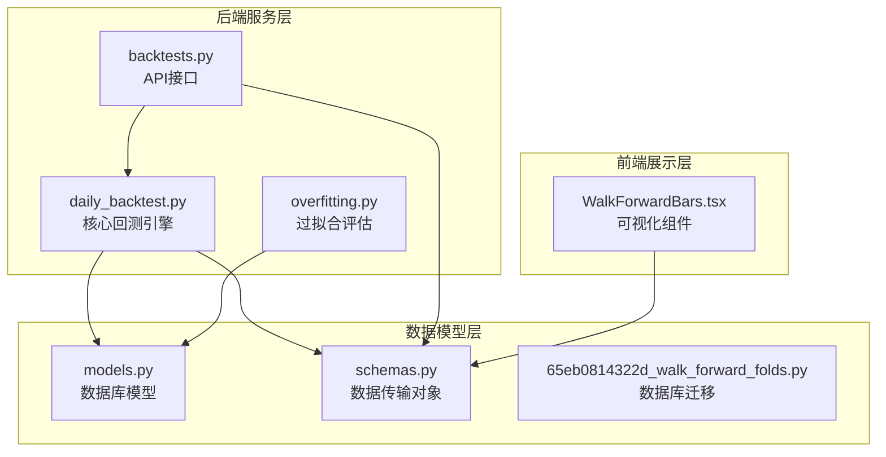
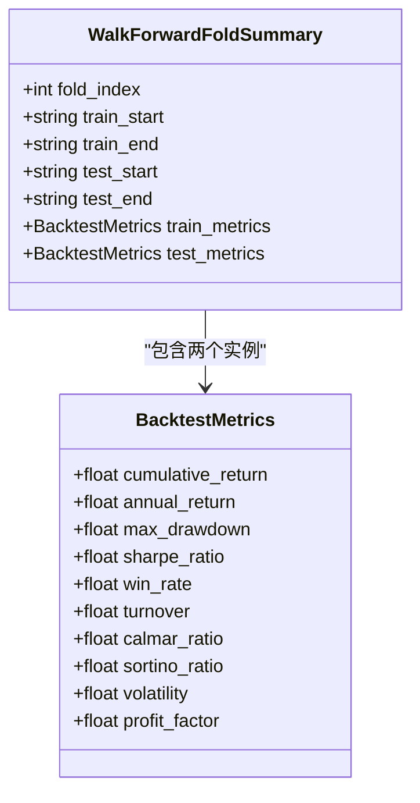
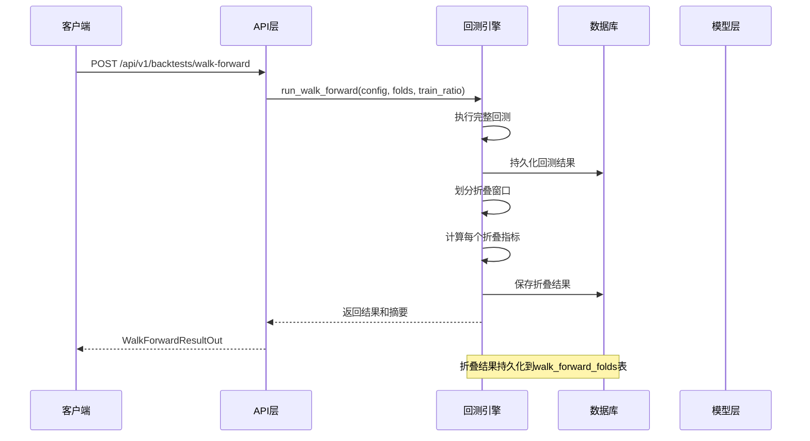
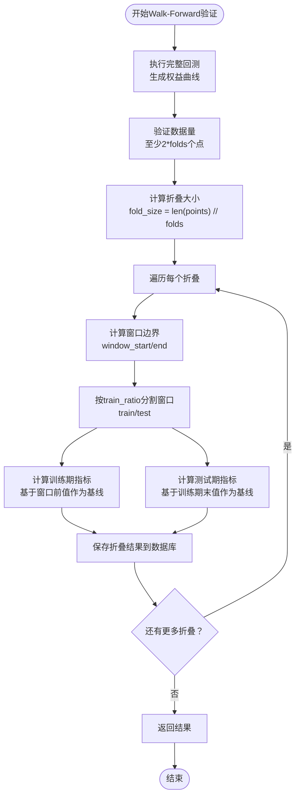
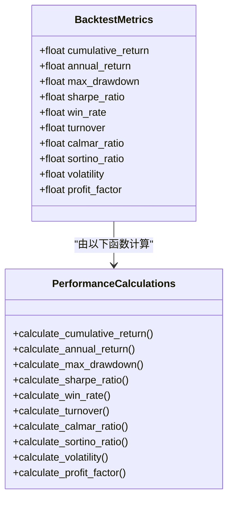
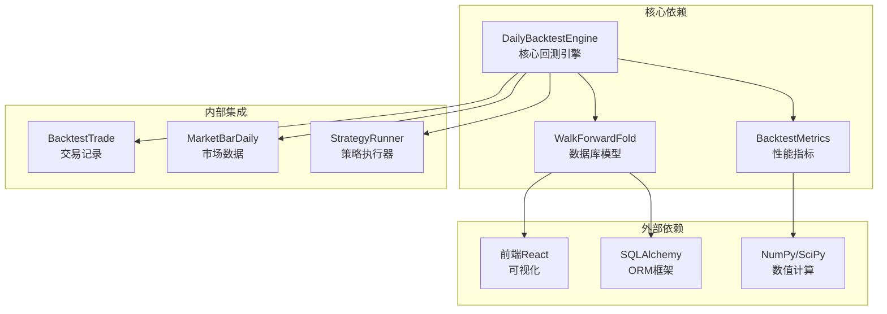

# Walk-Forward验证

<cite>
**本文档引用的文件**
- [daily_backtest.py](file://backend/app/services/daily_backtest.py)
- [models.py](file://backend/app/domains/backtest/models.py)
- [schemas.py](file://backend/app/domains/backtest/schemas.py)
- [backtests.py](file://backend/app/api/v1/backtests.py)
- [65eb0814322d_walk_forward_folds.py](file://backend/app/db/migrations/versions/65eb0814322d_walk_forward_folds.py)
- [test_daily_backtest.py](file://backend/tests/services/test_daily_backtest.py)
- [WalkForwardBars.tsx](file://frontend/src/screens/Backtest/WalkForwardBars.tsx)
- [overfitting.py](file://backend/app/services/overfitting.py)
</cite>

## 目录
1. [简介](#简介)
2. [项目结构](#项目结构)
3. [核心组件](#核心组件)
4. [架构概览](#架构概览)
5. [详细组件分析](#详细组件分析)
6. [依赖关系分析](#依赖关系分析)
7. [性能考虑](#性能考虑)
8. [故障排除指南](#故障排除指南)
9. [结论](#结论)

## 简介

Walk-Forward验证是一种重要的时间序列回测方法，用于评估量化策略在不同市场环境下的稳定性。该方法通过将整个回测期划分为多个连续的时间窗口，在每个窗口内进行训练（In-Sample）和测试（Out-of-Sample），从而提供更可靠的策略性能评估。

在本系统中，Walk-Forward验证实现了以下关键功能：
- 将完整回测期分割为指定数量的折叠窗口
- 在每个窗口内区分训练期和测试期
- 计算每个折叠的收益、夏普比率和最大回撤等关键指标
- 提供可视化界面展示各折叠的表现差异

## 项目结构

Walk-Forward验证功能分布在后端服务层、数据模型层和前端展示层：

**图表来源**
- [daily_backtest.py:185-452](file://backend/app/services/daily_backtest.py#L185-L452)
- [models.py:95-119](file://backend/app/domains/backtest/models.py#L95-L119)
- [schemas.py:179-193](file://backend/app/domains/backtest/schemas.py#L179-L193)

**章节来源**
- [daily_backtest.py:1-100](file://backend/app/services/daily_backtest.py#L1-L100)
- [models.py:1-50](file://backend/app/domains/backtest/models.py#L1-L50)

## 核心组件

### WalkForwardFoldSummary 数据结构

WalkForwardFoldSummary是内存中的折叠摘要数据结构，包含每个折叠窗口的关键信息：

**图表来源**
- [daily_backtest.py:113-123](file://backend/app/services/daily_backtest.py#L113-L123)
- [daily_backtest.py:97-110](file://backend/app/services/daily_backtest.py#L97-L110)

### WalkForwardFold 数据库模型

数据库层面的持久化模型支持折叠结果的长期存储：

| 字段名 | 类型 | 描述 |
|--------|------|------|
| run_id | String(36) | 关联的回测运行ID |
| fold_index | Integer | 折叠索引（从0开始） |
| train_start | String(32) | 训练期开始日期 |
| train_end | String(32) | 训练期结束日期 |
| test_start | String(32) | 测试期开始日期 |
| test_end | String(32) | 测试期结束日期 |
| train_return | Float | 训练期累计收益 |
| test_return | Float | 测试期累计收益 |
| train_sharpe | Float | 训练期夏普比率 |
| test_sharpe | Float | 测试期夏普比率 |
| train_max_dd | Float | 训练期最大回撤 |
| test_max_dd | Float | 测试期最大回撤 |
| train_params_json | Text | 训练期参数（JSON格式） |

**章节来源**
- [daily_backtest.py:113-123](file://backend/app/services/daily_backtest.py#L113-L123)
- [models.py:95-119](file://backend/app/domains/backtest/models.py#L95-L119)

## 架构概览

Walk-Forward验证的整体架构采用分层设计，确保了功能的清晰分离和可维护性：

**图表来源**
- [backtests.py:540-590](file://backend/app/api/v1/backtests.py#L540-L590)
- [daily_backtest.py:373-452](file://backend/app/services/daily_backtest.py#L373-L452)

## 详细组件分析

### 核心算法实现

Walk-Forward验证的核心算法实现了以下步骤：

1. **完整回测执行**：首先运行一次完整的回测，生成完整的权益曲线
2. **折叠窗口划分**：将权益曲线等分为指定数量的窗口
3. **训练/测试期分割**：在每个窗口内按训练比例分割为训练期和测试期
4. **指标计算**：分别计算训练期和测试期的性能指标

**图表来源**
- [daily_backtest.py:381-452](file://backend/app/services/daily_backtest.py#L381-L452)

### 配置参数详解

Walk-Forward验证支持以下关键配置参数：

| 参数名 | 类型 | 默认值 | 范围 | 描述 |
|--------|------|--------|------|------|
| folds | int | 4 | [2, 20] | 折叠数量，必须≥2 |
| train_ratio | float | 0.7 | [0.1, 1.0) | 训练期占窗口的比例 |
| universe | list[str] | - | 必需 | 交易标的列表 |
| start_date | str | - | 必需 | 回测开始日期 |
| end_date | str | - | 必需 | 回测结束日期 |
| strategy_name | str | "dual_ma" | - | 策略名称 |
| initial_cash | float | 1,000,000.0 | >0 | 初始资金 |
| strategy_params | dict | {} | - | 策略参数字典 |
| cost_config | BacktestCostConfig | - | - | 交易成本配置 |

### 性能指标计算

系统计算以下关键性能指标：

**图表来源**
- [daily_backtest.py:702-799](file://backend/app/services/daily_backtest.py#L702-L799)

**章节来源**
- [daily_backtest.py:373-452](file://backend/app/services/daily_backtest.py#L373-L452)
- [schemas.py:179-193](file://backend/app/domains/backtest/schemas.py#L179-L193)

## 依赖关系分析

Walk-Forward验证模块与其他系统组件的依赖关系如下：

**图表来源**
- [daily_backtest.py:16-26](file://backend/app/services/daily_backtest.py#L16-L26)
- [models.py:95-119](file://backend/app/domains/backtest/models.py#L95-L119)

**章节来源**
- [daily_backtest.py:1-50](file://backend/app/services/daily_backtest.py#L1-L50)
- [models.py:1-30](file://backend/app/domains/backtest/models.py#L1-L30)

## 性能考虑

### 时间复杂度分析

Walk-Forward验证的时间复杂度主要由以下因素决定：

- **完整回测**：O(N)，其中N为交易日数量
- **折叠计算**：O(F × W)，其中F为折叠数，W为平均窗口长度
- **指标计算**：O(W)，对每个窗口进行

总体时间复杂度约为O(N + F × W)，空间复杂度为O(N + F × W)。

### 内存优化策略

1. **分批处理**：使用生成器和迭代器避免一次性加载所有数据
2. **增量计算**：复用已计算的结果，避免重复计算
3. **数据压缩**：对历史数据进行必要的压缩和清理

### 并行处理能力

当前实现采用串行处理，但具有良好的并行化潜力：
- 不同折叠之间可以并行计算
- 大规模数据集可以考虑分块处理
- 可以利用多核CPU进行并行指标计算

## 故障排除指南

### 常见错误及解决方案

| 错误类型 | 触发条件 | 解决方案 |
|----------|----------|----------|
| 数据不足错误 | 折叠数×2 > 交易日数量 | 增加回测期长度或减少折叠数 |
| 参数范围错误 | folds < 2 或 train_ratio不在有效范围 | 调整参数值至允许范围内 |
| 策略参数错误 | 策略参数无效 | 检查策略参数定义和取值范围 |
| 数据加载失败 | 市场数据缺失 | 确认数据源可用性和数据完整性 |

### 调试技巧

1. **启用详细日志**：检查回测过程中的关键节点
2. **验证数据质量**：确保市场数据的连续性和完整性
3. **参数敏感性分析**：测试不同参数组合的影响
4. **可视化验证**：通过图表确认折叠划分的正确性

**章节来源**
- [daily_backtest.py:389-401](file://backend/app/services/daily_backtest.py#L389-L401)
- [test_daily_backtest.py:305-319](file://backend/tests/services/test_daily_backtest.py#L305-L319)

## 结论

Walk-Forward验证模块为量化策略评估提供了可靠的时间序列验证方法。通过将回测期划分为多个连续的折叠窗口，该模块能够：

1. **提供更真实的性能评估**：避免样本外数据泄露，模拟真实的投资环境
2. **识别策略稳定性**：通过多期表现评估策略的持续盈利能力
3. **检测过拟合风险**：比较训练期和测试期的表现差异
4. **支持策略优化**：为参数调优和策略改进提供数据支撑

该模块的设计充分考虑了性能、可扩展性和用户体验，为量化投资策略的研发和部署提供了坚实的技术基础。通过合理的参数配置和结果分析，开发者可以显著提高策略评估的可靠性和有效性。