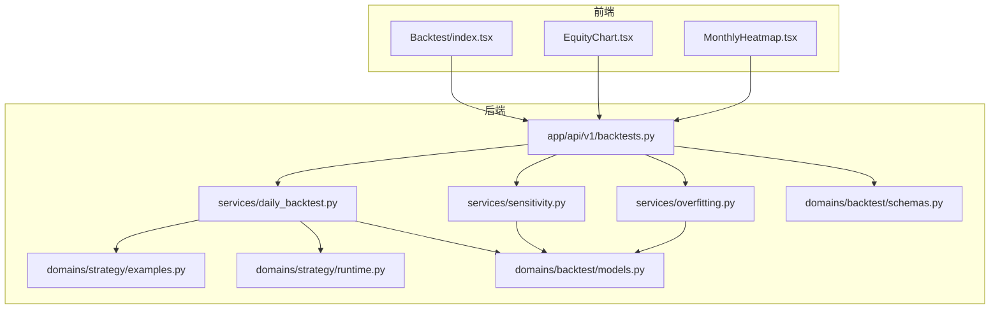
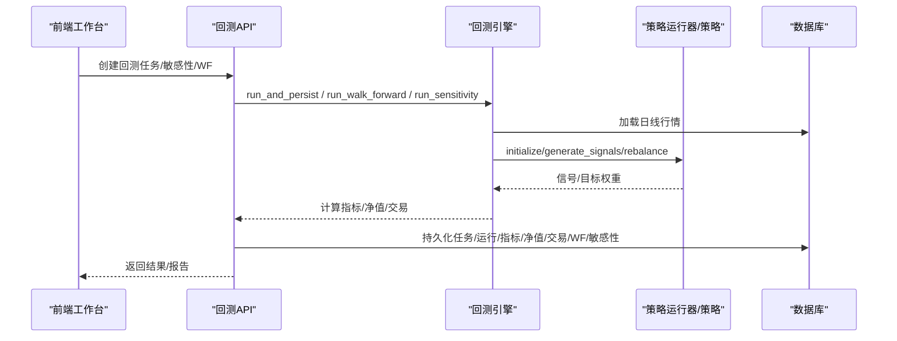
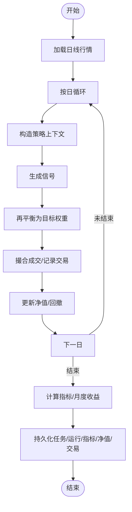
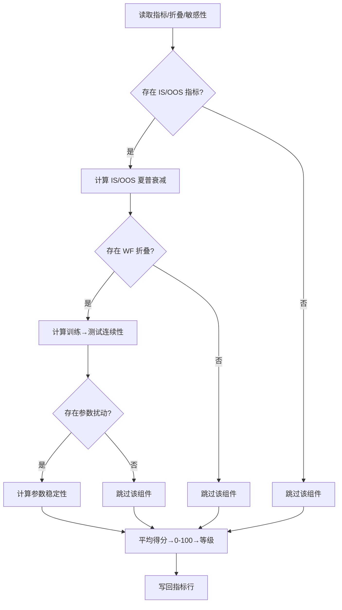
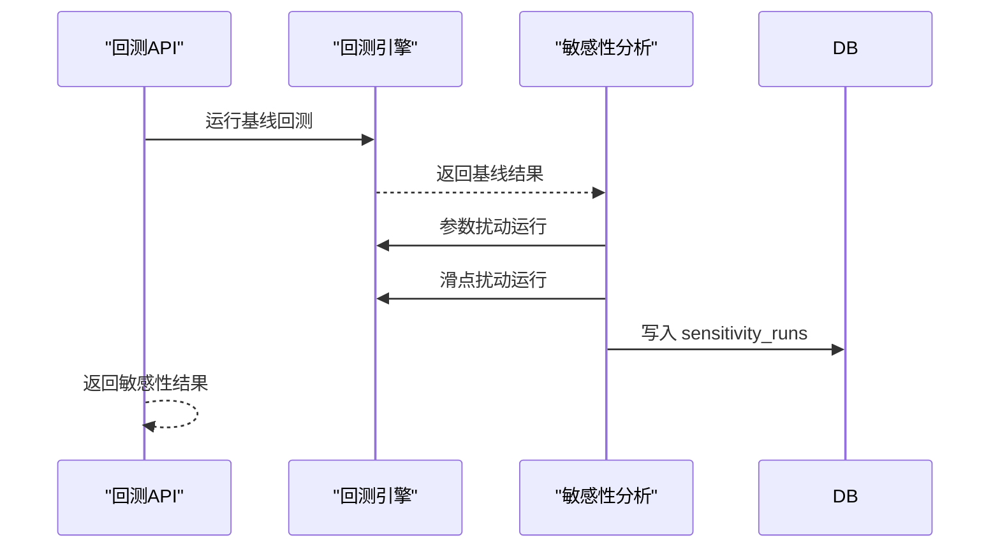
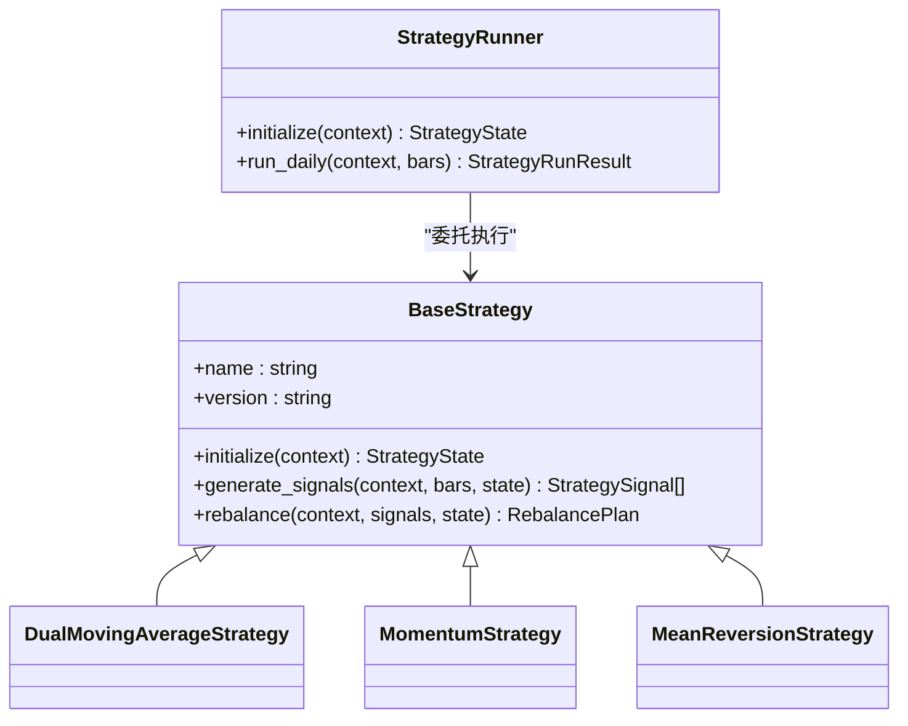
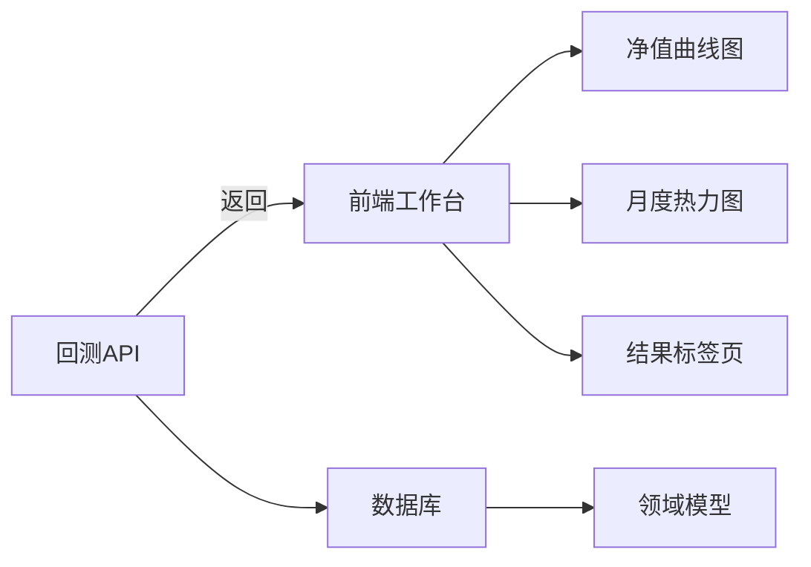
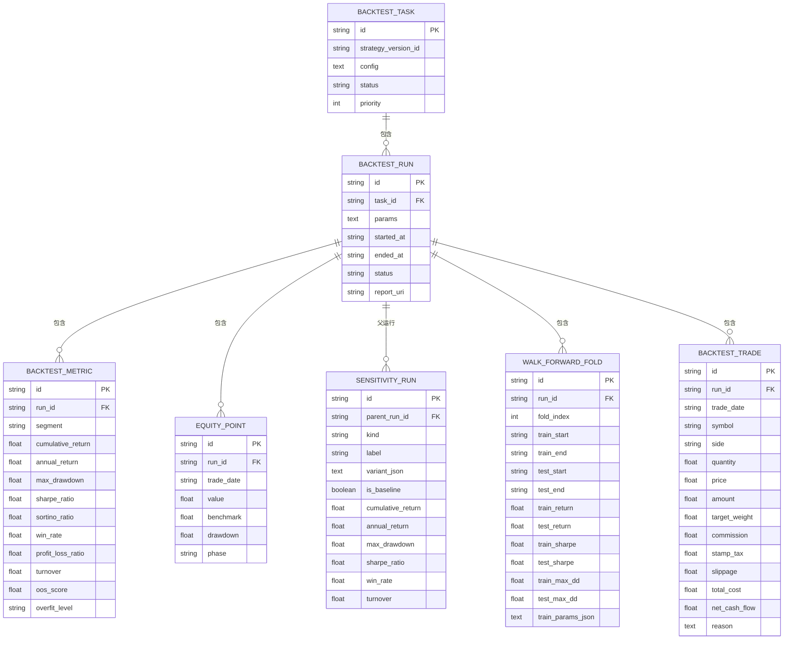

# 回测实验室

<cite>
**本文引用的文件**
- [backend/README.md](file://backend/README.md)
- [doc/prd/backtest-lab-v2.md](file://doc/prd/backtest-lab-v2.md)
- [backend/app/api/v1/backtests.py](file://backend/app/api/v1/backtests.py)
- [backend/app/services/daily_backtest.py](file://backend/app/services/daily_backtest.py)
- [backend/app/services/overfitting.py](file://backend/app/services/overfitting.py)
- [backend/app/services/sensitivity.py](file://backend/app/services/sensitivity.py)
- [backend/app/domains/backtest/models.py](file://backend/app/domains/backtest/models.py)
- [backend/app/domains/backtest/schemas.py](file://backend/app/domains/backtest/schemas.py)
- [backend/app/domains/strategy/examples.py](file://backend/app/domains/strategy/examples.py)
- [backend/app/domains/strategy/runtime.py](file://backend/app/domains/strategy/runtime.py)
- [backend/app/db/migrations/versions/65eb0814322d_walk_forward_folds.py](file://backend/app/db/migrations/versions/65eb0814322d_walk_forward_folds.py)
- [backend/app/db/migrations/versions/a00a9a166a85_sensitivity_runs.py](file://backend/app/db/migrations/versions/a00a9a166a85_sensitivity_runs.py)
- [backend/app/db/migrations/versions/c45d1fe90688_backtest_metric_segment.py](file://backend/app/db/migrations/versions/c45d1fe90688_backtest_metric_segment.py)
- [frontend/src/screens/Backtest/index.tsx](file://frontend/src/screens/Backtest/index.tsx)
- [frontend/src/screens/Backtest/EquityChart.tsx](file://frontend/src/screens/Backtest/EquityChart.tsx)
- [frontend/src/screens/Backtest/MonthlyHeatmap.tsx](file://frontend/src/screens/Backtest/MonthlyHeatmap.tsx)
</cite>

## 目录
1. [简介](#简介)
2. [项目结构](#项目结构)
3. [核心组件](#核心组件)
4. [架构总览](#架构总览)
5. [详细组件分析](#详细组件分析)
6. [依赖关系分析](#依赖关系分析)
7. [性能考量](#性能考量)
8. [故障排查指南](#故障排查指南)
9. [结论](#结论)
10. [附录](#附录)

## 简介
回测实验室是一个面向量化研究的端到端回测平台，提供真实日线行情回测、IS/OOS 切分、Walk-Forward 分析、参数与滑点敏感性扫描、过拟合评估、成交记录与净值曲线可视化等功能。系统支持内置策略（双均线、动量、均值回归）与策略工厂策略，并通过前后端协同输出 10 项关键指标（含 Calmar、Sortino、年化波动率、盈亏比）与月度收益热力图。

## 项目结构
后端采用 FastAPI + SQLAlchemy 异步架构，数据库通过 Alembic 迁移管理；前端使用 React + ECharts 构建交互式回测工作台。核心模块包括：
- API 层：统一入口，封装回测任务、敏感性、Walk-Forward、报告聚合等接口
- 服务层：回测引擎、过拟合评估、敏感性分析、每日行情回放
- 领域模型：回测任务、运行、指标、净值点、敏感性运行、WF 折叠、成交记录等
- 策略层：内置策略与策略运行器接口
- 前端工作台：可视化净值曲线、月度热图、参数面板、历史面板等

**图表来源**
- [backend/app/api/v1/backtests.py:483-590](file://backend/app/api/v1/backtests.py#L483-L590)
- [backend/app/services/daily_backtest.py:185-452](file://backend/app/services/daily_backtest.py#L185-L452)
- [backend/app/services/sensitivity.py:60-138](file://backend/app/services/sensitivity.py#L60-L138)
- [backend/app/services/overfitting.py:129-167](file://backend/app/services/overfitting.py#L129-L167)
- [backend/app/domains/backtest/models.py:9-155](file://backend/app/domains/backtest/models.py#L9-L155)
- [backend/app/domains/backtest/schemas.py:155-350](file://backend/app/domains/backtest/schemas.py#L155-L350)
- [backend/app/domains/strategy/examples.py:51-332](file://backend/app/domains/strategy/examples.py#L51-L332)
- [backend/app/domains/strategy/runtime.py:175-240](file://backend/app/domains/strategy/runtime.py#L175-L240)
- [frontend/src/screens/Backtest/index.tsx:137-800](file://frontend/src/screens/Backtest/index.tsx#L137-L800)
- [frontend/src/screens/Backtest/EquityChart.tsx:10-188](file://frontend/src/screens/Backtest/EquityChart.tsx#L10-L188)
- [frontend/src/screens/Backtest/MonthlyHeatmap.tsx:23-86](file://frontend/src/screens/Backtest/MonthlyHeatmap.tsx#L23-L86)

**章节来源**
- [backend/README.md:1-45](file://backend/README.md#L1-L45)
- [doc/prd/backtest-lab-v2.md:75-251](file://doc/prd/backtest-lab-v2.md#L75-L251)

## 核心组件
- 回测引擎（DailyBacktestEngine）
  - 加载日线行情，按日期驱动策略执行，计算日度净值、回撤、交易成本与换手
  - 支持 IS/OOS 指标拆分、月度收益聚合、Walk-Forward 折叠
- 过拟合评估（assess_overfitting）
  - 基于 IS/OOS 夏普衰减、回撤一致性、WF 连续性、参数敏感性四维信号综合评分
- 敏感性分析（run_sensitivity_analysis）
  - 对双均线参数与滑点进行小规模扰动，输出对比结果
- 策略运行器（StrategyRunner）
  - 策略生命周期：initialize → generate_signals → rebalance
- 内置策略（DualMovingAverage、Momentum、MeanReversion）
  - 提供可调参数与目标敞口控制，适配 A 股交易规则

**章节来源**
- [backend/app/services/daily_backtest.py:185-452](file://backend/app/services/daily_backtest.py#L185-L452)
- [backend/app/services/overfitting.py:129-167](file://backend/app/services/overfitting.py#L129-L167)
- [backend/app/services/sensitivity.py:60-138](file://backend/app/services/sensitivity.py#L60-L138)
- [backend/app/domains/strategy/runtime.py:175-240](file://backend/app/domains/strategy/runtime.py#L175-L240)
- [backend/app/domains/strategy/examples.py:51-332](file://backend/app/domains/strategy/examples.py#L51-L332)

## 架构总览
回测实验室采用“API → 服务 → 领域模型”的分层设计，数据持久化通过 SQLAlchemy ORM 与 Alembic 迁移管理。前端通过 ECharts 渲染净值曲线与回撤，月度收益热图纯 DOM 实现，保证低延迟。

**图表来源**
- [backend/app/api/v1/backtests.py:483-590](file://backend/app/api/v1/backtests.py#L483-L590)
- [backend/app/services/daily_backtest.py:285-371](file://backend/app/services/daily_backtest.py#L285-L371)
- [backend/app/services/sensitivity.py:60-138](file://backend/app/services/sensitivity.py#L60-L138)
- [backend/app/services/overfitting.py:129-167](file://backend/app/services/overfitting.py#L129-L167)

## 详细组件分析

### 回测引擎（DailyBacktestEngine）
- 输入配置：股票池、起止日期、策略名、参数、成本假设、IS 切分日
- 执行流程：按日加载行情 → 构造 StrategyContext → 策略生成信号 → 再平衡 → 记录交易与净值 → 计算指标
- 指标计算：累计收益、年化收益、最大回撤、夏普比率、胜率、换手、Calmar、Sortino、年化波动率、盈亏比
- 输出：任务/运行 ID、指标、净值序列、月度收益、交易清单

**图表来源**
- [backend/app/services/daily_backtest.py:191-283](file://backend/app/services/daily_backtest.py#L191-L283)
- [backend/app/services/daily_backtest.py:702-800](file://backend/app/services/daily_backtest.py#L702-L800)

**章节来源**
- [backend/app/services/daily_backtest.py:185-452](file://backend/app/services/daily_backtest.py#L185-L452)
- [backend/app/services/daily_backtest.py:702-800](file://backend/app/services/daily_backtest.py#L702-L800)

### 过拟合评估（assess_overfitting）
- 组件维度：IS/OOS 夏普衰减、IS/OOS 回撤一致性、Walk-Forward 连续性、参数扰动稳定性
- 评分：0–100 分桶为 low/medium/high，缺失组件时按比例折算
- 持久化：写回“all”段指标行，补充 OOS 评分与过拟合等级

**图表来源**
- [backend/app/services/overfitting.py:129-167](file://backend/app/services/overfitting.py#L129-L167)

**章节来源**
- [backend/app/services/overfitting.py:129-167](file://backend/app/services/overfitting.py#L129-L167)

### 敏感性分析（run_sensitivity_analysis）
- 双均线参数扰动：短/长均线小幅变动，过滤无效组合
- 滑点扰动：围绕基线滑点±5/±20 bps，保留原基线
- 输出：基线 + 变体指标集合，入库 sensitivity_runs

**图表来源**
- [backend/app/services/sensitivity.py:60-138](file://backend/app/services/sensitivity.py#L60-L138)
- [backend/app/api/v1/backtests.py:497-537](file://backend/app/api/v1/backtests.py#L497-L537)

**章节来源**
- [backend/app/services/sensitivity.py:60-138](file://backend/app/services/sensitivity.py#L60-L138)
- [backend/app/api/v1/backtests.py:497-537](file://backend/app/api/v1/backtests.py#L497-L537)

### 策略运行器与内置策略
- 策略接口：initialize/generate_signals/rebalance
- 内置策略：
  - 双均线：短/长均线、目标毛敞口、最大持仓
  - 动量：横截面动量，按 lookback/skip 排名，买入前 max_positions
  - 均值回归：基于日收益 Z-score，超卖买入，超买卖出
- A 股适配：考虑停牌、涨跌停、买卖限制

**图表来源**
- [backend/app/domains/strategy/runtime.py:175-240](file://backend/app/domains/strategy/runtime.py#L175-L240)
- [backend/app/domains/strategy/examples.py:51-332](file://backend/app/domains/strategy/examples.py#L51-L332)

**章节来源**
- [backend/app/domains/strategy/runtime.py:175-240](file://backend/app/domains/strategy/runtime.py#L175-L240)
- [backend/app/domains/strategy/examples.py:51-332](file://backend/app/domains/strategy/examples.py#L51-L332)

### 回测指标与可视化
- 指标定义（新增）：Calmar 比率、Sortino 比率、年化波动率、盈亏比
- 可视化：
  - 净值曲线与回撤双轴图（ECharts）
  - 月度收益热力图（纯 DOM，正负颜色插值）
- 前端工作台：参数面板、成本假设、IS/OOS 切分、历史面板、结果标签页

**图表来源**
- [frontend/src/screens/Backtest/index.tsx:137-800](file://frontend/src/screens/Backtest/index.tsx#L137-L800)
- [frontend/src/screens/Backtest/EquityChart.tsx:10-188](file://frontend/src/screens/Backtest/EquityChart.tsx#L10-L188)
- [frontend/src/screens/Backtest/MonthlyHeatmap.tsx:23-86](file://frontend/src/screens/Backtest/MonthlyHeatmap.tsx#L23-L86)
- [backend/app/domains/backtest/schemas.py:155-350](file://backend/app/domains/backtest/schemas.py#L155-L350)

**章节来源**
- [frontend/src/screens/Backtest/index.tsx:137-800](file://frontend/src/screens/Backtest/index.tsx#L137-L800)
- [frontend/src/screens/Backtest/EquityChart.tsx:10-188](file://frontend/src/screens/Backtest/EquityChart.tsx#L10-L188)
- [frontend/src/screens/Backtest/MonthlyHeatmap.tsx:23-86](file://frontend/src/screens/Backtest/MonthlyHeatmap.tsx#L23-L86)
- [backend/app/domains/backtest/schemas.py:155-350](file://backend/app/domains/backtest/schemas.py#L155-L350)

## 依赖关系分析
- 数据模型与迁移
  - backtest_metrics 新增 segment 字段，支持 IS/OOS 拆分
  - sensitivity_runs/walk_forward_folds 表用于存储敏感性与 WF 折叠结果
- API 与服务
  - 回测 API 调用引擎与评估服务，统一返回报告结构
- 前后端契约
  - Pydantic 模型与 TS 类型双向约束，保证字段与命名一致

**图表来源**
- [backend/app/domains/backtest/models.py:9-155](file://backend/app/domains/backtest/models.py#L9-L155)
- [backend/app/db/migrations/versions/c45d1fe90688_backtest_metric_segment.py:19-30](file://backend/app/db/migrations/versions/c45d1fe90688_backtest_metric_segment.py#L19-L30)
- [backend/app/db/migrations/versions/a00a9a166a85_sensitivity_runs.py:33-50](file://backend/app/db/migrations/versions/a00a9a166a85_sensitivity_runs.py#L33-L50)
- [backend/app/db/migrations/versions/65eb0814322d_walk_forward_folds.py:33-56](file://backend/app/db/migrations/versions/65eb0814322d_walk_forward_folds.py#L33-L56)

**章节来源**
- [backend/app/domains/backtest/models.py:9-155](file://backend/app/domains/backtest/models.py#L9-L155)
- [backend/app/db/migrations/versions/c45d1fe90688_backtest_metric_segment.py:19-30](file://backend/app/db/migrations/versions/c45d1fe90688_backtest_metric_segment.py#L19-L30)
- [backend/app/db/migrations/versions/a00a9a166a85_sensitivity_runs.py:33-50](file://backend/app/db/migrations/versions/a00a9a166a85_sensitivity_runs.py#L33-L50)
- [backend/app/db/migrations/versions/65eb0814322d_walk_forward_folds.py:33-56](file://backend/app/db/migrations/versions/65eb0814322d_walk_forward_folds.py#L33-L56)

## 性能考量
- 指标计算复杂度
  - 日度指标：O(N)，N 为交易日数
  - 夏普/波动率：O(N)
  - Sortino：O(N)
  - Calmar/盈亏比：O(N)
- 存储与查询
  - 指标按 segment（all/is/oos）拆分，便于快速切分展示
  - WF 与敏感性结果独立表，避免主表膨胀
- 前端渲染
  - 月度热图纯 DOM 实现，避免 ECharts 开销
  - 净值曲线按需重绘，ResizeObserver 自适应

[本节为通用指导，无需特定文件引用]

## 故障排查指南
- 数据不足
  - 现象：回测报错“无行情”
  - 处理：确认股票池与日期范围内存在足够 K 线，或使用 Agent 构建股票池
- 参数非法
  - 现象：策略参数越界或短均线不小于长均线
  - 处理：调整参数范围，参考内置策略参数约束
- IS/OOS 切分错误
  - 现象：切分日不在 [起始, 结束) 区间
  - 处理：修正切分日，确保至少留一天 OOS
- 过拟合评估为空
  - 现象：缺少 IS/OOS 或 WF/敏感性数据
  - 处理：启用 IS/OOS 切分与 Walk-Forward/敏感性分析后再评估

**章节来源**
- [backend/app/services/daily_backtest.py:148-183](file://backend/app/services/daily_backtest.py#L148-L183)
- [backend/app/api/v1/backtests.py:258-267](file://backend/app/api/v1/backtests.py#L258-L267)

## 结论
回测实验室通过清晰的分层架构、完善的指标体系与可视化组件，为量化研究提供了从策略配置、回测执行到结果分析的完整闭环。内置策略与策略工厂结合，既保证易用性也支持扩展；新增 Calmar、Sortino、波动率、盈亏比等指标与月度热图，显著提升了回测报告的深度与可读性。

[本节为总结，无需特定文件引用]

## 附录

### 回测配置与参数调优
- 策略选择
  - 内置：双均线、动量、均值回归
  - 策略工厂：选择已审核策略，自动映射到对应引擎
- 股票池
  - 手动选择或使用 Agent 构建，Agent 会考虑数据质量与多样性
- 日期与切分
  - 设置起止日期，可选 IS/OOS 切分日
- 成本假设
  - 佣金率、最低佣金、印花税、滑点 bps
- 参数调优
  - 双均线：短/长均线、目标毛敞口、最大持仓
  - 动量：回看窗口、跳过天数、目标毛敞口、最大持仓
  - 均值回归：回看窗口、Z 阈值、目标毛敞口、最大持仓

**章节来源**
- [frontend/src/screens/Backtest/index.tsx:27-80](file://frontend/src/screens/Backtest/index.tsx#L27-L80)
- [backend/app/domains/strategy/examples.py:21-332](file://backend/app/domains/strategy/examples.py#L21-L332)

### 回测流程与结果解读
- 基础回测
  - 运行后查看净值曲线、指标条、交易清单
- Walk-Forward
  - 查看各折训练/测试收益与夏普对比，评估稳定性
- 敏感性扫描
  - 对比参数扰动与滑点扰动下的收益变化，识别关键敏感因素
- 过拟合评估
  - 综合评分与等级，结合各组件详情判断风险

**章节来源**
- [backend/app/api/v1/backtests.py:540-590](file://backend/app/api/v1/backtests.py#L540-L590)
- [backend/app/services/sensitivity.py:60-138](file://backend/app/services/sensitivity.py#L60-L138)
- [backend/app/services/overfitting.py:129-167](file://backend/app/services/overfitting.py#L129-L167)