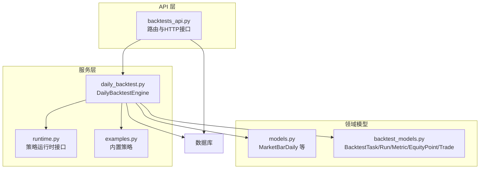
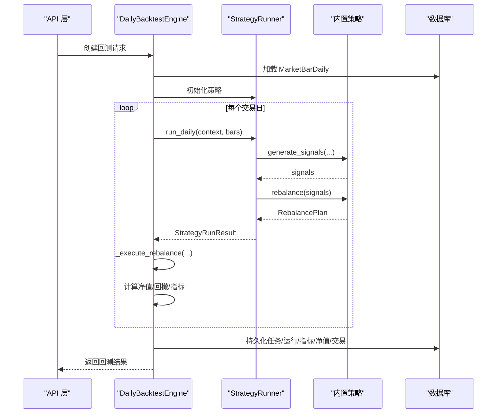
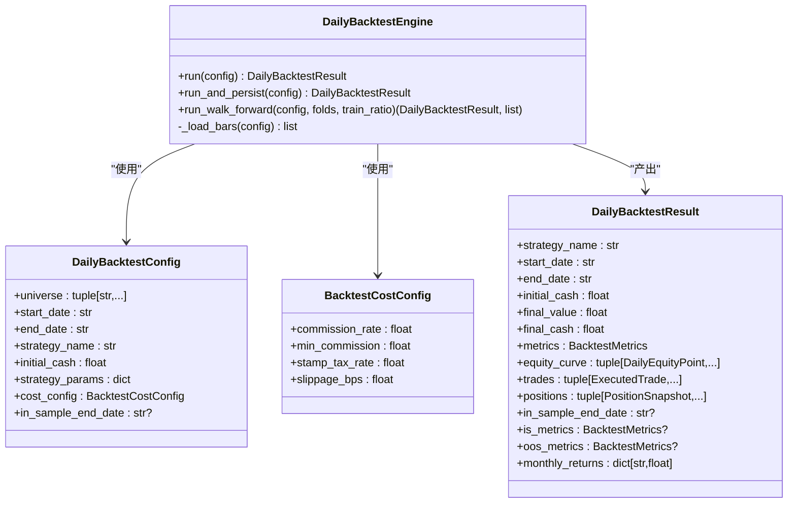
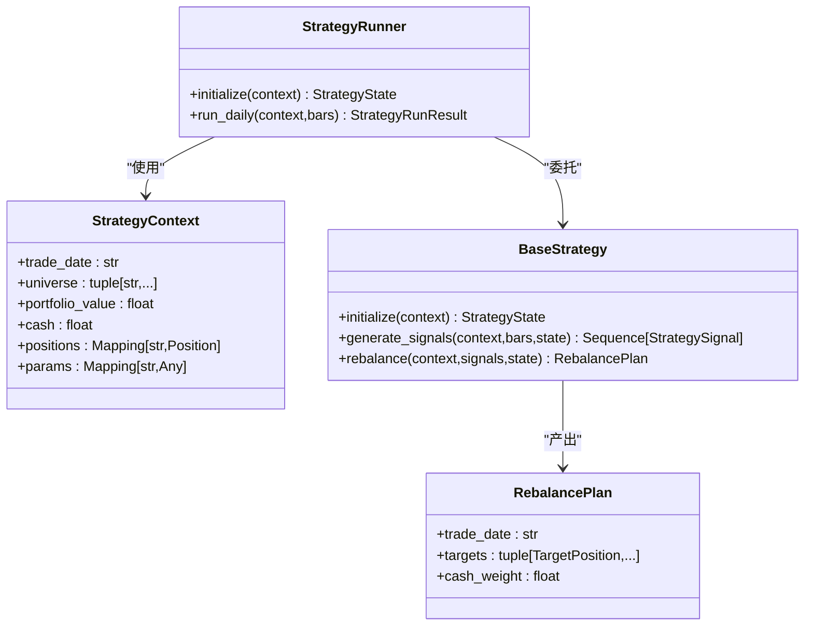
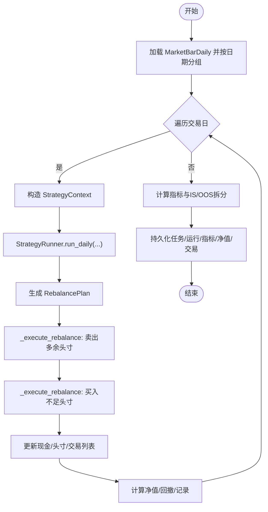
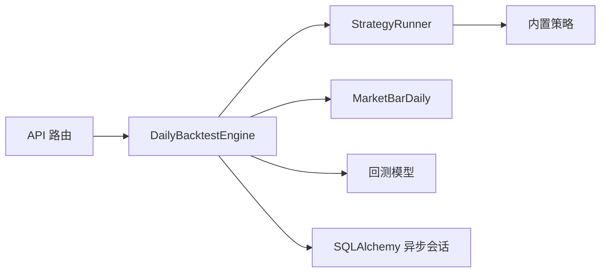

# 回测引擎核心

<cite>
**本文档引用的文件**
- [daily_backtest.py](file://backend/app/services/daily_backtest.py)
- [runtime.py](file://backend/app/domains/strategy/runtime.py)
- [examples.py](file://backend/app/domains/strategy/examples.py)
- [models.py](file://backend/app/domains/data/models.py)
- [backtest_models.py](file://backend/app/domains/backtest/models.py)
- [backtests_api.py](file://backend/app/api/v1/backtests.py)
- [test_daily_backtest.py](file://backend/tests/services/test_daily_backtest.py)
- [test_backtests_api.py](file://backend/tests/api/test_backtests.py)
</cite>

## 目录
1. [简介](#简介)
2. [项目结构](#项目结构)
3. [核心组件](#核心组件)
4. [架构总览](#架构总览)
5. [详细组件分析](#详细组件分析)
6. [依赖关系分析](#依赖关系分析)
7. [性能考虑](#性能考虑)
8. [故障排查指南](#故障排查指南)
9. [结论](#结论)
10. [附录](#附录)

## 简介
本文件面向回测引擎核心模块，系统性解析 DailyBacktestEngine 的架构设计、历史数据回测流程、策略执行逻辑与性能优化策略。文档覆盖回测配置参数（universe、时间范围、初始资金、交易成本等）、数据加载机制、信号生成与执行流程、内存管理、并发处理与错误处理，并提供使用示例、最佳实践与性能调优建议，帮助开发者理解并扩展量化回测的核心技术。

## 项目结构
回测引擎位于后端服务层，围绕“服务层-领域模型-API层”组织代码，关键文件如下：
- 服务层：DailyBacktestEngine 及其辅助函数，负责回测主循环、交易执行、指标计算与持久化
- 领域模型：策略运行时接口、内置策略、市场数据模型、回测结果与指标模型
- API 层：对外暴露回测创建、查询、折线图与指标输出等接口

图表来源
- [daily_backtest.py:185-284](file://backend/app/services/daily_backtest.py#L185-L284)
- [runtime.py:175-229](file://backend/app/domains/strategy/runtime.py#L175-L229)
- [examples.py:334-354](file://backend/app/domains/strategy/examples.py#L334-L354)
- [models.py:40-67](file://backend/app/domains/data/models.py#L40-L67)
- [backtest_models.py:9-140](file://backend/app/domains/backtest/models.py#L9-L140)
- [backtests_api.py:1-200](file://backend/app/api/v1/backtests.py#L1-L200)

章节来源
- [daily_backtest.py:1-120](file://backend/app/services/daily_backtest.py#L1-L120)
- [runtime.py:1-120](file://backend/app/domains/strategy/runtime.py#L1-L120)
- [examples.py:1-120](file://backend/app/domains/strategy/examples.py#L1-L120)
- [models.py:40-67](file://backend/app/domains/data/models.py#L40-L67)
- [backtest_models.py:9-70](file://backend/app/domains/backtest/models.py#L9-L70)
- [backtests_api.py:1-200](file://backend/app/api/v1/backtests.py#L1-L200)

## 核心组件
- DailyBacktestEngine：回测主引擎，负责加载日线数据、驱动策略、执行交易、计算净值曲线与指标，并可持久化结果
- 策略运行时：StrategyRunner 封装策略生命周期（initialize/generate_signals/rebalance），StrategyContext 提供上下文信息
- 内置策略：DualMovingAverageStrategy、MomentumStrategy、MeanReversionStrategy 等
- 数据模型：MarketBarDaily 提供OHLCV与交易标志位；策略Bar包装为StrategyBar
- 回测结果模型：BacktestTask/Run/Metric/EquityPoint/Trade/WalkForwardFold 等

章节来源
- [daily_backtest.py:185-284](file://backend/app/services/daily_backtest.py#L185-L284)
- [runtime.py:175-229](file://backend/app/domains/strategy/runtime.py#L175-L229)
- [examples.py:334-354](file://backend/app/domains/strategy/examples.py#L334-L354)
- [models.py:40-67](file://backend/app/domains/data/models.py#L40-L67)
- [backtest_models.py:9-140](file://backend/app/domains/backtest/models.py#L9-L140)

## 架构总览
回测引擎采用“数据驱动 + 策略解耦”的设计：
- 数据加载：按日期分组聚合 MarketBarDaily，形成逐日行情快照
- 策略执行：StrategyRunner 在每个交易日生成信号并转换为再平衡目标权重
- 交易执行：_execute_rebalance 基于买卖标志、滑点、佣金、印花税等成本模型进行成交
- 结果汇总：计算每日净值、回撤、交易清单与各类指标，并支持IS/OOS拆分与走查分析

图表来源
- [daily_backtest.py:191-283](file://backend/app/services/daily_backtest.py#L191-L283)
- [runtime.py:206-228](file://backend/app/domains/strategy/runtime.py#L206-L228)
- [examples.py:51-199](file://backend/app/domains/strategy/examples.py#L51-L199)
- [backtests_api.py:1054-1114](file://backend/app/api/v1/backtests.py#L1054-L1114)

## 详细组件分析

### DailyBacktestEngine 组件
- 主要职责
  - 加载指定 universe 与日期范围内的日线数据
  - 构建逐日行情字典与交易序列
  - 驱动策略生成信号并执行再平衡
  - 记录交易、净值曲线与指标
  - 支持 IS/OOS 拆分与走查分析
- 关键方法
  - run(config)：完整回测主循环
  - run_and_persist(config)：执行并持久化任务、运行、指标、净值与交易
  - run_walk_forward(config, folds, train_ratio)：全样本回测后切片为多个训练/测试窗口
  - _load_bars(config)：SQL 查询并返回 MarketBarDaily 列表
- 数据结构
  - DailyBacktestConfig：回测配置
  - DailyBacktestResult：回测结果封装
  - BacktestCostConfig：交易成本假设
  - ExecutedTrade/PositionSnapshot/DailyEquityPoint/BacktestMetrics：中间与最终产物

图表来源
- [daily_backtest.py:148-283](file://backend/app/services/daily_backtest.py#L148-L283)

章节来源
- [daily_backtest.py:185-464](file://backend/app/services/daily_backtest.py#L185-L464)

### 策略运行时与内置策略
- 策略运行时
  - StrategyContext：提供 trade_date、universe、portfolio_value、cash、positions、params 等上下文
  - StrategyRunner：封装 initialize -> generate_signals -> rebalance 生命周期
  - RebalancePlan/TargetPosition：策略输出的目标权重计划
- 内置策略
  - DualMovingAverageStrategy：双均线择时，生成买入/卖出/持有信号并等权分配
  - MomentumStrategy：跨期动量，按收益排序买入前若干只
  - MeanReversionStrategy：短期均值回归，基于z-score超卖/部分止盈

图表来源
- [runtime.py:58-228](file://backend/app/domains/strategy/runtime.py#L58-L228)
- [examples.py:51-331](file://backend/app/domains/strategy/examples.py#L51-L331)

章节来源
- [runtime.py:175-229](file://backend/app/domains/strategy/runtime.py#L175-L229)
- [examples.py:334-354](file://backend/app/domains/strategy/examples.py#L334-L354)

### 数据加载与信号执行流程
- 数据加载
  - _load_bars：按 universe 与日期范围查询 MarketBarDaily，按 trade_date 排序
  - _group_bars_by_date：按日期分组，形成当日所有 symbol 的行情集合
- 策略执行
  - 构造 StrategyContext，包含当日 universe、组合价值、现金、持仓与参数
  - StrategyRunner.run_daily 产出 StrategyRunResult（含信号与再平衡计划）
- 交易执行
  - _execute_rebalance：先按 can_sell 标志卖出多余头寸，再按 can_buy 标志买入不足头寸
  - 成本模型：滑点、佣金（按比例最小值）、印花税、最大可买数量约束
- 净值与指标
  - 每日计算组合价值、回撤、记录净值点与交易
  - 指标：累计收益、年化收益、最大回撤、夏普、胜率、换手、Calmar、Sortino、波动率、利润因子

图表来源
- [daily_backtest.py:191-283](file://backend/app/services/daily_backtest.py#L191-L283)
- [daily_backtest.py:569-660](file://backend/app/services/daily_backtest.py#L569-L660)
- [daily_backtest.py:702-799](file://backend/app/services/daily_backtest.py#L702-L799)

章节来源
- [daily_backtest.py:454-464](file://backend/app/services/daily_backtest.py#L454-L464)
- [daily_backtest.py:562-566](file://backend/app/services/daily_backtest.py#L562-L566)
- [daily_backtest.py:569-660](file://backend/app/services/daily_backtest.py#L569-L660)
- [daily_backtest.py:702-799](file://backend/app/services/daily_backtest.py#L702-L799)

### 回测配置参数详解
- universe：标的池，回测期间所有 symbol 必须在该集合内
- start_date/end_date：回测起止日期
- strategy_name：内置策略名称（如 dual_ma、momentum、mean_reversion）
- initial_cash：初始资金
- strategy_params：策略参数映射，随策略而异（如短/长均线、动量窗口、目标总杠杆等）
- cost_config：交易成本假设（佣金比例、最低佣金、印花税率、滑点bps）
- in_sample_end_date：可选，用于 IS/OOS 拆分，拆分后 OOS 基准为 IS 最终净值

章节来源
- [daily_backtest.py:148-183](file://backend/app/services/daily_backtest.py#L148-L183)
- [backtests_api.py:1054-1073](file://backend/app/api/v1/backtests.py#L1054-L1073)

### API 与持久化
- API 层接收前端请求，转换为 DailyBacktestConfig，调用 DailyBacktestEngine.run_and_persist
- 持久化内容包括：BacktestTask、BacktestRun、BacktestMetric（all/is/oos）、EquityPoint（带阶段标签）、BacktestTrade
- 输出结构包含：任务ID、运行ID、全段指标、IS/OOS 指标、净值曲线（含阶段）、月度收益

章节来源
- [backtests_api.py:1054-1160](file://backend/app/api/v1/backtests.py#L1054-L1160)
- [daily_backtest.py:285-371](file://backend/app/services/daily_backtest.py#L285-L371)
- [backtest_models.py:9-140](file://backend/app/domains/backtest/models.py#L9-L140)

## 依赖关系分析
- 组件耦合
  - DailyBacktestEngine 依赖 StrategyRunner 与内置策略，策略通过 StrategyContext 获取上下文
  - 引擎依赖 MarketBarDaily 作为输入，依赖回测结果模型进行持久化
- 外部依赖
  - SQLAlchemy 异步会话用于数据访问
  - FastAPI 路由用于对外提供接口
- 潜在风险
  - 数据完整性校验：若某日无行情或买卖标志异常，需在策略侧与执行侧共同处理
  - 成本参数边界：佣金比例、滑点上限等需严格校验，防止数值异常

图表来源
- [daily_backtest.py:185-284](file://backend/app/services/daily_backtest.py#L185-L284)
- [runtime.py:206-228](file://backend/app/domains/strategy/runtime.py#L206-L228)
- [examples.py:334-354](file://backend/app/domains/strategy/examples.py#L334-L354)
- [models.py:40-67](file://backend/app/domains/data/models.py#L40-L67)
- [backtest_models.py:9-140](file://backend/app/domains/backtest/models.py#L9-L140)
- [backtests_api.py:1-200](file://backend/app/api/v1/backtests.py#L1-L200)

## 性能考虑
- 时间复杂度
  - 数据加载：O(N)，N 为满足 universe 与日期范围的行情条数
  - 每日循环：O(S)，S 为当日 universe 规模；每符号执行常数次计算
  - 指标计算：O(T)，T 为交易日数量
- 空间复杂度
  - bars_by_date：O(N)
  - equity_curve/trades：O(T)
  - 临时变量与映射：O(S)
- 优化建议
  - 数据预处理：确保 MarketBarDaily 已按 symbol/trade_date 排序，减少查询与分组开销
  - 批量写入：run_and_persist 使用 flush/commit 合理分批，避免单事务过大
  - 成本计算：滑点、佣金、印花税按需计算，避免重复计算
  - 指标缓存：日度收益序列可复用，避免重复计算
  - 并发与限流：API 层可引入速率限制与队列，避免瞬时高负载

[本节为通用性能讨论，不直接分析具体文件]

## 故障排查指南
- 常见错误与定位
  - 无数据：当 universe 或日期范围内无 MarketBarDaily，抛出 BacktestDataError
  - 配置非法：如 in_sample_end_date 超界、初始资金非正、universe 为空等，抛出 ValueError
  - 交易不可执行：can_buy/can_sell 标志导致无法成交，需检查数据质量
- 定位方法
  - 查看 run_and_persist 中的异常捕获与状态更新
  - 校验 _load_bars 返回条目数量与日期范围
  - 校验 _execute_rebalance 中的 cash 与 quantities 是否出现负值
- 测试参考
  - 单元测试覆盖了 IS/OOS 拆分、走查分析、无数据场景等边界条件

章节来源
- [daily_backtest.py:29-47](file://backend/app/services/daily_backtest.py#L29-L47)
- [daily_backtest.py:165-183](file://backend/app/services/daily_backtest.py#L165-L183)
- [test_daily_backtest.py:322-339](file://backend/tests/services/test_daily_backtest.py#L322-L339)
- [test_daily_backtest.py:268-320](file://backend/tests/services/test_daily_backtest.py#L268-L320)

## 结论
DailyBacktestEngine 以清晰的数据驱动与策略解耦为核心，提供了从数据加载到指标输出的完整回测流水线。通过内置策略与可配置的成本模型，能够快速验证策略可行性并进行 IS/OOS 与走查分析。建议在生产环境中结合数据质量校验、批量持久化与API限流，持续优化性能与稳定性。

[本节为总结性内容，不直接分析具体文件]

## 附录

### 回测执行步骤（概览）
- 输入：universe、start_date、end_date、strategy_name、initial_cash、strategy_params、cost_config、in_sample_end_date
- 步骤：
  1) 加载 MarketBarDaily 并按日期分组
  2) 初始化策略与上下文
  3) 逐日运行策略，生成信号并转换为再平衡目标
  4) 执行交易（考虑买卖标志、滑点、佣金、印花税、最大可买）
  5) 记录净值、回撤、交易与指标
  6) IS/OOS 拆分与走查分析
  7) 持久化任务、运行、指标、净值与交易

章节来源
- [daily_backtest.py:191-283](file://backend/app/services/daily_backtest.py#L191-L283)
- [daily_backtest.py:285-452](file://backend/app/services/daily_backtest.py#L285-L452)

### 使用示例与最佳实践
- 使用示例
  - 前端构建 payload，包含 universe、startDate、endDate、inSampleEndDate、initialCash、strategyName、strategyParams、costConfig
  - API 层接收并转换为 DailyBacktestConfig，调用 run_and_persist
- 最佳实践
  - 明确 universe 与日期范围，确保数据完整性
  - 合理设置初始资金与目标总杠杆，避免过小导致无法成交
  - 使用 IS/OOS 拆分评估稳定性，走查分析评估泛化能力
  - 对成本参数进行敏感性测试，评估滑点与手续费影响
  - 在 API 层启用限流与重试，保障系统稳定性

章节来源
- [backtests_api.py:81-114](file://backend/app/api/v1/backtests.py#L81-L114)
- [backtests_api.py:1054-1114](file://backend/app/api/v1/backtests.py#L1054-L1114)
- [test_backtests_api.py:173-208](file://backend/tests/api/test_backtests.py#L173-L208)