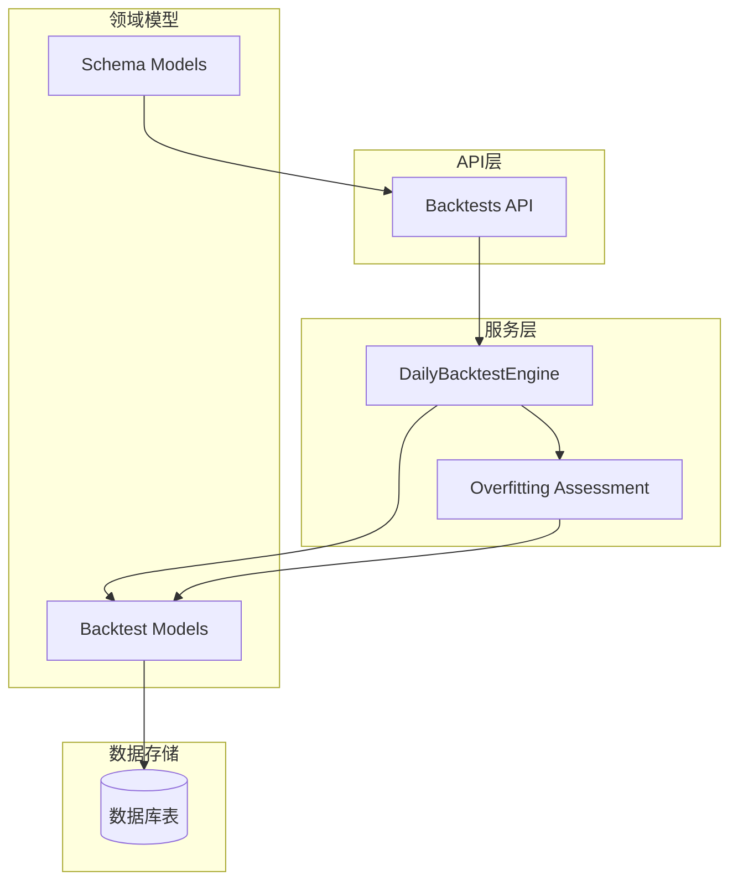
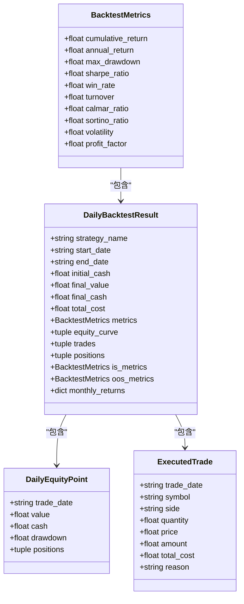
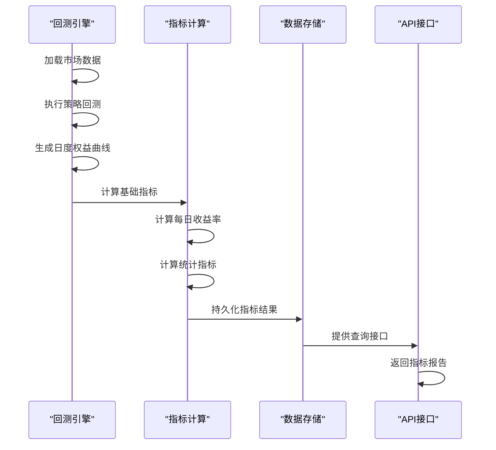
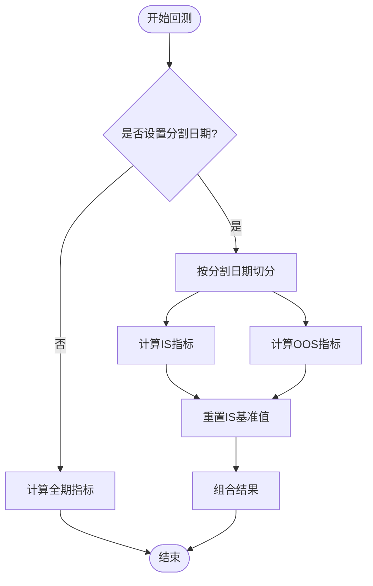
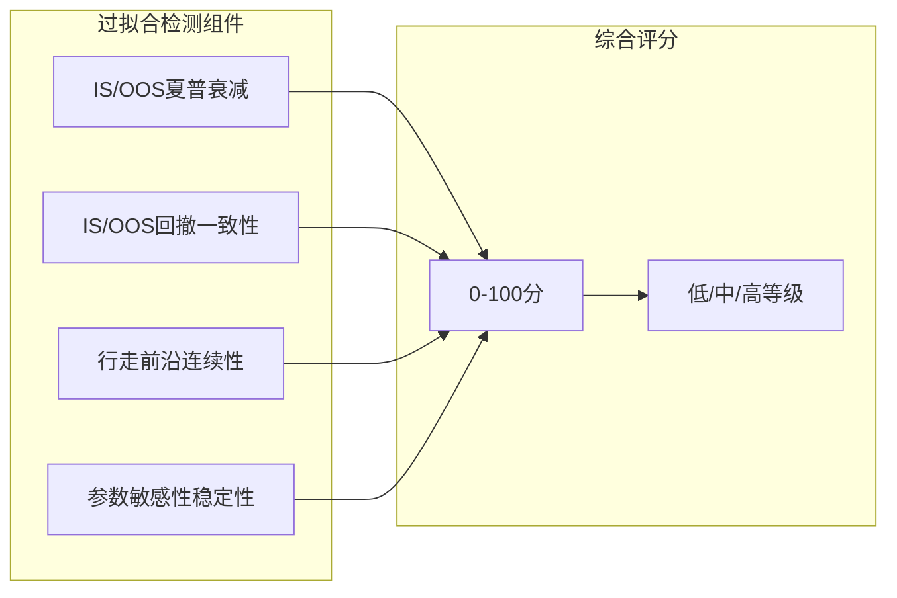
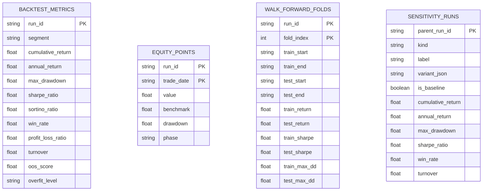
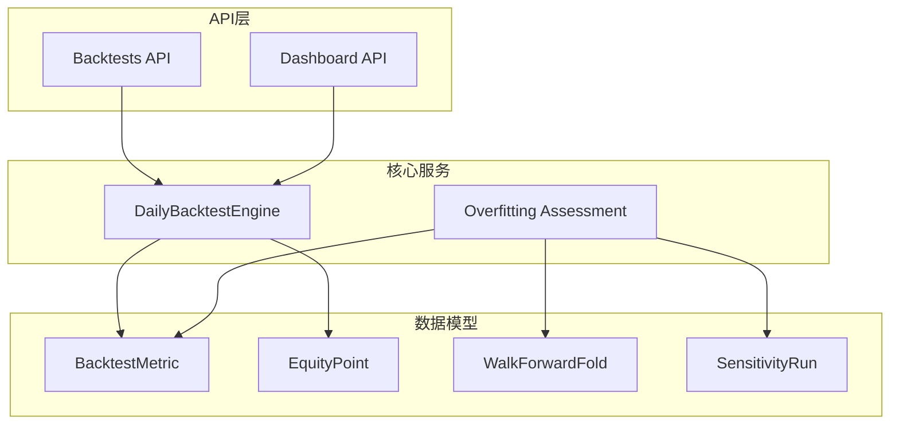

# 回测指标计算

<cite>
**本文档引用的文件**
- [daily_backtest.py](file://backend/app/services/daily_backtest.py)
- [overfitting.py](file://backend/app/services/overfitting.py)
- [models.py](file://backend/app/domains/backtest/models.py)
- [schemas.py](file://backend/app/domains/backtest/schemas.py)
- [backtests.py](file://backend/app/api/v1/backtests.py)
- [test_daily_backtest.py](file://backend/tests/services/test_daily_backtest.py)
- [test_backtests.py](file://backend/tests/api/test_backtests.py)
</cite>

## 目录
1. [简介](#简介)
2. [项目结构](#项目结构)
3. [核心组件](#核心组件)
4. [架构概览](#架构概览)
5. [详细组件分析](#详细组件分析)
6. [依赖关系分析](#依赖关系分析)
7. [性能考虑](#性能考虑)
8. [故障排除指南](#故障排除指南)
9. [结论](#结论)

## 简介

本文件为量化投资回测指标计算模块的详细技术文档。该模块实现了完整的量化策略评估体系，涵盖累计收益、年化收益、最大回撤、夏普比率、胜率、盈亏比、换手率等核心指标的数学公式与实现逻辑。文档特别强调了样本内（In-Sample, IS）与样本外（Out-of-Sample, OOS）指标的区别与计算方法，并深入解释了这些指标在策略评估中的作用和局限性。

## 项目结构

回测指标计算模块主要位于后端服务层，采用分层架构设计：

**图表来源**
- [daily_backtest.py:185-200](file://backend/app/services/daily_backtest.py#L185-L200)
- [overfitting.py:129-167](file://backend/app/services/overfitting.py#L129-L167)

**章节来源**
- [daily_backtest.py:1-200](file://backend/app/services/daily_backtest.py#L1-L200)
- [models.py:1-155](file://backend/app/domains/backtest/models.py#L1-L155)

## 核心组件

### 指标计算核心类

系统定义了多个核心数据结构来承载指标计算结果：

**图表来源**
- [daily_backtest.py:96-146](file://backend/app/services/daily_backtest.py#L96-L146)

### 指标计算函数族

系统实现了完整的指标计算函数族，包括：

- 基础指标：累计收益、年化收益、最大回撤、夏普比率
- 风险调整指标：Calmar比率、Sortino比率
- 效率指标：波动率、盈亏比
- 行为指标：胜率、换手率

**章节来源**
- [daily_backtest.py:702-804](file://backend/app/services/daily_backtest.py#L702-L804)

## 架构概览

回测指标计算采用流水线式处理架构：

**图表来源**
- [daily_backtest.py:191-200](file://backend/app/services/daily_backtest.py#L191-L200)
- [daily_backtest.py:258-283](file://backend/app/services/daily_backtest.py#L258-L283)

## 详细组件分析

### 样本内与样本外指标分离

系统支持IS/OOS分割的指标计算，这是防止过拟合的关键机制：

**图表来源**
- [daily_backtest.py:495-534](file://backend/app/services/daily_backtest.py#L495-L534)
- [daily_backtest.py:537-555](file://backend/app/services/daily_backtest.py#L537-L555)

#### 样本内（IS）指标特点：
- 使用原始初始资金作为基准
- 用于参数优化和策略选择
- 反映策略在历史数据上的表现能力

#### 样本外（OOS）指标特点：
- 以IS末尾净值作为基准重新计算
- 更接近真实交易环境
- 用于验证策略的泛化能力

**章节来源**
- [daily_backtest.py:495-534](file://backend/app/services/daily_backtest.py#L495-L534)
- [daily_backtest.py:525-533](file://backend/app/services/daily_backtest.py#L525-L533)

### 核心指标计算详解

#### 累计收益（Cumulative Return）
数学公式：`累计收益 = 最终净值 / 初始资金 - 1`

实现要点：
- 直接使用最终净值与初始资金的比值
- 不考虑时间因素，仅反映总体回报

#### 年化收益（Annualized Return）
数学公式：`年化收益 = (最终净值 / 初始资金)^(252/交易天数) - 1`

实现要点：
- 基于252个交易日假设
- 考虑复利效应的时间价值

#### 最大回撤（Maximum Drawdown）
数学公式：`最大回撤 = min(净值/峰值 - 1)`

实现要点：
- 基于运行峰值计算相对回撤
- 严格取负值，表示最大损失幅度

#### 夏普比率（Sharpe Ratio）
数学公式：`夏普比率 = 平均日收益 / 日收益标准差 × √252`

实现要点：
- 考虑所有交易日的收益分布
- 使用252作为年化因子
- 单边限制在±20范围内

#### 胜率（Win Rate）
数学公式：`胜率 = 盈利交易数 / 总交易数`

实现要点：
- 排除零收益日
- 仅计算非零收益日的正负比例

#### 换手率（Turnover）
数学公式：`换手率 = 交易金额总和 / 日均净值`

实现要点：
- 使用日度净值平均值作为分母
- 反映策略的交易活跃程度

#### Calmar比率
数学公式：`Calmar比率 = 年化收益 / |最大回撤|`

实现要点：
- 限制上限为20
- 综合考虑收益与风险

#### Sortino比率
数学公式：`Sortino比率 = 平均日收益 / 下行标准差 × √252`

实现要点：
- 仅惩罚负收益波动
- 对下行风险更敏感

#### 波动率（Volatility）
数学公式：`波动率 = 日收益标准差 × √252`

实现要点：
- 基于样本方差计算
- 年化标准化

#### 盈亏比（Profit Factor）
数学公式：`盈亏比 = 盈利总额 / 亏损总额`

实现要点：
- 限制上限为20
- 反映单次交易质量

**章节来源**
- [daily_backtest.py:702-804](file://backend/app/services/daily_backtest.py#L702-L804)
- [daily_backtest.py:742-796](file://backend/app/services/daily_backtest.py#L742-L796)

### 过拟合检测机制

系统实现了多维度的过拟合检测：

**图表来源**
- [overfitting.py:87-126](file://backend/app/services/overfitting.py#L87-L126)

**章节来源**
- [overfitting.py:51-126](file://backend/app/services/overfitting.py#L51-L126)

### 数据持久化与API集成

指标结果通过ORM模型持久化到数据库：

**图表来源**
- [models.py:33-155](file://backend/app/domains/backtest/models.py#L33-L155)

**章节来源**
- [models.py:33-155](file://backend/app/domains/backtest/models.py#L33-L155)
- [schemas.py:155-350](file://backend/app/domains/backtest/schemas.py#L155-L350)

## 依赖关系分析

### 内部依赖关系

**图表来源**
- [daily_backtest.py:16-26](file://backend/app/services/daily_backtest.py#L16-L26)
- [overfitting.py:22-26](file://backend/app/services/overfitting.py#L22-L26)

### 外部依赖

系统依赖以下外部库：
- SQLAlchemy：数据库ORM操作
- NumPy/Pandas：数值计算（在其他模块中使用）
- Pydantic：数据验证和序列化

**章节来源**
- [daily_backtest.py:12-26](file://backend/app/services/daily_backtest.py#L12-L26)

## 性能考虑

### 时间复杂度分析

所有指标计算均为线性时间复杂度O(n)，其中n为交易日数量：

- 日度收益率计算：O(n)
- 统计指标计算：O(n)
- 指标组合：O(1)

### 空间复杂度优化

- 权益曲线点：O(n)
- 中间计算变量：O(1)
- 指标缓存：O(1)

### 性能优化技巧

1. **内存管理**：使用生成器表达式避免中间列表创建
2. **批量计算**：一次性计算所有指标而非逐个计算
3. **缓存策略**：对重复计算的结果进行缓存
4. **向量化操作**：在可能的情况下使用NumPy数组操作

### 错误处理与边界条件

系统实现了完善的错误处理机制：

- 空序列检查：避免除零错误
- 数值稳定性：添加小常数防止数值溢出
- 边界值处理：限制指标范围防止异常值影响
- 类型验证：确保输入数据格式正确

**章节来源**
- [daily_backtest.py:708-716](file://backend/app/services/daily_backtest.py#L708-L716)
- [daily_backtest.py:760-768](file://backend/app/services/daily_backtest.py#L760-L768)

## 故障排除指南

### 常见问题诊断

#### 指标值异常
- **问题**：某些指标显示为无穷大或NaN
- **原因**：除零错误或空序列
- **解决方案**：检查输入数据质量和边界条件处理

#### 过拟合检测失败
- **问题**：无法生成过拟合评估
- **原因**：缺少必要的数据（IS/OOS分割、行走前沿数据等）
- **解决方案**：确保提供完整的回测数据

#### 性能问题
- **问题**：大规模数据集处理缓慢
- **原因**：算法复杂度或内存不足
- **解决方案**：优化数据结构或增加硬件资源

### 调试工具

系统提供了多种调试和验证工具：

- 单元测试覆盖关键计算逻辑
- API端点验证指标计算准确性
- 数据库查询验证持久化结果

**章节来源**
- [test_daily_backtest.py:157-173](file://backend/tests/services/test_daily_backtest.py#L157-L173)
- [test_backtests.py:77-89](file://backend/tests/api/test_backtests.py#L77-L89)

## 结论

回测指标计算模块为量化投资提供了完整的评估框架。通过精确的数学公式实现和严谨的工程实践，系统能够：

1. **准确计算**：所有核心指标均基于严格的数学定义实现
2. **区分IS/OOS**：有效防止过拟合，提高策略泛化能力
3. **全面评估**：涵盖收益、风险、效率等多个维度
4. **可扩展性**：模块化设计便于功能扩展和维护

该模块为策略开发、验证和部署提供了坚实的技术基础，是量化投资系统的核心组成部分。