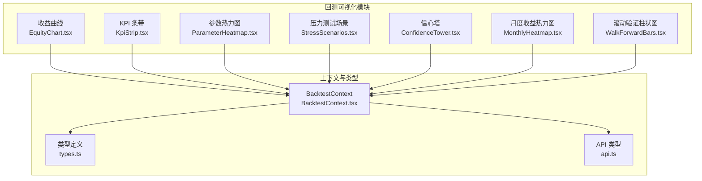
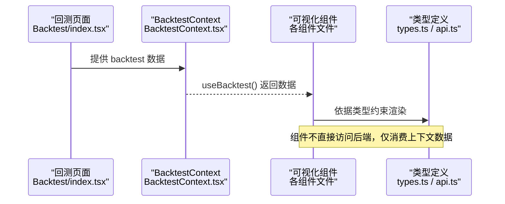
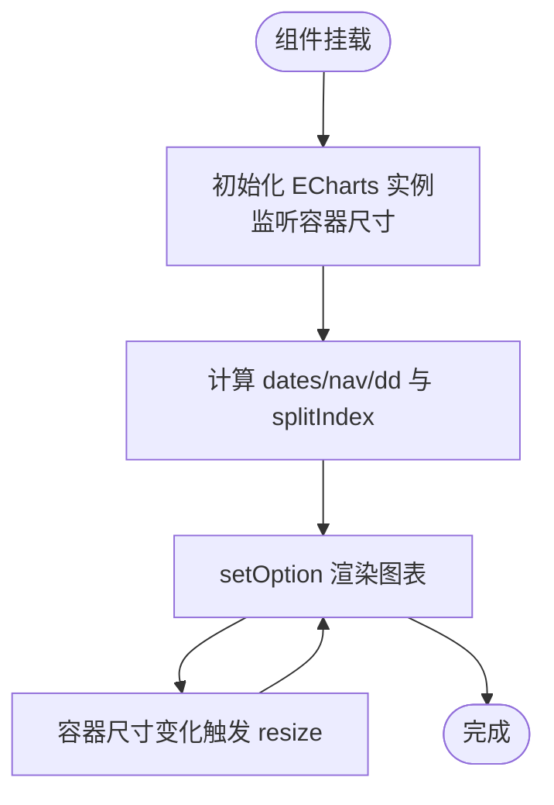
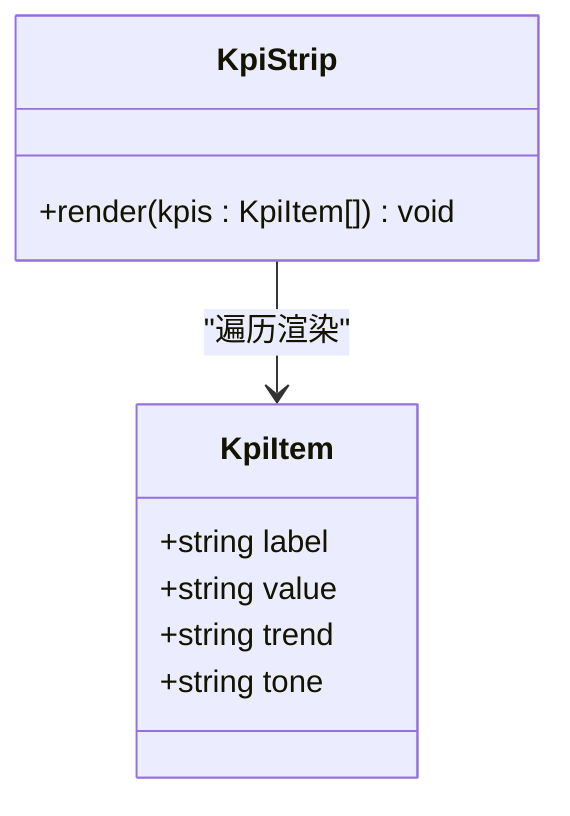
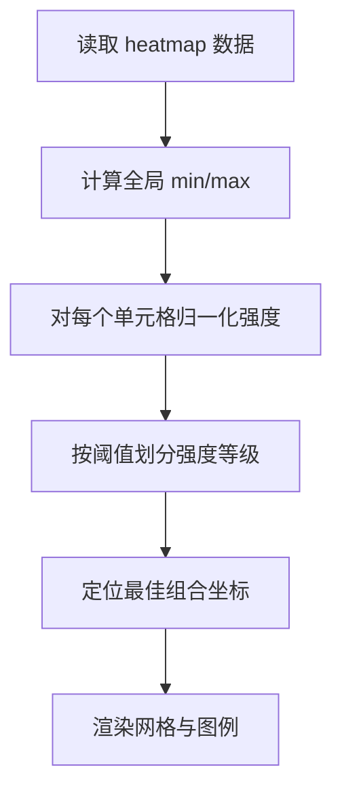
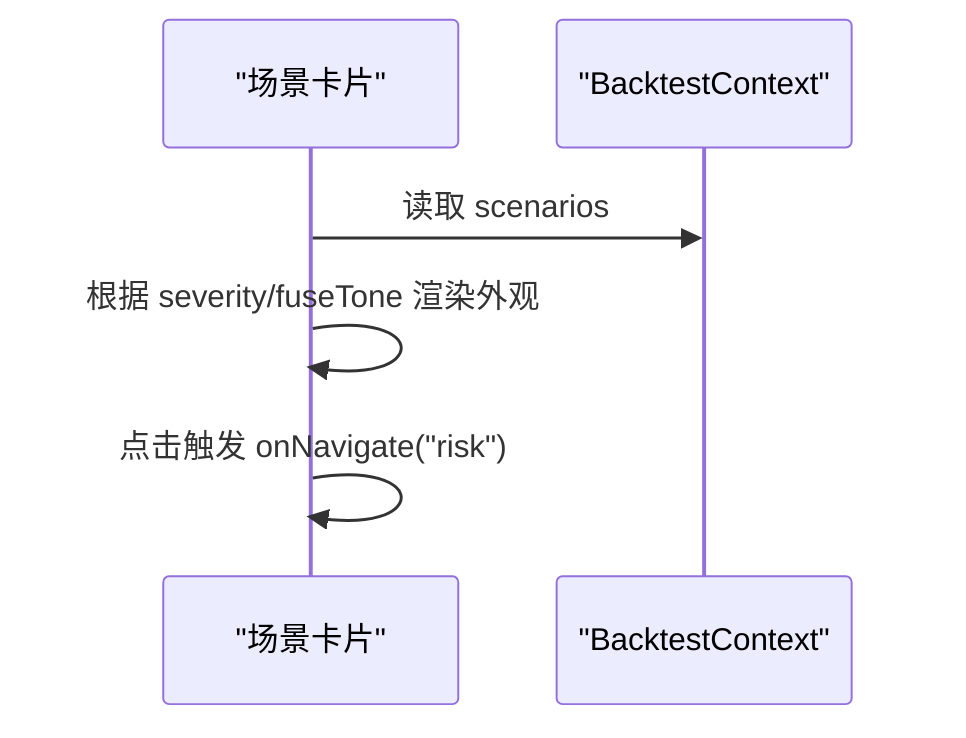
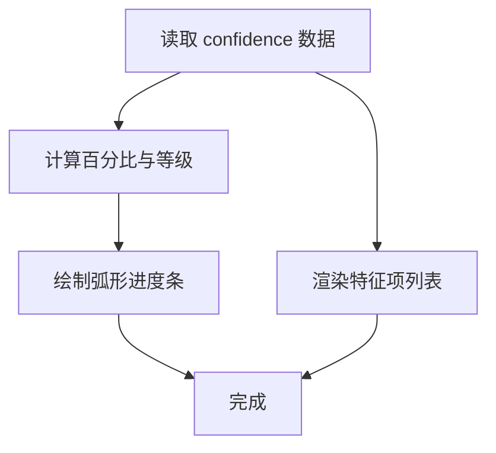
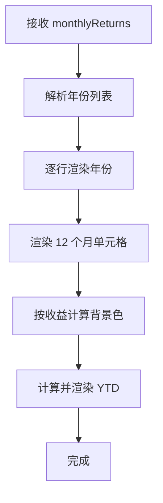
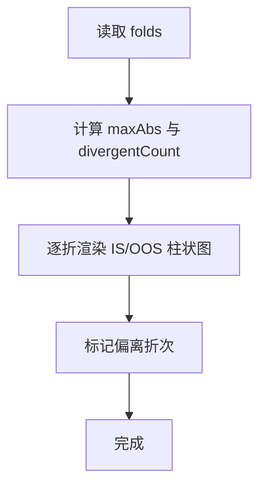
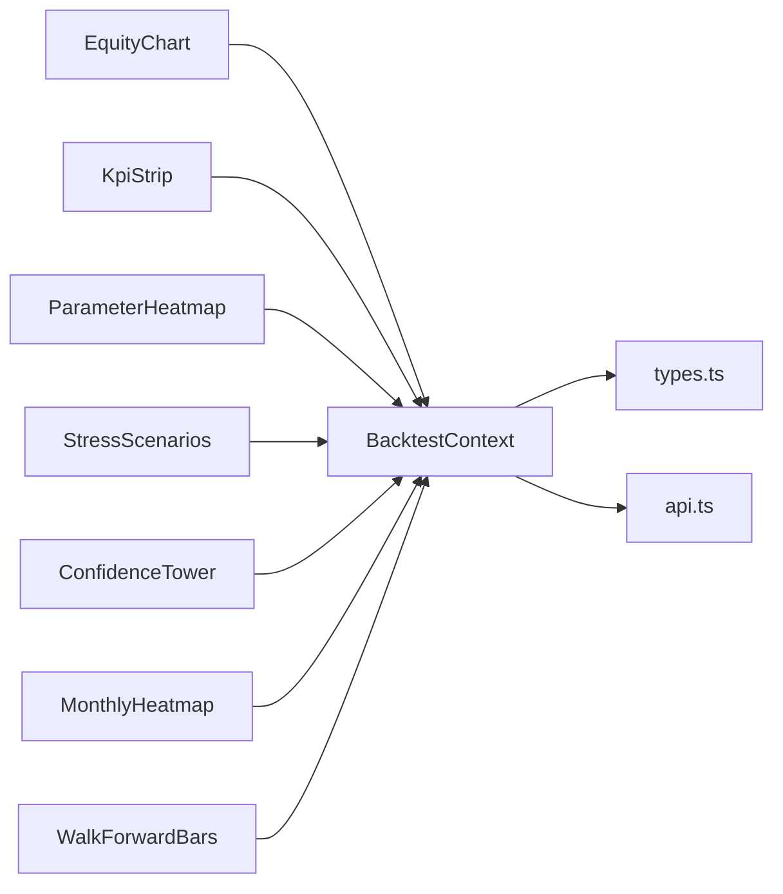

# 回测结果可视化

<cite>
**本文引用的文件**
- [EquityChart.tsx](file://frontend/src/screens/Backtest/EquityChart.tsx)
- [KpiStrip.tsx](file://frontend/src/screens/Backtest/KpiStrip.tsx)
- [ParameterHeatmap.tsx](file://frontend/src/screens/Backtest/ParameterHeatmap.tsx)
- [StressScenarios.tsx](file://frontend/src/screens/Backtest/StressScenarios.tsx)
- [ConfidenceTower.tsx](file://frontend/src/screens/Backtest/ConfidenceTower.tsx)
- [MonthlyHeatmap.tsx](file://frontend/src/screens/Backtest/MonthlyHeatmap.tsx)
- [WalkForwardBars.tsx](file://frontend/src/screens/Backtest/WalkForwardBars.tsx)
- [BacktestContext.tsx](file://frontend/src/contexts/BacktestContext.tsx)
- [api.ts](file://frontend/src/lib/api.ts)
- [types.ts](file://frontend/src/data/types.ts)
- [index.tsx](file://frontend/src/screens/Backtest/index.tsx)
</cite>

## 目录
1. [简介](#简介)
2. [项目结构](#项目结构)
3. [核心组件](#核心组件)
4. [架构总览](#架构总览)
5. [详细组件分析](#详细组件分析)
6. [依赖关系分析](#依赖关系分析)
7. [性能考量](#性能考量)
8. [故障排查指南](#故障排查指南)
9. [结论](#结论)
10. [附录](#附录)

## 简介
本文件面向前端开发者，系统化梳理回测结果可视化模块的 UI 组件，涵盖收益曲线图表、KPI 面板、参数热力图、压力测试场景、信心塔、月度收益热力图与滚动验证柱状图等。文档提供组件职责、数据绑定、交互行为、样式定制与性能优化建议，并给出使用示例与数据格式要求，帮助快速搭建直观、美观的回测结果展示界面。

## 项目结构
回测可视化相关代码集中于前端 screens/Backtest 目录，配合上下文与类型定义实现数据驱动的可视化渲染。

**图表来源**
- [EquityChart.tsx:1-189](file://frontend/src/screens/Backtest/EquityChart.tsx#L1-L189)
- [KpiStrip.tsx:1-19](file://frontend/src/screens/Backtest/KpiStrip.tsx#L1-L19)
- [ParameterHeatmap.tsx:1-88](file://frontend/src/screens/Backtest/ParameterHeatmap.tsx#L1-L88)
- [StressScenarios.tsx:1-65](file://frontend/src/screens/Backtest/StressScenarios.tsx#L1-L65)
- [ConfidenceTower.tsx:1-60](file://frontend/src/screens/Backtest/ConfidenceTower.tsx#L1-L60)
- [MonthlyHeatmap.tsx:1-87](file://frontend/src/screens/Backtest/MonthlyHeatmap.tsx#L1-L87)
- [WalkForwardBars.tsx:1-81](file://frontend/src/screens/Backtest/WalkForwardBars.tsx#L1-L81)
- [BacktestContext.tsx:1-13](file://frontend/src/contexts/BacktestContext.tsx#L1-L13)
- [types.ts:77-125](file://frontend/src/data/types.ts#L77-L125)
- [api.ts:135-191](file://frontend/src/lib/api.ts#L135-L191)

**章节来源**
- [index.tsx:1-1261](file://frontend/src/screens/Backtest/index.tsx#L1-L1261)

## 核心组件
- 收益曲线图表：基于 ECharts 的净值与回撤双轴折线图，支持 IS/OOS 区间标记与自适应布局。
- KPI 面板：展示关键指标标签、数值与趋势色条，颜色语义化指示优劣。
- 参数热力图：二维参数扫描的热力图，标注最佳参数组合与强度等级。
- 压力测试场景：极端场景下的组合损失、最大回撤与人工介入提示，支持导航至风险页。
- 信心塔：AI 综合置信度仪表盘，包含子特征评分与描述。
- 月度收益热力图：按年份与月份展示收益强度，突出正负与透明度。
- 滚动验证柱状图：多折 IS/OOS 收益对比，识别偏离与波动。

**章节来源**
- [EquityChart.tsx:1-189](file://frontend/src/screens/Backtest/EquityChart.tsx#L1-L189)
- [KpiStrip.tsx:1-19](file://frontend/src/screens/Backtest/KpiStrip.tsx#L1-L19)
- [ParameterHeatmap.tsx:1-88](file://frontend/src/screens/Backtest/ParameterHeatmap.tsx#L1-L88)
- [StressScenarios.tsx:1-65](file://frontend/src/screens/Backtest/StressScenarios.tsx#L1-L65)
- [ConfidenceTower.tsx:1-60](file://frontend/src/screens/Backtest/ConfidenceTower.tsx#L1-L60)
- [MonthlyHeatmap.tsx:1-87](file://frontend/src/screens/Backtest/MonthlyHeatmap.tsx#L1-L87)
- [WalkForwardBars.tsx:1-81](file://frontend/src/screens/Backtest/WalkForwardBars.tsx#L1-L81)

## 架构总览
回测结果页面通过上下文读取 mock 或真实后端数据，各可视化组件以“纯展示”形式消费上下文中的 backtest 数据片段，形成解耦的可视化面板集合。

**图表来源**
- [index.tsx:137-250](file://frontend/src/screens/Backtest/index.tsx#L137-L250)
- [BacktestContext.tsx:1-13](file://frontend/src/contexts/BacktestContext.tsx#L1-L13)
- [types.ts:77-125](file://frontend/src/data/types.ts#L77-L125)
- [api.ts:135-191](file://frontend/src/lib/api.ts#L135-L191)

## 详细组件分析

### 收益曲线图表（EquityChart）
- 功能要点
  - 计算净值百分比与回撤百分比序列，支持 IS/OOS 切分标记。
  - 双网格双坐标轴：净值曲线（上）与回撤曲线（下）。
  - 自适应容器尺寸，ResizeObserver 监听容器变化并重绘。
- 关键属性
  - 输入：equity（净值点序列）、inSampleEndDate（可选切分日）。
  - 输出：折线图（净值面积与回撤区域）、标记区域与标记线。
- 数据绑定
  - equity 数组项需满足接口定义，包含交易日、净值与可选回撤。
- 交互与样式
  - Tooltip 格式化百分比；Legend 显示两条曲线含义；渐变色增强视觉层次。
- 性能建议
  - 控制数据点数量，必要时降采样；避免频繁重算比例尺；合理设置动画时长。

**图表来源**
- [EquityChart.tsx:14-50](file://frontend/src/screens/Backtest/EquityChart.tsx#L14-L50)
- [EquityChart.tsx:74-181](file://frontend/src/screens/Backtest/EquityChart.tsx#L74-L181)

**章节来源**
- [EquityChart.tsx:1-189](file://frontend/src/screens/Backtest/EquityChart.tsx#L1-L189)
- [api.ts:148-153](file://frontend/src/lib/api.ts#L148-L153)

### KPI 面板（KpiStrip）
- 功能要点
  - 展示多个关键指标，每个指标包含标签、数值、趋势与色条。
  - 色调由 tone 字段控制，用于快速判断优劣。
- 数据绑定
  - 从上下文 backtest.kpis 读取数组，每项包含 label/value/trend/tone。
- 交互与样式
  - 无交互；通过 tone 类名切换视觉风格。

**图表来源**
- [KpiStrip.tsx:1-19](file://frontend/src/screens/Backtest/KpiStrip.tsx#L1-L19)
- [types.ts:78-78](file://frontend/src/data/types.ts#L78-L78)

**章节来源**
- [KpiStrip.tsx:1-19](file://frontend/src/screens/Backtest/KpiStrip.tsx#L1-L19)
- [types.ts:77-79](file://frontend/src/data/types.ts#L77-L79)

### 参数热力图（ParameterHeatmap）
- 功能要点
  - 展示二维参数扫描的收益强度（如夏普比率）。
  - 标注最佳组合（bestX/bestY）与最佳得分。
- 数据绑定
  - 从上下文 backtest.parameterHeatmap 读取：x/y 轴标签、刻度、单元格矩阵、最佳索引。
- 交互与样式
  - 单元格强度通过 min/max 归一化映射；高亮最佳单元格；提供图例说明。

**图表来源**
- [ParameterHeatmap.tsx:7-15](file://frontend/src/screens/Backtest/ParameterHeatmap.tsx#L7-L15)
- [ParameterHeatmap.tsx:52-66](file://frontend/src/screens/Backtest/ParameterHeatmap.tsx#L52-L66)

**章节来源**
- [ParameterHeatmap.tsx:1-88](file://frontend/src/screens/Backtest/ParameterHeatmap.tsx#L1-L88)
- [types.ts:116-124](file://frontend/src/data/types.ts#L116-L124)

### 压力测试场景（StressScenarios）
- 功能要点
  - 展示不同严重程度的压力场景，包含组合损失、最大回撤、人工介入需求与 AI 建议。
  - 场景项可点击导航至风险页。
- 数据绑定
  - 从上下文 backtest.scenarios 读取数组，包含 severity/fuse/suggestion 等字段。
- 交互与样式
  - 严重程度与熔断状态分别映射到视觉类别；点击事件回调 onNavigate。

**图表来源**
- [StressScenarios.tsx:3-7](file://frontend/src/screens/Backtest/StressScenarios.tsx#L3-L7)
- [StressScenarios.tsx:25-61](file://frontend/src/screens/Backtest/StressScenarios.tsx#L25-L61)

**章节来源**
- [StressScenarios.tsx:1-65](file://frontend/src/screens/Backtest/StressScenarios.tsx#L1-L65)
- [types.ts:105-115](file://frontend/src/data/types.ts#L105-L115)

### 信心塔（ConfidenceTower）
- 功能要点
  - 综合置信度仪表盘，包含主标签与子特征评分列表。
  - 置信度映射为不同颜色等级，弧形进度条展示百分比。
- 数据绑定
  - 从上下文 backtest.confidence 读取 score/label/features。
- 交互与样式
  - 无交互；通过 SVG 渐变与类名控制颜色与标签。

**图表来源**
- [ConfidenceTower.tsx:6-11](file://frontend/src/screens/Backtest/ConfidenceTower.tsx#L6-L11)
- [ConfidenceTower.tsx:19-56](file://frontend/src/screens/Backtest/ConfidenceTower.tsx#L19-L56)

**章节来源**
- [ConfidenceTower.tsx:1-60](file://frontend/src/screens/Backtest/ConfidenceTower.tsx#L1-L60)
- [types.ts:85-89](file://frontend/src/data/types.ts#L85-L89)

### 月度收益热力图（MonthlyHeatmap）
- 功能要点
  - 按年份与月份展示收益，正负以不同色调表示，透明度反映幅度。
  - 计算并显示 YTD 合计收益。
- 数据绑定
  - 输入 monthlyReturns（键为 YYYY-MM，值为月度收益）。
- 交互与样式
  - 无交互；通过背景色与文本颜色区分正负。

**图表来源**
- [MonthlyHeatmap.tsx:23-46](file://frontend/src/screens/Backtest/MonthlyHeatmap.tsx#L23-L46)
- [MonthlyHeatmap.tsx:52-70](file://frontend/src/screens/Backtest/MonthlyHeatmap.tsx#L52-L70)

**章节来源**
- [MonthlyHeatmap.tsx:1-87](file://frontend/src/screens/Backtest/MonthlyHeatmap.tsx#L1-L87)

### 滚动验证柱状图（WalkForwardBars）
- 功能要点
  - 展示多折 IS/OOS 收益对比，识别显著偏离的折次。
  - 统计最大绝对值与偏离折数。
- 数据绑定
  - 从上下文 backtest.walkForward.folds 读取每折的训练/测试收益与周期。
- 交互与样式
  - 无交互；通过宽度与颜色标识正负与幅度。

**图表来源**
- [WalkForwardBars.tsx:7-17](file://frontend/src/screens/Backtest/WalkForwardBars.tsx#L7-L17)
- [WalkForwardBars.tsx:32-76](file://frontend/src/screens/Backtest/WalkForwardBars.tsx#L32-L76)

**章节来源**
- [WalkForwardBars.tsx:1-81](file://frontend/src/screens/Backtest/WalkForwardBars.tsx#L1-L81)
- [types.ts:90-92](file://frontend/src/data/types.ts#L90-L92)

## 依赖关系分析
- 组件依赖
  - 所有可视化组件均通过 useBacktest 从 BacktestContext 获取数据，保持解耦。
  - EquityChart 直接依赖 ECharts 并处理容器尺寸与重绘。
- 类型与数据契约
  - backtest 模块的数据结构在 types.ts 中定义，组件严格遵循该结构进行渲染。
  - API 类型定义位于 api.ts，用于后端对接（mock 或真实服务）。

**图表来源**
- [BacktestContext.tsx:1-13](file://frontend/src/contexts/BacktestContext.tsx#L1-L13)
- [types.ts:77-125](file://frontend/src/data/types.ts#L77-L125)
- [api.ts:135-191](file://frontend/src/lib/api.ts#L135-L191)

**章节来源**
- [BacktestContext.tsx:1-13](file://frontend/src/contexts/BacktestContext.tsx#L1-L13)
- [types.ts:77-125](file://frontend/src/data/types.ts#L77-L125)
- [api.ts:135-191](file://frontend/src/lib/api.ts#L135-L191)

## 性能考量
- 数据规模控制
  - 收益曲线与月度热力图应限制数据点数量，必要时进行降采样或聚合。
- 渲染优化
  - 使用 useMemo 缓存派生数据（如归一化强度、最大最小值、切分索引）。
  - EquityChart 使用 ResizeObserver 避免强制刷新，减少重排。
- 图表性能
  - ECharts 渐进渲染与动画时长适度，避免大数据量时卡顿。
- 交互节流
  - 对频繁变更的筛选器（如 IS/OOS 切分、参数调整）采用防抖/节流策略。

## 故障排查指南
- 上下文未包裹
  - 若 useBacktest 抛出错误，检查是否在 BacktestProvider 内部使用组件。
- 数据为空
  - 当 equity 为空时，收益曲线组件会显示提示；确认回测任务已完成且返回有效数据。
- 尺寸异常
  - 若容器宽高为 0，ECharts 初始化会被跳过；确保容器可见并具备尺寸。
- 严重程度映射
  - 压力场景的 severity 与熔断状态需与样式类一致，避免视觉错位。

**章节来源**
- [BacktestContext.tsx:8-12](file://frontend/src/contexts/BacktestContext.tsx#L8-L12)
- [EquityChart.tsx:183-185](file://frontend/src/screens/Backtest/EquityChart.tsx#L183-L185)
- [StressScenarios.tsx:3-7](file://frontend/src/screens/Backtest/StressScenarios.tsx#L3-L7)

## 结论
回测结果可视化模块以组件化方式组织，通过上下文统一注入数据，实现高内聚、低耦合的展示层。各组件职责清晰、数据契约明确，便于扩展与维护。结合本文的配置、交互与性能建议，可快速构建专业、易用的回测结果可视化界面。

## 附录

### 组件使用示例（路径指引）
- 在回测页面中引入并组合使用上述组件，参考页面主入口文件的布局与状态管理。
- 示例路径：
  - [回测页面主入口:797-800](file://frontend/src/screens/Backtest/index.tsx#L797-L800)

### 数据格式要求（关键字段）
- 收益曲线（EquityChart）
  - equity：数组，元素包含 tradeDate、value、drawdown（可选）、phase（可选）。
  - 参考类型：[BacktestEquityPointPayload:148-153](file://frontend/src/lib/api.ts#L148-L153)
- KPI 面板（KpiStrip）
  - kpis：数组，元素包含 label、value、trend、tone。
  - 参考类型：[MockData.backtest.kpis:78-78](file://frontend/src/data/types.ts#L78-L78)
- 参数热力图（ParameterHeatmap）
  - parameterHeatmap：包含 xLabel、yLabel、xTicks、yTicks、cells、bestX、bestY。
  - 参考类型：[MockData.backtest.parameterHeatmap:116-124](file://frontend/src/data/types.ts#L116-L124)
- 压力测试场景（StressScenarios）
  - scenarios：数组，元素包含 severity、fuse、fuseTone、loss、maxDd、human、suggestion。
  - 参考类型：[MockData.backtest.scenarios:105-115](file://frontend/src/data/types.ts#L105-L115)
- 信心塔（ConfidenceTower）
  - confidence：包含 score、label、features（含 title/desc/score/tone）。
  - 参考类型：[MockData.backtest.confidence:85-89](file://frontend/src/data/types.ts#L85-L89)
- 月度收益热力图（MonthlyHeatmap）
  - monthlyReturns：对象，键为 YYYY-MM，值为月度收益。
  - 参考类型：[BacktestTaskResult.monthlyReturns:164-164](file://frontend/src/lib/api.ts#L164-L164)
- 滚动验证柱状图（WalkForwardBars）
  - walkForward.folds：数组，元素包含 period、isReturn、oosReturn。
  - 参考类型：[MockData.backtest.walkForward:90-92](file://frontend/src/data/types.ts#L90-L92)