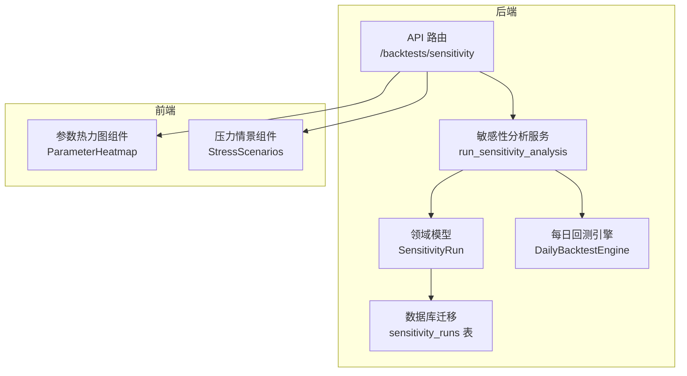
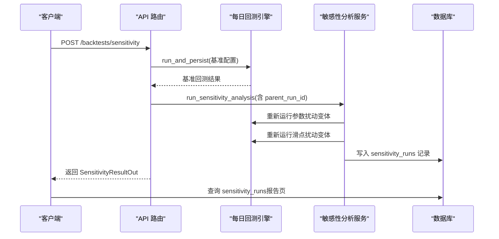
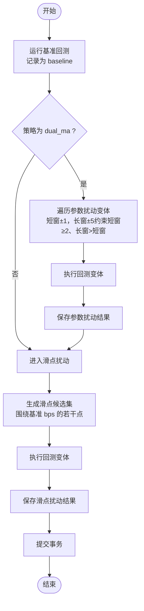
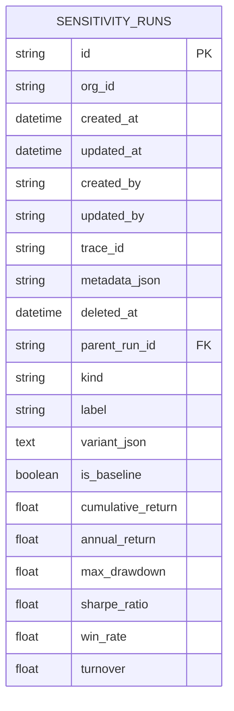
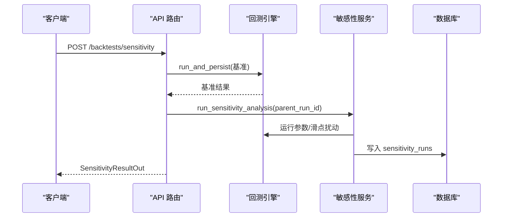
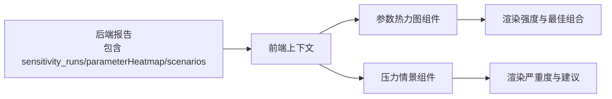
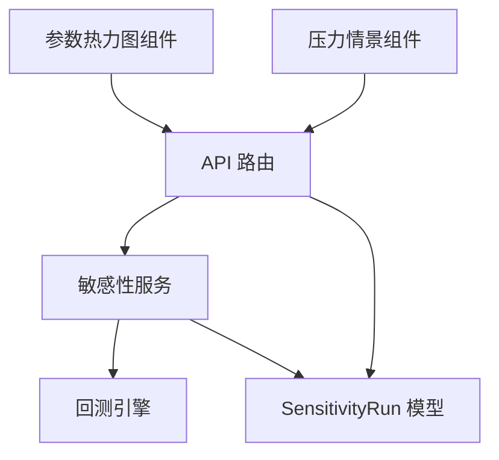

# 敏感性分析

<cite>
**本文引用的文件**
- [backend/app/services/sensitivity.py](file://backend/app/services/sensitivity.py)
- [backend/app/db/migrations/versions/a00a9a166a85_sensitivity_runs.py](file://backend/app/db/migrations/versions/a00a9a166a85_sensitivity_runs.py)
- [backend/app/domains/backtest/models.py](file://backend/app/domains/backtest/models.py)
- [backend/app/domains/backtest/schemas.py](file://backend/app/domains/backtest/schemas.py)
- [backend/app/api/v1/backtests.py](file://backend/app/api/v1/backtests.py)
- [backend/app/services/daily_backtest.py](file://backend/app/services/daily_backtest.py)
- [backend/app/domains/strategy/examples.py](file://backend/app/domains/strategy/examples.py)
- [backend/tests/services/test_sensitivity.py](file://backend/tests/services/test_sensitivity.py)
- [frontend/src/screens/Backtest/ParameterHeatmap.tsx](file://frontend/src/screens/Backtest/ParameterHeatmap.tsx)
- [frontend/src/screens/Backtest/StressScenarios.tsx](file://frontend/src/screens/Backtest/StressScenarios.tsx)
- [frontend/src/screens/Backtest/BacktestComparison.tsx](file://frontend/src/screens/Backtest/BacktestComparison.tsx)
- [frontend/src/screens/Backtest/KpiStrip.tsx](file://frontend/src/screens/Backtest/KpiStrip.tsx)
</cite>

## 目录
1. [简介](#简介)
2. [项目结构](#项目结构)
3. [核心组件](#核心组件)
4. [架构总览](#架构总览)
5. [详细组件分析](#详细组件分析)
6. [依赖关系分析](#依赖关系分析)
7. [性能考量](#性能考量)
8. [故障排查指南](#故障排查指南)
9. [结论](#结论)
10. [附录](#附录)

## 简介
本文件系统化梳理“敏感性分析”模块的设计与实现，覆盖参数扰动测试、滑点敏感性分析、交易成本敏感性与市场条件敏感性的执行流程、参数范围设置、结果可视化与风险评估方法。文档面向开发者与策略研究者，提供从配置到结果解读的全链路说明，并结合数据库表结构、API 接口与前端组件，帮助理解策略对不同因素的敏感程度，优化参数与风险管理。

## 项目结构
敏感性分析位于后端服务层，围绕“基准回测 + 小规模扰动变体”的设计，确保 API 可保持同步响应。关键位置如下：
- 后端服务层：敏感性分析服务与每日回测引擎协作，生成扰动变体并持久化结果
- 数据模型与迁移：定义敏感性运行记录表及字段
- API 层：提供敏感性分析的入口接口，返回统一报告结构
- 前端组件：参数敏感性热力图、压力情景等可视化组件消费后端输出

图表来源
- [backend/app/api/v1/backtests.py:497-538](file://backend/app/api/v1/backtests.py#L497-L538)
- [backend/app/services/sensitivity.py:60-139](file://backend/app/services/sensitivity.py#L60-L139)
- [backend/app/db/migrations/versions/a00a9a166a85_sensitivity_runs.py:33-57](file://backend/app/db/migrations/versions/a00a9a166a85_sensitivity_runs.py#L33-L57)
- [backend/app/domains/backtest/models.py:71-93](file://backend/app/domains/backtest/models.py#L71-L93)
- [frontend/src/screens/Backtest/ParameterHeatmap.tsx:1-88](file://frontend/src/screens/Backtest/ParameterHeatmap.tsx#L1-L88)
- [frontend/src/screens/Backtest/StressScenarios.tsx:1-65](file://frontend/src/screens/Backtest/StressScenarios.tsx#L1-L65)

章节来源
- [backend/app/api/v1/backtests.py:497-538](file://backend/app/api/v1/backtests.py#L497-L538)
- [backend/app/services/sensitivity.py:1-139](file://backend/app/services/sensitivity.py#L1-L139)
- [backend/app/db/migrations/versions/a00a9a166a85_sensitivity_runs.py:1-57](file://backend/app/db/migrations/versions/a00a9a166a85_sensitivity_runs.py#L1-L57)
- [backend/app/domains/backtest/models.py:71-93](file://backend/app/domains/backtest/models.py#L71-L93)

## 核心组件
- 敏感性分析服务
  - 负责生成扰动变体、调用回测引擎执行、汇总指标并写入数据库
  - 支持两类扰动：参数扰动（如双均线窗口）、滑点扰动（bps）
- 数据模型与迁移
  - 定义 sensitivity_runs 表，存储每次扰动运行的关键指标与元信息
- API 路由
  - 提供 POST /backtests/sensitivity，返回统一报告结构，包含敏感性运行集合
- 前端组件
  - 参数热力图：展示不同参数组合下的夏普比率等指标
  - 压力情景：展示极端市场条件下的潜在损失与处置建议

章节来源
- [backend/app/services/sensitivity.py:23-139](file://backend/app/services/sensitivity.py#L23-L139)
- [backend/app/domains/backtest/models.py:71-93](file://backend/app/domains/backtest/models.py#L71-L93)
- [backend/app/domains/backtest/schemas.py:281-313](file://backend/app/domains/backtest/schemas.py#L281-L313)
- [backend/app/api/v1/backtests.py:497-538](file://backend/app/api/v1/backtests.py#L497-L538)
- [frontend/src/screens/Backtest/ParameterHeatmap.tsx:1-88](file://frontend/src/screens/Backtest/ParameterHeatmap.tsx#L1-L88)
- [frontend/src/screens/Backtest/StressScenarios.tsx:1-65](file://frontend/src/screens/Backtest/StressScenarios.tsx#L1-L65)

## 架构总览
下图展示从 API 到服务、再到数据库与前端的完整链路：

图表来源
- [backend/app/api/v1/backtests.py:497-538](file://backend/app/api/v1/backtests.py#L497-L538)
- [backend/app/services/sensitivity.py:60-139](file://backend/app/services/sensitivity.py#L60-L139)
- [backend/app/domains/backtest/models.py:71-93](file://backend/app/domains/backtest/models.py#L71-L93)

## 详细组件分析

### 组件一：敏感性分析服务（参数扰动与滑点扰动）
- 功能要点
  - 生成参数扰动变体（针对双均线策略的短/长均线窗口）
  - 生成滑点扰动变体（围绕基准滑点的若干 bps）
  - 对每个变体调用回测引擎，收集指标并持久化
- 关键实现
  - 参数扰动：限制短窗与长窗的合理范围，避免无效组合
  - 滑点扰动：在基准基础上增加固定步进与偏移，形成有限候选集
  - 异常容错：捕获回测异常，跳过失败变体，保证主流程稳定
- 输出结构
  - 每条记录包含 kind（param/slippage）、label、variant_json、is_baseline、以及一组指标（如累计收益、年化收益、最大回撤、夏普比率、胜率、换手率）

图表来源
- [backend/app/services/sensitivity.py:34-139](file://backend/app/services/sensitivity.py#L34-L139)

章节来源
- [backend/app/services/sensitivity.py:34-139](file://backend/app/services/sensitivity.py#L34-L139)

### 组件二：数据库模型与迁移（sensitivity_runs）
- 表结构
  - 关键字段：parent_run_id、kind、label、variant_json、is_baseline、各类指标
  - 索引：parent_run_id、kind，便于按父运行与扰动类型检索
- 设计意图
  - 将每次扰动运行作为独立行，保留 variant 的可追溯性
  - 与回测任务/运行解耦，支持跨任务的对比分析

图表来源
- [backend/app/db/migrations/versions/a00a9a166a85_sensitivity_runs.py:33-57](file://backend/app/db/migrations/versions/a00a9a166a85_sensitivity_runs.py#L33-L57)
- [backend/app/domains/backtest/models.py:71-93](file://backend/app/domains/backtest/models.py#L71-L93)

章节来源
- [backend/app/db/migrations/versions/a00a9a166a85_sensitivity_runs.py:1-57](file://backend/app/db/migrations/versions/a00a9a166a85_sensitivity_runs.py#L1-L57)
- [backend/app/domains/backtest/models.py:71-93](file://backend/app/domains/backtest/models.py#L71-L93)

### 组件三：API 路由与报告结构
- 入口接口
  - POST /backtests/sensitivity：创建并执行基准 + 敏感性扰动，返回统一报告
- 报告结构
  - 包含 task_id、run_id 与 runs 列表，每条 runs 包含 kind、label、is_baseline 与指标
- 与前端集成
  - 前端通过 /backtests/{task_id}/report 获取完整报告，包含敏感性运行、压力情景、参数热力图等

图表来源
- [backend/app/api/v1/backtests.py:497-538](file://backend/app/api/v1/backtests.py#L497-L538)
- [backend/app/domains/backtest/schemas.py:281-313](file://backend/app/domains/backtest/schemas.py#L281-L313)

章节来源
- [backend/app/api/v1/backtests.py:497-538](file://backend/app/api/v1/backtests.py#L497-L538)
- [backend/app/domains/backtest/schemas.py:281-313](file://backend/app/domains/backtest/schemas.py#L281-L313)

### 组件四：前端可视化（参数热力图与压力情景）
- 参数热力图
  - 输入：parameterHeatmap 结构（x/y 标签、刻度、单元格矩阵、最佳位置）
  - 渲染：按强度着色，突出最佳参数组合
- 压力情景
  - 输入：scenarios 列表（名称、严重级别、组合损失、最大回撤、熔断状态、建议、人工介入）
  - 渲染：按严重度与熔断状态着色，提供导航到风险页面的能力

图表来源
- [frontend/src/screens/Backtest/ParameterHeatmap.tsx:1-88](file://frontend/src/screens/Backtest/ParameterHeatmap.tsx#L1-L88)
- [frontend/src/screens/Backtest/StressScenarios.tsx:1-65](file://frontend/src/screens/Backtest/StressScenarios.tsx#L1-L65)
- [backend/app/domains/backtest/schemas.py:73-91](file://backend/app/domains/backtest/schemas.py#L73-L91)
- [backend/app/domains/backtest/schemas.py:61-71](file://backend/app/domains/backtest/schemas.py#L61-L71)

章节来源
- [frontend/src/screens/Backtest/ParameterHeatmap.tsx:1-88](file://frontend/src/screens/Backtest/ParameterHeatmap.tsx#L1-L88)
- [frontend/src/screens/Backtest/StressScenarios.tsx:1-65](file://frontend/src/screens/Backtest/StressScenarios.tsx#L1-L65)
- [backend/app/domains/backtest/schemas.py:73-91](file://backend/app/domains/backtest/schemas.py#L73-L91)
- [backend/app/domains/backtest/schemas.py:61-71](file://backend/app/domains/backtest/schemas.py#L61-L71)

### 组件五：策略与交易成本配置（支撑敏感性分析）
- 策略示例
  - 双均线策略使用 short_window 与 long_window 作为核心参数，敏感性分析会对其做小扰动
- 交易成本配置
  - BacktestCostConfig 提供佣金率、最低佣金、印花税率与滑点 bps，默认值用于基准与扰动生成

章节来源
- [backend/app/domains/strategy/examples.py:21-49](file://backend/app/domains/strategy/examples.py#L21-L49)
- [backend/app/services/daily_backtest.py:33-48](file://backend/app/services/daily_backtest.py#L33-L48)

## 依赖关系分析
- 服务层依赖
  - 敏感性服务依赖回测引擎与领域模型，负责变体生成与指标汇总
- 数据层依赖
  - 模型依赖 SQLAlchemy ORM，迁移脚本定义表结构与索引
- API 层依赖
  - 路由依赖服务层与领域模型，负责请求解析与响应序列化
- 前端依赖
  - 组件依赖后端提供的统一结构（如 SensitivityRunOut、ParameterHeatmap、StressScenario）

图表来源
- [backend/app/services/sensitivity.py:14-20](file://backend/app/services/sensitivity.py#L14-L20)
- [backend/app/domains/backtest/models.py:71-93](file://backend/app/domains/backtest/models.py#L71-L93)
- [backend/app/api/v1/backtests.py:497-538](file://backend/app/api/v1/backtests.py#L497-L538)
- [frontend/src/screens/Backtest/ParameterHeatmap.tsx:1-88](file://frontend/src/screens/Backtest/ParameterHeatmap.tsx#L1-L88)
- [frontend/src/screens/Backtest/StressScenarios.tsx:1-65](file://frontend/src/screens/Backtest/StressScenarios.tsx#L1-L65)

章节来源
- [backend/app/services/sensitivity.py:14-20](file://backend/app/services/sensitivity.py#L14-L20)
- [backend/app/domains/backtest/models.py:71-93](file://backend/app/domains/backtest/models.py#L71-L93)
- [backend/app/api/v1/backtests.py:497-538](file://backend/app/api/v1/backtests.py#L497-L538)

## 性能考量
- 扰动规模控制
  - 参数扰动与滑点扰动均采用小规模候选集，确保 API 同步执行
- 异常容错
  - 对单个变体的回测异常进行捕获与跳过，避免影响整体流程
- 数据访问
  - 通过 parent_run_id 与 kind 建立索引，提升查询效率
- 前端渲染
  - 热力图与压力情景组件仅消费结构化数据，避免重复计算

## 故障排查指南
- 常见问题
  - 无市场数据：当无法加载标的日线数据时，回测抛出数据错误
  - 参数非法：策略参数不合法（如窗口大小不满足约束）将导致初始化失败
  - 变体不可行：某些扰动组合可能引发异常（如无效均线组合），服务会跳过该变体
- 排查步骤
  - 确认输入 universe 与日期范围存在有效数据
  - 检查 strategy_params 是否符合策略约束（如双均线的长短窗关系）
  - 查看 sensitivity_runs 中是否存在 baseline 与各类扰动记录
  - 在前端确认热力图与压力情景是否正确渲染

章节来源
- [backend/app/services/daily_backtest.py:29-48](file://backend/app/services/daily_backtest.py#L29-L48)
- [backend/app/domains/strategy/examples.py:30-39](file://backend/app/domains/strategy/examples.py#L30-L39)
- [backend/tests/services/test_sensitivity.py:58-86](file://backend/tests/services/test_sensitivity.py#L58-L86)

## 结论
敏感性分析模块通过“基准 + 小扰动”的设计，在保证 API 响应性的同时，提供了对策略参数与交易成本的快速评估能力。配合数据库持久化与前端可视化组件，用户可以直观地识别参数敏感区域与滑点风险，从而优化策略参数与风控设置。后续可在现有基础上扩展更多扰动类型与更丰富的可视化维度。

## 附录

### 分析配置与阈值设定
- 参数扰动（双均线）
  - 短窗：±1；长窗：±5；约束：短窗 ≥ 2，长窗 > 短窗
- 滑点扰动（bps）
  - 围绕基准滑点生成候选集，避免与基准重复
- 指标阈值（示例）
  - 夏普比率：关注相对变化幅度
  - 最大回撤：关注绝对变化幅度
  - 胜率/换手率：辅助判断稳定性与交易频率

章节来源
- [backend/app/services/sensitivity.py:34-58](file://backend/app/services/sensitivity.py#L34-L58)
- [backend/app/services/sensitivity.py:98-119](file://backend/app/services/sensitivity.py#L98-L119)

### 执行流程与结果解读
- 执行流程
  - 创建基准回测 → 生成参数扰动变体 → 生成滑点扰动变体 → 写入数据库 → 返回报告
- 结果解读
  - 参数热力图：定位最佳参数组合；颜色强度反映指标优劣
  - 压力情景：评估极端条件下的潜在损失与处置建议
  - 敏感性运行：对比 baseline 与各扰动变体的指标差异，识别关键敏感因素

章节来源
- [backend/app/services/sensitivity.py:60-139](file://backend/app/services/sensitivity.py#L60-L139)
- [backend/app/domains/backtest/schemas.py:281-313](file://backend/app/domains/backtest/schemas.py#L281-L313)
- [frontend/src/screens/Backtest/ParameterHeatmap.tsx:1-88](file://frontend/src/screens/Backtest/ParameterHeatmap.tsx#L1-L88)
- [frontend/src/screens/Backtest/StressScenarios.tsx:1-65](file://frontend/src/screens/Backtest/StressScenarios.tsx#L1-L65)