# 过拟合检测

<cite>
**本文档引用的文件**
- [overfitting.py](file://backend/app/services/overfitting.py)
- [models.py](file://backend/app/domains/backtest/models.py)
- [schemas.py](file://backend/app/domains/backtest/schemas.py)
- [sensitivity.py](file://backend/app/services/sensitivity.py)
- [daily_backtest.py](file://backend/app/services/daily_backtest.py)
- [backtests.py](file://backend/app/api/v1/backtests.py)
- [test_overfitting.py](file://backend/tests/services/test_overfitting.py)
- [03-核心模块设计.md](file://doc/03-核心模块设计.md)
</cite>

## 目录
1. [简介](#简介)
2. [项目结构](#项目结构)
3. [核心组件](#核心组件)
4. [架构概览](#架构概览)
5. [详细组件分析](#详细组件分析)
6. [算法原理与实现](#算法原理与实现)
7. [评估指标详解](#评估指标详解)
8. [检测流程](#检测流程)
9. [结果解释与阈值](#结果解释与阈值)
10. [改进建议](#改进建议)
11. [性能考虑](#性能考虑)
12. [故障排除指南](#故障排除指南)
13. [结论](#结论)

## 简介

过拟合检测模块是量化回测系统中的关键质量保证组件，专门用于识别和量化策略在历史数据上的过度优化问题。该模块通过多维度分析技术，包括统计检验、交叉验证、参数稳定性分析和样本外验证等方法，为策略开发提供客观的过拟合风险评估。

该模块的核心价值在于：
- **多维度评估**：同时考虑IS/OOS比率、参数稳定性、样本外验证和统计显著性
- **自动化评分**：将复杂的多指标分析转化为直观的0-100分制评分
- **实时反馈**：在回测完成后立即提供过拟合风险评估
- **可视化支持**：与前端仪表板集成，提供直观的风险等级展示

## 项目结构

过拟合检测模块在整体架构中的位置如下：

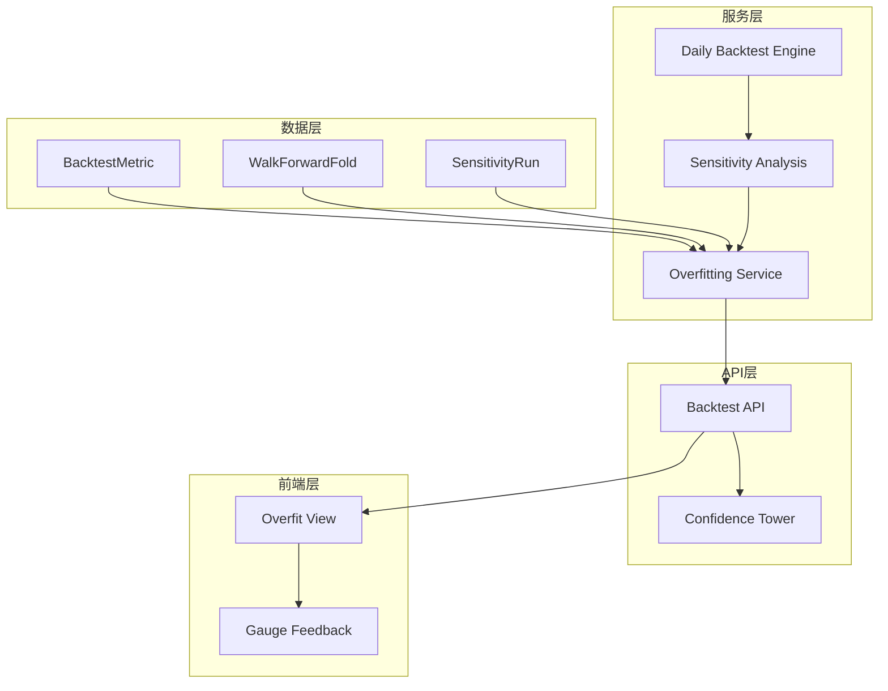

**图表来源**
- [overfitting.py:1-168](file://backend/app/services/overfitting.py#L1-L168)
- [models.py:33-118](file://backend/app/domains/backtest/models.py#L33-L118)

**章节来源**
- [overfitting.py:1-168](file://backend/app/services/overfitting.py#L1-L168)
- [models.py:1-155](file://backend/app/domains/backtest/models.py#L1-L155)

## 核心组件

过拟合检测模块由以下核心组件构成：

### 数据模型组件
- **BacktestMetric**：存储回测指标数据，包括IS/OOS分割的性能指标
- **WalkForwardFold**：记录滚动窗分析的训练/测试窗口结果
- **SensitivityRun**：存储参数扰动和滑点敏感性分析的结果

### 服务组件
- **Overfitting Service**：主要的过拟合检测服务，负责综合评估
- **Sensitivity Analysis**：参数扰动和滑点敏感性分析
- **Daily Backtest Engine**：基础回测引擎，支持滚动窗分析

### API组件
- **Backtest API**：提供统一的回测报告接口，包含过拟合评估
- **Confidence Tower**：前端置信度塔可视化组件

**章节来源**
- [models.py:33-118](file://backend/app/domains/backtest/models.py#L33-L118)
- [overfitting.py:29-41](file://backend/app/services/overfitting.py#L29-L41)

## 架构概览

过拟合检测模块采用分层架构设计，确保各组件职责清晰、耦合度低：

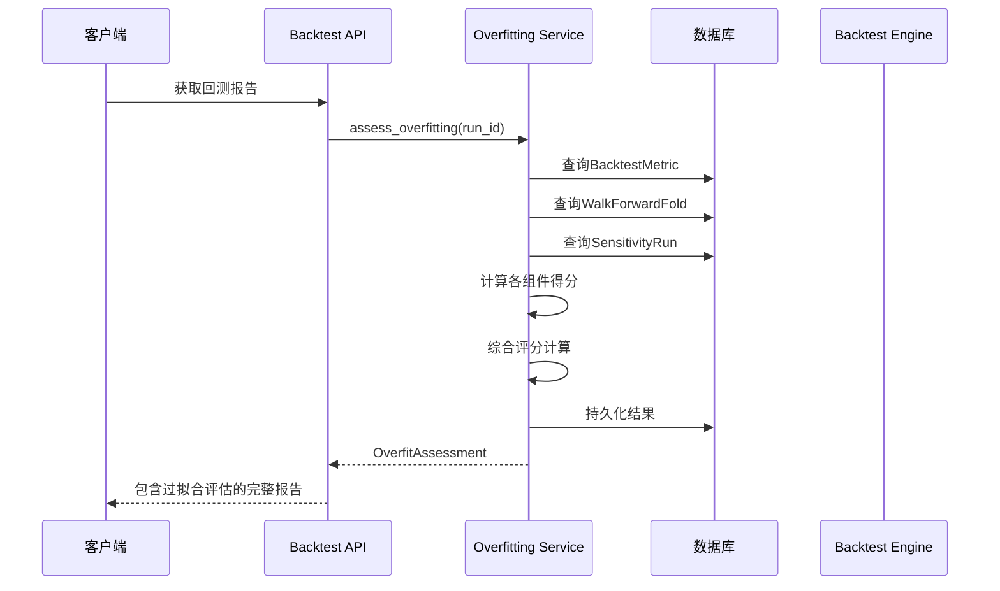

**图表来源**
- [backtests.py:794-803](file://backend/app/api/v1/backtests.py#L794-L803)
- [overfitting.py:129-167](file://backend/app/services/overfitting.py#L129-L167)

## 详细组件分析

### Overfitting Service 分析

Overfitting Service是整个模块的核心，负责协调各个评估组件的工作：

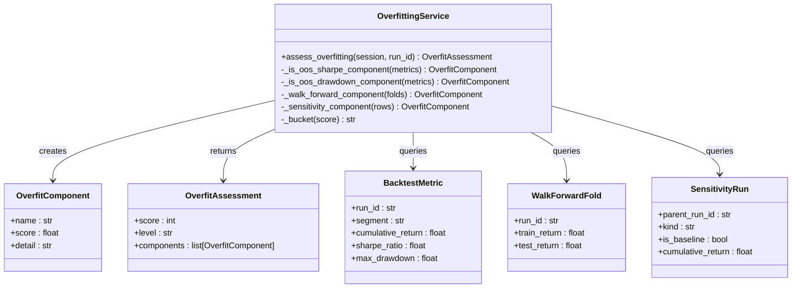

**图表来源**
- [overfitting.py:29-41](file://backend/app/services/overfitting.py#L29-L41)
- [models.py:33-118](file://backend/app/domains/backtest/models.py#L33-L118)

### 数据模型关系

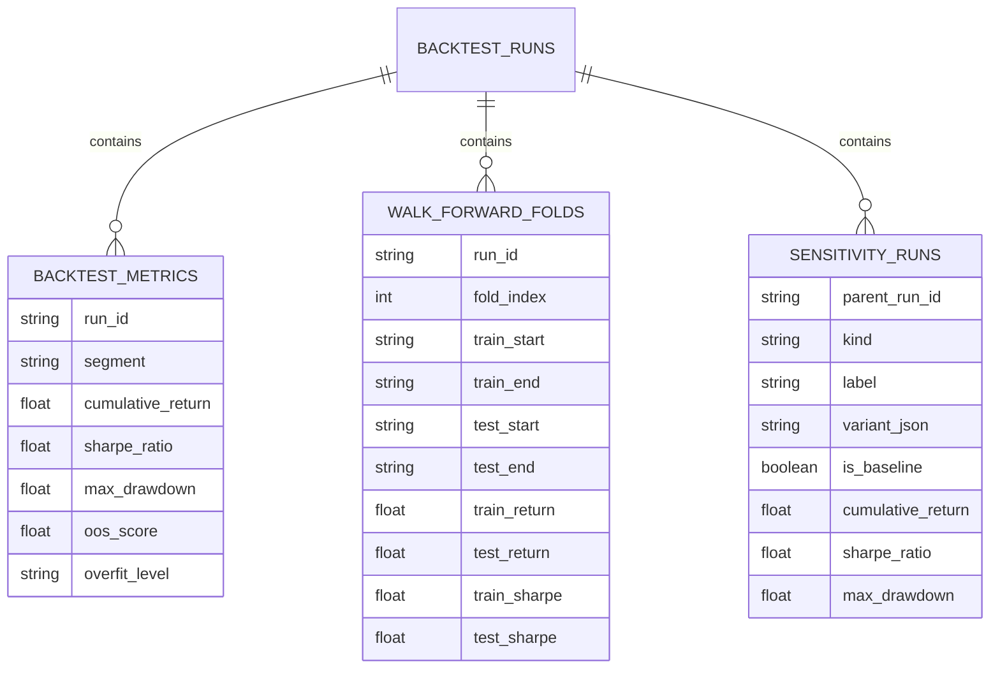

**图表来源**
- [models.py:20-118](file://backend/app/domains/backtest/models.py#L20-L118)

**章节来源**
- [overfitting.py:129-167](file://backend/app/services/overfitting.py#L129-L167)
- [models.py:33-118](file://backend/app/domains/backtest/models.py#L33-L118)

## 算法原理与实现

### 综合评分算法

过拟合检测采用多信号融合的评分机制，将四个独立的评估信号综合为最终评分：

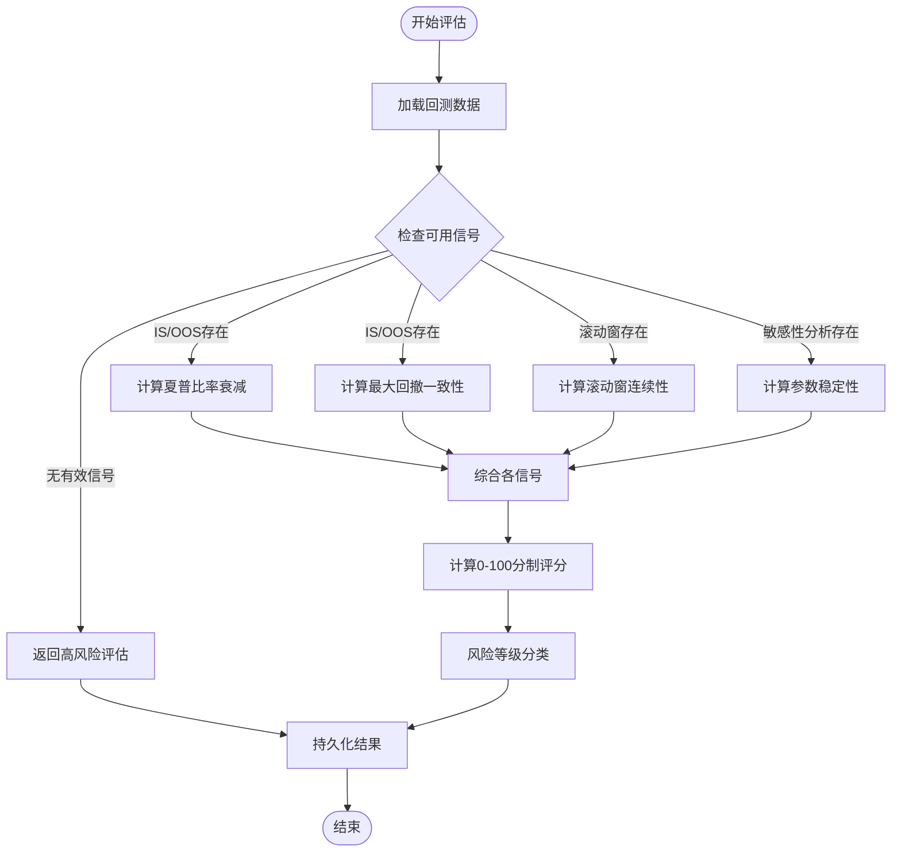

**图表来源**
- [overfitting.py:129-167](file://backend/app/services/overfitting.py#L129-L167)

### 各组件算法实现

#### IS/OOS 夏普比率衰减组件

该组件评估样本内和样本外夏普比率的一致性：

```mermaid
flowchart TD
Input[输入: IS/OOS夏普比率] --> CheckIS{IS夏普是否<=0?}
CheckIS --> |是| FreePass[自由通过条件]
CheckIS --> |否| CalcRatio[计算OOS/IS比率]
FreePass --> Score1[设置分数]
CalcRatio --> Clamp[限制在[0,1]范围]
Clamp --> Score2[设置分数]
Score1 --> Output[输出组件]
Score2 --> Output
```

**图表来源**
- [overfitting.py:51-69](file://backend/app/services/overfitting.py#L51-L69)

#### 最大回撤一致性组件

该组件比较IS和OOS阶段的最大回撤差异：

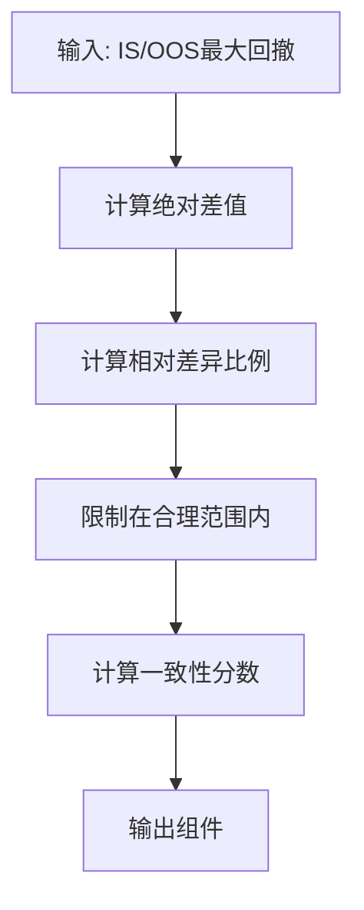

**图表来源**
- [overfitting.py:72-84](file://backend/app/services/overfitting.py#L72-L84)

#### 滚动窗连续性组件

该组件评估不同时间窗口间的收益一致性：

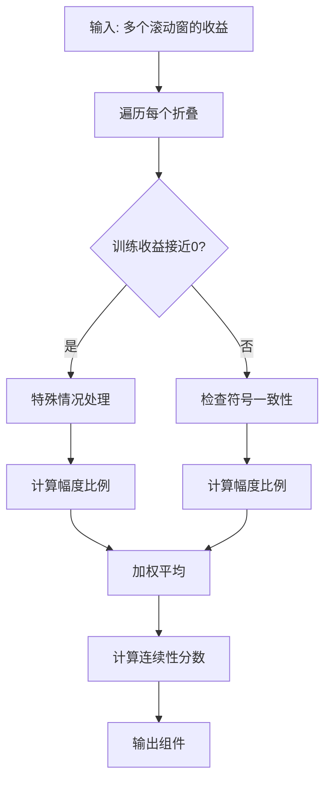

**图表来源**
- [overfitting.py:87-106](file://backend/app/services/overfitting.py#L87-L106)

#### 参数稳定性组件

该组件评估参数扰动对策略表现的影响：

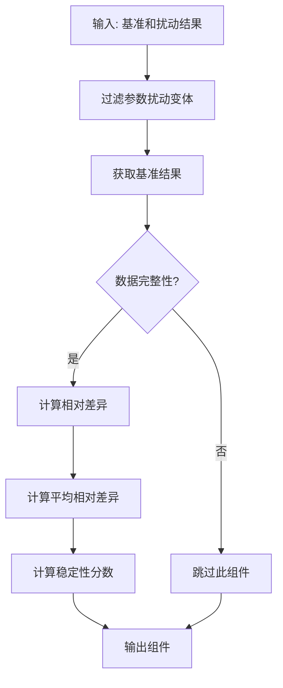

**图表来源**
- [overfitting.py:109-126](file://backend/app/services/overfitting.py#L109-L126)

**章节来源**
- [overfitting.py:51-126](file://backend/app/services/overfitting.py#L51-L126)

## 评估指标详解

### 核心评估指标

过拟合检测模块使用以下核心指标进行评估：

#### 1. IS/OOS 夏普比率衰减
- **计算方法**：OOS夏普比率 / IS夏普比率
- **意义**：衡量样本外表现相对于样本内的衰减程度
- **阈值**：> 0.5 表示良好，< 0.3 表示严重过拟合

#### 2. 最大回撤一致性
- **计算方法**：1 - |IS_DD - OOS_DD| / max(IS_DD, 0.01)
- **意义**：评估两个阶段回撤的稳定性
- **阈值**：> 0.7 表示一致性好

#### 3. 滚动窗连续性
- **计算方法**：基于符号一致性和幅度比例的加权平均
- **意义**：检测策略在不同时间段的表现稳定性
- **阈值**：> 0.6 表示连续性好

#### 4. 参数稳定性
- **计算方法**：1 - 平均相对差异
- **意义**：评估参数微小变化对策略表现的影响
- **阈值**：> 0.5 表示稳定性好

### 风险等级分类

根据综合评分进行风险等级分类：

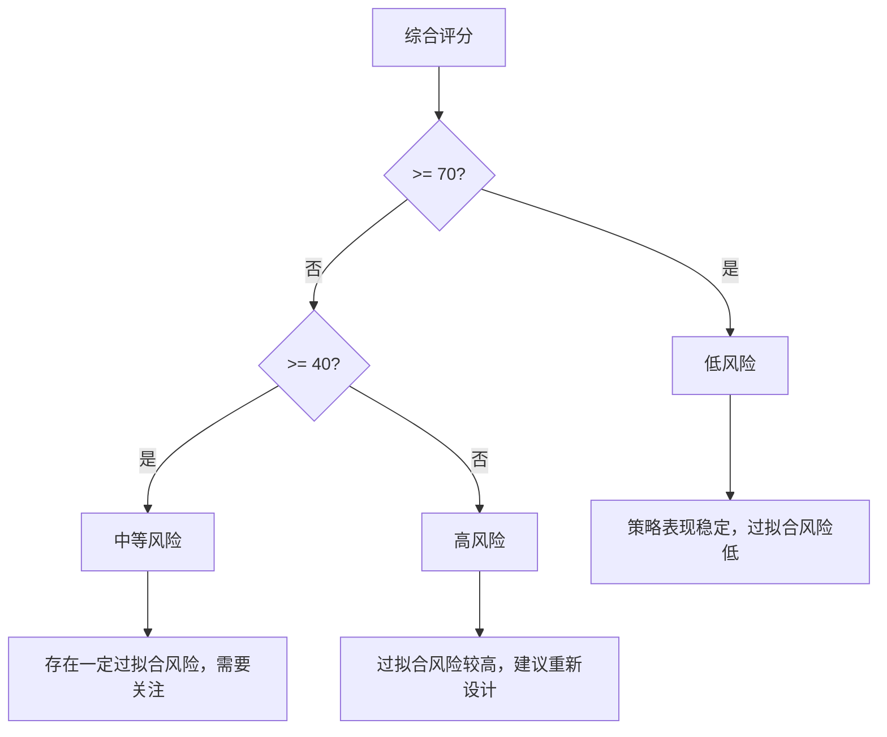

**图表来源**
- [overfitting.py:43-48](file://backend/app/services/overfitting.py#L43-L48)

**章节来源**
- [overfitting.py:43-48](file://backend/app/services/overfitting.py#L43-L48)

## 检测流程

### 完整检测流程

过拟合检测遵循以下标准化流程：

```mermaid
sequenceDiagram
participant User as 用户
participant API as API层
participant Service as 服务层
participant DB as 数据库
participant Model as 数据模型
User->>API : 触发过拟合检测
API->>Service : assess_overfitting(run_id)
Service->>DB : 查询BacktestMetric
DB->>Model : 返回指标数据
Service->>DB : 查询WalkForwardFold
DB->>Model : 返回滚动窗数据
Service->>DB : 查询SensitivityRun
DB->>Model : 返回敏感性数据
Service->>Service : 计算各组件得分
Service->>Service : 综合评分计算
Service->>DB : 持久化结果到BacktestMetric
Service-->>API : 返回OverfitAssessment
API-->>User : 显示过拟合评估结果
```

**图表来源**
- [backtests.py:794-803](file://backend/app/api/v1/backtests.py#L794-L803)
- [overfitting.py:129-167](file://backend/app/services/overfitting.py#L129-L167)

### 数据准备阶段

在执行过拟合检测之前，需要确保以下数据已准备就绪：

1. **回测指标数据**：包含IS/OOS分割的完整指标
2. **滚动窗分析数据**：至少包含2个以上的折叠
3. **敏感性分析数据**：包含参数扰动和滑点敏感性结果
4. **基准运行数据**：作为比较基准

### 评分计算阶段

评分计算采用加权平均的方式，确保各组件的贡献度得到合理体现：

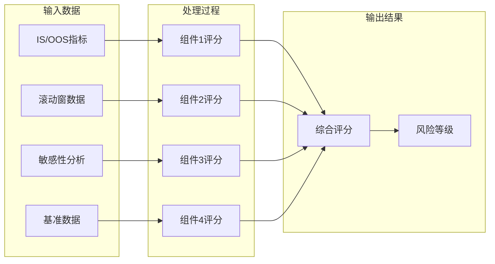

**图表来源**
- [overfitting.py:143-158](file://backend/app/services/overfitting.py#L143-L158)

**章节来源**
- [backtests.py:794-803](file://backend/app/api/v1/backtests.py#L794-L803)
- [overfitting.py:129-167](file://backend/app/services/overfitting.py#L129-L167)

## 结果解释与阈值

### 评分解释

过拟合检测模块提供0-100分制的综合评分，具体解释如下：

| 分数范围 | 风险等级 | 解释 | 建议 |
|---------|---------|------|------|
| 90-100 | 低风险 | 策略表现极佳，过拟合风险很低 | 可以考虑部署 |
| 80-89 | 低风险 | 策略表现良好，过拟合风险较低 | 建议继续观察 |
| 70-79 | 低风险 | 策略表现稳定，过拟合风险低 | 可以部署 |
| 60-69 | 中等风险 | 策略表现一般，存在一定过拟合风险 | 需要改进 |
| 50-59 | 中等风险 | 策略表现较差，过拟合风险中等 | 建议重新设计 |
| 40-49 | 高风险 | 策略表现很差，过拟合风险较高 | 必须重新设计 |
| 0-39 | 高风险 | 策略表现极差，过拟合风险很高 | 立即停止 |

### 组件详细解释

#### IS/OOS 夏普比率衰减
- **高分含义**：样本外表现优于或等于样本内表现
- **低分含义**：样本外表现明显劣于样本内表现
- **改进建议**：增加样本外验证强度，减少参数调整

#### 最大回撤一致性
- **高分含义**：两个阶段的回撤水平相近
- **低分含义**：回撤水平差异较大
- **改进建议**：检查策略的风险控制机制

#### 滚动窗连续性
- **高分含义**：策略在不同时间段表现稳定
- **低分含义**：策略表现不稳定
- **改进建议**：检查策略的时间不变性假设

#### 参数稳定性
- **高分含义**：参数微小变化对策略影响很小
- **低分含义**：策略对参数变化敏感
- **改进建议**：简化策略参数，提高鲁棒性

**章节来源**
- [overfitting.py:43-48](file://backend/app/services/overfitting.py#L43-L48)

## 改进建议

### 策略层面的改进建议

#### 1. 参数简化策略
- **减少参数数量**：避免过度参数化，降低过拟合风险
- **参数约束**：为关键参数设置合理的边界范围
- **参数共享**：在多个时间窗口间共享参数估计

#### 2. 数据质量提升
- **增加样本量**：确保有足够的历史数据进行验证
- **时间跨度扩展**：覆盖不同的市场环境
- **数据质量检查**：排除异常数据点

#### 3. 验证方法改进
- **交叉验证增强**：使用更多折叠的滚动窗分析
- **外部数据验证**：使用独立的数据集进行验证
- **压力测试**：在极端市场条件下测试策略

### 技术实现建议

#### 1. 算法优化
- **特征工程**：选择更具预测力的特征
- **模型选择**：避免过于复杂的模型
- **正则化技术**：应用适当的正则化防止过拟合

#### 2. 实施细节
- **参数搜索范围**：合理设置参数搜索空间
- **验证频率**：定期重新评估策略性能
- **监控机制**：建立持续监控和预警机制

#### 3. 测试策略
- **A/B测试**：在实际交易环境中进行对照试验
- **增量部署**：逐步扩大策略规模
- **风险管理**：设置适当的止损和风控措施

## 性能考虑

### 计算复杂度分析

过拟合检测模块的计算复杂度主要取决于以下因素：

- **数据量**：回测指标、滚动窗和敏感性分析的数据量
- **组件数量**：同时评估的信号组件数量
- **计算密集度**：各组件的计算复杂度

### 性能优化策略

#### 1. 数据访问优化
- **批量查询**：使用批量查询减少数据库往返
- **索引优化**：为常用查询字段建立适当索引
- **缓存策略**：缓存频繁访问的数据

#### 2. 算法优化
- **向量化计算**：利用NumPy等库进行向量化操作
- **并行处理**：对独立的组件计算进行并行化
- **内存管理**：优化内存使用，避免不必要的数据复制

#### 3. 扩展性考虑
- **异步处理**：使用异步I/O提高并发处理能力
- **分布式计算**：对于大规模数据可以考虑分布式处理
- **增量更新**：支持增量更新而非全量重算

## 故障排除指南

### 常见问题及解决方案

#### 1. 数据缺失问题
**症状**：某些组件无法计算，导致最终评分不完整
**原因**：缺少必要的回测数据
**解决方案**：
- 检查回测任务是否完整执行
- 验证数据源的可用性
- 确认数据格式的正确性

#### 2. 评分异常问题
**症状**：评分过高或过低
**原因**：数据质量问题或算法实现错误
**解决方案**：
- 检查输入数据的合理性
- 验证算法实现的正确性
- 对比历史数据的趋势

#### 3. 性能问题
**症状**：计算时间过长
**原因**：数据量过大或算法效率低
**解决方案**：
- 优化数据库查询
- 实现数据分页和缓存
- 考虑算法优化

### 调试工具和方法

#### 1. 日志记录
- 记录详细的计算过程
- 跟踪数据流和状态变化
- 记录异常情况和错误信息

#### 2. 单元测试
- 编写针对各组件的单元测试
- 测试边界条件和异常情况
- 验证算法的数学正确性

#### 3. 性能监控
- 监控计算时间和内存使用
- 跟踪数据库查询性能
- 监控系统资源使用情况

**章节来源**
- [test_overfitting.py:50-109](file://backend/tests/services/test_overfitting.py#L50-L109)

## 结论

过拟合检测模块为量化策略开发提供了全面的质量保证机制。通过多维度的评估方法和直观的评分系统，该模块能够有效识别和量化策略的过拟合风险，为策略优化和部署决策提供重要依据。

### 主要优势

1. **综合性评估**：同时考虑多个维度的过拟合风险
2. **自动化程度高**：减少人工干预，提高效率
3. **可视化友好**：提供直观的风险等级展示
4. **可扩展性强**：支持新的评估指标和方法

### 发展方向

1. **机器学习集成**：引入机器学习方法进行更精细的过拟合检测
2. **实时监控**：实现实时过拟合风险监控
3. **自适应阈值**：根据不同市场环境调整评估阈值
4. **多策略对比**：支持多个策略的横向比较分析

该模块的成功实施将显著提高量化策略的质量和可靠性，为投资决策提供更加科学和客观的支持。