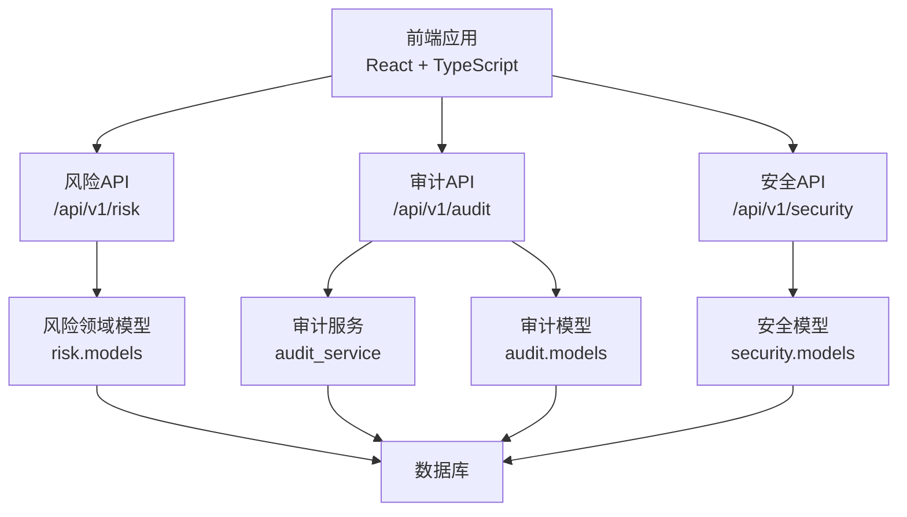
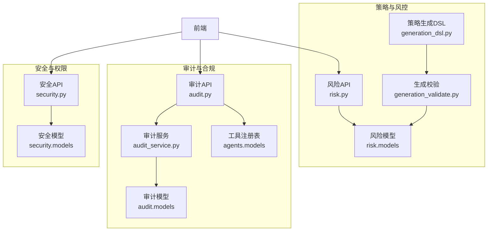
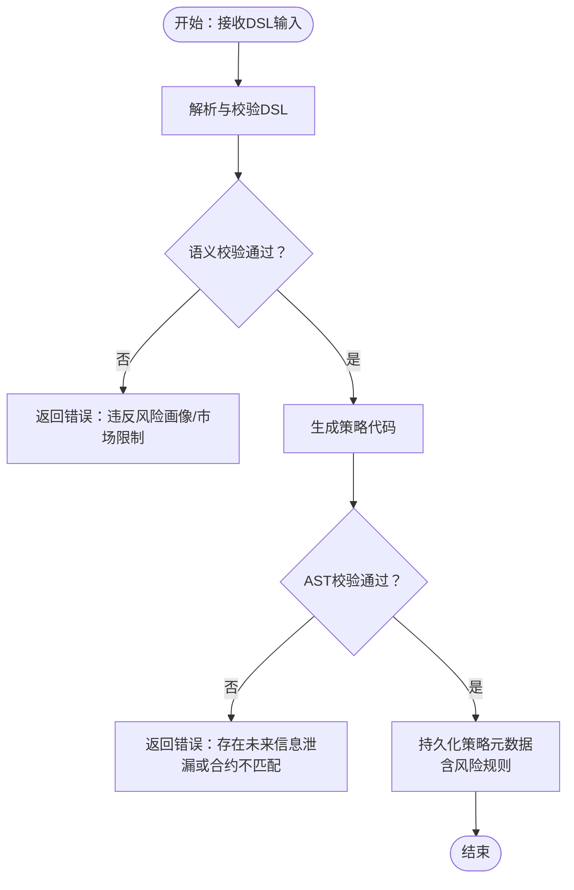
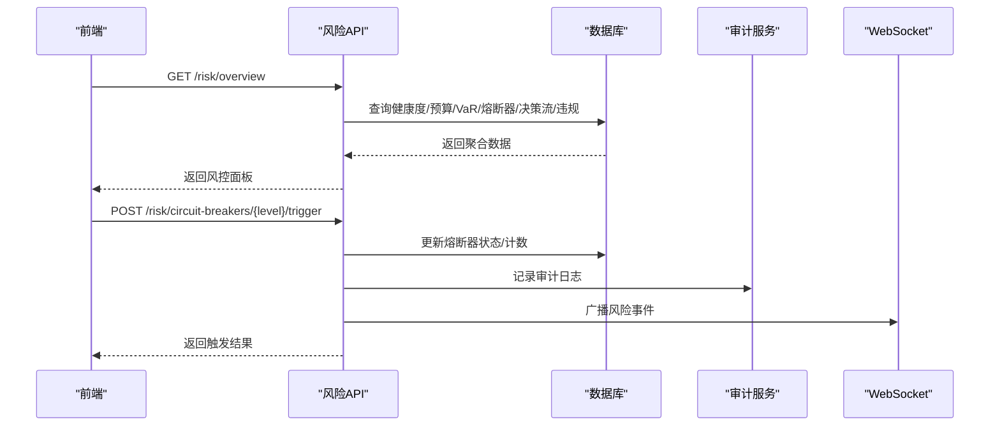
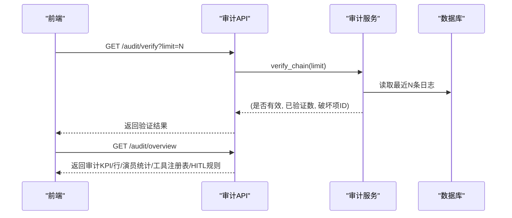
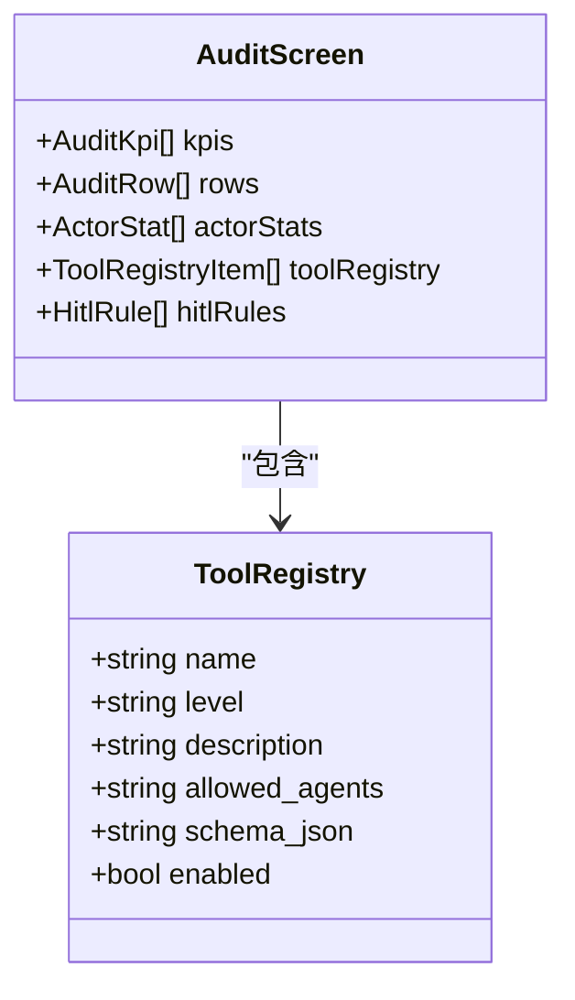
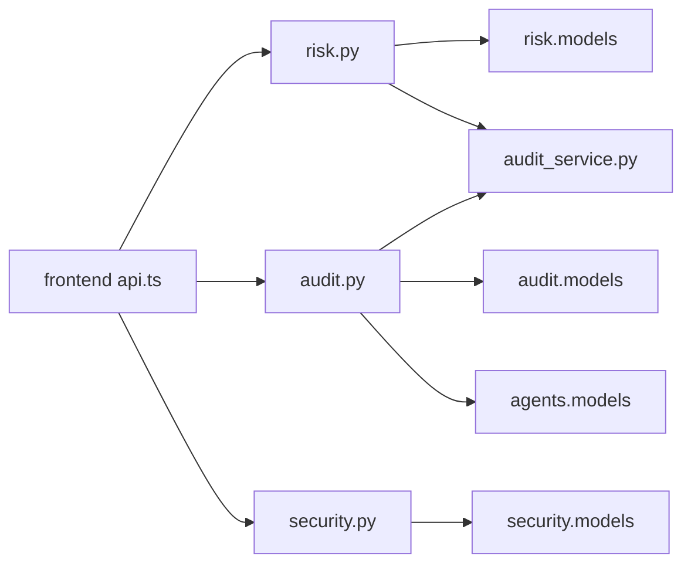

# 合规监控

<cite>
**本文引用的文件**
- [backend/app/api/v1/risk.py](file://backend/app/api/v1/risk.py)
- [backend/app/api/v1/audit.py](file://backend/app/api/v1/audit.py)
- [backend/app/domains/risk/models.py](file://backend/app/domains/risk/models.py)
- [backend/app/domains/audit/models.py](file://backend/app/domains/audit/models.py)
- [backend/app/services/audit_service.py](file://backend/app/services/audit_service.py)
- [backend/app/domains/agents/models.py](file://backend/app/domains/agents/models.py)
- [backend/app/domains/agents/schemas.py](file://backend/app/domains/agents/schemas.py)
- [backend/app/api/v1/security.py](file://backend/app/api/v1/security.py)
- [backend/app/domains/security/models.py](file://backend/app/domains/security/models.py)
- [frontend/src/screens/Audit/HITLRules.tsx](file://frontend/src/screens/Audit/HITLRules.tsx)
- [frontend/src/contexts/AuditContext.tsx](file://frontend/src/contexts/AuditContext.tsx)
- [frontend/src/lib/api.ts](file://frontend/src/lib/api.ts)
- [backend/app/domains/risk/schemas.py](file://backend/app/domains/risk/schemas.py)
- [backend/app/db/migrations/versions/20260513_000001_execution_risk_portfolio.py](file://backend/app/db/migrations/versions/20260513_000001_execution_risk_portfolio.py)
- [frontend/src/screens/Risk/PolicyStream.tsx](file://frontend/src/screens/Risk/PolicyStream.tsx)
- [backend/app/domains/strategy/generation_dsl.py](file://backend/app/domains/strategy/generation_dsl.py)
- [backend/app/domains/strategy/generation_validate.py](file://backend/app/domains/strategy/generation_validate.py)
</cite>

## 目录
1. [简介](#简介)
2. [项目结构](#项目结构)
3. [核心组件](#核心组件)
4. [架构总览](#架构总览)
5. [详细组件分析](#详细组件分析)
6. [依赖分析](#依赖分析)
7. [性能考虑](#性能考虑)
8. [故障排查指南](#故障排查指南)
9. [结论](#结论)
10. [附录](#附录)

## 简介
本文件面向合规监控系统，围绕合规规则引擎、风险等级评估与实时监控机制展开，系统性阐述以下能力：
- 合规规则引擎：基于可配置规则的策略生成与预交易风控，支持 DSL 结构化约束与语义校验。
- 风险等级评估：以 VaR、预算占用、熔断器状态、违规事件等多维指标综合评分，形成健康度等级。
- 实时监控与告警：通过策略引擎决策流、审计日志哈希链、安全与权限治理、熔断器触发等实现闭环监控。
- HITL（人类在回路）规则配置：提供“自动”“复核”“审批”三类规则，覆盖交易、风控、资金等关键环节。
- 工具注册表管理：按风险等级与允许的 Agent 角色进行工具准入与可视化展示。
- 合规指标计算：包括哈希链完整性验证、违规事件统计、人工与系统操作占比等。

## 项目结构
后端采用 FastAPI + SQLAlchemy 异步 ORM 架构，前端使用 React + TypeScript，通过统一 API 接口驱动仪表板与交互。合规与风控相关模块主要分布在 backend 的 api、domains、services 层，前端通过上下文与 API 客户端消费数据。

图表来源
- [backend/app/api/v1/risk.py:1-273](file://backend/app/api/v1/risk.py#L1-L273)
- [backend/app/api/v1/audit.py:1-258](file://backend/app/api/v1/audit.py#L1-L258)
- [backend/app/api/v1/security.py:1-172](file://backend/app/api/v1/security.py#L1-L172)
- [backend/app/services/audit_service.py:1-109](file://backend/app/services/audit_service.py#L1-L109)
- [backend/app/domains/audit/models.py:1-51](file://backend/app/domains/audit/models.py#L1-L51)
- [backend/app/domains/security/models.py:1-59](file://backend/app/domains/security/models.py#L1-L59)

章节来源
- [backend/app/api/v1/risk.py:1-273](file://backend/app/api/v1/risk.py#L1-L273)
- [backend/app/api/v1/audit.py:1-258](file://backend/app/api/v1/audit.py#L1-L258)
- [backend/app/api/v1/security.py:1-172](file://backend/app/api/v1/security.py#L1-L172)

## 核心组件
- 合规规则引擎
  - 策略生成 DSL：定义因子、过滤器、再平衡频率、头寸规则与风险规则，确保生成策略满足结构化约束与市场/风险画像一致性。
  - 生成校验：对 DSL 语义与生成代码进行 AST 校验，阻断未来信息泄漏与合约不匹配。
- 风险控制与监控
  - 风控面板：健康度评分、预算占用、VaR 历史与分解、熔断器状态、策略引擎决策流、违规事件。
  - 审计与哈希链：不可篡改审计日志，支持链式完整性验证。
  - 安全与权限：账户角色与权限矩阵、Vault 密钥管理、提现守卫与安全事件。
- HITL 规则与工具注册表
  - HITL 规则：自动、复核、审批三类，覆盖交易、风控、资金等关键场景。
  - 工具注册表：按风险等级与允许 Agent 角色管理工具准入。

章节来源
- [backend/app/domains/strategy/generation_dsl.py:1-144](file://backend/app/domains/strategy/generation_dsl.py#L1-L144)
- [backend/app/domains/strategy/generation_validate.py:1-216](file://backend/app/domains/strategy/generation_validate.py#L1-L216)
- [backend/app/api/v1/risk.py:1-273](file://backend/app/api/v1/risk.py#L1-L273)
- [backend/app/api/v1/audit.py:1-258](file://backend/app/api/v1/audit.py#L1-L258)
- [backend/app/api/v1/security.py:1-172](file://backend/app/api/v1/security.py#L1-L172)
- [frontend/src/screens/Audit/HITLRules.tsx:1-38](file://frontend/src/screens/Audit/HITLRules.tsx#L1-L38)

## 架构总览
合规监控系统由“策略生成与风控”“实时风险监控”“审计与哈希链”“安全与权限治理”四条主线构成，前端通过统一 API 获取各模块聚合视图。

图表来源
- [backend/app/domains/strategy/generation_dsl.py:1-144](file://backend/app/domains/strategy/generation_dsl.py#L1-L144)
- [backend/app/domains/strategy/generation_validate.py:1-216](file://backend/app/domains/strategy/generation_validate.py#L1-L216)
- [backend/app/api/v1/risk.py:1-273](file://backend/app/api/v1/risk.py#L1-L273)
- [backend/app/domains/risk/models.py:1-101](file://backend/app/domains/risk/models.py#L1-L101)
- [backend/app/api/v1/audit.py:1-258](file://backend/app/api/v1/audit.py#L1-L258)
- [backend/app/services/audit_service.py:1-109](file://backend/app/services/audit_service.py#L1-L109)
- [backend/app/domains/audit/models.py:1-51](file://backend/app/domains/audit/models.py#L1-L51)
- [backend/app/domains/agents/models.py:1-62](file://backend/app/domains/agents/models.py#L1-L62)
- [backend/app/api/v1/security.py:1-172](file://backend/app/api/v1/security.py#L1-L172)
- [backend/app/domains/security/models.py:1-59](file://backend/app/domains/security/models.py#L1-L59)

## 详细组件分析

### 合规规则引擎（策略生成与预交易风控）
- DSL 设计
  - 因子与过滤器：限定字段、运算符与取值范围，避免未来信息泄漏。
  - 再平衡频率与头寸规则：目标总敞口、单只权重上限、最小/最大持份数。
  - 风险规则：组合最大回撤、个股止损、行业权重等。
- 生成校验
  - 语义校验：依据风险画像与市场类型限制单只权重与最大回撤。
  - AST 校验：阻断负移位、前瞻差分/滚动等典型未来信息泄漏模式；确保策略类实现必要方法。
- 预交易风控
  - 与风险模型联动，将 DSL 中的风险规则映射为策略版本元数据，供后续回测与实盘风控使用。

图表来源
- [backend/app/domains/strategy/generation_dsl.py:68-144](file://backend/app/domains/strategy/generation_dsl.py#L68-L144)
- [backend/app/domains/strategy/generation_validate.py:48-216](file://backend/app/domains/strategy/generation_validate.py#L48-L216)

章节来源
- [backend/app/domains/strategy/generation_dsl.py:1-144](file://backend/app/domains/strategy/generation_dsl.py#L1-L144)
- [backend/app/domains/strategy/generation_validate.py:1-216](file://backend/app/domains/strategy/generation_validate.py#L1-L216)

### 风险等级评估与实时监控
- 风控面板聚合
  - 健康度评分：基于“进行中的违规数”“24小时自动阻断数”“待审批数”计算，映射为健康等级。
  - 预算占用：按指标维度展示使用量/限额/单位/色调。
  - VaR：日/周 VaR、置信度、历史序列与策略贡献分解。
  - 熔断器：L1-L4 级别、触发条件、动作、24小时触发次数与最近触发时间。
  - 策略引擎决策流：实时展示最近若干笔决策及其原因与耗时。
  - 违规事件：严重性、标题、详情、处置状态等。
- 实时监控与告警
  - 熔断器手动触发/恢复：记录审计日志并通过 WebSocket 广播风险事件。
  - 健康度动态变化：当违规或阻断增加时，健康度下降并触发告警。

图表来源
- [backend/app/api/v1/risk.py:188-273](file://backend/app/api/v1/risk.py#L188-L273)
- [backend/app/services/audit_service.py:32-82](file://backend/app/services/audit_service.py#L32-L82)

章节来源
- [backend/app/api/v1/risk.py:1-273](file://backend/app/api/v1/risk.py#L1-L273)
- [backend/app/domains/risk/schemas.py:1-95](file://backend/app/domains/risk/schemas.py#L1-L95)

### 审计与哈希链（合规证据链）
- 不可篡改审计日志
  - 每条日志包含演员、类型、动作、资源、结果、置信度、细节、追踪 ID、IP 地址及哈希链字段。
  - 新增日志时计算当前哈希并与上一条日志的当前哈希关联，形成链式结构。
- 哈希链完整性验证
  - 支持对最新 N 条日志进行链式校验，返回是否有效、验证数量与首个破坏项 ID。
- 前端集成
  - 提供审计概览、分页查询、按演员类型/动作筛选、哈希链验证、CSV 导出、工具注册表与 HITL 规则展示。

图表来源
- [backend/app/api/v1/audit.py:198-258](file://backend/app/api/v1/audit.py#L198-L258)
- [backend/app/services/audit_service.py:83-109](file://backend/app/services/audit_service.py#L83-L109)

章节来源
- [backend/app/api/v1/audit.py:1-258](file://backend/app/api/v1/audit.py#L1-L258)
- [backend/app/services/audit_service.py:1-109](file://backend/app/services/audit_service.py#L1-L109)
- [backend/app/domains/audit/models.py:1-51](file://backend/app/domains/audit/models.py#L1-L51)

### 安全与权限治理
- 账户与权限
  - 账户角色（实盘主账户/模拟盘/托管）与权限矩阵（买入/卖出/撤单/提现/策略切换）。
  - 提现守卫：单笔/日累计限额、白名单、24小时阻断次数与最近阻断时间。
- Vault 密钥管理
  - 密钥类型、提供商、轮换与到期时间、状态与作用域。
- 安全事件
  - 事件类型（轮换/阻断/违规/审计）、严重性、标题、处置状态与解决说明。

章节来源
- [backend/app/api/v1/security.py:1-172](file://backend/app/api/v1/security.py#L1-L172)
- [backend/app/domains/security/models.py:1-59](file://backend/app/domains/security/models.py#L1-L59)

### HITL 规则配置与工具注册表
- HITL 规则
  - 自动：AI 自动执行，无需人工干预。
  - 复核：AI 执行但需人工复核。
  - 审批：必须人工审批。
  - 示例规则：实盘订单审批、策略上线审批、大额交易提醒、数据异常处理、熔断恢复审批、账户资金变动审计确认。
- 工具注册表
  - 工具名称、风险等级（低/中/高/极高）、描述、允许的 Agent 角色列表、启用状态。
  - 前端通过上下文与 API 客户端消费数据，渲染规则卡片与工具列表。

图表来源
- [backend/app/domains/agents/models.py:51-62](file://backend/app/domains/agents/models.py#L51-L62)
- [backend/app/api/v1/audit.py:153-168](file://backend/app/api/v1/audit.py#L153-L168)

章节来源
- [backend/app/api/v1/audit.py:29-36](file://backend/app/api/v1/audit.py#L29-L36)
- [backend/app/api/v1/audit.py:128-151](file://backend/app/api/v1/audit.py#L128-L151)
- [frontend/src/screens/Audit/HITLRules.tsx:1-38](file://frontend/src/screens/Audit/HITLRules.tsx#L1-L38)
- [frontend/src/contexts/AuditContext.tsx:1-13](file://frontend/src/contexts/AuditContext.tsx#L1-L13)
- [frontend/src/lib/api.ts:727-735](file://frontend/src/lib/api.ts#L727-L735)
- [backend/app/domains/agents/schemas.py:42-50](file://backend/app/domains/agents/schemas.py#L42-L50)

### 合规指标计算
- 健康度评分
  - 计算公式：健康分 = max(0, 100 − 进行中违规数 × 10 − 24小时自动阻断数 × 2)，并映射为健康等级与色调。
- 审计完整性
  - 哈希链完整性探针：检查最近若干条日志是否存在空哈希（历史遗留），并给出完整性百分比。
- 违规与审批统计
  - 统计异常事件数量、按演员类型分布、待审批数量等。

章节来源
- [backend/app/api/v1/risk.py:39-71](file://backend/app/api/v1/risk.py#L39-L71)
- [backend/app/api/v1/audit.py:73-106](file://backend/app/api/v1/audit.py#L73-L106)

## 依赖分析
- 风控 API 依赖风险模型与审计服务，用于生成健康度评分与记录熔断器事件。
- 审计 API 依赖审计服务与审计模型，提供哈希链验证与工具注册表查询。
- 安全 API 依赖安全模型，提供账户权限与密钥管理视图。
- 前端通过 API 客户端调用后端接口，使用上下文提供数据。

图表来源
- [backend/app/api/v1/risk.py:1-273](file://backend/app/api/v1/risk.py#L1-L273)
- [backend/app/domains/risk/models.py:1-101](file://backend/app/domains/risk/models.py#L1-L101)
- [backend/app/services/audit_service.py:1-109](file://backend/app/services/audit_service.py#L1-L109)
- [backend/app/api/v1/audit.py:1-258](file://backend/app/api/v1/audit.py#L1-L258)
- [backend/app/domains/audit/models.py:1-51](file://backend/app/domains/audit/models.py#L1-L51)
- [backend/app/domains/agents/models.py:1-62](file://backend/app/domains/agents/models.py#L1-L62)
- [backend/app/api/v1/security.py:1-172](file://backend/app/api/v1/security.py#L1-L172)
- [backend/app/domains/security/models.py:1-59](file://backend/app/domains/security/models.py#L1-L59)
- [frontend/src/lib/api.ts:514-779](file://frontend/src/lib/api.ts#L514-L779)

章节来源
- [backend/app/api/v1/risk.py:1-273](file://backend/app/api/v1/risk.py#L1-L273)
- [backend/app/api/v1/audit.py:1-258](file://backend/app/api/v1/audit.py#L1-L258)
- [backend/app/api/v1/security.py:1-172](file://backend/app/api/v1/security.py#L1-L172)
- [frontend/src/lib/api.ts:514-779](file://frontend/src/lib/api.ts#L514-L779)

## 性能考虑
- 数据库查询优化
  - 风控面板聚合查询使用索引列（如风险规则的作用域/指标、熔断器级别、违规严重性/状态）减少扫描开销。
  - 分页与限制返回条数（如审计日志默认 50 条，最大 500/5000）降低响应延迟。
- 哈希链验证
  - 限制验证窗口（默认 500 条），避免长链验证带来的 CPU 与内存压力。
- 前端渲染
  - 使用虚拟滚动与懒加载展示长列表（审计日志、策略决策流、违规事件）。
  - 对高频更新区域（如实时决策流）采用局部刷新与去抖策略。

## 故障排查指南
- 审计哈希链验证失败
  - 现象：完整性状态为“损坏”，返回首个破坏项 ID。
  - 排查：检查该条目前后相邻日志的 prev_hash/curr_hash 是否一致；确认数据库写入顺序与幂等性。
- 熔断器无法触发/恢复
  - 现象：返回 404（未找到）或 409（状态冲突）。
  - 排查：确认熔断器级别是否正确；若处于“已武装”状态无法恢复，需先触发再恢复。
- 策略生成被拒
  - 现象：DSL 语义或 AST 校验报错。
  - 排查：检查单只权重上限、最大回撤、因子参数范围与过滤器字段是否使用未来信息片段；确认生成代码符合策略基类合约。

章节来源
- [backend/app/services/audit_service.py:83-109](file://backend/app/services/audit_service.py#L83-L109)
- [backend/app/api/v1/risk.py:210-273](file://backend/app/api/v1/risk.py#L210-L273)
- [backend/app/domains/strategy/generation_validate.py:48-216](file://backend/app/domains/strategy/generation_validate.py#L48-L216)

## 结论
本合规监控系统通过“策略生成 DSL + 生成校验”的前置风控，结合“实时风险面板 + 审计哈希链 + 安全治理”的运行期保障，形成了从“设计—生成—执行—审计—告警”的闭环。HITL 规则与工具注册表进一步强化了关键业务环节的人工把关与透明度。建议持续优化数据库索引与查询窗口，加强前端长列表渲染性能，并定期演练熔断器与审计链验证流程，确保系统在高压场景下的稳定性与可追溯性。

## 附录
- 数据模型与迁移
  - 风控相关表：风险规则、风险检查、预算、VaR 快照、熔断器、违规事件、策略引擎决策。
  - 审计相关表：审计日志、幂等键、事件外发箱。
  - 安全相关表：Vault 密钥、AI 权限、提现规则、安全事件。
- 前端组件与上下文
  - 审计与风险面板组件通过上下文消费后端聚合数据，API 客户端封装统一的请求/响应处理与鉴权头注入。

章节来源
- [backend/app/db/migrations/versions/20260513_000001_execution_risk_portfolio.py:127-203](file://backend/app/db/migrations/versions/20260513_000001_execution_risk_portfolio.py#L127-L203)
- [frontend/src/screens/Risk/PolicyStream.tsx:1-42](file://frontend/src/screens/Risk/PolicyStream.tsx#L1-L42)
- [frontend/src/lib/api.ts:514-779](file://frontend/src/lib/api.ts#L514-L779)