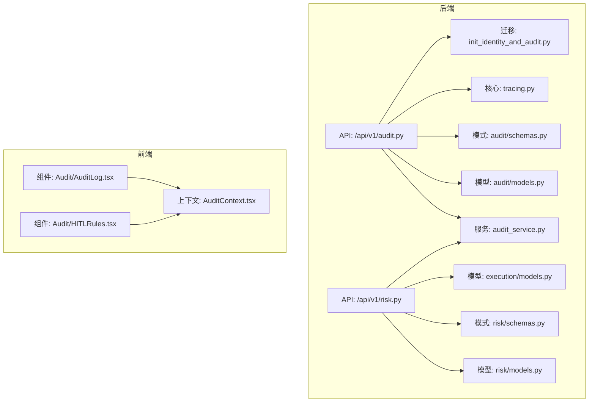
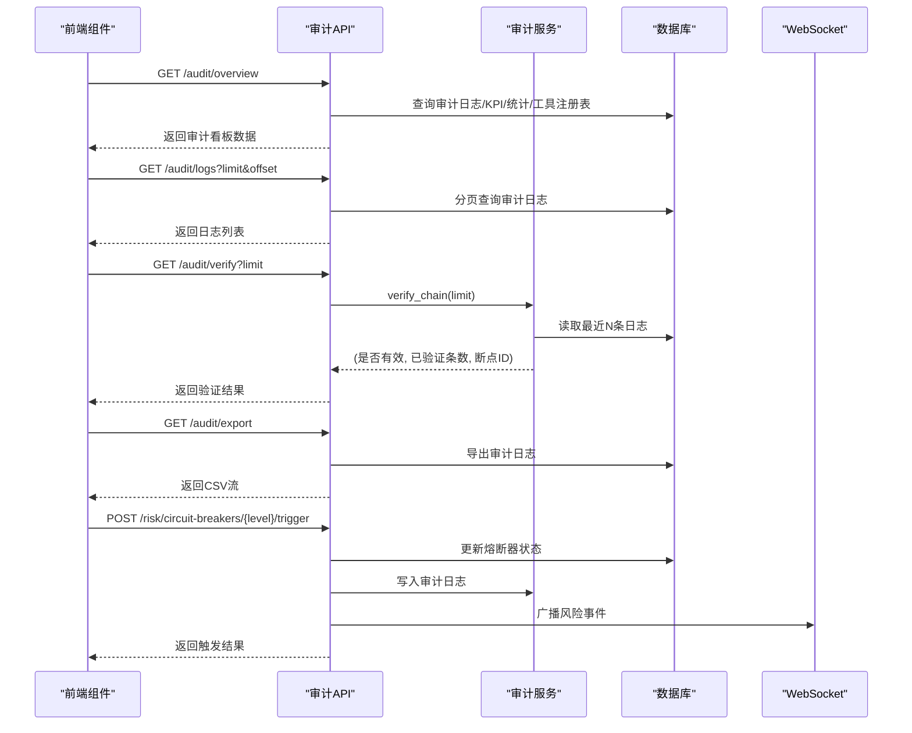
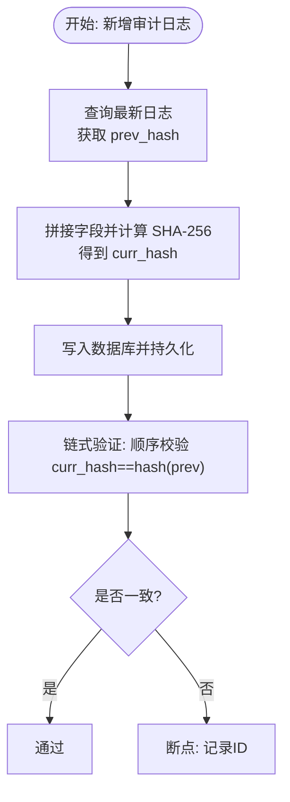
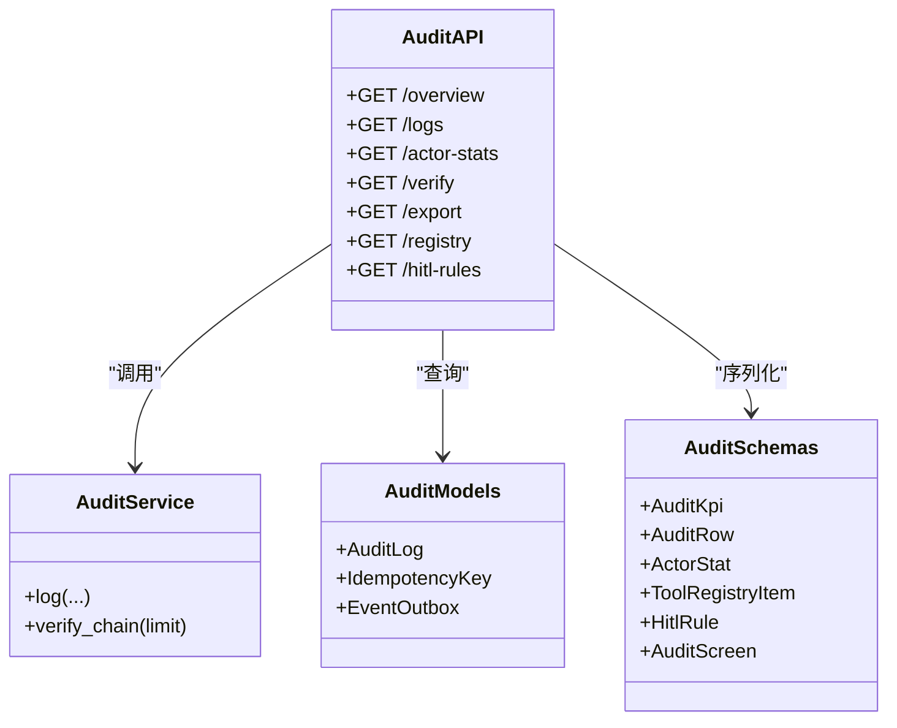
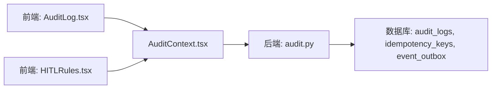
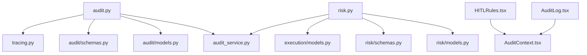

# 审计与合规

<cite>
**本文引用的文件**
- [backend/app/api/v1/audit.py](file://backend/app/api/v1/audit.py)
- [backend/app/services/audit_service.py](file://backend/app/services/audit_service.py)
- [backend/app/domains/audit/models.py](file://backend/app/domains/audit/models.py)
- [backend/app/domains/audit/schemas.py](file://backend/app/domains/audit/schemas.py)
- [backend/app/db/migrations/versions/20260510_000001_init_identity_and_audit.py](file://backend/app/db/migrations/versions/20260510_000001_init_identity_and_audit.py)
- [backend/app/core/tracing.py](file://backend/app/core/tracing.py)
- [backend/app/api/v1/risk.py](file://backend/app/api/v1/risk.py)
- [backend/app/domains/risk/models.py](file://backend/app/domains/risk/models.py)
- [backend/app/domains/risk/schemas.py](file://backend/app/domains/risk/schemas.py)
- [backend/app/domains/execution/models.py](file://backend/app/domains/execution/models.py)
- [frontend/src/screens/Audit/AuditLog.tsx](file://frontend/src/screens/Audit/AuditLog.tsx)
- [frontend/src/screens/Audit/HITLRules.tsx](file://frontend/src/screens/Audit/HITLRules.tsx)
- [frontend/src/contexts/AuditContext.tsx](file://frontend/src/contexts/AuditContext.tsx)
- [doc/07-后端项目设计说明书.md](file://doc/07-后端项目设计说明书.md)
- [doc/03-核心模块设计.md](file://doc/03-核心模块设计.md)
</cite>

## 目录
1. [简介](#简介)
2. [项目结构](#项目结构)
3. [核心组件](#核心组件)
4. [架构总览](#架构总览)
5. [详细组件分析](#详细组件分析)
6. [依赖分析](#依赖分析)
7. [性能考量](#性能考量)
8. [故障排查指南](#故障排查指南)
9. [结论](#结论)
10. [附录](#附录)

## 简介
本文件面向审计与合规系统，围绕操作日志记录、合规检查机制、报告生成工具与合规监控系统进行系统化说明。重点覆盖以下方面：
- 审计轨迹追踪：基于不可篡改的审计日志与哈希链验证，提供可追溯、可验证的操作记录。
- 合规规则引擎：结合人工在回路（HITL）规则与策略决策流，形成“自动/复核/审批”三层控制。
- 风险事件监控：通过熔断器、风险规则与违规事件，实现风险事件的识别、告警与处置。
- 监管报告生成：提供导出接口与前端展示，支持按角色与动作筛选、哈希链完整性验证等。

## 项目结构
后端采用 FastAPI + SQLAlchemy 异步 ORM 架构，审计域与风控域分别独立建模与 API 路由，迁移脚本定义了审计与合规相关的表结构；前端提供审计看板与规则展示组件。



**图表来源**
- [backend/app/api/v1/audit.py:1-258](file://backend/app/api/v1/audit.py#L1-L258)
- [backend/app/services/audit_service.py:1-109](file://backend/app/services/audit_service.py#L1-L109)
- [backend/app/domains/audit/models.py:1-51](file://backend/app/domains/audit/models.py#L1-L51)
- [backend/app/domains/audit/schemas.py:1-53](file://backend/app/domains/audit/schemas.py#L1-L53)
- [backend/app/domains/risk/models.py:1-101](file://backend/app/domains/risk/models.py#L1-L101)
- [backend/app/domains/risk/schemas.py:1-96](file://backend/app/domains/risk/schemas.py#L1-L96)
- [backend/app/domains/execution/models.py:1-103](file://backend/app/domains/execution/models.py#L1-L103)
- [backend/app/core/tracing.py:1-87](file://backend/app/core/tracing.py#L1-L87)
- [backend/app/db/migrations/versions/20260510_000001_init_identity_and_audit.py:106-168](file://backend/app/db/migrations/versions/20260510_000001_init_identity_and_audit.py#L106-L168)
- [frontend/src/screens/Audit/AuditLog.tsx:1-99](file://frontend/src/screens/Audit/AuditLog.tsx#L1-L99)
- [frontend/src/screens/Audit/HITLRules.tsx:1-38](file://frontend/src/screens/Audit/HITLRules.tsx#L1-L38)
- [frontend/src/contexts/AuditContext.tsx:1-13](file://frontend/src/contexts/AuditContext.tsx#L1-L13)

**章节来源**
- [backend/app/api/v1/audit.py:1-258](file://backend/app/api/v1/audit.py#L1-L258)
- [backend/app/api/v1/risk.py:1-273](file://backend/app/api/v1/risk.py#L1-L273)
- [backend/app/services/audit_service.py:1-109](file://backend/app/services/audit_service.py#L1-L109)
- [backend/app/domains/audit/models.py:1-51](file://backend/app/domains/audit/models.py#L1-L51)
- [backend/app/domains/audit/schemas.py:1-53](file://backend/app/domains/audit/schemas.py#L1-L53)
- [backend/app/domains/risk/models.py:1-101](file://backend/app/domains/risk/models.py#L1-L101)
- [backend/app/domains/risk/schemas.py:1-96](file://backend/app/domains/risk/schemas.py#L1-L96)
- [backend/app/domains/execution/models.py:1-103](file://backend/app/domains/execution/models.py#L1-L103)
- [backend/app/core/tracing.py:1-87](file://backend/app/core/tracing.py#L1-L87)
- [backend/app/db/migrations/versions/20260510_000001_init_identity_and_audit.py:106-168](file://backend/app/db/migrations/versions/20260510_000001_init_identity_and_audit.py#L106-L168)
- [frontend/src/screens/Audit/AuditLog.tsx:1-99](file://frontend/src/screens/Audit/AuditLog.tsx#L1-L99)
- [frontend/src/screens/Audit/HITLRules.tsx:1-38](file://frontend/src/screens/Audit/HITLRules.tsx#L1-L38)
- [frontend/src/contexts/AuditContext.tsx:1-13](file://frontend/src/contexts/AuditContext.tsx#L1-L13)

## 核心组件
- 审计日志模型与模式：定义不可变审计日志、幂等键与事件出站表，支撑审计轨迹与事件可靠投递。
- 审计服务：提供追加写入与 SHA-256 哈希链计算，支持链式完整性验证。
- 审计 API：提供概览、分页查询、哈希链验证、CSV 导出、工具注册表与 HITL 规则展示。
- 风控模型与 API：定义风险规则、检查、预算、VaR、熔断器与违规事件，提供健康度评分与实时决策流。
- 执行模型：定义审批、订单、成交、执行指标与预交易检查，支撑合规与风控门禁。
- 追踪与上下文：提供 Trace ID 与 Actor ID 的注入与传播，贯穿请求生命周期。

**章节来源**
- [backend/app/domains/audit/models.py:9-51](file://backend/app/domains/audit/models.py#L9-L51)
- [backend/app/domains/audit/schemas.py:6-53](file://backend/app/domains/audit/schemas.py#L6-L53)
- [backend/app/services/audit_service.py:32-109](file://backend/app/services/audit_service.py#L32-L109)
- [backend/app/api/v1/audit.py:153-258](file://backend/app/api/v1/audit.py#L153-L258)
- [backend/app/domains/risk/models.py:9-101](file://backend/app/domains/risk/models.py#L9-L101)
- [backend/app/domains/risk/schemas.py:6-96](file://backend/app/domains/risk/schemas.py#L6-L96)
- [backend/app/api/v1/risk.py:188-273](file://backend/app/api/v1/risk.py#L188-L273)
- [backend/app/domains/execution/models.py:9-103](file://backend/app/domains/execution/models.py#L9-L103)
- [backend/app/core/tracing.py:13-87](file://backend/app/core/tracing.py#L13-L87)

## 架构总览
审计与合规系统以“日志-规则-事件-报告”为主线，后端通过 API 提供数据与能力，前端以看板形式呈现关键指标与事件。



**图表来源**
- [backend/app/api/v1/audit.py:153-258](file://backend/app/api/v1/audit.py#L153-L258)
- [backend/app/services/audit_service.py:83-109](file://backend/app/services/audit_service.py#L83-L109)
- [backend/app/api/v1/risk.py:210-273](file://backend/app/api/v1/risk.py#L210-L273)

## 详细组件分析

### 审计日志与哈希链
- 不可篡改性：每条审计日志包含前一条的 curr_hash，新条目在持久化前计算当前哈希，形成链式校验。
- 追溯能力：通过 trace_id 关联同一请求链路下的所有操作；actor/actor_type 区分人类、Agent 与系统。
- 完整性验证：支持对最近 N 条日志进行链式校验，返回是否完整、已验证数量与首个断裂项 ID。



**图表来源**
- [backend/app/services/audit_service.py:18-30](file://backend/app/services/audit_service.py#L18-L30)
- [backend/app/services/audit_service.py:38-82](file://backend/app/services/audit_service.py#L38-L82)
- [backend/app/services/audit_service.py:83-109](file://backend/app/services/audit_service.py#L83-L109)

**章节来源**
- [backend/app/services/audit_service.py:1-109](file://backend/app/services/audit_service.py#L1-L109)
- [backend/app/domains/audit/models.py:9-27](file://backend/app/domains/audit/models.py#L9-L27)
- [backend/app/core/tracing.py:13-46](file://backend/app/core/tracing.py#L13-L46)

### 审计 API 与前端集成
- 概览接口：聚合 KPI、日志列表、Actor 统计、工具注册表与 HITL 规则，一次性返回看板数据。
- 日志查询：支持 actor_type、action 关键词过滤与分页，便于审计检索。
- 哈希链验证：对外暴露链式完整性验证接口，返回状态与断点信息。
- 导出接口：支持 CSV 导出，包含时间、Actor、动作、资源、结果、置信度、详情、Trace ID、curr_hash 等字段。
- 工具注册表与 HITL 规则：提供风险工具分级与人工在回路策略，辅助合规门禁。



**图表来源**
- [backend/app/api/v1/audit.py:153-258](file://backend/app/api/v1/audit.py#L153-L258)
- [backend/app/services/audit_service.py:32-109](file://backend/app/services/audit_service.py#L32-L109)
- [backend/app/domains/audit/models.py:9-51](file://backend/app/domains/audit/models.py#L9-L51)
- [backend/app/domains/audit/schemas.py:6-53](file://backend/app/domains/audit/schemas.py#L6-L53)

**章节来源**
- [backend/app/api/v1/audit.py:1-258](file://backend/app/api/v1/audit.py#L1-L258)
- [backend/app/domains/audit/schemas.py:1-53](file://backend/app/domains/audit/schemas.py#L1-L53)
- [frontend/src/screens/Audit/AuditLog.tsx:1-99](file://frontend/src/screens/Audit/AuditLog.tsx#L1-L99)
- [frontend/src/screens/Audit/HITLRules.tsx:1-38](file://frontend/src/screens/Audit/HITLRules.tsx#L1-L38)
- [frontend/src/contexts/AuditContext.tsx:1-13](file://frontend/src/contexts/AuditContext.tsx#L1-L13)

### 合规规则引擎与策略决策
- 策略决策模型：记录每次策略请求的决策、原因、耗时与快照，支持 trace_id 关联审计链路。
- 风控规则模型：支持账户/组合/策略/订单/数据等多层级规则，包含阈值、动作（告警/阻断/紧急开关）与启用状态。
- 熔断器模型：定义 L1-L4 级别、触发条件、动作与状态（武装/触发/冷却/禁用），并统计 24 小时触发次数。
- 风控 API：提供健康度评分、预算、VaR、熔断器状态与政策流展示；支持手动触发/恢复熔断器并记录审计日志与广播事件。

```mermaid
classDiagram
class RiskAPI {
+GET /overview
+POST /circuit-breakers/{level}/trigger
+POST /circuit-breakers/{level}/recover
}
class RiskModels {
+RiskRule
+RiskCheck
+RiskBudget
+VaRSnapshot
+CircuitBreaker
+RiskBreach
+PolicyDecision
}
class RiskSchemas {
+RiskHeader
+RiskKpi
+RiskBudgetRow
+VaRPanel
+CircuitBreaker
+PolicyDecisionOut
+RiskBreachOut
+RiskScreen
}
class ExecutionModels {
+Approval
+Order
+Fill
+ExecutionMetric
+PreTradeCheck
+AgentTrace
}
RiskAPI --> RiskModels : "查询/更新"
RiskAPI --> RiskSchemas : "序列化"
RiskAPI --> ExecutionModels : "关联审批"
```

**图表来源**
- [backend/app/api/v1/risk.py:188-273](file://backend/app/api/v1/risk.py#L188-L273)
- [backend/app/domains/risk/models.py:9-101](file://backend/app/domains/risk/models.py#L9-L101)
- [backend/app/domains/risk/schemas.py:6-96](file://backend/app/domains/risk/schemas.py#L6-L96)
- [backend/app/domains/execution/models.py:9-103](file://backend/app/domains/execution/models.py#L9-L103)

**章节来源**
- [backend/app/domains/risk/models.py:1-101](file://backend/app/domains/risk/models.py#L1-L101)
- [backend/app/domains/risk/schemas.py:1-96](file://backend/app/domains/risk/schemas.py#L1-L96)
- [backend/app/api/v1/risk.py:1-273](file://backend/app/api/v1/risk.py#L1-L273)
- [backend/app/domains/execution/models.py:1-103](file://backend/app/domains/execution/models.py#L1-L103)
- [doc/07-后端项目设计说明书.md:844-900](file://doc/07-后端项目设计说明书.md#L844-L900)
- [doc/03-核心模块设计.md:395-424](file://doc/03-核心模块设计.md#L395-L424)

### 报告生成与前端展示
- 前端审计看板：提供决策日志表格、Actor 统计、工具注册表与 HITL 规则展示，支持按 Actor 类型筛选与置信度分级显示。
- 报告导出：审计 API 支持 CSV 导出，便于离线归档与监管检查。
- 风控看板：提供健康度评分、预算、VaR、熔断器与违规事件列表，支持实时决策流展示。



**图表来源**
- [frontend/src/screens/Audit/AuditLog.tsx:1-99](file://frontend/src/screens/Audit/AuditLog.tsx#L1-L99)
- [frontend/src/screens/Audit/HITLRules.tsx:1-38](file://frontend/src/screens/Audit/HITLRules.tsx#L1-L38)
- [frontend/src/contexts/AuditContext.tsx:1-13](file://frontend/src/contexts/AuditContext.tsx#L1-L13)
- [backend/app/api/v1/audit.py:153-258](file://backend/app/api/v1/audit.py#L153-L258)
- [backend/app/db/migrations/versions/20260510_000001_init_identity_and_audit.py:106-168](file://backend/app/db/migrations/versions/20260510_000001_init_identity_and_audit.py#L106-L168)

**章节来源**
- [frontend/src/screens/Audit/AuditLog.tsx:1-99](file://frontend/src/screens/Audit/AuditLog.tsx#L1-L99)
- [frontend/src/screens/Audit/HITLRules.tsx:1-38](file://frontend/src/screens/Audit/HITLRules.tsx#L1-L38)
- [frontend/src/contexts/AuditContext.tsx:1-13](file://frontend/src/contexts/AuditContext.tsx#L1-L13)
- [backend/app/api/v1/audit.py:215-245](file://backend/app/api/v1/audit.py#L215-L245)

## 依赖分析
- 组件耦合
  - 审计 API 依赖审计服务与数据库模型；审计服务依赖追踪上下文与数据库会话。
  - 风控 API 依赖风险模型与执行模型，同时调用审计服务记录熔断器操作。
- 外部依赖
  - FastAPI、SQLAlchemy 异步 ORM、Alembic 迁移。
  - 前端 React 组件通过上下文消费后端提供的审计与风控数据。



**图表来源**
- [backend/app/api/v1/audit.py:1-27](file://backend/app/api/v1/audit.py#L1-L27)
- [backend/app/services/audit_service.py:1-16](file://backend/app/services/audit_service.py#L1-L16)
- [backend/app/domains/audit/models.py:1-7](file://backend/app/domains/audit/models.py#L1-L7)
- [backend/app/domains/audit/schemas.py:1-4](file://backend/app/domains/audit/schemas.py#L1-L4)
- [backend/app/core/tracing.py:1-11](file://backend/app/core/tracing.py#L1-L11)
- [backend/app/api/v1/risk.py:1-26](file://backend/app/api/v1/risk.py#L1-L26)
- [backend/app/domains/risk/models.py:1-7](file://backend/app/domains/risk/models.py#L1-L7)
- [backend/app/domains/risk/schemas.py:1-4](file://backend/app/domains/risk/schemas.py#L1-L4)
- [backend/app/domains/execution/models.py:1-7](file://backend/app/domains/execution/models.py#L1-L7)
- [frontend/src/screens/Audit/AuditLog.tsx:1-3](file://frontend/src/screens/Audit/AuditLog.tsx#L1-L3)
- [frontend/src/screens/Audit/HITLRules.tsx:1-2](file://frontend/src/screens/Audit/HITLRules.tsx#L1-L2)
- [frontend/src/contexts/AuditContext.tsx:1-2](file://frontend/src/contexts/AuditContext.tsx#L1-L2)

**章节来源**
- [backend/app/api/v1/audit.py:1-27](file://backend/app/api/v1/audit.py#L1-L27)
- [backend/app/api/v1/risk.py:1-26](file://backend/app/api/v1/risk.py#L1-L26)
- [backend/app/services/audit_service.py:1-16](file://backend/app/services/audit_service.py#L1-L16)
- [backend/app/domains/audit/models.py:1-7](file://backend/app/domains/audit/models.py#L1-L7)
- [backend/app/domains/risk/models.py:1-7](file://backend/app/domains/risk/models.py#L1-L7)
- [backend/app/domains/execution/models.py:1-7](file://backend/app/domains/execution/models.py#L1-L7)
- [frontend/src/screens/Audit/AuditLog.tsx:1-3](file://frontend/src/screens/Audit/AuditLog.tsx#L1-L3)
- [frontend/src/screens/Audit/HITLRules.tsx:1-2](file://frontend/src/screens/Audit/HITLRules.tsx#L1-L2)
- [frontend/src/contexts/AuditContext.tsx:1-2](file://frontend/src/contexts/AuditContext.tsx#L1-L2)

## 性能考量
- 审计日志写入
  - 使用追加写入与哈希计算，建议在批量写入场景下合并事务提交，减少 I/O 次数。
  - 对高频审计场景，可考虑异步队列或事件出站表（event_outbox）解耦写入与业务主流程。
- 查询与导出
  - 分页查询与索引（actor_type、action、resource_id、trace_id）有助于提升检索效率。
  - 导出接口采用流式响应，避免一次性加载大量数据到内存。
- 链式验证
  - 验证范围限制在最近 N 条（默认 500），避免全量扫描带来的性能开销。

[本节为通用性能建议，不直接分析具体文件]

## 故障排查指南
- 审计日志完整性
  - 使用“/audit/verify”接口验证哈希链；若返回断点 ID，定位该条目并检查其 prev_hash/curr_hash 是否正确。
- 日志检索
  - 使用“/audit/logs”接口，按 actor_type 或 action 关键词过滤，结合 limit/offset 控制返回量。
- 导出问题
  - 确认导出接口的 limit 上限与 CSV 列头顺序；检查 detail 字段换行符替换逻辑。
- 熔断器操作
  - 通过“/risk/circuit-breakers/{level}/trigger/recover”进行手动操作，确认审计日志是否正确记录并广播事件。

**章节来源**
- [backend/app/api/v1/audit.py:198-245](file://backend/app/api/v1/audit.py#L198-L245)
- [backend/app/services/audit_service.py:83-109](file://backend/app/services/audit_service.py#L83-L109)
- [backend/app/api/v1/risk.py:210-273](file://backend/app/api/v1/risk.py#L210-L273)

## 结论
本系统通过“不可篡改审计日志 + 风控规则与熔断器 + 策略决策流”的组合，实现了从操作轨迹到风险事件的全链路可观测与可追溯。前端看板与导出能力进一步提升了合规与监管报告的可操作性。建议在高并发场景下优化写入路径与查询索引，并持续完善事件出站与审计链验证策略。

[本节为总结性内容，不直接分析具体文件]

## 附录

### 审计日志字段与格式
- 必填字段：actor、actor_type、action、resource_type、trace_id、created_at/updated_at。
- 关键字段：resource_id、result/result_tone、confidence、detail、ip_address。
- 链式字段：prev_hash、curr_hash。
- 导出字段：time、actor、actor_type、action、resource_type、resource_id、result、confidence、detail、trace_id、curr_hash。

**章节来源**
- [backend/app/domains/audit/models.py:14-26](file://backend/app/domains/audit/models.py#L14-L26)
- [backend/app/api/v1/audit.py:229-239](file://backend/app/api/v1/audit.py#L229-L239)

### 合规指标与计算
- 审计 KPI：总事件数、Agent 操作数、人工审批数、异常事件数、哈希链完整率。
- 风控健康度：基于“进行中违规数 × 10 + 自动阻断数 × 2”计算得分，区间映射健康状态。
- 熔断器统计：24 小时触发次数与最后触发时间。

**章节来源**
- [backend/app/api/v1/audit.py:73-106](file://backend/app/api/v1/audit.py#L73-L106)
- [backend/app/api/v1/risk.py:39-71](file://backend/app/api/v1/risk.py#L39-L71)
- [backend/app/domains/risk/models.py:60-73](file://backend/app/domains/risk/models.py#L60-L73)

### 报告模板设计要点
- 审计报告：包含时间范围、Actor 类型分布、关键动作统计、异常事件与哈希链验证结论。
- 风控报告：包含健康度评分、预算使用情况、VaR 走势、熔断器状态与违规事件清单。
- 导出规范：统一 CSV 列头与时间格式，确保与监管系统对接顺畅。

**章节来源**
- [backend/app/api/v1/audit.py:215-245](file://backend/app/api/v1/audit.py#L215-L245)
- [backend/app/api/v1/risk.py:188-207](file://backend/app/api/v1/risk.py#L188-L207)