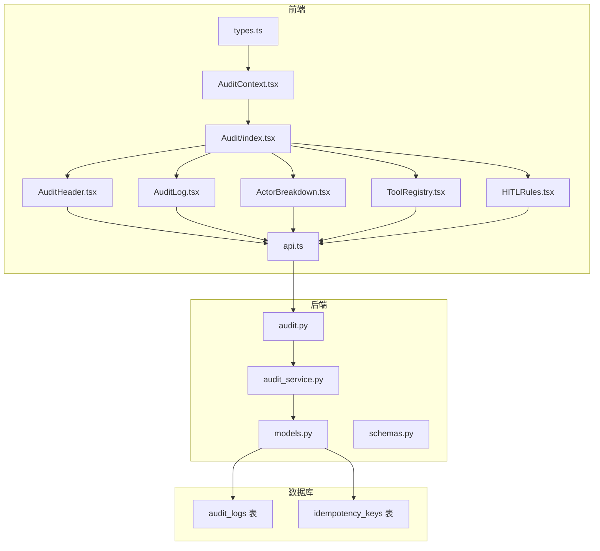
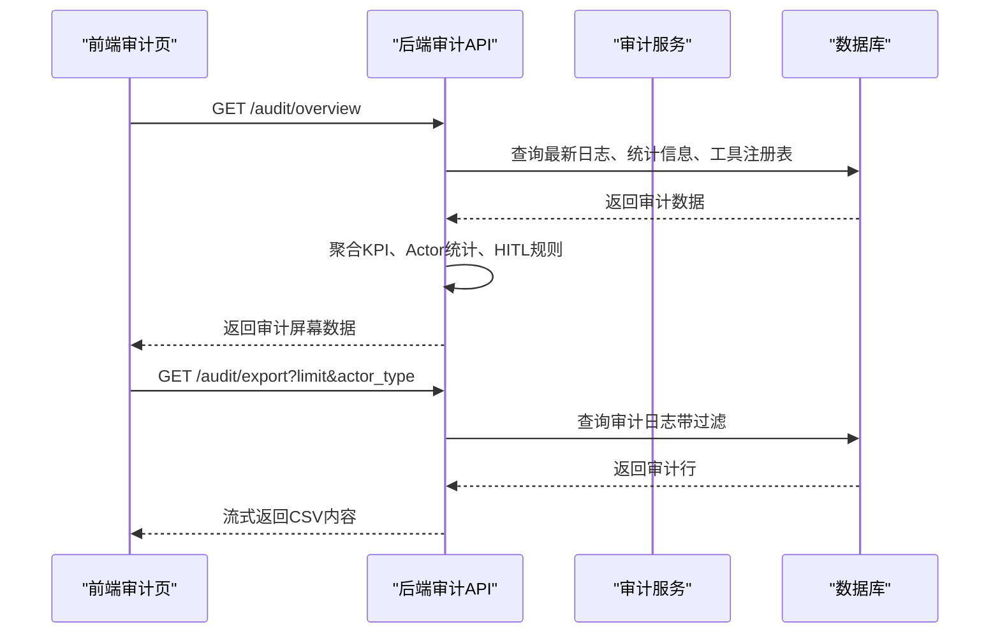
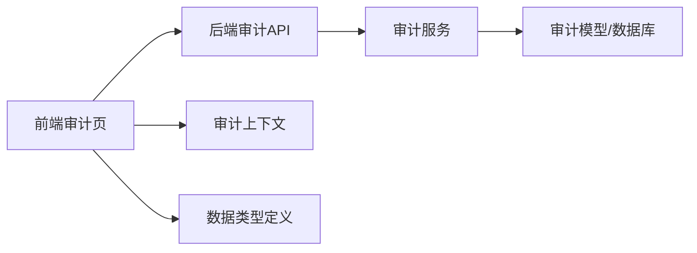
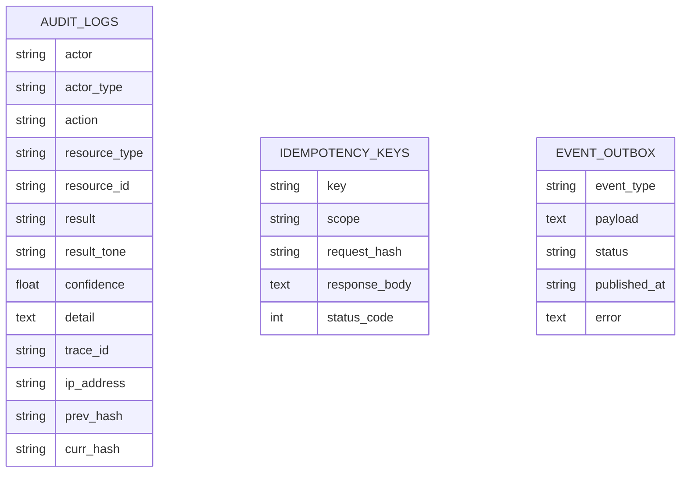

# 报告生成

<cite>
**本文引用的文件**
- [backend/app/api/v1/audit.py](file://backend/app/api/v1/audit.py)
- [backend/app/services/audit_service.py](file://backend/app/services/audit_service.py)
- [backend/app/domains/audit/models.py](file://backend/app/domains/audit/models.py)
- [backend/app/domains/audit/schemas.py](file://backend/app/domains/audit/schemas.py)
- [frontend/src/screens/Audit/index.tsx](file://frontend/src/screens/Audit/index.tsx)
- [frontend/src/screens/Audit/AuditHeader.tsx](file://frontend/src/screens/Audit/AuditHeader.tsx)
- [frontend/src/screens/Audit/AuditLog.tsx](file://frontend/src/screens/Audit/AuditLog.tsx)
- [frontend/src/screens/Audit/ActorBreakdown.tsx](file://frontend/src/screens/Audit/ActorBreakdown.tsx)
- [frontend/src/screens/Audit/ToolRegistry.tsx](file://frontend/src/screens/Audit/ToolRegistry.tsx)
- [frontend/src/screens/Audit/HITLRules.tsx](file://frontend/src/screens/Audit/HITLRules.tsx)
- [frontend/src/contexts/AuditContext.tsx](file://frontend/src/contexts/AuditContext.tsx)
- [frontend/src/lib/api.ts](file://frontend/src/lib/api.ts)
- [frontend/src/data/types.ts](file://frontend/src/data/types.ts)
</cite>

## 目录
1. [简介](#简介)
2. [项目结构](#项目结构)
3. [核心组件](#核心组件)
4. [架构总览](#架构总览)
5. [详细组件分析](#详细组件分析)
6. [依赖关系分析](#依赖关系分析)
7. [性能考量](#性能考量)
8. [故障排查指南](#故障排查指南)
9. [结论](#结论)
10. [附录](#附录)

## 简介
本文件面向量化系统中的“报告生成”能力，聚焦审计报告的生成模板、数据聚合与可视化展示，以及合规场景下的KPI指标计算、统计图表生成与报告导出机制。文档以代码为依据，结合前后端实现，帮助开发者理解如何在系统中实现合规报告的自动化与数据展示。

## 项目结构
审计报告相关的核心分布在后端API与服务层、数据库模型与序列化Schema，以及前端审计页面与上下文。整体采用“API → 服务 → 数据库”的分层设计，并通过前端组件完成可视化呈现与交互。

**图表来源**
- [frontend/src/screens/Audit/index.tsx:16-42](file://frontend/src/screens/Audit/index.tsx#L16-L42)
- [frontend/src/screens/Audit/AuditHeader.tsx:7-33](file://frontend/src/screens/Audit/AuditHeader.tsx#L7-L33)
- [frontend/src/screens/Audit/AuditLog.tsx:19-98](file://frontend/src/screens/Audit/AuditLog.tsx#L19-L98)
- [frontend/src/screens/Audit/ActorBreakdown.tsx:3-37](file://frontend/src/screens/Audit/ActorBreakdown.tsx#L3-L37)
- [frontend/src/screens/Audit/ToolRegistry.tsx:3-39](file://frontend/src/screens/Audit/ToolRegistry.tsx#L3-L39)
- [frontend/src/screens/Audit/HITLRules.tsx:9-37](file://frontend/src/screens/Audit/HITLRules.tsx#L9-L37)
- [frontend/src/contexts/AuditContext.tsx:1-12](file://frontend/src/contexts/AuditContext.tsx#L1-L12)
- [frontend/src/lib/api.ts:727-735](file://frontend/src/lib/api.ts#L727-L735)
- [backend/app/api/v1/audit.py:153-168](file://backend/app/api/v1/audit.py#L153-L168)
- [backend/app/services/audit_service.py:32-81](file://backend/app/services/audit_service.py#L32-L81)
- [backend/app/domains/audit/models.py:9-27](file://backend/app/domains/audit/models.py#L9-L27)

**章节来源**
- [backend/app/api/v1/audit.py:153-168](file://backend/app/api/v1/audit.py#L153-L168)
- [backend/app/services/audit_service.py:32-81](file://backend/app/services/audit_service.py#L32-L81)
- [backend/app/domains/audit/models.py:9-27](file://backend/app/domains/audit/models.py#L9-L27)
- [frontend/src/screens/Audit/index.tsx:16-42](file://frontend/src/screens/Audit/index.tsx#L16-L42)
- [frontend/src/lib/api.ts:727-735](file://frontend/src/lib/api.ts#L727-L735)

## 核心组件
- 后端API：提供审计概览、日志列表、Actor统计、工具注册表、HITL规则、哈希链验证与CSV导出等接口。
- 审计服务：负责审计日志的追加写入、哈希链计算与完整性校验。
- 数据模型：定义不可变审计日志表结构及配套的幂等键与事件外发表。
- 前端审计页：整合KPI、日志表格、Actor分布、工具注册表与HITL规则，并提供导出按钮触发后端导出。
- 类型与上下文：统一前后端数据契约，提供审计上下文以便组件共享数据。

**章节来源**
- [backend/app/api/v1/audit.py:153-168](file://backend/app/api/v1/audit.py#L153-L168)
- [backend/app/services/audit_service.py:32-109](file://backend/app/services/audit_service.py#L32-L109)
- [backend/app/domains/audit/models.py:9-27](file://backend/app/domains/audit/models.py#L9-L27)
- [frontend/src/screens/Audit/AuditHeader.tsx:7-33](file://frontend/src/screens/Audit/AuditHeader.tsx#L7-L33)
- [frontend/src/screens/Audit/AuditLog.tsx:19-98](file://frontend/src/screens/Audit/AuditLog.tsx#L19-L98)
- [frontend/src/screens/Audit/ActorBreakdown.tsx:3-37](file://frontend/src/screens/Audit/ActorBreakdown.tsx#L3-L37)
- [frontend/src/screens/Audit/ToolRegistry.tsx:3-39](file://frontend/src/screens/Audit/ToolRegistry.tsx#L3-L39)
- [frontend/src/screens/Audit/HITLRules.tsx:9-37](file://frontend/src/screens/Audit/HITLRules.tsx#L9-L37)
- [frontend/src/contexts/AuditContext.tsx:1-12](file://frontend/src/contexts/AuditContext.tsx#L1-L12)
- [frontend/src/lib/api.ts:727-735](file://frontend/src/lib/api.ts#L727-L735)
- [frontend/src/data/types.ts:601-618](file://frontend/src/data/types.ts#L601-L618)

## 架构总览
审计报告的生成与展示遵循“请求 → API路由 → 服务层 → 数据库”的标准流程；同时通过哈希链保证日志不可篡改性，前端负责将聚合后的数据以KPI、表格、条形图等形式可视化呈现。

**图表来源**
- [backend/app/api/v1/audit.py:153-168](file://backend/app/api/v1/audit.py#L153-L168)
- [backend/app/api/v1/audit.py:215-245](file://backend/app/api/v1/audit.py#L215-L245)
- [backend/app/services/audit_service.py:32-81](file://backend/app/services/audit_service.py#L32-L81)
- [backend/app/domains/audit/models.py:9-27](file://backend/app/domains/audit/models.py#L9-L27)

## 详细组件分析

### 后端API：审计概览与导出
- 概览接口：一次性返回KPI、日志行、Actor统计、工具注册表与HITL规则，便于前端一次性渲染。
- 日志查询：支持按Actor类型与动作关键字过滤、分页参数控制。
- 导出接口：将审计日志导出为CSV，包含时间、Actor、动作、资源、结果、置信度、详情、Trace ID与哈希等字段。
- 验证接口：对最近N条日志进行哈希链完整性校验，返回状态与断点信息。

关键实现位置：
- 概览接口与聚合逻辑：[backend/app/api/v1/audit.py:153-168](file://backend/app/api/v1/audit.py#L153-L168)
- KPI计算：[backend/app/api/v1/audit.py:73-106](file://backend/app/api/v1/audit.py#L73-L106)
- 日志分页与过滤：[backend/app/api/v1/audit.py:171-186](file://backend/app/api/v1/audit.py#L171-L186)
- 导出CSV流式响应：[backend/app/api/v1/audit.py:215-245](file://backend/app/api/v1/audit.py#L215-L245)
- 哈希链验证：[backend/app/api/v1/audit.py:198-212](file://backend/app/api/v1/audit.py#L198-L212)

**章节来源**
- [backend/app/api/v1/audit.py:73-106](file://backend/app/api/v1/audit.py#L73-L106)
- [backend/app/api/v1/audit.py:171-186](file://backend/app/api/v1/audit.py#L171-L186)
- [backend/app/api/v1/audit.py:198-212](file://backend/app/api/v1/audit.py#L198-L212)
- [backend/app/api/v1/audit.py:215-245](file://backend/app/api/v1/audit.py#L215-L245)

### 审计服务：日志追加与哈希链
- 追加日志：获取最新日志的当前哈希作为前一跳，计算新日志的当前哈希并持久化。
- 完整性校验：按时间顺序取最近N条，逐条比对计算哈希与存储哈希是否一致，定位断点。

关键实现位置：
- 日志追加与哈希计算：[backend/app/services/audit_service.py:38-81](file://backend/app/services/audit_service.py#L38-L81)
- 哈希链验证：[backend/app/services/audit_service.py:83-109](file://backend/app/services/audit_service.py#L83-L109)

**章节来源**
- [backend/app/services/audit_service.py:38-81](file://backend/app/services/audit_service.py#L38-L81)
- [backend/app/services/audit_service.py:83-109](file://backend/app/services/audit_service.py#L83-L109)

### 数据模型与序列化
- 审计日志模型：包含Actor、Actor类型、动作、资源类型/ID、结果、置信度、详情、Trace ID、IP地址、前一哈希与当前哈希等字段。
- 幂等键与事件外发：用于重复请求防护与可靠事件发布。
- 序列化Schema：与前端MockData对齐，确保前后端数据契约一致。

关键实现位置：
- 审计日志模型：[backend/app/domains/audit/models.py:9-27](file://backend/app/domains/audit/models.py#L9-L27)
- 幂等键与事件外发：[backend/app/domains/audit/models.py:29-51](file://backend/app/domains/audit/models.py#L29-L51)
- 审计Schema：[backend/app/domains/audit/schemas.py:6-53](file://backend/app/domains/audit/schemas.py#L6-L53)

**章节来源**
- [backend/app/domains/audit/models.py:9-27](file://backend/app/domains/audit/models.py#L9-L27)
- [backend/app/domains/audit/models.py:29-51](file://backend/app/domains/audit/models.py#L29-L51)
- [backend/app/domains/audit/schemas.py:6-53](file://backend/app/domains/audit/schemas.py#L6-L53)

### 前端审计页：可视化与交互
- 审计页入口：拉取概览数据并注入上下文，供子组件使用。
- KPI展示：顶部KPI条，显示总事件、Agent操作、人工审批、异常事件与哈希链完整率。
- 日志表格：支持按Actor类型筛选，展示时间、Actor、动作、资源、结果、置信度、详情与Trace ID。
- Actor分布：Actor计数与占比条形图。
- 工具注册表：工具名称、风险等级、允许Agent列表。
- HITL规则：规则标题、描述与状态标签。
- 导出按钮：触发后端CSV导出。

关键实现位置：
- 审计页入口与上下文：[frontend/src/screens/Audit/index.tsx:16-42](file://frontend/src/screens/Audit/index.tsx#L16-L42)
- KPI与按钮：[frontend/src/screens/Audit/AuditHeader.tsx:7-33](file://frontend/src/screens/Audit/AuditHeader.tsx#L7-L33)
- 日志表格与筛选：[frontend/src/screens/Audit/AuditLog.tsx:19-98](file://frontend/src/screens/Audit/AuditLog.tsx#L19-L98)
- Actor分布：[frontend/src/screens/Audit/ActorBreakdown.tsx:3-37](file://frontend/src/screens/Audit/ActorBreakdown.tsx#L3-L37)
- 工具注册表：[frontend/src/screens/Audit/ToolRegistry.tsx:3-39](file://frontend/src/screens/Audit/ToolRegistry.tsx#L3-L39)
- HITL规则：[frontend/src/screens/Audit/HITLRules.tsx:9-37](file://frontend/src/screens/Audit/HITLRules.tsx#L9-L37)
- 上下文Hook：[frontend/src/contexts/AuditContext.tsx:1-12](file://frontend/src/contexts/AuditContext.tsx#L1-L12)
- API封装：[frontend/src/lib/api.ts:727-735](file://frontend/src/lib/api.ts#L727-L735)
- 数据类型定义：[frontend/src/data/types.ts:601-618](file://frontend/src/data/types.ts#L601-L618)

**章节来源**
- [frontend/src/screens/Audit/index.tsx:16-42](file://frontend/src/screens/Audit/index.tsx#L16-L42)
- [frontend/src/screens/Audit/AuditHeader.tsx:7-33](file://frontend/src/screens/Audit/AuditHeader.tsx#L7-L33)
- [frontend/src/screens/Audit/AuditLog.tsx:19-98](file://frontend/src/screens/Audit/AuditLog.tsx#L19-L98)
- [frontend/src/screens/Audit/ActorBreakdown.tsx:3-37](file://frontend/src/screens/Audit/ActorBreakdown.tsx#L3-L37)
- [frontend/src/screens/Audit/ToolRegistry.tsx:3-39](file://frontend/src/screens/Audit/ToolRegistry.tsx#L3-L39)
- [frontend/src/screens/Audit/HITLRules.tsx:9-37](file://frontend/src/screens/Audit/HITLRules.tsx#L9-L37)
- [frontend/src/contexts/AuditContext.tsx:1-12](file://frontend/src/contexts/AuditContext.tsx#L1-L12)
- [frontend/src/lib/api.ts:727-735](file://frontend/src/lib/api.ts#L727-L735)
- [frontend/src/data/types.ts:601-618](file://frontend/src/data/types.ts#L601-L618)

### 报告模板与格式规范
- 报告模板：由后端API一次性返回的“审计屏幕”数据构成，包含KPI、日志行、Actor统计、工具注册表与HITL规则。
- 导出格式：CSV，字段包括时间、Actor、Actor类型、动作、资源类型、资源ID、结果、置信度、详情、Trace ID与当前哈希。
- 数据筛选：日志查询支持按Actor类型与动作关键字过滤，并支持分页与限制数量。
- 批量导出：导出接口支持限制最大数量，避免超大数据集一次性导出导致内存压力。

关键实现位置：
- 概览模板结构：[backend/app/api/v1/audit.py:153-168](file://backend/app/api/v1/audit.py#L153-L168)
- 导出CSV字段与流式响应：[backend/app/api/v1/audit.py:215-245](file://backend/app/api/v1/audit.py#L215-L245)
- 日志过滤与分页：[backend/app/api/v1/audit.py:171-186](file://backend/app/api/v1/audit.py#L171-L186)

**章节来源**
- [backend/app/api/v1/audit.py:153-168](file://backend/app/api/v1/audit.py#L153-L168)
- [backend/app/api/v1/audit.py:171-186](file://backend/app/api/v1/audit.py#L171-L186)
- [backend/app/api/v1/audit.py:215-245](file://backend/app/api/v1/audit.py#L215-L245)

### KPI指标计算与统计图表
- 总事件：审计日志总数。
- Agent操作：Actor类型为Agent的操作次数。
- 人工审批：Actor类型为Human的操作次数。
- 异常事件：结果色调为红色的事件数。
- 哈希链完整：最近若干条日志中存在当前哈希的数量比例，用于快速完整性探针。
- Actor分布：按Actor分组统计操作次数并计算占比，前端以条形图展示。

关键实现位置：
- KPI计算：[backend/app/api/v1/audit.py:73-106](file://backend/app/api/v1/audit.py#L73-L106)
- Actor统计：[backend/app/api/v1/audit.py:109-125](file://backend/app/api/v1/audit.py#L109-L125)
- Actor分布前端渲染：[frontend/src/screens/Audit/ActorBreakdown.tsx:3-37](file://frontend/src/screens/Audit/ActorBreakdown.tsx#L3-L37)

**章节来源**
- [backend/app/api/v1/audit.py:73-106](file://backend/app/api/v1/audit.py#L73-L106)
- [backend/app/api/v1/audit.py:109-125](file://backend/app/api/v1/audit.py#L109-L125)
- [frontend/src/screens/Audit/ActorBreakdown.tsx:3-37](file://frontend/src/screens/Audit/ActorBreakdown.tsx#L3-L37)

### 统计图表生成与可视化
- KPI条：颜色与趋势符号区分不同指标状态。
- 日志表格：按Actor类型筛选，结果色调用于视觉提示。
- Actor分布：条形图展示占比，支持颜色区分。
- 工具注册表：按风险等级着色，Agent列表为空时显示禁止。
- HITL规则：按状态着色，展示规则与描述。

关键实现位置：
- KPI渲染：[frontend/src/screens/Audit/AuditHeader.tsx:24-31](file://frontend/src/screens/Audit/AuditHeader.tsx#L24-L31)
- 日志表格与色调：[frontend/src/screens/Audit/AuditLog.tsx:68-92](file://frontend/src/screens/Audit/AuditLog.tsx#L68-L92)
- Actor分布：[frontend/src/screens/Audit/ActorBreakdown.tsx:16-35](file://frontend/src/screens/Audit/ActorBreakdown.tsx#L16-L35)
- 工具注册表：[frontend/src/screens/Audit/ToolRegistry.tsx:16-36](file://frontend/src/screens/Audit/ToolRegistry.tsx#L16-L36)
- HITL规则：[frontend/src/screens/Audit/HITLRules.tsx:21-34](file://frontend/src/screens/Audit/HITLRules.tsx#L21-L34)

**章节来源**
- [frontend/src/screens/Audit/AuditHeader.tsx:24-31](file://frontend/src/screens/Audit/AuditHeader.tsx#L24-L31)
- [frontend/src/screens/Audit/AuditLog.tsx:68-92](file://frontend/src/screens/Audit/AuditLog.tsx#L68-L92)
- [frontend/src/screens/Audit/ActorBreakdown.tsx:16-35](file://frontend/src/screens/Audit/ActorBreakdown.tsx#L16-L35)
- [frontend/src/screens/Audit/ToolRegistry.tsx:16-36](file://frontend/src/screens/Audit/ToolRegistry.tsx#L16-L36)
- [frontend/src/screens/Audit/HITLRules.tsx:21-34](file://frontend/src/screens/Audit/HITLRules.tsx#L21-L34)

### 报告导出机制
- 触发方式：前端审计页点击“导出审计报告”按钮，调用后端导出接口。
- 参数控制：支持按Actor类型过滤与限制导出数量。
- 输出格式：CSV流式响应，包含审计日志的标准化字段。
- 批量策略：通过限制数量避免一次性导出大量数据。

关键实现位置：
- 前端导出按钮与API调用：[frontend/src/screens/Audit/AuditHeader.tsx](file://frontend/src/screens/Audit/AuditHeader.tsx#L20)
- 后端导出接口：[backend/app/api/v1/audit.py:215-245](file://backend/app/api/v1/audit.py#L215-L245)
- API封装：[frontend/src/lib/api.ts:727-735](file://frontend/src/lib/api.ts#L727-L735)

**章节来源**
- [frontend/src/screens/Audit/AuditHeader.tsx](file://frontend/src/screens/Audit/AuditHeader.tsx#L20)
- [backend/app/api/v1/audit.py:215-245](file://backend/app/api/v1/audit.py#L215-L245)
- [frontend/src/lib/api.ts:727-735](file://frontend/src/lib/api.ts#L727-L735)

## 依赖关系分析
- 前端依赖后端API提供的审计概览与导出接口，通过上下文共享数据。
- 后端API依赖服务层进行数据聚合与哈希链校验，最终访问数据库模型。
- 数据模型支撑不可篡改的日志与幂等键等基础设施。

**图表来源**
- [frontend/src/screens/Audit/index.tsx:16-42](file://frontend/src/screens/Audit/index.tsx#L16-L42)
- [frontend/src/contexts/AuditContext.tsx:1-12](file://frontend/src/contexts/AuditContext.tsx#L1-L12)
- [frontend/src/data/types.ts:601-618](file://frontend/src/data/types.ts#L601-L618)
- [backend/app/api/v1/audit.py:153-168](file://backend/app/api/v1/audit.py#L153-L168)
- [backend/app/services/audit_service.py:32-81](file://backend/app/services/audit_service.py#L32-L81)
- [backend/app/domains/audit/models.py:9-27](file://backend/app/domains/audit/models.py#L9-L27)

**章节来源**
- [frontend/src/screens/Audit/index.tsx:16-42](file://frontend/src/screens/Audit/index.tsx#L16-L42)
- [frontend/src/contexts/AuditContext.tsx:1-12](file://frontend/src/contexts/AuditContext.tsx#L1-L12)
- [frontend/src/data/types.ts:601-618](file://frontend/src/data/types.ts#L601-L618)
- [backend/app/api/v1/audit.py:153-168](file://backend/app/api/v1/audit.py#L153-L168)
- [backend/app/services/audit_service.py:32-81](file://backend/app/services/audit_service.py#L32-L81)
- [backend/app/domains/audit/models.py:9-27](file://backend/app/domains/audit/models.py#L9-L27)

## 性能考量
- 导出限制：后端导出接口限制最大导出数量，避免超大数据集导致内存与网络压力。
- 分页查询：日志查询支持分页与过滤，降低前端一次性渲染压力。
- 哈希链验证：仅对最近若干条日志进行校验，兼顾完整性与性能。
- 前端渲染：Actor分布与日志表格采用简单循环与条件渲染，复杂度与数据规模线性相关。

**章节来源**
- [backend/app/api/v1/audit.py:171-186](file://backend/app/api/v1/audit.py#L171-L186)
- [backend/app/api/v1/audit.py:215-245](file://backend/app/api/v1/audit.py#L215-L245)
- [backend/app/api/v1/audit.py:198-212](file://backend/app/api/v1/audit.py#L198-L212)

## 故障排查指南
- 导出失败或空数据：检查导出接口参数（Actor类型、数量限制）与后端数据库中审计日志是否存在。
- 哈希链验证失败：关注返回的断点ID与验证数量，定位具体断点并检查该条目是否被篡改或缺失。
- 前端不显示数据：确认审计概览接口返回正常，检查上下文注入与组件渲染逻辑。
- 性能问题：若导出或日志查询缓慢，适当减少导出数量或增加分页步长。

**章节来源**
- [backend/app/api/v1/audit.py:215-245](file://backend/app/api/v1/audit.py#L215-L245)
- [backend/app/api/v1/audit.py:198-212](file://backend/app/api/v1/audit.py#L198-L212)
- [frontend/src/screens/Audit/index.tsx:16-42](file://frontend/src/screens/Audit/index.tsx#L16-L42)

## 结论
本报告生成体系以“不可篡改的审计日志”为核心，通过后端API聚合KPI与统计数据、前端组件完成可视化展示，并提供CSV导出与哈希链完整性校验，满足合规报告自动化与数据展示需求。建议在生产环境中进一步完善导出并发控制、错误重试与监控埋点，以提升稳定性与可观测性。

## 附录
- 数据模型ER图（简化）

**图表来源**
- [backend/app/domains/audit/models.py:9-27](file://backend/app/domains/audit/models.py#L9-L27)
- [backend/app/domains/audit/models.py:29-51](file://backend/app/domains/audit/models.py#L29-L51)