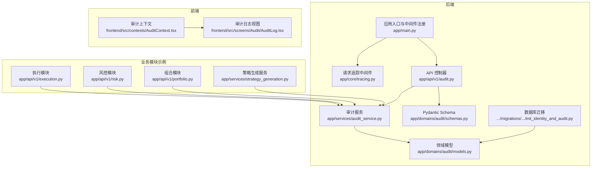
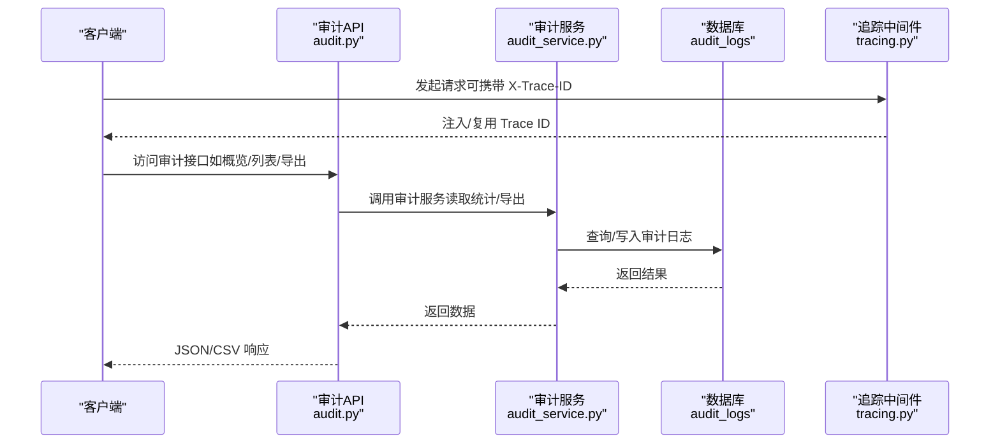
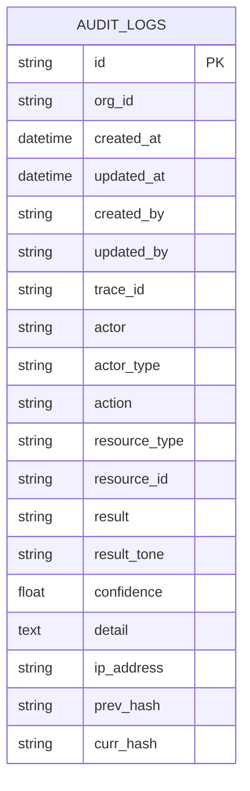
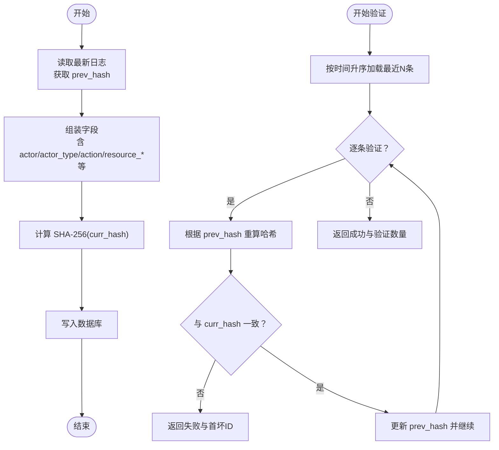
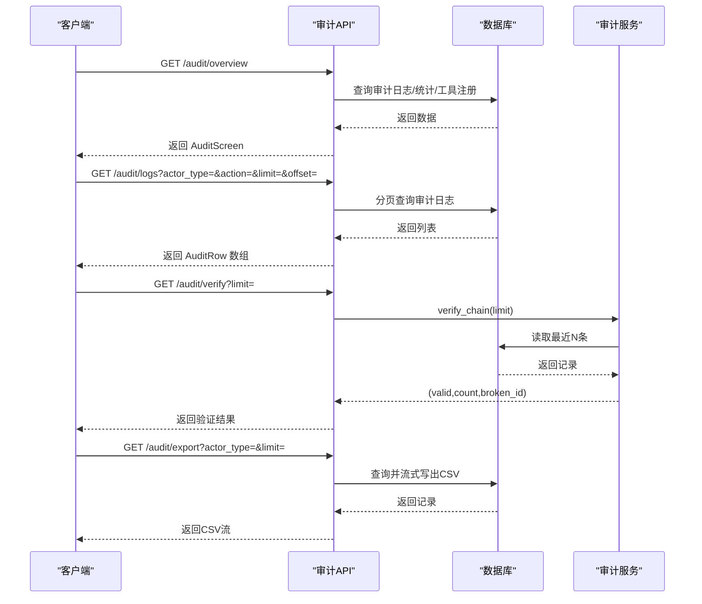
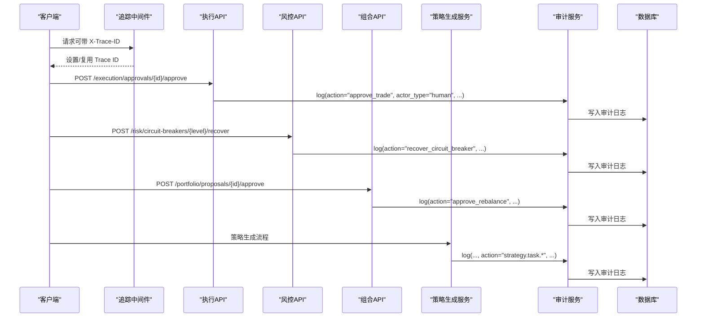
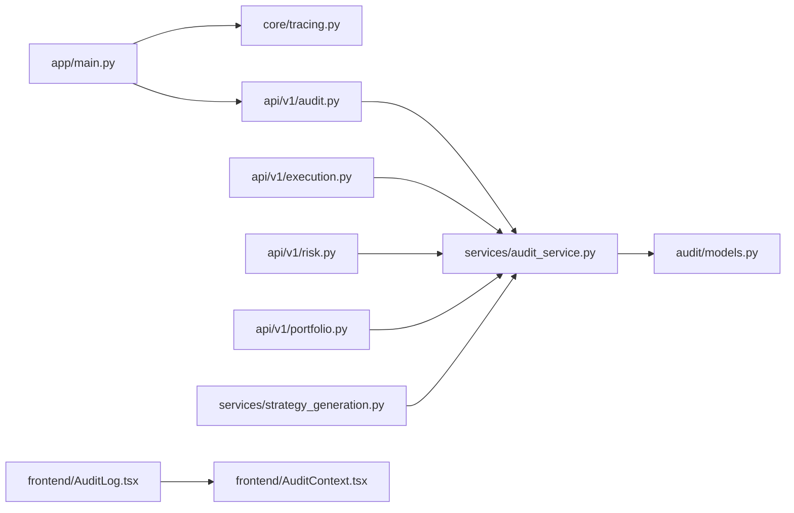

# 操作审计日志

<cite>
**本文引用的文件**
- [backend/app/domains/audit/models.py](file://backend/app/domains/audit/models.py)
- [backend/app/domains/audit/schemas.py](file://backend/app/domains/audit/schemas.py)
- [backend/app/api/v1/audit.py](file://backend/app/api/v1/audit.py)
- [backend/app/services/audit_service.py](file://backend/app/services/audit_service.py)
- [backend/app/db/migrations/versions/20260510_000001_init_identity_and_audit.py](file://backend/app/db/migrations/versions/20260510_000001_init_identity_and_audit.py)
- [backend/app/core/tracing.py](file://backend/app/core/tracing.py)
- [backend/app/main.py](file://backend/app/main.py)
- [backend/app/api/v1/execution.py](file://backend/app/api/v1/execution.py)
- [backend/app/api/v1/risk.py](file://backend/app/api/v1/risk.py)
- [backend/app/api/v1/portfolio.py](file://backend/app/api/v1/portfolio.py)
- [backend/app/services/strategy_generation.py](file://backend/app/services/strategy_generation.py)
- [frontend/src/screens/Audit/AuditLog.tsx](file://frontend/src/screens/Audit/AuditLog.tsx)
- [frontend/src/contexts/AuditContext.tsx](file://frontend/src/contexts/AuditContext.tsx)
</cite>

## 目录
1. [简介](#简介)
2. [项目结构](#项目结构)
3. [核心组件](#核心组件)
4. [架构总览](#架构总览)
5. [详细组件分析](#详细组件分析)
6. [依赖关系分析](#依赖关系分析)
7. [性能考量](#性能考量)
8. [故障排查指南](#故障排查指南)
9. [结论](#结论)
10. [附录](#附录)

## 简介
本文件面向量化交易系统的审计日志子系统，系统性阐述审计事件的生成机制、存储结构、查询接口与完整性校验方法。重点覆盖以下方面：
- 审计事件捕获流程：在关键业务路径中注入审计日志，确保可追溯、不可篡改
- 存储结构：基于数据库表的字段定义与索引策略
- 查询接口：分页列表、统计聚合、哈希链验证、CSV 导出
- 时间序列追踪：通过 Trace ID 关联跨服务调用链
- 完整性校验：基于 SHA-256 的哈希链验证，保障不可篡改性

## 项目结构
审计日志相关代码主要分布在后端的领域模型、API 控制器、服务层与迁移脚本，并在前端提供审计屏展示。

图表来源
- [backend/app/api/v1/audit.py:1-258](file://backend/app/api/v1/audit.py#L1-L258)
- [backend/app/services/audit_service.py:1-109](file://backend/app/services/audit_service.py#L1-L109)
- [backend/app/domains/audit/models.py:1-51](file://backend/app/domains/audit/models.py#L1-L51)
- [backend/app/domains/audit/schemas.py:1-53](file://backend/app/domains/audit/schemas.py#L1-L53)
- [backend/app/db/migrations/versions/20260510_000001_init_identity_and_audit.py:106-130](file://backend/app/db/migrations/versions/20260510_000001_init_identity_and_audit.py#L106-L130)
- [backend/app/core/tracing.py:49-87](file://backend/app/core/tracing.py#L49-L87)
- [backend/app/main.py:39-58](file://backend/app/main.py#L39-L58)
- [backend/app/api/v1/execution.py:235-244](file://backend/app/api/v1/execution.py#L235-L244)
- [backend/app/api/v1/risk.py:225-234](file://backend/app/api/v1/risk.py#L225-L234)
- [backend/app/api/v1/portfolio.py:175-184](file://backend/app/api/v1/portfolio.py#L175-L184)
- [backend/app/services/strategy_generation.py:117-122](file://backend/app/services/strategy_generation.py#L117-L122)
- [frontend/src/contexts/AuditContext.tsx:1-13](file://frontend/src/contexts/AuditContext.tsx#L1-L13)
- [frontend/src/screens/Audit/AuditLog.tsx:1-99](file://frontend/src/screens/Audit/AuditLog.tsx#L1-L99)

章节来源
- [backend/app/api/v1/audit.py:1-258](file://backend/app/api/v1/audit.py#L1-L258)
- [backend/app/services/audit_service.py:1-109](file://backend/app/services/audit_service.py#L1-L109)
- [backend/app/domains/audit/models.py:1-51](file://backend/app/domains/audit/models.py#L1-L51)
- [backend/app/domains/audit/schemas.py:1-53](file://backend/app/domains/audit/schemas.py#L1-L53)
- [backend/app/db/migrations/versions/20260510_000001_init_identity_and_audit.py:106-130](file://backend/app/db/migrations/versions/20260510_000001_init_identity_and_audit.py#L106-L130)
- [backend/app/core/tracing.py:49-87](file://backend/app/core/tracing.py#L49-L87)
- [backend/app/main.py:39-58](file://backend/app/main.py#L39-L58)
- [frontend/src/contexts/AuditContext.tsx:1-13](file://frontend/src/contexts/AuditContext.tsx#L1-L13)
- [frontend/src/screens/Audit/AuditLog.tsx:1-99](file://frontend/src/screens/Audit/AuditLog.tsx#L1-L99)

## 核心组件
- 审计日志模型：定义不可变审计日志表结构，包含参与者、动作、资源、结果、置信度、详情、Trace ID、IP 地址以及哈希链字段
- 审计服务：负责计算哈希链、写入数据库并返回持久化后的条目；提供哈希链验证能力
- API 控制器：提供审计概览、分页列表、统计、哈希链验证、CSV 导出与工具注册等接口
- 请求追踪中间件：为每个请求生成或复用 Trace ID，并在响应头中回传，便于跨服务关联
- 前端审计屏：消费后端接口数据，渲染审计事件列表与统计

章节来源
- [backend/app/domains/audit/models.py:9-27](file://backend/app/domains/audit/models.py#L9-L27)
- [backend/app/services/audit_service.py:32-82](file://backend/app/services/audit_service.py#L32-L82)
- [backend/app/api/v1/audit.py:153-257](file://backend/app/api/v1/audit.py#L153-L257)
- [backend/app/core/tracing.py:13-26](file://backend/app/core/tracing.py#L13-L26)

## 架构总览
审计日志贯穿请求生命周期：中间件注入 Trace ID，业务控制器在关键节点调用审计服务写入日志，API 提供查询与导出能力，前端以表格形式展示。

图表来源
- [backend/app/api/v1/audit.py:153-257](file://backend/app/api/v1/audit.py#L153-L257)
- [backend/app/services/audit_service.py:32-82](file://backend/app/services/audit_service.py#L32-L82)
- [backend/app/core/tracing.py:49-87](file://backend/app/core/tracing.py#L49-L87)

## 详细组件分析

### 数据模型与存储结构
- 表名：audit_logs
- 关键字段
  - actor / actor_type：操作者标识与类型（human / agent / system）
  - action：具体动作
  - resource_type / resource_id：资源类型与唯一标识
  - result / result_tone：结果与语义色调（green/yellow/red）
  - confidence：置信度（浮点）
  - detail：事件详情文本
  - trace_id：请求追踪 ID
  - ip_address：来源 IP
  - prev_hash / curr_hash：前一节点哈希与当前节点哈希，形成不可篡改链
- 索引策略：对 actor、action、resource_id、trace_id 等常用查询字段建立索引，提升过滤与排序性能
- 迁移脚本：初始化表结构与字段约束

图表来源
- [backend/app/domains/audit/models.py:9-27](file://backend/app/domains/audit/models.py#L9-L27)
- [backend/app/db/migrations/versions/20260510_000001_init_identity_and_audit.py:106-130](file://backend/app/db/migrations/versions/20260510_000001_init_identity_and_audit.py#L106-L130)

章节来源
- [backend/app/domains/audit/models.py:9-27](file://backend/app/domains/audit/models.py#L9-L27)
- [backend/app/db/migrations/versions/20260510_000001_init_identity_and_audit.py:106-130](file://backend/app/db/migrations/versions/20260510_000001_init_identity_and_audit.py#L106-L130)

### 审计服务与哈希链
- 写入流程
  - 获取最新日志的 curr_hash 作为 prev_hash
  - 组装字段并计算 curr_hash（SHA-256）
  - 写入数据库并返回持久化对象
- 验证流程
  - 从最早到最晚顺序读取最近 N 条记录
  - 对每条记录重新计算哈希并与 curr_hash 比较
  - 返回验证状态、验证数量与首个异常条目的 ID

图表来源
- [backend/app/services/audit_service.py:38-82](file://backend/app/services/audit_service.py#L38-L82)
- [backend/app/services/audit_service.py:83-109](file://backend/app/services/audit_service.py#L83-L109)

章节来源
- [backend/app/services/audit_service.py:18-30](file://backend/app/services/audit_service.py#L18-L30)
- [backend/app/services/audit_service.py:38-82](file://backend/app/services/audit_service.py#L38-L82)
- [backend/app/services/audit_service.py:83-109](file://backend/app/services/audit_service.py#L83-L109)

### API 接口与查询能力
- 概览接口：一次性返回 KPI、事件列表、Actor 统计、工具注册与人工介入规则
- 列表接口：支持按 actor_type、action 过滤，分页 limit/offset
- 统计接口：Actor 操作次数 Top-N
- 哈希链验证：对最近 N 条记录进行完整性校验
- 导出接口：按 CSV 导出审计日志，支持按 actor_type 过滤与 limit 控制
- 工具注册与人工介入规则：返回工具风险等级与规则状态

图表来源
- [backend/app/api/v1/audit.py:153-257](file://backend/app/api/v1/audit.py#L153-L257)

章节来源
- [backend/app/api/v1/audit.py:153-257](file://backend/app/api/v1/audit.py#L153-L257)

### 事件捕获与时间序列追踪
- 追踪中间件：在请求进入时生成或复用 Trace ID，并在响应头中回传
- 业务模块：在关键动作发生时调用审计服务写入日志，自动携带当前 Trace ID
- 示例场景
  - 执行模块：审批交易通过/拒绝
  - 风控模块：熔断触发/恢复
  - 组合模块：再平衡提案审批
  - 策略生成服务：任务创建/成功/失败

图表来源
- [backend/app/core/tracing.py:49-87](file://backend/app/core/tracing.py#L49-L87)
- [backend/app/api/v1/execution.py:235-244](file://backend/app/api/v1/execution.py#L235-L244)
- [backend/app/api/v1/risk.py:225-234](file://backend/app/api/v1/risk.py#L225-L234)
- [backend/app/api/v1/portfolio.py:175-184](file://backend/app/api/v1/portfolio.py#L175-L184)
- [backend/app/services/strategy_generation.py:117-122](file://backend/app/services/strategy_generation.py#L117-L122)
- [backend/app/services/strategy_generation.py:299-307](file://backend/app/services/strategy_generation.py#L299-L307)
- [backend/app/services/strategy_generation.py:356-364](file://backend/app/services/strategy_generation.py#L356-L364)

章节来源
- [backend/app/core/tracing.py:13-26](file://backend/app/core/tracing.py#L13-L26)
- [backend/app/api/v1/execution.py:235-244](file://backend/app/api/v1/execution.py#L235-L244)
- [backend/app/api/v1/risk.py:225-234](file://backend/app/api/v1/risk.py#L225-L234)
- [backend/app/api/v1/portfolio.py:175-184](file://backend/app/api/v1/portfolio.py#L175-L184)
- [backend/app/services/strategy_generation.py:117-122](file://backend/app/services/strategy_generation.py#L117-L122)
- [backend/app/services/strategy_generation.py:299-307](file://backend/app/services/strategy_generation.py#L299-L307)
- [backend/app/services/strategy_generation.py:356-364](file://backend/app/services/strategy_generation.py#L356-L364)

### 前端展示与交互
- 上下文：提供审计数据的 Provider 与 Hook
- 视图：按 Actor 类型筛选显示，展示时间、Actor、动作、资源、结果、置信度、详情与 Trace ID
- 结果标签映射：将后端结果码映射为中文标签，便于用户理解

章节来源
- [frontend/src/contexts/AuditContext.tsx:1-13](file://frontend/src/contexts/AuditContext.tsx#L1-L13)
- [frontend/src/screens/Audit/AuditLog.tsx:1-99](file://frontend/src/screens/Audit/AuditLog.tsx#L1-L99)

## 依赖关系分析
- 中间件依赖：应用入口注册追踪中间件，确保每个请求具备 Trace ID
- API 依赖：审计 API 依赖审计服务与数据库会话
- 服务依赖：审计服务依赖追踪上下文与数据库会话
- 业务模块依赖：各业务模块在关键动作处直接调用审计服务
- 前端依赖：审计屏依赖上下文提供的 Mock 数据结构

图表来源
- [backend/app/main.py:39-58](file://backend/app/main.py#L39-L58)
- [backend/app/core/tracing.py:49-87](file://backend/app/core/tracing.py#L49-L87)
- [backend/app/api/v1/audit.py:153-257](file://backend/app/api/v1/audit.py#L153-L257)
- [backend/app/services/audit_service.py:32-82](file://backend/app/services/audit_service.py#L32-L82)
- [backend/app/domains/audit/models.py:9-27](file://backend/app/domains/audit/models.py#L9-L27)
- [backend/app/api/v1/execution.py:235-244](file://backend/app/api/v1/execution.py#L235-L244)
- [backend/app/api/v1/risk.py:225-234](file://backend/app/api/v1/risk.py#L225-L234)
- [backend/app/api/v1/portfolio.py:175-184](file://backend/app/api/v1/portfolio.py#L175-L184)
- [backend/app/services/strategy_generation.py:117-122](file://backend/app/services/strategy_generation.py#L117-L122)
- [frontend/src/screens/Audit/AuditLog.tsx:1-99](file://frontend/src/screens/Audit/AuditLog.tsx#L1-L99)
- [frontend/src/contexts/AuditContext.tsx:1-13](file://frontend/src/contexts/AuditContext.tsx#L1-L13)

章节来源
- [backend/app/main.py:39-58](file://backend/app/main.py#L39-L58)
- [backend/app/core/tracing.py:49-87](file://backend/app/core/tracing.py#L49-L87)
- [backend/app/api/v1/audit.py:153-257](file://backend/app/api/v1/audit.py#L153-L257)
- [backend/app/services/audit_service.py:32-82](file://backend/app/services/audit_service.py#L32-L82)
- [backend/app/domains/audit/models.py:9-27](file://backend/app/domains/audit/models.py#L9-L27)
- [backend/app/api/v1/execution.py:235-244](file://backend/app/api/v1/execution.py#L235-L244)
- [backend/app/api/v1/risk.py:225-234](file://backend/app/api/v1/risk.py#L225-L234)
- [backend/app/api/v1/portfolio.py:175-184](file://backend/app/api/v1/portfolio.py#L175-L184)
- [backend/app/services/strategy_generation.py:117-122](file://backend/app/services/strategy_generation.py#L117-L122)
- [frontend/src/screens/Audit/AuditLog.tsx:1-99](file://frontend/src/screens/Audit/AuditLog.tsx#L1-L99)
- [frontend/src/contexts/AuditContext.tsx:1-13](file://frontend/src/contexts/AuditContext.tsx#L1-L13)

## 性能考量
- 查询优化
  - 审计日志按时间倒序查询为主，建议在 created_at 上维护合适索引
  - 常见过滤字段（actor_type、action、resource_id、trace_id）已建立索引，有利于分页与过滤
- 导出性能
  - 导出接口采用流式写出，避免一次性加载大量数据至内存
- 哈希链验证
  - 验证限制在最近 N 条记录，防止全表扫描；默认 N 可按需求调整
- 写入开销
  - 每次写入需计算 SHA-256，建议在高并发场景评估 CPU 开销并结合批量策略

## 故障排查指南
- 哈希链验证失败
  - 现象：verify 接口返回 broken，包含首个异常条目的 ID
  - 处理：检查该条目是否被篡改或历史数据缺失；必要时回滚至上一条有效记录并重建链
- 缺失 curr_hash
  - 现象：早期未启用哈希链的数据在统计中显示为“未哈希”
  - 处理：可通过完整性探测逻辑识别；后续新增记录将自动补全
- 导出内容为空
  - 现象：导出 CSV 为空
  - 处理：检查过滤参数（actor_type/limit），确认数据库中存在匹配记录
- Trace ID 不一致
  - 现象：前端展示的 Trace ID 与后端响应头不一致
  - 处理：确认中间件已正确设置并回传 X-Trace-ID；检查客户端请求头是否携带

章节来源
- [backend/app/api/v1/audit.py:198-212](file://backend/app/api/v1/audit.py#L198-L212)
- [backend/app/services/audit_service.py:83-109](file://backend/app/services/audit_service.py#L83-L109)

## 结论
本审计日志系统通过不可变的哈希链实现操作轨迹的完整性保护，并提供完善的查询与导出能力。结合 Trace ID 的跨服务追踪，能够清晰还原关键业务事件的时间线与责任归属，满足量化系统对数据安全与合规性的要求。

## 附录

### 日志字段定义与含义
- actor：操作者标识（如用户邮箱、Agent 名称）
- actor_type：操作者类型（human / agent / system）
- action：具体动作（如 approve_trade、strategy.task.created）
- resource_type：资源类型（如 approval、strategy_task、circuit_breaker）
- resource_id：资源唯一标识（如审批单号、任务 ID）
- result：结果（如 approved、rejected、success、failure）
- result_tone：结果语义色调（green/yellow/red）
- confidence：置信度（浮点数）
- detail：事件详情（文本）
- trace_id：请求追踪 ID（用于跨服务关联）
- ip_address：来源 IP
- prev_hash / curr_hash：哈希链字段，形成不可篡改链

章节来源
- [backend/app/domains/audit/models.py:14-26](file://backend/app/domains/audit/models.py#L14-L26)

### 查询过滤条件
- 列表接口支持
  - actor_type：按操作者类型过滤
  - action：按动作关键词模糊过滤
  - limit/offset：分页控制
- 导出接口支持
  - actor_type：按操作者类型过滤
  - limit：导出上限控制

章节来源
- [backend/app/api/v1/audit.py:171-186](file://backend/app/api/v1/audit.py#L171-L186)
- [backend/app/api/v1/audit.py:215-245](file://backend/app/api/v1/audit.py#L215-L245)

### 导出功能说明
- 输出字段：time、actor、actor_type、action、resource_type、resource_id、result、confidence、detail、trace_id、curr_hash
- 格式：CSV 流式输出，支持文件下载
- 适用场景：审计归档、监管报送、离线分析

章节来源
- [backend/app/api/v1/audit.py:215-245](file://backend/app/api/v1/audit.py#L215-L245)