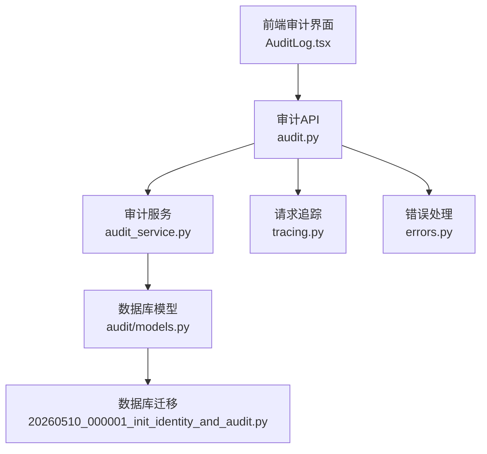
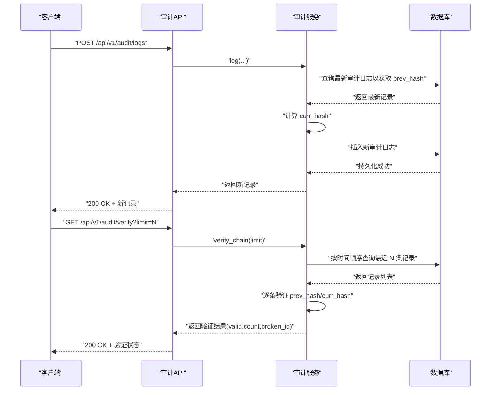
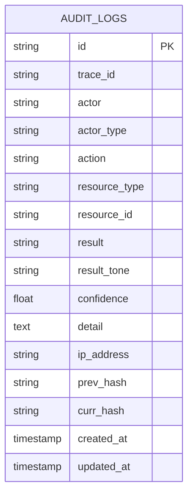
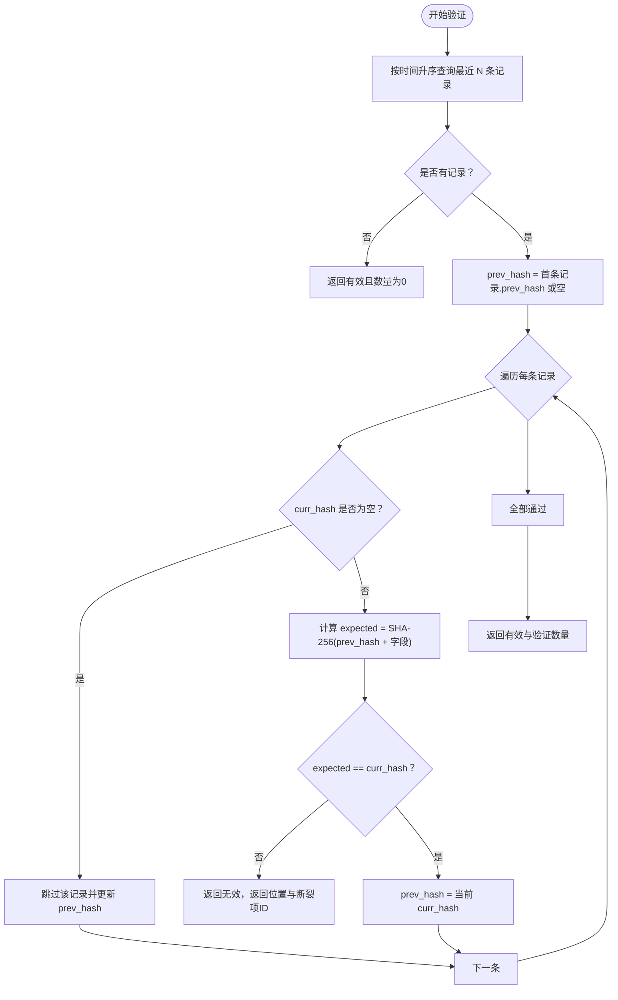
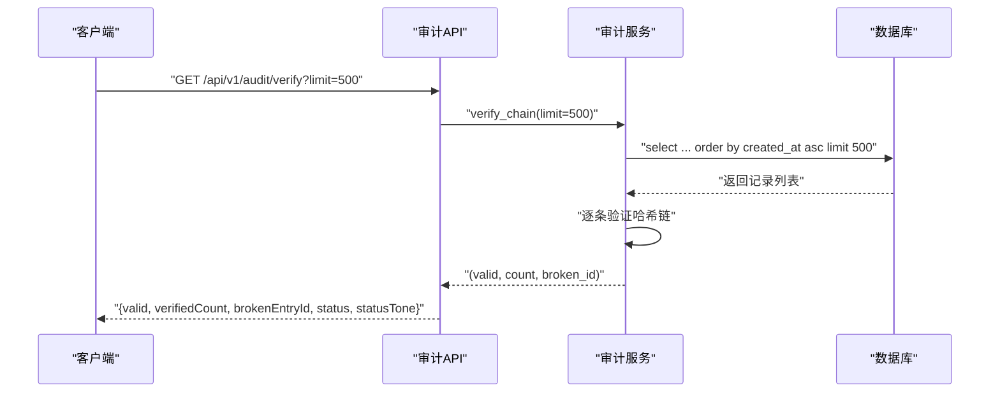
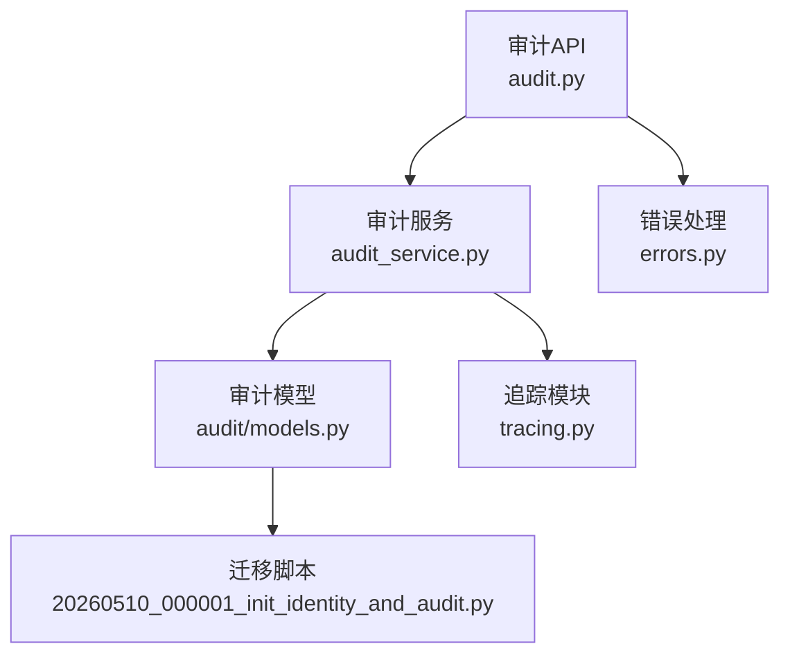

# 数据完整性验证

<cite>
**本文档引用的文件**
- [backend/app/services/audit_service.py](file://backend/app/services/audit_service.py)
- [backend/app/domains/audit/models.py](file://backend/app/domains/audit/models.py)
- [backend/app/api/v1/audit.py](file://backend/app/api/v1/audit.py)
- [backend/app/db/migrations/versions/20260510_000001_init_identity_and_audit.py](file://backend/app/db/migrations/versions/20260510_000001_init_identity_and_audit.py)
- [backend/app/core/tracing.py](file://backend/app/core/tracing.py)
- [backend/app/core/errors.py](file://backend/app/core/errors.py)
- [frontend/src/screens/Audit/AuditLog.tsx](file://frontend/src/screens/Audit/AuditLog.tsx)
</cite>

## 目录
1. [简介](#简介)
2. [项目结构](#项目结构)
3. [核心组件](#核心组件)
4. [架构概览](#架构概览)
5. [详细组件分析](#详细组件分析)
6. [依赖关系分析](#依赖关系分析)
7. [性能考虑](#性能考虑)
8. [故障排查指南](#故障排查指南)
9. [结论](#结论)

## 简介
本文件面向量化系统中的数据完整性验证子系统，聚焦于审计日志的哈希链验证、数据篡改检测与审计追踪的完整性保障机制。系统采用 SHA-256 哈希算法，通过 prev_hash/curr_hash 字段形成不可变的链式验证结构，并提供独立的验证接口用于完整性检查。同时，系统支持导出审计日志以便离线验证与合规审计。

## 项目结构
数据完整性验证功能由后端服务层、数据库模型层、API 层以及前端展示层协同完成：
- 服务层：负责生成审计日志并计算哈希链，提供链式验证能力
- 数据模型层：定义审计日志表结构及字段（含哈希字段）
- API 层：提供审计日志查询、哈希链验证、导出等接口
- 前端层：展示审计日志与完整性状态

**图表来源**
- [backend/app/api/v1/audit.py:1-258](file://backend/app/api/v1/audit.py#L1-L258)
- [backend/app/services/audit_service.py:1-109](file://backend/app/services/audit_service.py#L1-L109)
- [backend/app/domains/audit/models.py:1-51](file://backend/app/domains/audit/models.py#L1-L51)
- [backend/app/db/migrations/versions/20260510_000001_init_identity_and_audit.py:106-130](file://backend/app/db/migrations/versions/20260510_000001_init_identity_and_audit.py#L106-L130)
- [backend/app/core/tracing.py:1-87](file://backend/app/core/tracing.py#L1-L87)
- [backend/app/core/errors.py:1-119](file://backend/app/core/errors.py#L1-L119)

**章节来源**
- [backend/app/api/v1/audit.py:1-258](file://backend/app/api/v1/audit.py#L1-L258)
- [backend/app/services/audit_service.py:1-109](file://backend/app/services/audit_service.py#L1-L109)
- [backend/app/domains/audit/models.py:1-51](file://backend/app/domains/audit/models.py#L1-L51)
- [backend/app/db/migrations/versions/20260510_000001_init_identity_and_audit.py:106-130](file://backend/app/db/migrations/versions/20260510_000001_init_identity_and_audit.py#L106-L130)

## 核心组件
- 审计日志模型：包含审计字段与哈希字段，确保每条记录可被链式验证
- 审计服务：负责生成审计日志并计算哈希，提供链式验证方法
- 审计API：提供日志查询、哈希链验证、导出等接口
- 追踪与错误处理：为审计日志注入 trace_id 并统一错误处理

**章节来源**
- [backend/app/domains/audit/models.py:9-27](file://backend/app/domains/audit/models.py#L9-L27)
- [backend/app/services/audit_service.py:32-108](file://backend/app/services/audit_service.py#L32-L108)
- [backend/app/api/v1/audit.py:198-212](file://backend/app/api/v1/audit.py#L198-L212)
- [backend/app/core/tracing.py:13-26](file://backend/app/core/tracing.py#L13-L26)
- [backend/app/core/errors.py:73-95](file://backend/app/core/errors.py#L73-L95)

## 架构概览
系统通过“服务层-模型层-API层”的分层设计实现数据完整性验证：
- 写入路径：API 接收请求 → 服务层构造审计日志 → 计算哈希 → 持久化
- 验证路径：API 调用服务层验证方法 → 顺序比对哈希链 → 返回验证结果
- 展示路径：前端读取审计数据 → 渲染日志与完整性状态

**图表来源**
- [backend/app/api/v1/audit.py:198-212](file://backend/app/api/v1/audit.py#L198-L212)
- [backend/app/services/audit_service.py:38-81](file://backend/app/services/audit_service.py#L38-L81)
- [backend/app/services/audit_service.py:83-108](file://backend/app/services/audit_service.py#L83-L108)

## 详细组件分析

### 审计日志模型与哈希字段
- 审计日志表包含以下关键字段：
  - 标识与追踪：id、trace_id
  - 行为信息：actor、actor_type、action、resource_type、resource_id、result、result_tone、confidence、detail、ip_address
  - 时间戳：created_at、updated_at
  - 哈希链：prev_hash、curr_hash
- 哈希字段设计：
  - prev_hash：指向链上前一条记录的 curr_hash
  - curr_hash：当前记录的 SHA-256 哈希值
- 迁移脚本确保表结构与索引满足查询与验证需求

**图表来源**
- [backend/app/domains/audit/models.py:9-27](file://backend/app/domains/audit/models.py#L9-L27)
- [backend/app/db/migrations/versions/20260510_000001_init_identity_and_audit.py:106-130](file://backend/app/db/migrations/versions/20260510_000001_init_identity_and_audit.py#L106-L130)

**章节来源**
- [backend/app/domains/audit/models.py:9-27](file://backend/app/domains/audit/models.py#L9-L27)
- [backend/app/db/migrations/versions/20260510_000001_init_identity_and_audit.py:106-130](file://backend/app/db/migrations/versions/20260510_000001_init_identity_and_audit.py#L106-L130)

### 审计服务：哈希链生成与验证
- 日志写入流程：
  - 查询最新审计日志以获取 prev_hash（若无则为空）
  - 构造审计日志实体并设置时间戳与 trace_id
  - 在持久化前计算 curr_hash（基于字段拼接后的 SHA-256）
  - 提交事务并刷新实体
- 链式验证流程：
  - 按创建时间升序查询最近 limit 条记录
  - 跳过未计算哈希的历史记录（curr_hash 为空）
  - 逐条验证 expected = SHA-256(prev_hash + fields) 是否等于 curr_hash
  - 返回验证结果：是否有效、验证数量、第一个断裂项的 id

**图表来源**
- [backend/app/services/audit_service.py:83-108](file://backend/app/services/audit_service.py#L83-L108)

**章节来源**
- [backend/app/services/audit_service.py:38-81](file://backend/app/services/audit_service.py#L38-L81)
- [backend/app/services/audit_service.py:83-108](file://backend/app/services/audit_service.py#L83-L108)

### 审计API：日志查询、验证与导出
- 日志查询与统计：
  - 支持按 actor_type、action 过滤与分页
  - 提供关键指标（总事件、Agent 操作、人工审批、异常事件、哈希链完整率）
- 哈希链验证：
  - 提供 /verify 接口，支持 limit 参数控制验证范围
  - 返回 valid、verifiedCount、brokenEntryId、status、statusTone
- 导出功能：
  - 提供 CSV 导出接口，便于离线验证与审计

**图表来源**
- [backend/app/api/v1/audit.py:198-212](file://backend/app/api/v1/audit.py#L198-L212)
- [backend/app/services/audit_service.py:83-108](file://backend/app/services/audit_service.py#L83-L108)

**章节来源**
- [backend/app/api/v1/audit.py:171-186](file://backend/app/api/v1/audit.py#L171-L186)
- [backend/app/api/v1/audit.py:198-212](file://backend/app/api/v1/audit.py#L198-L212)
- [backend/app/api/v1/audit.py:215-245](file://backend/app/api/v1/audit.py#L215-L245)

### 前端展示：审计日志与完整性状态
- 前端审计界面展示审计日志，包含时间、Actor 类型、动作、资源、结果、置信度、详情与 Trace ID
- 完整性状态可通过调用 /verify 接口获取并在界面中显示

**章节来源**
- [frontend/src/screens/Audit/AuditLog.tsx:19-98](file://frontend/src/screens/Audit/AuditLog.tsx#L19-L98)

## 依赖关系分析
- 服务层依赖：
  - SQLAlchemy 异步会话进行数据库操作
  - 追踪模块提供 actor_id 与 trace_id
  - 模型层提供审计日志表结构
- API 层依赖：
  - 服务层提供审计能力
  - 错误处理模块统一异常响应
  - 追踪模块提供 trace_id 注入
- 数据库层依赖：
  - 迁移脚本确保审计日志表结构与索引存在

**图表来源**
- [backend/app/services/audit_service.py:1-16](file://backend/app/services/audit_service.py#L1-L16)
- [backend/app/api/v1/audit.py:13-24](file://backend/app/api/v1/audit.py#L13-L24)
- [backend/app/domains/audit/models.py:1-7](file://backend/app/domains/audit/models.py#L1-L7)
- [backend/app/db/migrations/versions/20260510_000001_init_identity_and_audit.py:106-130](file://backend/app/db/migrations/versions/20260510_000001_init_identity_and_audit.py#L106-L130)
- [backend/app/core/tracing.py:1-11](file://backend/app/core/tracing.py#L1-L11)
- [backend/app/core/errors.py:1-11](file://backend/app/core/errors.py#L1-L11)

**章节来源**
- [backend/app/services/audit_service.py:1-16](file://backend/app/services/audit_service.py#L1-L16)
- [backend/app/api/v1/audit.py:13-24](file://backend/app/api/v1/audit.py#L13-L24)
- [backend/app/domains/audit/models.py:1-7](file://backend/app/domains/audit/models.py#L1-L7)
- [backend/app/db/migrations/versions/20260510_000001_init_identity_and_audit.py:106-130](file://backend/app/db/migrations/versions/20260510_000001_init_identity_and_audit.py#L106-L130)
- [backend/app/core/tracing.py:1-11](file://backend/app/core/tracing.py#L1-L11)
- [backend/app/core/errors.py:1-11](file://backend/app/core/errors.py#L1-L11)

## 性能考虑
- 查询与验证范围：
  - verify 接口支持 limit 控制，建议根据业务场景设置合理上限，避免全量扫描
- 哈希计算复杂度：
  - SHA-256 计算开销极低，主要瓶颈在数据库 IO；建议对 created_at、trace_id 等字段建立索引（迁移脚本已包含）
- 批量写入：
  - 写入时先计算 curr_hash 再持久化，减少往返；建议在高并发场景下使用连接池与事务批处理
- 历史兼容：
  - 验证流程会跳过历史无哈希记录，避免影响整体验证性能

[本节为通用性能建议，不直接分析具体文件]

## 故障排查指南
- 验证结果为“断裂”：
  - 使用 /verify 接口返回的 brokenEntryId 定位问题记录
  - 检查该记录的 prev_hash 与 curr_hash 是否匹配，确认是否存在数据篡改或计算错误
- 缺少哈希字段：
  - 历史记录可能未计算哈希；验证流程会跳过这些记录，不影响后续链路
- 导出与离线验证：
  - 使用 /export 接口导出 CSV，结合工具对 curr_hash 进行离线复核
- 错误处理：
  - 统一异常通过错误处理模块记录并返回标准格式，便于定位 trace_id 与请求上下文

**章节来源**
- [backend/app/api/v1/audit.py:198-212](file://backend/app/api/v1/audit.py#L198-L212)
- [backend/app/api/v1/audit.py:215-245](file://backend/app/api/v1/audit.py#L215-L245)
- [backend/app/core/errors.py:73-95](file://backend/app/core/errors.py#L73-L95)

## 结论
本系统通过 SHA-256 哈希链实现了审计日志的不可篡改性与可验证性，结合独立的验证接口与导出能力，满足量化系统对数据完整性与合规审计的需求。服务层、模型层与 API 层的清晰分工保证了功能的可维护性与扩展性；通过合理的索引与参数化验证范围，可在保证安全性的同时兼顾性能。