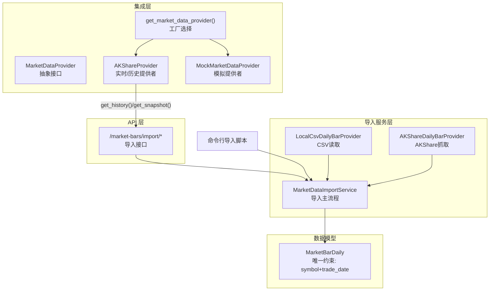
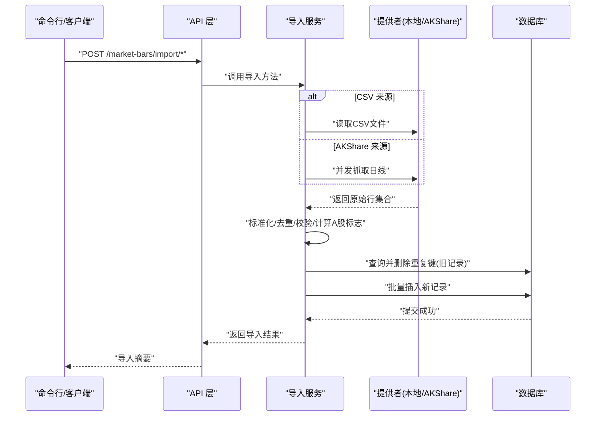
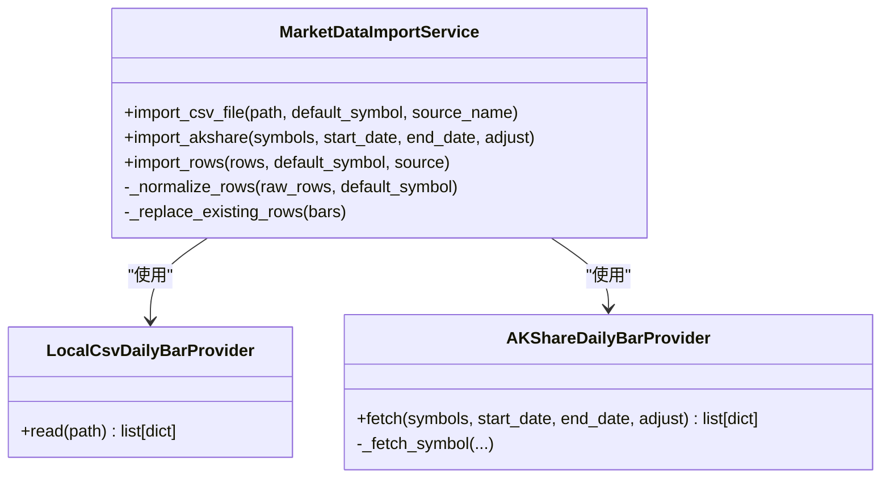
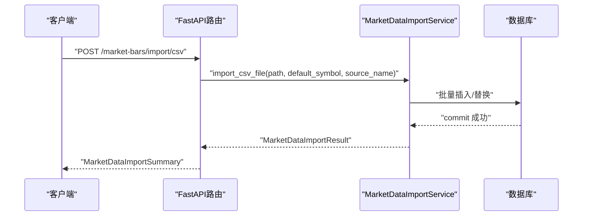
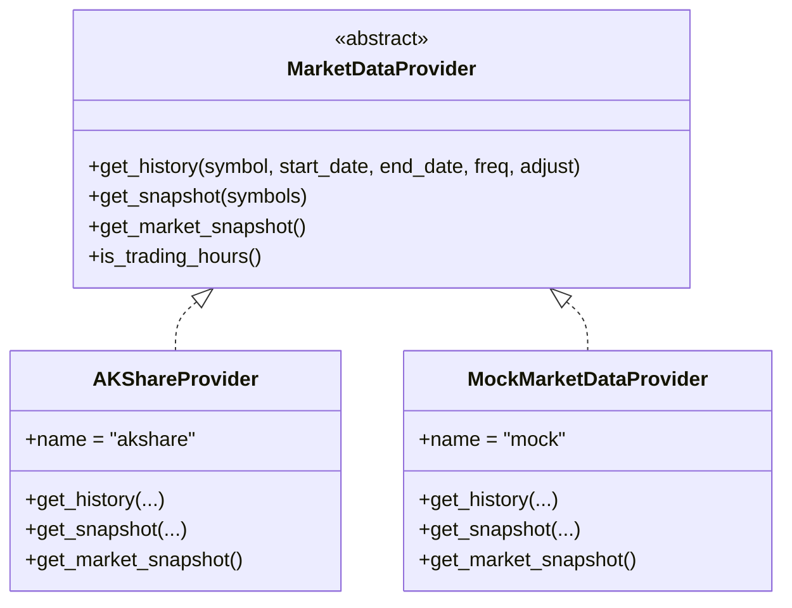
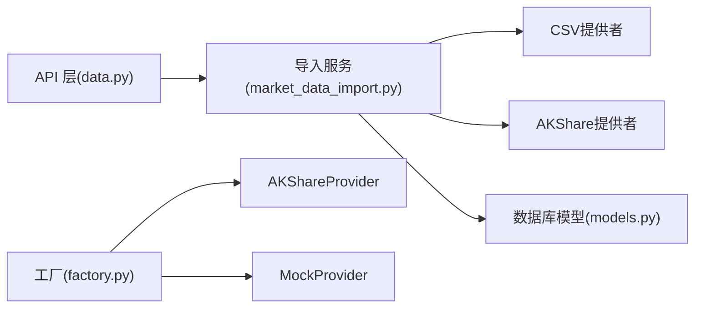
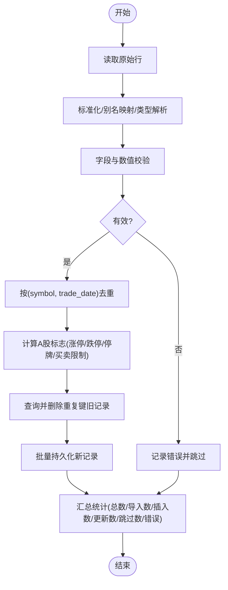

# 市场数据导入

<cite>
**本文引用的文件**
- [backend/app/services/market_data_import.py](file://backend/app/services/market_data_import.py)
- [backend/scripts/import_market_data.py](file://backend/scripts/import_market_data.py)
- [backend/app/integrations/market_data/base.py](file://backend/app/integrations/market_data/base.py)
- [backend/app/integrations/market_data/factory.py](file://backend/app/integrations/market_data/factory.py)
- [backend/app/integrations/market_data/akshare_provider.py](file://backend/app/integrations/market_data/akshare_provider.py)
- [backend/app/integrations/market_data/mock_provider.py](file://backend/app/integrations/market_data/mock_provider.py)
- [backend/app/integrations/market_data/adapter.py](file://backend/app/integrations/market_data/adapter.py)
- [backend/app/api/v1/data.py](file://backend/app/api/v1/data.py)
- [backend/app/domains/data/models.py](file://backend/app/domains/data/models.py)
- [backend/tests/services/test_market_data_import.py](file://backend/tests/services/test_market_data_import.py)
</cite>

## 目录
1. [简介](#简介)
2. [项目结构](#项目结构)
3. [核心组件](#核心组件)
4. [架构总览](#架构总览)
5. [详细组件分析](#详细组件分析)
6. [依赖分析](#依赖分析)
7. [性能考虑](#性能考虑)
8. [故障排查指南](#故障排查指南)
9. [结论](#结论)
10. [附录](#附录)

## 简介
本技术文档聚焦“市场数据导入”能力，覆盖以下导入方式与实现要点：
- CSV 文件导入：本地 CSV 导入服务，字段别名映射、标准化与清洗、去重与更新替换、A 股特殊标志计算。
- AKShare 数据源导入：通过 AKShare 获取 A 股日线行情，异步封装与并发拉取。
- Tushare 数据源导入：通过工厂模式接入 Tushare Provider（适配器接口预留，具体实现按需扩展）。
- 架构设计：服务层、提供者抽象、工厂选择、API 屏蔽层、数据库持久化。
- 批量处理机制：内存中先归一化、去重、校验，再批量插入或替换。
- 错误处理策略：字段缺失、数值非法、重复键、网络/安装异常等。
- 性能优化方案：异步线程池、批量提交、唯一索引约束、字段别名与宽松解析。

## 项目结构
围绕“市场数据导入”的相关模块组织如下：
- 服务层：导入服务与提供者实现
- 集成层：市场数据提供者抽象与工厂
- API 层：导入接口与响应封装
- 数据模型：数据库表定义与唯一约束
- 脚本：命令行导入入口
- 测试：导入服务行为验证

图表来源
- [backend/app/services/market_data_import.py:177-290](file://backend/app/services/market_data_import.py#L177-L290)
- [backend/app/integrations/market_data/base.py:64-113](file://backend/app/integrations/market_data/base.py#L64-L113)
- [backend/app/integrations/market_data/factory.py:23-57](file://backend/app/integrations/market_data/factory.py#L23-L57)
- [backend/app/integrations/market_data/akshare_provider.py:145-262](file://backend/app/integrations/market_data/akshare_provider.py#L145-L262)
- [backend/app/api/v1/data.py:155-191](file://backend/app/api/v1/data.py#L155-L191)
- [backend/app/domains/data/models.py:40-67](file://backend/app/domains/data/models.py#L40-L67)

章节来源
- [backend/app/services/market_data_import.py:177-290](file://backend/app/services/market_data_import.py#L177-L290)
- [backend/app/integrations/market_data/base.py:64-113](file://backend/app/integrations/market_data/base.py#L64-L113)
- [backend/app/integrations/market_data/factory.py:23-57](file://backend/app/integrations/market_data/factory.py#L23-L57)
- [backend/app/integrations/market_data/akshare_provider.py:145-262](file://backend/app/integrations/market_data/akshare_provider.py#L145-L262)
- [backend/app/api/v1/data.py:155-191](file://backend/app/api/v1/data.py#L155-L191)
- [backend/app/domains/data/models.py:40-67](file://backend/app/domains/data/models.py#L40-L67)

## 核心组件
- 导入服务
  - 职责：统一接收原始行、标准化/清洗/去重、A 股标志计算、替换旧记录、批量持久化。
  - 关键点：字段别名映射、严格校验、重复键去重、批量删除旧记录后再新增。
- CSV 提供者
  - 职责：读取本地 UTF-8 CSV 文件，返回字典行列表。
  - 异常：文件不存在、路径非文件。
- AKShare 提供者
  - 职责：异步并发抓取多个股票的日线行情，转换为统一结构。
  - 异常：未安装包时提示改用本地导入。
- 历史/快照提供者（集成层）
  - 职责：抽象历史与快照接口；工厂根据配置选择 AKShare/Tushare/Mock。
- 数据模型
  - 职责：定义每日行情表结构与唯一约束（symbol+trade_date），便于幂等写入。

章节来源
- [backend/app/services/market_data_import.py:177-290](file://backend/app/services/market_data_import.py#L177-L290)
- [backend/app/services/market_data_import.py:107-120](file://backend/app/services/market_data_import.py#L107-L120)
- [backend/app/services/market_data_import.py:122-175](file://backend/app/services/market_data_import.py#L122-L175)
- [backend/app/integrations/market_data/base.py:64-113](file://backend/app/integrations/market_data/base.py#L64-L113)
- [backend/app/integrations/market_data/factory.py:23-57](file://backend/app/integrations/market_data/factory.py#L23-L57)
- [backend/app/domains/data/models.py:40-67](file://backend/app/domains/data/models.py#L40-L67)

## 架构总览
导入流程分为“命令行/接口触发—服务层—提供者—数据库”四层，支持 CSV 与 AKShare 两种来源，并通过工厂模式可扩展至 Tushare 等其他提供者。

图表来源
- [backend/app/api/v1/data.py:155-191](file://backend/app/api/v1/data.py#L155-L191)
- [backend/app/services/market_data_import.py:185-241](file://backend/app/services/market_data_import.py#L185-L241)
- [backend/app/services/market_data_import.py:107-175](file://backend/app/services/market_data_import.py#L107-L175)
- [backend/app/domains/data/models.py:40-67](file://backend/app/domains/data/models.py#L40-L67)

## 详细组件分析

### 组件A：导入服务与提供者
- 导入服务职责
  - 接收原始行集合，执行标准化、去重、校验与 A 股标志计算。
  - 对重复键（symbol+trade_date）进行“先删后插”，保证幂等。
  - 返回导入结果对象，包含统计与错误明细。
- CSV 提供者
  - 读取 UTF-8 CSV，自动跳过空行，返回字典列表。
- AKShare 提供者
  - 异步并发遍历股票列表，每个股票在独立线程中调用 AKShare 接口。
  - 将返回的 DataFrame 转换为统一记录结构，并补全 symbol 字段。

图表来源
- [backend/app/services/market_data_import.py:177-290](file://backend/app/services/market_data_import.py#L177-L290)
- [backend/app/services/market_data_import.py:107-175](file://backend/app/services/market_data_import.py#L107-L175)

章节来源
- [backend/app/services/market_data_import.py:177-290](file://backend/app/services/market_data_import.py#L177-L290)
- [backend/app/services/market_data_import.py:107-175](file://backend/app/services/market_data_import.py#L107-L175)

### 组件B：API 层导入接口
- CSV 导入接口
  - 请求体包含 CSV 路径与默认股票代码等参数。
  - 返回导入摘要，包含来源、总数、插入数、更新数、跳过数、时间范围、错误列表。
- AKShare 导入接口
  - 请求体包含股票列表、起止日期、复权方式等。
  - 返回与 CSV 导入一致的摘要结构。

图表来源
- [backend/app/api/v1/data.py:155-173](file://backend/app/api/v1/data.py#L155-L173)
- [backend/app/services/market_data_import.py:185-241](file://backend/app/services/market_data_import.py#L185-L241)

章节来源
- [backend/app/api/v1/data.py:155-191](file://backend/app/api/v1/data.py#L155-L191)

### 组件C：集成层提供者与工厂
- MarketDataProvider 抽象
  - 定义 get_history/get_snapshot/get_market_snapshot 等异步接口。
- 工厂选择
  - 支持 akshare/tushare/wind/mock，默认 akshare；未安装 akshare 时回退 mock。
- AKShareProvider
  - 实现历史/快照接口，内部以线程池执行阻塞调用，避免阻塞事件循环。
- MockProvider
  - 生成确定性合成行情，用于开发与测试。

图表来源
- [backend/app/integrations/market_data/base.py:64-113](file://backend/app/integrations/market_data/base.py#L64-L113)
- [backend/app/integrations/market_data/akshare_provider.py:145-262](file://backend/app/integrations/market_data/akshare_provider.py#L145-L262)
- [backend/app/integrations/market_data/mock_provider.py:29-109](file://backend/app/integrations/market_data/mock_provider.py#L29-L109)

章节来源
- [backend/app/integrations/market_data/base.py:64-113](file://backend/app/integrations/market_data/base.py#L64-L113)
- [backend/app/integrations/market_data/factory.py:23-57](file://backend/app/integrations/market_data/factory.py#L23-L57)
- [backend/app/integrations/market_data/akshare_provider.py:145-262](file://backend/app/integrations/market_data/akshare_provider.py#L145-L262)
- [backend/app/integrations/market_data/mock_provider.py:29-109](file://backend/app/integrations/market_data/mock_provider.py#L29-L109)

### 组件D：数据模型与唯一约束
- MarketBarDaily
  - 唯一键：symbol + trade_date，确保同一天同一股票仅保留一条记录。
  - 字段覆盖开盘/最高/最低/收盘/成交量/成交额/复权价/涨跌停/ST/买卖限制等。
- 导入服务在持久化前会查询并删除重复键对应的旧记录，再批量插入新记录，从而实现幂等更新。

章节来源
- [backend/app/domains/data/models.py:40-67](file://backend/app/domains/data/models.py#L40-L67)
- [backend/app/services/market_data_import.py:270-289](file://backend/app/services/market_data_import.py#L270-L289)

### 组件E：命令行导入脚本
- 功能：支持从 CSV 或 AKShare 导入，输出 JSON 格式的导入结果。
- 参数：
  - CSV：路径、默认股票代码。
  - AKShare：股票列表、起止日期、复权方式。

章节来源
- [backend/scripts/import_market_data.py:14-53](file://backend/scripts/import_market_data.py#L14-L53)

## 依赖分析
- 组件耦合
  - 导入服务依赖 CSV/AKShare 提供者与数据库会话。
  - API 层依赖导入服务与数据库会话。
  - 集成层通过工厂解耦具体提供者，便于扩展。
- 外部依赖
  - AKShare：用于同步数据源的异步封装。
  - Pandas/Requests：用于数据转换与网络请求。
- 循环依赖
  - 未发现循环依赖；模块间单向依赖清晰。

图表来源
- [backend/app/api/v1/data.py:155-191](file://backend/app/api/v1/data.py#L155-L191)
- [backend/app/services/market_data_import.py:177-290](file://backend/app/services/market_data_import.py#L177-L290)
- [backend/app/integrations/market_data/factory.py:23-57](file://backend/app/integrations/market_data/factory.py#L23-L57)
- [backend/app/integrations/market_data/akshare_provider.py:145-262](file://backend/app/integrations/market_data/akshare_provider.py#L145-L262)
- [backend/app/integrations/market_data/mock_provider.py:29-109](file://backend/app/integrations/market_data/mock_provider.py#L29-L109)
- [backend/app/domains/data/models.py:40-67](file://backend/app/domains/data/models.py#L40-L67)

章节来源
- [backend/app/api/v1/data.py:155-191](file://backend/app/api/v1/data.py#L155-L191)
- [backend/app/services/market_data_import.py:177-290](file://backend/app/services/market_data_import.py#L177-L290)
- [backend/app/integrations/market_data/factory.py:23-57](file://backend/app/integrations/market_data/factory.py#L23-L57)

## 性能考虑
- 异步与并发
  - AKShare 提供者使用线程池执行阻塞调用，避免阻塞事件循环。
  - 导入服务对多个股票并发抓取，提升吞吐。
- 批量处理
  - 先在内存中完成标准化、去重、校验，再一次性批量插入/替换，减少数据库往返。
- 唯一键约束
  - 使用唯一索引（symbol+trade_date）保障幂等，替换旧记录时先删除再插入，避免重复写入。
- 解析与校验
  - 字段别名映射与宽松解析降低数据格式差异带来的失败率。
  - 数值解析与正则/边界校验防止脏数据入库。

[本节为通用性能建议，不直接分析特定文件]

## 故障排查指南
- 常见错误类型
  - 缺失必要字段：如 symbol/date/open/high/low/close/volume。
  - 数值非法：空值、负值、非有限浮点数。
  - 日期格式错误：无法解析或为空。
  - 重复键：同 symbol+trade_date 的重复记录被计为跳过。
  - 未安装 AKShare：提示改用本地 CSV 导入。
- API 层错误处理
  - 文件不存在或导入错误会被包装为 HTTP 404/400 并返回错误信息。
- 单元测试参考
  - 验证去重、替换旧记录、A 股标志计算、错误计数与时间范围统计。

章节来源
- [backend/app/services/market_data_import.py:25-105](file://backend/app/services/market_data_import.py#L25-L105)
- [backend/app/services/market_data_import.py:389-403](file://backend/app/services/market_data_import.py#L389-L403)
- [backend/app/api/v1/data.py:168-172](file://backend/app/api/v1/data.py#L168-L172)
- [backend/tests/services/test_market_data_import.py:25-134](file://backend/tests/services/test_market_data_import.py#L25-L134)

## 结论
该导入体系以服务层为核心，结合提供者抽象与工厂模式，实现了 CSV 与 AKShare 的灵活导入，并通过唯一约束与批量替换保障幂等与性能。API 层与脚本入口提供了统一的调用方式，测试覆盖了关键行为。后续可通过工厂扩展 Tushare 等提供者，或在适配器层补充 Tushare 的具体实现。

[本节为总结性内容，不直接分析特定文件]

## 附录

### 数据导入服务处理流程（算法流程）

图表来源
- [backend/app/services/market_data_import.py:213-241](file://backend/app/services/market_data_import.py#L213-L241)
- [backend/app/services/market_data_import.py:243-268](file://backend/app/services/market_data_import.py#L243-L268)
- [backend/app/services/market_data_import.py:270-289](file://backend/app/services/market_data_import.py#L270-L289)
- [backend/app/services/market_data_import.py:405-422](file://backend/app/services/market_data_import.py#L405-L422)

### 导入脚本示例（命令行）
- CSV 导入
  - 用法：python scripts/import_market_data.py csv <path> [--default-symbol <code>]
- AKShare 导入
  - 用法：python scripts/import_market_data.py akshare --symbols <code...> --start-date <YYYY-MM-DD> --end-date <YYYY-MM-DD> [--adjust qfq|hfq]

章节来源
- [backend/scripts/import_market_data.py:14-53](file://backend/scripts/import_market_data.py#L14-L53)

### 数据格式要求与字段别名
- 必填字段：symbol、trade_date、open、high、low、close、volume
- 可选字段：amount、adjusted_close、forward_factor、is_st
- 字段别名（示例）：symbol 包含 symbol/code/ticker/sec_code/股票代码/代码；date/time/交易日期等映射到 trade_date
- 日期格式：支持 ISO、带斜杠/点号、8 位数字（YYYYMMDD）等常见格式，自动规范化为 YYYY-MM-DD
- 数值规则：open/high/low/close/amount/adjusted_close 必须为有限正值；volume 非负；is_st 支持多种真值表示

章节来源
- [backend/app/services/market_data_import.py:90-105](file://backend/app/services/market_data_import.py#L90-L105)
- [backend/app/services/market_data_import.py:326-387](file://backend/app/services/market_data_import.py#L326-L387)

### 导入进度跟踪与异常恢复
- 进度跟踪
  - 导入结果包含 total_rows/imported_rows/skipped_rows/symbols/start_date/end_date/errors 等字段，可用于前端展示与审计。
- 异常恢复
  - 导入服务在遇到无效行时记录错误并继续处理其余行，最终返回错误列表。
  - 重复键采用“替换旧记录”的策略，确保最终状态与输入一致。
  - API 层捕获导入异常并返回标准 HTTP 错误码。

章节来源
- [backend/app/services/market_data_import.py:75-88](file://backend/app/services/market_data_import.py#L75-L88)
- [backend/app/services/market_data_import.py:25-105](file://backend/app/services/market_data_import.py#L25-L105)
- [backend/app/api/v1/data.py:168-172](file://backend/app/api/v1/data.py#L168-L172)