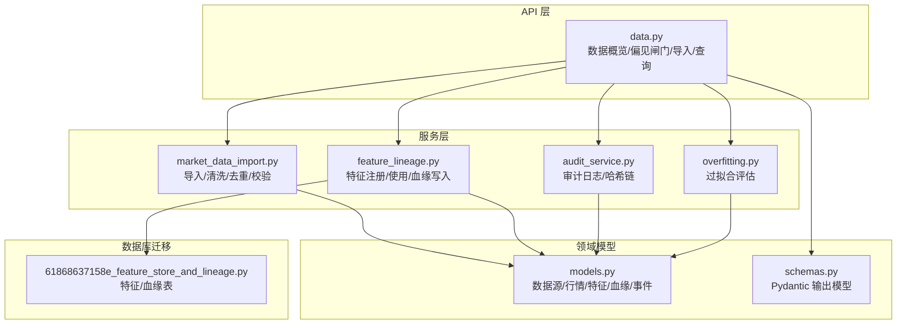
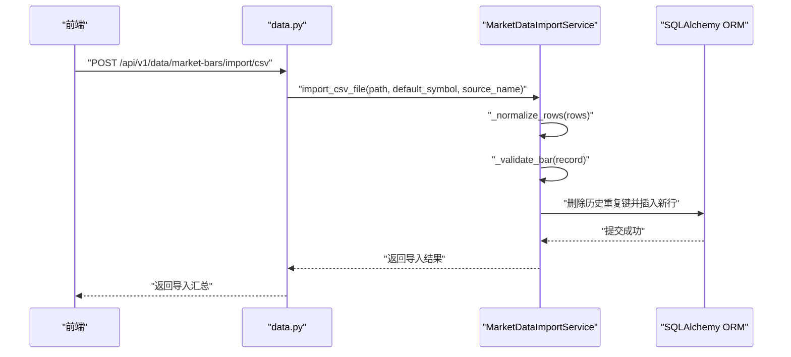
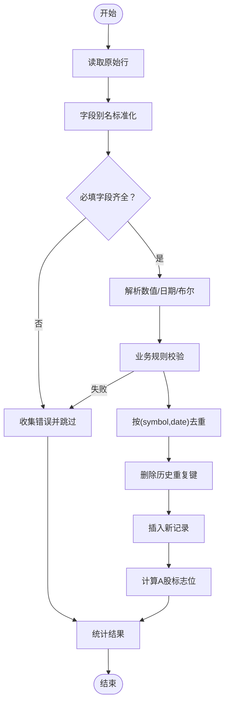
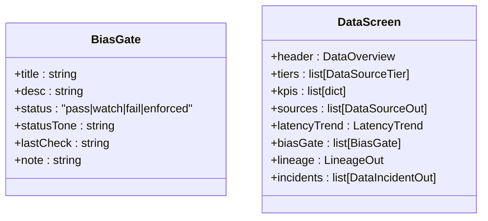
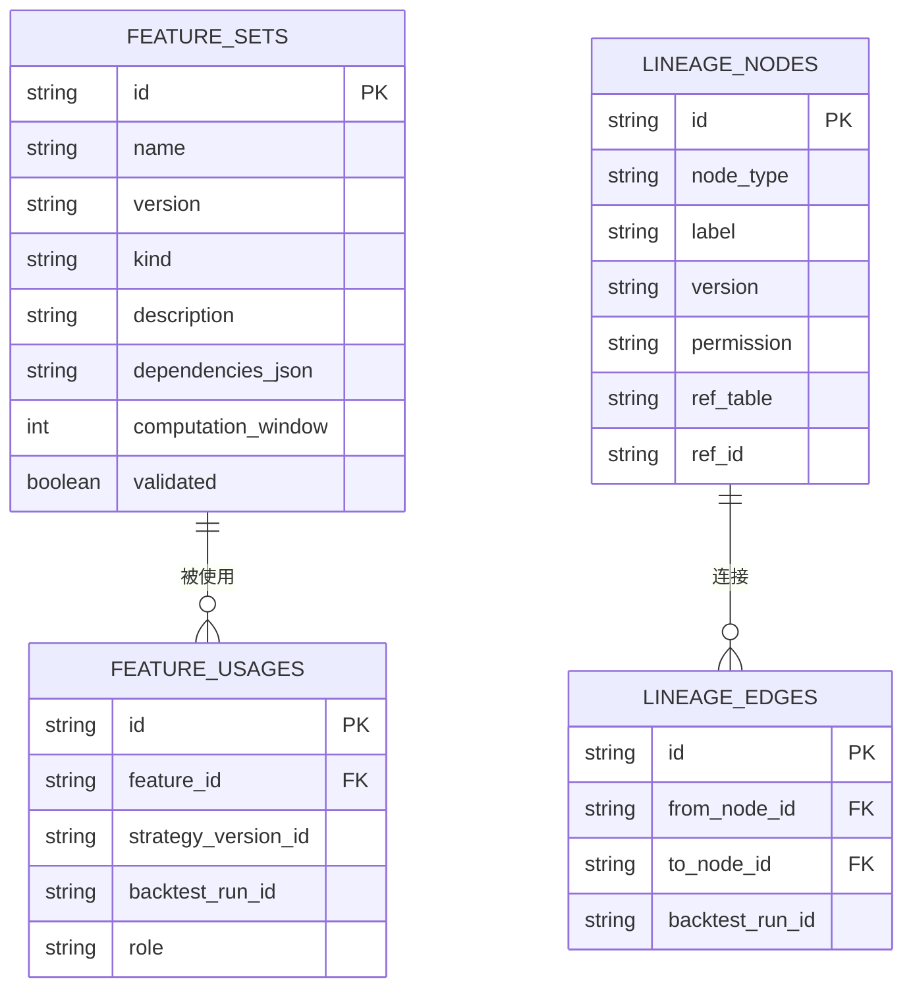
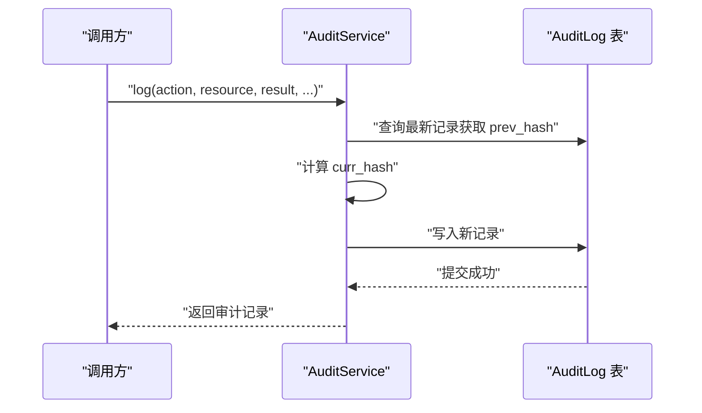
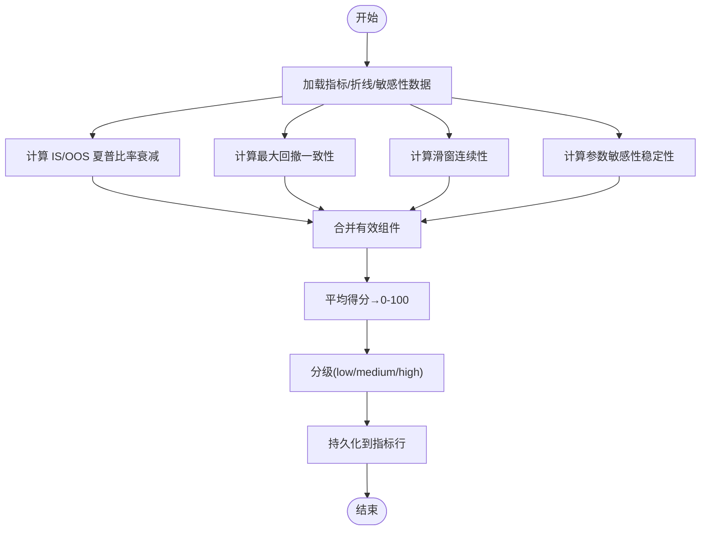
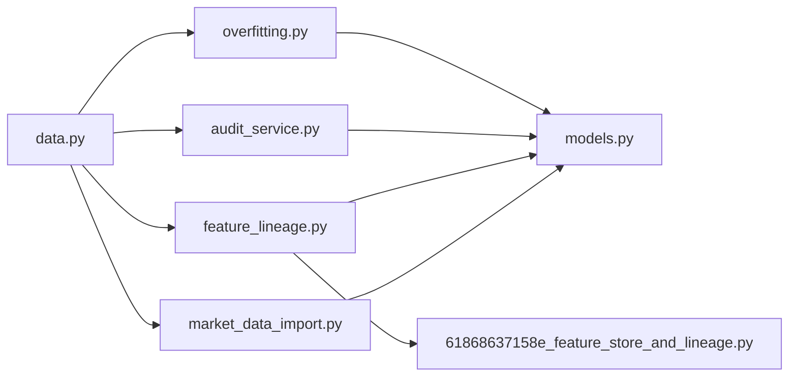

# 数据清洗与验证

<cite>
**本文引用的文件**
- [backend/README.md](file://backend/README.md)
- [pyproject.toml](file://backend/pyproject.toml)
- [data.py](file://backend/app/api/v1/data.py)
- [market_data_import.py](file://backend/app/services/market_data_import.py)
- [models.py](file://backend/app/domains/data/models.py)
- [schemas.py](file://backend/app/domains/data/schemas.py)
- [test_market_data_import.py](file://backend/tests/services/test_market_data_import.py)
- [test_api_market_data_import.py](file://backend/tests/api/test_market_data_import.py)
- [feature_lineage.py](file://backend/app/services/feature_lineage.py)
- [audit_service.py](file://backend/app/services/audit_service.py)
- [overfitting.py](file://backend/app/services/overfitting.py)
- [61868637158e_feature_store_and_lineage.py](file://backend/app/db/migrations/versions/61868637158e_feature_store_and_lineage.py)
- [03-核心模块设计.md](file://doc/03-核心模块设计.md)
</cite>

## 目录
1. [简介](#简介)
2. [项目结构](#项目结构)
3. [核心组件](#核心组件)
4. [架构总览](#架构总览)
5. [详细组件分析](#详细组件分析)
6. [依赖关系分析](#依赖关系分析)
7. [性能考量](#性能考量)
8. [故障排查指南](#故障排查指南)
9. [结论](#结论)
10. [附录](#附录)

## 简介
本技术文档面向“数据清洗与验证系统”，围绕数据质量检查规则、缺失值处理策略、异常值检测算法与数据一致性验证机制进行系统化阐述，并重点说明“偏见检测门（Bias Gates）”的工作原理，包括未来函数检测、幸存者偏差检查、数据完整性验证与及时性监控。文档同时提供数据清洗流程图、验证规则配置与质量控制指标，帮助开发者建立可靠的数据质量保障体系。

## 项目结构
后端采用 FastAPI + SQLAlchemy 异步 ORM 架构，数据域（domains/data）定义了数据源、行情、特征集、血缘与事件等核心模型；服务层（services）提供导入、血缘与过拟合评估等能力；API 层（api/v1/data.py）暴露数据概览、偏见闸门、血缘查询与市场数据导入等接口；测试覆盖服务与 API 的关键路径。

图表来源
- [data.py:1-392](file://backend/app/api/v1/data.py#L1-L392)
- [market_data_import.py:1-426](file://backend/app/services/market_data_import.py#L1-L426)
- [feature_lineage.py:1-217](file://backend/app/services/feature_lineage.py#L1-L217)
- [audit_service.py:1-109](file://backend/app/services/audit_service.py#L1-L109)
- [overfitting.py:1-167](file://backend/app/services/overfitting.py#L1-L167)
- [models.py:1-144](file://backend/app/domains/data/models.py#L1-L144)
- [schemas.py:1-194](file://backend/app/domains/data/schemas.py#L1-L194)
- [61868637158e_feature_store_and_lineage.py:1-111](file://backend/app/db/migrations/versions/61868637158e_feature_store_and_lineage.py#L1-L111)

章节来源
- [backend/README.md:1-45](file://backend/README.md#L1-L45)
- [pyproject.toml:1-78](file://backend/pyproject.toml#L1-L78)

## 核心组件
- 数据清洗与导入服务：负责 CSV/AKShare 数据读取、标准化、去重、替换更新、字段校验与 A 股特有标志位计算。
- 数据质量偏见闸门：在 API 层以静态配置形式展示未来函数检测、幸存者偏差、数据完整性、及时性与一致性检查的状态。
- 特征存储与血缘：提供特征集注册、使用记录与回测运行的血缘链路持久化。
- 审计与可追溯：基于 SHA-256 的审计日志链式校验，确保数据操作不可篡改。
- 过拟合评估：基于 IS/OOS 分割、滑窗连续性、参数敏感性等维度的综合评分。

章节来源
- [market_data_import.py:177-426](file://backend/app/services/market_data_import.py#L177-L426)
- [data.py:96-102](file://backend/app/api/v1/data.py#L96-L102)
- [feature_lineage.py:41-194](file://backend/app/services/feature_lineage.py#L41-L194)
- [audit_service.py:32-109](file://backend/app/services/audit_service.py#L32-L109)
- [overfitting.py:29-167](file://backend/app/services/overfitting.py#L29-L167)

## 架构总览
下图展示了从 API 请求到服务执行再到数据库落库的整体流程，以及偏见闸门状态如何在前端呈现。

图表来源
- [data.py:155-191](file://backend/app/api/v1/data.py#L155-L191)
- [market_data_import.py:177-242](file://backend/app/services/market_data_import.py#L177-L242)

章节来源
- [data.py:134-191](file://backend/app/api/v1/data.py#L134-L191)
- [market_data_import.py:177-242](file://backend/app/services/market_data_import.py#L177-L242)

## 详细组件分析

### 数据清洗与验证服务
该服务承担 CSV/AKShare 数据导入、标准化、清洗与持久化的职责，包含以下关键步骤：
- 字段别名映射与标准化：将不同来源的列名统一为内部标准字段集合。
- 必填字段校验：要求 symbol、trade_date、open、high、low、close、volume 等字段存在且非空。
- 数值解析与合法性校验：对数值字段进行浮点转换、正数约束、范围约束与有限性检查。
- 时间格式规范化：兼容多种日期输入格式，统一输出 ISO 日期字符串。
- 去重与替换更新：按 symbol+trade_date 去重，若历史存在则先删除再插入。
- A 股特有标志位计算：前收价、涨跌停价格与是否涨停/跌停、是否停牌、买卖权限等。
- 结果统计：返回导入总量、有效导入量、新增量、更新量、跳过量、错误列表与时间范围。

图表来源
- [market_data_import.py:243-422](file://backend/app/services/market_data_import.py#L243-L422)

章节来源
- [market_data_import.py:177-426](file://backend/app/services/market_data_import.py#L177-L426)
- [test_market_data_import.py:25-134](file://backend/tests/services/test_market_data_import.py#L25-L134)

### 偏见检测门（Bias Gates）
偏见闸门在 API 层以静态配置的形式展示多项数据质量检查的状态，包括：
- 未来函数检测：检查特征计算是否使用未来数据。
- 幸存者偏差：检查是否排除已退市股票（ST/退市标记）。
- 数据完整性：检查关键字段缺失率。
- 数据及时性：检查行情延迟是否在 SLA 内。
- 数据一致性：交叉验证多源数据一致性。

这些状态由后端接口直接返回，前端根据状态色与图标直观呈现。

图表来源
- [schemas.py:43-50](file://backend/app/domains/data/schemas.py#L43-L50)
- [data.py:134-146](file://backend/app/api/v1/data.py#L134-L146)

章节来源
- [data.py:96-102](file://backend/app/api/v1/data.py#L96-L102)
- [schemas.py:43-50](file://backend/app/domains/data/schemas.py#L43-L50)

### 特征存储与数据血缘
特征存储用于登记每个特征的元信息（名称、版本、类型、描述、依赖与计算窗口），并通过使用表与策略版本关联；血缘系统记录从原始数据到特征、策略与运行的链路，便于审计与溯源。

图表来源
- [feature_lineage.py:41-194](file://backend/app/services/feature_lineage.py#L41-L194)
- [61868637158e_feature_store_and_lineage.py:50-92](file://backend/app/db/migrations/versions/61868637158e_feature_store_and_lineage.py#L50-L92)

章节来源
- [feature_lineage.py:41-194](file://backend/app/services/feature_lineage.py#L41-L194)
- [61868637158e_feature_store_and_lineage.py:1-111](file://backend/app/db/migrations/versions/61868637158e_feature_store_and_lineage.py#L1-L111)

### 审计与可追溯
审计服务以 SHA-256 构建不可篡改的链式日志，每条记录包含演员、动作、资源、结果、时间戳与前一哈希，支持链式校验。

图表来源
- [audit_service.py:32-82](file://backend/app/services/audit_service.py#L32-L82)

章节来源
- [audit_service.py:32-109](file://backend/app/services/audit_service.py#L32-L109)

### 过拟合评估
过拟合评估基于多个信号（IS/OOS 夏普比率衰减、最大回撤一致性、滑窗训练→测试连续性、参数敏感性稳定性）综合打分，形成 0–100 的分数与等级。

图表来源
- [overfitting.py:129-167](file://backend/app/services/overfitting.py#L129-L167)

章节来源
- [overfitting.py:29-167](file://backend/app/services/overfitting.py#L29-L167)
- [03-核心模块设计.md:296-327](file://doc/03-核心模块设计.md#L296-L327)

## 依赖关系分析
- API 层依赖服务层与领域模型；服务层依赖 SQLAlchemy 异步会话与领域模型；特征血缘依赖数据库迁移脚本创建的表结构。
- 导入服务对 CSV/AKShare 的依赖通过可选安装实现，未安装时抛出明确错误提示。
- 偏见闸门状态与前端展示解耦，前端仅消费 API 返回的结构化数据。

图表来源
- [data.py:1-44](file://backend/app/api/v1/data.py#L1-L44)
- [market_data_import.py:1-20](file://backend/app/services/market_data_import.py#L1-L20)
- [feature_lineage.py:1-25](file://backend/app/services/feature_lineage.py#L1-L25)
- [audit_service.py:1-16](file://backend/app/services/audit_service.py#L1-L16)
- [overfitting.py:1-27](file://backend/app/services/overfitting.py#L1-L27)
- [models.py:1-144](file://backend/app/domains/data/models.py#L1-L144)
- [61868637158e_feature_store_and_lineage.py:1-111](file://backend/app/db/migrations/versions/61868637158e_feature_store_and_lineage.py#L1-L111)

章节来源
- [pyproject.toml:7-27](file://backend/pyproject.toml#L7-L27)

## 性能考量
- 导入阶段的去重与替换更新涉及批量查询与删除，建议在 symbol 与 trade_date 上建立索引以提升匹配效率。
- 行情表的唯一约束（symbol+trade_date）可避免重复写入，减少后续清洗成本。
- 对于大规模数据导入，建议分批处理与异步写入，结合数据库事务与 flush 策略降低锁竞争。
- 偏见闸门状态为静态配置，前端渲染开销低；如需动态计算，应考虑缓存与限流策略。

## 故障排查指南
- 导入失败（400）：检查 CSV/AKShare 提供器是否可用、必填字段是否齐全、数值格式是否合法。
- 文件不存在（404）：确认本地 CSV 路径正确或 AKShare 可访问。
- 行情异常：关注涨跌停、停牌、买卖权限等标志位是否符合预期，必要时检查前收价与基准比例。
- 血缘缺失：确认特征注册、使用记录与回测运行 ID 是否正确写入，节点与边是否成链。
- 审计链断裂：使用审计服务提供的链式校验方法定位首个破坏点。

章节来源
- [data.py:168-191](file://backend/app/api/v1/data.py#L168-L191)
- [market_data_import.py:122-157](file://backend/app/services/market_data_import.py#L122-L157)
- [feature_lineage.py:100-194](file://backend/app/services/feature_lineage.py#L100-L194)
- [audit_service.py:83-109](file://backend/app/services/audit_service.py#L83-L109)

## 结论
本系统通过“导入即清洗”的策略，将缺失值处理、异常值检测与 A 股特有规则内置在导入流程中；偏见闸门提供可读性强的质量状态视图；特征存储与血缘保证可追溯性；审计链提供不可篡改的可追溯证据；过拟合评估提供稳健的回测质量度量。上述机制共同构成一套完整的数据质量保障体系，适用于量化研究与回测场景。

## 附录
- 验证规则配置要点
  - 必填字段：symbol、trade_date、open、high、low、close、volume。
  - 数值约束：open/high/low/close/amount/adjusted_close 必须为有限正值；volume 非负；low ≤ high；open/close 不得偏离 high/low。
  - 日期格式：统一为 ISO 日期字符串；支持多种常见格式输入。
  - 去重策略：按 (symbol, trade_date) 去重，保留最新记录并替换历史重复键。
  - A 股标志位：基于前收价计算涨跌停价格与是否涨停/跌停、是否停牌、买卖权限。
- 质量控制指标
  - 缺失率：关键字段缺失占比。
  - 延迟：P95 延迟与 SLA 对比。
  - 漂移分：跨源一致性偏差评分。
  - 事件：24 小时内数据事件数量与严重程度。

章节来源
- [market_data_import.py:90-105](file://backend/app/services/market_data_import.py#L90-L105)
- [market_data_import.py:389-403](file://backend/app/services/market_data_import.py#L389-L403)
- [data.py:46-131](file://backend/app/api/v1/data.py#L46-L131)