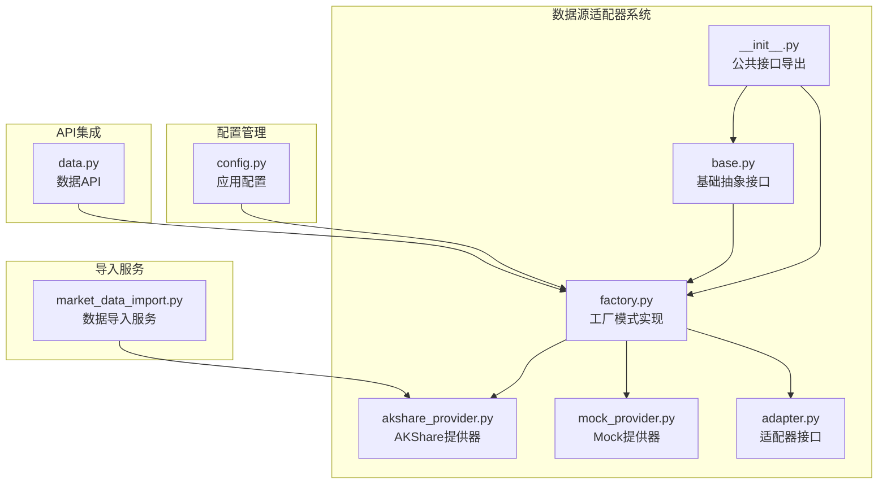
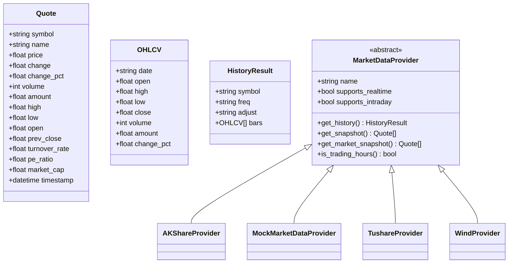
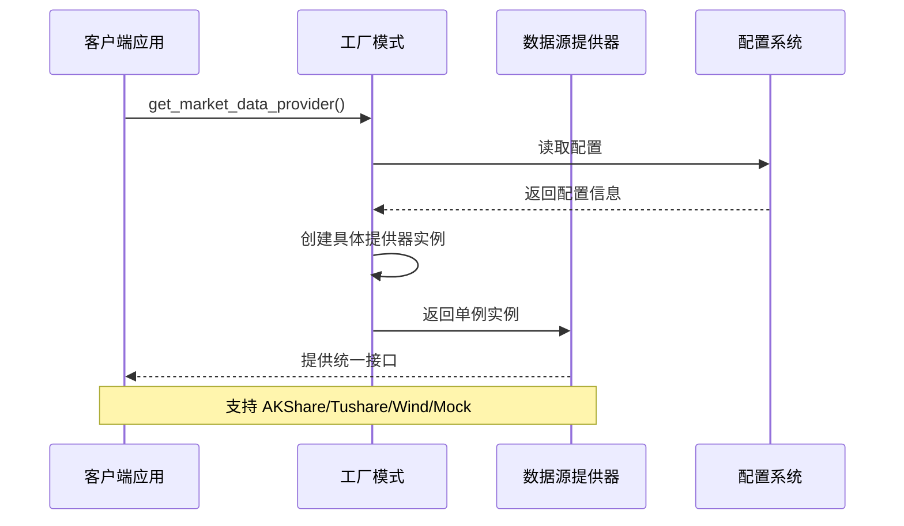
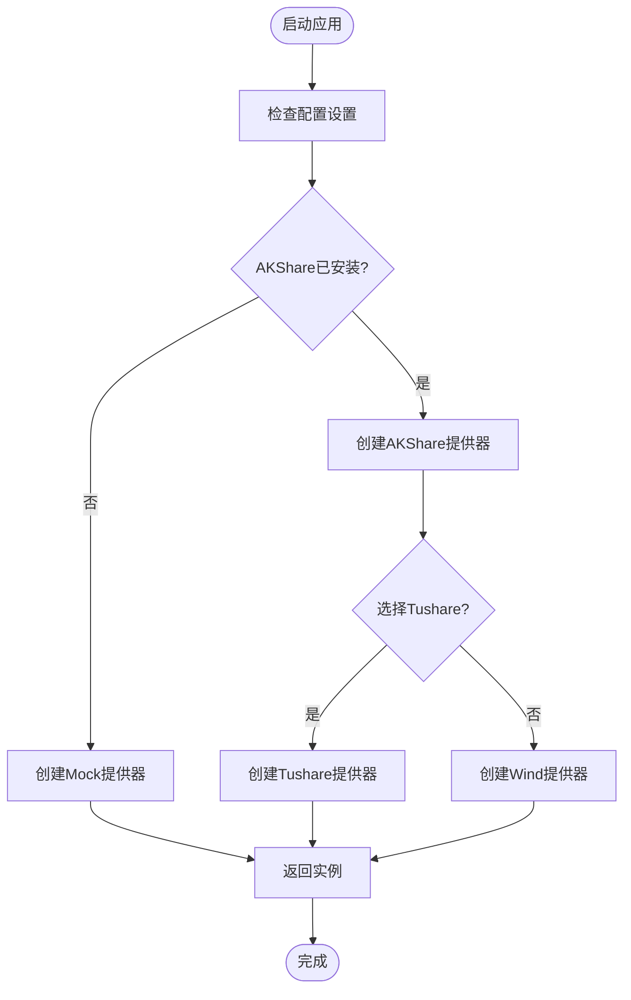
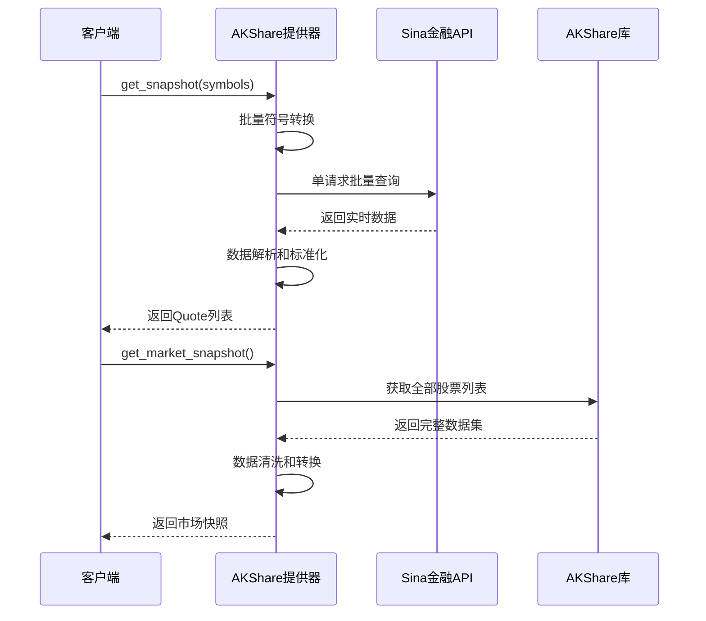
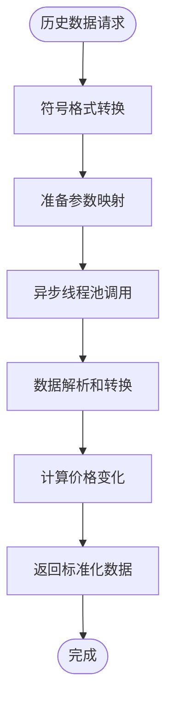
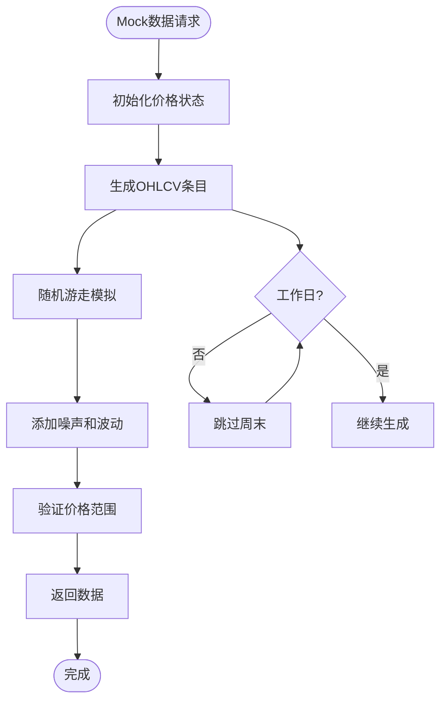
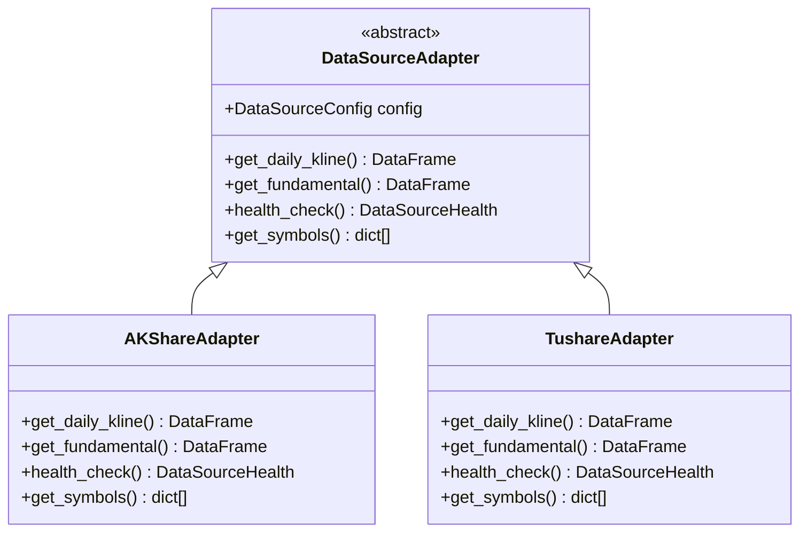
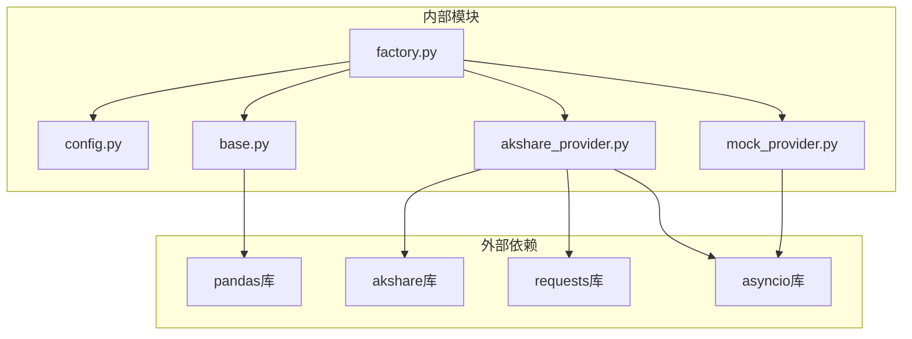
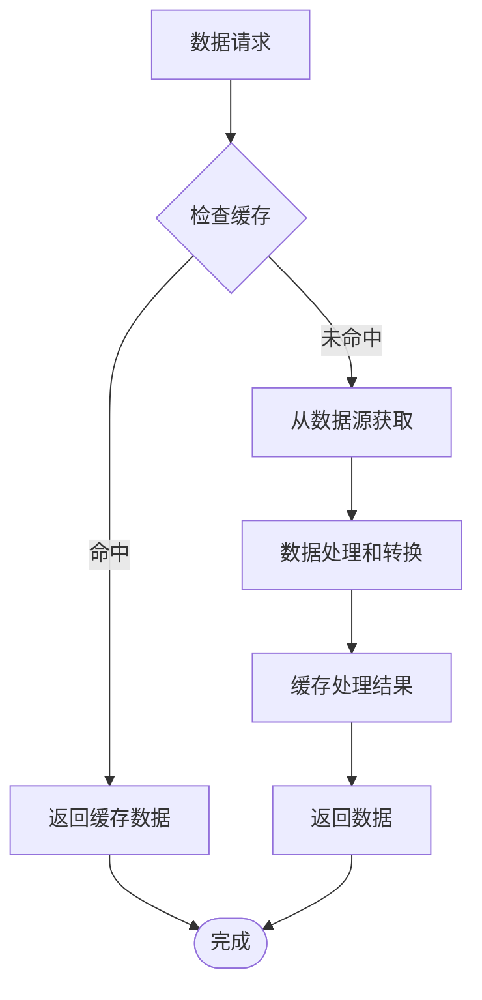

# 数据源适配器

<cite>
**本文档引用的文件**
- [adapter.py](file://backend/app/integrations/market_data/adapter.py)
- [base.py](file://backend/app/integrations/market_data/base.py)
- [factory.py](file://backend/app/integrations/market_data/factory.py)
- [akshare_provider.py](file://backend/app/integrations/market_data/akshare_provider.py)
- [mock_provider.py](file://backend/app/integrations/market_data/mock_provider.py)
- [config.py](file://backend/app/core/config.py)
- [data.py](file://backend/app/api/v1/data.py)
- [market_data_import.py](file://backend/app/services/market_data_import.py)
- [__init__.py](file://backend/app/integrations/market_data/__init__.py)
</cite>

## 目录
1. [简介](#简介)
2. [项目结构](#项目结构)
3. [核心组件](#核心组件)
4. [架构概览](#架构概览)
5. [详细组件分析](#详细组件分析)
6. [依赖关系分析](#依赖关系分析)
7. [性能考虑](#性能考虑)
8. [故障排除指南](#故障排除指南)
9. [结论](#结论)

## 简介

数据源适配器系统是一个高度模块化的市场数据获取框架，旨在为量化交易应用提供统一的数据访问接口。该系统通过抽象接口设计、工厂模式实现和多数据源统一接入机制，支持多种数据源提供商（AKShare、Tushare、Wind等）的无缝切换。

系统的核心设计理念是：
- **抽象化**：通过统一的接口定义所有数据源的共同能力
- **可扩展性**：轻松添加新的数据源提供商
- **容错性**：自动降级到备用数据源
- **性能优化**：异步处理和批量操作

## 项目结构

数据源适配器系统位于 `backend/app/integrations/market_data/` 目录下，采用清晰的模块化组织：

**图表来源**
- [base.py:1-113](file://backend/app/integrations/market_data/base.py#L1-L113)
- [factory.py:1-57](file://backend/app/integrations/market_data/factory.py#L1-L57)
- [config.py:80-86](file://backend/app/core/config.py#L80-L86)

**章节来源**
- [base.py:1-113](file://backend/app/integrations/market_data/base.py#L1-L113)
- [factory.py:1-57](file://backend/app/integrations/market_data/factory.py#L1-L57)
- [config.py:80-86](file://backend/app/core/config.py#L80-L86)

## 核心组件

### 数据模型层

系统定义了三个核心数据模型，用于标准化不同数据源返回的数据格式：

**图表来源**
- [base.py:17-113](file://backend/app/integrations/market_data/base.py#L17-L113)

### 配置管理

系统通过集中式配置管理支持多数据源切换：

| 配置项 | 默认值 | 描述 |
|--------|--------|------|
| `market_data_provider` | `"akshare"` | 当前启用的数据源提供商 |
| `market_data_poll_interval` | `3` | 实时报价轮询间隔（秒） |
| `tushare_token` | `None` | Tushare API 访问令牌 |

**章节来源**
- [config.py:80-86](file://backend/app/core/config.py#L80-L86)

## 架构概览

数据源适配器系统采用工厂模式实现，提供统一的接口给上层服务调用：

**图表来源**
- [factory.py:23-56](file://backend/app/integrations/market_data/factory.py#L23-L56)
- [config.py:80-86](file://backend/app/core/config.py#L80-L86)

## 详细组件分析

### 工厂模式实现

工厂模式是系统的核心设计模式，负责根据配置选择合适的数据源提供器：

**图表来源**
- [factory.py:23-56](file://backend/app/integrations/market_data/factory.py#L23-L56)

#### 工厂模式优势

1. **单一职责**：专门负责对象创建逻辑
2. **可扩展性**：轻松添加新的数据源提供商
3. **容错性**：自动降级机制
4. **配置驱动**：通过环境变量控制数据源选择

**章节来源**
- [factory.py:1-57](file://backend/app/integrations/market_data/factory.py#L1-L57)

### AKShare提供器实现

AKShare提供器是最完整的实现，支持实时和历史数据获取：

#### 实时数据获取策略

**图表来源**
- [akshare_provider.py:206-261](file://backend/app/integrations/market_data/akshare_provider.py#L206-L261)

#### 历史数据获取策略

AKShare提供器使用异步线程池处理阻塞的同步API调用：

**图表来源**
- [akshare_provider.py:152-204](file://backend/app/integrations/market_data/akshare_provider.py#L152-L204)

**章节来源**
- [akshare_provider.py:1-262](file://backend/app/integrations/market_data/akshare_provider.py#L1-L262)

### Mock提供器实现

Mock提供器用于开发和测试环境，生成确定性的合成数据：

#### 数据生成算法

**图表来源**
- [mock_provider.py:40-76](file://backend/app/integrations/market_data/mock_provider.py#L40-L76)

**章节来源**
- [mock_provider.py:1-109](file://backend/app/integrations/market_data/mock_provider.py#L1-L109)

### 适配器接口设计

适配器模式提供了额外的抽象层，支持不同的数据源类型：

**图表来源**
- [adapter.py:34-115](file://backend/app/integrations/market_data/adapter.py#L34-L115)

**章节来源**
- [adapter.py:1-115](file://backend/app/integrations/market_data/adapter.py#L1-L115)

## 依赖关系分析

系统采用松耦合的设计，主要依赖关系如下：

**图表来源**
- [akshare_provider.py:25-28](file://backend/app/integrations/market_data/akshare_provider.py#L25-L28)
- [factory.py:14-17](file://backend/app/integrations/market_data/factory.py#L14-L17)

### 错误处理机制

系统实现了多层次的错误处理：

1. **导入时错误**：检测AKShare库是否可用
2. **运行时错误**：网络请求失败时的降级处理
3. **数据验证**：确保返回数据的完整性
4. **配置验证**：验证必需的配置参数

**章节来源**
- [factory.py:32-39](file://backend/app/integrations/market_data/factory.py#L32-L39)

## 性能考虑

### 异步处理优化

系统广泛使用异步编程模式来提高性能：

- **批量API调用**：Sina金融API支持单请求批量查询
- **线程池隔离**：将阻塞的同步调用放入异步线程池
- **内存优化**：使用pandas进行高效的数据处理

### 缓存策略

### 并发控制

系统通过以下机制控制并发：

- **连接池管理**：限制同时进行的网络请求数量
- **超时控制**：为每个请求设置合理的超时时间
- **重试机制**：对临时性错误进行自动重试

## 故障排除指南

### 常见问题诊断

#### 数据源不可用

**症状**：应用启动时报错或数据获取失败

**解决方案**：
1. 检查 `MARKET_DATA_PROVIDER` 配置
2. 验证所需的Python包是否正确安装
3. 查看应用日志中的警告信息

#### 网络连接问题

**症状**：实时数据获取超时或失败

**解决方案**：
1. 检查网络连接状态
2. 验证API密钥的有效性
3. 调整超时和重试参数

#### 数据质量异常

**症状**：返回的数据格式不正确或包含异常值

**解决方案**：
1. 检查数据源的API响应格式
2. 验证数据验证规则
3. 查看数据清洗过程的日志

**章节来源**
- [factory.py:36-39](file://backend/app/integrations/market_data/factory.py#L36-L39)

## 结论

数据源适配器系统通过精心设计的架构实现了以下目标：

1. **统一接口**：为上层应用提供一致的数据访问体验
2. **灵活扩展**：支持轻松添加新的数据源提供商
3. **高可用性**：内置的降级和容错机制
4. **高性能**：异步处理和优化的数据获取策略

该系统为量化交易应用提供了坚实的数据基础设施，支持从开发测试到生产环境的各种场景需求。通过遵循现有的设计模式和最佳实践，开发者可以轻松地扩展和维护这个数据源适配器系统。