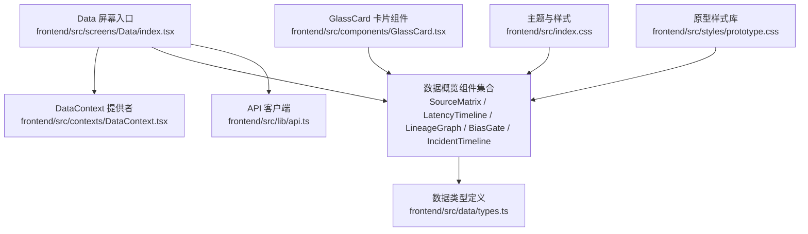
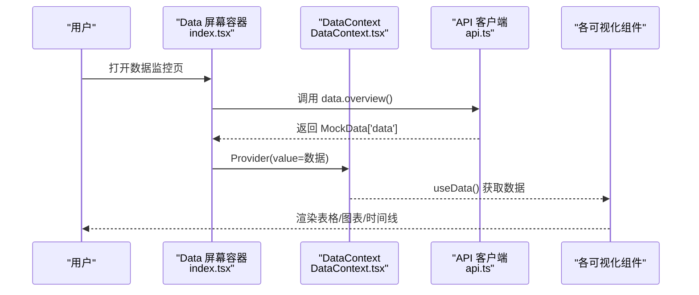
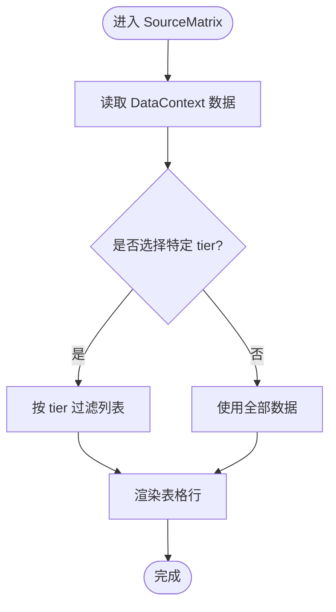
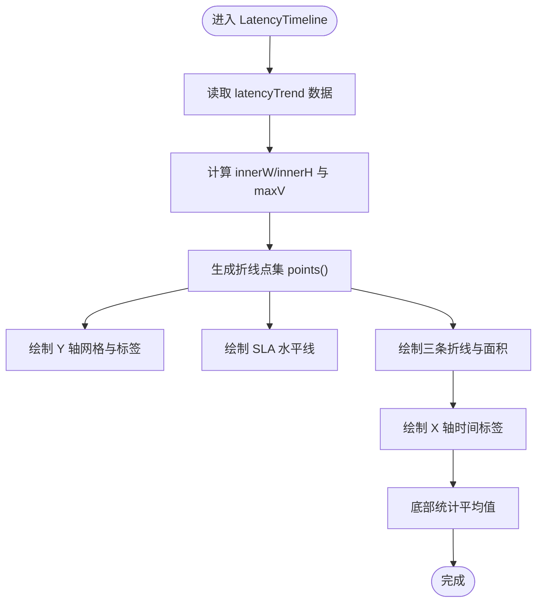
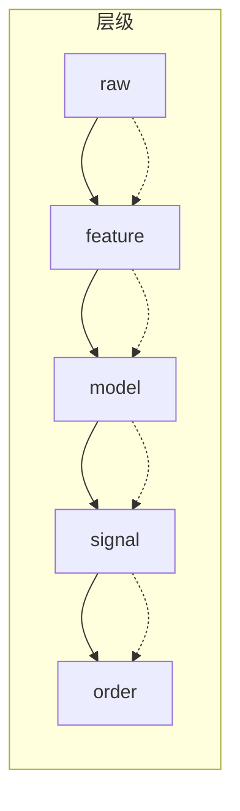
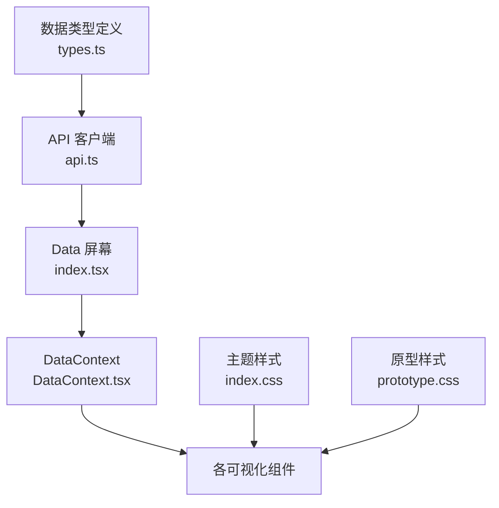

# 数据监控仪表板

<cite>
**本文档引用的文件**
- [frontend/src/screens/Data/index.tsx](file://frontend/src/screens/Data/index.tsx)
- [frontend/src/screens/Data/SourceMatrix.tsx](file://frontend/src/screens/Data/SourceMatrix.tsx)
- [frontend/src/screens/Data/BiasGate.tsx](file://frontend/src/screens/Data/BiasGate.tsx)
- [frontend/src/screens/Data/IncidentTimeline.tsx](file://frontend/src/screens/Data/IncidentTimeline.tsx)
- [frontend/src/screens/Data/LatencyTimeline.tsx](file://frontend/src/screens/Data/LatencyTimeline.tsx)
- [frontend/src/screens/Data/LineageGraph.tsx](file://frontend/src/screens/Data/LineageGraph.tsx)
- [frontend/src/contexts/DataContext.tsx](file://frontend/src/contexts/DataContext.tsx)
- [frontend/src/data/types.ts](file://frontend/src/data/types.ts)
- [frontend/src/lib/api.ts](file://frontend/src/lib/api.ts)
- [frontend/src/components/GlassCard.tsx](file://frontend/src/components/GlassCard.tsx)
- [frontend/src/index.css](file://frontend/src/index.css)
- [frontend/src/styles/prototype.css](file://frontend/src/styles/prototype.css)
</cite>

## 目录
1. [简介](#简介)
2. [项目结构](#项目结构)
3. [核心组件](#核心组件)
4. [架构总览](#架构总览)
5. [详细组件分析](#详细组件分析)
6. [依赖关系分析](#依赖关系分析)
7. [性能考虑](#性能考虑)
8. [故障排查指南](#故障排查指南)
9. [结论](#结论)
10. [附录](#附录)

## 简介
本文件面向前端开发者，系统性梳理数据监控仪表板的前端实现，重点覆盖数据概览界面、数据源矩阵、偏见检测面板、事件时间线与延迟趋势图等可视化组件。内容涵盖：
- 组件职责与数据流
- 数据指标计算逻辑与来源
- 实时数据更新机制（基于现有代码的可扩展建议）
- 用户交互设计与响应式布局
- 图表组件配置选项、数据绑定方式与样式体系

## 项目结构
数据监控相关页面位于前端目录的 Data 屏幕下，采用上下文提供者模式注入数据，并通过自定义 GlassCard 卡片组件统一风格。

**图表来源**
- [frontend/src/screens/Data/index.tsx:1-45](file://frontend/src/screens/Data/index.tsx#L1-L45)
- [frontend/src/contexts/DataContext.tsx:1-13](file://frontend/src/contexts/DataContext.tsx#L1-L13)
- [frontend/src/data/types.ts:387-472](file://frontend/src/data/types.ts#L387-L472)
- [frontend/src/lib/api.ts:705-719](file://frontend/src/lib/api.ts#L705-L719)
- [frontend/src/components/GlassCard.tsx:1-49](file://frontend/src/components/GlassCard.tsx#L1-L49)
- [frontend/src/index.css:1-24](file://frontend/src/index.css#L1-L24)
- [frontend/src/styles/prototype.css:1-800](file://frontend/src/styles/prototype.css#L1-L800)

**章节来源**
- [frontend/src/screens/Data/index.tsx:1-45](file://frontend/src/screens/Data/index.tsx#L1-L45)
- [frontend/src/contexts/DataContext.tsx:1-13](file://frontend/src/contexts/DataContext.tsx#L1-L13)
- [frontend/src/data/types.ts:387-472](file://frontend/src/data/types.ts#L387-L472)
- [frontend/src/lib/api.ts:705-719](file://frontend/src/lib/api.ts#L705-L719)
- [frontend/src/components/GlassCard.tsx:1-49](file://frontend/src/components/GlassCard.tsx#L1-L49)
- [frontend/src/index.css:1-24](file://frontend/src/index.css#L1-L24)
- [frontend/src/styles/prototype.css:1-800](file://frontend/src/styles/prototype.css#L1-L800)

## 核心组件
- 数据概览容器：负责拉取数据并渲染子组件，使用 DataContext 注入数据。
- 数据源矩阵：按层级过滤展示数据源健康度与关键指标。
- 偏见检测面板：集中展示许可与偏见检查结果的状态与描述。
- 事件时间线：以时间轴形式呈现各类数据事件的严重程度、类型与状态。
- 延迟趋势图：多层级折线面积图展示 24 小时延迟趋势与 SLA 阈值。
- 数据血缘图：节点分层布局展示从原始到订单的数据流转关系。

**章节来源**
- [frontend/src/screens/Data/index.tsx:17-44](file://frontend/src/screens/Data/index.tsx#L17-L44)
- [frontend/src/screens/Data/SourceMatrix.tsx:19-111](file://frontend/src/screens/Data/SourceMatrix.tsx#L19-L111)
- [frontend/src/screens/Data/BiasGate.tsx:17-58](file://frontend/src/screens/Data/BiasGate.tsx#L17-L58)
- [frontend/src/screens/Data/IncidentTimeline.tsx:25-77](file://frontend/src/screens/Data/IncidentTimeline.tsx#L25-L77)
- [frontend/src/screens/Data/LatencyTimeline.tsx:10-128](file://frontend/src/screens/Data/LatencyTimeline.tsx#L10-L128)
- [frontend/src/screens/Data/LineageGraph.tsx:24-137](file://frontend/src/screens/Data/LineageGraph.tsx#L24-L137)

## 架构总览
前端采用“屏幕容器 + 上下文 + 组件”的分层架构：
- 屏幕容器负责生命周期与数据拉取
- 上下文提供者注入全局数据
- 组件专注单一职责与可复用样式

**图表来源**
- [frontend/src/screens/Data/index.tsx:17-44](file://frontend/src/screens/Data/index.tsx#L17-L44)
- [frontend/src/contexts/DataContext.tsx:1-13](file://frontend/src/contexts/DataContext.tsx#L1-L13)
- [frontend/src/lib/api.ts:705-719](file://frontend/src/lib/api.ts#L705-L719)

**章节来源**
- [frontend/src/screens/Data/index.tsx:17-44](file://frontend/src/screens/Data/index.tsx#L17-L44)
- [frontend/src/contexts/DataContext.tsx:1-13](file://frontend/src/contexts/DataContext.tsx#L1-L13)
- [frontend/src/lib/api.ts:705-719](file://frontend/src/lib/api.ts#L705-L719)

## 详细组件分析

### 数据概览容器（Data 屏幕）
- 负责在挂载时调用 API 获取数据概览，并在加载完成后通过 DataContext 提供数据。
- 子组件通过 useData() 访问数据，避免重复请求与跨层传递。

**章节来源**
- [frontend/src/screens/Data/index.tsx:17-44](file://frontend/src/screens/Data/index.tsx#L17-L44)
- [frontend/src/contexts/DataContext.tsx:1-13](file://frontend/src/contexts/DataContext.tsx#L1-L13)
- [frontend/src/lib/api.ts:705-719](file://frontend/src/lib/api.ts#L705-L719)

### 数据源矩阵（SourceMatrix）
- 支持按 tier 过滤（全部/研究/模拟/实盘），统计各 tier 数量。
- 表格列包含：名称/提供商、类型、覆盖范围、延迟 P50/P95、缺失率、漂移分数、许可等级、状态、最后更新时间。
- 状态与颜色通过 statusTone 与 tierTone 映射，P95 超过阈值且非研究 tier 时高亮警告。

**图表来源**
- [frontend/src/screens/Data/SourceMatrix.tsx:19-111](file://frontend/src/screens/Data/SourceMatrix.tsx#L19-L111)

**章节来源**
- [frontend/src/screens/Data/SourceMatrix.tsx:19-111](file://frontend/src/screens/Data/SourceMatrix.tsx#L19-L111)
- [frontend/src/data/types.ts:416-432](file://frontend/src/data/types.ts#L416-L432)

### 偏见检测面板（BiasGate）
- 展示多项偏见与许可检查项，按状态（通过/关注/失败/强制）分类统计。
- 每条记录包含标题、描述、备注与最近检查时间，支持查看规则按钮。

**章节来源**
- [frontend/src/screens/Data/BiasGate.tsx:17-58](file://frontend/src/screens/Data/BiasGate.tsx#L17-L58)
- [frontend/src/data/types.ts:440-447](file://frontend/src/data/types.ts#L440-L447)

### 事件时间线（IncidentTimeline）
- 以时间轴卡片形式展示事件，标注严重程度、类型、状态与详情。
- 支持导出周报按钮；根据状态（处理中/复核中/已解决）进行统计提示。

**章节来源**
- [frontend/src/screens/Data/IncidentTimeline.tsx:25-77](file://frontend/src/screens/Data/IncidentTimeline.tsx#L25-L77)
- [frontend/src/data/types.ts:459-471](file://frontend/src/data/types.ts#L459-L471)

### 延迟趋势图（LatencyTimeline）
- 使用 SVG 绘制三层延迟曲线（研究/模拟/实盘）与面积填充，叠加 SLA 水平线。
- 计算坐标点时考虑内边距与最大值归一化，X 轴仅显示部分时间标签。
- 底部统计三类平均延迟值。

**图表来源**
- [frontend/src/screens/Data/LatencyTimeline.tsx:10-128](file://frontend/src/screens/Data/LatencyTimeline.tsx#L10-L128)

**章节来源**
- [frontend/src/screens/Data/LatencyTimeline.tsx:10-128](file://frontend/src/screens/Data/LatencyTimeline.tsx#L10-L128)
- [frontend/src/data/types.ts:433-439](file://frontend/src/data/types.ts#L433-L439)

### 数据血缘图（LineageGraph）
- 节点按 tier 分组（raw → feature → model → signal → order）水平排列，垂直居中或按数量等距分布。
- 边采用曲线连接，带箭头与渐变色，节点卡片包含标签、权限与版本信息。

**图表来源**
- [frontend/src/screens/Data/LineageGraph.tsx:24-137](file://frontend/src/screens/Data/LineageGraph.tsx#L24-L137)

**章节来源**
- [frontend/src/screens/Data/LineageGraph.tsx:24-137](file://frontend/src/screens/Data/LineageGraph.tsx#L24-L137)
- [frontend/src/data/types.ts:448-458](file://frontend/src/data/types.ts#L448-L458)

### 通用卡片组件（GlassCard）
- 提供统一的卡片头部（标题/副标题/操作）、点击态与发光效果开关，支持自定义类名与内边距控制。
- 适用于所有卡片型组件的外观一致性。

**章节来源**
- [frontend/src/components/GlassCard.tsx:14-48](file://frontend/src/components/GlassCard.tsx#L14-L48)

## 依赖关系分析
- 屏幕容器依赖 API 客户端与 DataContext，组件依赖 DataContext 读取数据。
- 数据类型定义贯穿于 API 返回、上下文提供与组件渲染。
- 样式体系通过主题变量与原型样式库统一视觉语言。

**图表来源**
- [frontend/src/data/types.ts:387-472](file://frontend/src/data/types.ts#L387-L472)
- [frontend/src/lib/api.ts:705-719](file://frontend/src/lib/api.ts#L705-L719)
- [frontend/src/screens/Data/index.tsx:17-44](file://frontend/src/screens/Data/index.tsx#L17-L44)
- [frontend/src/contexts/DataContext.tsx:1-13](file://frontend/src/contexts/DataContext.tsx#L1-L13)
- [frontend/src/index.css:1-24](file://frontend/src/index.css#L1-L24)
- [frontend/src/styles/prototype.css:1-800](file://frontend/src/styles/prototype.css#L1-L800)

**章节来源**
- [frontend/src/data/types.ts:387-472](file://frontend/src/data/types.ts#L387-L472)
- [frontend/src/lib/api.ts:705-719](file://frontend/src/lib/api.ts#L705-L719)
- [frontend/src/screens/Data/index.tsx:17-44](file://frontend/src/screens/Data/index.tsx#L17-L44)
- [frontend/src/contexts/DataContext.tsx:1-13](file://frontend/src/contexts/DataContext.tsx#L1-L13)
- [frontend/src/index.css:1-24](file://frontend/src/index.css#L1-L24)
- [frontend/src/styles/prototype.css:1-800](file://frontend/src/styles/prototype.css#L1-L800)

## 性能考虑
- 渲染优化
  - SourceMatrix 与 LineageGraph 在大数据量时建议采用虚拟滚动或分页策略，减少一次性渲染节点数量。
  - LatencyTimeline 的 points() 计算为 O(n)，n 为时间点数，建议缓存计算结果并在数据未变化时复用。
- 重绘与回流
  - SVG 绘制集中在单个容器内，避免频繁 DOM 变更；如需动态更新，建议使用 requestAnimationFrame 或 Web Worker 计算坐标。
- 样式与主题
  - 主题变量集中管理，避免重复计算颜色与阴影；卡片组件统一使用 glass 效果，减少额外样式开销。

[本节为通用指导，不直接分析具体文件，故无“章节来源”]

## 故障排查指南
- 数据为空或加载失败
  - 检查 Data 屏幕的 useEffect 是否正确调用 api.data.overview()，确认返回数据结构与 types.ts 中 MockData['data'] 对齐。
  - 若网络错误，确认 API 前缀与鉴权头设置。
- 上下文未提供数据
  - 确保 DataProvider 包裹了所有子组件；在组件中使用 useData() 时抛出的错误表示未在 Provider 内使用。
- 图表渲染异常
  - LatencyTimeline 的 viewBox 与内边距计算需与容器尺寸一致；若出现溢出或比例错乱，检查父容器的宽高与 preserveAspectRatio 设置。
  - LineageGraph 的节点位置依赖 nodes 与 edges，若连线缺失，检查 edges 中 from/to 是否存在于 nodes 中。

**章节来源**
- [frontend/src/screens/Data/index.tsx:17-44](file://frontend/src/screens/Data/index.tsx#L17-L44)
- [frontend/src/contexts/DataContext.tsx:8-12](file://frontend/src/contexts/DataContext.tsx#L8-L12)
- [frontend/src/lib/api.ts:705-719](file://frontend/src/lib/api.ts#L705-L719)
- [frontend/src/screens/Data/LatencyTimeline.tsx:10-128](file://frontend/src/screens/Data/LatencyTimeline.tsx#L10-L128)
- [frontend/src/screens/Data/LineageGraph.tsx:24-137](file://frontend/src/screens/Data/LineageGraph.tsx#L24-L137)

## 结论
数据监控仪表板通过清晰的屏幕容器、上下文提供者与组件化设计，实现了数据概览、数据源矩阵、偏见检测、事件时间线与延迟趋势图等核心功能。配合统一的主题与卡片组件，整体具备良好的可维护性与扩展性。后续可在数据更新机制、渲染性能与交互细节上持续优化。

[本节为总结性内容，不直接分析具体文件，故无“章节来源”]

## 附录

### 数据指标与计算逻辑
- 数据源矩阵
  - 缺失率与漂移分数用于判断健康状态；P95 超过阈值且非研究 tier 时标记警告。
- 偏见检测
  - 通过状态计数（关注/失败）辅助快速定位风险。
- 事件时间线
  - 依据严重程度与状态进行统计与展示。
- 延迟趋势图
  - 最大值用于归一化，SLA 水平线作为阈值参考；底部统计三类平均延迟。

**章节来源**
- [frontend/src/screens/Data/SourceMatrix.tsx:25-105](file://frontend/src/screens/Data/SourceMatrix.tsx#L25-L105)
- [frontend/src/screens/Data/BiasGate.tsx:19-54](file://frontend/src/screens/Data/BiasGate.tsx#L19-L54)
- [frontend/src/screens/Data/IncidentTimeline.tsx:27-73](file://frontend/src/screens/Data/IncidentTimeline.tsx#L27-L73)
- [frontend/src/screens/Data/LatencyTimeline.tsx:12-125](file://frontend/src/screens/Data/LatencyTimeline.tsx#L12-L125)

### 用户交互设计
- 过滤与切换
  - SourceMatrix 提供 tier 标签页切换，直观筛选不同层级数据源。
- 状态反馈
  - 各组件通过颜色与图标传达状态（健康/注意/异常/维护/处理中/复核中/已解决）。
- 卡片化布局
  - 使用 GlassCard 统一卡片风格，提升可读性与一致性。

**章节来源**
- [frontend/src/screens/Data/SourceMatrix.tsx:37-50](file://frontend/src/screens/Data/SourceMatrix.tsx#L37-L50)
- [frontend/src/components/GlassCard.tsx:14-48](file://frontend/src/components/GlassCard.tsx#L14-L48)

### 响应式布局实现
- 网格与卡片
  - 原型样式库提供网格系统与卡片基础样式，组件通过类名组合实现响应式布局。
- 视觉主题
  - 主题变量集中定义背景、面板、线条与文字颜色，确保深色主题下的可读性与层次感。

**章节来源**
- [frontend/src/styles/prototype.css:494-507](file://frontend/src/styles/prototype.css#L494-L507)
- [frontend/src/index.css:3-23](file://frontend/src/index.css#L3-L23)