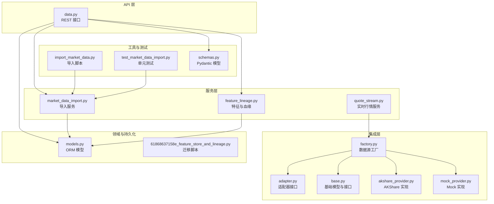
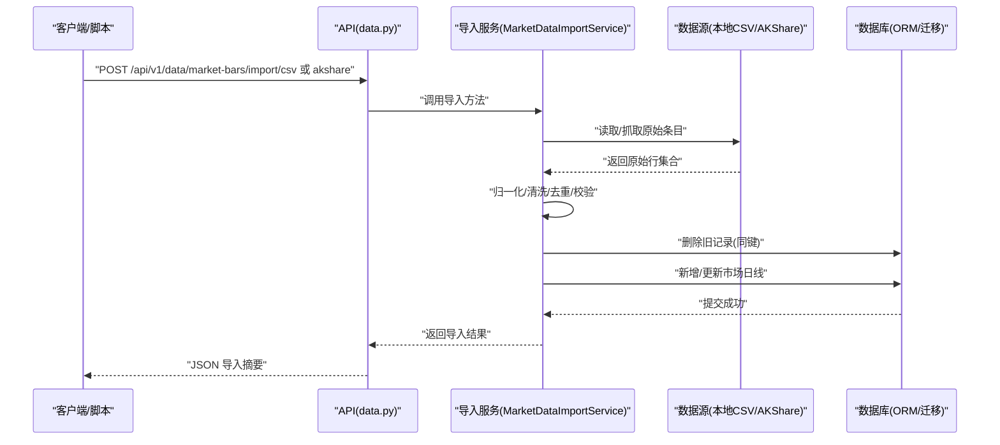
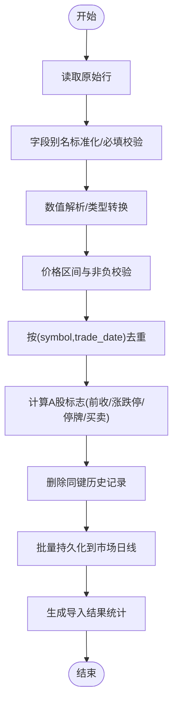
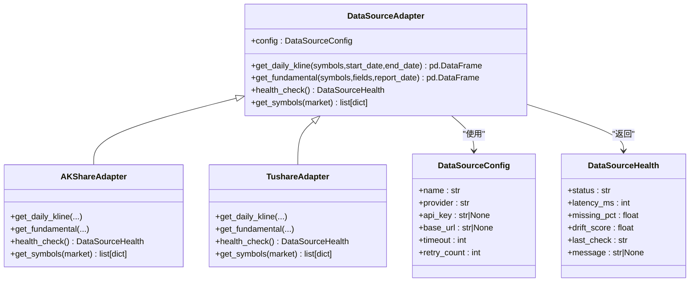
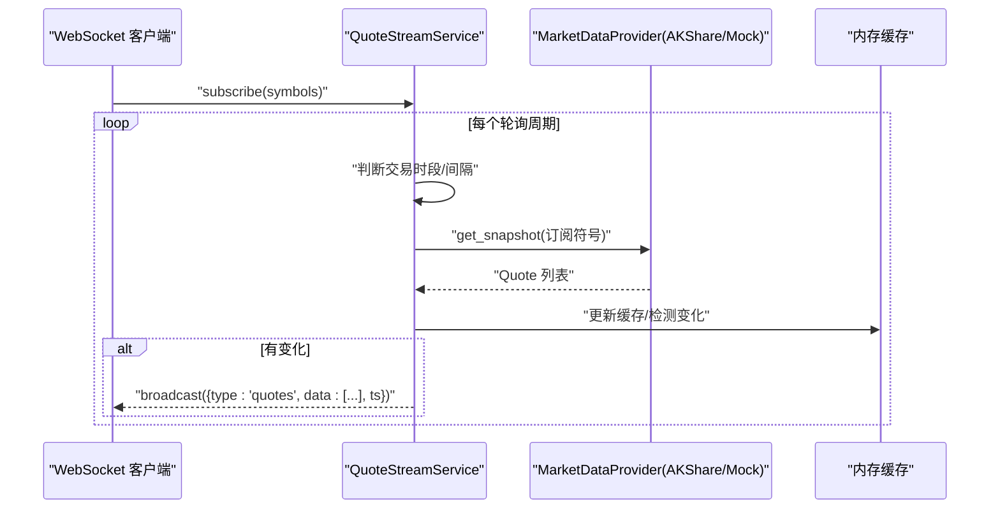
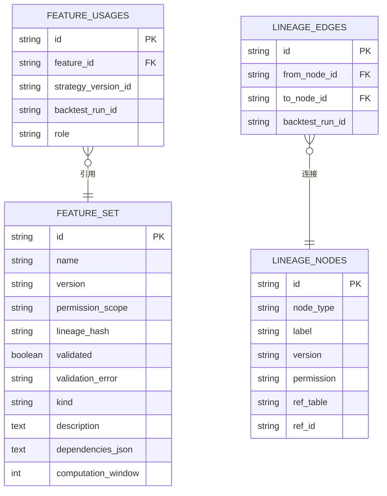
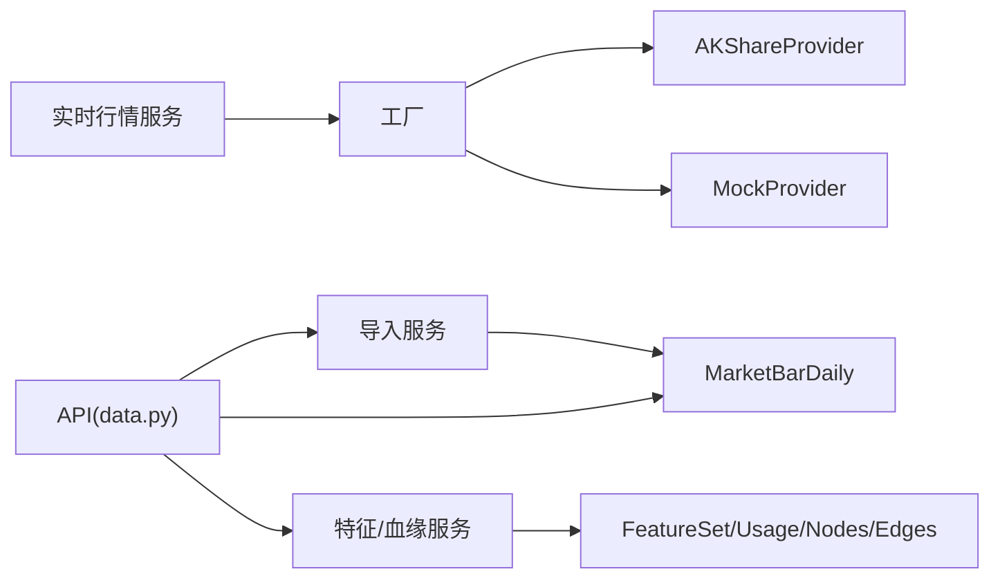

# 数据管理

<cite>
**本文引用的文件**
- [market_data_import.py](file://backend/app/services/market_data_import.py)
- [adapter.py](file://backend/app/integrations/market_data/adapter.py)
- [factory.py](file://backend/app/integrations/market_data/factory.py)
- [base.py](file://backend/app/integrations/market_data/base.py)
- [models.py](file://backend/app/domains/data/models.py)
- [61868637158e_feature_store_and_lineage.py](file://backend/app/db/migrations/versions/61868637158e_feature_store_and_lineage.py)
- [import_market_data.py](file://backend/scripts/import_market_data.py)
- [data.py](file://backend/app/api/v1/data.py)
- [quote_stream.py](file://backend/app/services/quote_stream.py)
- [config.py](file://backend/app/core/config.py)
- [mock_provider.py](file://backend/app/integrations/market_data/mock_provider.py)
- [akshare_provider.py](file://backend/app/integrations/market_data/akshare_provider.py)
- [test_market_data_import.py](file://backend/tests/services/test_market_data_import.py)
- [schemas.py](file://backend/app/domains/data/schemas.py)
</cite>

## 目录
1. [简介](#简介)
2. [项目结构](#项目结构)
3. [核心组件](#核心组件)
4. [架构总览](#架构总览)
5. [详细组件分析](#详细组件分析)
6. [依赖分析](#依赖分析)
7. [性能考虑](#性能考虑)
8. [故障排查指南](#故障排查指南)
9. [结论](#结论)
10. [附录](#附录)

## 简介
本文件面向量化数据管理系统的开发者与运维人员，系统化阐述数据导入流程、数据清洗规则、特征存储与血缘追踪机制，以及数据源适配器设计、实时数据流处理、缓存策略与数据质量控制。文档以代码为依据，提供可操作的实现路径与最佳实践，帮助快速理解并扩展系统。

## 项目结构
后端采用分层架构：API 层负责对外接口与参数校验；服务层封装业务流程（如市场数据导入、实时行情推送）；集成层抽象数据源适配器；领域模型定义数据库表结构；迁移脚本管理特征存储与血缘表结构；测试覆盖关键流程与边界条件。

**图表来源**
- [data.py:1-392](file://backend/app/api/v1/data.py#L1-L392)
- [market_data_import.py:1-426](file://backend/app/services/market_data_import.py#L1-L426)
- [quote_stream.py:1-152](file://backend/app/services/quote_stream.py#L1-L152)
- [factory.py:1-57](file://backend/app/integrations/market_data/factory.py#L1-L57)
- [adapter.py:1-115](file://backend/app/integrations/market_data/adapter.py#L1-L115)
- [base.py:1-113](file://backend/app/integrations/market_data/base.py#L1-L113)
- [akshare_provider.py:1-262](file://backend/app/integrations/market_data/akshare_provider.py#L1-L262)
- [mock_provider.py:1-109](file://backend/app/integrations/market_data/mock_provider.py#L1-L109)
- [models.py:1-144](file://backend/app/domains/data/models.py#L1-L144)
- [61868637158e_feature_store_and_lineage.py:1-112](file://backend/app/db/migrations/versions/61868637158e_feature_store_and_lineage.py#L1-L112)
- [import_market_data.py:1-53](file://backend/scripts/import_market_data.py#L1-L53)
- [test_market_data_import.py:1-134](file://backend/tests/services/test_market_data_import.py#L1-L134)
- [schemas.py:1-194](file://backend/app/domains/data/schemas.py#L1-L194)

**章节来源**
- [data.py:1-392](file://backend/app/api/v1/data.py#L1-L392)
- [market_data_import.py:1-426](file://backend/app/services/market_data_import.py#L1-L426)
- [quote_stream.py:1-152](file://backend/app/services/quote_stream.py#L1-L152)
- [factory.py:1-57](file://backend/app/integrations/market_data/factory.py#L1-L57)
- [adapter.py:1-115](file://backend/app/integrations/market_data/adapter.py#L1-L115)
- [base.py:1-113](file://backend/app/integrations/market_data/base.py#L1-L113)
- [akshare_provider.py:1-262](file://backend/app/integrations/market_data/akshare_provider.py#L1-L262)
- [mock_provider.py:1-109](file://backend/app/integrations/market_data/mock_provider.py#L1-L109)
- [models.py:1-144](file://backend/app/domains/data/models.py#L1-L144)
- [61868637158e_feature_store_and_lineage.py:1-112](file://backend/app/db/migrations/versions/61868637158e_feature_store_and_lineage.py#L1-L112)
- [import_market_data.py:1-53](file://backend/scripts/import_market_data.py#L1-L53)
- [test_market_data_import.py:1-134](file://backend/tests/services/test_market_data_import.py#L1-L134)
- [schemas.py:1-194](file://backend/app/domains/data/schemas.py#L1-L194)

## 核心组件
- 市场数据导入服务：支持本地 CSV 与 AKShare 远程数据源，统一归一化、清洗、去重与持久化，输出导入结果统计。
- 数据源适配器：抽象统一接口，内置 AKShare 与 Tushare 等实现，支持健康检查与符号列表查询。
- 特征存储与血缘：注册特征集、记录特征使用关系、生成回测运行的血缘链路。
- 实时行情服务：后台轮询订阅的符号，按交易时段调整轮询间隔，缓存并广播增量行情。
- 数据模型与迁移：定义市场日线、特征集、血缘节点/边等表结构，迁移脚本确保表结构一致。

**章节来源**
- [market_data_import.py:177-242](file://backend/app/services/market_data_import.py#L177-L242)
- [factory.py:23-56](file://backend/app/integrations/market_data/factory.py#L23-L56)
- [feature_lineage.py:41-194](file://backend/app/services/feature_lineage.py#L41-L194)
- [quote_stream.py:62-151](file://backend/app/services/quote_stream.py#L62-L151)
- [models.py:40-144](file://backend/app/domains/data/models.py#L40-L144)
- [61868637158e_feature_store_and_lineage.py:33-112](file://backend/app/db/migrations/versions/61868637158e_feature_store_and_lineage.py#L33-L112)

## 架构总览
系统通过“API → 服务 → 集成 → 持久化”的分层实现数据管理闭环。导入流程从 CSV 或远程数据源读取原始条目，经归一化与清洗后写入市场日线表；特征与血缘由策略生成与回测运行驱动写入特征集与血缘表；实时行情通过工厂选择数据源，后台轮询并广播。

**图表来源**
- [data.py:155-191](file://backend/app/api/v1/data.py#L155-L191)
- [market_data_import.py:185-242](file://backend/app/services/market_data_import.py#L185-L242)
- [import_market_data.py:14-31](file://backend/scripts/import_market_data.py#L14-L31)

**章节来源**
- [data.py:155-191](file://backend/app/api/v1/data.py#L155-L191)
- [market_data_import.py:185-242](file://backend/app/services/market_data_import.py#L185-L242)
- [import_market_data.py:14-31](file://backend/scripts/import_market_data.py#L14-L31)

## 详细组件分析

### 组件A：市场数据导入流程
- 输入来源：本地 CSV 文件或 AKShare 远程接口。
- 归一化与清洗：
  - 字段别名映射与标准化列名。
  - 必填字段校验（symbol、trade_date、open、high、low、close、volume）。
  - 数值解析与类型转换，空值与非法值处理。
  - 价格区间一致性校验（低≤开/收≤高，金额非负，复权价正）。
  - 去重：按 symbol+trade_date 去重，保留后者覆盖前者。
  - A 股特有标志：前收价、涨停跌停阈值、是否停牌、买卖限制。
- 写入策略：先删除同键历史记录，再批量插入新记录，保证幂等。
- 结果汇总：统计总数、导入数、新增数、更新数、跳过数、错误明细与时间范围。

**图表来源**
- [market_data_import.py:243-290](file://backend/app/services/market_data_import.py#L243-L290)
- [market_data_import.py:292-426](file://backend/app/services/market_data_import.py#L292-L426)

**章节来源**
- [market_data_import.py:177-242](file://backend/app/services/market_data_import.py#L177-L242)
- [market_data_import.py:243-290](file://backend/app/services/market_data_import.py#L243-L290)
- [market_data_import.py:292-426](file://backend/app/services/market_data_import.py#L292-L426)
- [test_market_data_import.py:25-134](file://backend/tests/services/test_market_data_import.py#L25-L134)

### 组件B：数据源适配器设计
- 抽象接口：统一定义日K、财务、健康检查、符号列表等异步接口。
- 已实现适配器：
  - AKShareAdapter：免费数据源，提供健康检查与符号列表占位实现。
  - TushareAdapter：付费数据源，提供健康检查与符号列表占位实现。
- 工厂模式：根据配置选择具体提供商，自动降级至 Mock，便于开发与测试。

**图表来源**
- [adapter.py:34-115](file://backend/app/integrations/market_data/adapter.py#L34-L115)

**章节来源**
- [adapter.py:34-115](file://backend/app/integrations/market_data/adapter.py#L34-L115)
- [factory.py:23-56](file://backend/app/integrations/market_data/factory.py#L23-L56)

### 组件C：实时数据流处理
- 订阅管理：按 WebSocket 连接维护符号集合，仅轮询被订阅的符号。
- 轮询策略：交易时段按配置间隔轮询，休市时段降低频率，避免无效请求。
- 缓存与广播：缓存最近报价，检测价格变化后广播增量；提供 REST 快照接口。
- 数据源选择：通过工厂注入 MarketDataProvider，支持切换不同提供商。

**图表来源**
- [quote_stream.py:62-151](file://backend/app/services/quote_stream.py#L62-L151)
- [factory.py:23-56](file://backend/app/integrations/market_data/factory.py#L23-L56)
- [akshare_provider.py:206-210](file://backend/app/integrations/market_data/akshare_provider.py#L206-L210)
- [mock_provider.py:78-108](file://backend/app/integrations/market_data/mock_provider.py#L78-L108)

**章节来源**
- [quote_stream.py:62-151](file://backend/app/services/quote_stream.py#L62-L151)
- [config.py:80-86](file://backend/app/core/config.py#L80-L86)

### 组件D：特征存储与血缘追踪
- 特征注册：从策略生成规范中提取特征，按名称与参数哈希生成版本，写入特征集表。
- 使用关联：记录特征与策略版本的关系，可选绑定回测运行 ID。
- 血缘链路：构建 raw → cleaned → feature(s) → strategy → run 的有向无环图节点与边，支持按运行 ID过滤查询。

**图表来源**
- [models.py:81-130](file://backend/app/domains/data/models.py#L81-L130)
- [61868637158e_feature_store_and_lineage.py:33-93](file://backend/app/db/migrations/versions/61868637158e_feature_store_and_lineage.py#L33-L93)

**章节来源**
- [feature_lineage.py:41-194](file://backend/app/services/feature_lineage.py#L41-L194)
- [models.py:81-130](file://backend/app/domains/data/models.py#L81-L130)
- [61868637158e_feature_store_and_lineage.py:33-112](file://backend/app/db/migrations/versions/61868637158e_feature_store_and_lineage.py#L33-L112)

### 组件E：数据质量控制与健康度
- 健康检查：适配器提供健康状态、延迟、缺失率、漂移分等指标。
- 数据质量门禁：前端展示未来函数检测、幸存者偏差、完整性、及时性、一致性等检查项。
- 数据源分级：研究层/模拟盘层/实盘层，不同层级对应不同提供商与 SLA。

**章节来源**
- [adapter.py:23-32](file://backend/app/integrations/market_data/adapter.py#L23-L32)
- [data.py:65-102](file://backend/app/api/v1/data.py#L65-L102)

## 依赖分析
- 服务层依赖：
  - 导入服务依赖 ORM 模型与数据库会话，进行批量写入与替换。
  - 实时行情服务依赖工厂注入的数据源接口，按需调用。
  - 特征与血缘服务依赖特征集、使用关联与血缘节点/边模型。
- 集成层依赖：
  - 工厂根据配置选择具体提供商，若未安装依赖则回退至 Mock。
  - 提供器内部使用同步库时，通过线程池包装为异步调用。
- API 层依赖：
  - 对外暴露导入、查询、血缘与监控接口，统一响应模型。

**图表来源**
- [market_data_import.py:180-183](file://backend/app/services/market_data_import.py#L180-L183)
- [quote_stream.py:74-76](file://backend/app/services/quote_stream.py#L74-L76)
- [factory.py:29-53](file://backend/app/integrations/market_data/factory.py#L29-L53)
- [feature_lineage.py:18-24](file://backend/app/services/feature_lineage.py#L18-L24)

**章节来源**
- [market_data_import.py:180-183](file://backend/app/services/market_data_import.py#L180-L183)
- [quote_stream.py:74-76](file://backend/app/services/quote_stream.py#L74-L76)
- [factory.py:29-53](file://backend/app/integrations/market_data/factory.py#L29-L53)
- [feature_lineage.py:18-24](file://backend/app/services/feature_lineage.py#L18-L24)

## 性能考虑
- 导入性能：
  - 批量删除同键记录后再插入，减少重复写入。
  - 归一化与校验在内存完成，避免多次 IO。
- 实时行情：
  - 仅轮询订阅符号，避免全市场扫描。
  - 交易时段短间隔轮询，休市时段长间隔，降低网络与 CPU 开销。
  - 内存缓存与增量广播，减少无效消息。
- 数据源选择：
  - 免费源适合开发与测试；付费源适合更高 SLA 场景。
  - 工厂自动降级，保障系统可用性。

[本节为通用指导，无需特定文件来源]

## 故障排查指南
- 导入失败：
  - 检查 CSV 路径是否存在与可读。
  - 关注必填字段缺失与数值解析错误。
  - 查看导入结果中的错误列表定位问题行。
- 实时行情异常：
  - 确认订阅符号集合是否为空导致跳过轮询。
  - 检查交易时段判断与轮询间隔配置。
  - 观察日志中的轮询错误告警。
- 数据源健康：
  - 通过健康检查接口查看延迟、缺失率与漂移分。
  - 若健康状态异常，优先检查网络与第三方接口可用性。

**章节来源**
- [market_data_import.py:110-119](file://backend/app/services/market_data_import.py#L110-L119)
- [market_data_import.py:257-259](file://backend/app/services/market_data_import.py#L257-L259)
- [quote_stream.py:118-123](file://backend/app/services/quote_stream.py#L118-L123)
- [adapter.py:82-87](file://backend/app/integrations/market_data/adapter.py#L82-L87)

## 结论
该数据管理系统以清晰的分层与可插拔的数据源适配器为核心，实现了从 CSV 与远程数据源到数据库的标准化导入流程；通过特征存储与血缘追踪支撑策略研发与回测；实时行情服务结合缓存与广播满足交互需求。配合健康度监控与质量门禁，形成完整的数据治理闭环。

[本节为总结，无需特定文件来源]

## 附录

### A. 数据导入脚本使用
- CSV 导入：指定 CSV 路径与可选默认符号，返回 JSON 导入摘要。
- AKShare 导入：指定符号列表与起止日期、复权方式，返回导入摘要。

**章节来源**
- [import_market_data.py:14-52](file://backend/scripts/import_market_data.py#L14-L52)

### B. API 接口要点
- 导入接口：支持 CSV 与 AKShare 两种来源，返回导入摘要。
- 查询接口：支持按符号、日期范围查询市场日线，列出特征与使用关系，查询血缘链路。
- 监控接口：提供数据概览、延迟趋势、偏见门禁、事件与血缘示例。

**章节来源**
- [data.py:155-191](file://backend/app/api/v1/data.py#L155-L191)
- [data.py:194-250](file://backend/app/api/v1/data.py#L194-L250)
- [data.py:252-296](file://backend/app/api/v1/data.py#L252-L296)
- [data.py:299-327](file://backend/app/api/v1/data.py#L299-L327)

### C. 数据模型与迁移
- 市场日线表：唯一约束 symbol+trade_date，存储 OHLCV 与 A 股标志。
- 特征与血缘：特征集、使用关联、血缘节点与边，支持按运行 ID过滤。

**章节来源**
- [models.py:40-67](file://backend/app/domains/data/models.py#L40-L67)
- [61868637158e_feature_store_and_lineage.py:33-93](file://backend/app/db/migrations/versions/61868637158e_feature_store_and_lineage.py#L33-L93)