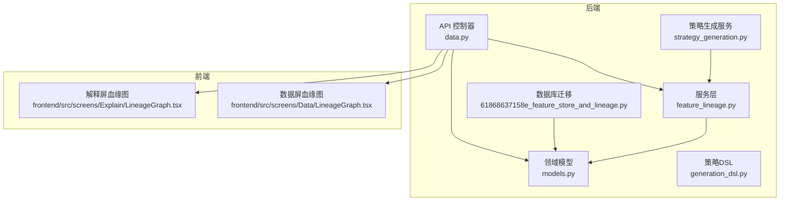
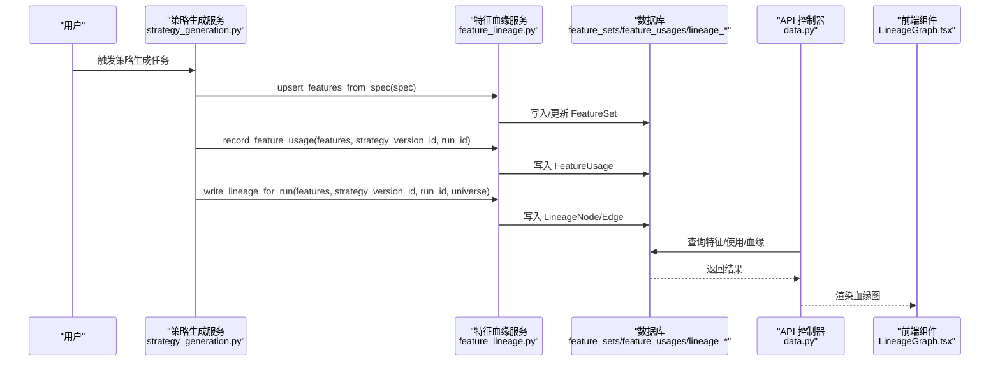
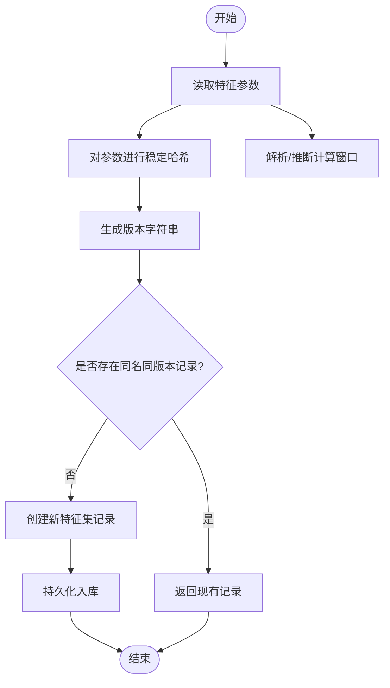
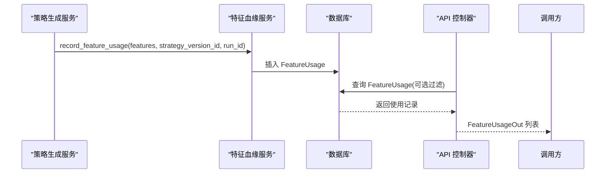
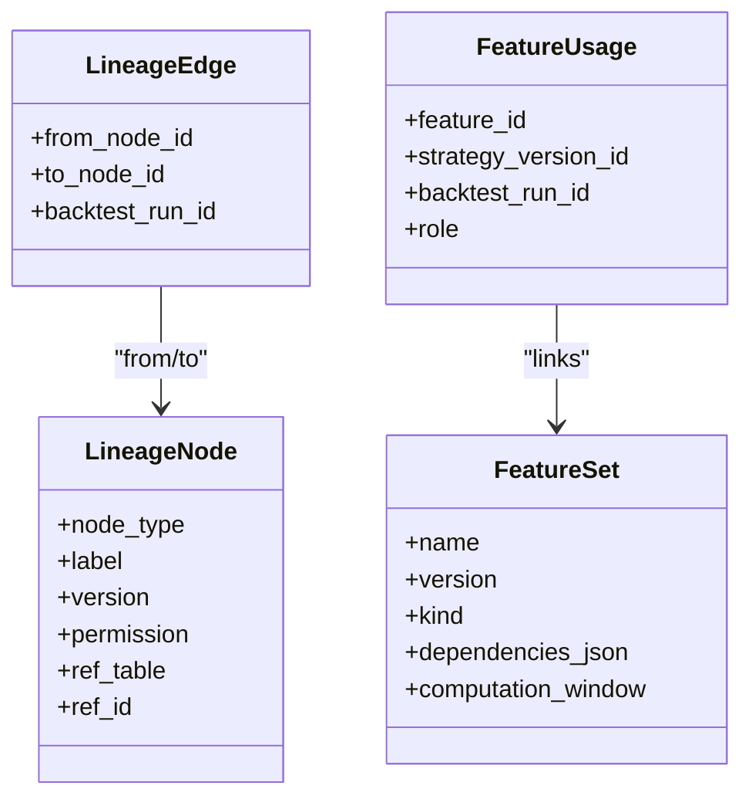
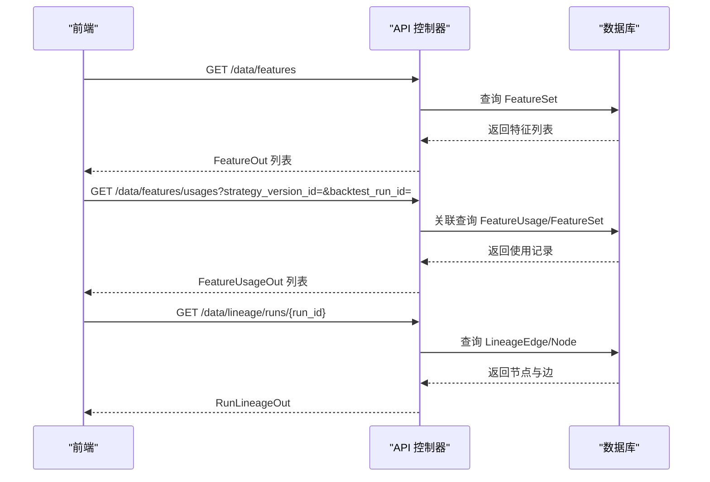
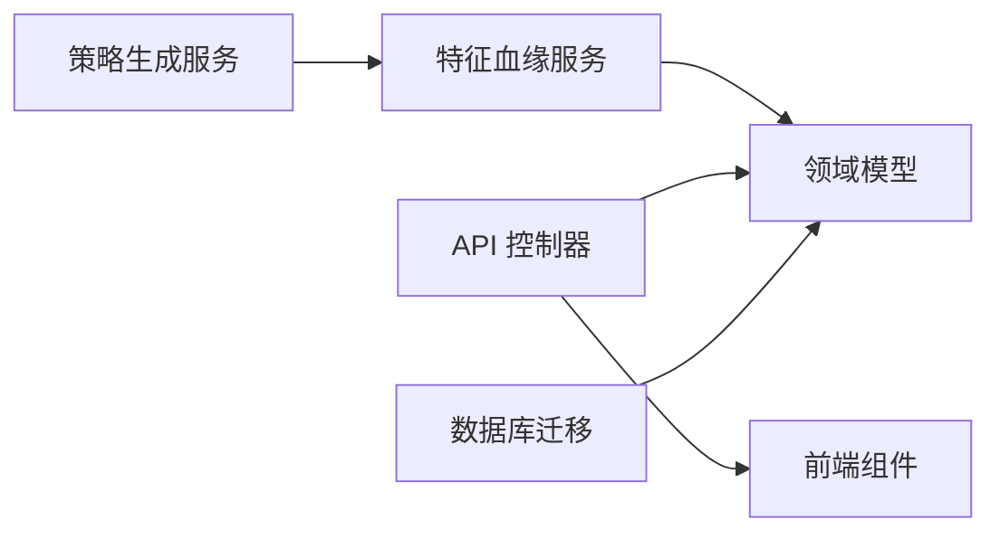

# 特征存储与血缘追踪

<cite>
**本文引用的文件**
- [61868637158e_feature_store_and_lineage.py](file://backend/app/db/migrations/versions/61868637158e_feature_store_and_lineage.py)
- [feature_lineage.py](file://backend/app/services/feature_lineage.py)
- [models.py](file://backend/app/domains/data/models.py)
- [schemas.py](file://backend/app/domains/data/schemas.py)
- [data.py](file://backend/app/api/v1/data.py)
- [generation_dsl.py](file://backend/app/domains/strategy/generation_dsl.py)
- [strategy_generation.py](file://backend/app/services/strategy_generation.py)
- [LineageGraph.tsx](file://frontend/src/screens/Data/LineageGraph.tsx)
- [LineageGraph.tsx](file://frontend/src/screens/Explain/LineageGraph.tsx)
</cite>

## 目录
1. [引言](#引言)
2. [项目结构](#项目结构)
3. [核心组件](#核心组件)
4. [架构总览](#架构总览)
5. [详细组件分析](#详细组件分析)
6. [依赖分析](#依赖分析)
7. [性能考虑](#性能考虑)
8. [故障排查指南](#故障排查指南)
9. [结论](#结论)
10. [附录](#附录)

## 引言
本技术文档面向特征存储与血缘追踪系统，系统围绕特征集注册、特征使用记录、特征血缘图谱三大部分展开，覆盖特征版本管理、特征使用追踪、血缘关系建模与可视化展示。通过数据库迁移脚本定义特征存储与血缘表结构，服务层提供特征版本化写入、使用记录与血缘链路构建，API 层提供查询接口，前端提供血缘图谱可视化。

## 项目结构
后端采用分层架构：API 控制器负责对外接口；服务层封装业务流程（如特征存储与血缘写入）；领域模型定义数据实体；数据库迁移脚本定义表结构与索引；前端提供可视化组件。

图表来源
- [data.py:1-392](file://backend/app/api/v1/data.py#L1-L392)
- [feature_lineage.py:1-217](file://backend/app/services/feature_lineage.py#L1-L217)
- [models.py:81-144](file://backend/app/domains/data/models.py#L81-L144)
- [61868637158e_feature_store_and_lineage.py:33-112](file://backend/app/db/migrations/versions/61868637158e_feature_store_and_lineage.py#L33-L112)
- [strategy_generation.py:1-584](file://backend/app/services/strategy_generation.py#L1-L584)
- [generation_dsl.py:78-144](file://backend/app/domains/strategy/generation_dsl.py#L78-L144)
- [LineageGraph.tsx:1-138](file://frontend/src/screens/Data/LineageGraph.tsx#L1-L138)
- [LineageGraph.tsx:1-43](file://frontend/src/screens/Explain/LineageGraph.tsx#L1-L43)

章节来源
- [data.py:1-392](file://backend/app/api/v1/data.py#L1-L392)
- [feature_lineage.py:1-217](file://backend/app/services/feature_lineage.py#L1-L217)
- [models.py:1-144](file://backend/app/domains/data/models.py#L1-L144)
- [61868637158e_feature_store_and_lineage.py:1-112](file://backend/app/db/migrations/versions/61868637158e_feature_store_and_lineage.py#L1-L112)
- [strategy_generation.py:1-584](file://backend/app/services/strategy_generation.py#L1-L584)
- [generation_dsl.py:1-144](file://backend/app/domains/strategy/generation_dsl.py#L1-L144)
- [LineageGraph.tsx:1-138](file://frontend/src/screens/Data/LineageGraph.tsx#L1-L138)
- [LineageGraph.tsx:1-43](file://frontend/src/screens/Explain/LineageGraph.tsx#L1-L43)

## 核心组件
- 特征集（FeatureSet）：注册特征名称、版本、类型、描述、依赖参数、计算窗口等元信息，用于特征版本管理与检索。
- 特征使用（FeatureUsage）：记录某个策略版本使用了哪些特征集，可按回测运行或策略版本过滤。
- 血缘节点（LineageNode）：血缘图中的节点，标识类型（原始/清洗/特征/策略/运行）、标签、版本、权限与引用目标。
- 血缘边（LineageEdge）：连接节点的有向边，可按回测运行进行筛选，形成特定运行的血缘子图。
- 血缘服务（feature_lineage）：提供特征集去重入库、特征使用记录写入、按回测运行写入血缘链路的能力。
- API 接口：提供特征列表、特征使用查询、按运行查看血缘图等接口。
- 前端可视化：提供数据屏与解释屏的血缘图组件，渲染节点与边。

章节来源
- [models.py:81-144](file://backend/app/domains/data/models.py#L81-L144)
- [feature_lineage.py:41-194](file://backend/app/services/feature_lineage.py#L41-L194)
- [data.py:252-327](file://backend/app/api/v1/data.py#L252-L327)

## 架构总览
系统以“策略生成”为主线，生成完成后进行特征存储与血缘写入，随后通过 API 提供查询与前端可视化。

图表来源
- [strategy_generation.py:231-252](file://backend/app/services/strategy_generation.py#L231-L252)
- [feature_lineage.py:41-194](file://backend/app/services/feature_lineage.py#L41-L194)
- [data.py:273-327](file://backend/app/api/v1/data.py#L273-L327)

## 详细组件分析

### 数据库表结构与索引
- feature_sets：特征集注册表，包含名称、版本、类型、描述、依赖参数、计算窗口、权限范围、校验状态等字段，并建立名称索引。
- feature_usages：特征使用关联表，记录特征集与策略版本的关系，支持按回测运行与策略版本过滤，并建立多列索引。
- lineage_nodes：血缘节点表，包含节点类型、标签、版本、权限、引用表与引用ID，并建立类型与引用ID索引。
- lineage_edges：血缘边表，记录节点间的有向连接，并支持按回测运行过滤，建立多列索引。

章节来源
- [61868637158e_feature_store_and_lineage.py:33-112](file://backend/app/db/migrations/versions/61868637158e_feature_store_and_lineage.py#L33-L112)
- [models.py:81-144](file://backend/app/domains/data/models.py#L81-L144)

### 特征版本管理
- 版本派生规则：基于特征参数字典的稳定哈希生成短版本号，确保相同参数产生相同版本，不同参数产生新版本。
- 默认计算窗口：根据特征种类映射默认窗口大小，若参数中存在 window/lookback/days 则优先使用参数值。
- 去重入库：按名称+版本查找，不存在则创建并持久化，保证特征集唯一性与版本化。

图表来源
- [feature_lineage.py:200-217](file://backend/app/services/feature_lineage.py#L200-L217)
- [feature_lineage.py:41-74](file://backend/app/services/feature_lineage.py#L41-L74)

章节来源
- [feature_lineage.py:27-38](file://backend/app/services/feature_lineage.py#L27-L38)
- [feature_lineage.py:200-217](file://backend/app/services/feature_lineage.py#L200-L217)
- [feature_lineage.py:41-74](file://backend/app/services/feature_lineage.py#L41-L74)

### 特征使用追踪与查询
- 使用记录写入：为每个使用的特征集创建一条 FeatureUsage 记录，绑定策略版本与可选回测运行。
- 查询接口：支持按策略版本或回测运行过滤，联表返回特征名称与版本，便于审计与溯源。

图表来源
- [feature_lineage.py:77-97](file://backend/app/services/feature_lineage.py#L77-L97)
- [data.py:273-296](file://backend/app/api/v1/data.py#L273-L296)

章节来源
- [feature_lineage.py:77-97](file://backend/app/services/feature_lineage.py#L77-L97)
- [data.py:273-296](file://backend/app/api/v1/data.py#L273-L296)

### 血缘关系建模与图谱构建
- 节点类型：raw/cleaned/feature/strategy/run 等，分别对应原始数据、清洗数据、特征集、策略版本、回测运行。
- 节点引用：通过 ref_table/ref_id 指向具体数据对象，便于溯源。
- 边的构建：raw→cleaned→feature(s)→strategy→run 的链式关系，支持空特征场景直接从 cleaned→strategy。
- 运行级过滤：边与节点均支持按 backtest_run_id 过滤，形成特定运行的血缘子图。

图表来源
- [models.py:109-130](file://backend/app/domains/data/models.py#L109-L130)
- [models.py:81-107](file://backend/app/domains/data/models.py#L81-L107)

章节来源
- [feature_lineage.py:100-194](file://backend/app/services/feature_lineage.py#L100-L194)
- [models.py:109-130](file://backend/app/domains/data/models.py#L109-L130)

### API 与前端集成
- API 接口
  - 列出特征集：按名称与版本排序，返回特征元信息。
  - 查询特征使用：支持按策略版本或回测运行过滤。
  - 获取运行级血缘：按 run_id 返回节点与边集合。
- 前端组件
  - 数据屏血缘图：按节点类型分层布局，渲染节点与曲线边。
  - 解释屏血缘图：线性流程展示，强调权限与版本信息。

图表来源
- [data.py:252-327](file://backend/app/api/v1/data.py#L252-L327)
- [schemas.py:75-113](file://backend/app/domains/data/schemas.py#L75-L113)

章节来源
- [data.py:252-327](file://backend/app/api/v1/data.py#L252-L327)
- [schemas.py:75-113](file://backend/app/domains/data/schemas.py#L75-L113)
- [LineageGraph.tsx:1-138](file://frontend/src/screens/Data/LineageGraph.tsx#L1-L138)
- [LineageGraph.tsx:1-43](file://frontend/src/screens/Explain/LineageGraph.tsx#L1-L43)

### 策略生成与特征血缘联动
- 策略生成流程在完成研究回测后，调用特征存储与血缘写入服务，确保特征集注册、使用记录与血缘链路一致。
- 特征版本由 DSL 中的因子参数决定，保证特征版本与策略意图一致。

章节来源
- [strategy_generation.py:231-252](file://backend/app/services/strategy_generation.py#L231-L252)
- [generation_dsl.py:78-144](file://backend/app/domains/strategy/generation_dsl.py#L78-L144)

## 依赖分析
- 组件耦合
  - 策略生成服务依赖特征血缘服务，用于在生成成功后写入特征与血缘。
  - 特征血缘服务依赖领域模型与 SQLAlchemy 异步会话，负责数据持久化。
  - API 控制器依赖领域模型与服务层，提供查询接口。
- 外部依赖
  - 前端通过 API 获取数据并渲染血缘图。
  - 数据库迁移脚本定义表结构，确保前后端契约一致。

图表来源
- [strategy_generation.py:48-52](file://backend/app/services/strategy_generation.py#L48-L52)
- [feature_lineage.py:11-24](file://backend/app/services/feature_lineage.py#L11-L24)
- [data.py:9-35](file://backend/app/api/v1/data.py#L9-L35)
- [61868637158e_feature_store_and_lineage.py:33-112](file://backend/app/db/migrations/versions/61868637158e_feature_store_and_lineage.py#L33-L112)

章节来源
- [strategy_generation.py:48-52](file://backend/app/services/strategy_generation.py#L48-L52)
- [feature_lineage.py:11-24](file://backend/app/services/feature_lineage.py#L11-L24)
- [data.py:9-35](file://backend/app/api/v1/data.py#L9-L35)
- [61868637158e_feature_store_and_lineage.py:33-112](file://backend/app/db/migrations/versions/61868637158e_feature_store_and_lineage.py#L33-L112)

## 性能考虑
- 索引优化：特征使用与血缘表均建立多列索引，建议在高频过滤字段上保持索引命中。
- 批量写入：特征入库与使用记录写入采用 flush 批处理，减少往返次数。
- 图谱查询：按 run_id 过滤可显著缩小查询范围，避免全量扫描。
- 前端渲染：节点按类型分层布局，SVG 曲线边渲染开销可控，建议限制单次渲染节点数量。

## 故障排查指南
- 特征未入库或版本不正确
  - 检查特征参数是否为空或格式异常，确认版本派生逻辑是否生效。
  - 参考路径：[feature_lineage.py:200-217](file://backend/app/services/feature_lineage.py#L200-L217)
- 特征使用记录缺失
  - 确认策略生成流程是否调用了记录使用接口，以及回测 run_id 是否正确传入。
  - 参考路径：[strategy_generation.py:233-240](file://backend/app/services/strategy_generation.py#L233-L240)
- 血缘图为空
  - 检查是否按正确的 run_id 查询，确认边与节点是否按 run_id 写入。
  - 参考路径：[feature_lineage.py:100-194](file://backend/app/services/feature_lineage.py#L100-L194)，[data.py:299-327](file://backend/app/api/v1/data.py#L299-L327)
- 前端血缘图不显示
  - 检查 API 返回的数据结构是否符合前端预期，确认节点与边字段是否齐全。
  - 参考路径：[data.py:300-327](file://backend/app/api/v1/data.py#L300-L327)，[schemas.py:52-99](file://backend/app/domains/data/schemas.py#L52-L99)

章节来源
- [feature_lineage.py:200-217](file://backend/app/services/feature_lineage.py#L200-L217)
- [strategy_generation.py:233-240](file://backend/app/services/strategy_generation.py#L233-L240)
- [feature_lineage.py:100-194](file://backend/app/services/feature_lineage.py#L100-L194)
- [data.py:299-327](file://backend/app/api/v1/data.py#L299-L327)
- [schemas.py:52-99](file://backend/app/domains/data/schemas.py#L52-L99)

## 结论
该系统通过特征集版本化、使用记录与运行级血缘图谱，实现了量化特征的全生命周期治理。服务层提供稳定的特征存储与血缘写入能力，API 层提供灵活的查询接口，前端组件直观展示血缘关系。建议在生产环境中持续关注索引命中、批量写入与图谱查询性能，并完善异常监控与审计日志。

## 附录
- 关键实现路径参考
  - 特征版本派生与默认窗口：[feature_lineage.py:27-38](file://backend/app/services/feature_lineage.py#L27-L38)，[feature_lineage.py:200-217](file://backend/app/services/feature_lineage.py#L200-L217)
  - 特征入库与使用记录：[feature_lineage.py:41-74](file://backend/app/services/feature_lineage.py#L41-L74)，[feature_lineage.py:77-97](file://backend/app/services/feature_lineage.py#L77-L97)
  - 血缘链路构建：[feature_lineage.py:100-194](file://backend/app/services/feature_lineage.py#L100-L194)
  - API 查询接口：[data.py:252-327](file://backend/app/api/v1/data.py#L252-L327)
  - 前端血缘图组件：[LineageGraph.tsx:1-138](file://frontend/src/screens/Data/LineageGraph.tsx#L1-L138)，[LineageGraph.tsx:1-43](file://frontend/src/screens/Explain/LineageGraph.tsx#L1-L43)