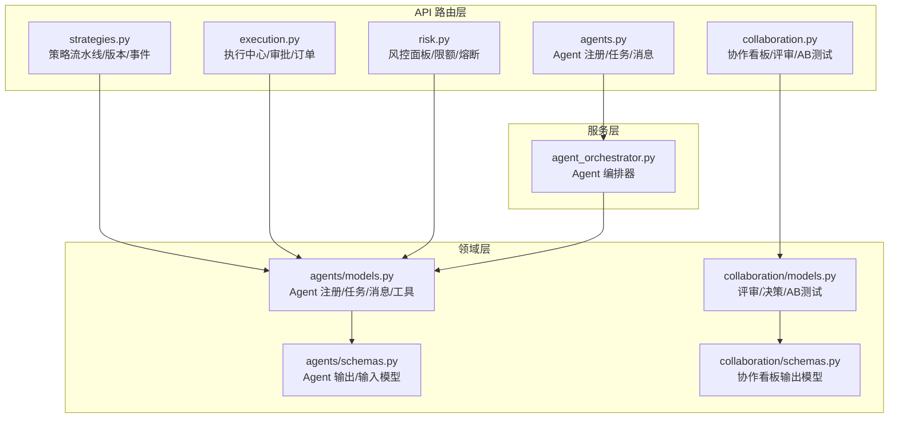
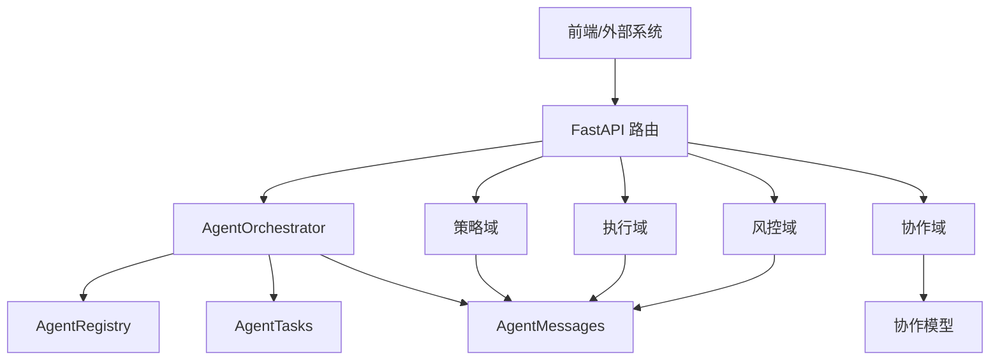
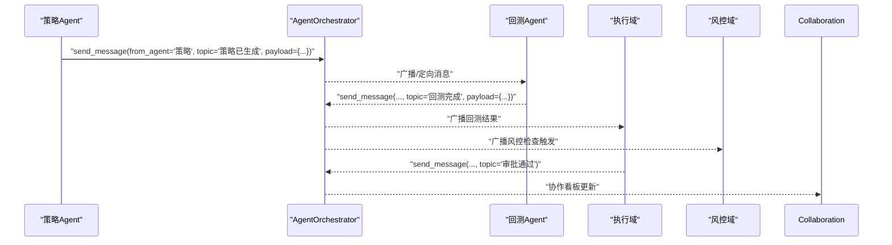
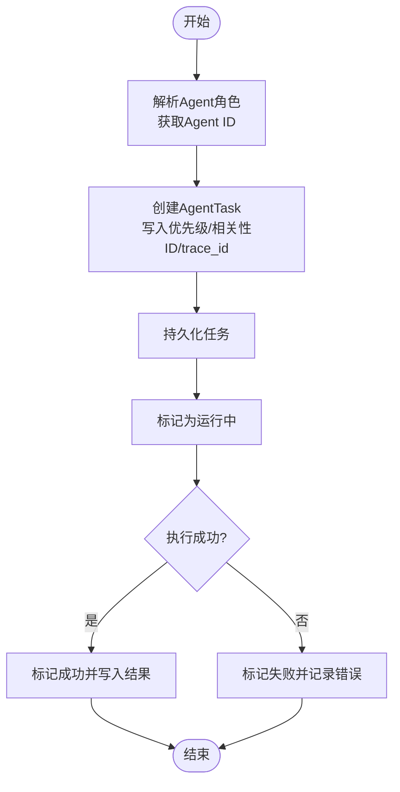
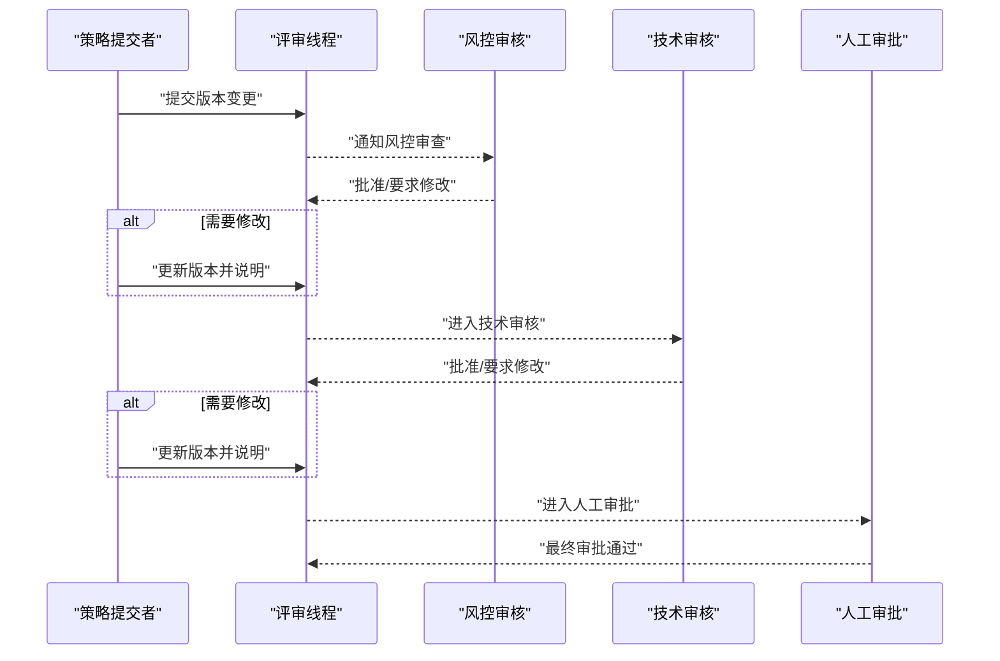
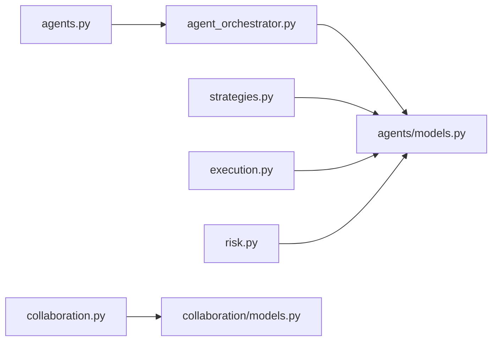

# AI Agent 协作与角色分工

<cite>
**本文引用的文件**
- [backend/app/api/v1/agents.py](file://backend/app/api/v1/agents.py)
- [backend/app/services/agent_orchestrator.py](file://backend/app/services/agent_orchestrator.py)
- [backend/app/domains/agents/models.py](file://backend/app/domains/agents/models.py)
- [backend/app/domains/agents/schemas.py](file://backend/app/domains/agents/schemas.py)
- [backend/app/api/v1/collaboration.py](file://backend/app/api/v1/collaboration.py)
- [backend/app/domains/collaboration/models.py](file://backend/app/domains/collaboration/models.py)
- [backend/app/domains/collaboration/schemas.py](file://backend/app/domains/collaboration/schemas.py)
- [backend/app/api/v1/strategies.py](file://backend/app/api/v1/strategies.py)
- [backend/app/api/v1/execution.py](file://backend/app/api/v1/execution.py)
- [backend/app/api/v1/risk.py](file://backend/app/api/v1/risk.py)
</cite>

## 目录
1. [简介](#简介)
2. [项目结构](#项目结构)
3. [核心组件](#核心组件)
4. [架构总览](#架构总览)
5. [详细组件分析](#详细组件分析)
6. [依赖分析](#依赖分析)
7. [性能考虑](#性能考虑)
8. [故障排查指南](#故障排查指南)
9. [结论](#结论)
10. [附录](#附录)

## 简介
本文件面向“AI Agent 协作与角色分工系统”，围绕多Agent协作架构展开，重点阐述策略分析师、代码生成器、代码审查员、回测执行器等不同角色Agent的职责划分与交互机制；深入说明Agent之间的消息传递协议、状态同步机制、冲突解决策略与协作流程控制；并给出Agent角色配置、任务分配算法、性能监控与故障恢复机制的具体实现细节。

该系统以FastAPI提供REST接口，结合SQLAlchemy异步数据库访问，使用Agent注册表、任务队列与消息通道实现跨Agent的编排与追踪；同时在策略、回测、执行、风控等业务域内提供端到端的协作视图与审计能力。

## 项目结构
后端采用分层架构：API路由层负责对外暴露REST接口；服务层封装业务编排（如Agent编排器）；领域层定义模型与Schema；数据库层提供持久化与迁移支持。协作域与Agent域相互配合，形成从“策略生成”到“回测验证”再到“执行与风控”的闭环。

图表来源
- [backend/app/api/v1/agents.py:1-172](file://backend/app/api/v1/agents.py#L1-L172)
- [backend/app/services/agent_orchestrator.py:1-105](file://backend/app/services/agent_orchestrator.py#L1-L105)
- [backend/app/domains/agents/models.py:1-62](file://backend/app/domains/agents/models.py#L1-L62)
- [backend/app/domains/agents/schemas.py:1-78](file://backend/app/domains/agents/schemas.py#L1-L78)
- [backend/app/api/v1/collaboration.py:1-112](file://backend/app/api/v1/collaboration.py#L1-L112)
- [backend/app/domains/collaboration/models.py:1-44](file://backend/app/domains/collaboration/models.py#L1-L44)
- [backend/app/domains/collaboration/schemas.py:1-88](file://backend/app/domains/collaboration/schemas.py#L1-L88)

章节来源
- [backend/app/api/v1/agents.py:1-172](file://backend/app/api/v1/agents.py#L1-L172)
- [backend/app/services/agent_orchestrator.py:1-105](file://backend/app/services/agent_orchestrator.py#L1-L105)
- [backend/app/domains/agents/models.py:1-62](file://backend/app/domains/agents/models.py#L1-L62)
- [backend/app/domains/agents/schemas.py:1-78](file://backend/app/domains/agents/schemas.py#L1-L78)
- [backend/app/api/v1/collaboration.py:1-112](file://backend/app/api/v1/collaboration.py#L1-L112)
- [backend/app/domains/collaboration/models.py:1-44](file://backend/app/domains/collaboration/models.py#L1-L44)
- [backend/app/domains/collaboration/schemas.py:1-88](file://backend/app/domains/collaboration/schemas.py#L1-L88)

## 核心组件
- Agent注册与编排
  - Agent注册表用于登记Agent角色、状态与心跳；Agent任务队列表示待处理/运行中的工作项；Agent消息表承载跨Agent事件与广播。
  - AgentOrchestrator提供统一的任务派发与消息发送能力，支持按角色解析Agent ID、设置优先级、关联trace_id与correlation_id。
- 协作域
  - 提供评审请求、评审者决策、A/B实验等协作能力；API返回协作看板所需KPI、活动评审、差异对比、评审线程、AB测试与审批流程等。
- 策略域
  - 提供策略模板、版本、流水线事件、任务进度与状态转换；策略流水中可读取Agent消息作为实时动态。
- 执行与风控
  - 执行中心提供审批队列、预交易检查、订单簿与执行指标；风控面板提供限额、VaR、熔断器与违规记录。

章节来源
- [backend/app/services/agent_orchestrator.py:15-105](file://backend/app/services/agent_orchestrator.py#L15-L105)
- [backend/app/domains/agents/models.py:9-62](file://backend/app/domains/agents/models.py#L9-L62)
- [backend/app/api/v1/collaboration.py:94-112](file://backend/app/api/v1/collaboration.py#L94-L112)
- [backend/app/domains/collaboration/models.py:9-44](file://backend/app/domains/collaboration/models.py#L9-L44)
- [backend/app/api/v1/strategies.py:162-280](file://backend/app/api/v1/strategies.py#L162-L280)
- [backend/app/api/v1/execution.py:188-203](file://backend/app/api/v1/execution.py#L188-L203)
- [backend/app/api/v1/risk.py:188-207](file://backend/app/api/v1/risk.py#L188-L207)

## 架构总览
系统通过API路由层聚合各业务域，服务层统一编排Agent任务与消息，领域层以模型/Schema描述数据结构与对外输出格式。协作域与策略域共享Agent消息通道，形成“策略生成—评审—回测—执行—风控”的闭环。

图表来源
- [backend/app/api/v1/agents.py:93-172](file://backend/app/api/v1/agents.py#L93-L172)
- [backend/app/services/agent_orchestrator.py:15-105](file://backend/app/services/agent_orchestrator.py#L15-L105)
- [backend/app/domains/agents/models.py:9-62](file://backend/app/domains/agents/models.py#L9-L62)
- [backend/app/api/v1/strategies.py:204-224](file://backend/app/api/v1/strategies.py#L204-L224)
- [backend/app/api/v1/execution.py:245-249](file://backend/app/api/v1/execution.py#L245-L249)
- [backend/app/api/v1/risk.py:235-239](file://backend/app/api/v1/risk.py#L235-L239)
- [backend/app/api/v1/collaboration.py:94-105](file://backend/app/api/v1/collaboration.py#L94-L105)

## 详细组件分析

### Agent 角色与职责划分
- 角色类型
  - 策略/研究/回测/风控/执行/组合/解释/数据等角色在Agent注册表中定义，便于统一调度与权限控制。
- 职责边界
  - 策略分析师：提出策略思路与参数，驱动策略生成服务。
  - 代码生成器：根据策略描述生成可执行代码。
  - 代码审查员：对策略版本进行评审与决策。
  - 回测执行器：执行策略回测，产出回测结果。
  - 风控/执行：负责预交易检查、审批与下单执行。
- 协作方式
  - 通过Agent消息通道进行事件驱动的松耦合协作；通过Agent任务队列进行有序的任务编排与状态追踪。

章节来源
- [backend/app/domains/agents/models.py:14-16](file://backend/app/domains/agents/models.py#L14-L16)
- [backend/app/domains/agents/schemas.py:6-15](file://backend/app/domains/agents/schemas.py#L6-L15)

### Agent 消息传递协议
- 消息类型
  - request / response / event / broadcast，满足点对点与广播场景。
- 关键字段
  - 来源/目标Agent、主题(topic)、负载(payload)、相关性ID(correlation_id)、跟踪ID(trace_id)。
- 使用场景
  - 策略生成完成后向回测域广播事件；执行域审批通过后广播至协作域与风控域。

图表来源
- [backend/app/services/agent_orchestrator.py:81-105](file://backend/app/services/agent_orchestrator.py#L81-L105)
- [backend/app/domains/agents/models.py:38-49](file://backend/app/domains/agents/models.py#L38-L49)
- [backend/app/api/v1/execution.py:245-249](file://backend/app/api/v1/execution.py#L245-L249)
- [backend/app/api/v1/risk.py:235-239](file://backend/app/api/v1/risk.py#L235-L239)

章节来源
- [backend/app/services/agent_orchestrator.py:81-105](file://backend/app/services/agent_orchestrator.py#L81-L105)
- [backend/app/domains/agents/models.py:38-49](file://backend/app/domains/agents/models.py#L38-L49)

### Agent 任务分配与状态同步
- 任务派发
  - 支持按角色解析Agent ID，设置任务类型、优先级与相关性ID；自动写入trace_id与时间戳。
- 状态流转
  - 任务状态：pending → running → succeeded/failed；支持结果回填与完成时间记录。
- 状态同步
  - 前端可通过“Agent概览”接口查看最近任务与消息；策略流水线也从Agent消息中抽取事件动态。

图表来源
- [backend/app/services/agent_orchestrator.py:31-61](file://backend/app/services/agent_orchestrator.py#L31-L61)
- [backend/app/services/agent_orchestrator.py:62-80](file://backend/app/services/agent_orchestrator.py#L62-L80)
- [backend/app/domains/agents/models.py:23-36](file://backend/app/domains/agents/models.py#L23-L36)

章节来源
- [backend/app/services/agent_orchestrator.py:31-80](file://backend/app/services/agent_orchestrator.py#L31-L80)
- [backend/app/domains/agents/models.py:23-36](file://backend/app/domains/agents/models.py#L23-L36)

### 协作流程控制与冲突解决
- 评审流程
  - 评审请求包含起止版本、优先级与状态；评审者决策集合体现多角色共识或分歧。
- 冲突解决
  - 当存在“要求修改”时，策略Agent需响应并更新版本；协作看板展示评审线程与状态变化。
- 审批流程
  - 分阶段审批（策略自测、风控审查、技术审核、人工审批），支持指派与备注。
- AB测试
  - 对比对照组与变体组的收益指标与样本量，支持持续观察与统计显著性评估。

图表来源
- [backend/app/api/v1/collaboration.py:61-66](file://backend/app/api/v1/collaboration.py#L61-L66)
- [backend/app/api/v1/collaboration.py:81-86](file://backend/app/api/v1/collaboration.py#L81-L86)
- [backend/app/domains/collaboration/models.py:9-30](file://backend/app/domains/collaboration/models.py#L9-L30)

章节来源
- [backend/app/api/v1/collaboration.py:94-112](file://backend/app/api/v1/collaboration.py#L94-L112)
- [backend/app/domains/collaboration/models.py:9-30](file://backend/app/domains/collaboration/models.py#L9-L30)
- [backend/app/domains/collaboration/schemas.py:19-30](file://backend/app/domains/collaboration/schemas.py#L19-L30)

### Agent 角色配置与工具管理
- 工具注册
  - 工具具备名称、等级（低/中/高）、描述、允许Agent角色列表、启用状态与Schema等元信息。
- 角色权限
  - 通过工具注册表的“允许Agent角色列表”实现细粒度授权，保障安全可控的工具调用。
- 配置存储
  - Agent配置以JSON字段存储于Agent注册表，便于动态调整Agent行为。

章节来源
- [backend/app/domains/agents/models.py:51-62](file://backend/app/domains/agents/models.py#L51-L62)
- [backend/app/domains/agents/schemas.py:42-50](file://backend/app/domains/agents/schemas.py#L42-L50)

### 性能监控与可观测性
- 追踪ID与相关性ID
  - 每个任务与消息均携带trace_id与correlation_id，便于端到端链路追踪与问题定位。
- 实时动态
  - 策略流水线从Agent消息中抽取事件，形成“活动流”，反映协作过程的实时状态。
- 执行与风控指标
  - 执行中心提供滑点、成交率、拒绝原因等指标；风控面板提供限额、VaR与熔断器状态。

章节来源
- [backend/app/services/agent_orchestrator.py:40-60](file://backend/app/services/agent_orchestrator.py#L40-L60)
- [backend/app/api/v1/strategies.py:204-224](file://backend/app/api/v1/strategies.py#L204-L224)
- [backend/app/api/v1/execution.py:51-71](file://backend/app/api/v1/execution.py#L51-L71)
- [backend/app/api/v1/risk.py:91-117](file://backend/app/api/v1/risk.py#L91-L117)

### 故障恢复机制
- 任务失败处理
  - 任务状态标记为失败并记录错误信息；前端可查询任务详情并重试或修复。
- 审批异常处理
  - 审批状态非“pending”时拒绝重复操作；审批通过/拒绝后写入审计日志并通过WebSocket广播。
- 熔断器与风控
  - 熔断器支持手动触发与恢复请求，广播状态变化并记录审计事件。

章节来源
- [backend/app/services/agent_orchestrator.py:62-80](file://backend/app/services/agent_orchestrator.py#L62-L80)
- [backend/app/api/v1/execution.py:223-251](file://backend/app/api/v1/execution.py#L223-L251)
- [backend/app/api/v1/execution.py:253-281](file://backend/app/api/v1/execution.py#L253-L281)
- [backend/app/api/v1/risk.py:210-240](file://backend/app/api/v1/risk.py#L210-L240)
- [backend/app/api/v1/risk.py:242-273](file://backend/app/api/v1/risk.py#L242-L273)

## 依赖分析
- 组件耦合
  - AgentOrchestrator依赖Agent注册表、任务与消息模型；API层通过依赖注入获取数据库会话。
  - 策略域、执行域、风控域与协作域均通过Agent消息实现解耦协作。
- 外部集成
  - WebSocket广播用于实时事件推送；审计服务记录关键动作与结果。
- 循环依赖
  - 当前结构未发现循环依赖；API层仅做薄包装，核心逻辑集中在服务层与领域层。

图表来源
- [backend/app/api/v1/agents.py:1-25](file://backend/app/api/v1/agents.py#L1-L25)
- [backend/app/services/agent_orchestrator.py:1-20](file://backend/app/services/agent_orchestrator.py#L1-L20)
- [backend/app/domains/agents/models.py:1-10](file://backend/app/domains/agents/models.py#L1-L10)
- [backend/app/api/v1/strategies.py:1-25](file://backend/app/api/v1/strategies.py#L1-L25)
- [backend/app/api/v1/execution.py:1-28](file://backend/app/api/v1/execution.py#L1-L28)
- [backend/app/api/v1/risk.py:1-29](file://backend/app/api/v1/risk.py#L1-L29)
- [backend/app/api/v1/collaboration.py:1-21](file://backend/app/api/v1/collaboration.py#L1-L21)
- [backend/app/domains/collaboration/models.py:1-10](file://backend/app/domains/collaboration/models.py#L1-L10)

章节来源
- [backend/app/api/v1/agents.py:1-25](file://backend/app/api/v1/agents.py#L1-L25)
- [backend/app/services/agent_orchestrator.py:1-20](file://backend/app/services/agent_orchestrator.py#L1-L20)
- [backend/app/domains/agents/models.py:1-10](file://backend/app/domains/agents/models.py#L1-L10)
- [backend/app/api/v1/strategies.py:1-25](file://backend/app/api/v1/strategies.py#L1-L25)
- [backend/app/api/v1/execution.py:1-28](file://backend/app/api/v1/execution.py#L1-L28)
- [backend/app/api/v1/risk.py:1-29](file://backend/app/api/v1/risk.py#L1-L29)
- [backend/app/api/v1/collaboration.py:1-21](file://backend/app/api/v1/collaboration.py#L1-L21)
- [backend/app/domains/collaboration/models.py:1-10](file://backend/app/domains/collaboration/models.py#L1-L10)

## 性能考虑
- 数据库访问
  - 使用异步会话与索引字段（如AgentMessage.correlation_id、AgentTask.agent_id）提升查询性能。
- 任务与消息批量
  - 列表接口默认限制返回条数，避免一次性拉取过多数据造成延迟。
- 广播与实时性
  - WebSocket广播用于关键事件（审批、熔断器），减少轮询带来的压力。
- 可观测性
  - trace_id与correlation_id贯穿任务与消息，便于快速定位性能瓶颈与异常路径。

## 故障排查指南
- 任务未执行
  - 检查Agent注册表中对应角色是否已注册且状态正常；核对任务状态与相关性ID。
- 消息未到达
  - 核对消息类型与目标Agent；确认消息表中相关字段是否正确写入。
- 审批异常
  - 若状态非“pending”，系统会拒绝重复操作；检查审批历史与审计日志。
- 熔断器误触发
  - 查看熔断器状态与触发次数；必要时发起恢复请求并记录审计事件。

章节来源
- [backend/app/services/agent_orchestrator.py:62-80](file://backend/app/services/agent_orchestrator.py#L62-L80)
- [backend/app/api/v1/execution.py:223-251](file://backend/app/api/v1/execution.py#L223-L251)
- [backend/app/api/v1/risk.py:210-240](file://backend/app/api/v1/risk.py#L210-L240)

## 结论
本系统通过Agent注册表、任务队列与消息通道实现了多Agent的解耦协作，配合策略、回测、执行与风控域的端到端集成，形成了从“创意—评审—回测—执行—风控”的完整闭环。依托trace_id与correlation_id的追踪体系、WebSocket的实时广播以及严格的审批与熔断机制，系统在保证安全性的同时提升了协作效率与可观测性。后续可在任务优先级调度、冲突仲裁策略与工具权限治理方面进一步细化与扩展。

## 附录
- API一览
  - Agent：概览、创建任务、查询任务、发送消息、查询消息
  - 协作：概览、审批
  - 策略：概览、模板、创建任务、查询任务、活动流、策略列表/详情、状态转换、事件流
  - 执行：概览、审批列表、审批通过/拒绝
  - 风控：概览、熔断器触发/恢复

章节来源
- [backend/app/api/v1/agents.py:93-172](file://backend/app/api/v1/agents.py#L93-L172)
- [backend/app/api/v1/collaboration.py:94-112](file://backend/app/api/v1/collaboration.py#L94-L112)
- [backend/app/api/v1/strategies.py:162-605](file://backend/app/api/v1/strategies.py#L162-L605)
- [backend/app/api/v1/execution.py:188-281](file://backend/app/api/v1/execution.py#L188-L281)
- [backend/app/api/v1/risk.py:188-273](file://backend/app/api/v1/risk.py#L188-L273)