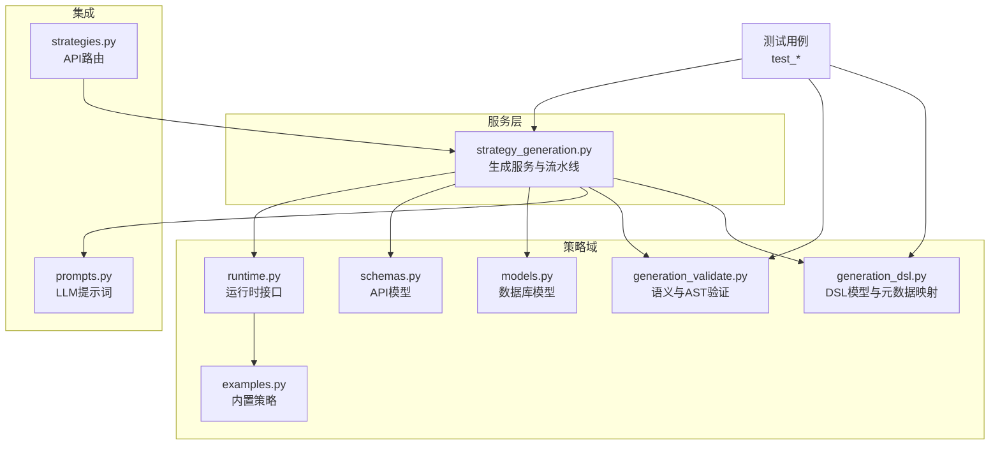
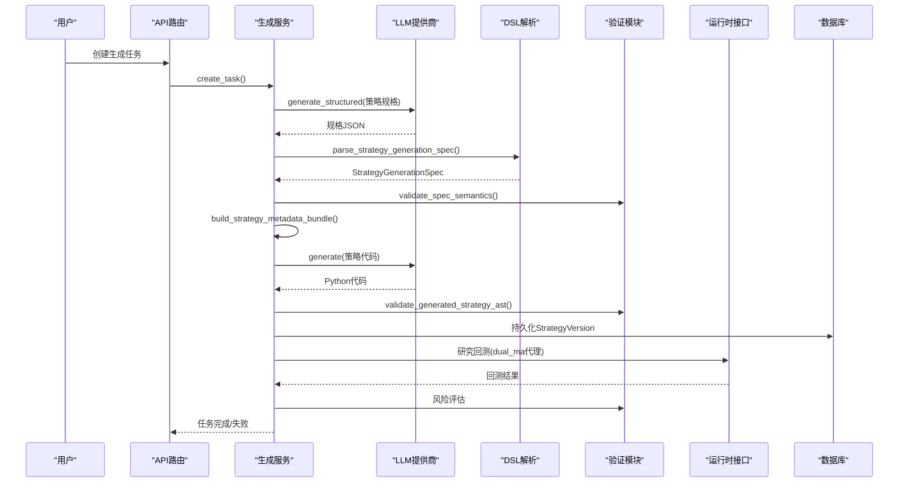
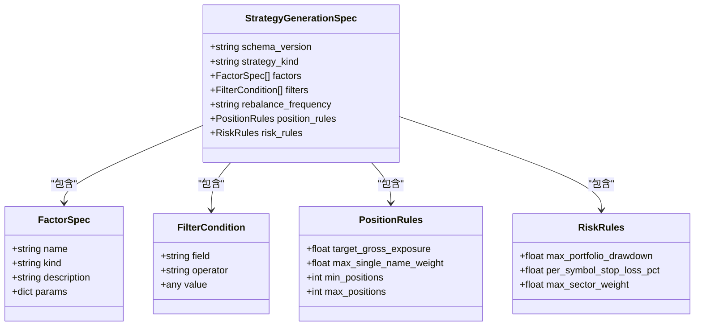
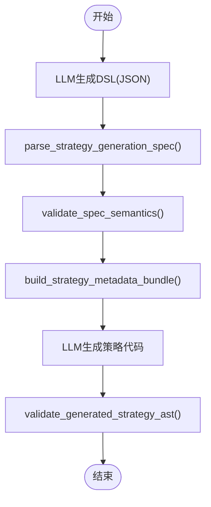
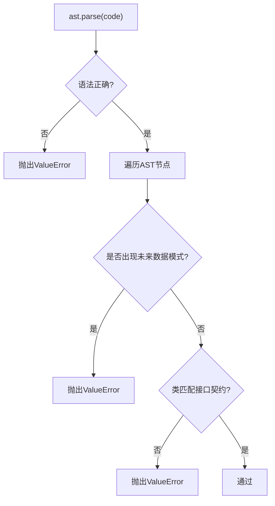
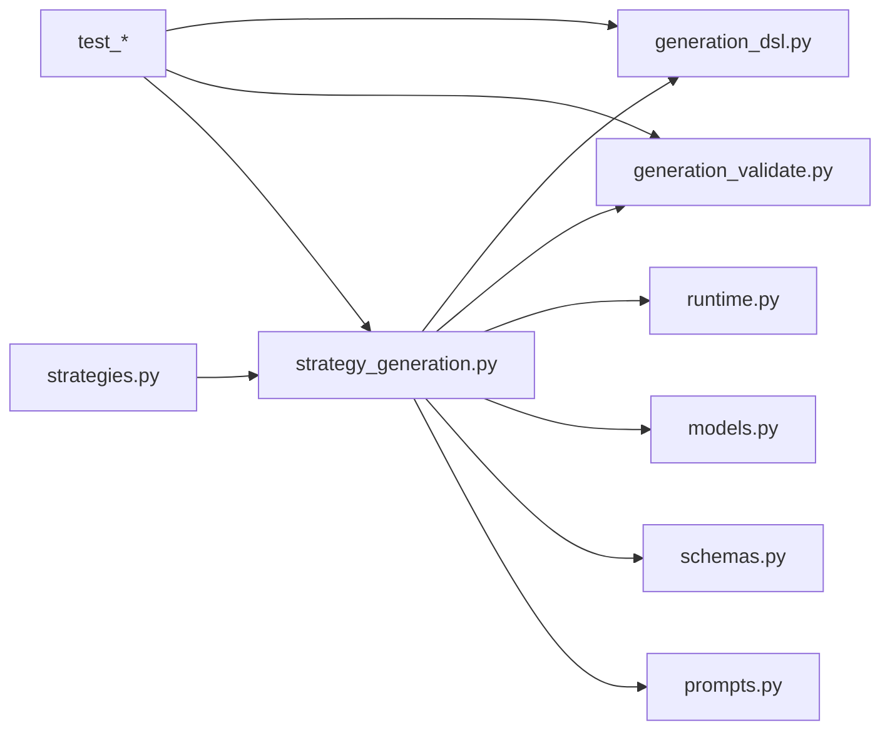

# 策略代码生成与验证

<cite>
**本文档引用的文件**
- [generation_dsl.py](file://backend/app/domains/strategy/generation_dsl.py)
- [generation_validate.py](file://backend/app/domains/strategy/generation_validate.py)
- [runtime.py](file://backend/app/domains/strategy/runtime.py)
- [examples.py](file://backend/app/domains/strategy/examples.py)
- [schemas.py](file://backend/app/domains/strategy/schemas.py)
- [models.py](file://backend/app/domains/strategy/models.py)
- [strategy_generation.py](file://backend/app/services/strategy_generation.py)
- [prompts.py](file://backend/app/integrations/llm/prompts.py)
- [strategies.py](file://backend/app/api/v1/strategies.py)
- [test_strategy_generation_dsl.py](file://backend/tests/domains/test_strategy_generation_dsl.py)
- [test_strategy_generation_validate.py](file://backend/tests/domains/test_strategy_generation_validate.py)
- [test_strategy_generation_e2e.py](file://backend/tests/services/test_strategy_generation_e2e.py)
</cite>

## 目录
1. [简介](#简介)
2. [项目结构](#项目结构)
3. [核心组件](#核心组件)
4. [架构总览](#架构总览)
5. [详细组件分析](#详细组件分析)
6. [依赖关系分析](#依赖关系分析)
7. [性能考虑](#性能考虑)
8. [故障排查指南](#故障排查指南)
9. [结论](#结论)
10. [附录](#附录)

## 简介
本文件面向“策略代码生成与验证系统”，系统目标是从自然语言描述出发，通过结构化策略DSL（领域特定语言）解析、语义校验、代码生成与AST校验、回测与风险评估、版本持久化与发布，形成可执行且合规的策略代码。本文档覆盖：
- DSL语法设计与数据模型
- 代码模板与生成流程
- 语法树构建与AST验证
- 代码验证机制：语法检查、语义分析、未来数据泄漏防护、接口契约校验
- 风险评估与兼容性测试
- 错误处理与故障定位

## 项目结构
系统主要由以下模块构成：
- DSL定义与元数据映射：generation_dsl.py
- 语义与AST验证：generation_validate.py
- 运行时接口与内置策略：runtime.py、examples.py
- 数据模型与API：models.py、schemas.py、strategies.py
- 服务编排与管道：strategy_generation.py
- LLM提示词：prompts.py
- 测试用例：test_strategy_generation_dsl.py、test_strategy_generation_validate.py、test_strategy_generation_e2e.py

图表来源
- [generation_dsl.py:1-144](file://backend/app/domains/strategy/generation_dsl.py#L1-L144)
- [generation_validate.py:1-216](file://backend/app/domains/strategy/generation_validate.py#L1-L216)
- [runtime.py:1-240](file://backend/app/domains/strategy/runtime.py#L1-L240)
- [examples.py:1-368](file://backend/app/domains/strategy/examples.py#L1-L368)
- [models.py:1-84](file://backend/app/domains/strategy/models.py#L1-L84)
- [schemas.py:1-208](file://backend/app/domains/strategy/schemas.py#L1-L208)
- [strategy_generation.py:1-584](file://backend/app/services/strategy_generation.py#L1-L584)
- [prompts.py:1-94](file://backend/app/integrations/llm/prompts.py#L1-L94)
- [strategies.py:1-605](file://backend/app/api/v1/strategies.py#L1-L605)

章节来源
- [generation_dsl.py:1-144](file://backend/app/domains/strategy/generation_dsl.py#L1-L144)
- [generation_validate.py:1-216](file://backend/app/domains/strategy/generation_validate.py#L1-L216)
- [runtime.py:1-240](file://backend/app/domains/strategy/runtime.py#L1-L240)
- [examples.py:1-368](file://backend/app/domains/strategy/examples.py#L1-L368)
- [models.py:1-84](file://backend/app/domains/strategy/models.py#L1-L84)
- [schemas.py:1-208](file://backend/app/domains/strategy/schemas.py#L1-L208)
- [strategy_generation.py:1-584](file://backend/app/services/strategy_generation.py#L1-L584)
- [prompts.py:1-94](file://backend/app/integrations/llm/prompts.py#L1-L94)
- [strategies.py:1-605](file://backend/app/api/v1/strategies.py#L1-L605)

## 核心组件
- 结构化策略DSL：定义策略类型、因子、过滤器、再平衡频率、头寸与风控规则，并提供JSON Schema与元数据映射函数。
- 语义与AST验证：对DSL进行风险画像与市场约束校验；对生成代码进行语法、接口契约与未来数据泄漏检测。
- 运行时接口：统一策略生命周期方法与数据结构，支持内置策略与外部生成策略。
- 生成服务：协调LLM结构化输出、DSL解析、验证、代码生成、静态检查、版本持久化、回测与风险评估。
- API与模型：提供策略任务、版本、事件的REST接口与数据库模型。

章节来源
- [generation_dsl.py:78-106](file://backend/app/domains/strategy/generation_dsl.py#L78-L106)
- [generation_validate.py:48-86](file://backend/app/domains/strategy/generation_validate.py#L48-L86)
- [runtime.py:175-204](file://backend/app/domains/strategy/runtime.py#L175-L204)
- [strategy_generation.py:86-374](file://backend/app/services/strategy_generation.py#L86-L374)

## 架构总览
系统采用“自然语言 → DSL规范 → 代码生成 → 静态检查 → 版本持久化 → 回测与风险评估”的流水线式架构。关键流程如下：

图表来源
- [strategy_generation.py:132-374](file://backend/app/services/strategy_generation.py#L132-L374)
- [generation_dsl.py:98-106](file://backend/app/domains/strategy/generation_dsl.py#L98-L106)
- [generation_validate.py:107-128](file://backend/app/domains/strategy/generation_validate.py#L107-L128)
- [prompts.py:57-93](file://backend/app/integrations/llm/prompts.py#L57-L93)
- [runtime.py:206-229](file://backend/app/domains/strategy/runtime.py#L206-L229)

## 详细组件分析

### DSL语法与数据模型
- 策略类型：rule、ml、portfolio
- 因子种类：momentum、value、quality、volatility、size、custom
- 过滤器操作符：eq、ne、gt、gte、lt、lte、between、in
- 再平衡频率：1d、1w、2w、1m
- 关键模型：
  - FactorSpec：名称、种类、描述、参数字典
  - FilterCondition：字段、操作符、值（列表或标量）
  - PositionRules：总杠杆、单只权重上限、最小/最大持仓数
  - RiskRules：最大组合回撤、个股止损、行业权重上限
  - StrategyGenerationSpec：根文档，包含上述字段与校验逻辑
- 元数据映射：build_strategy_metadata_bundle将DSL映射为历史兼容的元数据键，便于持久化与UI展示

图表来源
- [generation_dsl.py:20-96](file://backend/app/domains/strategy/generation_dsl.py#L20-L96)

章节来源
- [generation_dsl.py:14-144](file://backend/app/domains/strategy/generation_dsl.py#L14-L144)

### 代码生成与模板系统
- LLM提示词：
  - 系统提示：要求生成继承自RuleBasedStrategy的Python类，仅使用标准库与numpy/pandas，禁止未来数据泄漏，返回[-1,1]的目标权重。
  - 用户提示：包含市场、风险画像与自然语言描述。
  - DSL规范提示：要求输出符合StrategyGenerationSpec的JSON对象。
- 生成流程：
  - 先调用LLM生成结构化DSL，解析并校验
  - 基于DSL构建元数据
  - 再调用LLM生成策略代码，附加已验证的DSL作为一致性约束
  - 对生成代码进行AST解析与接口契约校验

图表来源
- [strategy_generation.py:445-514](file://backend/app/services/strategy_generation.py#L445-L514)
- [prompts.py:1-94](file://backend/app/integrations/llm/prompts.py#L1-L94)

章节来源
- [strategy_generation.py:445-514](file://backend/app/services/strategy_generation.py#L445-L514)
- [prompts.py:27-93](file://backend/app/integrations/llm/prompts.py#L27-L93)

### 语法树构建与AST验证
- 语法检查：捕获语法错误并抛出异常
- 接口契约校验：确保至少存在一个类，且该类继承自RuleBasedStrategy或BaseStrategy，并实现generate_signals与对应的风险/再平衡方法
- 未来数据泄漏防护：禁止负移位、负周期差分/涨跌幅、负滚动等典型模式

图表来源
- [generation_validate.py:107-128](file://backend/app/domains/strategy/generation_validate.py#L107-L128)
- [generation_validate.py:154-216](file://backend/app/domains/strategy/generation_validate.py#L154-L216)

章节来源
- [generation_validate.py:107-216](file://backend/app/domains/strategy/generation_validate.py#L107-L216)

### 代码验证机制
- 语法检查：基于ast.parse，捕获SyntaxError
- 语义分析：校验风险画像与市场限制、因子参数范围、过滤器字段是否指向未来数据
- 性能评估：通过研究回测（dual_ma代理）产出夏普比率、最大回撤、年化收益等指标
- 安全扫描：AST层面的未来数据泄漏检测
- 兼容性测试：接口契约校验（RuleBasedStrategy或BaseStrategy）

章节来源
- [generation_validate.py:48-86](file://backend/app/domains/strategy/generation_validate.py#L48-L86)
- [strategy_generation.py:207-262](file://backend/app/services/strategy_generation.py#L207-L262)

### 风险评估与发布
- 风险阈值：按风险画像设定最大回撤上限与最低夏普阈值
- 发布流程：通过风险评估后，更新策略状态为backtesting，持久化版本并广播事件

章节来源
- [strategy_generation.py:516-536](file://backend/app/services/strategy_generation.py#L516-L536)
- [strategies.py:301-314](file://backend/app/api/v1/strategies.py#L301-L314)

## 依赖关系分析

图表来源
- [strategy_generation.py:1-584](file://backend/app/services/strategy_generation.py#L1-L584)
- [generation_dsl.py:1-144](file://backend/app/domains/strategy/generation_dsl.py#L1-L144)
- [generation_validate.py:1-216](file://backend/app/domains/strategy/generation_validate.py#L1-L216)
- [runtime.py:1-240](file://backend/app/domains/strategy/runtime.py#L1-L240)
- [models.py:1-84](file://backend/app/domains/strategy/models.py#L1-L84)
- [schemas.py:1-208](file://backend/app/domains/strategy/schemas.py#L1-L208)
- [prompts.py:1-94](file://backend/app/integrations/llm/prompts.py#L1-L94)
- [strategies.py:1-605](file://backend/app/api/v1/strategies.py#L1-L605)

章节来源
- [strategy_generation.py:1-584](file://backend/app/services/strategy_generation.py#L1-L584)
- [strategies.py:1-605](file://backend/app/api/v1/strategies.py#L1-L605)

## 性能考虑
- LLM调用成本控制：温度参数设为较低值，减少随机性；结构化输出避免重复修正
- 验证开销：AST遍历与正则匹配在生成阶段一次性完成，避免运行期重复校验
- 回测优化：使用dual_ma代理快速评估，避免复杂策略带来的计算负担
- 数据访问：通过数据库模型与查询优化，减少不必要的I/O

## 故障排查指南
- DSL解析失败：检查输入JSON是否符合StrategyGenerationSpec的字段与类型约束
- 语义校验失败：核对风险画像与市场限制、因子窗口参数范围、过滤器字段命名
- AST校验失败：检查是否使用了负移位、负周期差分/涨跌幅、负滚动等未来数据泄漏模式
- 回测失败：确认是否有足够的历史K线数据，以及回测引擎配置是否正确
- 发布失败：确认风险评估是否通过，策略状态是否被重置为draft

章节来源
- [test_strategy_generation_validate.py:1-148](file://backend/tests/domains/test_strategy_generation_validate.py#L1-L148)
- [test_strategy_generation_e2e.py:1-247](file://backend/tests/services/test_strategy_generation_e2e.py#L1-L247)

## 结论
本系统通过严格的DSL建模、LLM结构化输出与多层验证（语法、语义、AST、接口契约、未来数据泄漏），实现了从自然语言到可执行策略代码的可靠转换。结合研究回测与风险评估，确保策略在进入实盘前具备基本的质量与合规性。建议持续完善内置策略库与特征溯源体系，以提升策略复用与可解释性。

## 附录

### DSL语法示例与生成规则
- 示例：规则型策略，包含动量因子与价值过滤器，再平衡频率为1周，头寸与风控规则与风险画像对齐
- 生成规则：
  - 先生成DSL JSON并通过parse_strategy_generation_spec解析
  - 使用validate_spec_semantics进行风险与市场约束校验
  - 通过build_strategy_metadata_bundle生成元数据
  - 将已验证的DSL JSON附加到用户提示词，驱动LLM生成策略代码
  - validate_generated_strategy_ast进行语法与接口契约校验

章节来源
- [test_strategy_generation_dsl.py:17-127](file://backend/tests/domains/test_strategy_generation_dsl.py#L17-L127)
- [strategy_generation.py:445-514](file://backend/app/services/strategy_generation.py#L445-L514)

### 验证规则集
- 风险画像与市场限制：单只权重上限、最大回撤上限、允许市场集合
- 因子参数校验：窗口/回看期必须为有限数值且在合理范围内
- 过滤器字段：禁止包含未来时间戳或前瞻字段名
- AST规则：禁止负移位、负周期差分/涨跌幅、负滚动等

章节来源
- [generation_validate.py:20-86](file://backend/app/domains/strategy/generation_validate.py#L20-L86)
- [generation_validate.py:154-216](file://backend/app/domains/strategy/generation_validate.py#L154-L216)

### 错误处理策略
- 统一异常类型：ValueError用于校验失败，LLMException用于LLM交互失败
- 失败阶段识别：根据异常信息分类至静态检查、代码生成、回测或流水线阶段
- 状态回滚：失败时将策略状态重置为draft，并记录PipelineEvent

章节来源
- [strategy_generation.py:308-373](file://backend/app/services/strategy_generation.py#L308-L373)