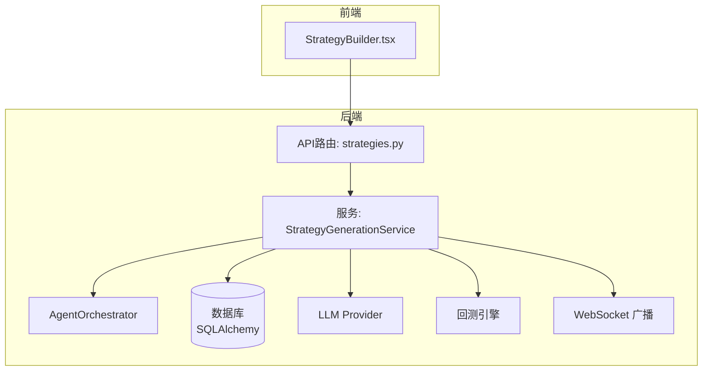
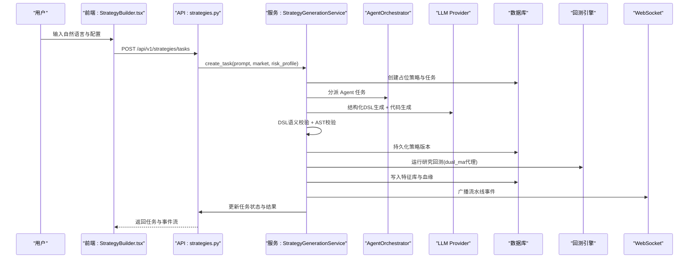
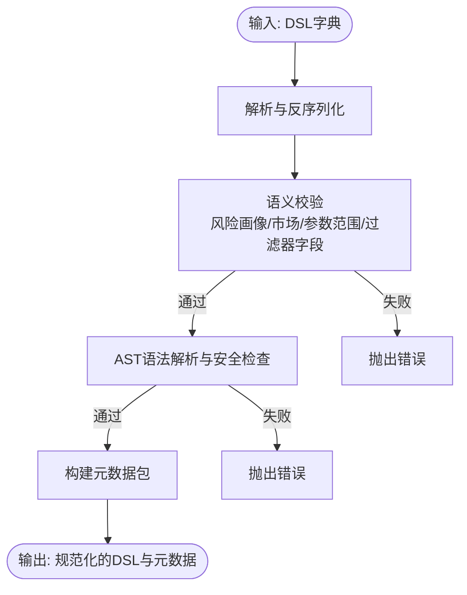
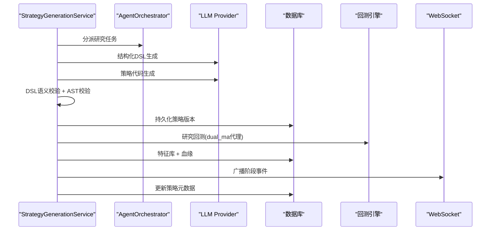
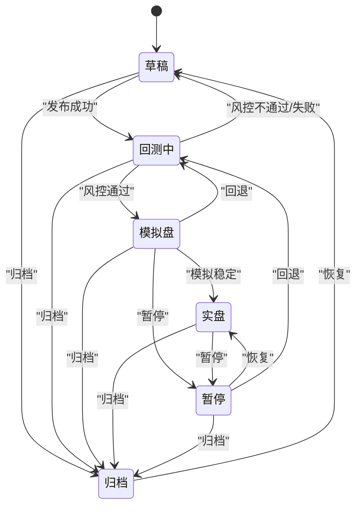
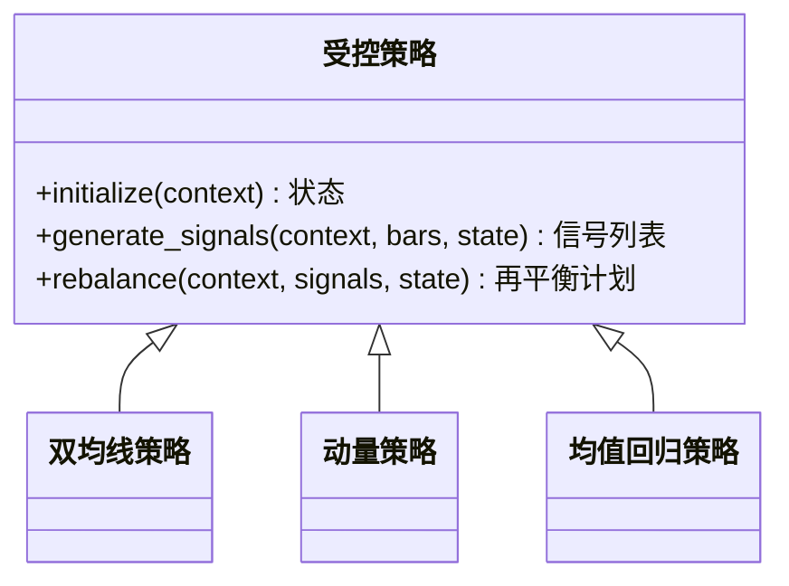
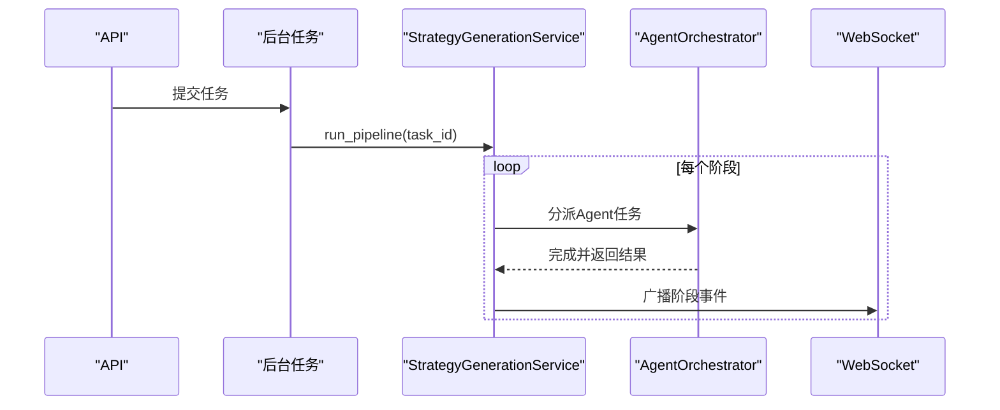
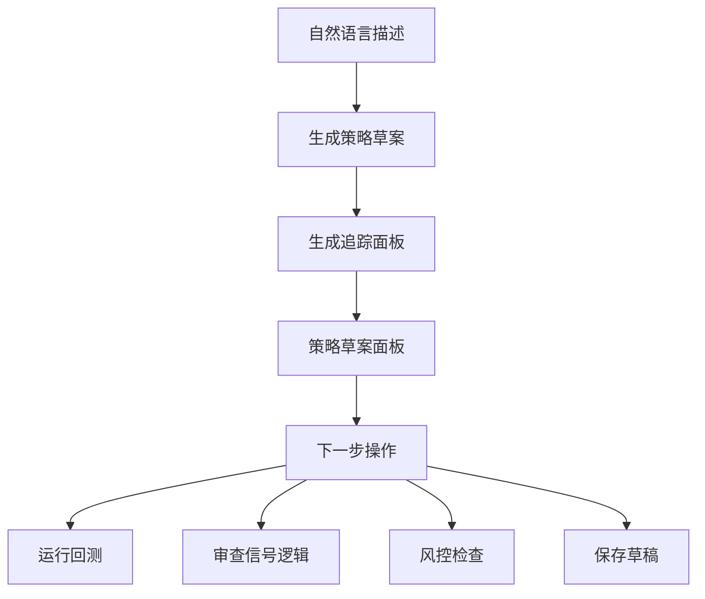
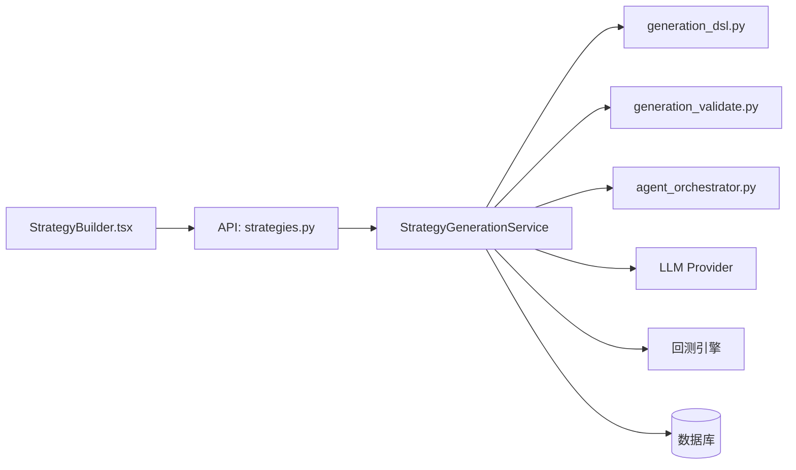

# 策略工厂系统

<cite>
**本文引用的文件**
- [generation_dsl.py](file://backend/app/domains/strategy/generation_dsl.py)
- [generation_validate.py](file://backend/app/domains/strategy/generation_validate.py)
- [state_machine.py](file://backend/app/domains/strategy/state_machine.py)
- [strategy_generation.py](file://backend/app/services/strategy_generation.py)
- [strategy_generation_research.py](file://backend/app/services/strategy_generation_research.py)
- [models.py](file://backend/app/domains/strategy/models.py)
- [schemas.py](file://backend/app/domains/strategy/schemas.py)
- [strategies.py](file://backend/app/api/v1/strategies.py)
- [agent_orchestrator.py](file://backend/app/services/agent_orchestrator.py)
- [celery_app.py](file://backend/app/tasks/celery_app.py)
- [prompts.py](file://backend/app/integrations/llm/prompts.py)
- [examples.py](file://backend/app/domains/strategy/examples.py)
- [test_strategy_generation_dsl.py](file://backend/tests/domains/test_strategy_generation_dsl.py)
- [test_strategy_generation_e2e.py](file://backend/tests/services/test_strategy_generation_e2e.py)
- [StrategyBuilder.tsx](file://frontend/src/screens/Strategy/StrategyBuilder.tsx)
</cite>

## 目录
1. [简介](#简介)
2. [项目结构](#项目结构)
3. [核心组件](#核心组件)
4. [架构总览](#架构总览)
5. [详细组件分析](#详细组件分析)
6. [依赖分析](#依赖分析)
7. [性能考虑](#性能考虑)
8. [故障排查指南](#故障排查指南)
9. [结论](#结论)
10. [附录](#附录)

## 简介
策略工厂系统旨在实现“自然语言到策略代码”的自动化流水线，通过多智能体协作（研究、策略、风控、回测）与严格的DSL语法与代码验证，将用户意图转化为可执行、可审计、可回测的策略资产。系统提供策略生命周期管理（草稿、研究中、回测中、模拟盘、实盘、暂停）、策略模板系统、任务调度与事件驱动的状态转换，并通过WebSocket广播实时反馈流水线进度。

## 项目结构
后端采用分层架构：API路由层负责对外接口与状态查询；服务层编排流水线；领域模型与模式定义策略、版本、任务与流水线事件；集成层对接LLM与市场数据；前端通过WebSocket订阅事件并驱动UI交互。

图表来源
- [strategies.py](file://backend/app/api/v1/strategies.py)
- [strategy_generation.py](file://backend/app/services/strategy_generation.py)
- [agent_orchestrator.py](file://backend/app/services/agent_orchestrator.py)
- [models.py](file://backend/app/domains/strategy/models.py)

章节来源
- [strategies.py](file://backend/app/api/v1/strategies.py)
- [models.py](file://backend/app/domains/strategy/models.py)

## 核心组件
- 策略DSL与校验：定义策略意图的结构化规范与语义/AST校验规则，确保生成代码与DSL一致且无未来数据泄漏。
- 策略生成服务：编排研究扫描、DSL生成、代码生成、静态校验、版本持久化、研究回测、风险评估与最终发布。
- 状态机：定义策略生命周期状态与合法转换，支持手动与自动推进。
- 模板与示例：内置受控策略示例与模板，支撑快速研究与参数映射。
- 任务与消息：Agent编排与消息传递，流水线事件持久化与WebSocket广播。
- 前端交互：可视化流水线追踪、策略草案生成与下一步动作引导。

章节来源
- [generation_dsl.py](file://backend/app/domains/strategy/generation_dsl.py)
- [generation_validate.py](file://backend/app/domains/strategy/generation_validate.py)
- [strategy_generation.py](file://backend/app/services/strategy_generation.py)
- [state_machine.py](file://backend/app/domains/strategy/state_machine.py)
- [examples.py](file://backend/app/domains/strategy/examples.py)
- [agent_orchestrator.py](file://backend/app/services/agent_orchestrator.py)
- [strategies.py](file://backend/app/api/v1/strategies.py)

## 架构总览
策略工厂系统围绕“自然语言 → DSL → 代码 → 回测 → 风控 → 发布”的主路径展开，同时提供模板与内置策略作为研究代理，保障生成策略的可验证性与安全性。

图表来源
- [strategies.py](file://backend/app/api/v1/strategies.py)
- [strategy_generation.py](file://backend/app/services/strategy_generation.py)
- [agent_orchestrator.py](file://backend/app/services/agent_orchestrator.py)
- [prompts.py](file://backend/app/integrations/llm/prompts.py)
- [strategy_generation_research.py](file://backend/app/services/strategy_generation_research.py)

## 详细组件分析

### 策略DSL与语义校验
- DSL定义：策略类型、因子、过滤器、再平衡频率、头寸与风控规则，严格禁止未知键，保证下游契约稳定。
- 语义校验：结合风险画像与市场限制，校验单券权重上限、最大回撤上限、因子参数范围与过滤器字段是否包含未来信息片段。
- AST校验：拒绝负移位、负期数差分/涨跌幅、负滚动等典型未来数据泄漏模式，确保生成代码不使用未来信息。
- 元数据映射：将DSL映射为兼容旧版的元数据键，便于持久化与UI展示。

图表来源
- [generation_dsl.py](file://backend/app/domains/strategy/generation_dsl.py)
- [generation_validate.py](file://backend/app/domains/strategy/generation_validate.py)

章节来源
- [generation_dsl.py](file://backend/app/domains/strategy/generation_dsl.py)
- [generation_validate.py](file://backend/app/domains/strategy/generation_validate.py)
- [test_strategy_generation_dsl.py](file://backend/tests/domains/test_strategy_generation_dsl.py)

### 策略生成服务与流水线
- 任务创建：创建队列化任务，记录跟踪ID与创建者，向审计与前端广播初始事件。
- 流水线阶段：
  - 研究扫描：触发Agent进行宏观/板块轮动扫描。
  - 代码生成：先生成结构化DSL，再生成Python策略类，要求满足接口契约。
  - 静态检查：AST解析、DSL语义、策略接口、未来数据防护。
  - 版本持久化：保存代码快照与参数/风控规则。
  - 研究回测：以内置双均线代理策略映射DSL参数，执行研究回测并写入特征库与血缘。
  - 风控评估：根据风险画像设定最大回撤与夏普阈值。
  - 最终发布：更新策略元数据，标记为“回测中”，持久化结果并广播完成事件。
- 失败处理：根据异常类型分类失败阶段，记录PipelineEvent，回滚策略状态为“草稿”。

图表来源
- [strategy_generation.py](file://backend/app/services/strategy_generation.py)
- [agent_orchestrator.py](file://backend/app/services/agent_orchestrator.py)
- [prompts.py](file://backend/app/integrations/llm/prompts.py)
- [strategy_generation_research.py](file://backend/app/services/strategy_generation_research.py)

章节来源
- [strategy_generation.py](file://backend/app/services/strategy_generation.py)
- [test_strategy_generation_e2e.py](file://backend/tests/services/test_strategy_generation_e2e.py)

### 策略生命周期与状态转换
- 生命周期：草稿 → 研究中 → 回测中 → 模拟盘 → 实盘 → 暂停 → 归档（支持回退与恢复）。
- 合法转换：通过状态机校验，避免非法跳转；支持手动推进与事件驱动推进。
- API支持：提供状态变更接口，记录PipelineEvent用于审计与追踪。

图表来源
- [state_machine.py](file://backend/app/domains/strategy/state_machine.py)
- [strategies.py](file://backend/app/api/v1/strategies.py)

章节来源
- [state_machine.py](file://backend/app/domains/strategy/state_machine.py)
- [strategies.py](file://backend/app/api/v1/strategies.py)

### 策略模板与内置示例
- 内置策略：双均线、动量、均值回归等受控策略，参数由DSL映射而来，用于研究代理与参数探索。
- 模板系统：策略模板表支持按风险等级、市场、家族与描述存储，前端可直接调用。

图表来源
- [examples.py](file://backend/app/domains/strategy/examples.py)

章节来源
- [examples.py](file://backend/app/domains/strategy/examples.py)
- [models.py](file://backend/app/domains/strategy/models.py)

### 任务调度与事件驱动
- 异步任务：后台异步运行流水线，避免阻塞API响应。
- Agent编排：按角色分派任务，发送消息，记录AgentTask与AgentMessage。
- 事件持久化：PipelineEvent记录每个阶段的事件、进度与详情。
- WebSocket广播：统一推送策略事件至前端，支持实时追踪与日志聚合。

图表来源
- [strategies.py](file://backend/app/api/v1/strategies.py)
- [strategy_generation.py](file://backend/app/services/strategy_generation.py)
- [agent_orchestrator.py](file://backend/app/services/agent_orchestrator.py)
- [celery_app.py](file://backend/app/tasks/celery_app.py)

章节来源
- [strategies.py](file://backend/app/api/v1/strategies.py)
- [strategy_generation.py](file://backend/app/services/strategy_generation.py)
- [agent_orchestrator.py](file://backend/app/services/agent_orchestrator.py)
- [celery_app.py](file://backend/app/tasks/celery_app.py)

### 前端交互与可视化
- 生成追踪：显示各Agent阶段状态与进度，支持切换原始日志。
- 策略草案：汇总信号定义、入场/出场规则、调仓频率、仓位管理与风控约束。
- 下一步操作：一键进入回测、审查信号逻辑、风控检查或保存草稿。

图表来源
- [StrategyBuilder.tsx](file://frontend/src/screens/Strategy/StrategyBuilder.tsx)

章节来源
- [StrategyBuilder.tsx](file://frontend/src/screens/Strategy/StrategyBuilder.tsx)

## 依赖分析
- 组件耦合：服务层依赖DSL/校验模块、Agent编排、LLM提供者、回测引擎与数据库；API层仅暴露轻量接口，职责清晰。
- 外部依赖：Redis/Celery用于任务调度与定时任务；LLM提供者（OpenAI/Anthropic/Mock）用于结构化输出与自由文本生成。
- 循环依赖：未发现循环导入；模块间通过服务接口解耦。

图表来源
- [strategy_generation.py](file://backend/app/services/strategy_generation.py)
- [generation_dsl.py](file://backend/app/domains/strategy/generation_dsl.py)
- [generation_validate.py](file://backend/app/domains/strategy/generation_validate.py)
- [agent_orchestrator.py](file://backend/app/services/agent_orchestrator.py)
- [strategies.py](file://backend/app/api/v1/strategies.py)

章节来源
- [strategy_generation.py](file://backend/app/services/strategy_generation.py)
- [strategies.py](file://backend/app/api/v1/strategies.py)

## 性能考虑
- 异步流水线：后台任务避免阻塞请求，提升吞吐。
- 任务优先级与并发：可通过AgentTask优先级与Celery队列隔离不同阶段负载。
- 数据访问：批量查询与分页列表接口减少一次性数据传输压力。
- 回测代理：使用内置受控策略进行研究回测，降低首次生成成本与风险。

## 故障排查指南
- 任务失败定位：根据异常关键词识别失败阶段（如“backtest”、“validation”、“generation”），并查看对应PipelineEvent。
- 风控不通过：检查最大回撤与夏普比率阈值是否超出风险画像限制。
- 数据缺失：研究回测需具备足够交易日数据，否则会报错提示导入数据。
- 代码校验失败：检查生成代码是否满足策略接口契约与未来数据防护规则。

章节来源
- [strategy_generation.py](file://backend/app/services/strategy_generation.py)
- [test_strategy_generation_e2e.py](file://backend/tests/services/test_strategy_generation_e2e.py)

## 结论
策略工厂系统通过严格的DSL与代码校验、受控的Agent协作与事件驱动的流水线，实现了从自然语言到可回测策略的高可靠转化。配合生命周期管理与模板系统，既保证了生成质量，也提升了研发效率与可审计性。建议在生产环境中结合监控与告警，持续优化LLM提示词与校验规则，以进一步提升稳定性与泛化能力。

## 附录

### 使用场景与最佳实践
- 场景一：A股价值策略研究
  - 输入：自然语言描述（如“构造一个A股价值精选策略，20日动量过滤，等权top分位”）
  - 步骤：创建任务 → 研究扫描 → DSL生成 → 代码生成 → 静态校验 → 版本持久化 → 研究回测 → 风控评估 → 发布
  - 关键点：确保市场与风险画像匹配；过滤器字段避免未来信息片段；因子窗口参数在合理范围内
- 场景二：多因子动量策略
  - 输入：多因子组合（动量/价值/质量/波动率），设置再平衡频率与头寸规则
  - 步骤：DSL映射 → 代码生成 → AST校验 → 研究回测（双均线代理）→ 特征库与血缘
  - 关键点：关注单券权重上限与最大回撤上限；参数范围校验（窗口1~252）

章节来源
- [strategy_generation.py](file://backend/app/services/strategy_generation.py)
- [strategy_generation_research.py](file://backend/app/services/strategy_generation_research.py)
- [generation_validate.py](file://backend/app/domains/strategy/generation_validate.py)

### 配置选项速查
- 市场与风险画像
  - 市场：A / US / HK / crypto
  - 风险画像：conservative（最大回撤上限0.12）/ balanced（0.20）/ aggressive（0.35）
- DSL字段要点
  - 因子：name（ASCII字母、数字、下划线，最长64）、kind（动量/价值/质量/波动率/规模/自定义）、params（窗口/回看/天/周期等数值1~252）
  - 过滤器：field（区分大小写）、operator（eq/ne/gt/gte/lt/lte/between/in）、value（标量或列表）
  - 头寸规则：目标总敞口、单券权重上限、最小/最大持仓数
  - 风控规则：最大组合回撤、单标止损百分比、行业权重上限
- 回测代理参数映射
  - 双均线：短窗/长窗、最大持仓、目标总敞口，依据动量因子窗口推导

章节来源
- [generation_dsl.py](file://backend/app/domains/strategy/generation_dsl.py)
- [generation_validate.py](file://backend/app/domains/strategy/generation_validate.py)
- [strategy_generation_research.py](file://backend/app/services/strategy_generation_research.py)