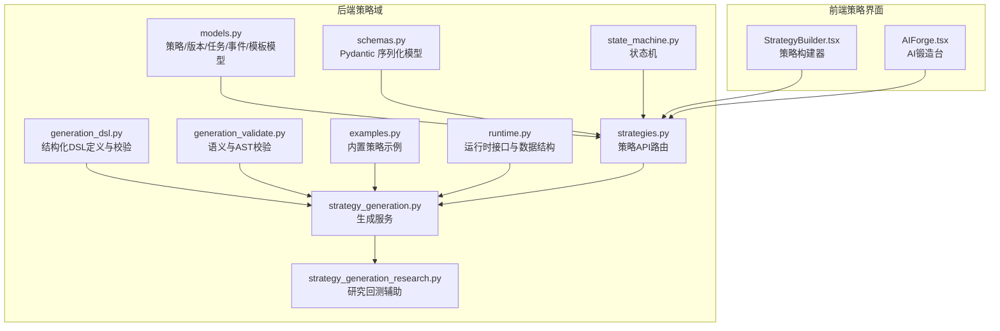
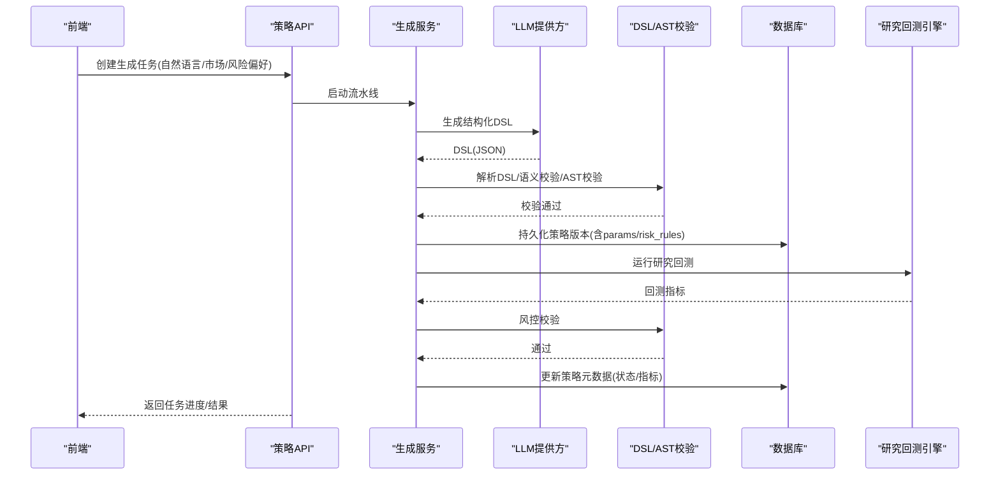
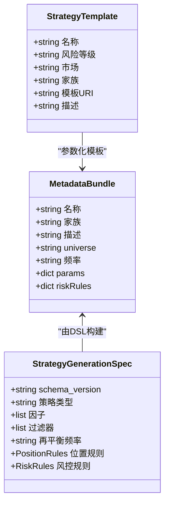
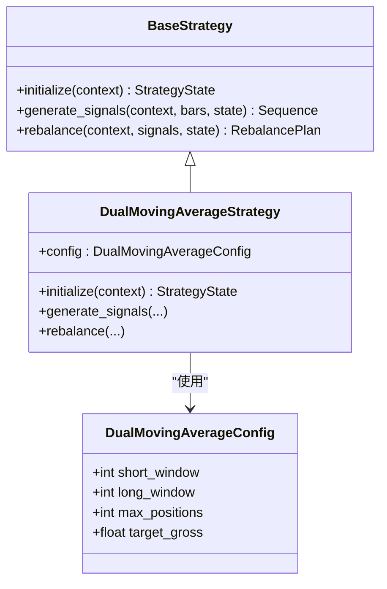
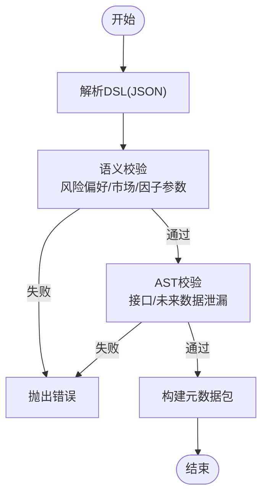
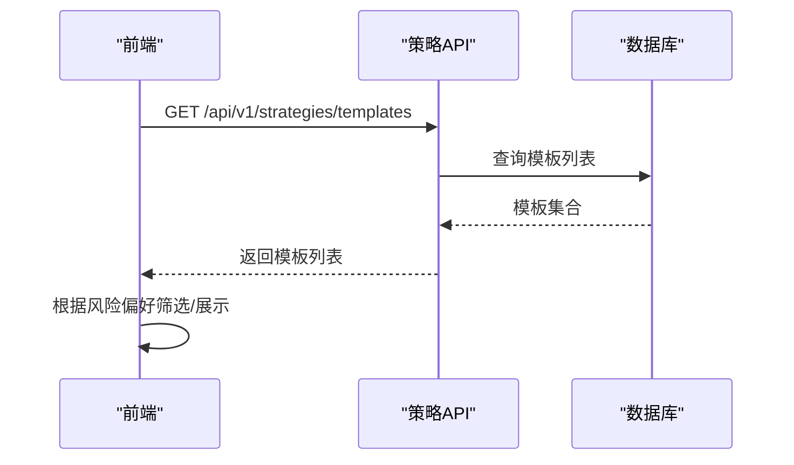
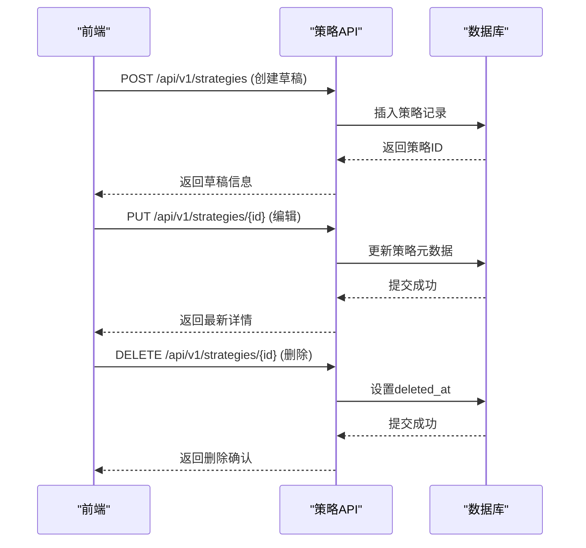
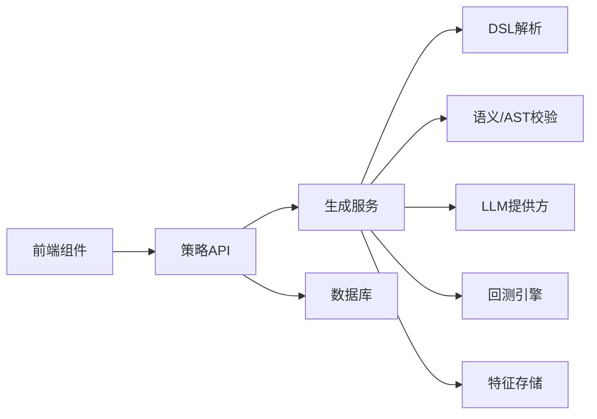

# 策略模板系统与预设配置

<cite>
**本文引用的文件列表**
- [models.py](file://backend/app/domains/strategy/models.py)
- [schemas.py](file://backend/app/domains/strategy/schemas.py)
- [generation_dsl.py](file://backend/app/domains/strategy/generation_dsl.py)
- [generation_validate.py](file://backend/app/domains/strategy/generation_validate.py)
- [examples.py](file://backend/app/domains/strategy/examples.py)
- [runtime.py](file://backend/app/domains/strategy/runtime.py)
- [state_machine.py](file://backend/app/domains/strategy/state_machine.py)
- [strategies.py](file://backend/app/api/v1/strategies.py)
- [strategy_generation.py](file://backend/app/services/strategy_generation.py)
- [strategy_generation_research.py](file://backend/app/services/strategy_generation_research.py)
- [StrategyBuilder.tsx](file://frontend/src/screens/Strategy/StrategyBuilder.tsx)
- [AIForge.tsx](file://frontend/src/screens/Strategy/AIForge.tsx)
- [test_strategy_generation_dsl.py](file://backend/tests/domains/test_strategy_generation_dsl.py)
- [test_strategy_generation_validate.py](file://backend/tests/domains/test_strategy_generation_validate.py)
</cite>

## 目录
1. [简介](#简介)
2. [项目结构](#项目结构)
3. [核心组件](#核心组件)
4. [架构总览](#架构总览)
5. [详细组件分析](#详细组件分析)
6. [依赖关系分析](#依赖关系分析)
7. [性能考量](#性能考量)
8. [故障排查指南](#故障排查指南)
9. [结论](#结论)
10. [附录](#附录)

## 简介
本文件面向策略模板系统与预设配置，系统性阐述策略模板的设计理念、实现机制与使用流程。内容涵盖：
- 模板分类体系与参数化模板
- 模板继承机制与动态配置
- 预设策略模板的管理（创建、编辑、删除、版本控制）
- 模板语法规范、参数验证规则、模板渲染机制与模板库管理
- 前后端协同的流水线式生成与回测验证

## 项目结构
策略模板系统位于后端策略域（domains/strategy），由数据模型、DSL 规范、验证器、运行时接口、API 控制器与服务层共同组成，并通过前端组件提供交互入口。

图表来源
- [models.py:1-84](file://backend/app/domains/strategy/models.py#L1-L84)
- [schemas.py:1-208](file://backend/app/domains/strategy/schemas.py#L1-L208)
- [generation_dsl.py:1-144](file://backend/app/domains/strategy/generation_dsl.py#L1-L144)
- [generation_validate.py:1-216](file://backend/app/domains/strategy/generation_validate.py#L1-L216)
- [examples.py:1-368](file://backend/app/domains/strategy/examples.py#L1-L368)
- [runtime.py:1-240](file://backend/app/domains/strategy/runtime.py#L1-L240)
- [state_machine.py:1-23](file://backend/app/domains/strategy/state_machine.py#L1-L23)
- [strategies.py:1-605](file://backend/app/api/v1/strategies.py#L1-L605)
- [strategy_generation.py:1-584](file://backend/app/services/strategy_generation.py#L1-L584)
- [strategy_generation_research.py:1-81](file://backend/app/services/strategy_generation_research.py#L1-L81)
- [StrategyBuilder.tsx:1-808](file://frontend/src/screens/Strategy/StrategyBuilder.tsx#L1-L808)
- [AIForge.tsx:1-284](file://frontend/src/screens/Strategy/AIForge.tsx#L1-L284)

章节来源
- [models.py:1-84](file://backend/app/domains/strategy/models.py#L1-L84)
- [schemas.py:1-208](file://backend/app/domains/strategy/schemas.py#L1-L208)
- [strategies.py:1-605](file://backend/app/api/v1/strategies.py#L1-L605)

## 核心组件
- 数据模型与状态机
  - 策略主记录、版本、任务、流水线事件、模板模型，支撑策略全生命周期与版本化管理。
  - 状态机定义了草稿、研究、回测、模拟盘、实盘、暂停、归档之间的合法转换。
- 结构化DSL与验证
  - DSL 定义策略种类、因子、过滤器、再平衡频率、头寸规则与风控规则，严格禁止未知键。
  - 语义校验确保与风险偏好、市场限制一致；AST 校验阻断未来数据泄漏与接口不匹配。
- 运行时接口
  - 统一的策略运行时接口（BaseStrategy）与数据结构（上下文、信号、目标头寸、再平衡计划），支持规则型与机器学习型策略。
- 服务与API
  - 生成服务编排流水线：研究扫描、代码生成、静态与接口校验、持久化版本、研究回测、风控校验、更新策略元数据。
  - API 提供策略查询、任务管理、事件流、状态迁移、模板列表等能力。
- 前端交互
  - 策略构建器与AI锻造台提供自然语言输入、实时追踪、模板筛选与生成结果预览。

章节来源
- [models.py:9-84](file://backend/app/domains/strategy/models.py#L9-L84)
- [state_machine.py:1-23](file://backend/app/domains/strategy/state_machine.py#L1-L23)
- [generation_dsl.py:1-144](file://backend/app/domains/strategy/generation_dsl.py#L1-L144)
- [generation_validate.py:1-216](file://backend/app/domains/strategy/generation_validate.py#L1-L216)
- [runtime.py:175-240](file://backend/app/domains/strategy/runtime.py#L175-L240)
- [strategies.py:160-605](file://backend/app/api/v1/strategies.py#L160-L605)
- [strategy_generation.py:86-584](file://backend/app/services/strategy_generation.py#L86-L584)
- [StrategyBuilder.tsx:1-808](file://frontend/src/screens/Strategy/StrategyBuilder.tsx#L1-L808)
- [AIForge.tsx:1-284](file://frontend/src/screens/Strategy/AIForge.tsx#L1-L284)

## 架构总览
策略模板系统采用“自然语言 → 结构化DSL → 代码生成 → 静态/接口校验 → 版本持久化 → 研究回测 → 风控校验 → 策略元数据更新”的流水线架构。

图表来源
- [strategy_generation.py:132-373](file://backend/app/services/strategy_generation.py#L132-L373)
- [generation_dsl.py:98-106](file://backend/app/domains/strategy/generation_dsl.py#L98-L106)
- [generation_validate.py:107-216](file://backend/app/domains/strategy/generation_validate.py#L107-L216)
- [strategies.py:301-334](file://backend/app/api/v1/strategies.py#L301-L334)

## 详细组件分析

### 模板分类体系与参数化模板
- 模板分类
  - 模板模型包含名称、风险等级、市场、家族（family）、模板URI与描述，用于预设模板的组织与检索。
- 参数化模板
  - 生成服务将DSL解析为元数据包，其中包含params（完整DSL字典）与riskRules（风控规则），作为模板参数的载体。
  - 元数据映射函数根据首个因子种类推导家族，结合提示词片段与显示种子生成名称、描述、市场与频率等字段。

图表来源
- [models.py:73-84](file://backend/app/domains/strategy/models.py#L73-L84)
- [generation_dsl.py:78-96](file://backend/app/domains/strategy/generation_dsl.py#L78-L96)
- [generation_dsl.py:108-144](file://backend/app/domains/strategy/generation_dsl.py#L108-L144)

章节来源
- [models.py:73-84](file://backend/app/domains/strategy/models.py#L73-L84)
- [generation_dsl.py:108-144](file://backend/app/domains/strategy/generation_dsl.py#L108-L144)

### 模板继承机制与动态配置
- 继承机制
  - 运行时接口定义了BaseStrategy抽象类，具体策略通过实现generate_signals与rebalance方法参与流水线。
  - 内置策略示例展示了如何通过配置对象（如DualMovingAverageConfig）注入参数，形成“模板化”的可配置策略。
- 动态配置
  - 生成服务将DSL中的位置规则与风控规则写入StrategyVersion的params_schema与risk_rules字段，实现动态配置的持久化与复用。
  - 前端通过策略详情读取这些字段，动态渲染信号逻辑摘要与参数说明。

图表来源
- [runtime.py:175-204](file://backend/app/domains/strategy/runtime.py#L175-L204)
- [examples.py:21-49](file://backend/app/domains/strategy/examples.py#L21-L49)
- [examples.py:51-200](file://backend/app/domains/strategy/examples.py#L51-L200)

章节来源
- [runtime.py:175-204](file://backend/app/domains/strategy/runtime.py#L175-L204)
- [examples.py:21-200](file://backend/app/domains/strategy/examples.py#L21-L200)

### 模板语法规范与参数验证规则
- DSL语法规范
  - 禁止未知键（extra="forbid"），确保下游管道的稳定契约。
  - 因子规格包含名称、类型、描述与参数字典；过滤器支持多种比较运算符，且对"between"与"in"有特定格式要求。
  - 位置规则与风控规则包含严格的数值范围约束与相互关系校验。
- 语义与AST验证
  - 语义校验：校验风险偏好上限、市场枚举、因子窗口参数范围、过滤字段是否包含未来导向关键词。
  - AST校验：阻断负移位、负期数变化、负滚动等典型未来数据泄漏模式；确保生成类满足BaseStrategy或RuleBasedStrategy接口约定。

图表来源
- [generation_dsl.py:98-106](file://backend/app/domains/strategy/generation_dsl.py#L98-L106)
- [generation_validate.py:48-87](file://backend/app/domains/strategy/generation_validate.py#L48-L87)
- [generation_validate.py:107-216](file://backend/app/domains/strategy/generation_validate.py#L107-L216)

章节来源
- [generation_dsl.py:20-96](file://backend/app/domains/strategy/generation_dsl.py#L20-L96)
- [generation_validate.py:48-216](file://backend/app/domains/strategy/generation_validate.py#L48-L216)

### 模板渲染机制与模板库管理
- 渲染机制
  - 生成服务在流水线中将元数据包写入StrategyVersion的params_schema与risk_rules字段，前端通过策略详情读取并渲染。
  - 前端组件（策略构建器、AI锻造台）展示模板列表、筛选风险偏好、实时追踪生成进度与事件流。
- 模板库管理
  - API提供模板列表查询接口，支持按风险等级筛选；模板模型包含描述与模板URI，便于扩展外部模板库集成。

图表来源
- [strategies.py:282-298](file://backend/app/api/v1/strategies.py#L282-L298)
- [models.py:73-84](file://backend/app/domains/strategy/models.py#L73-L84)
- [AIForge.tsx:164-166](file://frontend/src/screens/Strategy/AIForge.tsx#L164-L166)

章节来源
- [strategies.py:282-298](file://backend/app/api/v1/strategies.py#L282-L298)
- [models.py:73-84](file://backend/app/domains/strategy/models.py#L73-L84)
- [AIForge.tsx:164-166](file://frontend/src/screens/Strategy/AIForge.tsx#L164-L166)

### 预设策略模板的管理（创建、编辑、删除、版本控制）
- 创建
  - 通过API创建策略草稿或生成任务，生成服务在后台执行流水线，最终将版本写入数据库。
- 编辑
  - 通过策略详情接口读取版本信息，前端渲染参数与信号逻辑摘要；支持手动更新策略状态与元数据。
- 删除
  - 提供软删除（设置deleted_at），保留审计与历史可追溯性。
- 版本控制
  - StrategyVersion为不可变版本快照，包含代码文本、参数Schema与风控规则，确保回溯与合规。

图表来源
- [strategies.py:557-580](file://backend/app/api/v1/strategies.py#L557-L580)
- [strategies.py:512-555](file://backend/app/api/v1/strategies.py#L512-L555)
- [strategies.py:582-605](file://backend/app/api/v1/strategies.py#L582-L605)
- [models.py:30-42](file://backend/app/domains/strategy/models.py#L30-L42)

章节来源
- [strategies.py:512-605](file://backend/app/api/v1/strategies.py#L512-L605)
- [models.py:30-42](file://backend/app/domains/strategy/models.py#L30-L42)

## 依赖关系分析
- 组件耦合
  - 生成服务依赖DSL解析、语义与AST校验、LLM提供方、回测引擎与特征存储；与API层通过任务与事件解耦。
  - 前端通过REST与WebSocket订阅策略事件，实现低延迟的生成追踪。
- 外部依赖
  - LLM提供方负责结构化输出与自由文本生成；回测引擎负责研究回测；特征存储负责因子血缘与使用记录。
- 循环依赖
  - 各模块职责清晰，未发现循环依赖迹象。

图表来源
- [strategy_generation.py:1-584](file://backend/app/services/strategy_generation.py#L1-L584)
- [strategies.py:1-605](file://backend/app/api/v1/strategies.py#L1-L605)

章节来源
- [strategy_generation.py:1-584](file://backend/app/services/strategy_generation.py#L1-L584)
- [strategies.py:1-605](file://backend/app/api/v1/strategies.py#L1-L605)

## 性能考量
- 流水线并发
  - 生成服务在后台异步执行，避免阻塞API响应；WebSocket广播仅在事件发生时推送，降低带宽占用。
- 校验成本
  - DSL解析与AST遍历为O(n)复杂度，因子与过滤器数量受最大长度限制，保证校验性能。
- 数据持久化
  - 版本化快照减少对历史代码的频繁读取；回测指标聚合后写入策略记录，降低查询压力。
- 前端渲染
  - 模板列表与事件流分页加载，WebSocket消息按任务ID过滤，避免不必要的重绘。

## 故障排查指南
- 生成失败
  - 若任务状态为failed，检查失败阶段与错误详情；常见原因包括DSL语义不符、AST校验失败、回测数据缺失或风控不达标。
- 事件追踪
  - 通过WebSocket订阅策略事件主题，观察阶段推进与Agent消息；若WebSocket断连，前端会降级轮询。
- 参数校验
  - 参考测试用例定位问题：过滤器操作符、因子窗口范围、位置规则边界、未来数据字段命名等。

章节来源
- [strategy_generation.py:308-373](file://backend/app/services/strategy_generation.py#L308-L373)
- [AIForge.tsx:38-142](file://frontend/src/screens/Strategy/AIForge.tsx#L38-L142)
- [test_strategy_generation_dsl.py:1-127](file://backend/tests/domains/test_strategy_generation_dsl.py#L1-L127)
- [test_strategy_generation_validate.py:1-148](file://backend/tests/domains/test_strategy_generation_validate.py#L1-L148)

## 结论
策略模板系统通过结构化DSL与严格校验，实现了从自然语言到可回测策略的自动化流水线；版本化与运行时接口确保了策略的可审计、可复现与可演进。模板库与前端交互进一步提升了用户体验与生产效率。建议持续完善模板库与因子血缘管理，强化多市场与多资产类别的模板覆盖。

## 附录
- 关键接口与路径
  - 获取策略概览：GET /api/v1/strategies/overview
  - 列表模板：GET /api/v1/strategies/templates
  - 创建生成任务：POST /api/v1/strategies/tasks
  - 获取任务状态：GET /api/v1/strategies/tasks/{task_id}
  - 获取策略详情：GET /api/v1/strategies/{strategy_id}
  - 更新策略：PUT /api/v1/strategies/{strategy_id}
  - 删除策略：DELETE /api/v1/strategies/{strategy_id}
  - 策略状态迁移：POST /api/v1/strategies/{strategy_id}/transition
- 前端组件
  - 策略构建器：提供自然语言输入、实时追踪与草案操作
  - AI锻造台：模板筛选、风险偏好过滤与生成追踪

章节来源
- [strategies.py:162-605](file://backend/app/api/v1/strategies.py#L162-L605)
- [StrategyBuilder.tsx:485-513](file://frontend/src/screens/Strategy/StrategyBuilder.tsx#L485-L513)
- [AIForge.tsx:144-162](file://frontend/src/screens/Strategy/AIForge.tsx#L144-L162)